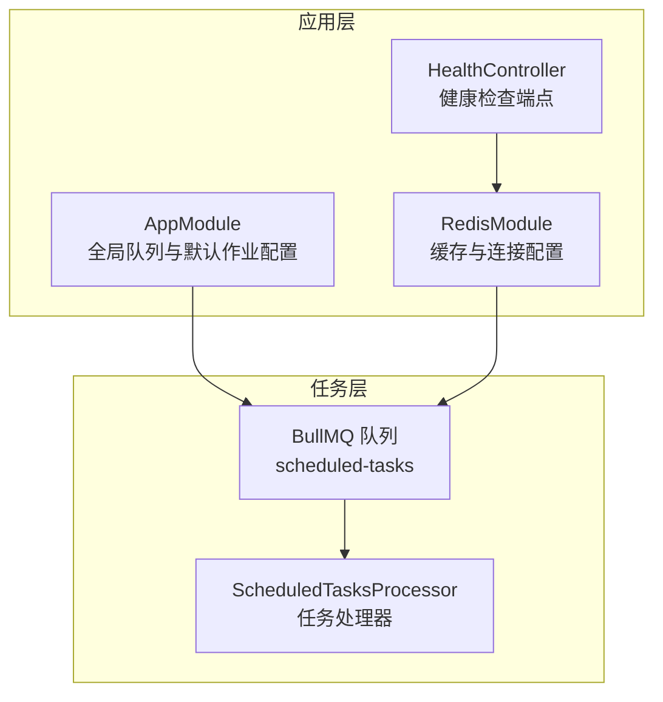
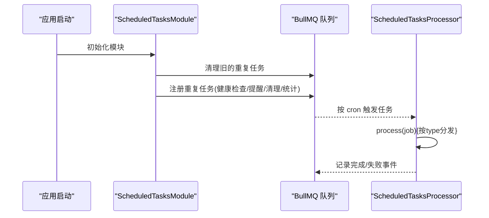
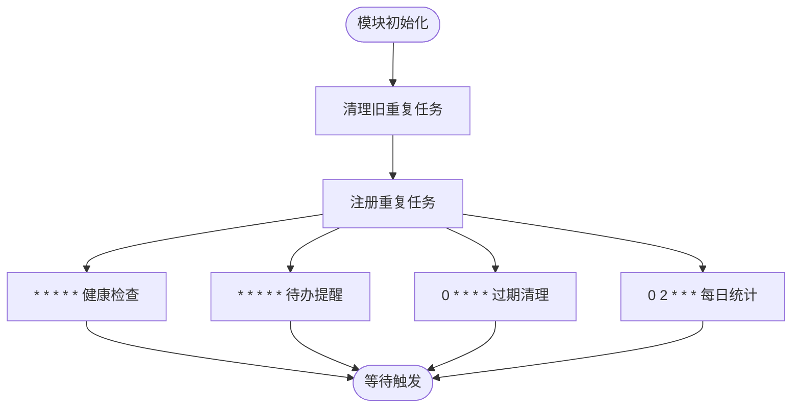
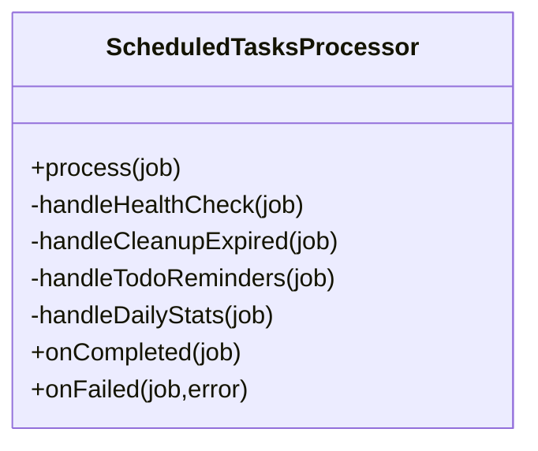
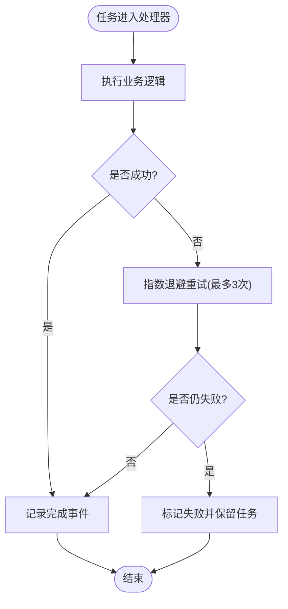
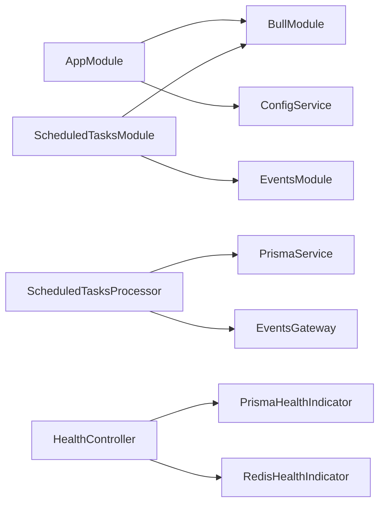
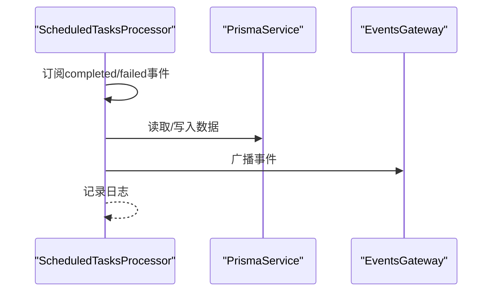

# 后台任务处理

<cite>
**本文引用的文件**
- [apps/backend/src/app.module.ts](file://apps/backend/src/app.module.ts)
- [apps/backend/src/scheduled-tasks/scheduled-tasks.module.ts](file://apps/backend/src/scheduled-tasks/scheduled-tasks.module.ts)
- [apps/backend/src/scheduled-tasks/constants.ts](file://apps/backend/src/scheduled-tasks/constants.ts)
- [apps/backend/src/scheduled-tasks/scheduled-tasks.processor.ts](file://apps/backend/src/scheduled-tasks/scheduled-tasks.processor.ts)
- [apps/backend/src/redis/redis.module.ts](file://apps/backend/src/redis/redis.module.ts)
- [apps/backend/src/redis/redis.service.ts](file://apps/backend/src/redis/redis.service.ts)
- [apps/backend/src/health/health.controller.ts](file://apps/backend/src/health/health.controller.ts)
- [apps/backend/src/health/prisma.health.ts](file://apps/backend/src/health/prisma.health.ts)
- [apps/backend/tests/scheduled-tasks.processor.spec.ts](file://apps/backend/tests/scheduled-tasks.processor.spec.ts)
</cite>

## 目录
1. [简介](#简介)
2. [项目结构](#项目结构)
3. [核心组件](#核心组件)
4. [架构总览](#架构总览)
5. [详细组件分析](#详细组件分析)
6. [依赖关系分析](#依赖关系分析)
7. [性能与并发控制](#性能与并发控制)
8. [故障诊断与审计日志](#故障诊断与审计日志)
9. [结论](#结论)
10. [附录](#附录)

## 简介
本文件面向“后台任务处理系统”的设计与实现，聚焦于基于 BullMQ 的队列配置、任务调度机制、后台处理器实现模式、错误处理策略、任务优先级与重试、死信队列管理、定时任务配置与执行监控、任务持久化与状态跟踪、性能优化与并发控制、审计日志与故障诊断，以及系统资源监控与容量规划建议。文档以仓库中现有实现为依据，结合可扩展的最佳实践给出指导。

## 项目结构
后台任务处理能力由以下模块协同构成：
- 应用根模块集中配置全局队列与默认作业选项
- 定时任务模块注册队列、初始化并使用 BullMQ 的 repeat 功能
- 定时任务处理器按任务类型分发处理逻辑
- Redis 模块提供缓存与连接配置
- 健康检查模块提供数据库与 Redis 健康探测
- 测试用例覆盖处理器行为与错误路径

**图表来源**
- [apps/backend/src/app.module.ts:96-115](file://apps/backend/src/app.module.ts#L96-L115)
- [apps/backend/src/scheduled-tasks/scheduled-tasks.module.ts:15-24](file://apps/backend/src/scheduled-tasks/scheduled-tasks.module.ts#L15-L24)
- [apps/backend/src/scheduled-tasks/scheduled-tasks.processor.ts:36-47](file://apps/backend/src/scheduled-tasks/scheduled-tasks.processor.ts#L36-L47)
- [apps/backend/src/redis/redis.module.ts:26-82](file://apps/backend/src/redis/redis.module.ts#L26-L82)
- [apps/backend/src/health/health.controller.ts:17-76](file://apps/backend/src/health/health.controller.ts#L17-L76)

**章节来源**
- [apps/backend/src/app.module.ts:96-115](file://apps/backend/src/app.module.ts#L96-L115)
- [apps/backend/src/scheduled-tasks/scheduled-tasks.module.ts:15-24](file://apps/backend/src/scheduled-tasks/scheduled-tasks.module.ts#L15-L24)
- [apps/backend/src/scheduled-tasks/scheduled-tasks.processor.ts:36-47](file://apps/backend/src/scheduled-tasks/scheduled-tasks.processor.ts#L36-L47)
- [apps/backend/src/redis/redis.module.ts:26-82](file://apps/backend/src/redis/redis.module.ts#L26-L82)
- [apps/backend/src/health/health.controller.ts:17-76](file://apps/backend/src/health/health.controller.ts#L17-L76)

## 核心组件
- 全局队列与默认作业配置：在应用根模块中通过 BullModule.forRootAsync 配置 Redis 连接与默认作业选项（完成/失败后的清理策略、重试次数、指数退避等）。
- 定时任务模块：注册名为 “scheduled-tasks” 的队列，并在模块初始化时清理旧的重复任务，再注册新的重复任务（健康检查、待办提醒、过期清理、每日统计）。
- 定时任务处理器：基于 @Processor 装饰器，接收任务并按 type 分发到具体处理函数；同时订阅 worker 事件以记录完成/失败日志。
- Redis 缓存模块：提供全局 Redis 连接与缓存服务，支持键前缀、TTL、命名空间等能力，便于任务状态持久化与缓存。
- 健康检查：提供综合健康检查端点，包含数据库、Redis、内存与磁盘探测，辅助任务运行环境监控。

**章节来源**
- [apps/backend/src/app.module.ts:96-115](file://apps/backend/src/app.module.ts#L96-L115)
- [apps/backend/src/scheduled-tasks/scheduled-tasks.module.ts:25-91](file://apps/backend/src/scheduled-tasks/scheduled-tasks.module.ts#L25-L91)
- [apps/backend/src/scheduled-tasks/scheduled-tasks.processor.ts:36-47](file://apps/backend/src/scheduled-tasks/scheduled-tasks.processor.ts#L36-L47)
- [apps/backend/src/redis/redis.module.ts:26-82](file://apps/backend/src/redis/redis.module.ts#L26-L82)
- [apps/backend/src/health/health.controller.ts:31-75](file://apps/backend/src/health/health.controller.ts#L31-L75)

## 架构总览
下图展示从应用启动到任务执行的关键交互流程，包括队列初始化、重复任务注册、任务入队与处理器消费。

**图表来源**
- [apps/backend/src/scheduled-tasks/scheduled-tasks.module.ts:28-91](file://apps/backend/src/scheduled-tasks/scheduled-tasks.module.ts#L28-L91)
- [apps/backend/src/scheduled-tasks/scheduled-tasks.processor.ts:49-68](file://apps/backend/src/scheduled-tasks/scheduled-tasks.processor.ts#L49-L68)

## 详细组件分析

### BullMQ 队列与默认作业配置
- 连接配置：通过 ConfigService 读取 REDIS_HOST、REDIS_PORT、REDIS_PASSWORD 等环境变量，建立 Redis 连接。
- 默认作业选项：
  - removeOnComplete: true，完成后自动清理历史记录，降低存储压力。
  - removeOnFail: false，失败保留任务以便排查。
  - attempts: 3，最大重试次数。
  - backoff: 指数退避，初始延迟 1 秒，避免雪崩。
- 该配置对所有队列生效，包括 “scheduled-tasks”。

**章节来源**
- [apps/backend/src/app.module.ts:96-115](file://apps/backend/src/app.module.ts#L96-L115)

### 定时任务模块与重复任务注册
- 队列名称：SCHEDULED_TASKS_QUEUE = "scheduled-tasks"。
- 模块职责：
  - 注册队列。
  - onModuleInit 生命周期中：
    - 清理旧的重复任务（确保配置变更生效）。
    - 注册新的重复任务，使用 cron 表达式设定周期。
- 已注册任务：
  - 健康检查：每分钟执行。
  - 待办提醒：每分钟执行。
  - 过期清理：每小时执行。
  - 每日统计：每天凌晨 02:00 执行。

**图表来源**
- [apps/backend/src/scheduled-tasks/scheduled-tasks.module.ts:28-91](file://apps/backend/src/scheduled-tasks/scheduled-tasks.module.ts#L28-L91)

**章节来源**
- [apps/backend/src/scheduled-tasks/constants.ts:1-4](file://apps/backend/src/scheduled-tasks/constants.ts#L1-L4)
- [apps/backend/src/scheduled-tasks/scheduled-tasks.module.ts:25-91](file://apps/backend/src/scheduled-tasks/scheduled-tasks.module.ts#L25-L91)

### 定时任务处理器与任务分发
- 处理器装饰器：@Processor(SCHEDULED_TASKS_QUEUE)。
- 任务分发：根据 job.data.type 分派到不同处理函数（健康检查、过期清理、待办提醒、每日统计）。
- 事件钩子：
  - @OnWorkerEvent("completed")：记录任务完成日志。
  - @OnWorkerEvent("failed")：记录任务失败日志。

**图表来源**
- [apps/backend/src/scheduled-tasks/scheduled-tasks.processor.ts:36-47](file://apps/backend/src/scheduled-tasks/scheduled-tasks.processor.ts#L36-L47)
- [apps/backend/src/scheduled-tasks/scheduled-tasks.processor.ts:49-68](file://apps/backend/src/scheduled-tasks/scheduled-tasks.processor.ts#L49-L68)
- [apps/backend/src/scheduled-tasks/scheduled-tasks.processor.ts:280-289](file://apps/backend/src/scheduled-tasks/scheduled-tasks.processor.ts#L280-L289)

**章节来源**
- [apps/backend/src/scheduled-tasks/scheduled-tasks.processor.ts:36-47](file://apps/backend/src/scheduled-tasks/scheduled-tasks.processor.ts#L36-L47)
- [apps/backend/src/scheduled-tasks/scheduled-tasks.processor.ts:49-68](file://apps/backend/src/scheduled-tasks/scheduled-tasks.processor.ts#L49-L68)
- [apps/backend/src/scheduled-tasks/scheduled-tasks.processor.ts:280-289](file://apps/backend/src/scheduled-tasks/scheduled-tasks.processor.ts#L280-L289)

### 错误处理策略与重试机制
- 重试策略：默认作业 attempts=3，backoff=指数退避（初始 1 秒），失败后保留任务（removeOnFail=false）以便后续排查。
- 处理器内部错误：各处理函数均包裹 try/catch，记录错误日志，避免任务中断传播至队列层面。
- 事件钩子：completed/failed 事件统一记录日志，便于审计与告警。

**图表来源**
- [apps/backend/src/app.module.ts:105-113](file://apps/backend/src/app.module.ts#L105-L113)
- [apps/backend/src/scheduled-tasks/scheduled-tasks.processor.ts:82-145](file://apps/backend/src/scheduled-tasks/scheduled-tasks.processor.ts#L82-L145)
- [apps/backend/src/scheduled-tasks/scheduled-tasks.processor.ts:147-190](file://apps/backend/src/scheduled-tasks/scheduled-tasks.processor.ts#L147-L190)
- [apps/backend/src/scheduled-tasks/scheduled-tasks.processor.ts:195-278](file://apps/backend/src/scheduled-tasks/scheduled-tasks.processor.ts#L195-L278)
- [apps/backend/src/scheduled-tasks/scheduled-tasks.processor.ts:280-289](file://apps/backend/src/scheduled-tasks/scheduled-tasks.processor.ts#L280-L289)

**章节来源**
- [apps/backend/src/app.module.ts:105-113](file://apps/backend/src/app.module.ts#L105-L113)
- [apps/backend/src/scheduled-tasks/scheduled-tasks.processor.ts:82-145](file://apps/backend/src/scheduled-tasks/scheduled-tasks.processor.ts#L82-L145)
- [apps/backend/src/scheduled-tasks/scheduled-tasks.processor.ts:147-190](file://apps/backend/src/scheduled-tasks/scheduled-tasks.processor.ts#L147-L190)
- [apps/backend/src/scheduled-tasks/scheduled-tasks.processor.ts:195-278](file://apps/backend/src/scheduled-tasks/scheduled-tasks.processor.ts#L195-L278)
- [apps/backend/src/scheduled-tasks/scheduled-tasks.processor.ts:280-289](file://apps/backend/src/scheduled-tasks/scheduled-tasks.processor.ts#L280-L289)

### 死信队列管理
- 当前实现未显式配置 dead letter queue（DLQ）。失败任务会保留（removeOnFail=false），可在监控中识别并人工干预。
- 如需引入 DLQ，可在队列/作业选项中增加 deadLetter、maxStalledCount 等配置，并在处理器中区分普通失败与死信失败场景。

**章节来源**
- [apps/backend/src/app.module.ts:105-113](file://apps/backend/src/app.module.ts#L105-L113)

### 任务优先级与并发控制
- 代码中未显式设置任务优先级字段。若需要优先级，可在 add 时传入 opts.priority 或在队列侧配置限流/并发。
- 并发控制：可通过 WorkerHost 的并发度与队列配置共同约束，避免过度并发导致资源争用。

**章节来源**
- [apps/backend/src/scheduled-tasks/scheduled-tasks.module.ts:39-91](file://apps/backend/src/scheduled-tasks/scheduled-tasks.module.ts#L39-L91)

### 定时任务配置与执行监控
- 配置方式：在模块初始化时调用 queue.add(..., { repeat: { pattern: "..."} })。
- 执行监控：处理器订阅 completed/failed 事件并记录日志；健康检查端点可监控数据库与 Redis 状态。

**章节来源**
- [apps/backend/src/scheduled-tasks/scheduled-tasks.module.ts:39-91](file://apps/backend/src/scheduled-tasks/scheduled-tasks.module.ts#L39-L91)
- [apps/backend/src/scheduled-tasks/scheduled-tasks.processor.ts:280-289](file://apps/backend/src/scheduled-tasks/scheduled-tasks.processor.ts#L280-L289)
- [apps/backend/src/health/health.controller.ts:31-75](file://apps/backend/src/health/health.controller.ts#L31-L75)

### 任务持久化与状态跟踪
- 任务持久化：BullMQ 将作业元数据、状态与历史记录存储在 Redis 中，配合 removeOnComplete/removeOnFail 控制历史清理。
- 状态跟踪：处理器通过日志记录任务生命周期事件；业务状态（如待办提醒标记）写入数据库，形成最终一致性。

**章节来源**
- [apps/backend/src/app.module.ts:105-113](file://apps/backend/src/app.module.ts#L105-L113)
- [apps/backend/src/scheduled-tasks/scheduled-tasks.processor.ts:147-190](file://apps/backend/src/scheduled-tasks/scheduled-tasks.processor.ts#L147-L190)

### 性能优化建议
- 重试与退避：保持默认指数退避，避免瞬时峰值。
- 任务批处理：对批量写入（如提醒广播）采用分批处理，减少一次性负载。
- 并发与限流：根据 CPU/IO 与 Redis 压力调整 Worker 并发度与队列限速。
- 缓存与去重：利用 Redis 缓存热点数据，避免重复计算；对重复任务使用唯一 key 防抖。

**章节来源**
- [apps/backend/src/app.module.ts:105-113](file://apps/backend/src/app.module.ts#L105-L113)
- [apps/backend/src/scheduled-tasks/scheduled-tasks.processor.ts:147-190](file://apps/backend/src/scheduled-tasks/scheduled-tasks.processor.ts#L147-L190)

## 依赖关系分析
- 应用根模块依赖 BullModule 与 ConfigService 提供全局队列配置。
- 定时任务模块依赖 BullModule.registerQueue 与 EventsModule。
- 处理器依赖 PrismaService 与 EventsGateway，分别用于数据持久化与事件广播。
- 健康检查模块依赖 PrismaHealthIndicator 与 RedisHealthIndicator。

**图表来源**
- [apps/backend/src/app.module.ts:27-161](file://apps/backend/src/app.module.ts#L27-L161)
- [apps/backend/src/scheduled-tasks/scheduled-tasks.module.ts:15-24](file://apps/backend/src/scheduled-tasks/scheduled-tasks.module.ts#L15-L24)
- [apps/backend/src/scheduled-tasks/scheduled-tasks.processor.ts:40-44](file://apps/backend/src/scheduled-tasks/scheduled-tasks.processor.ts#L40-L44)
- [apps/backend/src/health/health.controller.ts:19-25](file://apps/backend/src/health/health.controller.ts#L19-L25)

**章节来源**
- [apps/backend/src/app.module.ts:27-161](file://apps/backend/src/app.module.ts#L27-L161)
- [apps/backend/src/scheduled-tasks/scheduled-tasks.module.ts:15-24](file://apps/backend/src/scheduled-tasks/scheduled-tasks.module.ts#L15-L24)
- [apps/backend/src/scheduled-tasks/scheduled-tasks.processor.ts:40-44](file://apps/backend/src/scheduled-tasks/scheduled-tasks.processor.ts#L40-L44)
- [apps/backend/src/health/health.controller.ts:19-25](file://apps/backend/src/health/health.controller.ts#L19-L25)

## 性能与并发控制
- 默认重试与退避：避免任务雪崩，提升系统稳定性。
- 批量处理：对提醒广播等操作限制每次处理数量，降低瞬时压力。
- 并发度：根据 CPU/IO 与 Redis 压力动态调整 Worker 并发，避免资源争用。
- 缓存：对热点查询使用 Redis 缓存，减少数据库压力。

**章节来源**
- [apps/backend/src/app.module.ts:105-113](file://apps/backend/src/app.module.ts#L105-L113)
- [apps/backend/src/scheduled-tasks/scheduled-tasks.processor.ts:147-190](file://apps/backend/src/scheduled-tasks/scheduled-tasks.processor.ts#L147-L190)

## 故障诊断与审计日志
- 任务事件日志：处理器订阅 completed/failed 事件，统一记录任务 ID、名称与错误信息。
- 业务错误日志：各处理函数内部 try/catch 记录错误详情，便于定位问题。
- 健康检查：提供综合健康检查端点，包含数据库、Redis、内存与磁盘探测，辅助快速定位基础设施问题。
- 单元测试：测试用例覆盖每日统计聚合与错误路径，验证日志输出与异常处理。

**图表来源**
- [apps/backend/src/scheduled-tasks/scheduled-tasks.processor.ts:280-289](file://apps/backend/src/scheduled-tasks/scheduled-tasks.processor.ts#L280-L289)
- [apps/backend/src/scheduled-tasks/scheduled-tasks.processor.ts:147-190](file://apps/backend/src/scheduled-tasks/scheduled-tasks.processor.ts#L147-L190)
- [apps/backend/src/health/health.controller.ts:31-75](file://apps/backend/src/health/health.controller.ts#L31-L75)

**章节来源**
- [apps/backend/src/scheduled-tasks/scheduled-tasks.processor.ts:280-289](file://apps/backend/src/scheduled-tasks/scheduled-tasks.processor.ts#L280-L289)
- [apps/backend/src/scheduled-tasks/scheduled-tasks.processor.ts:147-190](file://apps/backend/src/scheduled-tasks/scheduled-tasks.processor.ts#L147-L190)
- [apps/backend/src/health/health.controller.ts:31-75](file://apps/backend/src/health/health.controller.ts#L31-L75)
- [apps/backend/tests/scheduled-tasks.processor.spec.ts:49-94](file://apps/backend/tests/scheduled-tasks.processor.spec.ts#L49-L94)

## 结论
本系统基于 BullMQ 实现了可靠的定时任务调度与后台处理能力，具备完善的默认重试与日志记录机制。通过 Redis 持久化与健康检查端点，能够有效保障任务执行的可观测性与系统稳定性。建议在现有基础上引入死信队列、任务优先级与更细粒度的并发控制，以进一步提升可靠性与性能。

## 附录
- 环境变量参考（来自全局队列配置）：
  - REDIS_HOST、REDIS_PORT、REDIS_PASSWORD
- 健康检查端点：
  - GET /health（综合健康）
  - GET /health/liveness（存活探针）
  - GET /health/readiness（就绪探针）

**章节来源**
- [apps/backend/src/app.module.ts:96-115](file://apps/backend/src/app.module.ts#L96-L115)
- [apps/backend/src/health/health.controller.ts:31-75](file://apps/backend/src/health/health.controller.ts#L31-L75)