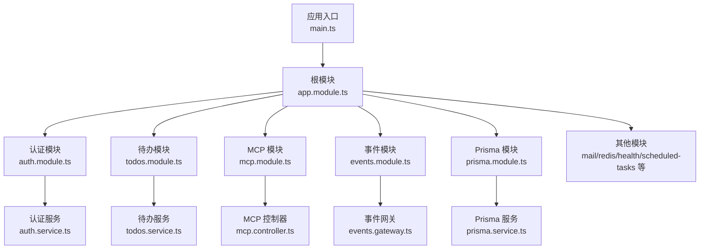
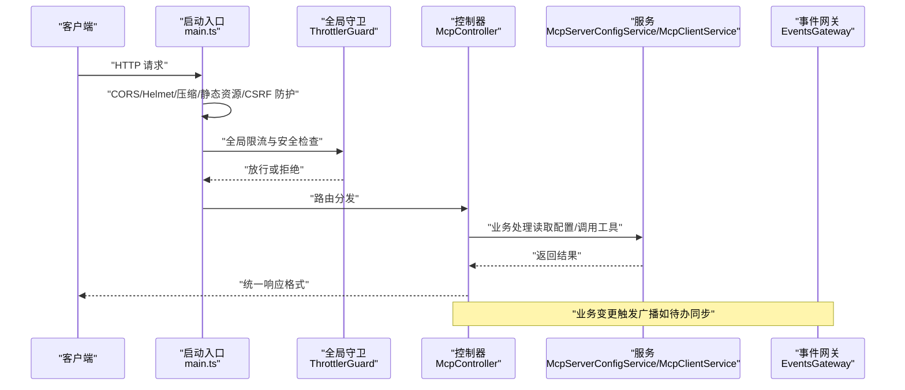
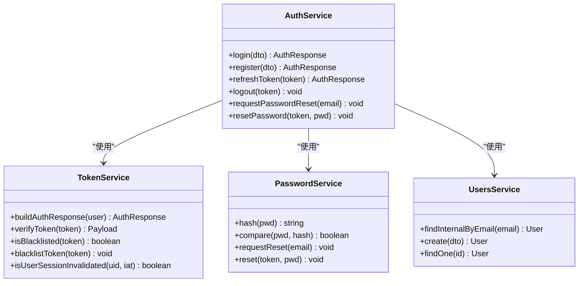
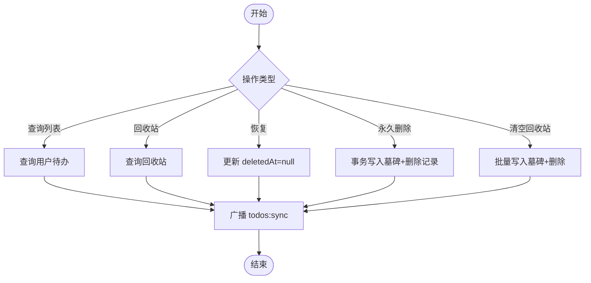
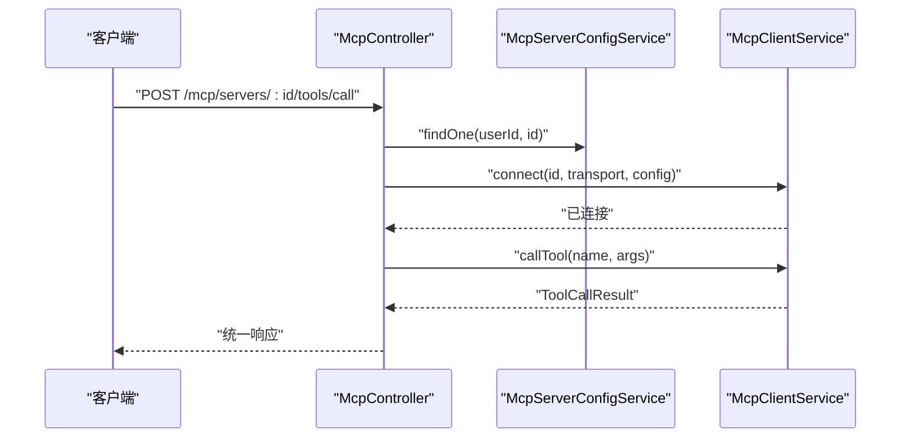
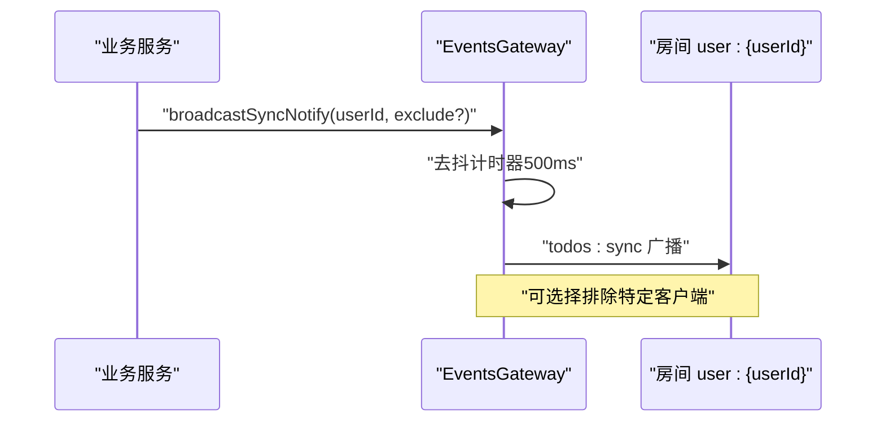
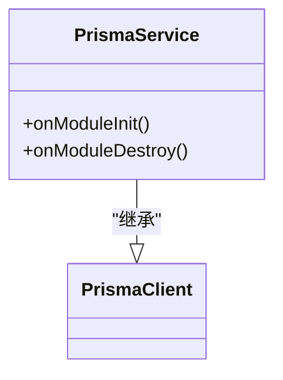
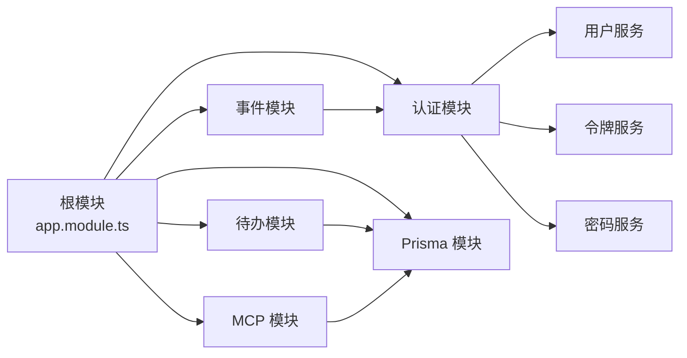

# 后端开发

<cite>
**本文引用的文件**
- [apps/backend/src/app.module.ts](file://apps/backend/src/app.module.ts)
- [apps/backend/src/main.ts](file://apps/backend/src/main.ts)
- [apps/backend/package.json](file://apps/backend/package.json)
- [apps/backend/prisma.config.js](file://apps/backend/prisma.config.js)
- [apps/backend/nest-cli.json](file://apps/backend/nest-cli.json)
- [apps/backend/src/auth/auth.module.ts](file://apps/backend/src/auth/auth.module.ts)
- [apps/backend/src/auth/auth.service.ts](file://apps/backend/src/auth/auth.service.ts)
- [apps/backend/src/todos/todos.module.ts](file://apps/backend/src/todos/todos.module.ts)
- [apps/backend/src/todos/todos.service.ts](file://apps/backend/src/todos/todos.service.ts)
- [apps/backend/src/mcp/mcp.module.ts](file://apps/backend/src/mcp/mcp.module.ts)
- [apps/backend/src/mcp/mcp.controller.ts](file://apps/backend/src/mcp/mcp.controller.ts)
- [apps/backend/src/events/events.module.ts](file://apps/backend/src/events/events.module.ts)
- [apps/backend/src/events/events.gateway.ts](file://apps/backend/src/events/events.gateway.ts)
- [apps/backend/src/prisma/prisma.module.ts](file://apps/backend/src/prisma/prisma.module.ts)
- [apps/backend/src/prisma/prisma.service.ts](file://apps/backend/src/prisma/prisma.service.ts)
</cite>

## 目录
1. [简介](#简介)
2. [项目结构](#项目结构)
3. [核心组件](#核心组件)
4. [架构总览](#架构总览)
5. [详细组件分析](#详细组件分析)
6. [依赖关系分析](#依赖关系分析)
7. [性能考虑](#性能考虑)
8. [故障排查指南](#故障排查指南)
9. [结论](#结论)
10. [附录](#附录)

## 简介
本指南面向 Lumina Todo 后端开发者，系统性阐述基于 NestJS 的应用架构、模块系统、依赖注入、控制器-服务-仓储三层模式，以及核心业务模块（用户认证、待办事项管理、MCP 协议集成、实时通信）的设计与实现要点。同时覆盖 API 设计规范、错误处理策略、数据库设计与 Prisma ORM 使用、中间件/拦截器/守卫的实现模式、定时任务与后台作业、性能优化与监控、安全最佳实践与 API 版本管理策略。

## 项目结构
后端采用多包工作区组织，核心应用位于 apps/backend。项目结构遵循按功能域划分的模块化组织方式，便于扩展与维护。

- 根模块与启动入口
  - 根模块负责导入与装配各业务模块、基础设施模块与全局中间件/拦截器/守卫。
  - 启动入口负责创建 Nest 应用实例、注册 Fastify 插件、设置 CORS/Helmet/压缩/静态资源、全局管道与过滤器、Swagger 文档、优雅退出钩子等。

- 模块化组织
  - 认证模块：整合 JWT、Passport、邮件、Redis、用户服务，提供登录、注册、令牌刷新/注销、密码重置等能力。
  - 待办事项模块：围绕 Todo 实体进行增删改查、回收站、永久删除、清空回收站与同步广播。
  - MCP 模块：封装 MCP 服务器配置、传输工厂、连接管理、工具注册与远程工具调用。
  - 实时通信模块：基于 Socket.IO 的 WebSocket 网关，支持房间、广播、鉴权与去抖广播。
  - 基础设施模块：Prisma 数据库访问层、Redis 缓存、健康检查、国际化、队列（BullMQ）、日志（Pino）、限流（Throttler）等。

图表来源
- [apps/backend/src/app.module.ts:1-175](file://apps/backend/src/app.module.ts#L1-L175)
- [apps/backend/src/main.ts:1-201](file://apps/backend/src/main.ts#L1-L201)
- [apps/backend/src/auth/auth.module.ts:1-41](file://apps/backend/src/auth/auth.module.ts#L1-L41)
- [apps/backend/src/todos/todos.module.ts:1-15](file://apps/backend/src/todos/todos.module.ts#L1-L15)
- [apps/backend/src/mcp/mcp.module.ts:1-25](file://apps/backend/src/mcp/mcp.module.ts#L1-L25)
- [apps/backend/src/events/events.module.ts:1-15](file://apps/backend/src/events/events.module.ts#L1-L15)
- [apps/backend/src/prisma/prisma.module.ts:1-10](file://apps/backend/src/prisma/prisma.module.ts#L1-L10)

章节来源
- [apps/backend/src/app.module.ts:1-175](file://apps/backend/src/app.module.ts#L1-L175)
- [apps/backend/src/main.ts:1-201](file://apps/backend/src/main.ts#L1-L201)
- [apps/backend/nest-cli.json:1-11](file://apps/backend/nest-cli.json#L1-L11)

## 核心组件
- 依赖注入与模块系统
  - NestJS 通过 @Module 装配模块，利用 @Inject/@Injectable/@Global 实现依赖注入与跨模块导出。
  - 根模块集中导入配置模块、日志模块、事件发射器、队列、限流、国际化、数据库、缓存、健康检查、业务模块等。
  - 全局守卫（ThrottlerGuard）、拦截器（Transform/Sanitize）、过滤器（AllExceptionsFilter）在启动阶段注册，保证统一行为。

- 控制器-服务-仓储三层架构
  - 控制器仅处理请求参数校验、鉴权与调用服务；服务聚合业务逻辑；仓储由 Prisma 服务承担，提供类型安全的数据访问。
  - 示例：认证模块中 AuthController -> AuthService -> TokenService/PasswordService/PrismaService；待办模块 TodosController -> TodosService -> PrismaService。

- 中间件、拦截器、守卫
  - 中间件：在 main.ts 中注册 Fastify 插件（Helmet、Cookie、Compress、Multipart），并自定义 onRequest 钩子进行 CSRF 防护。
  - 守卫：全局 ThrottlerGuard；认证场景使用 JwtAuthGuard。
  - 拦截器：Zod 验证管道、统一响应转换、XSS 清理。

章节来源
- [apps/backend/src/app.module.ts:162-168](file://apps/backend/src/app.module.ts#L162-L168)
- [apps/backend/src/main.ts:159-169](file://apps/backend/src/main.ts#L159-L169)
- [apps/backend/src/auth/auth.module.ts:19-39](file://apps/backend/src/auth/auth.module.ts#L19-L39)
- [apps/backend/src/todos/todos.module.ts:8-14](file://apps/backend/src/todos/todos.module.ts#L8-L14)

## 架构总览
下图展示应用启动到请求处理的关键路径，包括安全中间件、全局管道、模块装配与业务处理流程。

图表来源
- [apps/backend/src/main.ts:48-157](file://apps/backend/src/main.ts#L48-L157)
- [apps/backend/src/mcp/mcp.controller.ts:34-198](file://apps/backend/src/mcp/mcp.controller.ts#L34-L198)
- [apps/backend/src/events/events.gateway.ts:180-202](file://apps/backend/src/events/events.gateway.ts#L180-L202)

## 详细组件分析

### 认证模块（Auth）
- 组件职责
  - 用户登录/注册、JWT 签发与刷新、令牌注销、密码重置与哈希。
  - 与用户服务、令牌服务、密码服务协作，形成 Facade 层。
- 关键流程
  - 登录：校验凭据 -> 生成访问/刷新令牌 -> 返回统一响应。
  - 刷新：校验刷新令牌有效性、用户会话未失效 -> 重新签发令牌。
  - 注销：将刷新令牌加入黑名单。
- 安全要点
  - 严格区分访问令牌与刷新令牌类型，刷新令牌黑名单与会话失效校验。
  - 异常统一转为未授权异常，避免泄露内部错误。

图表来源
- [apps/backend/src/auth/auth.service.ts:12-127](file://apps/backend/src/auth/auth.service.ts#L12-L127)
- [apps/backend/src/auth/auth.module.ts:19-39](file://apps/backend/src/auth/auth.module.ts#L19-L39)

章节来源
- [apps/backend/src/auth/auth.module.ts:1-41](file://apps/backend/src/auth/auth.module.ts#L1-L41)
- [apps/backend/src/auth/auth.service.ts:1-127](file://apps/backend/src/auth/auth.service.ts#L1-L127)

### 待办事项模块（Todos）
- 组件职责
  - 查询用户待办列表、回收站、恢复、永久删除、清空回收站。
  - 变更后通过事件网关广播“todos:sync”事件，触发前端同步。
- 数据访问
  - 使用 PrismaService 进行查询与事务操作，确保一致性。
- 广播策略
  - 采用 500ms 去抖策略，避免频繁广播导致的性能问题。

图表来源
- [apps/backend/src/todos/todos.service.ts:26-146](file://apps/backend/src/todos/todos.service.ts#L26-L146)
- [apps/backend/src/events/events.gateway.ts:180-202](file://apps/backend/src/events/events.gateway.ts#L180-L202)

章节来源
- [apps/backend/src/todos/todos.module.ts:1-15](file://apps/backend/src/todos/todos.module.ts#L1-L15)
- [apps/backend/src/todos/todos.service.ts:1-146](file://apps/backend/src/todos/todos.service.ts#L1-L146)

### MCP 协议模块（MCP）
- 组件职责
  - 管理用户级 MCP 服务器配置（创建/查询/更新/删除/连接/断开）。
  - 动态发现与调用工具，支持懒连接与错误降级。
- 控制器接口
  - 服务器管理：POST/GET/PUT/DELETE /mcp/servers
  - 工具发现与调用：GET /mcp/tools、GET/POST /mcp/servers/:id/tools、POST /mcp/servers/:id/tools/call
  - 连接控制：POST /mcp/servers/:id/connect、POST /mcp/servers/:id/disconnect
- 安全与鉴权
  - 使用 JwtAuthGuard 保护接口；每个操作均校验用户对服务器配置的所有权。

图表来源
- [apps/backend/src/mcp/mcp.controller.ts:180-196](file://apps/backend/src/mcp/mcp.controller.ts#L180-L196)

章节来源
- [apps/backend/src/mcp/mcp.module.ts:1-25](file://apps/backend/src/mcp/mcp.module.ts#L1-L25)
- [apps/backend/src/mcp/mcp.controller.ts:1-198](file://apps/backend/src/mcp/mcp.controller.ts#L1-L198)

### 实时通信模块（Events）
- 组件职责
  - 基于 Socket.IO 的 WebSocket 网关，支持鉴权、房间、广播、去抖广播。
  - 对外暴露广播方法，供业务服务触发同步事件。
- 鉴权与房间
  - 握手阶段校验访问令牌并检查会话是否失效；自动加入用户私有房间 user:{userId}。
- 广播去抖
  - 500ms 内多次变更合并为一次广播，降低网络与 CPU 开销。

图表来源
- [apps/backend/src/events/events.gateway.ts:180-202](file://apps/backend/src/events/events.gateway.ts#L180-L202)

章节来源
- [apps/backend/src/events/events.module.ts:1-15](file://apps/backend/src/events/events.module.ts#L1-L15)
- [apps/backend/src/events/events.gateway.ts:1-266](file://apps/backend/src/events/events.gateway.ts#L1-L266)

### 数据库与 Prisma ORM
- 设计原则
  - 使用 Prisma 管理实体与迁移，遵循最小暴露字段的选择（select）策略，减少序列化开销。
  - 事务边界明确，如“永久删除”与“清空回收站”使用事务保证墓碑与主表一致性。
- 连接与生命周期
  - PrismaService 基于 Pg Pool 连接池，模块初始化与销毁时负责连接与资源释放。
- 配置与脚本
  - prisma.config.js 指定 schema、datasource、migrations 路径；package.json 提供 generate/push/migrate/studio 脚本。

图表来源
- [apps/backend/src/prisma/prisma.service.ts:6-34](file://apps/backend/src/prisma/prisma.service.ts#L6-L34)

章节来源
- [apps/backend/src/prisma/prisma.module.ts:1-10](file://apps/backend/src/prisma/prisma.module.ts#L1-L10)
- [apps/backend/src/prisma/prisma.service.ts:1-34](file://apps/backend/src/prisma/prisma.service.ts#L1-L34)
- [apps/backend/prisma.config.js:1-22](file://apps/backend/prisma.config.js#L1-L22)
- [apps/backend/package.json:25-28](file://apps/backend/package.json#L25-L28)

## 依赖关系分析
- 模块耦合
  - 根模块集中导入各子模块，形成清晰的依赖树；业务模块之间尽量低耦合，通过服务接口交互。
  - 认证模块与用户模块存在循环依赖，使用 forwardRef 解决。
- 外部依赖
  - Fastify 生态（Helmet、Cookie、Compress、Multipart、Static）提升性能与安全性。
  - BullMQ 用于后台任务与队列；Pino 用于高性能日志；I18n 用于国际化；Swagger 用于 API 文档。

图表来源
- [apps/backend/src/app.module.ts:19-22](file://apps/backend/src/app.module.ts#L19-L22)
- [apps/backend/src/auth/auth.module.ts:13-14](file://apps/backend/src/auth/auth.module.ts#L13-L14)
- [apps/backend/src/todos/todos.module.ts:5-6](file://apps/backend/src/todos/todos.module.ts#L5-L6)
- [apps/backend/src/mcp/mcp.module.ts:5-7](file://apps/backend/src/mcp/mcp.module.ts#L5-L7)
- [apps/backend/src/events/events.module.ts:3](file://apps/backend/src/events/events.module.ts#L3-L3)

章节来源
- [apps/backend/src/app.module.ts:1-175](file://apps/backend/src/app.module.ts#L1-L175)
- [apps/backend/src/auth/auth.module.ts:1-41](file://apps/backend/src/auth/auth.module.ts#L1-L41)

## 性能考虑
- 传输与压缩
  - 启用 gzip 压缩与静态资源服务，降低带宽占用。
- 限流与安全
  - 全局限流策略（短/中/长窗口）防止滥用；Helmet 提升安全基线；CSRF 防护拦截缺失头的请求。
- 数据访问
  - 使用 select 精确投影字段；批量写入墓碑与删除结合事务，减少往返。
- 广播去抖
  - 500ms 去抖减少重复广播，平衡实时性与性能。
- 日志与可观测性
  - Pino 结构化日志，按状态码动态日志级别；结合 Swagger 文档与健康检查端点便于运维。

章节来源
- [apps/backend/src/main.ts:84-121](file://apps/backend/src/main.ts#L84-L121)
- [apps/backend/src/todos/todos.service.ts:96-144](file://apps/backend/src/todos/todos.service.ts#L96-L144)
- [apps/backend/src/events/events.gateway.ts:180-202](file://apps/backend/src/events/events.gateway.ts#L180-L202)

## 故障排查指南
- 启动与环境
  - 确认 DATABASE_URL、JWT_SECRET、REDIS_* 等环境变量；检查 Prisma 配置与迁移状态。
- 认证问题
  - 刷新令牌无效：检查黑名单、会话失效校验、令牌类型；关注统一未授权异常输出。
- WebSocket 问题
  - 鉴权失败：确认握手携带有效访问令牌且未失效；检查 CORS 配置与 Origin 白名单。
- API 文档与测试
  - Swagger 文档地址与版本号；使用测试脚本与 e2e 测试定位问题。

章节来源
- [apps/backend/src/main.ts:195-200](file://apps/backend/src/main.ts#L195-L200)
- [apps/backend/src/auth/auth.service.ts:59-101](file://apps/backend/src/auth/auth.service.ts#L59-L101)
- [apps/backend/src/events/events.gateway.ts:86-116](file://apps/backend/src/events/events.gateway.ts#L86-L116)
- [apps/backend/package.json:25-28](file://apps/backend/package.json#L25-L28)

## 结论
本项目以 NestJS 为核心，采用模块化与依赖注入构建高内聚、低耦合的后端架构。通过统一的全局中间件/拦截器/守卫与 Prisma ORM，保障了安全性、可维护性与性能。认证、待办、MCP、实时通信等核心模块清晰分离，配合 Swagger 文档与健康检查，便于团队协作与长期演进。

## 附录
- API 设计规范
  - 统一响应格式（成功/失败、数据、消息、状态码、时间戳）；使用 Zod 验证管道替代 class-validator。
  - Swagger 文档自动生成，结合 cleanupOpenApiDoc 规范化输出。
- 错误处理策略
  - 全局异常过滤器捕获未处理异常；认证相关统一抛出未授权异常；CSRF 缺失头直接拒绝。
- 安全最佳实践
  - Helmet 安全头、CORS 白名单、XSS 清理、Gzip 压缩、限流、访问令牌鉴权。
- API 版本管理
  - 当前通过全局前缀 api 与 Swagger 版本号体现；建议后续引入路径版本（/api/v1/...）或媒体类型版本协商。

章节来源
- [apps/backend/src/main.ts:162-180](file://apps/backend/src/main.ts#L162-L180)
- [apps/backend/src/common/filters/all-exceptions.filter.ts](file://apps/backend/src/common/filters/all-exceptions.filter.ts)
- [apps/backend/src/common/interceptors/transform.interceptor.ts](file://apps/backend/src/common/interceptors/transform.interceptor.ts)
- [apps/backend/src/common/interceptors/sanitize.interceptor.ts](file://apps/backend/src/common/interceptors/sanitize.interceptor.ts)