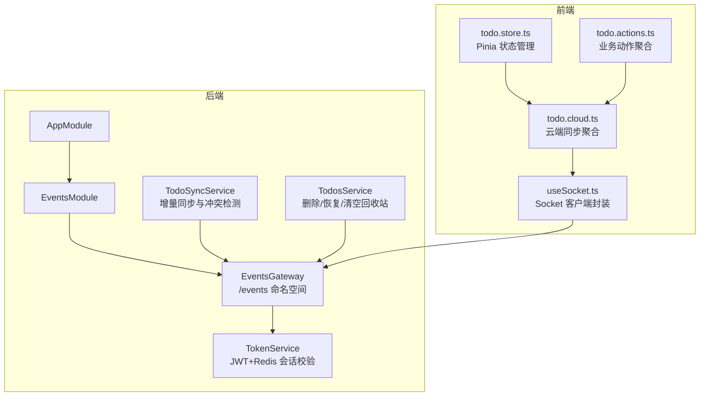
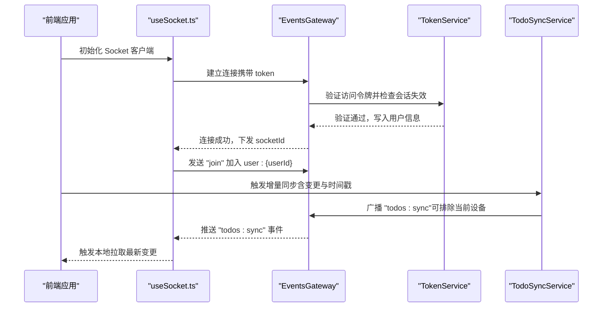
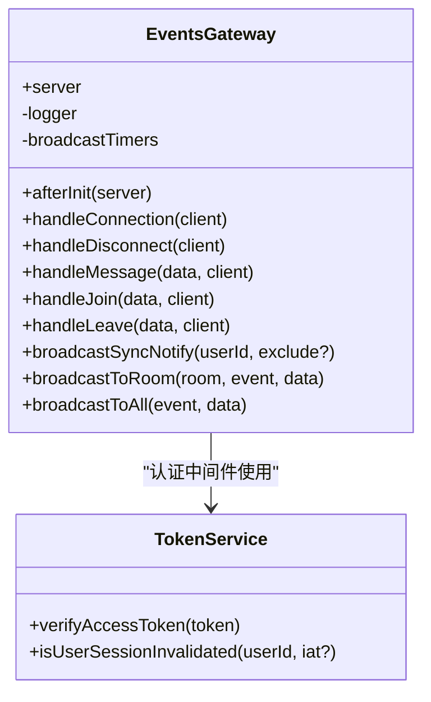
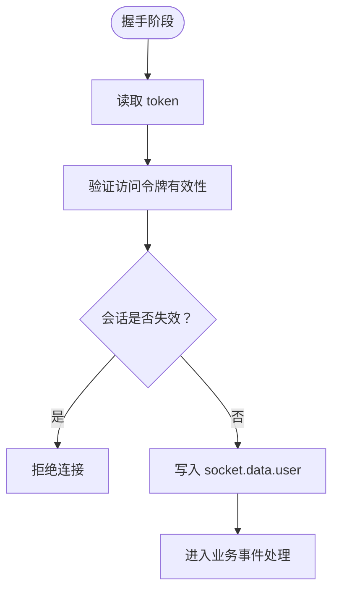
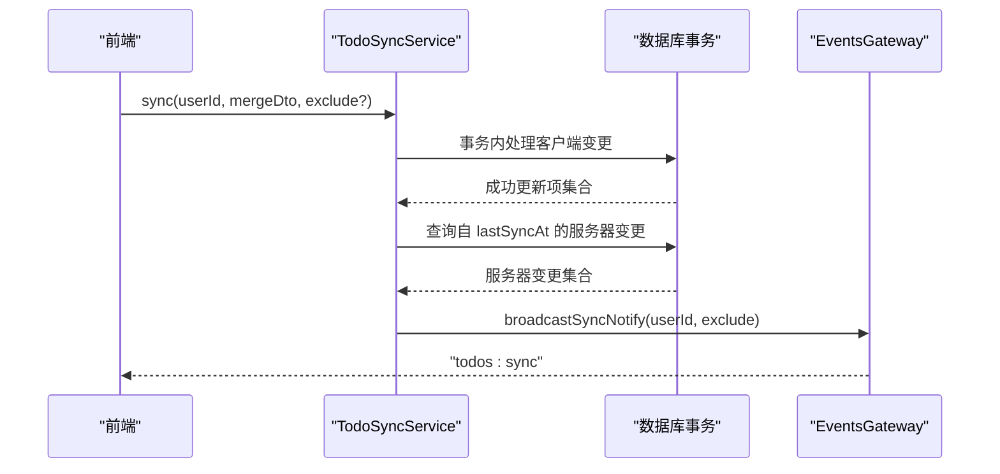
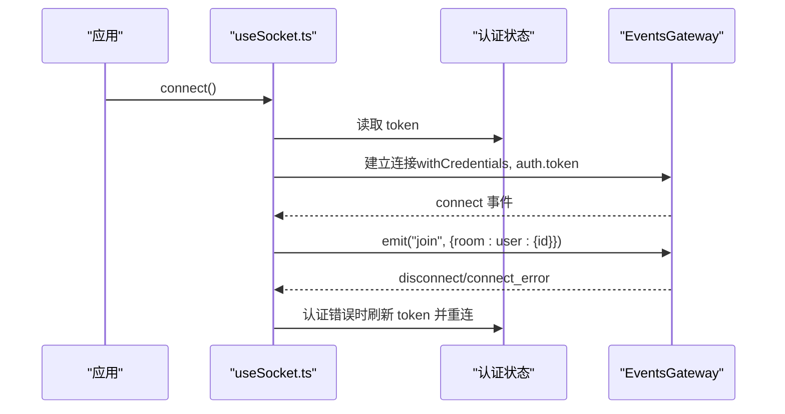
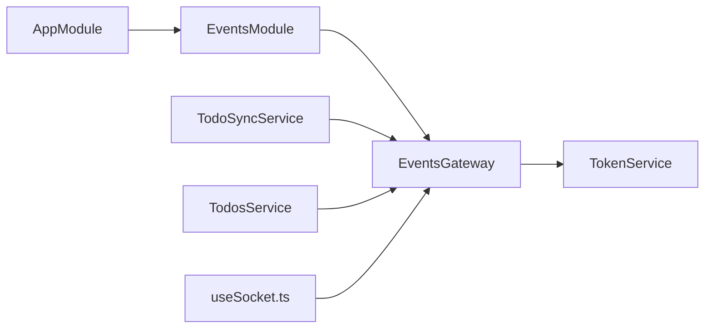

# 实时通信模块

<cite>
**本文引用的文件**
- [apps/backend/src/events/events.gateway.ts](file://apps/backend/src/events/events.gateway.ts)
- [apps/backend/src/events/events.module.ts](file://apps/backend/src/events/events.module.ts)
- [apps/backend/src/app.module.ts](file://apps/backend/src/app.module.ts)
- [apps/backend/src/auth/token.service.ts](file://apps/backend/src/auth/token.service.ts)
- [apps/backend/src/todos/todos-sync.service.ts](file://apps/backend/src/todos/todos-sync.service.ts)
- [apps/backend/src/todos/todos.service.ts](file://apps/backend/src/todos/todos.service.ts)
- [apps/frontend/src/composables/useSocket.ts](file://apps/frontend/src/composables/useSocket.ts)
- [apps/frontend/src/features/todo/stores/todo.store.ts](file://apps/frontend/src/features/todo/stores/todo.store.ts)
- [apps/frontend/src/features/todo/stores/todo.cloud.ts](file://apps/frontend/src/features/todo/stores/todo.cloud.ts)
- [apps/frontend/src/features/todo/stores/todo.actions.ts](file://apps/frontend/src/features/todo/stores/todo.actions.ts)
</cite>

## 目录
1. [简介](#简介)
2. [项目结构](#项目结构)
3. [核心组件](#核心组件)
4. [架构总览](#架构总览)
5. [详细组件分析](#详细组件分析)
6. [依赖关系分析](#依赖关系分析)
7. [性能考虑](#性能考虑)
8. [故障排除指南](#故障排除指南)
9. [结论](#结论)
10. [附录](#附录)

## 简介
本技术文档聚焦于实时通信模块，围绕 WebSocket 事件系统展开，涵盖事件网关的架构设计与实现原理、客户端连接管理、实时数据同步触发与更新策略、广播机制、房间管理与用户状态跟踪、心跳与断线重连、消息确认机制、事件类型与消息格式规范、性能优化与内存管理，以及监控与故障排除建议。文档以代码为依据，结合序列图与类图帮助读者快速理解系统行为。

## 项目结构
实时通信模块由后端 NestJS 的 WebSocket 网关与前端 Vue 组合式函数共同构成，采用 Socket.IO 协议，后端通过认证中间件保障安全，前端负责连接生命周期管理与事件监听。

**图表来源**
- [apps/backend/src/events/events.gateway.ts:57-266](file://apps/backend/src/events/events.gateway.ts#L57-L266)
- [apps/backend/src/events/events.module.ts:1-15](file://apps/backend/src/events/events.module.ts#L1-L15)
- [apps/backend/src/app.module.ts:17-161](file://apps/backend/src/app.module.ts#L17-L161)
- [apps/backend/src/auth/token.service.ts:1-187](file://apps/backend/src/auth/token.service.ts#L1-L187)
- [apps/backend/src/todos/todos-sync.service.ts:1-221](file://apps/backend/src/todos/todos-sync.service.ts#L1-L221)
- [apps/backend/src/todos/todos.service.ts:1-146](file://apps/backend/src/todos/todos.service.ts#L1-L146)
- [apps/frontend/src/composables/useSocket.ts:1-176](file://apps/frontend/src/composables/useSocket.ts#L1-L176)
- [apps/frontend/src/features/todo/stores/todo.store.ts:1-335](file://apps/frontend/src/features/todo/stores/todo.store.ts#L1-L335)
- [apps/frontend/src/features/todo/stores/todo.cloud.ts:1-44](file://apps/frontend/src/features/todo/stores/todo.cloud.ts#L1-L44)
- [apps/frontend/src/features/todo/stores/todo.actions.ts:1-105](file://apps/frontend/src/features/todo/stores/todo.actions.ts#L1-L105)

**章节来源**
- [apps/backend/src/events/events.module.ts:1-15](file://apps/backend/src/events/events.module.ts#L1-L15)
- [apps/backend/src/app.module.ts:17-161](file://apps/backend/src/app.module.ts#L17-L161)

## 核心组件
- 事件网关（EventsGateway）
  - 基于 @nestjs/websockets 与 socket.io，提供 /events 命名空间，启用 polling 与 websocket 传输。
  - 认证中间件：从握手或头部提取令牌，验证并检查会话是否失效；通过后写入 socket.data.user。
  - 房间管理：自动将已认证用户加入 user:{userId} 房间；支持 join/leave 事件；房间权限校验确保用户只能进入自己的房间。
  - 广播与通知：提供向房间/全服广播方法；对“待办事项同步”场景提供去抖广播（500ms）以降低风暴。
  - 生命周期：记录连接/断开；模块销毁时清理定时器。
- 认证服务（TokenService）
  - JWT 生成与验证；基于 Redis 的会话失效标记与令牌黑名单辅助。
  - 与网关认证中间件配合，确保连接阶段的安全性。
- 待办同步服务（TodoSyncService）
  - 增量同步与合并：事务内处理客户端推送变更，冲突检测（墓碑、归属、版本号），生成服务器变更集，返回合并结果与冲突列表。
  - 触发同步通知：当有成功更新项时，调用网关广播“todos:sync”，通知用户其他在线设备进行拉取。
- 待办基础服务（TodosService）
  - 删除/恢复/清空回收站等操作完成后，统一调用网关广播“todos:sync”，确保多端一致。
- 前端 Socket 封装（useSocket）
  - 初始化 socket.io 客户端，设置命名空间与传输参数；自动连接、断线重连、认证错误自动刷新令牌并重连。
  - 连接建立后自动加入 user:{userId} 房间；监听断开事件清理状态。
- 前端 Todo 状态与云同步（todo.store.ts、todo.cloud.ts、todo.actions.ts）
  - Pinia 管理本地/远程待办列表与同步状态；云端聚合器封装同步流程、冲突处理与监听初始化；动作层协调 UI 与云端交互。

**章节来源**
- [apps/backend/src/events/events.gateway.ts:57-266](file://apps/backend/src/events/events.gateway.ts#L57-L266)
- [apps/backend/src/auth/token.service.ts:1-187](file://apps/backend/src/auth/token.service.ts#L1-L187)
- [apps/backend/src/todos/todos-sync.service.ts:1-221](file://apps/backend/src/todos/todos-sync.service.ts#L1-L221)
- [apps/backend/src/todos/todos.service.ts:1-146](file://apps/backend/src/todos/todos.service.ts#L1-L146)
- [apps/frontend/src/composables/useSocket.ts:1-176](file://apps/frontend/src/composables/useSocket.ts#L1-L176)
- [apps/frontend/src/features/todo/stores/todo.store.ts:1-335](file://apps/frontend/src/features/todo/stores/todo.store.ts#L1-L335)
- [apps/frontend/src/features/todo/stores/todo.cloud.ts:1-44](file://apps/frontend/src/features/todo/stores/todo.cloud.ts#L1-L44)
- [apps/frontend/src/features/todo/stores/todo.actions.ts:1-105](file://apps/frontend/src/features/todo/stores/todo.actions.ts#L1-L105)

## 架构总览
下图展示从用户操作到实时同步的关键交互路径，包括认证、房间加入、增量同步与广播通知。

**图表来源**
- [apps/backend/src/events/events.gateway.ts:86-145](file://apps/backend/src/events/events.gateway.ts#L86-L145)
- [apps/backend/src/auth/token.service.ts:115-125](file://apps/backend/src/auth/token.service.ts#L115-L125)
- [apps/backend/src/todos/todos-sync.service.ts:207-210](file://apps/backend/src/todos/todos-sync.service.ts#L207-L210)
- [apps/frontend/src/composables/useSocket.ts:46-58](file://apps/frontend/src/composables/useSocket.ts#L46-L58)

## 详细组件分析

### 事件网关（EventsGateway）
- 认证中间件
  - 从握手或授权头读取 token；验证失败或会话失效则拒绝连接。
  - 通过 socket.data.user 注入用户上下文，便于后续房间权限校验。
- 房间与权限
  - 自动加入 user:{userId} 房间；join/leave 事件均执行“仅本人房间”的权限校验。
  - 房间内广播 user:joined/user:left 事件，便于其他成员感知。
- 广播与通知
  - broadcastSyncNotify 对同一用户在 500ms 内进行去抖，避免频繁广播。
  - 支持向房间/全服广播，供其他服务调用。
- 生命周期与资源清理
  - onModuleDestroy 清理去抖定时器，避免内存泄漏。

**图表来源**
- [apps/backend/src/events/events.gateway.ts:57-266](file://apps/backend/src/events/events.gateway.ts#L57-L266)
- [apps/backend/src/auth/token.service.ts:115-125](file://apps/backend/src/auth/token.service.ts#L115-L125)

**章节来源**
- [apps/backend/src/events/events.gateway.ts:86-266](file://apps/backend/src/events/events.gateway.ts#L86-L266)

### 认证服务（TokenService）
- 令牌生成与验证：区分 access/refresh 类型，分别使用不同密钥与过期策略。
- 会话失效：通过 Redis 记录用户最近失效时间，握手时对比 token.iat 判断是否失效。
- 黑名单辅助：可将过期令牌加入黑名单，配合其他安全策略使用。

**图表来源**
- [apps/backend/src/auth/token.service.ts:55-76](file://apps/backend/src/auth/token.service.ts#L55-L76)
- [apps/backend/src/events/events.gateway.ts:90-115](file://apps/backend/src/events/events.gateway.ts#L90-L115)

**章节来源**
- [apps/backend/src/auth/token.service.ts:1-187](file://apps/backend/src/auth/token.service.ts#L1-L187)

### 待办同步服务（TodoSyncService）
- 增量同步流程
  - 事务内处理客户端推送变更，先检查墓碑、归属与版本一致性，再 upsert。
  - 基于服务器时间与规则解析，必要时生成下一次重复任务。
  - 拉取自 lastSyncAt 以来的服务器变更，合并客户端成功更新项，剔除重复。
  - 返回 acceptedIds、conflicts、deletedIds、serverTime 等。
- 广播通知
  - 当存在成功更新项时，调用网关广播“todos:sync”，并可排除当前设备，避免回环。

**图表来源**
- [apps/backend/src/todos/todos-sync.service.ts:51-219](file://apps/backend/src/todos/todos-sync.service.ts#L51-L219)
- [apps/backend/src/events/events.gateway.ts:180-202](file://apps/backend/src/events/events.gateway.ts#L180-L202)

**章节来源**
- [apps/backend/src/todos/todos-sync.service.ts:1-221](file://apps/backend/src/todos/todos-sync.service.ts#L1-L221)

### 待办基础服务（TodosService）
- 删除/恢复/清空回收站等操作完成后，统一调用网关广播“todos:sync”，确保多端一致。

**章节来源**
- [apps/backend/src/todos/todos.service.ts:62-144](file://apps/backend/src/todos/todos.service.ts#L62-L144)

### 前端 Socket 封装（useSocket）
- 连接管理
  - 自动连接、断线重连（指数退避）、超时等待连接完成。
  - 认证错误时尝试刷新令牌并重新连接。
- 房间加入
  - 连接成功后自动加入 user:{userId} 房间。
- 断开清理
  - 监听断开事件，重置连接状态与 socketId。

**图表来源**
- [apps/frontend/src/composables/useSocket.ts:25-96](file://apps/frontend/src/composables/useSocket.ts#L25-L96)

**章节来源**
- [apps/frontend/src/composables/useSocket.ts:1-176](file://apps/frontend/src/composables/useSocket.ts#L1-L176)

### 前端 Todo 状态与云同步（todo.store.ts、todo.cloud.ts、todo.actions.ts）
- 状态管理
  - 使用 Pinia 管理本地/远程待办列表、过滤器、视图模式、搜索、同步状态与冲突。
- 云端聚合
  - todo.cloud.ts 聚合同步流程、冲突处理与监听初始化，暴露 sync、debouncedSync、mergeOnLogin 等接口。
- 动作层
  - todo.actions.ts 将获取、增删改、排序、UI 行为等动作与云端同步解耦，通过 debouncedSync 触发增量同步。

**章节来源**
- [apps/frontend/src/features/todo/stores/todo.store.ts:1-335](file://apps/frontend/src/features/todo/stores/todo.store.ts#L1-L335)
- [apps/frontend/src/features/todo/stores/todo.cloud.ts:1-44](file://apps/frontend/src/features/todo/stores/todo.cloud.ts#L1-L44)
- [apps/frontend/src/features/todo/stores/todo.actions.ts:1-105](file://apps/frontend/src/features/todo/stores/todo.actions.ts#L1-L105)

## 依赖关系分析
- 模块依赖
  - AppModule 导入 EventsModule，使 EventsGateway 可用。
  - Todos 模块的服务注入 EventsGateway，用于广播通知。
- 组件耦合
  - EventsGateway 依赖 TokenService 进行认证；Todos 服务依赖网关进行广播。
  - 前端 useSocket 与后端网关通过 /events 命名空间与 Socket.IO 协议交互。

**图表来源**
- [apps/backend/src/app.module.ts:17-161](file://apps/backend/src/app.module.ts#L17-L161)
- [apps/backend/src/events/events.module.ts:1-15](file://apps/backend/src/events/events.module.ts#L1-L15)
- [apps/backend/src/events/events.gateway.ts:66-66](file://apps/backend/src/events/events.gateway.ts#L66-L66)
- [apps/backend/src/todos/todos-sync.service.ts:42-46](file://apps/backend/src/todos/todos-sync.service.ts#L42-L46)
- [apps/backend/src/todos/todos.service.ts:28-32](file://apps/backend/src/todos/todos.service.ts#L28-L32)
- [apps/frontend/src/composables/useSocket.ts:31-44](file://apps/frontend/src/composables/useSocket.ts#L31-L44)

**章节来源**
- [apps/backend/src/app.module.ts:17-161](file://apps/backend/src/app.module.ts#L17-L161)
- [apps/backend/src/events/events.module.ts:1-15](file://apps/backend/src/events/events.module.ts#L1-L15)

## 性能考虑
- 广播去抖
  - 对同一用户的“todos:sync”广播设置 500ms 去抖，避免高频变更导致风暴。
- 传输优化
  - 前端优先使用 websocket，减少 polling 带来的 400 错误与额外开销。
- 事务与合并
  - 同步流程在事务内处理客户端推送变更，减少并发冲突；服务器端变更与客户端成功更新项合并，避免重复传输。
- 内存管理
  - 网关在模块销毁时清理广播定时器，避免内存泄漏。
  - 前端 Pinia 状态持久化仅选择必要字段，降低存储压力。

**章节来源**
- [apps/backend/src/events/events.gateway.ts:180-202](file://apps/backend/src/events/events.gateway.ts#L180-L202)
- [apps/frontend/src/composables/useSocket.ts:30-44](file://apps/frontend/src/composables/useSocket.ts#L30-L44)
- [apps/backend/src/todos/todos-sync.service.ts:66-174](file://apps/backend/src/todos/todos-sync.service.ts#L66-L174)
- [apps/backend/src/events/events.gateway.ts:118-124](file://apps/backend/src/events/events.gateway.ts#L118-L124)
- [apps/frontend/src/features/todo/stores/todo.store.ts:317-333](file://apps/frontend/src/features/todo/stores/todo.store.ts#L317-L333)

## 故障排除指南
- 连接失败（unauthorized）
  - 检查后端认证中间件是否正确读取 token；确认前端是否在连接时携带 auth.token。
  - 若为认证错误，前端会在 connect_error 中尝试刷新令牌并重连。
- 房间权限被拒（forbidden room）
  - 确认客户端尝试加入的房间是否为 user:{userId}，且与当前用户一致。
- 广播未到达
  - 检查广播去抖（500ms）是否生效；确认 excludeClientId 是否正确传递，避免自身接收。
- 断线重连异常
  - 检查 reconnectionAttempts/reconnectionDelay 配置；确认 Nginx 或反向代理路径与前端 path 一致。
- 同步冲突
  - 客户端版本与服务器版本不一致会导致 VERSION_CONFLICT；应提示用户手动解决或接受服务器版本。

**章节来源**
- [apps/backend/src/events/events.gateway.ts:90-115](file://apps/backend/src/events/events.gateway.ts#L90-L115)
- [apps/frontend/src/composables/useSocket.ts:60-93](file://apps/frontend/src/composables/useSocket.ts#L60-L93)
- [apps/backend/src/todos/todos-sync.service.ts:112-122](file://apps/backend/src/todos/todos-sync.service.ts#L112-L122)

## 结论
本实时通信模块以事件网关为核心，结合认证中间件、房间管理与广播去抖，实现了安全、可控、高效的多端同步能力。前端通过 useSocket 封装连接生命周期与重连策略，后端通过事务与冲突检测保障数据一致性。整体设计兼顾性能与可靠性，并提供了完善的故障排除路径。

## 附录

### 事件类型与消息格式规范
- 命名空间与传输
  - 命名空间：/events
  - 传输：polling 与 websocket
- 认证
  - 通过握手或授权头携带 token；后端验证并写入 socket.data.user。
- 房间
  - 自动房间：user:{userId}
  - 手动房间：join/leave 事件，权限校验仅允许进入自身房间。
- 事件
  - message：发送消息至指定房间或广播。
  - user:joined/user:left：房间成员变更通知。
  - todos:sync：同步通知，触发客户端拉取最新变更。
- 广播去抖
  - 对同一用户在 500ms 内仅发送一次 todos:sync。

**章节来源**
- [apps/backend/src/events/events.gateway.ts:20-56](file://apps/backend/src/events/events.gateway.ts#L20-L56)
- [apps/backend/src/events/events.gateway.ts:126-145](file://apps/backend/src/events/events.gateway.ts#L126-L145)
- [apps/backend/src/events/events.gateway.ts:150-175](file://apps/backend/src/events/events.gateway.ts#L150-L175)
- [apps/backend/src/events/events.gateway.ts:207-250](file://apps/backend/src/events/events.gateway.ts#L207-L250)
- [apps/backend/src/events/events.gateway.ts:180-202](file://apps/backend/src/events/events.gateway.ts#L180-L202)