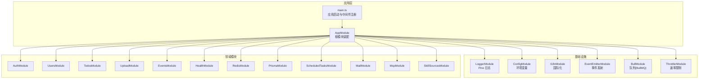
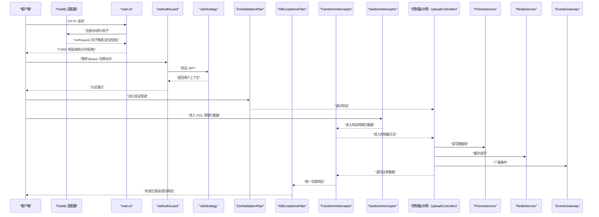
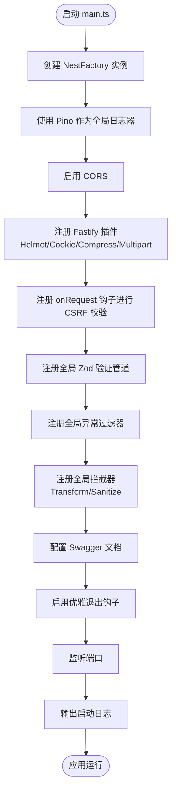
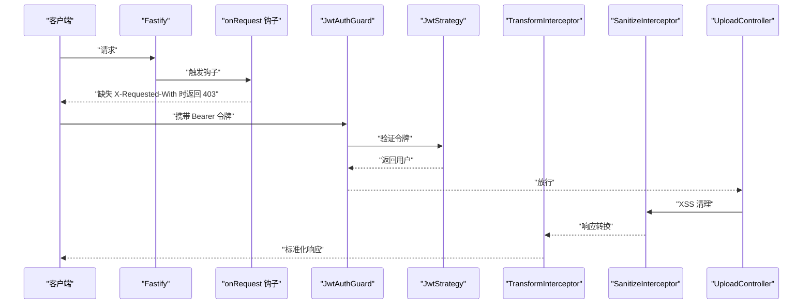
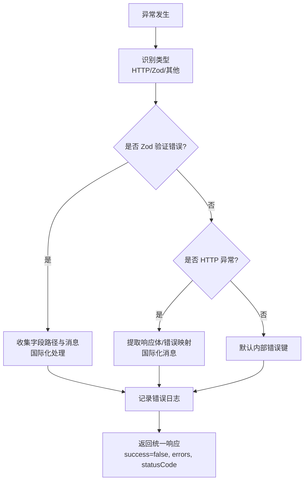
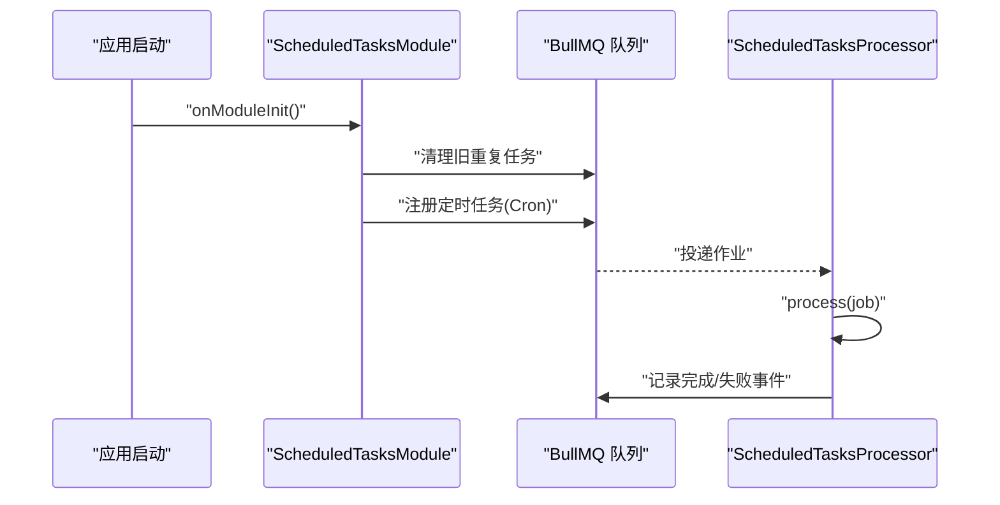
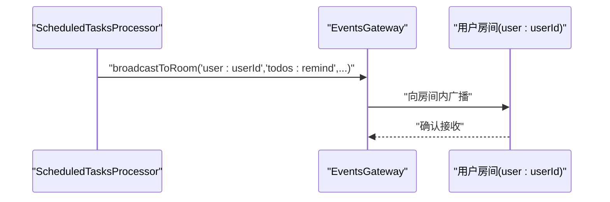

# 应用架构

<cite>
**本文引用的文件**
- [apps/backend/src/app.module.ts](file://apps/backend/src/app.module.ts)
- [apps/backend/src/main.ts](file://apps/backend/src/main.ts)
- [apps/backend/src/common/filters/all-exceptions.filter.ts](file://apps/backend/src/common/filters/all-exceptions.filter.ts)
- [apps/backend/src/common/interceptors/transform.interceptor.ts](file://apps/backend/src/common/interceptors/transform.interceptor.ts)
- [apps/backend/src/common/interceptors/sanitize.interceptor.ts](file://apps/backend/src/common/interceptors/sanitize.interceptor.ts)
- [apps/backend/src/auth/jwt-auth.guard.ts](file://apps/backend/src/auth/jwt-auth.guard.ts)
- [apps/backend/src/auth/jwt.strategy.ts](file://apps/backend/src/auth/jwt.strategy.ts)
- [apps/backend/src/prisma/prisma.service.ts](file://apps/backend/src/prisma/prisma.service.ts)
- [apps/backend/src/redis/redis.service.ts](file://apps/backend/src/redis/redis.service.ts)
- [apps/backend/src/health/health.controller.ts](file://apps/backend/src/health/health.controller.ts)
- [apps/backend/src/scheduled-tasks/scheduled-tasks.module.ts](file://apps/backend/src/scheduled-tasks/scheduled-tasks.module.ts)
- [apps/backend/src/scheduled-tasks/scheduled-tasks.processor.ts](file://apps/backend/src/scheduled-tasks/scheduled-tasks.processor.ts)
- [apps/backend/src/events/events.gateway.ts](file://apps/backend/src/events/events.gateway.ts)
- [apps/backend/src/upload/upload.controller.ts](file://apps/backend/src/upload/upload.controller.ts)
- [apps/backend/package.json](file://apps/backend/package.json)
</cite>

## 目录
1. [引言](#引言)
2. [项目结构](#项目结构)
3. [核心组件](#核心组件)
4. [架构总览](#架构总览)
5. [详细组件分析](#详细组件分析)
6. [依赖关系分析](#依赖关系分析)
7. [性能考量](#性能考量)
8. [故障排查指南](#故障排查指南)
9. [结论](#结论)
10. [附录](#附录)

## 引言
本文件面向 Lumina Todo 后端应用，系统性阐述基于 NestJS 的应用架构设计与实现细节，重点覆盖以下方面：
- NestJS 模块系统与依赖注入机制
- 根模块 AppModule 的配置与模块组织
- 全局中间件、拦截器、守卫的实现模式
- 应用启动流程与生命周期管理
- 配置管理、环境变量处理与模块间通信
- 错误处理策略、异常过滤器与日志记录
- 架构扩展指南与最佳实践

## 项目结构
后端采用多模块分层组织，围绕功能域划分模块，如认证、用户、待办、上传、事件、定时任务、健康检查等，并通过根模块集中导入与装配。应用以 Fastify 为 HTTP 适配器，结合 Pino 日志、Swagger 文档、BullMQ 队列、Prisma ORM、Redis 缓存、国际化等能力，形成高内聚、低耦合的模块化体系。

图表来源
- [apps/backend/src/app.module.ts:27-161](file://apps/backend/src/app.module.ts#L27-L161)
- [apps/backend/src/main.ts:34-195](file://apps/backend/src/main.ts#L34-L195)

章节来源
- [apps/backend/src/app.module.ts:27-161](file://apps/backend/src/app.module.ts#L27-L161)
- [apps/backend/src/main.ts:34-195](file://apps/backend/src/main.ts#L34-L195)

## 核心组件
- 根模块 AppModule：集中导入配置、日志、国际化、事件、队列、速率限制、健康检查、认证、用户、邮件、事件、上传、定时任务、MCP、技能源、Prisma、Redis 等模块；提供全局速率限制守卫。
- 应用启动 main.ts：创建 NestFactory 实例，启用 CORS、静态资源、Helmet、Cookie、压缩、Multipart、CSRF 校验钩子；注册全局 Zod 验证管道、异常过滤器、响应转换与 XSS 清理拦截器；配置 Swagger 文档；启用优雅退出钩子；监听端口。
- 全局异常过滤器 AllExceptionsFilter：统一捕获异常，按 HTTP 状态码与 Zod 验证错误进行结构化输出，支持国际化字段名与消息翻译。
- 全局拦截器 TransformInterceptor：统一成功响应包装为 { success, data, timestamp }。
- 全局拦截器 SanitizeInterceptor：对请求体、查询参数、路径参数进行递归 HTML/XSS 清理。
- 全局守卫 JwtAuthGuard：基于 Passport 的 JWT 认证守卫，配合 JwtStrategy 完成令牌校验与用户解析。
- JwtStrategy：从请求头提取 JWT，校验密钥与过期时间，验证会话有效性，加载用户上下文。
- PrismaService：基于 PrismaClient 的数据库连接管理，PG 适配器，模块生命周期钩子负责连接/断开。
- RedisService：基于 cache-manager 的统一缓存接口，提供键前缀、批量操作、穿透保护、命名空间封装等。
- 定时任务模块 ScheduledTasksModule 与处理器 ScheduledTasksProcessor：基于 BullMQ repeat 功能注册定时任务，处理健康检查、清理过期数据、待办提醒、每日统计等。
- 事件网关 EventsGateway：WebSocket 网关，支持 CORS、鉴权中间件、房间管理、广播与去抖广播。
- 健康检查 HealthController：使用 @nestjs/terminus 提供综合健康检查、存活探针与就绪探针。
- 上传 UploadController：基于 Fastify multipart，受 JWT 保护，支持单文件/多文件上传与内容解析、删除。

章节来源
- [apps/backend/src/app.module.ts:162-168](file://apps/backend/src/app.module.ts#L162-L168)
- [apps/backend/src/main.ts:34-195](file://apps/backend/src/main.ts#L34-L195)
- [apps/backend/src/common/filters/all-exceptions.filter.ts:16-136](file://apps/backend/src/common/filters/all-exceptions.filter.ts#L16-L136)
- [apps/backend/src/common/interceptors/transform.interceptor.ts:18-29](file://apps/backend/src/common/interceptors/transform.interceptor.ts#L18-L29)
- [apps/backend/src/common/interceptors/sanitize.interceptor.ts:9-63](file://apps/backend/src/common/interceptors/sanitize.interceptor.ts#L9-L63)
- [apps/backend/src/auth/jwt-auth.guard.ts:8-9](file://apps/backend/src/auth/jwt-auth.guard.ts#L8-L9)
- [apps/backend/src/auth/jwt.strategy.ts:20-67](file://apps/backend/src/auth/jwt.strategy.ts#L20-L67)
- [apps/backend/src/prisma/prisma.service.ts:6-33](file://apps/backend/src/prisma/prisma.service.ts#L6-L33)
- [apps/backend/src/redis/redis.service.ts:51-202](file://apps/backend/src/redis/redis.service.ts#L51-L202)
- [apps/backend/src/scheduled-tasks/scheduled-tasks.module.ts:15-37](file://apps/backend/src/scheduled-tasks/scheduled-tasks.module.ts#L15-L37)
- [apps/backend/src/scheduled-tasks/scheduled-tasks.processor.ts:36-68](file://apps/backend/src/scheduled-tasks/scheduled-tasks.processor.ts#L36-L68)
- [apps/backend/src/events/events.gateway.ts:57-116](file://apps/backend/src/events/events.gateway.ts#L57-L116)
- [apps/backend/src/health/health.controller.ts:17-76](file://apps/backend/src/health/health.controller.ts#L17-L76)
- [apps/backend/src/upload/upload.controller.ts:24-155](file://apps/backend/src/upload/upload.controller.ts#L24-L155)

## 架构总览
下图展示应用启动到请求处理的关键交互路径，包括安全中间件、CSRF 校验钩子、全局管道与过滤器、拦截器链路，以及模块间协作（Prisma、Redis、事件网关、定时任务）。

图表来源
- [apps/backend/src/main.ts:115-170](file://apps/backend/src/main.ts#L115-L170)
- [apps/backend/src/auth/jwt-auth.guard.ts:8-9](file://apps/backend/src/auth/jwt-auth.guard.ts#L8-L9)
- [apps/backend/src/auth/jwt.strategy.ts:41-66](file://apps/backend/src/auth/jwt.strategy.ts#L41-L66)
- [apps/backend/src/common/interceptors/sanitize.interceptor.ts:17-36](file://apps/backend/src/common/interceptors/sanitize.interceptor.ts#L17-L36)
- [apps/backend/src/common/interceptors/transform.interceptor.ts:20-28](file://apps/backend/src/common/interceptors/transform.interceptor.ts#L20-L28)
- [apps/backend/src/common/filters/all-exceptions.filter.ts:27-135](file://apps/backend/src/common/filters/all-exceptions.filter.ts#L27-L135)
- [apps/backend/src/upload/upload.controller.ts:79-144](file://apps/backend/src/upload/upload.controller.ts#L79-L144)
- [apps/backend/src/prisma/prisma.service.ts:23-32](file://apps/backend/src/prisma/prisma.service.ts#L23-L32)
- [apps/backend/src/redis/redis.service.ts:86-120](file://apps/backend/src/redis/redis.service.ts#L86-L120)
- [apps/backend/src/events/events.gateway.ts:180-202](file://apps/backend/src/events/events.gateway.ts#L180-L202)

## 详细组件分析

### 根模块与模块系统
- 导入模块清单：Config、Logger、EventEmitter、BullMQ、Throttler、I18n、Prisma、Redis、Health、Auth、Users、Mail、Events、Upload、SkillSources、Todos、ScheduledTasks、Mcp。
- 全局守卫：通过 APP_GUARD 提供 ThrottlerGuard，实现全局速率限制。
- 模块间通信：通过依赖注入在各模块间共享服务（如 PrismaService、RedisService、EventsGateway、TokenService 等）。

```mermaid
classDiagram
class AppModule {
+imports
+providers
}
class ConfigModule
class LoggerModule
class EventEmitterModule
class BullModule
class ThrottlerModule
class I18nModule
class PrismaModule
class RedisModule
class HealthModule
class AuthModule
class UsersModule
class MailModule
class EventsModule
class UploadModule
class TodosModule
class ScheduledTasksModule
class McpModule
class SkillSourcesModule
AppModule --> ConfigModule
AppModule --> LoggerModule
AppModule --> EventEmitterModule
AppModule --> BullModule
AppModule --> ThrottlerModule
AppModule --> I18nModule
AppModule --> PrismaModule
AppModule --> RedisModule
AppModule --> HealthModule
AppModule --> AuthModule
AppModule --> UsersModule
AppModule --> MailModule
AppModule --> EventsModule
AppModule --> UploadModule
AppModule --> TodosModule
AppModule --> ScheduledTasksModule
AppModule --> McpModule
AppModule --> SkillSourcesModule
```

图表来源
- [apps/backend/src/app.module.ts:27-161](file://apps/backend/src/app.module.ts#L27-L161)

章节来源
- [apps/backend/src/app.module.ts:27-161](file://apps/backend/src/app.module.ts#L27-L161)

### 启动流程与生命周期
- 创建应用实例：NestFactory.create 使用 FastifyAdapter，trustProxy 开启，bufferLogs 缓冲日志。
- 全局配置：CORS、静态资源、Helmet、Cookie、压缩、Multipart、CSRF 钩子、全局管道/过滤器/拦截器。
- Swagger：构建文档并清理 Zod Schema 生成的 OpenAPI。
- 生命周期：enableShutdownHooks 启用优雅退出；监听端口；日志输出启动信息。

图表来源
- [apps/backend/src/main.ts:34-195](file://apps/backend/src/main.ts#L34-L195)

章节来源
- [apps/backend/src/main.ts:34-195](file://apps/backend/src/main.ts#L34-L195)

### 全局中间件、拦截器与守卫
- 中间件：通过 Fastify 钩子实现 CSRF 防护，对非安全方法且非健康/Socket 路径进行校验，缺失 X-Requested-With 头时拒绝并返回标准化错误。
- 拦截器：
  - TransformInterceptor：统一成功响应包装。
  - SanitizeInterceptor：递归清理请求体/查询/路径参数中的 HTML。
- 守卫：JwtAuthGuard 基于 Passport 的 JWT 策略，JwtStrategy 校验令牌类型、用户存在性与会话有效性。

图表来源
- [apps/backend/src/main.ts:115-170](file://apps/backend/src/main.ts#L115-L170)
- [apps/backend/src/auth/jwt-auth.guard.ts:8-9](file://apps/backend/src/auth/jwt-auth.guard.ts#L8-L9)
- [apps/backend/src/auth/jwt.strategy.ts:41-66](file://apps/backend/src/auth/jwt.strategy.ts#L41-L66)
- [apps/backend/src/common/interceptors/transform.interceptor.ts:20-28](file://apps/backend/src/common/interceptors/transform.interceptor.ts#L20-L28)
- [apps/backend/src/common/interceptors/sanitize.interceptor.ts:17-36](file://apps/backend/src/common/interceptors/sanitize.interceptor.ts#L17-L36)
- [apps/backend/src/upload/upload.controller.ts:79-144](file://apps/backend/src/upload/upload.controller.ts#L79-L144)

章节来源
- [apps/backend/src/main.ts:115-170](file://apps/backend/src/main.ts#L115-L170)
- [apps/backend/src/auth/jwt-auth.guard.ts:8-9](file://apps/backend/src/auth/jwt-auth.guard.ts#L8-L9)
- [apps/backend/src/auth/jwt.strategy.ts:20-67](file://apps/backend/src/auth/jwt.strategy.ts#L20-L67)
- [apps/backend/src/common/interceptors/transform.interceptor.ts:18-29](file://apps/backend/src/common/interceptors/transform.interceptor.ts#L18-L29)
- [apps/backend/src/common/interceptors/sanitize.interceptor.ts:9-63](file://apps/backend/src/common/interceptors/sanitize.interceptor.ts#L9-L63)
- [apps/backend/src/upload/upload.controller.ts:24-155](file://apps/backend/src/upload/upload.controller.ts#L24-L155)

### 配置管理、环境变量与模块间通信
- 配置模块：ConfigModule.forRoot 全局启用，支持 .env 与上层 .env；通过 ConfigService 注入读取。
- 日志模块：LoggerModule.forRootAsync 基于 ConfigService 动态设置日志级别、传输器、自定义日志格式与级别判定。
- 速率限制：ThrottlerModule.forRootAsync 从配置读取短/中/长期限与窗口，提供多级节流。
- 国际化：I18nModule.forRoot 使用 I18nTsLoader，支持请求头与 Accept-Language 解析。
- 模块间通信：
  - PrismaService：数据库连接与事务管理。
  - RedisService：统一缓存接口、命名空间、批量/穿透保护。
  - EventsGateway：WebSocket 广播、房间管理、鉴权中间件。
  - ScheduledTasksProcessor：定时任务处理与 Prisma/Events 协作。

章节来源
- [apps/backend/src/app.module.ts:30-148](file://apps/backend/src/app.module.ts#L30-L148)
- [apps/backend/src/prisma/prisma.service.ts:10-32](file://apps/backend/src/prisma/prisma.service.ts#L10-L32)
- [apps/backend/src/redis/redis.service.ts:51-202](file://apps/backend/src/redis/redis.service.ts#L51-L202)
- [apps/backend/src/events/events.gateway.ts:57-116](file://apps/backend/src/events/events.gateway.ts#L57-L116)
- [apps/backend/src/scheduled-tasks/scheduled-tasks.processor.ts:36-68](file://apps/backend/src/scheduled-tasks/scheduled-tasks.processor.ts#L36-L68)

### 错误处理策略与异常过滤器
- AllExceptionsFilter：捕获所有异常，区分 HTTP 与 Zod 错误，构造结构化错误对象，支持国际化字段名与消息翻译，记录错误日志并返回统一响应格式。
- 全局拦截器：TransformInterceptor 包装成功响应；SanitizeInterceptor 预防 XSS。
- 全局守卫：ThrottlerGuard 限制请求频率。

图表来源
- [apps/backend/src/common/filters/all-exceptions.filter.ts:27-135](file://apps/backend/src/common/filters/all-exceptions.filter.ts#L27-L135)

章节来源
- [apps/backend/src/common/filters/all-exceptions.filter.ts:16-136](file://apps/backend/src/common/filters/all-exceptions.filter.ts#L16-L136)
- [apps/backend/src/common/interceptors/transform.interceptor.ts:18-29](file://apps/backend/src/common/interceptors/transform.interceptor.ts#L18-L29)
- [apps/backend/src/common/interceptors/sanitize.interceptor.ts:9-63](file://apps/backend/src/common/interceptors/sanitize.interceptor.ts#L9-L63)

### 定时任务与后台处理
- ScheduledTasksModule：注册队列与处理器，启动时清理旧重复任务并按 Cron 表达式注册健康检查、待办提醒、清理过期数据、每日统计等任务。
- ScheduledTasksProcessor：按任务类型分派处理，涉及 Prisma 事务、事件广播、日志记录与错误处理。

图表来源
- [apps/backend/src/scheduled-tasks/scheduled-tasks.module.ts:25-91](file://apps/backend/src/scheduled-tasks/scheduled-tasks.module.ts#L25-L91)
- [apps/backend/src/scheduled-tasks/scheduled-tasks.processor.ts:49-68](file://apps/backend/src/scheduled-tasks/scheduled-tasks.processor.ts#L49-L68)

章节来源
- [apps/backend/src/scheduled-tasks/scheduled-tasks.module.ts:15-92](file://apps/backend/src/scheduled-tasks/scheduled-tasks.module.ts#L15-L92)
- [apps/backend/src/scheduled-tasks/scheduled-tasks.processor.ts:36-290](file://apps/backend/src/scheduled-tasks/scheduled-tasks.processor.ts#L36-L290)

### 事件网关与实时通信
- 事件网关：WebSocketGateway，支持 CORS、鉴权中间件、房间加入/离开、广播与去抖广播；提供跨服务广播接口。
- 与定时任务协作：通过广播向用户房间推送待办提醒。

图表来源
- [apps/backend/src/scheduled-tasks/scheduled-tasks.processor.ts:167-190](file://apps/backend/src/scheduled-tasks/scheduled-tasks.processor.ts#L167-L190)
- [apps/backend/src/events/events.gateway.ts:180-202](file://apps/backend/src/events/events.gateway.ts#L180-L202)

章节来源
- [apps/backend/src/events/events.gateway.ts:57-266](file://apps/backend/src/events/events.gateway.ts#L57-L266)
- [apps/backend/src/scheduled-tasks/scheduled-tasks.processor.ts:147-190](file://apps/backend/src/scheduled-tasks/scheduled-tasks.processor.ts#L147-L190)

### 健康检查与可观测性
- HealthController：综合数据库、Redis、内存、磁盘健康检查；提供存活探针与就绪探针端点，便于容器编排与运维监控。

章节来源
- [apps/backend/src/health/health.controller.ts:17-76](file://apps/backend/src/health/health.controller.ts#L17-L76)

### 上传模块与文件处理
- UploadController：受 JwtAuthGuard 保护，支持单文件/多文件上传与内容解析，内置 MIME/扩展名校验；删除接口调用存储服务。

章节来源
- [apps/backend/src/upload/upload.controller.ts:24-155](file://apps/backend/src/upload/upload.controller.ts#L24-L155)

## 依赖关系分析
- 核心依赖：NestJS 核心、Fastify 适配器、Swagger、Pino 日志、nestjs-zod 验证、nestjs-i18n 国际化、@nestjs/terminus 健康检查、@nestjs/bullmq 队列、@nestjs/throttler 速率限制、Passport/JWT 认证、Prisma ORM、Redis 缓存、Socket.IO 实时通信、sanitize-html 防护等。
- 模块耦合：根模块集中导入，领域模块通过服务注入解耦；Prisma/Redis/Events 作为跨模块共享能力由各模块按需注入。

```mermaid
graph TB
Pkg["package.json 依赖"]
Core["@nestjs/* 核心"]
Fastify["@nestjs/platform-fastify"]
Swagger["@nestjs/swagger"]
Pino["nestjs-pino/pino-http"]
Zod["nestjs-zod"]
I18n["nestjs-i18n"]
Terminus["@nestjs/terminus"]
Bull["@nestjs/bullmq"]
Throttle["@nestjs/throttler"]
Passport["@nestjs/passport + passport-jwt"]
Prisma["@prisma/client + @prisma/adapter-pg"]
Redis["cache-manager + ioredis"]
Socket["socket.io"]
Sanitizer["sanitize-html"]
Pkg --> Core
Pkg --> Fastify
Pkg --> Swagger
Pkg --> Pino
Pkg --> Zod
Pkg --> I18n
Pkg --> Terminus
Pkg --> Bull
Pkg --> Throttle
Pkg --> Passport
Pkg --> Prisma
Pkg --> Redis
Pkg --> Socket
Pkg --> Sanitizer
```

图表来源
- [apps/backend/package.json:30-85](file://apps/backend/package.json#L30-L85)

章节来源
- [apps/backend/package.json:30-85](file://apps/backend/package.json#L30-L85)

## 性能考量
- HTTP 适配器：Fastify 提升吞吐与延迟表现；开启 gzip 压缩与静态资源服务。
- 缓存策略：RedisService 提供 TTL、命名空间、批量/穿透保护，降低数据库压力。
- 队列与定时任务：BullMQ repeat 保证分布式唯一执行与失败重试；定时任务拆分粒度避免单点瓶颈。
- 日志：Pino 结构化日志，生产环境 JSON 输出，开发环境美化输出，减少序列化开销。
- 验证与防护：Zod 验证减少无效请求；Helmet、CSRF、XSS 清理降低安全风险与异常分支成本。

## 故障排查指南
- 启动失败：检查 .env 配置项（DATABASE_URL、JWT_SECRET、REDIS_*、CORS_ORIGIN 等），确认端口占用与权限。
- 认证失败：核对 Authorization 头、令牌类型与过期时间；查看 JwtStrategy 校验日志。
- 上传异常：确认 MIME/扩展名白名单、文件大小限制、CSRF 头；检查存储服务可用性。
- 定时任务未执行：检查队列连接、Cron 表达式、处理器日志；确认重复任务清理与注册流程。
- WebSocket 连接问题：核对 CORS 配置、鉴权中间件、房间权限与广播去抖逻辑。
- 健康检查失败：逐项检查数据库连接、Redis 连接、内存/RSS/磁盘阈值。

章节来源
- [apps/backend/src/main.ts:115-170](file://apps/backend/src/main.ts#L115-L170)
- [apps/backend/src/auth/jwt.strategy.ts:41-66](file://apps/backend/src/auth/jwt.strategy.ts#L41-L66)
- [apps/backend/src/upload/upload.controller.ts:51-63](file://apps/backend/src/upload/upload.controller.ts#L51-L63)
- [apps/backend/src/scheduled-tasks/scheduled-tasks.module.ts:28-37](file://apps/backend/src/scheduled-tasks/scheduled-tasks.module.ts#L28-L37)
- [apps/backend/src/events/events.gateway.ts:86-116](file://apps/backend/src/events/events.gateway.ts#L86-L116)
- [apps/backend/src/health/health.controller.ts:34-51](file://apps/backend/src/health/health.controller.ts#L34-L51)

## 结论
本架构以 NestJS 模块化为核心，结合 Fastify、Pino、Swagger、BullMQ、Prisma、Redis、I18n、Terminus 等生态能力，构建了具备高安全性、可观测性与可扩展性的后端系统。通过全局中间件/拦截器/守卫与统一异常过滤器，实现了清晰的横切关注点；通过定时任务与事件网关，支撑了实时与异步场景。建议在扩展新功能时遵循“按领域划分模块、通过服务注入解耦、统一错误与日志规范”的原则，持续提升系统的稳定性与可维护性。

## 附录
- 环境变量建议：DATABASE_URL、JWT_SECRET、REDIS_HOST/PORT/PASSWORD、CORS_ORIGIN、UPLOAD_MAX_SIZE、UPLOAD_MAX_FILES、LOG_LEVEL、NODE_ENV、THROTTLE_* 等。
- 健康检查端点：/api/health（综合）、/api/health/liveness（存活）、/api/health/readiness（就绪）。
- Swagger 文档：/api/docs。