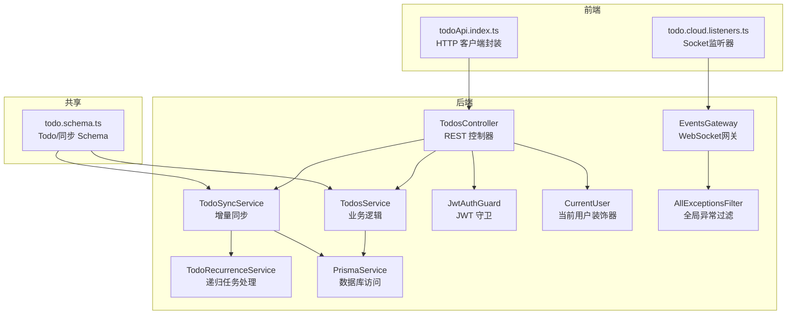
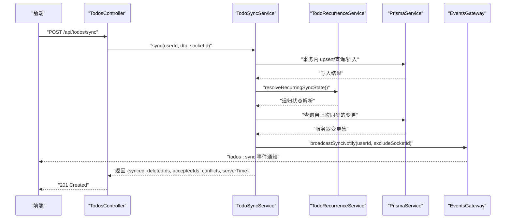
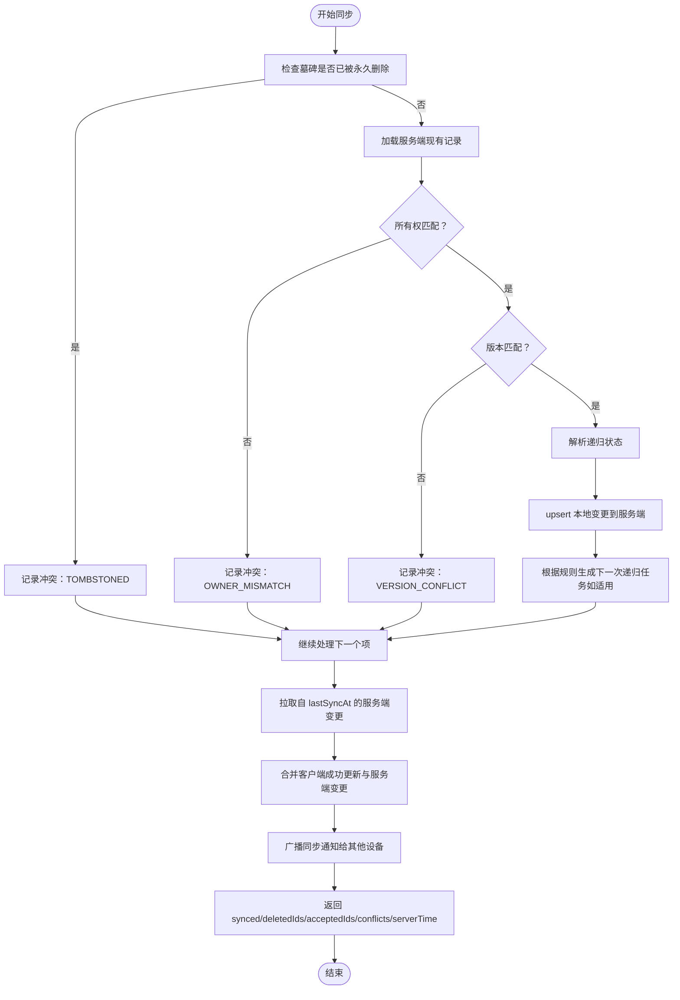
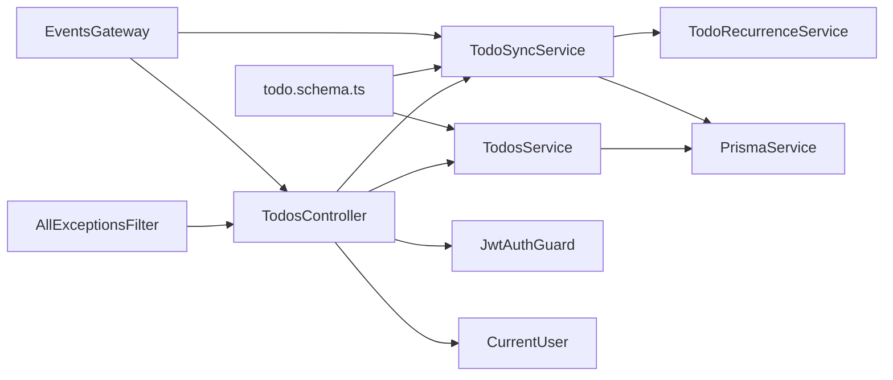

# API 接口规范

<cite>
**本文引用的文件**
- [apps/backend/src/todos/todos.controller.ts](file://apps/backend/src/todos/todos.controller.ts)
- [apps/backend/src/todos/todos.service.ts](file://apps/backend/src/todos/todos.service.ts)
- [apps/backend/src/todos/todos-sync.service.ts](file://apps/backend/src/todos/todos-sync.service.ts)
- [apps/backend/src/todos/todos-sync.recurrence.ts](file://apps/backend/src/todos/todos-sync.recurrence.ts)
- [apps/backend/src/todos/todos.dto.ts](file://apps/backend/src/todos/todos.dto.ts)
- [apps/backend/src/events/events.gateway.ts](file://apps/backend/src/events/events.gateway.ts)
- [apps/backend/src/auth/jwt-auth.guard.ts](file://apps/backend/src/auth/jwt-auth.guard.ts)
- [apps/backend/src/auth/current-user.decorator.ts](file://apps/backend/src/auth/current-user.decorator.ts)
- [apps/backend/src/common/filters/all-exceptions.filter.ts](file://apps/backend/src/common/filters/all-exceptions.filter.ts)
- [apps/backend/src/prisma/prisma.service.ts](file://apps/backend/src/prisma/prisma.service.ts)
- [packages/shared/src/schemas/todo.schema.ts](file://packages/shared/src/schemas/todo.schema.ts)
- [apps/backend/src/app.module.ts](file://apps/backend/src/app.module.ts)
- [apps/backend/package.json](file://apps/backend/package.json)
- [apps/backend/tests/e2e/todos.e2e.spec.ts](file://apps/backend/tests/e2e/todos.e2e.spec.ts)
- [apps/frontend/src/features/todo/api/index.ts](file://apps/frontend/src/features/todo/api/index.ts)
- [apps/frontend/src/features/todo/stores/todo.cloud.sync.ts](file://apps/frontend/src/features/todo/stores/todo.cloud.sync.ts)
- [apps/frontend/src/features/todo/stores/todo.cloud.listeners.ts](file://apps/frontend/src/features/todo/stores/todo.cloud.listeners.ts)
</cite>

## 更新摘要
**变更内容**
- 新增实时同步机制和WebSocket事件网关
- 增强递归任务生成和冲突处理逻辑
- 更新同步流程图和实时通知机制
- 完善前端Socket集成和监听机制
- 优化冲突检测和版本控制策略

## 目录
1. [简介](#简介)
2. [项目结构](#项目结构)
3. [核心组件](#核心组件)
4. [架构总览](#架构总览)
5. [详细组件分析](#详细组件分析)
6. [依赖关系分析](#依赖关系分析)
7. [性能考量](#性能考量)
8. [故障排查指南](#故障排查指南)
9. [结论](#结论)
10. [附录](#附录)

## 简介
本文件为"待办事项"服务的完整 API 接口规范，覆盖 RESTful 端点、数据传输对象（DTO）、认证与授权、分页/排序/过滤、错误响应格式、请求与响应示例，以及版本控制与向后兼容策略。接口基于 NestJS 构建，采用 JWT 令牌进行认证，使用 Prisma 访问数据库，并通过 Socket 事件实现多端实时同步通知。

**更新** 本次更新反映了实时同步机制、递归任务处理和冲突解决的最新实现状态。

## 项目结构
- 后端应用位于 apps/backend，核心模块包括：
  - 待办事项模块：todos.controller、todos.service、todos-sync.service、todos.dto
  - 实时事件模块：events.gateway（WebSocket网关）
  - 认证模块：jwt-auth.guard、current-user.decorator
  - 异常过滤器：all-exceptions.filter
  - 数据访问：prisma.service
  - 共享 Schema：packages/shared/schemas/todo.schema.ts
- 前端调用封装位于 apps/frontend/src/features/todo/api/index.ts
- 前端实时监听位于 apps/frontend/src/features/todo/stores/todo.cloud.listeners.ts
- E2E 测试验证了典型流程：注册 → 同步创建 → 列表查询 → 回收站查询 → 恢复 → 永久删除

**图表来源**
- [apps/backend/src/todos/todos.controller.ts:20-69](file://apps/backend/src/todos/todos.controller.ts#L20-L69)
- [apps/backend/src/todos/todos.service.ts:26-145](file://apps/backend/src/todos/todos.service.ts#L26-L145)
- [apps/backend/src/todos/todos-sync.service.ts:40-220](file://apps/backend/src/todos/todos-sync.service.ts#L40-L220)
- [apps/backend/src/todos/todos-sync.recurrence.ts:1-208](file://apps/backend/src/todos/todos-sync.recurrence.ts#L1-L208)
- [apps/backend/src/events/events.gateway.ts:57-266](file://apps/backend/src/events/events.gateway.ts#L57-L266)
- [apps/backend/src/auth/jwt-auth.guard.ts:1-10](file://apps/backend/src/auth/jwt-auth.guard.ts#L1-L10)
- [apps/backend/src/auth/current-user.decorator.ts:1-19](file://apps/backend/src/auth/current-user.decorator.ts#L1-L19)
- [apps/backend/src/common/filters/all-exceptions.filter.ts:16-136](file://apps/backend/src/common/filters/all-exceptions.filter.ts#L16-L136)
- [apps/backend/src/prisma/prisma.service.ts:6-33](file://apps/backend/src/prisma/prisma.service.ts#L6-L33)
- [packages/shared/src/schemas/todo.schema.ts:1-75](file://packages/shared/src/schemas/todo.schema.ts#L1-L75)
- [apps/frontend/src/features/todo/api/index.ts:1-62](file://apps/frontend/src/features/todo/api/index.ts#L1-L62)
- [apps/frontend/src/features/todo/stores/todo.cloud.listeners.ts:1-45](file://apps/frontend/src/features/todo/stores/todo.cloud.listeners.ts#L1-L45)

**章节来源**
- [apps/backend/src/todos/todos.controller.ts:1-70](file://apps/backend/src/todos/todos.controller.ts#L1-L70)
- [apps/backend/src/todos/todos.module.ts:1-15](file://apps/backend/src/todos/todos.module.ts#L1-L15)
- [apps/backend/src/app.module.ts:1-175](file://apps/backend/src/app.module.ts#L1-L175)

## 核心组件
- TodosController：暴露 REST 端点，统一使用 JWT 守卫，支持同步、列表、回收站、恢复、永久删除、清空回收站等操作。
- TodosService：提供基础 CRUD 与回收站管理，负责排序与筛选。
- TodoSyncService：实现"离线优先"的增量同步与冲突解决，支持重复规则与递归生成。
- TodoRecurrenceService：专门处理递归任务的生成、更新和时区转换逻辑。
- EventsGateway：WebSocket网关，实现多端实时同步通知和房间管理。
- JwtAuthGuard：全局 JWT 认证守卫，保护受保护路由。
- CurrentUser 装饰器：从请求上下文提取当前用户。
- AllExceptionsFilter：统一错误响应格式，支持国际化与结构化错误字段映射。
- PrismaService：连接 PostgreSQL，提供事务与查询能力。
- 共享 Schema（todo.schema.ts）：定义 Todo、同步请求/响应、冲突等数据模型。

**更新** 新增了递归任务处理和WebSocket实时通知的核心组件。

**章节来源**
- [apps/backend/src/todos/todos.controller.ts:24-69](file://apps/backend/src/todos/todos.controller.ts#L24-L69)
- [apps/backend/src/todos/todos.service.ts:26-145](file://apps/backend/src/todos/todos.service.ts#L26-L145)
- [apps/backend/src/todos/todos-sync.service.ts:40-220](file://apps/backend/src/todos/todos-sync.service.ts#L40-L220)
- [apps/backend/src/todos/todos-sync.recurrence.ts:1-208](file://apps/backend/src/todos/todos-sync.recurrence.ts#L1-L208)
- [apps/backend/src/events/events.gateway.ts:57-266](file://apps/backend/src/events/events.gateway.ts#L57-L266)
- [apps/backend/src/auth/jwt-auth.guard.ts:1-10](file://apps/backend/src/auth/jwt-auth.guard.ts#L1-L10)
- [apps/backend/src/auth/current-user.decorator.ts:1-19](file://apps/backend/src/auth/current-user.decorator.ts#L1-L19)
- [apps/backend/src/common/filters/all-exceptions.filter.ts:16-136](file://apps/backend/src/common/filters/all-exceptions.filter.ts#L16-L136)
- [apps/backend/src/prisma/prisma.service.ts:6-33](file://apps/backend/src/prisma/prisma.service.ts#L6-L33)
- [packages/shared/src/schemas/todo.schema.ts:1-75](file://packages/shared/src/schemas/todo.schema.ts#L1-L75)

## 架构总览
- 认证链路：前端携带 Bearer Token 请求；JwtAuthGuard 验证 JWT；CurrentUser 注入当前用户；控制器执行业务。
- 同步链路：TodoSyncService 在单事务中处理客户端推送变更，再拉取服务器端自上次同步以来的变更，合并后返回；同时通过 EventsGateway 广播同步通知。
- 实时通知链路：EventsGateway 使用Socket.IO实现多端实时同步，支持房间管理和去重机制。
- 递归任务链路：TodoRecurrenceService 处理重复规则、时区转换和下次任务生成。

**更新** 新增了实时通知和递归任务处理的完整链路。

**图表来源**
- [apps/backend/src/todos/todos.controller.ts:30-38](file://apps/backend/src/todos/todos.controller.ts#L30-L38)
- [apps/backend/src/todos/todos-sync.service.ts:51-219](file://apps/backend/src/todos/todos-sync.service.ts#L51-L219)
- [apps/backend/src/todos/todos-sync.recurrence.ts:87-151](file://apps/backend/src/todos/todos-sync.recurrence.ts#L87-L151)
- [apps/backend/src/prisma/prisma.service.ts:6-33](file://apps/backend/src/prisma/prisma.service.ts#L6-L33)
- [apps/backend/src/events/events.gateway.ts:177-202](file://apps/backend/src/events/events.gateway.ts#L177-L202)

## 详细组件分析

### 认证与授权
- 全局守卫：JwtAuthGuard 保护 TodosController 下所有路由。
- 当前用户注入：CurrentUser 装饰器从请求中提取用户对象或指定字段。
- 令牌传递：前端在 Authorization 头部使用 Bearer 令牌；部分端点还支持 X-Socket-ID 头用于事件去重。

**更新** 新增了Socket ID去重机制，防止同一设备重复接收通知。

**章节来源**
- [apps/backend/src/auth/jwt-auth.guard.ts:1-10](file://apps/backend/src/auth/jwt-auth.guard.ts#L1-L10)
- [apps/backend/src/auth/current-user.decorator.ts:1-19](file://apps/backend/src/auth/current-user.decorator.ts#L1-L19)
- [apps/backend/src/todos/todos.controller.ts:15-38](file://apps/backend/src/todos/todos.controller.ts#L15-L38)

### 端点定义与路由参数

- 基础路径：/api/todos
- 全局头部：
  - Authorization: Bearer <token>
  - Content-Type: application/json
  - X-Requested-With: XMLHttpRequest
  - 可选：X-Socket-ID: <socketId>（用于同步去重）

- GET /api/todos
  - 功能：获取当前用户所有未删除的待办事项
  - 认证：是
  - 查询参数：无
  - 响应：数组，元素为 Todo 对象
  - 排序：按 isPinned 降序、order 升序、createdAt 降序
  - 示例请求：Authorization: Bearer <token>
  - 示例响应：200 OK，数据为 Todo 数组

- GET /api/todos/trash
  - 功能：获取回收站中的待办事项
  - 认证：是
  - 查询参数：无
  - 响应：数组，元素为 Todo 对象
  - 排序：按 deletedAt 降序
  - 示例请求：Authorization: Bearer <token>
  - 示例响应：200 OK，数据为 Todo 数组

- POST /api/todos/sync
  - 功能：同步并合并（离线优先）
  - 认证：是
  - 请求头：Authorization、Content-Type、可选 X-Socket-ID
  - 请求体：SyncMergeRequest
  - 响应：SyncResponse
  - 行为要点：
    - 事务内处理客户端推送的 todos
    - 检测墓碑（被永久删除）、所有权冲突、版本冲突
    - 拉取服务器自 lastSyncAt 以来的变更，合并后返回
    - 成功写入后广播同步通知
  - 示例请求：见"请求示例"
  - 示例响应：见"响应示例"

- POST /api/todos/{id}/restore
  - 功能：恢复已删除的待办事项
  - 认证：是
  - 路径参数：id（字符串 UUID）
  - 响应：Todo 或 null（若不存在）
  - 示例请求：Authorization: Bearer <token>
  - 示例响应：201 Created 或 200 OK

- DELETE /api/todos/{id}/permanent
  - 功能：永久删除待办事项
  - 认证：是
  - 路径参数：id（字符串 UUID）
  - 响应：{ id }
  - 示例请求：Authorization: Bearer <token>
  - 示例响应：200 OK

- DELETE /api/todos/trash/clear
  - 功能：清空回收站
  - 认证：是
  - 查询参数：无
  - 响应：删除统计（如 { count }）
  - 示例请求：Authorization: Bearer <token>
  - 示例响应：200 OK

**更新** 新增了Socket ID去重机制和实时通知功能。

**章节来源**
- [apps/backend/src/todos/todos.controller.ts:30-68](file://apps/backend/src/todos/todos.controller.ts#L30-L68)
- [apps/backend/src/todos/todos.service.ts:34-144](file://apps/backend/src/todos/todos.service.ts#L34-L144)
- [apps/backend/src/todos/todos-sync.service.ts:48-219](file://apps/backend/src/todos/todos-sync.service.ts#L48-L219)
- [apps/frontend/src/features/todo/api/index.ts:1-62](file://apps/frontend/src/features/todo/api/index.ts#L1-L62)

### 数据传输对象（DTO）与数据模型

- Todo（字段概览）
  - id: 字符串 UUID
  - title: 非空字符串（最大长度 500）
  - completed: 布尔
  - order: 整数
  - isPinned: 布尔
  - parentId: UUID 或 null
  - version: 整数（版本号）
  - pomodoroCount: 整数
  - dueAt/remindAt/remindedAt: 日期或 ISO 字符串或 null
  - recurrenceRule: 枚举（DAILY/WEEKDAYS/WEEKLY/MONTHLY）或 null
  - recurrenceTz: 字符串（时区）或 null
  - recurrenceSpawnedAt: 日期或 ISO 字符串或 null
  - createdAt/updatedAt/completedAt/deletedAt: 日期或 ISO 字符串

- SyncMergeRequest
  - todos: SyncItem[]（每个项符合 Todo 结构）
  - lastSyncAt: 日期或 ISO 字符串（可选）

- SyncResponse
  - synced: Todo[]
  - deletedIds: 字符串数组（被服务端删除的本地 ID）
  - acceptedIds: 字符串数组（被服务端接受的 ID）
  - conflicts: SyncConflict[]（冲突详情）
  - serverTime: 服务器时间（ISO 字符串）

- SyncConflict
  - id: 字符串 UUID
  - reason: 枚举（TOMBSTONED/OWNER_MISMATCH/VERSION_CONFLICT）
  - serverVersion: 服务端版本号（可选）

**更新** 新增了递归任务相关的字段和时区处理逻辑。

**章节来源**
- [packages/shared/src/schemas/todo.schema.ts:1-75](file://packages/shared/src/schemas/todo.schema.ts#L1-L75)
- [apps/backend/src/todos/todos.dto.ts:1-5](file://apps/backend/src/todos/todos.dto.ts#L1-L5)

### 分页、排序与过滤
- 排序：
  - 列表默认：isPinned 降序 → order 升序 → createdAt 降序
  - 回收站：deletedAt 降序
- 过滤：
  - 列表默认过滤：deletedAt 为空
  - 回收站过滤：deletedAt 非空
- 分页：
  - 未提供分页参数；如需分页，请在客户端或网关层自行实现（例如 offset/limit）。

**章节来源**
- [apps/backend/src/todos/todos.service.ts:34-60](file://apps/backend/src/todos/todos.service.ts#L34-L60)

### 错误响应格式与状态码
- 统一响应结构（由 AllExceptionsFilter 输出）：
  - success: false
  - data: null
  - message: 错误消息（可国际化）
  - errors: 结构化字段错误映射（可选）
  - statusCode: HTTP 状态码
  - timestamp: ISO 时间戳
- 常见状态码：
  - 200：成功（如 GET、DELETE）
  - 201：创建/同步成功（如 POST /sync 返回）
  - 400：请求体校验失败（Zod 验证错误）
  - 401：未认证或令牌无效
  - 403：权限不足
  - 404：资源不存在
  - 429：请求过于频繁（限流）
  - 500：服务器内部错误

**章节来源**
- [apps/backend/src/common/filters/all-exceptions.filter.ts:16-136](file://apps/backend/src/common/filters/all-exceptions.filter.ts#L16-L136)

### 请求与响应示例
- 创建/同步待办事项（POST /api/todos/sync）
  - 请求头：Authorization: Bearer <token>, Content-Type: application/json
  - 请求体：SyncMergeRequest（包含 todos 数组与 lastSyncAt）
  - 响应：SyncResponse（包含 synced、deletedIds、acceptedIds、conflicts、serverTime）
- 列出待办事项（GET /api/todos）
  - 请求头：Authorization: Bearer <token>
  - 响应：Todo[]（按排序规则排列）
- 回收站（GET /api/todos/trash）
  - 请求头：Authorization: Bearer <token>
  - 响应：Todo[]（按删除时间倒序）
- 恢复（POST /api/todos/{id}/restore）
  - 请求头：Authorization: Bearer <token>
  - 响应：Todo 或 null
- 永久删除（DELETE /api/todos/{id}/permanent）
  - 请求头：Authorization: Bearer <token>
  - 响应：{ id }
- 清空回收站（DELETE /api/todos/trash/clear）
  - 请求头：Authorization: Bearer <token>
  - 响应：删除统计（如 { count }）

**章节来源**
- [apps/backend/tests/e2e/todos.e2e.spec.ts:37-201](file://apps/backend/tests/e2e/todos.e2e.spec.ts#L37-L201)
- [apps/frontend/src/features/todo/api/index.ts:1-62](file://apps/frontend/src/features/todo/api/index.ts#L1-L62)

### 同步流程与冲突处理

**更新** 新增了递归任务解析和生成的完整流程。

**图表来源**
- [apps/backend/src/todos/todos-sync.service.ts:48-219](file://apps/backend/src/todos/todos-sync.service.ts#L48-L219)
- [apps/backend/src/todos/todos-sync.recurrence.ts:87-151](file://apps/backend/src/todos/todos-sync.recurrence.ts#L87-L151)

### 实时同步机制
- WebSocket网关：EventsGateway 提供实时通信能力，支持房间管理和广播。
- 房间管理：每个用户拥有独立的用户房间（user:{userId}）。
- 通知机制：使用防抖机制（500ms）避免频繁广播，支持客户端ID去重。
- 事件类型：todos:sync 用于同步通知，todos:remind 用于提醒通知。

**新增** 实时同步机制的完整实现。

**章节来源**
- [apps/backend/src/events/events.gateway.ts:57-266](file://apps/backend/src/events/events.gateway.ts#L57-L266)
- [apps/frontend/src/features/todo/stores/todo.cloud.listeners.ts:1-45](file://apps/frontend/src/features/todo/stores/todo.cloud.listeners.ts#L1-L45)

## 依赖关系分析
- 控制器依赖服务与同步服务，服务依赖 Prisma，异常过滤器全局生效。
- 共享 Schema 作为前后端契约，确保数据一致性。
- 限流守卫在全局模块中注册，统一防护。
- EventsGateway 作为实时通信中心，协调多个服务间的事件通知。

**更新** 新增了WebSocket网关和实时通信的依赖关系。

**图表来源**
- [apps/backend/src/todos/todos.controller.ts:24-28](file://apps/backend/src/todos/todos.controller.ts#L24-L28)
- [apps/backend/src/todos/todos.service.ts:26-32](file://apps/backend/src/todos/todos.service.ts#L26-L32)
- [apps/backend/src/todos/todos-sync.service.ts:40-46](file://apps/backend/src/todos/todos-sync.service.ts#L40-L46)
- [apps/backend/src/todos/todos-sync.recurrence.ts:1-8](file://apps/backend/src/todos/todos-sync.recurrence.ts#L1-L8)
- [apps/backend/src/common/filters/all-exceptions.filter.ts:16-136](file://apps/backend/src/common/filters/all-exceptions.filter.ts#L16-L136)
- [packages/shared/src/schemas/todo.schema.ts:1-75](file://packages/shared/src/schemas/todo.schema.ts#L1-L75)
- [apps/backend/src/events/events.gateway.ts:57-66](file://apps/backend/src/events/events.gateway.ts#L57-L66)

**章节来源**
- [apps/backend/src/app.module.ts:162-168](file://apps/backend/src/app.module.ts#L162-L168)
- [apps/backend/package.json:30-86](file://apps/backend/package.json#L30-L86)

## 性能考量
- 事务批量处理：同步过程中使用事务保证原子性，减少锁竞争与重复查询。
- 选择性字段：查询时仅选择必要字段，降低网络与序列化开销。
- 递归生成优化：仅在必要时生成下一次递归任务，避免冗余。
- 限流：全局限流策略防止滥用，建议结合 Redis 实现分布式限流。
- 日志：生产环境使用 JSON 日志，便于集中收集与检索。
- 实时通知防抖：500ms内只发送一次广播，避免频繁通知影响性能。
- Socket去重：通过X-Socket-ID避免同一设备重复接收通知。

**更新** 新增了实时通知防抖和Socket去重的性能优化。

## 故障排查指南
- 400 验证错误：检查请求体是否满足共享 Schema；查看 errors 字段定位具体字段。
- 401 未认证：确认 Authorization 头是否正确携带 Bearer 令牌。
- 403 权限问题：确认当前用户与资源归属一致（所有权冲突）。
- 404 资源不存在：确认 ID 是否有效且未被永久删除。
- 429 限流：调整请求频率或联系管理员。
- 500 服务器错误：查看统一错误响应中的 message 与 stack（开发环境），或查看服务端日志。
- Socket连接问题：检查CORS配置、认证令牌有效性、房间权限。
- 实时通知异常：确认EventsGateway配置、防抖机制、客户端Socket监听器。

**更新** 新增了Socket连接和实时通知相关的故障排查指南。

**章节来源**
- [apps/backend/src/common/filters/all-exceptions.filter.ts:16-136](file://apps/backend/src/common/filters/all-exceptions.filter.ts#L16-L136)

## 结论
本规范明确了待办事项 API 的端点、数据模型、认证授权、同步机制与错误处理策略。通过共享 Schema 与严格的 DTO 校验，确保前后端一致性；通过 JWT 与全局守卫保障安全；通过事务与事件机制提升可靠性与实时性。**更新后的实现**增加了实时同步通知、递归任务处理和冲突检测优化，进一步提升了系统的可用性和用户体验。建议在生产环境中启用 HTTPS、限流与监控，并持续演进版本与兼容策略。

## 附录

### API 版本控制与向后兼容
- 版本策略：后端以包版本（如 1.0.0-beta.8）标识，前端通过共享包版本对齐。
- 向后兼容：共享 Schema 作为契约，新增字段建议可选，避免破坏既有客户端；变更字段需谨慎评估。
- 前缀规划：当前路径为 /api/todos，未来如需多版本，可在路径中加入版本号（如 /api/v1/todos）。

**章节来源**
- [apps/backend/package.json:2-4](file://apps/backend/package.json#L2-L4)
- [packages/shared/src/schemas/todo.schema.ts:1-75](file://packages/shared/src/schemas/todo.schema.ts#L1-L75)

### 递归任务处理机制
- 规则支持：DAILY、WEEKDAYS、WEEKLY、MONTHLY 四种递归规则。
- 时区处理：支持任意有效的时区标识符，自动验证和规范化。
- 生成条件：仅当任务完成且非重复任务时生成下一次递归任务。
- 时间计算：使用dayjs库进行精确的时间计算和时区转换。

**新增** 递归任务处理机制的详细说明。

**章节来源**
- [apps/backend/src/todos/todos-sync.recurrence.ts:1-208](file://apps/backend/src/todos/todos-sync.recurrence.ts#L1-L208)