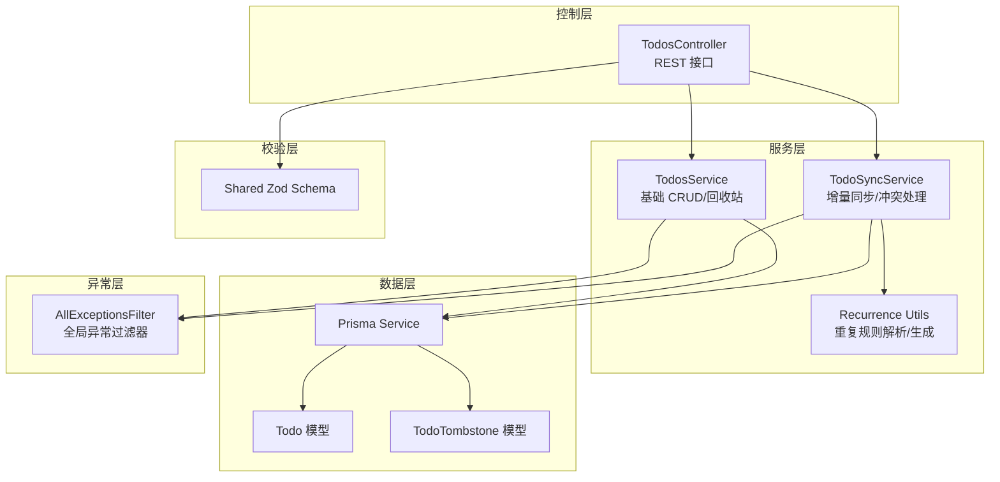
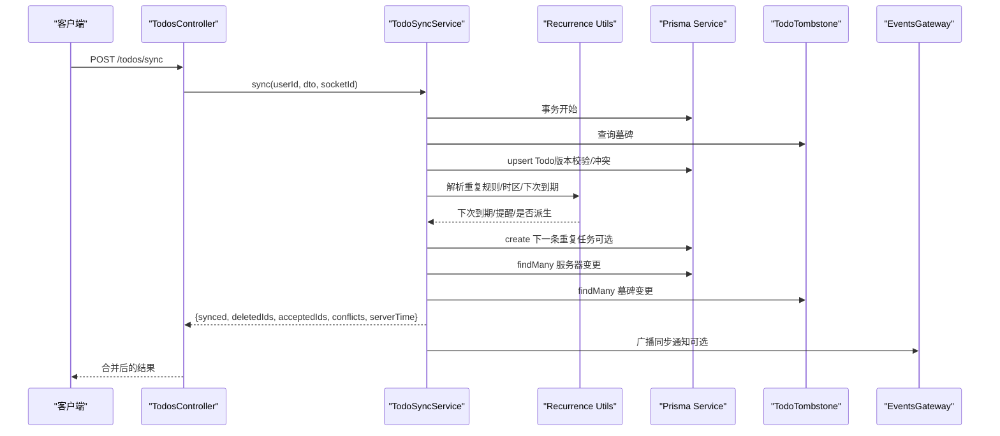
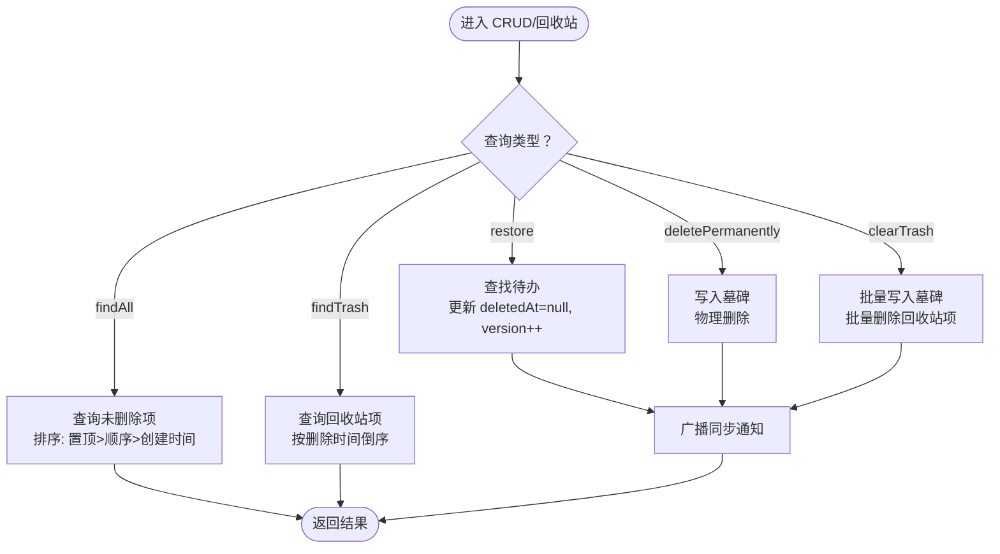
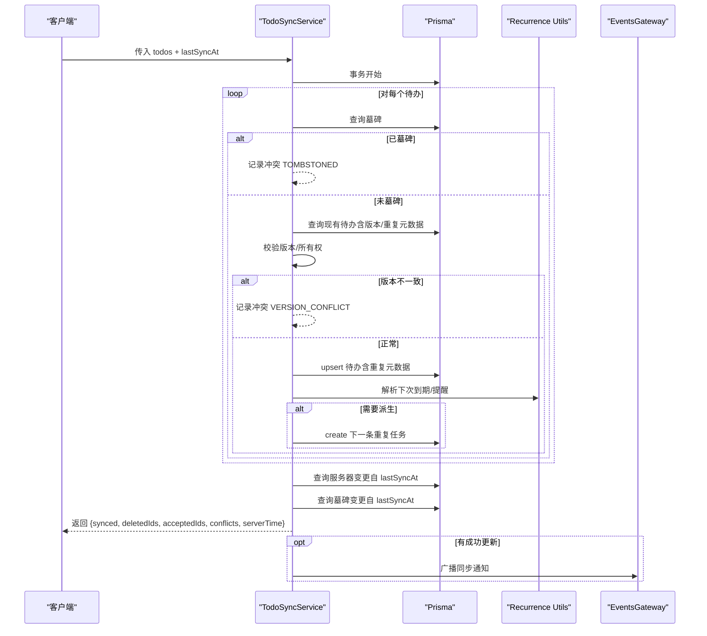
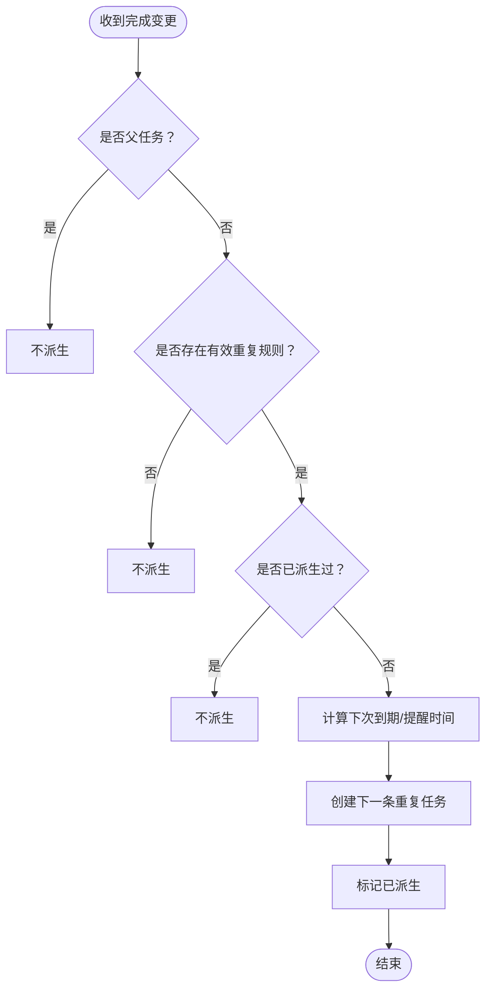
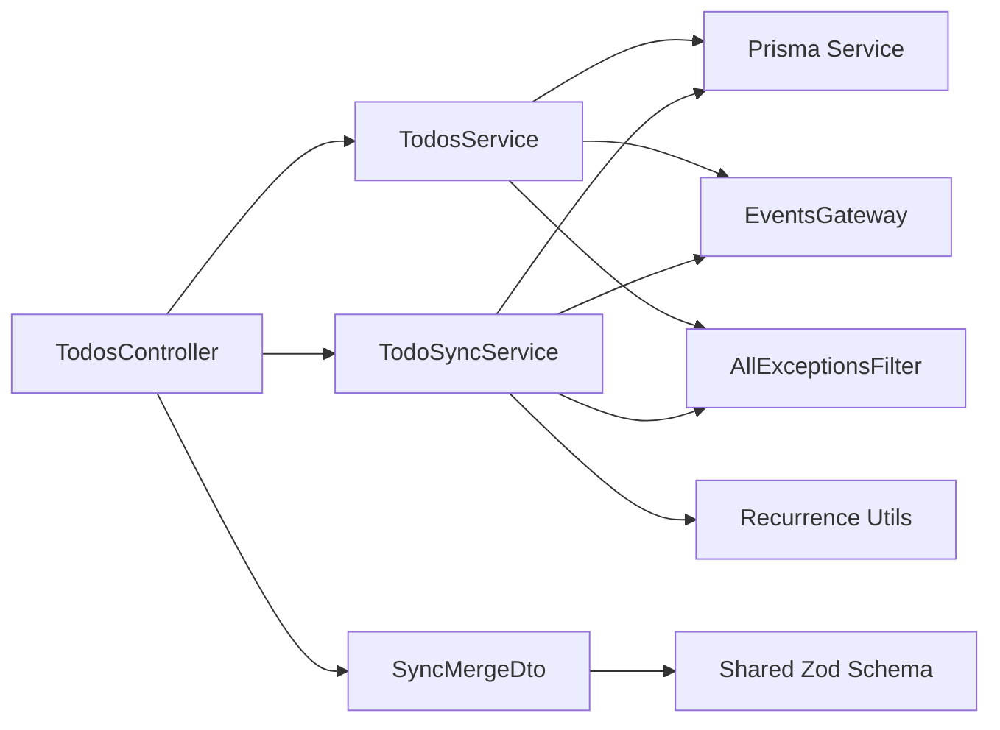

# 业务逻辑实现

<cite>
**本文引用的文件**
- [apps/backend/src/todos/todos.service.ts](file://apps/backend/src/todos/todos.service.ts)
- [apps/backend/src/todos/todos.controller.ts](file://apps/backend/src/todos/todos.controller.ts)
- [apps/backend/src/todos/todos.dto.ts](file://apps/backend/src/todos/todos.dto.ts)
- [apps/backend/src/todos/todos.module.ts](file://apps/backend/src/todos/todos.module.ts)
- [apps/backend/src/todos/todos-sync.service.ts](file://apps/backend/src/todos/todos-sync.service.ts)
- [apps/backend/src/todos/todos-sync.recurrence.ts](file://apps/backend/src/todos/todos-sync.recurrence.ts)
- [apps/backend/prisma/schema/todo.prisma](file://apps/backend/prisma/schema/todo.prisma)
- [packages/shared/src/schemas/todo.schema.ts](file://packages/shared/src/schemas/todo.schema.ts)
- [apps/backend/src/common/filters/all-exceptions.filter.ts](file://apps/backend/src/common/filters/all-exceptions.filter.ts)
- [apps/backend/tests/todos.service.spec.ts](file://apps/backend/tests/todos.service.spec.ts)
- [apps/backend/tests/todos-sync.service.spec.ts](file://apps/backend/tests/todos-sync.service.spec.ts)
- [apps/backend/tests/e2e/todos.e2e.spec.ts](file://apps/backend/tests/e2e/todos.e2e.spec.ts)
</cite>

## 目录
1. [简介](#简介)
2. [项目结构](#项目结构)
3. [核心组件](#核心组件)
4. [架构总览](#架构总览)
5. [详细组件分析](#详细组件分析)
6. [依赖关系分析](#依赖关系分析)
7. [性能考量](#性能考量)
8. [故障排查指南](#故障排查指南)
9. [结论](#结论)
10. [附录](#附录)

## 简介
本文件面向“待办事项”业务的完整技术文档，聚焦于以下目标：
- 完整的 CRUD 流程与数据校验机制
- 待办事项状态转换与业务规则
- 优先级计算、截止日期提醒与重复规则处理
- 子任务的创建、更新与删除逻辑
- 批量操作与事务处理机制
- 业务用例与流程图
- 错误处理与异常策略

在该系统中，待办事项通过“增量同步+离线优先”的方式实现跨设备一致性，支持回收站、软删除、版本冲突检测、以及基于规则的重复任务生成。

## 项目结构
围绕待办事项功能的核心模块与文件如下：
- 控制层：TodosController 提供 REST 接口（列表、回收站、恢复、永久删除、清空回收站、同步）
- 服务层：TodosService 负责基础 CRUD 与回收站管理；TodoSyncService 实现增量同步与冲突处理
- 数据模型：Prisma 的 Todo 与 TodoTombstone 表，支持软删除与墓碑记录
- 校验层：共享包中的 Zod Schema 定义输入输出约束
- 异常层：全局异常过滤器统一错误响应
- 测试：单元测试覆盖 CRUD 与同步逻辑，端到端测试覆盖完整生命周期

图表来源
- [apps/backend/src/todos/todos.controller.ts:20-70](file://apps/backend/src/todos/todos.controller.ts#L20-L70)
- [apps/backend/src/todos/todos.service.ts:26-146](file://apps/backend/src/todos/todos.service.ts#L26-L146)
- [apps/backend/src/todos/todos-sync.service.ts:40-221](file://apps/backend/src/todos/todos-sync.service.ts#L40-L221)
- [apps/backend/src/todos/todos-sync.recurrence.ts:87-208](file://apps/backend/src/todos/todos-sync.recurrence.ts#L87-L208)
- [apps/backend/prisma/schema/todo.prisma:1-39](file://apps/backend/prisma/schema/todo.prisma#L1-L39)
- [packages/shared/src/schemas/todo.schema.ts:39-75](file://packages/shared/src/schemas/todo.schema.ts#L39-L75)
- [apps/backend/src/common/filters/all-exceptions.filter.ts:16-137](file://apps/backend/src/common/filters/all-exceptions.filter.ts#L16-L137)

章节来源
- [apps/backend/src/todos/todos.controller.ts:20-70](file://apps/backend/src/todos/todos.controller.ts#L20-L70)
- [apps/backend/src/todos/todos.service.ts:26-146](file://apps/backend/src/todos/todos.service.ts#L26-L146)
- [apps/backend/src/todos/todos-sync.service.ts:40-221](file://apps/backend/src/todos/todos-sync.service.ts#L40-L221)
- [apps/backend/src/todos/todos-sync.recurrence.ts:87-208](file://apps/backend/src/todos/todos-sync.recurrence.ts#L87-L208)
- [apps/backend/prisma/schema/todo.prisma:1-39](file://apps/backend/prisma/schema/todo.prisma#L1-L39)
- [packages/shared/src/schemas/todo.schema.ts:39-75](file://packages/shared/src/schemas/todo.schema.ts#L39-L75)
- [apps/backend/src/common/filters/all-exceptions.filter.ts:16-137](file://apps/backend/src/common/filters/all-exceptions.filter.ts#L16-L137)

## 核心组件
- 控制器 TodosController
  - 提供 GET /todos、GET /todos/trash、POST /:id/restore、DELETE /:id/permanent、DELETE /todos/trash/clear、POST /todos/sync 等接口
  - 使用 JWT 守卫与 Swagger 注解，统一鉴权与文档
- 服务 TodosService
  - findAll：查询用户未删除的待办事项，按置顶、顺序、创建时间排序
  - findTrash：查询用户回收站中的待办事项
  - restore：恢复已删除待办，清除 deletedAt 并递增版本
  - deletePermanently：软删除对应墓碑记录后物理删除
  - clearTrash：批量清理回收站并写入墓碑
- 服务 TodoSyncService
  - sync：核心同步与合并逻辑，事务内处理客户端推送变更，随后拉取服务器端变更，合并冲突与删除标识
  - 冲突类型：TOMBSTONED（墓碑）、OWNER_MISMATCH（所有权不匹配）、VERSION_CONFLICT（版本不一致）
  - 通知：对成功更新的变更广播同步通知
- 重复规则工具 todos-sync.recurrence.ts
  - 解析与规范化重复规则与时区
  - 计算下次到期时间与提醒时间，跳过周末（WEEKDAYS）
  - 在完成且无父任务时自动派生下一条重复任务
- 数据模型 todo.prisma
  - Todo：标题、完成状态、顺序、置顶、父任务、用户、版本、到期/提醒/已提醒、重复规则与时区、创建/更新/完成/删除时间、番茄钟计数等
  - TodoTombstone：墓碑表，记录用户+待办的删除时间
- 校验 schema
  - Shared Zod Schema 定义 Todo、SyncItem、SyncMergeRequest、SyncConflict、SyncResponse 的结构与约束
- 全局异常过滤器
  - 统一处理 Zod 校验错误、HTTP 异常与未知错误，返回结构化错误对象

章节来源
- [apps/backend/src/todos/todos.controller.ts:20-70](file://apps/backend/src/todos/todos.controller.ts#L20-L70)
- [apps/backend/src/todos/todos.service.ts:26-146](file://apps/backend/src/todos/todos.service.ts#L26-L146)
- [apps/backend/src/todos/todos-sync.service.ts:40-221](file://apps/backend/src/todos/todos-sync.service.ts#L40-L221)
- [apps/backend/src/todos/todos-sync.recurrence.ts:87-208](file://apps/backend/src/todos/todos-sync.recurrence.ts#L87-L208)
- [apps/backend/prisma/schema/todo.prisma:1-39](file://apps/backend/prisma/schema/todo.prisma#L1-L39)
- [packages/shared/src/schemas/todo.schema.ts:39-75](file://packages/shared/src/schemas/todo.schema.ts#L39-L75)
- [apps/backend/src/common/filters/all-exceptions.filter.ts:16-137](file://apps/backend/src/common/filters/all-exceptions.filter.ts#L16-L137)

## 架构总览
待办事项采用“控制器-服务-数据层-校验层-异常层”的分层设计，结合 Prisma ORM 与事件网关实现跨设备同步与一致性。

图表来源
- [apps/backend/src/todos/todos.controller.ts:30-38](file://apps/backend/src/todos/todos.controller.ts#L30-L38)
- [apps/backend/src/todos/todos-sync.service.ts:51-219](file://apps/backend/src/todos/todos-sync.service.ts#L51-L219)
- [apps/backend/src/todos/todos-sync.recurrence.ts:87-208](file://apps/backend/src/todos/todos-sync.recurrence.ts#L87-L208)
- [apps/backend/prisma/schema/todo.prisma:1-39](file://apps/backend/prisma/schema/todo.prisma#L1-L39)

## 详细组件分析

### CRUD 与回收站管理
- 查询
  - findAll：按 isPinned 降序、order 升序、createdAt 降序排序，仅返回未删除项
  - findTrash：按 deletedAt 降序返回回收站项
- 更新
  - restore：将 deletedAt 置空并递增版本，触发同步广播
  - deletePermanently：写入墓碑记录后物理删除，并广播
  - clearTrash：批量写入墓碑并删除回收站项，广播
- 删除策略
  - 软删除：设置 deletedAt；硬删除：墓碑 + 删除
  - 回收站清空：批量处理，避免逐条事务开销

图表来源
- [apps/backend/src/todos/todos.service.ts:37-144](file://apps/backend/src/todos/todos.service.ts#L37-L144)

章节来源
- [apps/backend/src/todos/todos.service.ts:37-144](file://apps/backend/src/todos/todos.service.ts#L37-L144)
- [apps/backend/tests/todos.service.spec.ts:53-166](file://apps/backend/tests/todos.service.spec.ts#L53-L166)

### 增量同步与冲突处理
- 输入校验
  - 使用 SyncMergeDto 包装 SyncMergeRequestSchema，确保 todos 数组与 lastSyncAt 字段有效
- 同步流程
  - 事务内处理客户端推送的每个待办：检查墓碑、所有权、版本一致性
  - upsert 写入服务器端，同时解析重复规则与下次到期时间
  - 若满足条件（完成且非父任务且未派生过），创建下一条重复任务
  - 拉取自上次同步以来的服务器端变更，合并客户端成功更新项
  - 收集墓碑产生的删除 ID，返回给客户端
- 冲突类型
  - TOMBSTONED：客户端尝试更新已被墓碑化的 ID
  - OWNER_MISMATCH：ID 属于其他用户
  - VERSION_CONFLICT：客户端版本与服务器不一致

图表来源
- [apps/backend/src/todos/todos-sync.service.ts:51-219](file://apps/backend/src/todos/todos-sync.service.ts#L51-L219)
- [apps/backend/src/todos/todos-sync.recurrence.ts:87-208](file://apps/backend/src/todos/todos-sync.recurrence.ts#L87-L208)
- [packages/shared/src/schemas/todo.schema.ts:39-75](file://packages/shared/src/schemas/todo.schema.ts#L39-L75)

章节来源
- [apps/backend/src/todos/todos-sync.service.ts:51-219](file://apps/backend/src/todos/todos-sync.service.ts#L51-L219)
- [apps/backend/tests/todos-sync.service.spec.ts:50-597](file://apps/backend/tests/todos-sync.service.spec.ts#L50-L597)

### 重复规则与到期提醒
- 规则与时区
  - 支持 DAILY、WEEKDAYS、WEEKLY、MONTHLY；时区字符串经校验后使用
  - 若 dueAt 缺失，则清空重复相关字段，不再派生
- 下次到期与提醒
  - DAILY/WEEKLY/MONTHLY：按规则推进
  - WEEKDAYS：跳过周末
  - 提醒时间保持相对时差，随到期时间线性平移
- 自动派生
  - 条件：当前已完成、非父任务、存在有效重复规则、尚未派生过
  - 派生后记录派生时间，避免重复派生

图表来源
- [apps/backend/src/todos/todos-sync.recurrence.ts:87-151](file://apps/backend/src/todos/todos-sync.recurrence.ts#L87-L151)
- [apps/backend/src/todos/todos-sync.recurrence.ts:153-208](file://apps/backend/src/todos/todos-sync.recurrence.ts#L153-L208)

章节来源
- [apps/backend/src/todos/todos-sync.recurrence.ts:87-208](file://apps/backend/src/todos/todos-sync.recurrence.ts#L87-L208)
- [apps/backend/tests/todos-sync.service.spec.ts:284-597](file://apps/backend/tests/todos-sync.service.spec.ts#L284-L597)

### 子任务逻辑
- 结构
  - 通过 parentId 关联父子关系；父任务完成时可触发重复规则派生
- 创建/更新/删除
  - 子任务遵循与普通任务相同的同步与冲突处理
  - 删除子任务不会影响父任务的重复派生状态
- 注意
  - 当前服务层未提供独立的子任务 CRUD 接口；子任务通过同步接口参与统一处理

章节来源
- [apps/backend/prisma/schema/todo.prisma:7-21](file://apps/backend/prisma/schema/todo.prisma#L7-L21)
- [apps/backend/src/todos/todos-sync.service.ts:124-172](file://apps/backend/src/todos/todos-sync.service.ts#L124-L172)

### 批量操作与事务
- 事务边界
  - 同步：单个客户端推送项在事务内处理，保证 upsert 与重复派生原子性
  - 回收站：clearTrash 使用事务批量写入墓碑并删除
- 批量写入
  - clearTrash 使用 createMany 写入墓碑，减少往返
- 通知
  - 成功更新后广播同步通知，驱动其他设备刷新

章节来源
- [apps/backend/src/todos/todos-sync.service.ts:66-174](file://apps/backend/src/todos/todos-sync.service.ts#L66-L174)
- [apps/backend/src/todos/todos.service.ts:126-140](file://apps/backend/src/todos/todos.service.ts#L126-L140)

### 数据模型与索引
- Todo 字段要点
  - 标识与归属：id、userId
  - 状态与排序：completed、order、isPinned、pomodoroCount
  - 时间线：dueAt、remindAt、remindedAt、completedAt、createdAt、updatedAt、deletedAt
  - 重复：recurrenceRule、recurrenceTz、recurrenceSpawnedAt
- 索引
  - 用户+更新时间、用户+提醒时间、用户+到期时间、删除时间索引，支撑高频查询
- TodoTombstone
  - 记录用户+待办的删除时间，作为删除变更源

章节来源
- [apps/backend/prisma/schema/todo.prisma:1-39](file://apps/backend/prisma/schema/todo.prisma#L1-L39)

### 校验与 DTO
- 输入校验
  - SyncMergeDto 基于 Zod Schema，限制 todos 非空数组与 lastSyncAt 合法性
  - TodoSchema 限制字符串长度、布尔默认值、日期字段可空等
- 输出校验
  - SyncResponseSchema 返回结构化字段，包含冲突与删除 ID

章节来源
- [apps/backend/src/todos/todos.dto.ts:1-5](file://apps/backend/src/todos/todos.dto.ts#L1-L5)
- [packages/shared/src/schemas/todo.schema.ts:39-75](file://packages/shared/src/schemas/todo.schema.ts#L39-L75)

## 依赖关系分析
- 控制器依赖服务与 DTO
- 服务依赖 Prisma 与事件网关
- 同步服务依赖重复规则工具
- 校验层被控制器与服务共同依赖
- 异常过滤器全局生效

图表来源
- [apps/backend/src/todos/todos.controller.ts:20-70](file://apps/backend/src/todos/todos.controller.ts#L20-L70)
- [apps/backend/src/todos/todos.service.ts:26-32](file://apps/backend/src/todos/todos.service.ts#L26-L32)
- [apps/backend/src/todos/todos-sync.service.ts:40-46](file://apps/backend/src/todos/todos-sync.service.ts#L40-L46)
- [apps/backend/src/todos/todos-sync.recurrence.ts:87-208](file://apps/backend/src/todos/todos-sync.recurrence.ts#L87-L208)
- [apps/backend/src/todos/todos.dto.ts:1-5](file://apps/backend/src/todos/todos.dto.ts#L1-L5)
- [packages/shared/src/schemas/todo.schema.ts:39-75](file://packages/shared/src/schemas/todo.schema.ts#L39-L75)
- [apps/backend/src/common/filters/all-exceptions.filter.ts:16-137](file://apps/backend/src/common/filters/all-exceptions.filter.ts#L16-L137)

章节来源
- [apps/backend/src/todos/todos.controller.ts:20-70](file://apps/backend/src/todos/todos.controller.ts#L20-L70)
- [apps/backend/src/todos/todos.service.ts:26-32](file://apps/backend/src/todos/todos.service.ts#L26-L32)
- [apps/backend/src/todos/todos-sync.service.ts:40-46](file://apps/backend/src/todos/todos-sync.service.ts#L40-L46)
- [apps/backend/src/todos/todos-sync.recurrence.ts:87-208](file://apps/backend/src/todos/todos-sync.recurrence.ts#L87-L208)
- [apps/backend/src/todos/todos.dto.ts:1-5](file://apps/backend/src/todos/todos.dto.ts#L1-L5)
- [packages/shared/src/schemas/todo.schema.ts:39-75](file://packages/shared/src/schemas/todo.schema.ts#L39-L75)
- [apps/backend/src/common/filters/all-exceptions.filter.ts:16-137](file://apps/backend/src/common/filters/all-exceptions.filter.ts#L16-L137)

## 性能考量
- 查询优化
  - 利用多列索引（用户+时间类字段）降低扫描成本
  - 同步阶段按 updatedAt 过滤，避免全表扫描
- 事务与批量
  - 同步与回收站清理均使用事务，保证一致性与原子性
  - 批量写入墓碑减少网络往返
- 重复派生
  - 仅在必要时创建下一条重复任务，避免无谓膨胀
- 通知
  - 成功更新后广播，减少轮询压力

## 故障排查指南
- 常见错误与定位
  - Zod 校验失败：检查请求体结构与字段类型，查看结构化错误对象
  - 版本冲突：客户端版本与服务器不一致，需重试或合并
  - 墓碑冲突：ID 已被删除，无法再更新
  - 时区无效：recurrenceTz 不符合规范，将被忽略
- 日志与国际化
  - 全局异常过滤器记录请求方法、URL、状态码与堆栈
  - 错误消息支持 i18n 翻译
- 端到端验证
  - 端到端测试覆盖创建、入回收站、恢复、永久删除与后续同步的删除标识返回

章节来源
- [apps/backend/src/common/filters/all-exceptions.filter.ts:27-135](file://apps/backend/src/common/filters/all-exceptions.filter.ts#L27-L135)
- [apps/backend/tests/e2e/todos.e2e.spec.ts:37-202](file://apps/backend/tests/e2e/todos.e2e.spec.ts#L37-L202)

## 结论
本系统通过严格的校验、事务与墓碑机制，实现了跨设备的一致性与可靠性；重复规则与到期提醒增强了任务生命周期管理；回收站与批量清理提升了用户体验与数据治理能力。建议在生产环境中持续关注索引命中率、重复派生频率与客户端版本对齐策略，以进一步优化性能与稳定性。

## 附录
- 业务用例
  - 用户登录后通过同步接口提交本地变更，系统在事务内处理并返回合并结果
  - 完成周期性任务时，若满足重复规则且未派生过，则自动生成下一条任务
  - 用户删除任务进入回收站，可在 trash 页面查看；恢复后回到主列表；永久删除后墓碑记录确保跨设备可见