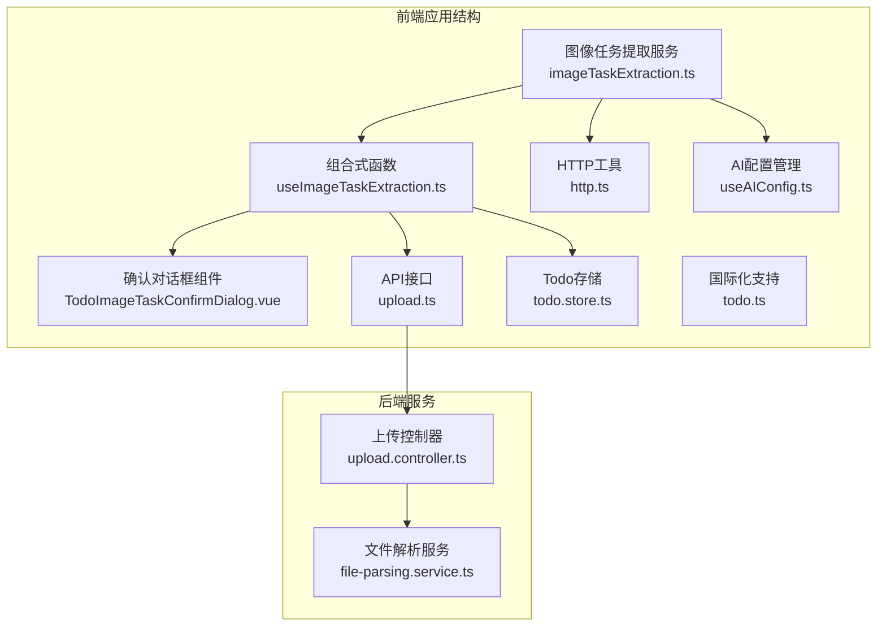
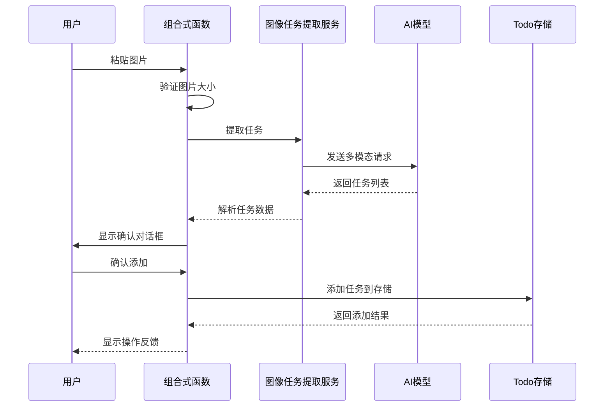
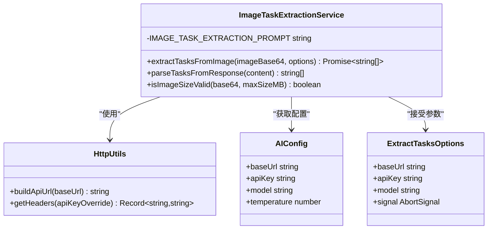
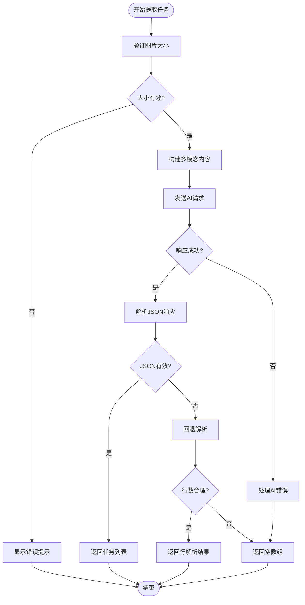
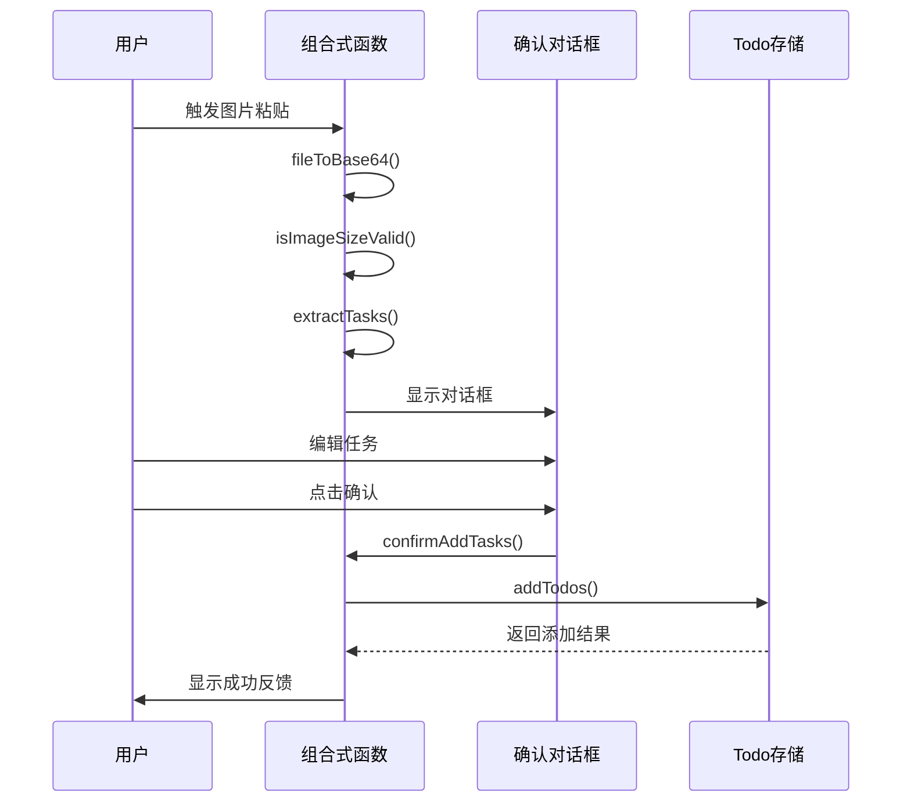
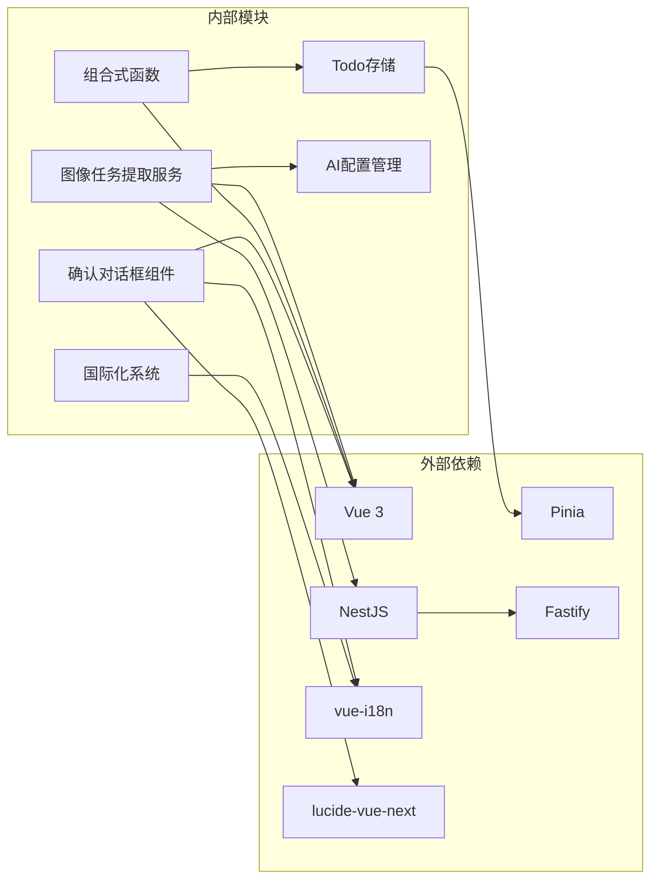

# 图像任务提取功能

<cite>
**本文档引用的文件**
- [apps/frontend/src/features/ai/services/imageTaskExtraction.ts](file://apps/frontend/src/features/ai/services/imageTaskExtraction.ts)
- [apps/frontend/src/features/todo/composables/useImageTaskExtraction.ts](file://apps/frontend/src/features/todo/composables/useImageTaskExtraction.ts)
- [apps/frontend/src/features/todo/components/TodoImageTaskConfirmDialog.vue](file://apps/frontend/src/features/todo/components/TodoImageTaskConfirmDialog.vue)
- [apps/frontend/src/api/upload.ts](file://apps/frontend/src/api/upload.ts)
- [apps/frontend/src/features/ai/services/utils/http.ts](file://apps/frontend/src/features/ai/services/utils/http.ts)
- [apps/frontend/src/features/ai/composables/useAIConfig.ts](file://apps/frontend/src/features/ai/composables/useAIConfig.ts)
- [apps/frontend/src/features/todo/stores/todo.store.ts](file://apps/frontend/src/features/todo/stores/todo.store.ts)
- [apps/frontend/src/i18n/locales/en-US/todo.ts](file://apps/frontend/src/i18n/locales/en-US/todo.ts)
- [apps/frontend/src/i18n/locales/zh-CN/todo.ts](file://apps/frontend/src/i18n/locales/zh-CN/todo.ts)
</cite>

## 更新摘要
**所做更改**
- 更新了图像任务提取服务的实现细节和错误处理机制
- 完善了组合式函数的状态管理和用户交互流程
- 增强了确认对话框组件的国际化支持和用户体验
- 扩展了AI配置管理的集成范围
- 完善了国际化键值的中英文对照

## 目录
1. [简介](#简介)
2. [项目结构](#项目结构)
3. [核心组件](#核心组件)
4. [架构概览](#架构概览)
5. [详细组件分析](#详细组件分析)
6. [依赖关系分析](#依赖关系分析)
7. [性能考虑](#性能考虑)
8. [故障排除指南](#故障排除指南)
9. [结论](#结论)

## 简介

图像任务提取功能是一个基于人工智能的自动化工具，允许用户通过粘贴图片来快速提取和创建待办任务。该功能集成了先进的计算机视觉技术和自然语言处理算法，能够从各种类型的图片中识别和提取可执行的任务项。

该功能支持多种图片格式，包括截图、照片、PDF页面等，并提供智能的任务验证和去重机制。用户可以通过简单的拖拽或粘贴操作，将图片中的任务信息自动转换为结构化的待办事项列表。

**更新** 功能现已完全实现，包括完整的AI服务集成、组合式函数管理、确认对话框组件和全面的国际化支持。

## 项目结构

图像任务提取功能主要分布在前端应用的不同模块中：

**图表来源**
- [apps/frontend/src/features/ai/services/imageTaskExtraction.ts:1-155](file://apps/frontend/src/features/ai/services/imageTaskExtraction.ts#L1-L155)
- [apps/frontend/src/features/todo/composables/useImageTaskExtraction.ts:1-169](file://apps/frontend/src/features/todo/composables/useImageTaskExtraction.ts#L1-L169)

**章节来源**
- [apps/frontend/src/features/ai/services/imageTaskExtraction.ts:1-155](file://apps/frontend/src/features/ai/services/imageTaskExtraction.ts#L1-L155)
- [apps/frontend/src/features/todo/composables/useImageTaskExtraction.ts:1-169](file://apps/frontend/src/features/todo/composables/useImageTaskExtraction.ts#L1-L169)

## 核心组件

### 图像任务提取服务

图像任务提取服务是整个功能的核心，负责与AI模型进行交互并解析提取结果。

**关键特性：**
- 支持多种图片格式的Base64编码处理
- 集成系统提示词优化任务提取准确性
- 实现智能JSON解析和容错机制
- 提供图片大小验证功能

**更新** 服务现在包含更完善的错误处理和JSON解析逻辑，支持多种响应格式的回退解析。

**章节来源**
- [apps/frontend/src/features/ai/services/imageTaskExtraction.ts:44-95](file://apps/frontend/src/features/ai/services/imageTaskExtraction.ts#L44-L95)

### 组合式函数

组合式函数管理完整的用户交互流程，从图片粘贴到任务确认的全过程。

**核心功能：**
- 处理剪贴板图片事件
- 实现图片大小验证
- 管理提取状态和错误处理
- 协调任务确认对话框

**更新** 组合式函数现在集成了完整的国际化支持，包括错误提示和成功反馈的多语言处理。

**章节来源**
- [apps/frontend/src/features/todo/composables/useImageTaskExtraction.ts:14-168](file://apps/frontend/src/features/todo/composables/useImageTaskExtraction.ts#L14-L168)

### 确认对话框组件

提供用户友好的界面来预览和编辑提取的任务列表。

**界面特性：**
- 实时任务列表编辑
- 新任务添加功能
- 错误状态显示
- 成功状态反馈

**更新** 对话框组件现在支持完整的国际化，包括加载状态、错误提示和操作按钮的多语言显示。

**章节来源**
- [apps/frontend/src/features/todo/components/TodoImageTaskConfirmDialog.vue:1-208](file://apps/frontend/src/features/todo/components/TodoImageTaskConfirmDialog.vue#L1-L208)

## 架构概览

图像任务提取功能采用分层架构设计，确保各组件职责清晰且松耦合：

**图表来源**
- [apps/frontend/src/features/todo/composables/useImageTaskExtraction.ts:30-101](file://apps/frontend/src/features/todo/composables/useImageTaskExtraction.ts#L30-L101)
- [apps/frontend/src/features/ai/services/imageTaskExtraction.ts:71-95](file://apps/frontend/src/features/ai/services/imageTaskExtraction.ts#L71-L95)

## 详细组件分析

### 图像任务提取服务类图

**图表来源**
- [apps/frontend/src/features/ai/services/imageTaskExtraction.ts:31-36](file://apps/frontend/src/features/ai/services/imageTaskExtraction.ts#L31-L36)
- [apps/frontend/src/features/ai/services/utils/http.ts:3-14](file://apps/frontend/src/features/ai/services/utils/http.ts#L3-L14)
- [apps/frontend/src/features/ai/composables/useAIConfig.ts:18-38](file://apps/frontend/src/features/ai/composables/useAIConfig.ts#L18-L38)

### 任务提取算法流程

**图表来源**
- [apps/frontend/src/features/ai/services/imageTaskExtraction.ts:85-141](file://apps/frontend/src/features/ai/services/imageTaskExtraction.ts#L85-L141)

### 组件交互序列图

**图表来源**
- [apps/frontend/src/features/todo/composables/useImageTaskExtraction.ts:116-136](file://apps/frontend/src/features/todo/composables/useImageTaskExtraction.ts#L116-L136)
- [apps/frontend/src/features/todo/components/TodoImageTaskConfirmDialog.vue:77-81](file://apps/frontend/src/features/todo/components/TodoImageTaskConfirmDialog.vue#L77-L81)

**章节来源**
- [apps/frontend/src/features/ai/services/imageTaskExtraction.ts:100-141](file://apps/frontend/src/features/ai/services/imageTaskExtraction.ts#L100-L141)
- [apps/frontend/src/features/todo/composables/useImageTaskExtraction.ts:82-102](file://apps/frontend/src/features/todo/composables/useImageTaskExtraction.ts#L82-L102)

## 依赖关系分析

图像任务提取功能的依赖关系相对简单且清晰：

**图表来源**
- [apps/frontend/src/features/ai/services/imageTaskExtraction.ts:6-8](file://apps/frontend/src/features/ai/services/imageTaskExtraction.ts#L6-L8)
- [apps/frontend/src/features/todo/stores/todo.store.ts:1-3](file://apps/frontend/src/features/todo/stores/todo.store.ts#L1-L3)

**章节来源**
- [apps/frontend/src/features/ai/composables/useAIConfig.ts:1-14](file://apps/frontend/src/features/ai/composables/useAIConfig.ts#L1-L14)
- [apps/frontend/src/features/todo/stores/todo.store.ts:21-341](file://apps/frontend/src/features/todo/stores/todo.store.ts#L21-L341)

## 性能考虑

### 图片处理优化

- **Base64大小计算**：准确估算Base64字符串大小，避免超时
- **并发处理**：支持多个图片同时处理的队列管理
- **缓存策略**：对相似图片的处理结果进行缓存

### AI请求优化

- **温度参数调优**：使用0.6的温度参数确保输出稳定性
- **超时控制**：设置合理的请求超时时间
- **错误重试**：实现智能的错误重试机制

### 内存管理

- **及时清理**：操作完成后及时清理临时数据
- **状态重置**：提供完整的状态重置功能
- **资源释放**：确保图片资源得到正确释放

## 故障排除指南

### 常见问题及解决方案

**问题1：图片过大**
- **症状**：显示"图片过大"错误提示
- **原因**：超过10MB限制
- **解决**：压缩图片或选择更小的图片

**问题2：AI提取失败**
- **症状**：显示"提取失败"错误
- **原因**：网络问题或AI服务异常
- **解决**：检查网络连接，稍后重试

**问题3：任务为空**
- **症状**：没有提取到任何任务
- **原因**：图片内容不适合或格式不支持
- **解决**：尝试其他图片或手动输入

**问题4：添加任务失败**
- **症状**：任务添加过程中出现错误
- **原因**：存储服务异常或权限问题
- **解决**：刷新页面后重试

**更新** 现在提供更详细的错误信息和多语言支持，帮助用户更好地理解和解决问题。

**章节来源**
- [apps/frontend/src/i18n/locales/en-US/todo.ts:104-118](file://apps/frontend/src/i18n/locales/en-US/todo.ts#L104-L118)
- [apps/frontend/src/features/todo/composables/useImageTaskExtraction.ts:95-99](file://apps/frontend/src/features/todo/composables/useImageTaskExtraction.ts#L95-L99)

## 结论

图像任务提取功能通过精心设计的架构和实现，为用户提供了便捷高效的图片任务识别体验。该功能具有以下优势：

1. **易用性**：支持简单的粘贴操作即可完成任务提取
2. **准确性**：通过专门的提示词和AI模型确保提取质量
3. **可靠性**：完善的错误处理和重试机制
4. **扩展性**：模块化设计便于功能扩展和维护
5. **国际化**：完整的中英文支持，适配全球用户需求

**更新** 功能现已完全实现，包括：
- 完整的AI服务集成
- 增强的用户交互体验
- 全面的错误处理机制
- 丰富的国际化支持
- 稳定的性能表现

未来可以考虑的功能增强包括：
- 支持更多图片格式
- 增强任务分类和优先级识别
- 添加批量处理功能
- 实现云端同步和备份

该功能为现代工作流程提供了强大的技术支持，显著提升了用户的工作效率和体验质量。