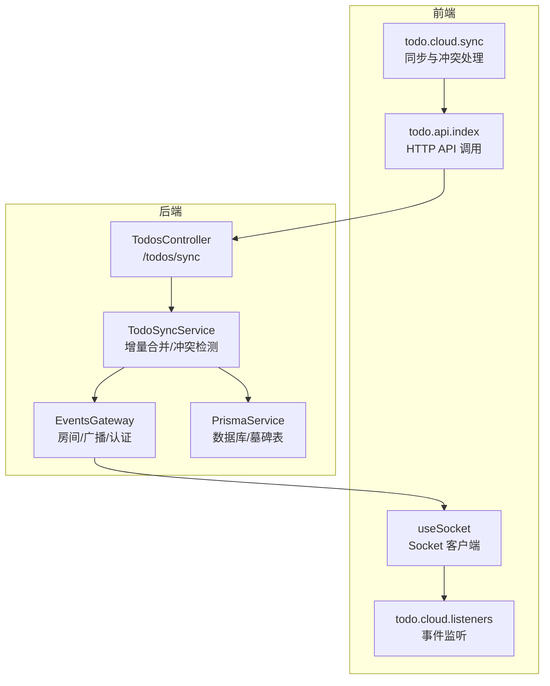
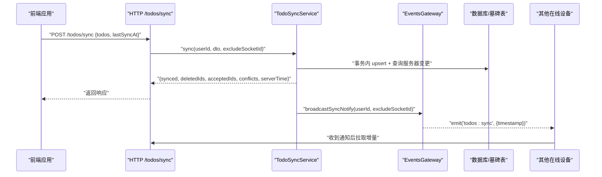
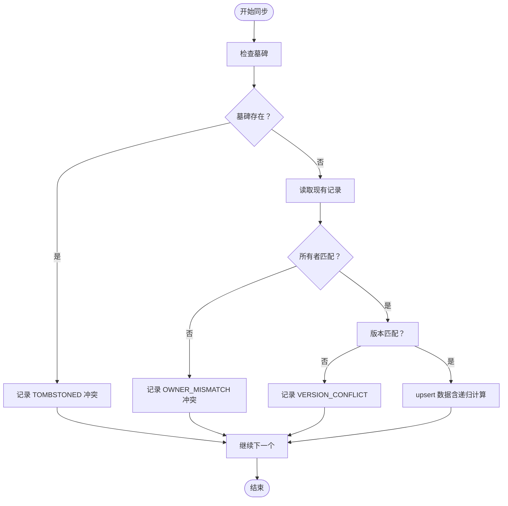
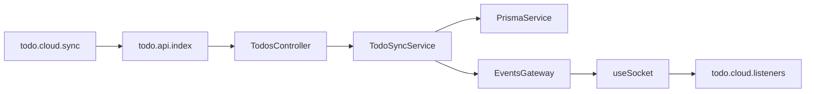

# 实时同步机制

<cite>
**本文引用的文件**
- [apps/backend/src/events/events.gateway.ts](file://apps/backend/src/events/events.gateway.ts)
- [apps/backend/src/todos/todos-sync.service.ts](file://apps/backend/src/todos/todos-sync.service.ts)
- [apps/backend/src/todos/todos.controller.ts](file://apps/backend/src/todos/todos.controller.ts)
- [apps/backend/src/todos/todos.dto.ts](file://apps/backend/src/todos/todos.dto.ts)
- [apps/backend/src/todos/todos-sync.recurrence.ts](file://apps/backend/src/todos/todos-sync.recurrence.ts)
- [apps/frontend/src/composables/useSocket.ts](file://apps/frontend/src/composables/useSocket.ts)
- [apps/frontend/src/features/todo/stores/todo.cloud.sync.ts](file://apps/frontend/src/features/todo/stores/todo.cloud.sync.ts)
- [apps/frontend/src/features/todo/stores/todo.cloud.listeners.ts](file://apps/frontend/src/features/todo/stores/todo.cloud.listeners.ts)
- [apps/frontend/src/features/todo/stores/todo.cloud.conflicts.ts](file://apps/frontend/src/features/todo/stores/todo.cloud.conflicts.ts)
- [apps/frontend/src/features/todo/api/index.ts](file://apps/frontend/src/features/todo/api/index.ts)
- [packages/shared/src/schemas/todo.schema.ts](file://packages/shared/src/schemas/todo.schema.ts)
- [apps/backend/tests/e2e/todos.e2e.spec.ts](file://apps/backend/tests/e2e/todos.e2e.spec.ts)
</cite>

## 目录
1. [引言](#引言)
2. [项目结构](#项目结构)
3. [核心组件](#核心组件)
4. [架构总览](#架构总览)
5. [详细组件分析](#详细组件分析)
6. [依赖关系分析](#依赖关系分析)
7. [性能考量](#性能考量)
8. [故障排查指南](#故障排查指南)
9. [结论](#结论)
10. [附录](#附录)

## 引言
本文件系统化阐述待办事项应用的实时同步机制，覆盖 WebSocket 事件系统、消息传递协议、客户端连接管理与断线重连、心跳与广播、冲突检测与自动合并策略、增量与全量同步差异及适用场景、事件类型与消息格式规范、性能优化与网络异常处理、以及离线缓存与数据一致性保障。目标读者既包括技术开发者，也包括需要理解系统行为的产品与测试人员。

## 项目结构
围绕“实时同步”的关键代码分布在前后端：
- 后端
  - WebSocket 网关：负责认证、房间管理、事件广播
  - 同步服务：执行增量合并、冲突检测、递归任务生成
  - 控制器：暴露 /todos/sync 接口，接收客户端同步请求
  - DTO 与共享 Schema：统一请求/响应结构
- 前端
  - Socket 组合式函数：封装连接、重连、认证参数
  - 云同步 Store：发起同步、处理响应、冲突与删除
  - 监听器：订阅 todos:sync 等事件，驱动本地更新
  - API 层：调用 /todos/sync，并携带 X-Socket-ID

图表来源
- [apps/frontend/src/composables/useSocket.ts:22-175](file://apps/frontend/src/composables/useSocket.ts#L22-L175)
- [apps/frontend/src/features/todo/stores/todo.cloud.sync.ts:36-213](file://apps/frontend/src/features/todo/stores/todo.cloud.sync.ts#L36-L213)
- [apps/frontend/src/features/todo/stores/todo.cloud.listeners.ts:47-84](file://apps/frontend/src/features/todo/stores/todo.cloud.listeners.ts#L47-L84)
- [apps/frontend/src/features/todo/api/index.ts:8-20](file://apps/frontend/src/features/todo/api/index.ts#L8-L20)
- [apps/backend/src/todos/todos.controller.ts:30-38](file://apps/backend/src/todos/todos.controller.ts#L30-L38)
- [apps/backend/src/todos/todos-sync.service.ts:51-219](file://apps/backend/src/todos/todos-sync.service.ts#L51-L219)
- [apps/backend/src/events/events.gateway.ts:180-202](file://apps/backend/src/events/events.gateway.ts#L180-L202)

章节来源
- [apps/backend/src/events/events.gateway.ts:1-266](file://apps/backend/src/events/events.gateway.ts#L1-L266)
- [apps/backend/src/todos/todos-sync.service.ts:1-221](file://apps/backend/src/todos/todos-sync.service.ts#L1-L221)
- [apps/backend/src/todos/todos.controller.ts:1-50](file://apps/backend/src/todos/todos.controller.ts#L1-L50)
- [apps/frontend/src/composables/useSocket.ts:1-176](file://apps/frontend/src/composables/useSocket.ts#L1-L176)
- [apps/frontend/src/features/todo/stores/todo.cloud.sync.ts:1-214](file://apps/frontend/src/features/todo/stores/todo.cloud.sync.ts#L1-L214)
- [apps/frontend/src/features/todo/stores/todo.cloud.listeners.ts:1-90](file://apps/frontend/src/features/todo/stores/todo.cloud.listeners.ts#L1-L90)
- [apps/frontend/src/features/todo/api/index.ts:1-61](file://apps/frontend/src/features/todo/api/index.ts#L1-L61)

## 核心组件
- WebSocket 网关（EventsGateway）
  - 认证中间件：基于 JWT 验证与会话失效检查
  - 房间管理：自动加入 user:{userId} 房间，限制跨房间访问
  - 广播：todos:sync 事件用于通知其他设备拉取增量
  - 防抖广播：同一用户多变更合并为一次广播
- 同步服务（TodoSyncService）
  - 增量合并：事务内逐条处理客户端提交，严格版本匹配
  - 冲突检测：TOMBSTONED、OWNER_MISMATCH、VERSION_CONFLICT
  - 服务器端变更拉取：基于 lastSyncAt 的增量查询
  - 递归任务：根据 dueAt/规则/时区生成下一次任务
  - 通知：有变更时向用户房间广播 todos:sync
- 前端 Socket（useSocket）
  - 连接参数：优先 websocket，轮询兜底；携带 withCredentials 与 auth.token
  - 重连策略：指数回退，上限与随机抖动
  - 认证错误处理：自动刷新 token 并重连
  - 房间加入：连接后加入 user:{userId} 房间
- 前端云同步 Store（todo.cloud.sync）
  - 同步入口：收集本地未同步项，调用 /todos/sync
  - 响应处理：标记同步状态、应用变更、记录冲突
  - 删除处理：根据 deletedIds 过滤本地列表
  - 重试：最多 3 次指数退避
- 前端监听器（todo.cloud.listeners）
  - 订阅 todos:sync：触发本地增量同步
  - 订阅 todos:remind：更新提醒时间并标记同步
- 共享 Schema（@lumina/shared）
  - Todo、SyncItem、SyncMergeRequest、SyncConflict、SyncResponse 结构定义

章节来源
- [apps/backend/src/events/events.gateway.ts:86-202](file://apps/backend/src/events/events.gateway.ts#L86-L202)
- [apps/backend/src/todos/todos-sync.service.ts:51-219](file://apps/backend/src/todos/todos-sync.service.ts#L51-L219)
- [apps/frontend/src/composables/useSocket.ts:25-96](file://apps/frontend/src/composables/useSocket.ts#L25-L96)
- [apps/frontend/src/features/todo/stores/todo.cloud.sync.ts:36-181](file://apps/frontend/src/features/todo/stores/todo.cloud.sync.ts#L36-L181)
- [apps/frontend/src/features/todo/stores/todo.cloud.listeners.ts:24-73](file://apps/frontend/src/features/todo/stores/todo.cloud.listeners.ts#L24-L73)
- [packages/shared/src/schemas/todo.schema.ts:39-74](file://packages/shared/src/schemas/todo.schema.ts#L39-L74)

## 架构总览
实时同步由“HTTP 同步 + WebSocket 广播”双通道构成：
- HTTP 同步：客户端将本地变更与 lastSyncAt 提交到 /todos/sync，服务端返回服务器端变更与冲突
- WebSocket 广播：当某设备提交变更成功时，服务端向该用户房间广播 todos:sync，其他设备感知后拉取增量

图表来源
- [apps/backend/src/todos/todos.controller.ts:30-38](file://apps/backend/src/todos/todos.controller.ts#L30-L38)
- [apps/backend/src/todos/todos-sync.service.ts:51-219](file://apps/backend/src/todos/todos-sync.service.ts#L51-L219)
- [apps/backend/src/events/events.gateway.ts:180-202](file://apps/backend/src/events/events.gateway.ts#L180-L202)
- [apps/frontend/src/features/todo/api/index.ts:8-20](file://apps/frontend/src/features/todo/api/index.ts#L8-L20)
- [apps/frontend/src/features/todo/stores/todo.cloud.listeners.ts:24-31](file://apps/frontend/src/features/todo/stores/todo.cloud.listeners.ts#L24-L31)

## 详细组件分析

### WebSocket 事件系统与消息协议
- 认证与握手
  - 使用认证中间件校验 token，并检查会话是否失效
  - 自动加入 user:{userId} 房间，限制跨房间访问
- 事件类型
  - message：通用消息（聊天等），可指定房间或广播
  - join/leave：加入/离开房间，内部校验房间归属
  - todos:sync：通知用户房间内的其他设备进行增量同步
  - todos:remind：提醒事件（由前端监听器处理）
- 广播防抖
  - 对同一用户在短时间内多次变更进行合并，避免风暴
- CORS 与传输
  - 显式配置允许的 origin、headers，支持 websocket/polling

章节来源
- [apps/backend/src/events/events.gateway.ts:20-56](file://apps/backend/src/events/events.gateway.ts#L20-L56)
- [apps/backend/src/events/events.gateway.ts:86-145](file://apps/backend/src/events/events.gateway.ts#L86-L145)
- [apps/backend/src/events/events.gateway.ts:177-202](file://apps/backend/src/events/events.gateway.ts#L177-L202)
- [apps/frontend/src/features/todo/stores/todo.cloud.listeners.ts:47-73](file://apps/frontend/src/features/todo/stores/todo.cloud.listeners.ts#L47-L73)

### 客户端连接管理、断线重连与心跳
- 连接参数
  - 优先 websocket，降级 polling；withCredentials 与 auth.token
  - 显式 path 与 transports 顺序，提升稳定性
- 断线重连
  - reconnectionAttempts、reconnectionDelay、reconnectionDelayMax、randomizationFactor
  - connect_error 时识别 unauthorized，自动刷新 token 并重连
- 心跳
  - 通过 Socket.IO 内部心跳维持长连接；无额外自定义心跳实现

章节来源
- [apps/frontend/src/composables/useSocket.ts:25-96](file://apps/frontend/src/composables/useSocket.ts#L25-L96)

### 冲突检测算法与自动合并策略
- 冲突类型
  - TOMBSTONED：目标已被墓碑化（删除）
  - OWNER_MISMATCH：目标不属于当前用户
  - VERSION_CONFLICT：客户端版本与服务端不一致
- 检测与处理
  - 严格版本匹配：客户端 version 必须与服务端 version 完全一致才接受
  - 事务内 upsert：保证单次同步的原子性
  - 返回 conflicts 列表，前端据此构建冲突面板
  - 自动合并：acceptedIds 或无冲突时，直接应用服务端变更
- 递归任务
  - 当完成一个非重复任务且规则有效时，生成下一次重复任务
  - 保持提醒时间相对偏移，避免重复提醒

图表来源
- [apps/backend/src/todos/todos-sync.service.ts:66-174](file://apps/backend/src/todos/todos-sync.service.ts#L66-L174)
- [apps/backend/src/todos/todos-sync.recurrence.ts:87-151](file://apps/backend/src/todos/todos-sync.recurrence.ts#L87-L151)

章节来源
- [apps/backend/src/todos/todos-sync.service.ts:32-38](file://apps/backend/src/todos/todos-sync.service.ts#L32-L38)
- [apps/backend/src/todos/todos-sync.service.ts:111-122](file://apps/backend/src/todos/todos-sync.service.ts#L111-L122)
- [apps/frontend/src/features/todo/stores/todo.cloud.conflicts.ts:33-83](file://apps/frontend/src/features/todo/stores/todo.cloud.conflicts.ts#L33-L83)

### 增量同步与全量同步
- 增量同步（推荐）
  - 客户端提交 pending 变更与 lastSyncAt
  - 服务端返回自 lastSyncAt 以来的服务器变更与冲突
  - 适用于大多数场景，降低带宽与延迟
- 全量同步（恢复/迁移）
  - 初次登录或数据异常时，lastSyncAt 为 0，服务端排除回收站项
  - 适合一次性重建本地状态
- 适用场景
  - 增量：日常编辑、快速同步
  - 全量：首次登录、设备迁移、数据修复

章节来源
- [apps/backend/src/todos/todos-sync.service.ts:51-60](file://apps/backend/src/todos/todos-sync.service.ts#L51-L60)
- [apps/backend/src/todos/todos-sync.service.ts:176-187](file://apps/backend/src/todos/todos-sync.service.ts#L176-L187)
- [apps/backend/tests/e2e/todos.e2e.spec.ts:110-128](file://apps/backend/tests/e2e/todos.e2e.spec.ts#L110-L128)

### 事件类型定义与消息格式规范
- 事件
  - todos:sync：通知增量同步
  - todos:remind：提醒事件
  - message：通用消息
  - user:joined/user:left：房间成员变更
- 请求/响应（共享 Schema）
  - SyncMergeRequest：todos[] + lastSyncAt（可选）
  - SyncResponse：synced[] + deletedIds[] + acceptedIds[] + conflicts[] + serverTime
  - SyncConflict：id + reason + serverVersion（可选）

章节来源
- [packages/shared/src/schemas/todo.schema.ts:39-74](file://packages/shared/src/schemas/todo.schema.ts#L39-L74)
- [apps/backend/src/todos/todos.dto.ts:1-5](file://apps/backend/src/todos/todos.dto.ts#L1-L5)
- [apps/frontend/src/features/todo/api/index.ts:8-20](file://apps/frontend/src/features/todo/api/index.ts#L8-L20)

### 离线缓存与数据一致性
- 离线缓存
  - 本地存储 pending 项与 updatedAt 快照，避免并发写入丢失
  - 同步冷却：SYNC_COOLDOWN_MS 防止频繁触发
- 数据一致性
  - 版本号严格匹配，避免时钟漂移导致的错乱
  - 事务内 upsert，确保单次同步原子性
  - 服务器端基于 lastSyncAt 的增量查询，避免遗漏
  - 墓碑表 deletedIds 用于删除传播

章节来源
- [apps/frontend/src/features/todo/stores/todo.cloud.sync.ts:15-43](file://apps/frontend/src/features/todo/stores/todo.cloud.sync.ts#L15-L43)
- [apps/backend/src/todos/todos-sync.service.ts:66-174](file://apps/backend/src/todos/todos-sync.service.ts#L66-L174)
- [apps/backend/src/todos/todos-sync.service.ts:196-205](file://apps/backend/src/todos/todos-sync.service.ts#L196-L205)

## 依赖关系分析
- 前端依赖
  - useSocket 依赖认证状态，动态注入 token
  - todo.cloud.sync 依赖 todo.api.index 与共享 Schema
  - todo.cloud.listeners 依赖 useSocket 与本地提醒循环
- 后端依赖
  - TodosController 依赖 TodoSyncService
  - TodoSyncService 依赖 PrismaService、EventsGateway、递归工具
  - EventsGateway 依赖 TokenService、Socket.IO Server

图表来源
- [apps/frontend/src/composables/useSocket.ts:22-175](file://apps/frontend/src/composables/useSocket.ts#L22-L175)
- [apps/frontend/src/features/todo/stores/todo.cloud.listeners.ts:47-84](file://apps/frontend/src/features/todo/stores/todo.cloud.listeners.ts#L47-L84)
- [apps/frontend/src/features/todo/stores/todo.cloud.sync.ts:36-213](file://apps/frontend/src/features/todo/stores/todo.cloud.sync.ts#L36-L213)
- [apps/frontend/src/features/todo/api/index.ts:8-20](file://apps/frontend/src/features/todo/api/index.ts#L8-L20)
- [apps/backend/src/todos/todos.controller.ts:30-38](file://apps/backend/src/todos/todos.controller.ts#L30-L38)
- [apps/backend/src/todos/todos-sync.service.ts:42-46](file://apps/backend/src/todos/todos-sync.service.ts#L42-L46)
- [apps/backend/src/events/events.gateway.ts:180-202](file://apps/backend/src/events/events.gateway.ts#L180-L202)

章节来源
- [apps/backend/src/todos/todos-sync.service.ts:42-46](file://apps/backend/src/todos/todos-sync.service.ts#L42-L46)
- [apps/backend/src/events/events.gateway.ts:66-66](file://apps/backend/src/events/events.gateway.ts#L66-L66)

## 性能考量
- 广播防抖
  - 同一用户短时间多次变更合并为一次广播，降低风暴
- 事务与批量
  - 单次同步内逐条 upsert，保证原子性；服务端变更合并后再返回
- 增量查询
  - 基于 updatedAt >= since 的增量拉取，避免全量扫描
- 重连退避
  - 指数回退 + 随机抖动，缓解网络抖动
- 传输选择
  - 优先 websocket，减少 polling 带来的额外开销

章节来源
- [apps/backend/src/events/events.gateway.ts:180-202](file://apps/backend/src/events/events.gateway.ts#L180-L202)
- [apps/backend/src/todos/todos-sync.service.ts:66-174](file://apps/backend/src/todos/todos-sync.service.ts#L66-L174)
- [apps/frontend/src/composables/useSocket.ts:30-44](file://apps/frontend/src/composables/useSocket.ts#L30-L44)

## 故障排查指南
- 连接失败
  - 检查 CORS 配置与 origin 白名单
  - 确认 withCredentials 与 auth.token 注入
  - 观察 connect_error 是否包含 unauthorized
- 认证问题
  - 若出现 unauthorized，尝试刷新 token 并重连
- 冲突处理
  - VERSION_CONFLICT：前端可接受服务端快照或重试本地变更（提升版本号）
  - TOMBSTONED/OWNER_MISMATCH：前端移除本地冲突项
- 墓碑与删除
  - 服务端返回 deletedIds，前端过滤本地列表并清除冲突
- E2E 验证
  - 可参考端到端测试中对 /todos/sync 的调用与断言

章节来源
- [apps/frontend/src/composables/useSocket.ts:60-93](file://apps/frontend/src/composables/useSocket.ts#L60-L93)
- [apps/frontend/src/features/todo/stores/todo.cloud.conflicts.ts:33-83](file://apps/frontend/src/features/todo/stores/todo.cloud.conflicts.ts#L33-L83)
- [apps/backend/tests/e2e/todos.e2e.spec.ts:59-128](file://apps/backend/tests/e2e/todos.e2e.spec.ts#L59-L128)

## 结论
该实时同步机制通过“HTTP 增量同步 + WebSocket 广播”的组合，实现了低延迟、高可靠的数据一致性。严格的版本控制与事务保证，辅以广播防抖与重连退避策略，使得在弱网与多设备环境下仍能稳定运行。配合冲突面板与墓碑删除传播，用户可在复杂场景下获得清晰的同步反馈与一致的数据视图。

## 附录
- 关键接口
  - POST /todos/sync：同步并合并
  - GET /todos：获取全部
  - GET /todos/trash：获取回收站
- 事件
  - todos:sync：增量同步通知
  - todos:remind：提醒事件
  - message/user:joined/user:left：通用事件

章节来源
- [apps/backend/src/todos/todos.controller.ts:30-50](file://apps/backend/src/todos/todos.controller.ts#L30-L50)
- [apps/frontend/src/features/todo/api/index.ts:8-61](file://apps/frontend/src/features/todo/api/index.ts#L8-L61)