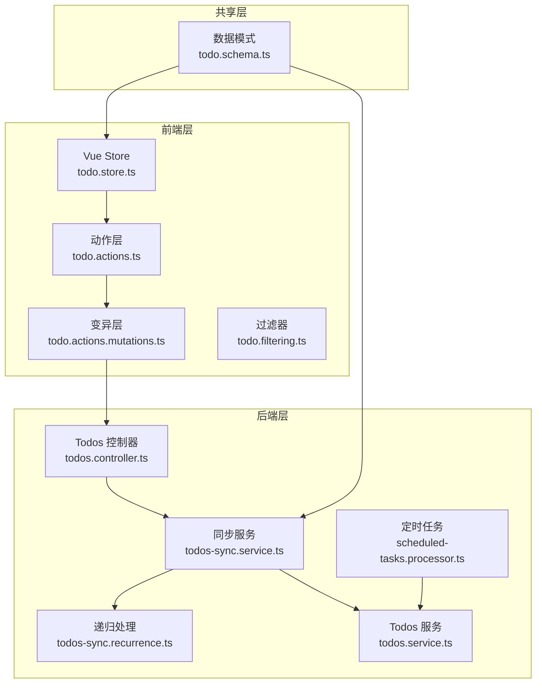
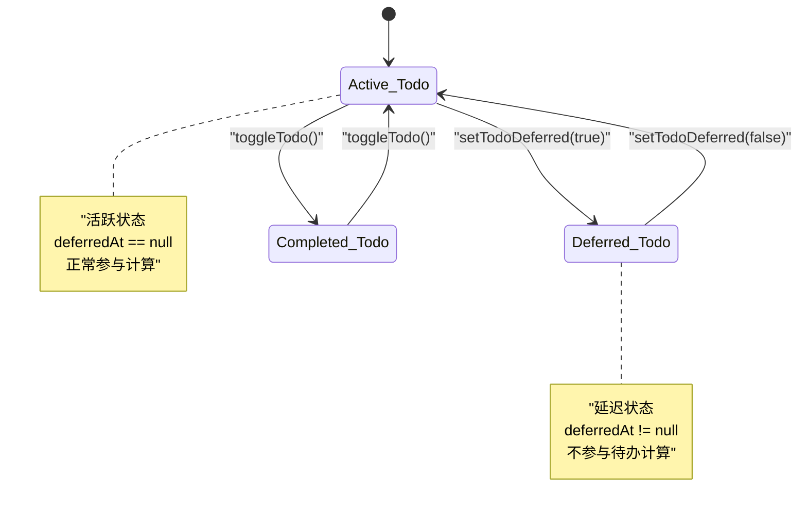
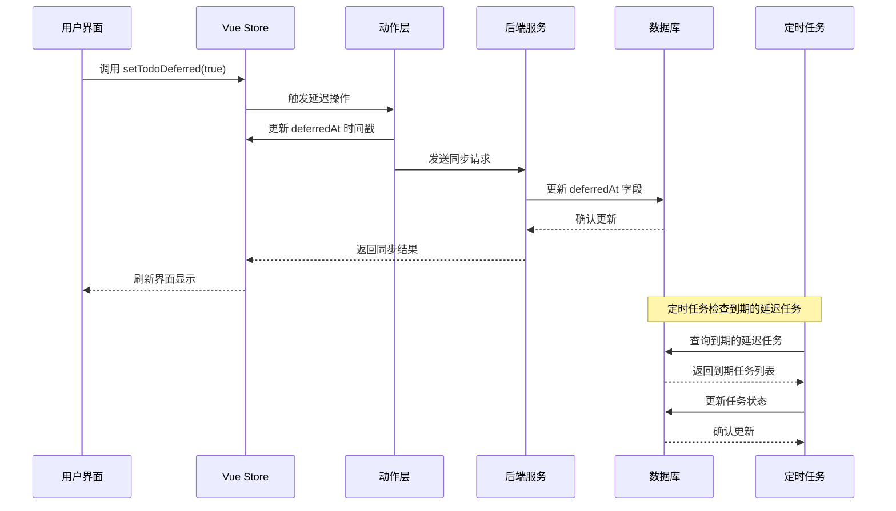
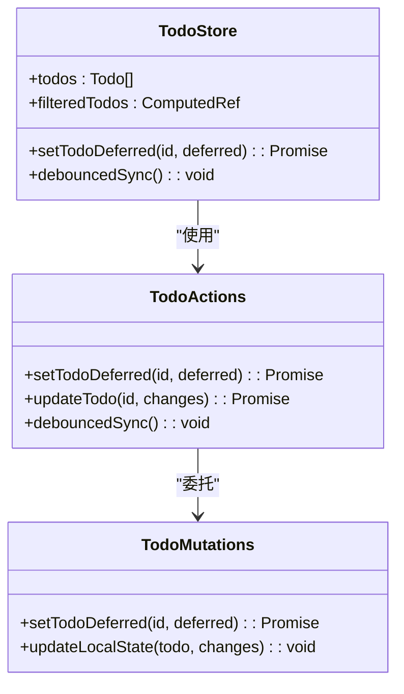
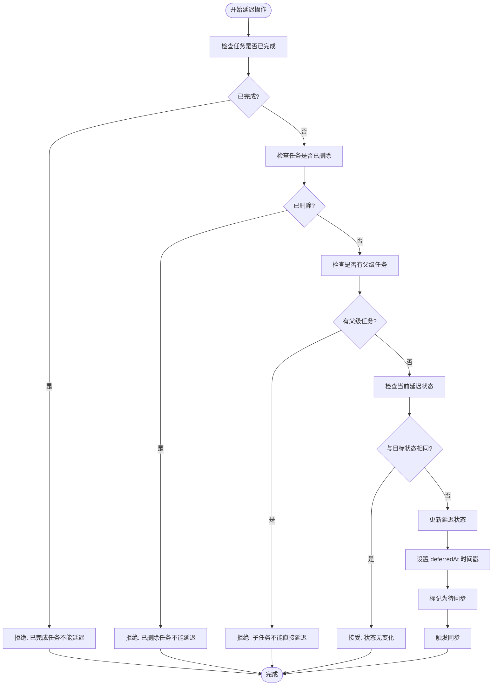
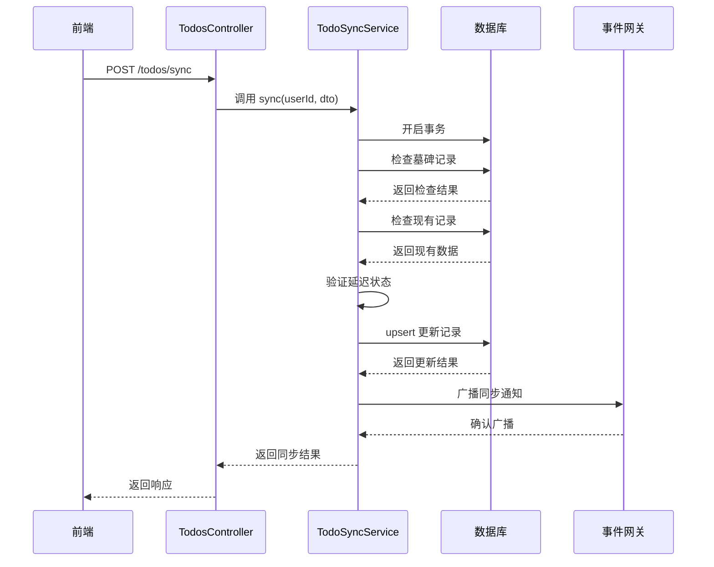
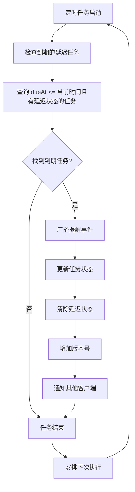
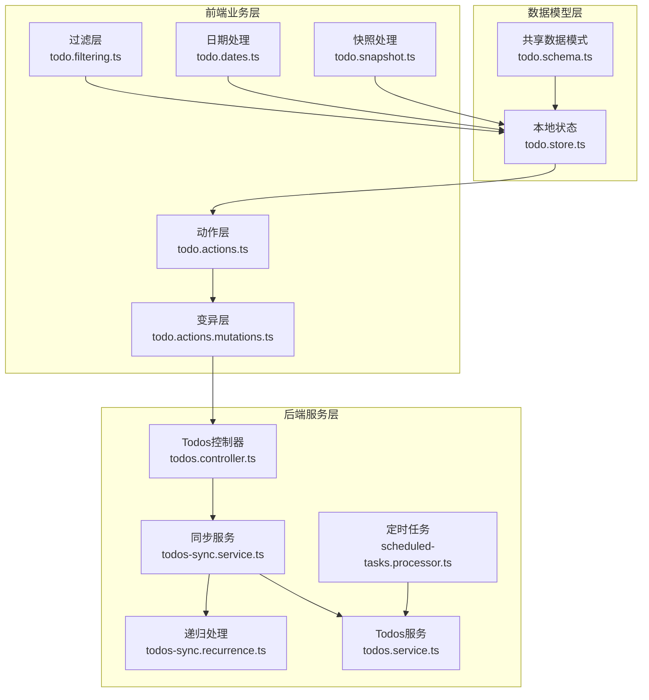

# 待办事项延迟功能

<cite>
**本文档引用的文件**
- [apps/backend/src/todos/todos.controller.ts](file://apps/backend/src/todos/todos.controller.ts)
- [apps/backend/src/todos/todos.service.ts](file://apps/backend/src/todos/todos.service.ts)
- [apps/backend/src/todos/todos.dto.ts](file://apps/backend/src/todos/todos.dto.ts)
- [apps/backend/src/todos/todos-sync.service.ts](file://apps/backend/src/todos/todos-sync.service.ts)
- [apps/backend/src/todos/todos-sync.recurrence.ts](file://apps/backend/src/todos/todos-sync.recurrence.ts)
- [apps/backend/src/scheduled-tasks/scheduled-tasks.processor.ts](file://apps/backend/src/scheduled-tasks/scheduled-tasks.processor.ts)
- [apps/backend/src/scheduled-tasks/constants.ts](file://apps/backend/src/scheduled-tasks/constants.ts)
- [apps/frontend/src/features/todo/stores/todo.store.ts](file://apps/frontend/src/features/todo/stores/todo.store.ts)
- [apps/frontend/src/features/todo/stores/todo.actions.ts](file://apps/frontend/src/features/todo/stores/todo.actions.ts)
- [apps/frontend/src/features/todo/stores/todo.actions.mutations.ts](file://apps/frontend/src/features/todo/stores/todo.actions.mutations.ts)
- [apps/frontend/src/features/todo/stores/todo.filtering.ts](file://apps/frontend/src/features/todo/stores/todo.filtering.ts)
- [apps/frontend/src/features/todo/stores/todo.dates.ts](file://apps/frontend/src/features/todo/stores/todo.dates.ts)
- [apps/frontend/src/features/todo/stores/todo.snapshot.ts](file://apps/frontend/src/features/todo/stores/todo.snapshot.ts)
- [packages/shared/src/schemas/todo.schema.ts](file://packages/shared/src/schemas/todo.schema.ts)
</cite>

## 目录
1. [简介](#简介)
2. [项目结构](#项目结构)
3. [核心组件](#核心组件)
4. [架构概览](#架构概览)
5. [详细组件分析](#详细组件分析)
6. [依赖关系分析](#依赖关系分析)
7. [性能考虑](#性能考虑)
8. [故障排除指南](#故障排除指南)
9. [结论](#结论)

## 简介

待办事项延迟功能是 Lumina Todo 应用中的一个核心特性，允许用户将未完成的待办事项暂时推迟到未来的某个时间点。该功能通过前端状态管理和后端同步机制实现了完整的延迟/恢复流程，支持跨设备同步和冲突解决。

延迟功能的核心价值在于帮助用户管理时间安排，通过"推迟"操作将当前无法处理的任务暂时移出待办列表，同时保持任务的完整性，当任务到期时可以自动重新出现。

## 项目结构

Lumina Todo 应用采用前后端分离的架构设计，延迟功能涉及多个层次的组件协作：

**图表来源**
- [apps/frontend/src/features/todo/stores/todo.store.ts:21-336](file://apps/frontend/src/features/todo/stores/todo.store.ts#L21-L336)
- [apps/backend/src/todos/todos.controller.ts:24-70](file://apps/backend/src/todos/todos.controller.ts#L24-L70)
- [apps/backend/src/todos/todos-sync.service.ts:42-226](file://apps/backend/src/todos/todos-sync.service.ts#L42-L226)

**章节来源**
- [apps/frontend/src/features/todo/stores/todo.store.ts:1-336](file://apps/frontend/src/features/todo/stores/todo.store.ts#L1-L336)
- [apps/backend/src/todos/todos.controller.ts:1-70](file://apps/backend/src/todos/todos.controller.ts#L1-L70)

## 核心组件

### 延迟状态管理

延迟功能的核心在于 `deferredAt` 字段的状态管理，该字段在多个层面发挥作用：

| 属性 | 类型 | 描述 | 使用场景 |
|------|------|------|----------|
| `deferredAt` | Date \| null | 延迟时间戳 | 标识任务被推迟的时间 |
| `completed` | boolean | 完成状态 | 与延迟状态的组合判断 |
| `deletedAt` | Date \| null | 删除状态 | 排除已删除任务 |
| `parentId` | string \| null | 父级任务 | 限制子任务不能被延迟 |

### 前端状态流转

**图表来源**
- [apps/frontend/src/features/todo/stores/todo.actions.mutations.ts:269-282](file://apps/frontend/src/features/todo/stores/todo.actions.mutations.ts#L269-L282)
- [apps/frontend/src/features/todo/stores/todo.filtering.ts:12-14](file://apps/frontend/src/features/todo/stores/todo.filtering.ts#L12-L14)

**章节来源**
- [apps/frontend/src/features/todo/stores/todo.actions.mutations.ts:269-282](file://apps/frontend/src/features/todo/stores/todo.actions.mutations.ts#L269-L282)
- [apps/frontend/src/features/todo/stores/todo.filtering.ts:12-14](file://apps/frontend/src/features/todo/stores/todo.filtering.ts#L12-L14)

## 架构概览

延迟功能的完整架构包括前端状态管理、后端同步处理和定时任务调度三个主要部分：

**图表来源**
- [apps/frontend/src/features/todo/stores/todo.actions.mutations.ts:269-282](file://apps/frontend/src/features/todo/stores/todo.actions.mutations.ts#L269-L282)
- [apps/backend/src/todos/todos-sync.service.ts:93-147](file://apps/backend/src/todos/todos-sync.service.ts#L93-L147)
- [apps/backend/src/scheduled-tasks/scheduled-tasks.processor.ts:147-190](file://apps/backend/src/scheduled-tasks/scheduled-tasks.processor.ts#L147-L190)

## 详细组件分析

### 前端延迟实现

前端的延迟功能通过 Vue Store 和动作层实现，主要包含以下关键组件：

#### 状态管理器

**图表来源**
- [apps/frontend/src/features/todo/stores/todo.store.ts:21-336](file://apps/frontend/src/features/todo/stores/todo.store.ts#L21-L336)
- [apps/frontend/src/features/todo/stores/todo.actions.ts:8-106](file://apps/frontend/src/features/todo/stores/todo.actions.ts#L8-L106)
- [apps/frontend/src/features/todo/stores/todo.actions.mutations.ts:269-282](file://apps/frontend/src/features/todo/stores/todo.actions.mutations.ts#L269-L282)

#### 延迟验证逻辑
延迟操作包含严格的验证规则：

**图表来源**
- [apps/frontend/src/features/todo/stores/todo.actions.mutations.ts:269-282](file://apps/frontend/src/features/todo/stores/todo.actions.mutations.ts#L269-L282)

**章节来源**
- [apps/frontend/src/features/todo/stores/todo.actions.mutations.ts:269-282](file://apps/frontend/src/features/todo/stores/todo.actions.mutations.ts#L269-L282)

### 后端同步处理

后端的同步服务负责处理来自前端的延迟状态变更，并确保数据一致性：

#### 同步流程

**图表来源**
- [apps/backend/src/todos/todos.controller.ts:30-38](file://apps/backend/src/todos/todos.controller.ts#L30-L38)
- [apps/backend/src/todos/todos-sync.service.ts:52-224](file://apps/backend/src/todos/todos-sync.service.ts#L52-L224)

#### 延迟状态验证
后端同步服务对延迟状态进行严格验证：

| 验证条件 | 描述 | 结果 |
|----------|------|------|
| 任务完成状态 | 延迟仅适用于未完成任务 | 已完成任务拒绝延迟 |
| 任务删除状态 | 延迟仅适用于未删除任务 | 已删除任务拒绝延迟 |
| 父级任务限制 | 子任务不能直接延迟 | 子任务拒绝延迟 |
| 版本控制 | 使用版本号防止并发冲突 | 版本不匹配产生冲突 |
| 时间戳有效性 | 验证延迟时间戳格式 | 无效时间戳拒绝 |

**章节来源**
- [apps/backend/src/todos/todos-sync.service.ts:93-147](file://apps/backend/src/todos/todos-sync.service.ts#L93-L147)

### 定时任务调度

系统使用 BullMQ 定时任务框架处理延迟任务的到期检查：

#### 任务处理流程

**图表来源**
- [apps/backend/src/scheduled-tasks/scheduled-tasks.processor.ts:147-190](file://apps/backend/src/scheduled-tasks/scheduled-tasks.processor.ts#L147-L190)

**章节来源**
- [apps/backend/src/scheduled-tasks/scheduled-tasks.processor.ts:147-190](file://apps/backend/src/scheduled-tasks/scheduled-tasks.processor.ts#L147-L190)

## 依赖关系分析

延迟功能涉及多个模块间的复杂依赖关系：

**图表来源**
- [packages/shared/src/schemas/todo.schema.ts:8-28](file://packages/shared/src/schemas/todo.schema.ts#L8-L28)
- [apps/frontend/src/features/todo/stores/todo.store.ts:139-161](file://apps/frontend/src/features/todo/stores/todo.store.ts#L139-L161)
- [apps/backend/src/todos/todos-sync.service.ts:42-47](file://apps/backend/src/todos/todos-sync.service.ts#L42-L47)

**章节来源**
- [packages/shared/src/schemas/todo.schema.ts:1-76](file://packages/shared/src/schemas/todo.schema.ts#L1-L76)
- [apps/frontend/src/features/todo/stores/todo.store.ts:1-336](file://apps/frontend/src/features/todo/stores/todo.store.ts#L1-L336)

## 性能考虑

### 前端性能优化

1. **状态缓存**: 使用 Pinia Store 缓存待办事项状态，避免重复计算
2. **批量更新**: 延迟操作采用批处理机制，减少不必要的同步请求
3. **虚拟滚动**: 对大量待办事项使用虚拟滚动技术提升渲染性能

### 后端性能优化

1. **数据库索引**: 为 `deferredAt`、`updatedAt` 等常用查询字段建立索引
2. **事务优化**: 使用数据库事务确保数据一致性，同时最小化锁持有时间
3. **异步处理**: 延迟任务检查采用异步队列处理，避免阻塞主流程

### 内存管理

1. **对象池**: 复用 Todo 对象，减少垃圾回收压力
2. **懒加载**: 延迟加载子任务数据，只在需要时查询数据库
3. **快照机制**: 使用快照技术避免频繁的数据序列化

## 故障排除指南

### 常见问题及解决方案

#### 延迟状态不同步
**症状**: 延迟后的任务在其他设备上状态不一致
**原因**: 网络延迟或同步冲突
**解决方案**:
1. 检查网络连接稳定性
2. 确认版本号同步正确
3. 查看同步冲突日志

#### 延迟任务未按时出现
**症状**: 延迟到期后任务没有重新出现
**原因**: 定时任务执行异常
**解决方案**:
1. 检查定时任务队列状态
2. 验证系统时间设置
3. 查看任务执行日志

#### 子任务延迟失败
**症状**: 尝试延迟子任务时报错
**原因**: 子任务不允许直接延迟
**解决方案**:
1. 延迟父级任务而非子任务
2. 使用批量操作功能

**章节来源**
- [apps/backend/src/todos/todos-sync.service.ts:115-126](file://apps/backend/src/todos/todos-sync.service.ts#L115-L126)
- [apps/backend/src/scheduled-tasks/scheduled-tasks.processor.ts:147-190](file://apps/backend/src/scheduled-tasks/scheduled-tasks.processor.ts#L147-L190)

## 结论

待办事项延迟功能通过精心设计的前后端架构实现了完整的任务延期管理能力。该功能不仅提供了直观的用户体验，还确保了数据的一致性和系统的可靠性。

关键优势包括：
- **实时同步**: 支持多设备间的状态同步
- **冲突解决**: 通过版本控制机制处理并发修改
- **定时提醒**: 自动化的延迟任务到期检查
- **性能优化**: 前后端协同优化确保流畅体验

未来可以考虑的功能扩展：
- 延迟模板功能，支持预设的延迟策略
- 延迟历史追踪，提供任务延期统计
- 智能推荐，基于历史数据建议最佳延迟时间