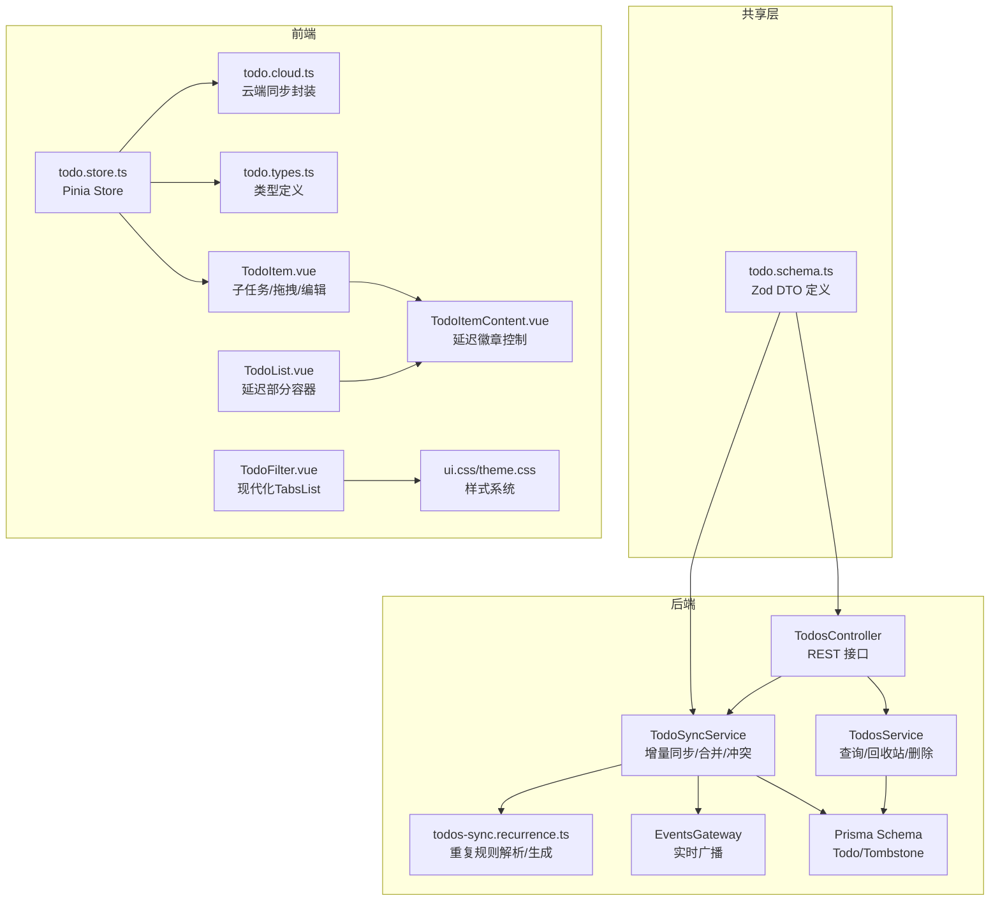
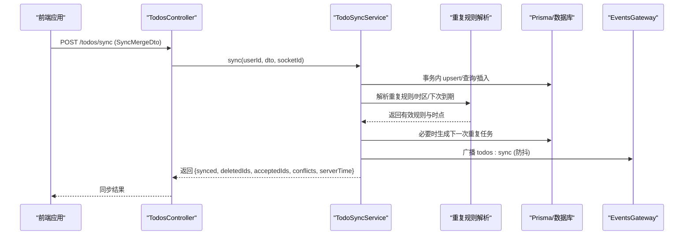
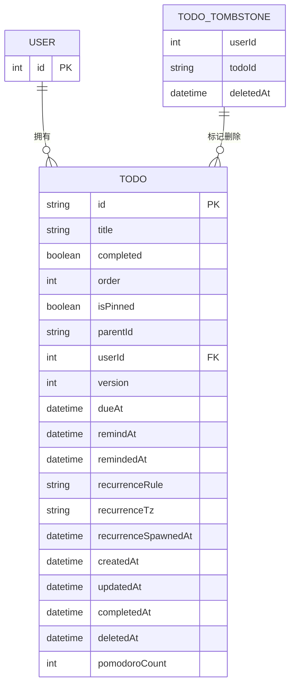
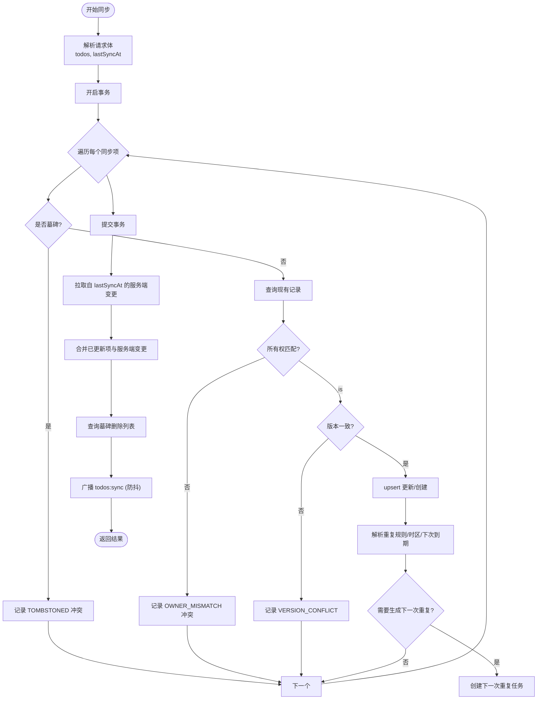
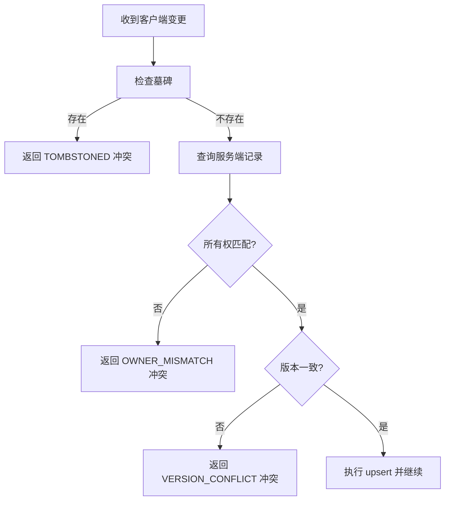
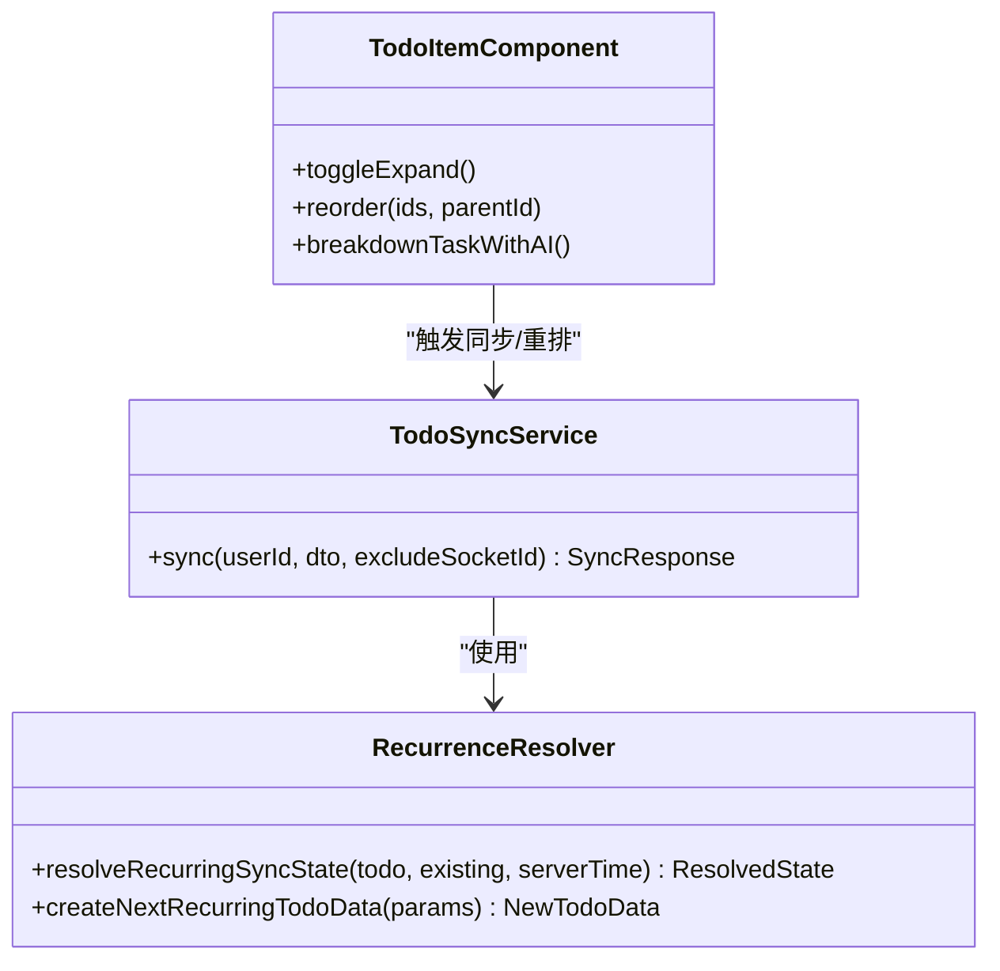
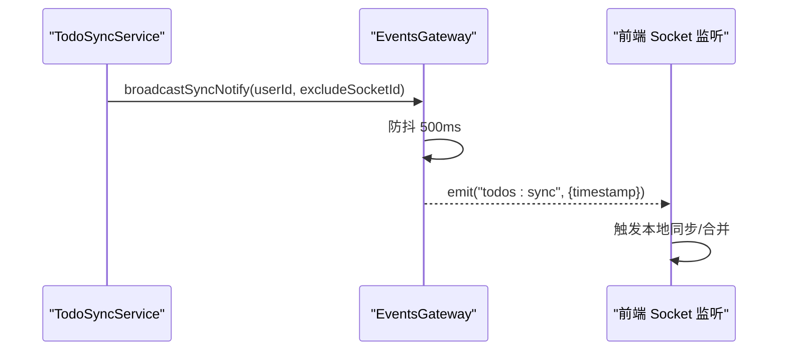
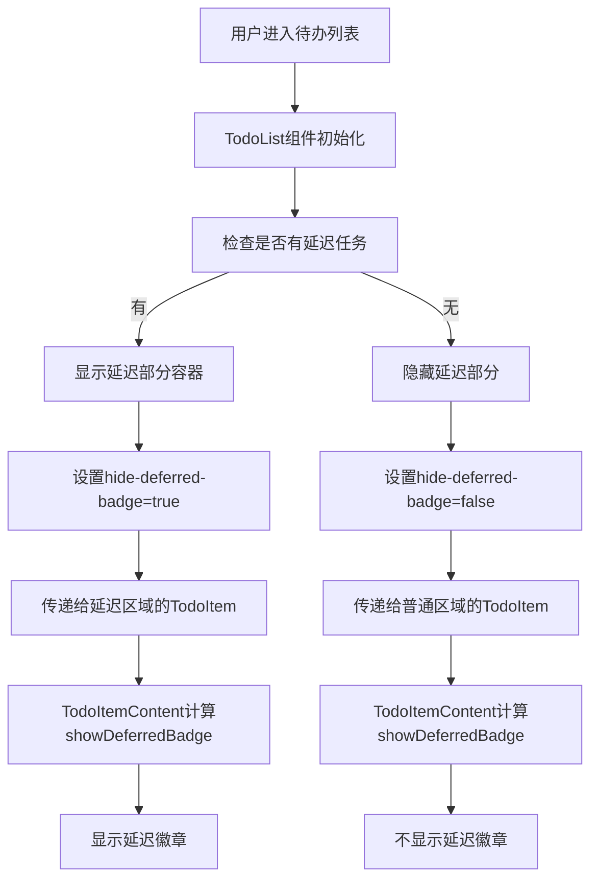
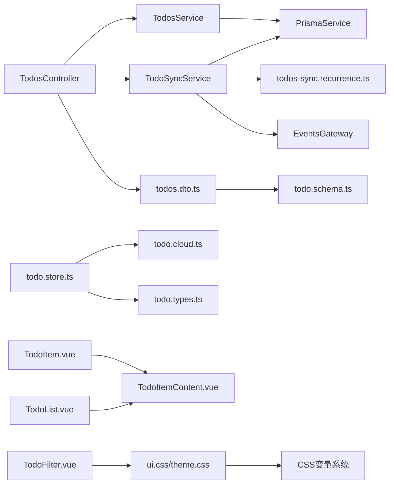

# 待办事项模块

<cite>
**本文档引用的文件**
- [apps/backend/src/todos/todos.module.ts](file://apps/backend/src/todos/todos.module.ts)
- [apps/backend/src/todos/todos.controller.ts](file://apps/backend/src/todos/todos.controller.ts)
- [apps/backend/src/todos/todos.service.ts](file://apps/backend/src/todos/todos.service.ts)
- [apps/backend/src/todos/todos.dto.ts](file://apps/backend/src/todos/todos.dto.ts)
- [apps/backend/src/todos/todos-sync.service.ts](file://apps/backend/src/todos/todos-sync.service.ts)
- [apps/backend/src/todos/todos-sync.recurrence.ts](file://apps/backend/src/todos/todos-sync.recurrence.ts)
- [apps/backend/prisma/schema/todo.prisma](file://apps/backend/prisma/schema/todo.prisma)
- [packages/shared/src/schemas/todo.schema.ts](file://packages/shared/src/schemas/todo.schema.ts)
- [apps/backend/src/events/events.gateway.ts](file://apps/backend/src/events/events.gateway.ts)
- [apps/frontend/src/features/todo/stores/todo.store.ts](file://apps/frontend/src/features/todo/stores/todo.store.ts)
- [apps/frontend/src/features/todo/stores/todo.types.ts](file://apps/frontend/src/features/todo/stores/todo.types.ts)
- [apps/frontend/src/features/todo/stores/todo.cloud.ts](file://apps/frontend/src/features/todo/stores/todo.cloud.ts)
- [apps/frontend/src/features/todo/components/TodoItem.vue](file://apps/frontend/src/features/todo/components/TodoItem.vue)
- [apps/frontend/src/features/todo/components/TodoItemContent.vue](file://apps/frontend/src/features/todo/components/TodoItemContent.vue)
- [apps/frontend/src/features/todo/components/TodoList.vue](file://apps/frontend/src/features/todo/components/TodoList.vue)
- [apps/frontend/src/features/todo/components/TodoFilter.vue](file://apps/frontend/src/features/todo/components/TodoFilter.vue)
- [apps/frontend/src/styles/ui.css](file://apps/frontend/src/styles/ui.css)
- [apps/frontend/src/styles/theme.css](file://apps/frontend/src/styles/theme.css)
- [apps/frontend/src/styles/base.css](file://apps/frontend/src/styles/base.css)
</cite>

## 更新摘要
**变更内容**
- 更新了UI组件样式改进部分，重点描述TodoFilter组件TabsList样式的现代化简化
- 新增了延迟徽章显示控制功能的详细说明，包括TodoItem组件的hideDeferredBadge属性
- 完善了TodoItemContent组件showDeferredBadge计算属性的实现细节
- 增强了TodoList组件延迟部分容器样式的改进说明
- 补充了延迟徽章显示控制的完整功能流程

## 目录
1. [简介](#简介)
2. [项目结构](#项目结构)
3. [核心组件](#核心组件)
4. [架构总览](#架构总览)
5. [详细组件分析](#详细组件分析)
6. [UI组件样式改进](#ui组件样式改进)
7. [延迟徽章显示控制](#延迟徽章显示控制)
8. [依赖关系分析](#依赖关系分析)
9. [性能考虑](#性能考虑)
10. [故障排查指南](#故障排查指南)
11. [结论](#结论)
12. [附录](#附录)

## 简介
本文件面向"待办事项模块"的技术文档，覆盖数据模型设计、业务逻辑实现、CRUD 流程与验证、嵌套结构与优先级管理、截止日期与提醒处理、实时同步与冲突解决、重复规则与子任务、批量操作、API 规范与 DTO 定义、性能优化与索引设计、以及数据迁移与版本兼容策略。目标是帮助开发者与产品人员全面理解模块的设计与实现。

**更新** 本次更新重点关注UI组件的样式现代化改进和延迟徽章显示控制功能的增强，提升了用户体验的一致性和可访问性。

## 项目结构
待办事项模块由后端 NestJS 服务、Prisma 数据层、共享 DTO 校验、WebSocket 实时网关、以及前端 Pinia Store 与组件构成。后端提供 REST 控制器与同步服务，Prisma 负责数据持久化与索引；前端负责本地/远程数据源切换、冲突展示与交互。



**图表来源**
- [apps/backend/src/todos/todos.controller.ts:20-70](file://apps/backend/src/todos/todos.controller.ts#L20-L70)
- [apps/backend/src/todos/todos.service.ts:26-146](file://apps/backend/src/todos/todos.service.ts#L26-L146)
- [apps/backend/src/todos/todos-sync.service.ts:40-221](file://apps/backend/src/todos/todos-sync.service.ts#L40-L221)
- [apps/backend/src/todos/todos-sync.recurrence.ts:87-151](file://apps/backend/src/todos/todos-sync.recurrence.ts#L87-L151)
- [apps/backend/src/events/events.gateway.ts:57-266](file://apps/backend/src/events/events.gateway.ts#L57-L266)
- [apps/backend/prisma/schema/todo.prisma:1-39](file://apps/backend/prisma/schema/todo.prisma#L1-L39)
- [packages/shared/src/schemas/todo.schema.ts:39-67](file://packages/shared/src/schemas/todo.schema.ts#L39-L67)
- [apps/frontend/src/features/todo/stores/todo.store.ts:21-335](file://apps/frontend/src/features/todo/stores/todo.store.ts#L21-L335)
- [apps/frontend/src/features/todo/stores/todo.types.ts:1-68](file://apps/frontend/src/features/todo/stores/todo.types.ts#L1-L68)
- [apps/frontend/src/features/todo/stores/todo.cloud.ts:6-44](file://apps/frontend/src/features/todo/stores/todo.cloud.ts#L6-L44)
- [apps/frontend/src/features/todo/components/TodoItem.vue:1-347](file://apps/frontend/src/features/todo/components/TodoItem.vue#L1-L347)
- [apps/frontend/src/features/todo/components/TodoItemContent.vue:1-251](file://apps/frontend/src/features/todo/components/TodoItemContent.vue#L1-L251)
- [apps/frontend/src/features/todo/components/TodoList.vue:1-289](file://apps/frontend/src/features/todo/components/TodoList.vue#L1-L289)
- [apps/frontend/src/features/todo/components/TodoFilter.vue:1-204](file://apps/frontend/src/features/todo/components/TodoFilter.vue#L1-L204)
- [apps/frontend/src/styles/ui.css:1-89](file://apps/frontend/src/styles/ui.css#L1-L89)
- [apps/frontend/src/styles/theme.css:1-170](file://apps/frontend/src/styles/theme.css#L1-L170)

**章节来源**
- [apps/backend/src/todos/todos.module.ts:1-15](file://apps/backend/src/todos/todos.module.ts#L1-L15)
- [apps/backend/src/todos/todos.controller.ts:20-70](file://apps/backend/src/todos/todos.controller.ts#L20-L70)
- [apps/backend/src/todos/todos.service.ts:26-146](file://apps/backend/src/todos/todos.service.ts#L26-L146)
- [apps/backend/src/todos/todos-sync.service.ts:40-221](file://apps/backend/src/todos/todos-sync.service.ts#L40-L221)
- [apps/backend/src/todos/todos-sync.recurrence.ts:87-151](file://apps/backend/src/todos/todos-sync.recurrence.ts#L87-L151)
- [apps/backend/prisma/schema/todo.prisma:1-39](file://apps/backend/prisma/schema/todo.prisma#L1-L39)
- [packages/shared/src/schemas/todo.schema.ts:39-67](file://packages/shared/src/schemas/todo.schema.ts#L39-L67)
- [apps/frontend/src/features/todo/stores/todo.store.ts:21-335](file://apps/frontend/src/features/todo/stores/todo.store.ts#L21-L335)
- [apps/frontend/src/features/todo/stores/todo.types.ts:1-68](file://apps/frontend/src/features/todo/stores/todo.types.ts#L1-L68)
- [apps/frontend/src/features/todo/stores/todo.cloud.ts:6-44](file://apps/frontend/src/features/todo/stores/todo.cloud.ts#L6-L44)

## 核心组件
- TodosController：提供 REST 接口，包括同步合并、查询全部、回收站、恢复、永久删除、清空回收站等。
- TodosService：基础 CRUD 查询与回收站管理，事务性删除与墓碑记录。
- TodoSyncService：离线优先的增量同步与合并，冲突检测与处理，触发实时广播。
- todos-sync.recurrence.ts：重复规则解析、时区规范化、下次到期与提醒时间计算、子任务生成。
- Prisma Schema：Todo 与 Tombstone 表结构及复合索引。
- 共享 Zod Schema：统一的 Todo、同步请求/响应、冲突定义。
- EventsGateway：基于 Socket.IO 的实时广播，按用户房间分发同步事件。
- 前端 Pinia Store：本地/远程数据源切换、冲突展示、提议变更集、拖拽重排、搜索过滤、视图模式。
- **新增** UI组件：TodoFilter（现代化TabsList）、TodoItem（延迟徽章控制）、TodoItemContent（延迟徽章计算）、TodoList（延迟部分容器样式）。

**章节来源**
- [apps/backend/src/todos/todos.controller.ts:24-70](file://apps/backend/src/todos/todos.controller.ts#L24-L70)
- [apps/backend/src/todos/todos.service.ts:26-146](file://apps/backend/src/todos/todos.service.ts#L26-L146)
- [apps/backend/src/todos/todos-sync.service.ts:40-221](file://apps/backend/src/todos/todos-sync.service.ts#L40-L221)
- [apps/backend/src/todos/todos-sync.recurrence.ts:87-151](file://apps/backend/src/todos/todos-sync.recurrence.ts#L87-L151)
- [apps/backend/prisma/schema/todo.prisma:1-39](file://apps/backend/prisma/schema/todo.prisma#L1-L39)
- [packages/shared/src/schemas/todo.schema.ts:39-67](file://packages/shared/src/schemas/todo.schema.ts#L39-L67)
- [apps/backend/src/events/events.gateway.ts:177-202](file://apps/backend/src/events/events.gateway.ts#L177-L202)
- [apps/frontend/src/features/todo/stores/todo.store.ts:21-335](file://apps/frontend/src/features/todo/stores/todo.store.ts#L21-L335)

## 架构总览
后端采用控制器-服务-数据层分层，前端通过 Pinia 维护状态，共享 Zod Schema 保障前后端数据契约一致。实时同步通过 WebSocket 广播，避免轮询带来的延迟与压力。



**图表来源**
- [apps/backend/src/todos/todos.controller.ts:30-38](file://apps/backend/src/todos/todos.controller.ts#L30-L38)
- [apps/backend/src/todos/todos-sync.service.ts:51-219](file://apps/backend/src/todos/todos-sync.service.ts#L51-L219)
- [apps/backend/src/todos/todos-sync.recurrence.ts:87-151](file://apps/backend/src/todos/todos-sync.recurrence.ts#L87-L151)
- [apps/backend/src/events/events.gateway.ts:177-202](file://apps/backend/src/events/events.gateway.ts#L177-L202)

## 详细组件分析

### 数据模型与索引设计
- Todo 表字段涵盖标题、完成状态、排序、置顶、父任务 ID、版本号、到期/提醒/已提醒时间、重复规则与时区、创建/更新/完成/删除时间、番茄钟计数等。
- 复合索引：
  - (userId, updatedAt)：加速按用户与更新时间的拉取。
  - (userId, remindAt)：加速提醒任务查询。
  - (userId, dueAt)：加速到期任务查询。
  - (deletedAt)：加速回收站查询。
- Tombstone 表用于记录删除墓碑，避免重复删除与跨用户冲突。



**图表来源**
- [apps/backend/prisma/schema/todo.prisma:1-39](file://apps/backend/prisma/schema/todo.prisma#L1-L39)

**章节来源**
- [apps/backend/prisma/schema/todo.prisma:1-39](file://apps/backend/prisma/schema/todo.prisma#L1-L39)

### 同步与合并流程
- 请求体：SyncMergeDto 基于共享 Zod Schema，包含 todos 数组与 lastSyncAt 时间戳。
- 服务端处理：
  - 事务内逐条 upsert，校验墓碑、所有权与版本一致性。
  - 使用重复规则解析模块决定是否生成下一次重复任务。
  - 拉取自上次同步以来的服务端变更，合并客户端已更新项。
  - 返回 acceptedIds、conflicts、deletedIds、serverTime。
- 前端接收后，更新本地状态，展示冲突或提示。



**图表来源**
- [apps/backend/src/todos/todos-sync.service.ts:51-219](file://apps/backend/src/todos/todos-sync.service.ts#L51-L219)
- [apps/backend/src/todos/todos-sync.recurrence.ts:87-151](file://apps/backend/src/todos/todos-sync.recurrence.ts#L87-L151)

**章节来源**
- [apps/backend/src/todos/todos-sync.service.ts:51-219](file://apps/backend/src/todos/todos-sync.service.ts#L51-L219)
- [apps/backend/src/todos/todos-sync.recurrence.ts:87-151](file://apps/backend/src/todos/todos-sync.recurrence.ts#L87-L151)
- [apps/backend/src/todos/todos.dto.ts:1-5](file://apps/backend/src/todos/todos.dto.ts#L1-L5)
- [packages/shared/src/schemas/todo.schema.ts:39-67](file://packages/shared/src/schemas/todo.schema.ts#L39-L67)

### 冲突检测与解决策略
- 冲突类型：
  - TOMBSTONED：客户端尝试更新已被服务端标记删除的任务。
  - OWNER_MISMATCH：客户端尝试更新非自身拥有的任务。
  - VERSION_CONFLICT：客户端版本与服务端不一致，拒绝合并。
- 解决策略：
  - 前端展示冲突详情，允许用户选择接受本地/服务端版本或重试。
  - 服务端严格基于版本号判断，避免客户端时钟漂移导致的并发问题。



**图表来源**
- [apps/backend/src/todos/todos-sync.service.ts:66-122](file://apps/backend/src/todos/todos-sync.service.ts#L66-L122)

**章节来源**
- [apps/backend/src/todos/todos-sync.service.ts:66-122](file://apps/backend/src/todos/todos-sync.service.ts#L66-L122)
- [apps/frontend/src/features/todo/stores/todo.types.ts:20-29](file://apps/frontend/src/features/todo/stores/todo.types.ts#L20-L29)

### 重复规则与子任务管理
- 重复规则：支持每日、工作日、每周、每月；时区规范化；根据到期时间与规则计算下一次到期与提醒时间。
- 子任务：通过 parentId 建立父子关系；支持递归展开/折叠；拖拽重排；AI 分解任务生成子任务。
- 下次重复任务生成：仅在父任务完成且未删除、无重复生成标记时触发，并在服务端记录生成时间。



**图表来源**
- [apps/backend/src/todos/todos-sync.recurrence.ts:87-151](file://apps/backend/src/todos/todos-sync.recurrence.ts#L87-L151)
- [apps/backend/src/todos/todos-sync.service.ts:158-171](file://apps/backend/src/todos/todos-sync.service.ts#L158-L171)
- [apps/frontend/src/features/todo/components/TodoItem.vue:134-178](file://apps/frontend/src/features/todo/components/TodoItem.vue#L134-L178)

**章节来源**
- [apps/backend/src/todos/todos-sync.recurrence.ts:87-151](file://apps/backend/src/todos/todos-sync.recurrence.ts#L87-L151)
- [apps/frontend/src/features/todo/components/TodoItem.vue:134-178](file://apps/frontend/src/features/todo/components/TodoItem.vue#L134-L178)

### 实时同步机制
- 服务端：EventsGateway 基于 Socket.IO，按用户房间广播 todos:sync 事件；对同一用户的广播进行 500ms 防抖，避免频繁刷新。
- 客户端：初始化 Socket 监听，收到 todos:sync 后触发本地同步，合并变更并更新 UI。
- 交互：前端在发起变更时可传入 X-Socket-ID，服务端在广播时排除该客户端，避免回环。



**图表来源**
- [apps/backend/src/todos/todos-sync.service.ts:208-210](file://apps/backend/src/todos/todos-sync.service.ts#L208-L210)
- [apps/backend/src/events/events.gateway.ts:177-202](file://apps/backend/src/events/events.gateway.ts#L177-L202)
- [apps/frontend/src/features/todo/stores/todo.store.ts:314-315](file://apps/frontend/src/features/todo/stores/todo.store.ts#L314-L315)

**章节来源**
- [apps/backend/src/events/events.gateway.ts:177-202](file://apps/backend/src/events/events.gateway.ts#L177-L202)
- [apps/frontend/src/features/todo/stores/todo.store.ts:314-315](file://apps/frontend/src/features/todo/stores/todo.store.ts#L314-L315)

### CRUD 操作与数据验证
- 查询：
  - 获取全部：按置顶、排序、创建时间排序。
  - 回收站：按删除时间倒序。
- 更新/删除：
  - 恢复：将 deletedAt 置空并递增版本。
  - 永久删除：写入墓碑表并删除记录，事务保证一致性。
  - 清空回收站：批量写墓碑并删除，事务保证一致性。
- 验证：
  - 共享 Zod Schema 对字段长度、枚举、可选时间等进行约束。
  - 控制器使用 DTO 包装，确保输入合法。

**章节来源**
- [apps/backend/src/todos/todos.service.ts:37-144](file://apps/backend/src/todos/todos.service.ts#L37-L144)
- [apps/backend/src/todos/todos.controller.ts:40-68](file://apps/backend/src/todos/todos.controller.ts#L40-L68)
- [packages/shared/src/schemas/todo.schema.ts:8-27](file://packages/shared/src/schemas/todo.schema.ts#L8-L27)

### 批量操作
- 批量同步：一次请求包含多个待办项，服务端逐条 upsert 并返回 acceptedIds/conflicts。
- 批量删除：清空回收站接口一次性删除多条记录并写入墓碑。
- 前端批处理：通过提议变更集（proposed change sets）聚合多次微小变更，减少网络往返。

**章节来源**
- [apps/backend/src/todos/todos-sync.service.ts:66-174](file://apps/backend/src/todos/todos-sync.service.ts#L66-L174)
- [apps/backend/src/todos/todos.service.ts:115-144](file://apps/backend/src/todos/todos.service.ts#L115-L144)
- [apps/frontend/src/features/todo/stores/todo.store.ts:251-267](file://apps/frontend/src/features/todo/stores/todo.store.ts#L251-L267)

### API 接口规范与数据传输对象
- 接口
  - POST /todos/sync：同步并合并（离线优先）
  - GET /todos：获取当前用户所有待办事项
  - GET /todos/trash：获取回收站中的待办事项
  - POST /todos/:id/restore：恢复已删除的待办事项
  - DELETE /todos/:id/permanent：永久删除待办事项
  - DELETE /todos/trash/clear：清空回收站
- DTO
  - SyncMergeRequest：todos 数组 + lastSyncAt
  - SyncResponse：synced 列表 + deletedIds + acceptedIds + conflicts + serverTime
  - SyncConflict：id + reason + serverVersion

**章节来源**
- [apps/backend/src/todos/todos.controller.ts:30-68](file://apps/backend/src/todos/todos.controller.ts#L30-L68)
- [apps/backend/src/todos/todos.dto.ts:1-5](file://apps/backend/src/todos/todos.dto.ts#L1-L5)
- [packages/shared/src/schemas/todo.schema.ts:39-67](file://packages/shared/src/schemas/todo.schema.ts#L39-L67)

## UI组件样式改进

### TodoFilter组件TabsList现代化简化
TodoFilter组件的TabsList样式经历了显著的现代化改进，从复杂的渐变和模糊效果简化为更现代的设计：

- **简化设计原则**：移除了原有的复杂渐变背景和backdrop-blur-xl模糊效果
- **现代化圆角**：使用更简洁的圆角设计（md:rounded-full），提升视觉一致性
- **精简阴影**：保留基本的阴影效果，去除复杂的多重阴影叠加
- **统一配色**：采用更简洁的配色方案，减少视觉噪音

**更新** TabsList现在使用简化的样式类组合，包括：
- `grid h-[var(--todo-segment-height)]`：统一高度
- `rounded-[22px] md:rounded-full`：圆角适配
- `bg-muted/15`：基础背景色
- `border border-border/60`：边框统一
- `shadow-[inset_0_1px_0_rgba(255,255,255,0.45)]`：内阴影简化版

**章节来源**
- [apps/frontend/src/features/todo/components/TodoFilter.vue:55-88](file://apps/frontend/src/features/todo/components/TodoFilter.vue#L55-L88)
- [apps/frontend/src/styles/ui.css:1-89](file://apps/frontend/src/styles/ui.css#L1-L89)
- [apps/frontend/src/styles/theme.css:1-170](file://apps/frontend/src/styles/theme.css#L1-L170)

### 样式变量系统支持
现代化样式改进得到了完整的CSS变量系统支持：

- **响应式字体大小**：通过`--todo-font-title`、`--todo-font-body`等变量实现响应式文本大小
- **统一圆角半径**：`--todo-radius-soft`变量确保所有组件圆角一致性
- **主题色彩系统**：基于CSS自定义属性的主题色彩，支持明暗模式切换
- **动画过渡优化**：全局过渡时间配置，确保动画流畅性

**章节来源**
- [apps/frontend/src/styles/theme.css:1-170](file://apps/frontend/src/styles/theme.css#L1-L170)
- [apps/frontend/src/styles/base.css:1-89](file://apps/frontend/src/styles/base.css#L1-L89)

## 延迟徽章显示控制

### TodoItem组件的hideDeferredBadge属性
TodoItem组件新增了`hideDeferredBadge`属性，用于精确控制延迟徽章的显示行为：

- **属性定义**：`hideDeferredBadge?: boolean`，默认为undefined
- **传递机制**：从父组件（TodoList）向子组件（TodoItem）传递
- **控制范围**：影响整个TodoItem及其子任务的延迟徽章显示

**更新** 在TodoList组件中，延迟部分容器使用`hide-deferred-badge="true"`传递给TodoItem，而正常部分使用`hide-deferred-badge="false"`。

**章节来源**
- [apps/frontend/src/features/todo/components/TodoItem.vue:35](file://apps/frontend/src/features/todo/components/TodoItem.vue#L35)
- [apps/frontend/src/features/todo/components/TodoList.vue:191](file://apps/frontend/src/features/todo/components/TodoList.vue#L191)
- [apps/frontend/src/features/todo/components/TodoList.vue:269](file://apps/frontend/src/features/todo/components/TodoList.vue#L269)

### TodoItemContent组件的showDeferredBadge计算属性
TodoItemContent组件引入了`showDeferredBadge`计算属性，实现了智能的延迟徽章显示逻辑：

```javascript
const showDeferredBadge = computed(
  () => !props.hideDeferredBadge && !!props.todo.deferredAt && !props.todo.completed,
)
```

**计算逻辑**：
- `!props.hideDeferredBadge`：如果父组件没有显式隐藏，则继续检查
- `!!props.todo.deferredAt`：只有当任务确实处于延迟状态时才显示
- `!props.todo.completed`：已完成的任务不应显示延迟徽章

**更新** 计算属性确保延迟徽章只在合适的时机显示，避免视觉混乱。

**章节来源**
- [apps/frontend/src/features/todo/components/TodoItemContent.vue:49-51](file://apps/frontend/src/features/todo/components/TodoItemContent.vue#L49-L51)

### TodoList组件的延迟部分容器样式改进
TodoList组件对延迟部分容器进行了专门的样式优化：

- **容器样式**：使用`rounded-[20px] md:rounded-[18px]`统一圆角
- **背景设计**：`bg-primary/[0.03]`提供微妙的强调效果
- **边框系统**：`border border-primary/10`确保视觉层次
- **展开控制**：通过`isDeferredSectionExpanded`状态控制显示/隐藏

**更新** 延迟部分容器现在使用独立的样式类，与普通任务区域形成清晰的视觉区分。

**章节来源**
- [apps/frontend/src/features/todo/components/TodoList.vue:210-211](file://apps/frontend/src/features/todo/components/TodoList.vue#L210-L211)
- [apps/frontend/src/features/todo/components/TodoList.vue:242-245](file://apps/frontend/src/features/todo/components/TodoList.vue#L242-L245)

### 延迟徽章显示控制流程
延迟徽章显示控制遵循以下完整流程：



**图表来源**
- [apps/frontend/src/features/todo/components/TodoList.vue:119-121](file://apps/frontend/src/features/todo/components/TodoList.vue#L119-L121)
- [apps/frontend/src/features/todo/components/TodoItem.vue:270](file://apps/frontend/src/features/todo/components/TodoItem.vue#L270)
- [apps/frontend/src/features/todo/components/TodoItemContent.vue:49-51](file://apps/frontend/src/features/todo/components/TodoItemContent.vue#L49-L51)

**章节来源**
- [apps/frontend/src/features/todo/components/TodoList.vue:119-121](file://apps/frontend/src/features/todo/components/TodoList.vue#L119-L121)
- [apps/frontend/src/features/todo/components/TodoItem.vue:270](file://apps/frontend/src/features/todo/components/TodoItem.vue#L270)
- [apps/frontend/src/features/todo/components/TodoItemContent.vue:49-51](file://apps/frontend/src/features/todo/components/TodoItemContent.vue#L49-L51)

## 依赖关系分析
- 控制器依赖服务与同步服务。
- 服务与同步服务依赖 Prisma 与事件网关。
- 前端 Store 依赖 Cloud 封装与类型定义，组件依赖 Store。
- 共享 Schema 作为前后端契约，贯穿控制器与同步服务。
- **新增** UI组件依赖样式系统，实现现代化设计。



**图表来源**
- [apps/backend/src/todos/todos.controller.ts:24-28](file://apps/backend/src/todos/todos.controller.ts#L24-L28)
- [apps/backend/src/todos/todos.service.ts:28-32](file://apps/backend/src/todos/todos.service.ts#L28-L32)
- [apps/backend/src/todos/todos-sync.service.ts:42-46](file://apps/backend/src/todos/todos-sync.service.ts#L42-L46)
- [apps/frontend/src/features/todo/stores/todo.store.ts:162-184](file://apps/frontend/src/features/todo/stores/todo.store.ts#L162-L184)
- [apps/frontend/src/features/todo/stores/todo.cloud.ts:6-44](file://apps/frontend/src/features/todo/stores/todo.cloud.ts#L6-L44)
- [apps/frontend/src/features/todo/components/TodoItem.vue:1-347](file://apps/frontend/src/features/todo/components/TodoItem.vue#L1-L347)
- [apps/frontend/src/features/todo/components/TodoItemContent.vue:1-251](file://apps/frontend/src/features/todo/components/TodoItemContent.vue#L1-L251)
- [apps/frontend/src/features/todo/components/TodoList.vue:1-289](file://apps/frontend/src/features/todo/components/TodoList.vue#L1-L289)
- [apps/frontend/src/features/todo/components/TodoFilter.vue:1-204](file://apps/frontend/src/features/todo/components/TodoFilter.vue#L1-L204)
- [apps/frontend/src/styles/ui.css:1-89](file://apps/frontend/src/styles/ui.css#L1-L89)
- [apps/frontend/src/styles/theme.css:1-170](file://apps/frontend/src/styles/theme.css#L1-L170)

**章节来源**
- [apps/backend/src/todos/todos.module.ts:8-14](file://apps/backend/src/todos/todos.module.ts#L8-L14)

## 性能考虑
- 索引优化：针对用户维度的高频查询建立复合索引，降低查询成本。
- 事务批处理：批量 upsert 与墓碑写入使用事务，保证一致性与吞吐。
- 防抖广播：服务端对同一用户的广播进行防抖，减少网络与前端渲染压力。
- 增量同步：lastSyncAt 限制拉取范围，避免全量扫描。
- 前端缓存与持久化：Pinia Store 持久化关键状态，减少重复加载。
- **新增** 样式优化：简化的CSS样式减少渲染开销，提升界面响应速度。

## 故障排查指南
- 版本冲突：确认客户端版本号与服务端一致后再提交；若出现冲突，先同步再修改。
- 权限冲突：确保操作的任务属于当前用户；否则返回 OWNER_MISMATCH。
- 墓碑冲突：被删除的任务无法再次更新；需先恢复或重新创建。
- 实时不同步：检查 Socket 连接状态与 CORS 配置；确认服务端广播是否触发。
- 重复规则异常：检查时区字符串是否有效；确认到期时间与规则组合合理。
- **新增** 延迟徽章显示问题：检查hideDeferredBadge属性传递是否正确；确认showDeferredBadge计算逻辑。

**章节来源**
- [apps/backend/src/todos/todos-sync.service.ts:66-122](file://apps/backend/src/todos/todos-sync.service.ts#L66-L122)
- [apps/backend/src/events/events.gateway.ts:177-202](file://apps/backend/src/events/events.gateway.ts#L177-L202)
- [apps/backend/src/todos/todos-sync.recurrence.ts:38-50](file://apps/backend/src/todos/todos-sync.recurrence.ts#L38-L50)

## 结论
该模块通过清晰的分层设计、严格的同步协议与重复规则处理、完善的实时广播与冲突解决机制，实现了高可用的待办事项管理能力。结合共享 DTO、事务性操作与索引优化，既保证了数据一致性，也兼顾了性能与扩展性。

**更新** 本次UI组件样式改进和延迟徽章控制功能的增强，进一步提升了用户体验的现代化水平和可访问性，使界面更加简洁直观，同时提供了更精细的显示控制能力。

## 附录

### 数据迁移与版本兼容
- 字段演进：新增字段建议提供默认值与可空性，避免破坏既有数据。
- 索引变更：新增索引需评估对写入性能的影响，必要时分批上线。
- 版本号策略：严格使用版本号进行冲突检测，避免客户端时钟偏差引发的并发问题。
- 墓碑机制：删除操作写入墓碑表，便于跨版本与跨实例的删除一致性维护。
- **新增** 样式兼容：UI组件样式更新时确保向后兼容，避免破坏现有功能。

### 最佳实践
- 前端：对频繁变更进行去抖/节流，减少同步频率。
- 后端：保持事务边界清晰，避免长事务阻塞。
- 共享：前后端统一使用 Zod Schema，减少数据契约分歧。
- 监控：记录同步耗时、冲突率与广播延迟，持续优化。
- **新增** UI：遵循CSS变量系统，确保主题一致性；合理使用hideDeferredBadge属性控制显示逻辑。

### 样式系统集成
- **CSS变量系统**：通过`:root`和`.dark`类名实现主题切换
- **响应式设计**：使用容器查询和媒体查询适配不同屏幕尺寸
- **动画优化**：全局过渡配置确保动画流畅性
- **无障碍支持**：语义化HTML结构和适当的ARIA属性

**章节来源**
- [apps/frontend/src/styles/theme.css:1-170](file://apps/frontend/src/styles/theme.css#L1-L170)
- [apps/frontend/src/styles/base.css:1-89](file://apps/frontend/src/styles/base.css#L1-L89)
- [apps/frontend/src/styles/ui.css:1-89](file://apps/frontend/src/styles/ui.css#L1-L89)