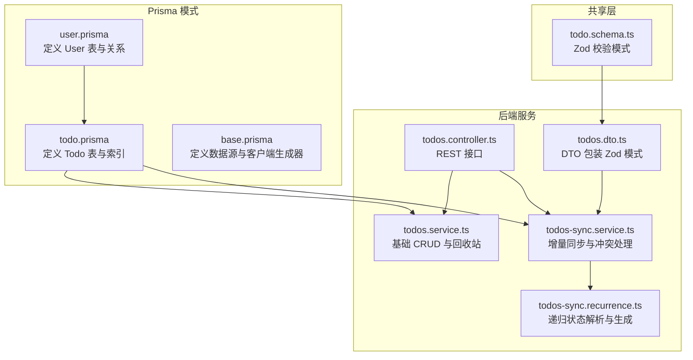
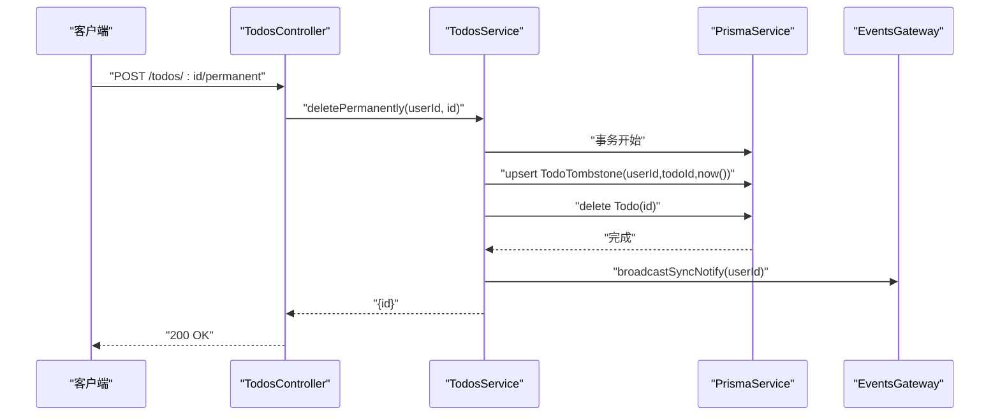
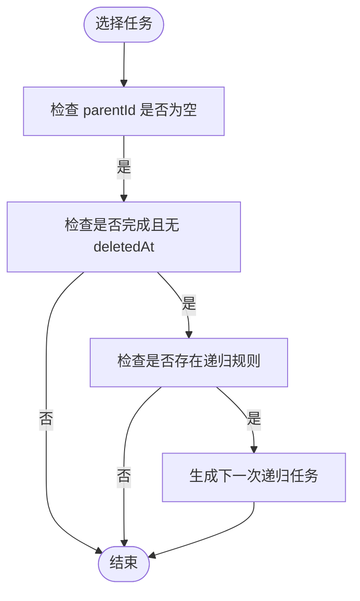
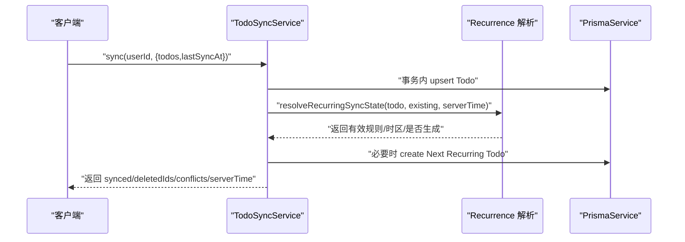
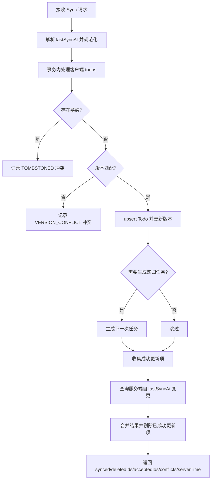
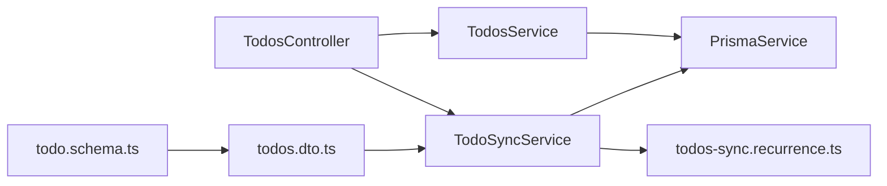

# 数据模型设计

<cite>
**本文引用的文件**
- [todo.prisma](file://apps/backend/prisma/schema/todo.prisma)
- [user.prisma](file://apps/backend/prisma/schema/user.prisma)
- [base.prisma](file://apps/backend/prisma/schema/base.prisma)
- [todo.schema.ts](file://packages/shared/src/schemas/todo.schema.ts)
- [todos.dto.ts](file://apps/backend/src/todos/todos.dto.ts)
- [todos.service.ts](file://apps/backend/src/todos/todos.service.ts)
- [todos.controller.ts](file://apps/backend/src/todos/todos.controller.ts)
- [todos-sync.service.ts](file://apps/backend/src/todos/todos-sync.service.ts)
- [todos-sync.recurrence.ts](file://apps/backend/src/todos/todos-sync.recurrence.ts)
</cite>

## 目录
1. [简介](#简介)
2. [项目结构](#项目结构)
3. [核心组件](#核心组件)
4. [架构总览](#架构总览)
5. [详细组件分析](#详细组件分析)
6. [依赖分析](#依赖分析)
7. [性能考虑](#性能考虑)
8. [故障排查指南](#故障排查指南)
9. [结论](#结论)
10. [附录](#附录)

## 简介
本文件系统化梳理了待办事项（Todo）实体的数据模型设计，覆盖字段定义、数据类型与约束、软删除机制、时间戳语义、层级关系（父子任务）、递归重复（循环任务）机制、Prisma 模式与 DTO 验证规则、索引与查询优化策略，并通过图示展示实体关系与关键流程。

## 项目结构
围绕 Todo 的数据模型，相关代码分布在以下位置：
- Prisma 模式：定义数据库表结构、索引与关系
- 共享 DTO 校验：统一前后端校验规则
- NestJS 控制器与服务：暴露 API、执行业务逻辑
- 递归同步与重复任务：处理离线优先的增量同步与周期性任务生成



**图表来源**
- [todo.prisma:1-39](file://apps/backend/prisma/schema/todo.prisma#L1-L39)
- [user.prisma:1-16](file://apps/backend/prisma/schema/user.prisma#L1-L16)
- [base.prisma:1-9](file://apps/backend/prisma/schema/base.prisma#L1-L9)
- [todo.schema.ts:1-75](file://packages/shared/src/schemas/todo.schema.ts#L1-L75)
- [todos.controller.ts:1-70](file://apps/backend/src/todos/todos.controller.ts#L1-L70)
- [todos.service.ts:1-146](file://apps/backend/src/todos/todos.service.ts#L1-L146)
- [todos-sync.service.ts:1-221](file://apps/backend/src/todos/todos-sync.service.ts#L1-L221)
- [todos-sync.recurrence.ts:1-208](file://apps/backend/src/todos/todos-sync.recurrence.ts#L1-L208)

**章节来源**
- [todo.prisma:1-39](file://apps/backend/prisma/schema/todo.prisma#L1-L39)
- [user.prisma:1-16](file://apps/backend/prisma/schema/user.prisma#L1-L16)
- [base.prisma:1-9](file://apps/backend/prisma/schema/base.prisma#L1-L9)
- [todo.schema.ts:1-75](file://packages/shared/src/schemas/todo.schema.ts#L1-L75)
- [todos.controller.ts:1-70](file://apps/backend/src/todos/todos.controller.ts#L1-L70)
- [todos.service.ts:1-146](file://apps/backend/src/todos/todos.service.ts#L1-L146)
- [todos-sync.service.ts:1-221](file://apps/backend/src/todos/todos-sync.service.ts#L1-L221)
- [todos-sync.recurrence.ts:1-208](file://apps/backend/src/todos/todos-sync.recurrence.ts#L1-L208)

## 核心组件
- Todo 实体：承载任务标题、完成状态、排序、置顶、父任务、版本、到期/提醒/已提醒时间、递归规则与时区、创建/更新/完成/删除时间戳、番茄钟计数等
- User 实体：用户基本信息与与 Todo 的一对多关系
- 软删除与墓碑（Tombstone）：通过 deletedAt 字段与独立的墓碑表实现软删除与回收站管理
- 递归重复（Recurrence）：基于规则与时区计算下一次任务生成
- 增量同步（Sync）：离线优先策略，结合版本号与墓碑表解决冲突

**章节来源**
- [todo.prisma:1-39](file://apps/backend/prisma/schema/todo.prisma#L1-L39)
- [user.prisma:1-16](file://apps/backend/prisma/schema/user.prisma#L1-L16)
- [todo.schema.ts:1-75](file://packages/shared/src/schemas/todo.schema.ts#L1-L75)
- [todos-sync.recurrence.ts:1-208](file://apps/backend/src/todos/todos-sync.recurrence.ts#L1-L208)
- [todos-sync.service.ts:1-221](file://apps/backend/src/todos/todos-sync.service.ts#L1-L221)

## 架构总览
Todo 数据模型围绕“用户-任务”关系展开，支持：
- 层级结构：parentId 指向父任务，形成树形结构
- 软删除：deletedAt 非空表示进入回收站
- 递归重复：根据 dueAt、recurrenceRule、recurrenceTz 生成下一次任务
- 墓碑表：记录被永久删除的任务，用于同步冲突识别
- 增量同步：基于 lastSyncAt 与版本号的离线优先合并

```mermaid
erDiagram
USER ||--o{ TODO : "拥有"
TODO }o--|| TODO : "父任务(可选)"
TODO_TOMBSTONE ||--o{ TODO : "墓碑关联"
USER {
int id PK
string email UK
string name
string password?
string avatar?
string resetPasswordToken?
datetime resetPasswordExpires?
datetime createdAt
datetime updatedAt
}
TODO {
string id PK
string title
boolean completed
int order
boolean isPinned
string parentId?
int userId FK
int version
datetime dueAt?
datetime remindAt?
datetime remindedAt?
string recurrenceRule?
string recurrenceTz?
datetime recurrenceSpawnedAt?
datetime createdAt
datetime updatedAt
datetime completedAt?
datetime deletedAt?
int pomodoroCount
}
TODO_TOMBSTONE {
int userId FK
string todoId FK
datetime deletedAt
}
```

**图表来源**
- [user.prisma:1-16](file://apps/backend/prisma/schema/user.prisma#L1-L16)
- [todo.prisma:1-39](file://apps/backend/prisma/schema/todo.prisma#L1-L39)

## 详细组件分析

### Todo 实体字段定义与约束
- 标识与归属
  - id：字符串主键，UUID 默认值
  - userId：整型外键，指向 User.id
- 基本信息
  - title：字符串，最大长度限制
  - completed：布尔，默认 false
  - order：整型，排序用
  - isPinned：布尔，默认 false
  - parentId：字符串可空，指向父任务
- 时间与时区
  - dueAt：到期时间（可空）
  - remindAt：提醒时间（可空）
  - remindedAt：已提醒时间（可空）
  - recurrenceRule：枚举（DAILY/WEEKDAYS/WEEKLY/MONTHLY，可空）
  - recurrenceTz：字符串，时区名（可空）
  - recurrenceSpawnedAt：生成下一次递归任务的时间（可空）
- 版本与统计
  - version：整型，版本号，用于同步冲突检测
  - pomodoroCount：整型，番茄钟计数
- 时间戳
  - createdAt：默认当前时间
  - updatedAt：自动更新
  - completedAt：完成时间（可空）
  - deletedAt：软删除时间（可空）
- 关系
  - user：与 User 的关系，字段映射到 userId

**章节来源**
- [todo.prisma:1-39](file://apps/backend/prisma/schema/todo.prisma#L1-L39)
- [todo.schema.ts:8-27](file://packages/shared/src/schemas/todo.schema.ts#L8-L27)

### 软删除机制与墓碑表
- 软删除：通过设置 deletedAt 非空标记删除，查询默认过滤 deletedAt 为空
- 回收站：提供回收站查询接口，按删除时间倒序
- 永久删除：写入墓碑表（记录用户+任务+删除时间），再物理删除
- 冲突识别：同步时若发现墓碑记录，则报告 TOMBSTONED 冲突



**图表来源**
- [todos.controller.ts:58-62](file://apps/backend/src/todos/todos.controller.ts#L58-L62)
- [todos.service.ts:89-110](file://apps/backend/src/todos/todos.service.ts#L89-L110)

**章节来源**
- [todos.controller.ts:58-62](file://apps/backend/src/todos/todos.controller.ts#L58-L62)
- [todos.service.ts:89-110](file://apps/backend/src/todos/todos.service.ts#L89-L110)
- [todo.prisma:30-38](file://apps/backend/prisma/schema/todo.prisma#L30-L38)

### 层级结构（父子任务）
- 父子关系：通过 parentId 字段建立自引用，形成树形结构
- 查询排序：默认按 isPinned 降序、order 升序、createdAt 降序排列
- 递归生成：仅在顶层任务（parentId 为空）且完成时才生成下一次递归任务



**图表来源**
- [todos-sync.recurrence.ts:125-132](file://apps/backend/src/todos/todos-sync.recurrence.ts#L125-L132)
- [todos-sync.service.ts:158-171](file://apps/backend/src/todos/todos-sync.service.ts#L158-L171)

**章节来源**
- [todo.prisma:7-21](file://apps/backend/prisma/schema/todo.prisma#L7-L21)
- [todos-sync.recurrence.ts:125-132](file://apps/backend/src/todos/todos-sync.recurrence.ts#L125-L132)
- [todos-sync.service.ts:158-171](file://apps/backend/src/todos/todos-sync.service.ts#L158-L171)

### 递归重复（Recurrence）机制
- 规则与时区
  - recurrenceRule：DAILY/WEEKDAYS/WEEKLY/MONTHLY
  - recurrenceTz：合法时区字符串，用于跨时区一致性
- 状态解析
  - resolveRecurringSyncState：综合客户端与服务端现有状态，决定是否生成下一次任务、是否保留提醒状态、有效规则与时区
- 下一次任务生成
  - createNextRecurringTodoData：基于 dueAt、remindAt、规则与时区计算下一次 dueAt/remindAt
- 生成条件
  - 顶层任务（parentId 为空）、未完成但本次完成、无 deletedAt、存在有效规则



**图表来源**
- [todos-sync.service.ts:51-174](file://apps/backend/src/todos/todos-sync.service.ts#L51-L174)
- [todos-sync.recurrence.ts:87-151](file://apps/backend/src/todos/todos-sync.recurrence.ts#L87-L151)
- [todos-sync.recurrence.ts:153-207](file://apps/backend/src/todos/todos-sync.recurrence.ts#L153-L207)

**章节来源**
- [todo.schema.ts:3-22](file://packages/shared/src/schemas/todo.schema.ts#L3-L22)
- [todos-sync.recurrence.ts:1-208](file://apps/backend/src/todos/todos-sync.recurrence.ts#L1-L208)
- [todos-sync.service.ts:1-221](file://apps/backend/src/todos/todos-sync.service.ts#L1-L221)

### 增量同步与冲突处理
- 离线优先：客户端提交的变更先入库，再拉取服务端变更
- 冲突检测
  - TOMBSTONED：墓碑表存在即冲突
  - OWNER_MISMATCH：任务归属不一致
  - VERSION_CONFLICT：版本号不匹配
- 同步流程
  - 事务内处理客户端变更
  - 拉取自 lastSyncAt 以来的服务端变更
  - 合并结果并返回 deletedIds、acceptedIds、conflicts、serverTime



**图表来源**
- [todos-sync.service.ts:51-219](file://apps/backend/src/todos/todos-sync.service.ts#L51-L219)

**章节来源**
- [todos-sync.service.ts:51-219](file://apps/backend/src/todos/todos-sync.service.ts#L51-L219)
- [todo.schema.ts:39-67](file://packages/shared/src/schemas/todo.schema.ts#L39-L67)

### Prisma 模式定义与关系
- Todo 模型
  - 主键：id（UUID）
  - 外键：userId -> User.id
  - 索引：复合索引（userId, updatedAt）、（userId, remindAt）、（userId, dueAt）、（deletedAt）
  - 关系：@relation(fields: [userId], references: [id])
- User 模型
  - 主键：id（自增）
  - 关系：todos -> Todo[]
- Tombstone 模型
  - 主键：(userId, todoId)
  - 索引：(userId, deletedAt)

**章节来源**
- [todo.prisma:1-39](file://apps/backend/prisma/schema/todo.prisma#L1-L39)
- [user.prisma:1-16](file://apps/backend/prisma/schema/user.prisma#L1-L16)

### DTO 验证规则与类型
- TodoSchema：定义 Todo 字段的 Zod 校验，含长度、数值范围、可空性、枚举等
- RecurrenceRuleSchema：枚举 DAILY/WEEKDAYS/WEEKLY/MONTHLY
- SyncMergeRequestSchema：数组 todos 与 lastSyncAt（日期或可解析字符串）
- SyncConflictSchema/SyncResponseSchema：冲突与响应结构
- Todos DTO：基于 Zod 的 DTO 包装类

**章节来源**
- [todo.schema.ts:1-75](file://packages/shared/src/schemas/todo.schema.ts#L1-L75)
- [todos.dto.ts:1-5](file://apps/backend/src/todos/todos.dto.ts#L1-L5)

## 依赖分析
- 控制器依赖服务：TodosController 依赖 TodosService 与 TodoSyncService
- 服务依赖 Prisma：TodosService 与 TodoSyncService 使用 PrismaService 访问数据库
- 递归模块：TodoSyncService 依赖 todos-sync.recurrence.ts 提供的递归解析与生成函数
- 共享层：DTO 与校验规则来自 shared 包，确保前后端一致



**图表来源**
- [todos.controller.ts:1-70](file://apps/backend/src/todos/todos.controller.ts#L1-L70)
- [todos.service.ts:1-146](file://apps/backend/src/todos/todos.service.ts#L1-L146)
- [todos-sync.service.ts:1-221](file://apps/backend/src/todos/todos-sync.service.ts#L1-L221)
- [todos-sync.recurrence.ts:1-208](file://apps/backend/src/todos/todos-sync.recurrence.ts#L1-L208)
- [todos.dto.ts:1-5](file://apps/backend/src/todos/todos.dto.ts#L1-L5)
- [todo.schema.ts:1-75](file://packages/shared/src/schemas/todo.schema.ts#L1-L75)

**章节来源**
- [todos.controller.ts:1-70](file://apps/backend/src/todos/todos.controller.ts#L1-L70)
- [todos.service.ts:1-146](file://apps/backend/src/todos/todos.service.ts#L1-L146)
- [todos-sync.service.ts:1-221](file://apps/backend/src/todos/todos-sync.service.ts#L1-L221)
- [todos-sync.recurrence.ts:1-208](file://apps/backend/src/todos/todos-sync.recurrence.ts#L1-L208)
- [todos.dto.ts:1-5](file://apps/backend/src/todos/todos.dto.ts#L1-L5)
- [todo.schema.ts:1-75](file://packages/shared/src/schemas/todo.schema.ts#L1-L75)

## 性能考虑
- 索引设计
  - (userId, updatedAt)：支持按用户快速检索最近更新项
  - (userId, remindAt)：支持提醒任务的高效筛选
  - (userId, dueAt)：支持到期任务的高效筛选
  - (deletedAt)：支持回收站查询与软删除过滤
- 查询优化
  - 默认排序：isPinned > order > createdAt，减少 UI 层排序成本
  - 事务内批量 upsert：降低网络往返与锁竞争
  - 初次同步时排除回收站内容，减少无关数据传输
- 递归生成
  - 仅在顶层任务完成时生成下一次任务，避免无限膨胀
  - 时区解析失败时回退至 UTC，保证一致性

**章节来源**
- [todo.prisma:23-26](file://apps/backend/prisma/schema/todo.prisma#L23-L26)
- [todos.service.ts:37-46](file://apps/backend/src/todos/todos.service.ts#L37-L46)
- [todos-sync.service.ts:177-187](file://apps/backend/src/todos/todos-sync.service.ts#L177-L187)
- [todos-sync.recurrence.ts:38-50](file://apps/backend/src/todos/todos-sync.recurrence.ts#L38-L50)

## 故障排查指南
- 同步冲突
  - TOMBSTONED：确认墓碑表是否存在对应记录；如存在，需先恢复或接受服务端删除
  - OWNER_MISMATCH：检查任务归属是否正确
  - VERSION_CONFLICT：检查客户端版本号是否与服务端一致
- 递归任务未生成
  - 检查 dueAt 是否为空、recurrenceRule 是否有效、parentId 是否为空
  - 确认任务已完成且未被删除
- 回收站问题
  - 检查 deletedAt 是否非空
  - 永久删除会写入墓碑表，无法通过常规查询找回

**章节来源**
- [todos-sync.service.ts:66-122](file://apps/backend/src/todos/todos-sync.service.ts#L66-L122)
- [todos-sync.recurrence.ts:125-132](file://apps/backend/src/todos/todos-sync.recurrence.ts#L125-L132)
- [todos.service.ts:51-60](file://apps/backend/src/todos/todos.service.ts#L51-L60)

## 结论
该数据模型以清晰的字段定义、完善的软删除与墓碑机制、严谨的增量同步与冲突处理、以及针对性能的索引设计，构建了稳定可靠的待办事项系统。层级结构与递归重复能力满足复杂任务管理需求，同时通过共享 DTO 与 Prisma 模式确保前后端一致性与可维护性。

## 附录
- 字段与类型对照
  - id：String（UUID）
  - title：String（1..500）
  - completed：Boolean
  - order：Int
  - isPinned：Boolean
  - parentId：String?
  - userId：Int
  - version：Int
  - dueAt/remindAt/remindedAt：DateTime?
  - recurrenceRule：枚举（DAILY/WEEKDAYS/WEEKLY/MONTHLY）?
  - recurrenceTz：String（1..64）?
  - recurrenceSpawnedAt：DateTime?
  - createdAt/updatedAt/completedAt/deletedAt：DateTime
  - pomodoroCount：Int