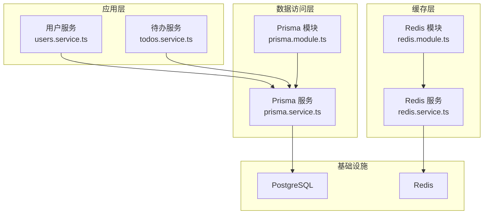
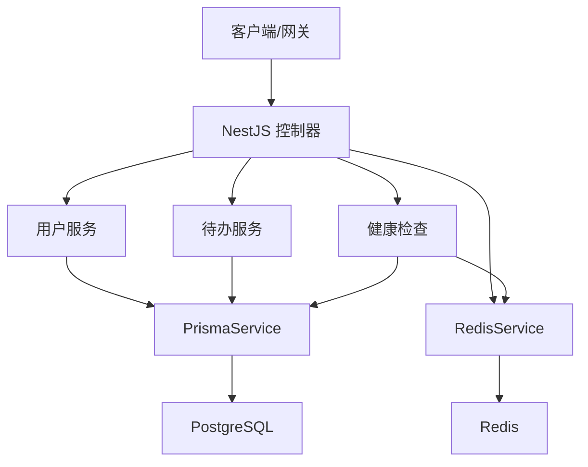
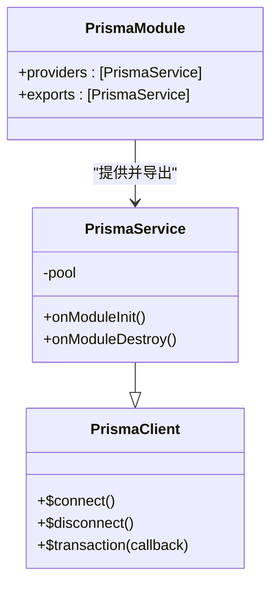
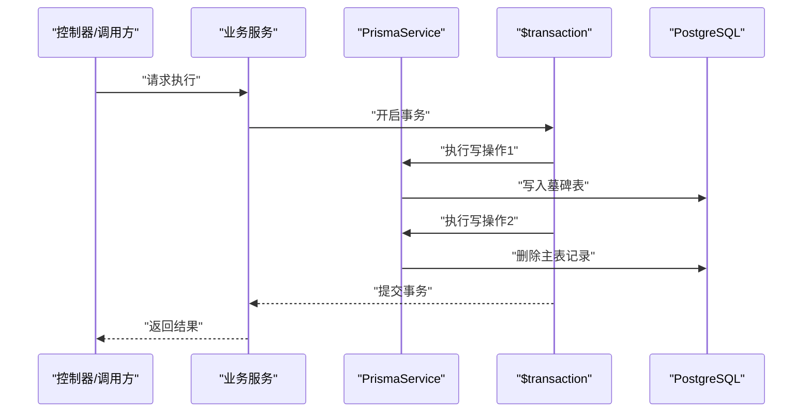
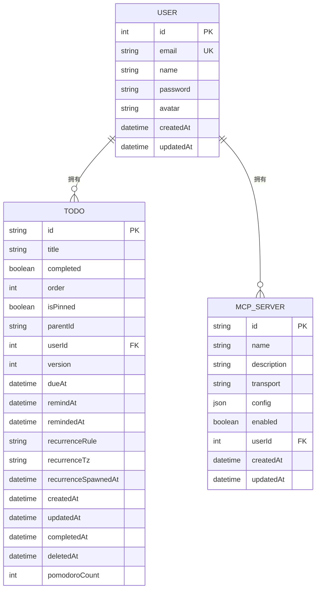
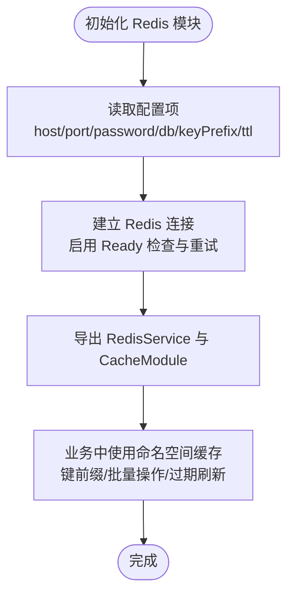
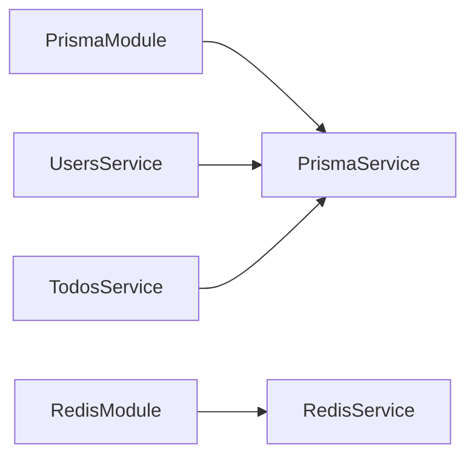

# 数据库集成

<cite>
**本文引用的文件**
- [apps/backend/prisma/schema/base.prisma](file://apps/backend/prisma/schema/base.prisma)
- [apps/backend/prisma/schema/user.prisma](file://apps/backend/prisma/schema/user.prisma)
- [apps/backend/prisma/schema/todo.prisma](file://apps/backend/prisma/schema/todo.prisma)
- [apps/backend/prisma/schema/mcp.prisma](file://apps/backend/prisma/schema/mcp.prisma)
- [apps/backend/prisma.config.js](file://apps/backend/prisma.config.js)
- [apps/backend/src/prisma/prisma.service.ts](file://apps/backend/src/prisma/prisma.service.ts)
- [apps/backend/src/prisma/prisma.module.ts](file://apps/backend/src/prisma/prisma.module.ts)
- [apps/backend/src/health/prisma.health.ts](file://apps/backend/src/health/prisma.health.ts)
- [apps/backend/src/redis/redis.module.ts](file://apps/backend/src/redis/redis.module.ts)
- [apps/backend/src/redis/redis.service.ts](file://apps/backend/src/redis/redis.service.ts)
- [apps/backend/src/redis/redis.health.ts](file://apps/backend/src/redis/redis.health.ts)
- [apps/backend/src/users/users.service.ts](file://apps/backend/src/users/users.service.ts)
- [apps/backend/src/todos/todos.service.ts](file://apps/backend/src/todos/todos.service.ts)
- [apps/backend/package.json](file://apps/backend/package.json)
</cite>

## 目录
1. [简介](#简介)
2. [项目结构](#项目结构)
3. [核心组件](#核心组件)
4. [架构总览](#架构总览)
5. [组件详解](#组件详解)
6. [依赖关系分析](#依赖关系分析)
7. [性能考量](#性能考量)
8. [故障排查指南](#故障排查指南)
9. [结论](#结论)
10. [附录](#附录)

## 简介
本技术文档聚焦于数据库集成实践，围绕以下主题展开：
- Prisma ORM 的配置与使用模式
- 数据库连接池管理与事务处理机制
- 实体关系模型与表结构设计原则
- 查询优化策略与索引设计建议
- 数据迁移管理与版本控制方案
- Redis 缓存集成与会话存储策略
- 数据库性能监控与慢查询分析方法
- 备份恢复与灾难恢复计划

## 项目结构
后端采用 NestJS 模块化组织，数据库层由 Prisma 提供 ORM 支撑，缓存层基于 Redis。核心目录与职责如下：
- prisma/schema：定义数据模型与索引
- src/prisma：Prisma 客户端封装与注入
- src/redis：Redis 缓存模块与服务
- src/health：数据库与缓存健康检查
- src/users、src/todos：业务服务对 Prisma 的调用示例

图表来源
- [apps/backend/src/prisma/prisma.module.ts:1-10](file://apps/backend/src/prisma/prisma.module.ts#L1-L10)
- [apps/backend/src/prisma/prisma.service.ts:1-34](file://apps/backend/src/prisma/prisma.service.ts#L1-L34)
- [apps/backend/src/redis/redis.module.ts:1-84](file://apps/backend/src/redis/redis.module.ts#L1-L84)
- [apps/backend/src/redis/redis.service.ts:1-233](file://apps/backend/src/redis/redis.service.ts#L1-L233)

章节来源
- [apps/backend/src/prisma/prisma.module.ts:1-10](file://apps/backend/src/prisma/prisma.module.ts#L1-L10)
- [apps/backend/src/prisma/prisma.service.ts:1-34](file://apps/backend/src/prisma/prisma.service.ts#L1-L34)
- [apps/backend/src/redis/redis.module.ts:1-84](file://apps/backend/src/redis/redis.module.ts#L1-L84)
- [apps/backend/src/redis/redis.service.ts:1-233](file://apps/backend/src/redis/redis.service.ts#L1-L233)

## 核心组件
- Prisma 配置与客户端
  - 生成器与数据源在基础 schema 中声明，适配器使用 PostgreSQL
  - 客户端通过自定义 PrismaService 封装连接池与生命周期管理
- Redis 缓存模块
  - 异步工厂从配置注入器读取 Redis 参数，建立连接与重试策略
  - 提供统一的缓存服务接口，支持键前缀、命名空间、批量操作等
- 健康检查
  - 数据库健康检查通过原生查询验证连通性
  - Redis 健康检查通过 set/get 验证读写能力

章节来源
- [apps/backend/prisma/schema/base.prisma:1-9](file://apps/backend/prisma/schema/base.prisma#L1-L9)
- [apps/backend/src/prisma/prisma.service.ts:1-34](file://apps/backend/src/prisma/prisma.service.ts#L1-L34)
- [apps/backend/src/health/prisma.health.ts:1-32](file://apps/backend/src/health/prisma.health.ts#L1-L32)
- [apps/backend/src/redis/redis.module.ts:1-84](file://apps/backend/src/redis/redis.module.ts#L1-L84)
- [apps/backend/src/redis/redis.health.ts:1-43](file://apps/backend/src/redis/redis.health.ts#L1-L43)

## 架构总览
下图展示应用如何通过 Prisma 访问数据库，通过 Redis 提升热点数据访问性能，并通过健康检查保障系统可观测性。

图表来源
- [apps/backend/src/prisma/prisma.service.ts:1-34](file://apps/backend/src/prisma/prisma.service.ts#L1-L34)
- [apps/backend/src/redis/redis.service.ts:1-233](file://apps/backend/src/redis/redis.service.ts#L1-L233)
- [apps/backend/src/health/prisma.health.ts:1-32](file://apps/backend/src/health/prisma.health.ts#L1-L32)
- [apps/backend/src/redis/redis.health.ts:1-43](file://apps/backend/src/redis/redis.health.ts#L1-L43)

## 组件详解

### Prisma ORM 配置与使用模式
- 配置要点
  - 生成器与二进制目标在基础 schema 中声明
  - 数据源指向 PostgreSQL
  - 通过适配器将 pg 的连接池与 Prisma 结合
- 客户端封装
  - 在构造函数中读取数据库连接字符串，创建连接池并初始化适配器
  - 实现模块生命周期钩子，在应用启动时连接、关闭时断开并释放连接池
- 使用模式
  - 业务服务通过依赖注入获取 PrismaService
  - 通过模型 API 进行 CRUD、关联查询与事务

图表来源
- [apps/backend/src/prisma/prisma.service.ts:1-34](file://apps/backend/src/prisma/prisma.service.ts#L1-L34)
- [apps/backend/src/prisma/prisma.module.ts:1-10](file://apps/backend/src/prisma/prisma.module.ts#L1-L10)

章节来源
- [apps/backend/prisma/schema/base.prisma:1-9](file://apps/backend/prisma/schema/base.prisma#L1-L9)
- [apps/backend/prisma.config.js:1-22](file://apps/backend/prisma.config.js#L1-L22)
- [apps/backend/src/prisma/prisma.service.ts:1-34](file://apps/backend/src/prisma/prisma.service.ts#L1-L34)
- [apps/backend/src/prisma/prisma.module.ts:1-10](file://apps/backend/src/prisma/prisma.module.ts#L1-L10)

### 数据库连接池管理与事务处理
- 连接池
  - 使用 pg 的 Pool 创建连接池，PrismaPg 适配器将连接池注入 Prisma
  - 应用启动时连接，关闭时断开并结束连接池，避免资源泄漏
- 事务
  - 业务服务在需要强一致性的场景使用 $transaction 包裹多个写操作
  - 示例：永久删除待办时，先写入墓碑表再删除主表，保证原子性

图表来源
- [apps/backend/src/todos/todos.service.ts:96-110](file://apps/backend/src/todos/todos.service.ts#L96-L110)

章节来源
- [apps/backend/src/prisma/prisma.service.ts:1-34](file://apps/backend/src/prisma/prisma.service.ts#L1-L34)
- [apps/backend/src/todos/todos.service.ts:96-110](file://apps/backend/src/todos/todos.service.ts#L96-L110)

### 实体关系模型与表结构设计原则
- 用户与待办
  - 用户表包含唯一邮箱、密码哈希、头像等字段；待办表通过外键关联用户
  - 待办表包含软删除标记与多维索引，支撑按用户维度的高效查询
- MCP 服务器
  - 与用户存在一对多关系，删除时级联清理
- 设计原则
  - 明确主键与外键约束
  - 对高频查询字段建立复合索引
  - 使用软删除减少物理删除带来的复杂性与风险

图表来源
- [apps/backend/prisma/schema/user.prisma:1-16](file://apps/backend/prisma/schema/user.prisma#L1-L16)
- [apps/backend/prisma/schema/todo.prisma:1-39](file://apps/backend/prisma/schema/todo.prisma#L1-L39)
- [apps/backend/prisma/schema/mcp.prisma:1-16](file://apps/backend/prisma/schema/mcp.prisma#L1-L16)

章节来源
- [apps/backend/prisma/schema/user.prisma:1-16](file://apps/backend/prisma/schema/user.prisma#L1-L16)
- [apps/backend/prisma/schema/todo.prisma:1-39](file://apps/backend/prisma/schema/todo.prisma#L1-L39)
- [apps/backend/prisma/schema/mcp.prisma:1-16](file://apps/backend/prisma/schema/mcp.prisma#L1-L16)

### 查询优化策略与索引设计建议
- 索引现状
  - 待办表对 (userId, updatedAt)、(userId, remindAt)、(userId, dueAt)、(deletedAt) 建有索引
- 优化建议
  - 针对高并发的过滤条件与排序组合建立复合索引
  - 对频繁更新的字段与软删除标记进行分区或归档
  - 使用选择性高的列作为过滤条件，避免全表扫描
  - 对关联查询使用 EXPLAIN 分析执行计划，必要时调整索引顺序

章节来源
- [apps/backend/prisma/schema/todo.prisma:23-27](file://apps/backend/prisma/schema/todo.prisma#L23-L27)

### 数据迁移管理与版本控制方案
- 迁移命令
  - 通过包脚本触发 Prisma 迁移与生成
- 配置
  - 配置文件指定 schema 目录、迁移目录与数据源 URL
- 最佳实践
  - 开发环境使用 dev 迁移，生产环境使用严格的审批流程
  - 迁移脚本保持幂等与可回滚
  - 在 CI/CD 中校验迁移与生成步骤

章节来源
- [apps/backend/package.json:25-28](file://apps/backend/package.json#L25-L28)
- [apps/backend/prisma.config.js:1-22](file://apps/backend/prisma.config.js#L1-L22)

### Redis 缓存集成与会话存储策略
- 连接与配置
  - 通过异步工厂从配置注入器读取主机、端口、密码、DB、键前缀与默认 TTL
  - 设置最大重试次数与指数退避策略
- 服务接口
  - 提供 get/set/del/delMany/reset/getOrSet/has/refresh 等常用操作
  - 支持命名空间缓存，自动添加前缀
- 会话存储
  - 可将会话键以命名空间形式管理，结合过期策略实现会话生命周期管理
  - 建议为不同业务域设置独立前缀，便于维护与清理

图表来源
- [apps/backend/src/redis/redis.module.ts:26-83](file://apps/backend/src/redis/redis.module.ts#L26-L83)
- [apps/backend/src/redis/redis.service.ts:51-202](file://apps/backend/src/redis/redis.service.ts#L51-L202)

章节来源
- [apps/backend/src/redis/redis.module.ts:1-84](file://apps/backend/src/redis/redis.module.ts#L1-L84)
- [apps/backend/src/redis/redis.service.ts:1-233](file://apps/backend/src/redis/redis.service.ts#L1-L233)

### 数据库性能监控与慢查询分析方法
- 健康检查
  - 数据库健康检查通过原生查询验证连通性
  - Redis 健康检查通过 set/get 验证读写能力
- 慢查询分析
  - 在数据库侧启用慢查询日志，结合执行计划定位瓶颈
  - 对高频查询建立索引，定期审查执行计划变化
  - 通过缓存降低热点数据的数据库压力

章节来源
- [apps/backend/src/health/prisma.health.ts:1-32](file://apps/backend/src/health/prisma.health.ts#L1-L32)
- [apps/backend/src/redis/redis.health.ts:1-43](file://apps/backend/src/redis/redis.health.ts#L1-L43)

## 依赖关系分析
- 模块耦合
  - PrismaModule 全局导出 PrismaService，业务服务通过依赖注入使用
  - Redis 模块通过 CacheModule 注入 RedisService，业务服务可直接使用
- 外部依赖
  - Prisma 与 PostgreSQL 适配器
  - Redis 客户端与缓存管理器

图表来源
- [apps/backend/src/prisma/prisma.module.ts:1-10](file://apps/backend/src/prisma/prisma.module.ts#L1-L10)
- [apps/backend/src/prisma/prisma.service.ts:1-34](file://apps/backend/src/prisma/prisma.service.ts#L1-L34)
- [apps/backend/src/users/users.service.ts:1-110](file://apps/backend/src/users/users.service.ts#L1-L110)
- [apps/backend/src/todos/todos.service.ts:1-146](file://apps/backend/src/todos/todos.service.ts#L1-L146)
- [apps/backend/src/redis/redis.module.ts:1-84](file://apps/backend/src/redis/redis.module.ts#L1-L84)
- [apps/backend/src/redis/redis.service.ts:1-233](file://apps/backend/src/redis/redis.service.ts#L1-L233)

章节来源
- [apps/backend/src/prisma/prisma.module.ts:1-10](file://apps/backend/src/prisma/prisma.module.ts#L1-L10)
- [apps/backend/src/users/users.service.ts:1-110](file://apps/backend/src/users/users.service.ts#L1-L110)
- [apps/backend/src/todos/todos.service.ts:1-146](file://apps/backend/src/todos/todos.service.ts#L1-L146)
- [apps/backend/src/redis/redis.module.ts:1-84](file://apps/backend/src/redis/redis.module.ts#L1-L84)

## 性能考量
- 连接池与并发
  - 合理设置连接池大小，避免过度连接导致数据库压力
  - 在高并发场景下优先使用批量操作与事务合并
- 查询优化
  - 基于现有复合索引优化常见查询路径
  - 对复杂查询拆分为多次简单查询，减少锁竞争
- 缓存策略
  - 对热点数据使用 Redis 缓存，设置合理的过期时间
  - 使用命名空间隔离不同业务域，便于维护

## 故障排查指南
- 数据库连接问题
  - 检查 DATABASE_URL 是否正确
  - 通过健康检查确认数据库连通性
- Redis 连接问题
  - 检查主机、端口、密码、DB、键前缀与默认 TTL 配置
  - 观察重试日志，确认连接策略生效
- 事务失败
  - 确认事务包裹范围与异常处理
  - 核对软删除与墓碑表一致性

章节来源
- [apps/backend/src/health/prisma.health.ts:1-32](file://apps/backend/src/health/prisma.health.ts#L1-L32)
- [apps/backend/src/redis/redis.health.ts:1-43](file://apps/backend/src/redis/redis.health.ts#L1-L43)
- [apps/backend/src/todos/todos.service.ts:96-110](file://apps/backend/src/todos/todos.service.ts#L96-L110)

## 结论
本项目通过 Prisma 与 PostgreSQL 实现稳定的数据持久化，配合 Redis 提升热点数据访问性能。通过合理的索引设计、事务处理与缓存策略，能够在保证一致性的同时提升整体吞吐。健康检查与迁移流程为运维提供了可观测性与可控性。建议持续关注查询执行计划与缓存命中率，结合业务增长迭代优化。

## 附录
- 常用脚本
  - 生成客户端、推送模式、迁移与启动 Studio
- 配置项
  - 数据库 URL、Redis 主机、端口、密码、DB、键前缀、默认 TTL

章节来源
- [apps/backend/package.json:25-28](file://apps/backend/package.json#L25-L28)
- [apps/backend/prisma.config.js:1-22](file://apps/backend/prisma.config.js#L1-L22)
- [apps/backend/src/redis/redis.module.ts:32-41](file://apps/backend/src/redis/redis.module.ts#L32-L41)