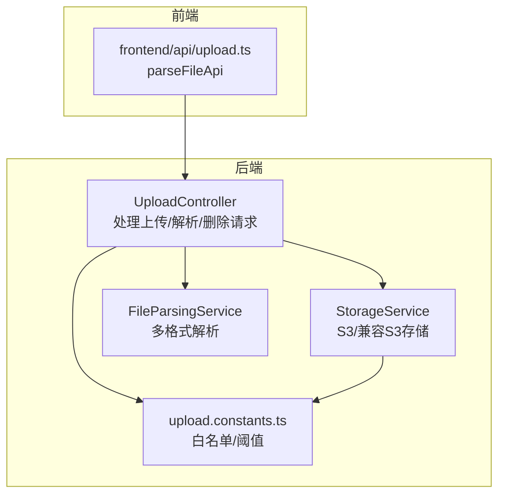
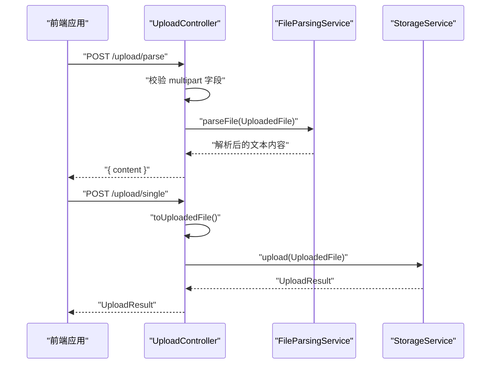
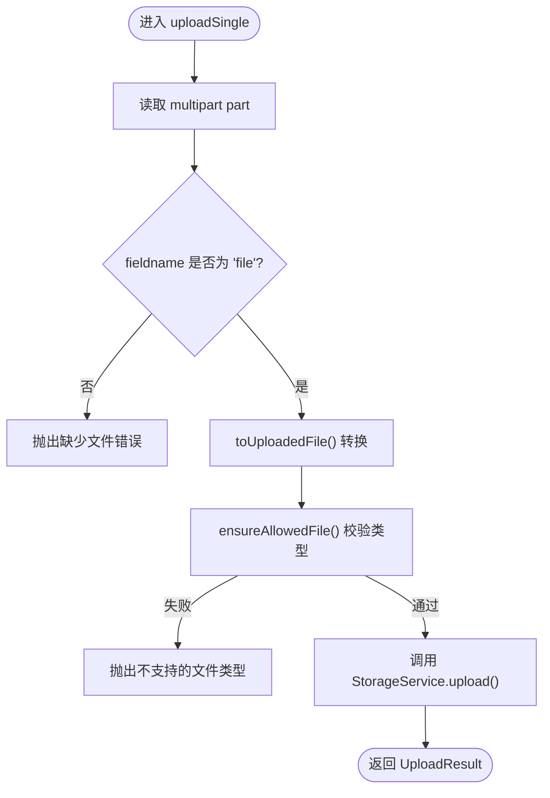
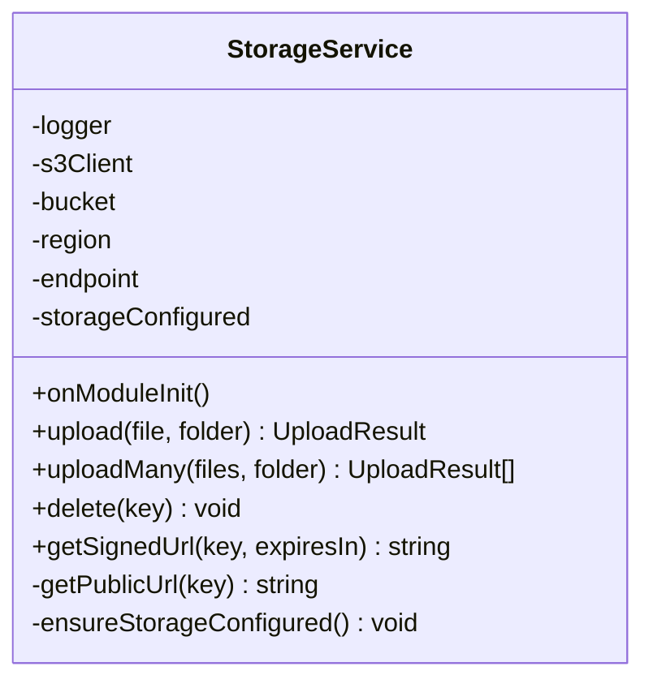
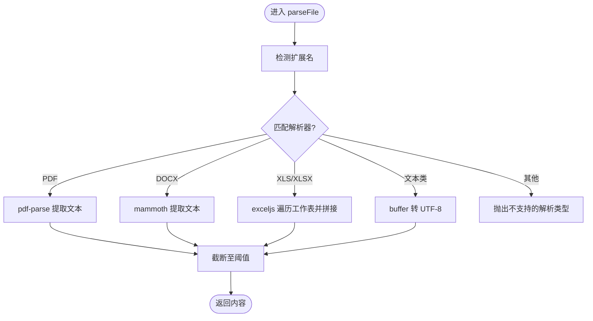
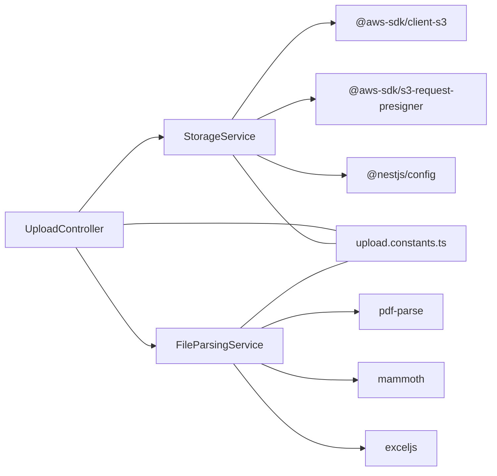

# 文件上传模块

<cite>
**本文引用的文件**
- [apps/backend/src/upload/upload.controller.ts](file://apps/backend/src/upload/upload.controller.ts)
- [apps/backend/src/upload/storage.service.ts](file://apps/backend/src/upload/storage.service.ts)
- [apps/backend/src/upload/file-parsing.service.ts](file://apps/backend/src/upload/file-parsing.service.ts)
- [apps/backend/src/upload/upload.module.ts](file://apps/backend/src/upload/upload.module.ts)
- [apps/backend/src/upload/upload.constants.ts](file://apps/backend/src/upload/upload.constants.ts)
- [apps/backend/src/i18n/en-US/upload.ts](file://apps/backend/src/i18n/en-US/upload.ts)
- [apps/backend/src/i18n/zh-CN/upload.ts](file://apps/backend/src/i18n/zh-CN/upload.ts)
- [apps/frontend/src/api/upload.ts](file://apps/frontend/src/api/upload.ts)
- [apps/backend/tests/upload/upload.controller.spec.ts](file://apps/backend/tests/upload/upload.controller.spec.ts)
- [apps/backend/tests/upload/storage.service.spec.ts](file://apps/backend/tests/upload/storage.service.spec.ts)
- [apps/backend/package.json](file://apps/backend/package.json)
</cite>

## 目录
1. [简介](#简介)
2. [项目结构](#项目结构)
3. [核心组件](#核心组件)
4. [架构总览](#架构总览)
5. [详细组件分析](#详细组件分析)
6. [依赖关系分析](#依赖关系分析)
7. [性能与缓存策略](#性能与缓存策略)
8. [故障排查指南](#故障排查指南)
9. [结论](#结论)
10. [附录：API 规范与错误码](#附录api-规范与错误码)

## 简介
本文件上传模块提供完整的文件上传、解析、删除与访问控制能力，支持多格式文件解析与云端存储（AWS S3 及兼容 S3 的对象存储）。模块通过严格的类型与扩展名白名单进行安全校验，并在解析阶段对内容长度进行截断保护，避免超长文本影响系统稳定性。同时，模块具备优雅的错误处理与国际化提示，便于前端统一展示。

## 项目结构
- 后端模块位于 apps/backend/src/upload，包含控制器、存储服务、解析服务与常量定义。
- 前端通过独立 API 文件调用后端解析接口，实现“上传即解析”的无持久化体验。
- 国际化文案集中于 apps/backend/src/i18n，覆盖上传模块的错误与提示信息。

图表来源
- [apps/backend/src/upload/upload.controller.ts:1-156](file://apps/backend/src/upload/upload.controller.ts#L1-L156)
- [apps/backend/src/upload/storage.service.ts:1-151](file://apps/backend/src/upload/storage.service.ts#L1-L151)
- [apps/backend/src/upload/file-parsing.service.ts:1-142](file://apps/backend/src/upload/file-parsing.service.ts#L1-L142)
- [apps/backend/src/upload/upload.constants.ts:1-61](file://apps/backend/src/upload/upload.constants.ts#L1-L61)
- [apps/frontend/src/api/upload.ts:1-23](file://apps/frontend/src/api/upload.ts#L1-L23)

章节来源
- [apps/backend/src/upload/upload.module.ts:1-16](file://apps/backend/src/upload/upload.module.ts#L1-L16)
- [apps/backend/src/upload/upload.controller.ts:1-156](file://apps/backend/src/upload/upload.controller.ts#L1-L156)
- [apps/backend/src/upload/storage.service.ts:1-151](file://apps/backend/src/upload/storage.service.ts#L1-L151)
- [apps/backend/src/upload/file-parsing.service.ts:1-142](file://apps/backend/src/upload/file-parsing.service.ts#L1-L142)
- [apps/backend/src/upload/upload.constants.ts:1-61](file://apps/backend/src/upload/upload.constants.ts#L1-L61)
- [apps/frontend/src/api/upload.ts:1-23](file://apps/frontend/src/api/upload.ts#L1-L23)

## 核心组件
- UploadController：负责接收 multipart 请求，执行类型校验与转换，调用存储或解析服务，并返回标准化结果。
- StorageService：封装 S3 客户端，提供上传、批量上传、删除、签名 URL 与公开 URL 生成等能力；支持自定义 endpoint（适配 OSS/MinIO）。
- FileParsingService：根据文件扩展名选择解析器，提取纯文本内容并对结果进行长度截断，保障系统稳定。
- upload.constants.ts：维护允许的 MIME 类型、扩展名列表与解析内容最大长度阈值。
- 前端 parseFileApi：以 FormData 形式提交文件，实现“上传即解析”体验。

章节来源
- [apps/backend/src/upload/upload.controller.ts:1-156](file://apps/backend/src/upload/upload.controller.ts#L1-L156)
- [apps/backend/src/upload/storage.service.ts:1-151](file://apps/backend/src/upload/storage.service.ts#L1-L151)
- [apps/backend/src/upload/file-parsing.service.ts:1-142](file://apps/backend/src/upload/file-parsing.service.ts#L1-L142)
- [apps/backend/src/upload/upload.constants.ts:1-61](file://apps/backend/src/upload/upload.constants.ts#L1-L61)
- [apps/frontend/src/api/upload.ts:1-23](file://apps/frontend/src/api/upload.ts#L1-L23)

## 架构总览
文件上传处理链路如下：
- 前端通过 parseFileApi 提交文件；
- 控制器接收 multipart 数据，校验字段与类型；
- 若为解析接口，则直接调用解析服务提取文本；
- 若为上传接口，则将文件转为通用格式并调用存储服务写入对象存储；
- 存储服务根据配置生成公开 URL 或签名 URL，返回标准化结果。

图表来源
- [apps/backend/src/upload/upload.controller.ts:68-112](file://apps/backend/src/upload/upload.controller.ts#L68-L112)
- [apps/backend/src/upload/file-parsing.service.ts:16-72](file://apps/backend/src/upload/file-parsing.service.ts#L16-L72)
- [apps/backend/src/upload/storage.service.ts:72-95](file://apps/backend/src/upload/storage.service.ts#L72-L95)
- [apps/frontend/src/api/upload.ts:11-22](file://apps/frontend/src/api/upload.ts#L11-L22)

## 详细组件分析

### UploadController 组件
职责与流程
- 单文件上传：接收 multipart 中名为 file 的字段，转换为 UploadedFile 并调用存储服务。
- 多文件上传：遍历 files 字段，批量转换并上传。
- 文件解析：接收 multipart 中的 file 字段，转换后调用解析服务提取文本。
- 删除文件：基于 key 删除对象存储中的文件。
- 安全校验：使用白名单 MIME 类型与扩展名进行双重校验，拒绝未知类型。

图表来源
- [apps/backend/src/upload/upload.controller.ts:79-87](file://apps/backend/src/upload/upload.controller.ts#L79-L87)
- [apps/backend/src/upload/upload.controller.ts:33-63](file://apps/backend/src/upload/upload.controller.ts#L33-L63)

章节来源
- [apps/backend/src/upload/upload.controller.ts:1-156](file://apps/backend/src/upload/upload.controller.ts#L1-L156)

### StorageService 组件
能力与配置
- 初始化：从配置服务读取 S3_BUCKET、S3_REGION、S3_ENDPOINT、S3_ACCESS_KEY_ID、S3_SECRET_ACCESS_KEY；若凭证缺失则标记为未配置。
- 上传：生成带扩展名的随机 key，写入对象存储，返回 UploadResult（包含 key、url、bucket、size、mimetype）。
- 批量上传：并发执行多个上传任务。
- 删除：按 key 删除对象。
- URL 生成：支持公开 URL 与签名 URL（带过期时间），签名 URL 适合私有文件临时访问。
- 兼容性：当存在 endpoint 时启用 forcePathStyle，适配 OSS/MinIO。

图表来源
- [apps/backend/src/upload/storage.service.ts:33-151](file://apps/backend/src/upload/storage.service.ts#L33-L151)

章节来源
- [apps/backend/src/upload/storage.service.ts:1-151](file://apps/backend/src/upload/storage.service.ts#L1-L151)

### FileParsingService 组件
解析策略
- PDF：使用 pdf-parse 提取文本。
- DOCX：使用 mammoth 提取纯文本。
- XLS/XLSX：使用 exceljs 加载工作簿，遍历所有工作表，将单元格序列化为 CSV 行拼接文本。
- 文本类：对白名单扩展名（如 txt、md、json、csv 等）直接按 UTF-8 解码。
- 截断保护：超过阈值字符数的内容会被截断并在末尾标注省略号，避免超长文本导致性能问题。

图表来源
- [apps/backend/src/upload/file-parsing.service.ts:16-72](file://apps/backend/src/upload/file-parsing.service.ts#L16-L72)
- [apps/backend/src/upload/file-parsing.service.ts:74-140](file://apps/backend/src/upload/file-parsing.service.ts#L74-L140)
- [apps/backend/src/upload/upload.constants.ts:40-61](file://apps/backend/src/upload/upload.constants.ts#L40-L61)

章节来源
- [apps/backend/src/upload/file-parsing.service.ts:1-142](file://apps/backend/src/upload/file-parsing.service.ts#L1-L142)
- [apps/backend/src/upload/upload.constants.ts:1-61](file://apps/backend/src/upload/upload.constants.ts#L1-L61)

### 前端解析接口
- 使用 FormData 上传文件，自动设置 Content-Type 为 multipart/form-data。
- 返回结构包含 content 字段，供前端展示解析结果。

章节来源
- [apps/frontend/src/api/upload.ts:1-23](file://apps/frontend/src/api/upload.ts#L1-L23)

## 依赖关系分析
- 控制器依赖存储服务与解析服务，二者均通过依赖注入提供。
- 存储服务依赖 @aws-sdk/client-s3 与 @aws-sdk/s3-request-presigner，以及 @nestjs/config 进行配置读取。
- 解析服务依赖 pdf-parse、mammoth、exceljs 等第三方库。
- 常量文件提供白名单与阈值，被控制器与解析服务共同引用。

图表来源
- [apps/backend/src/upload/upload.controller.ts:1-28](file://apps/backend/src/upload/upload.controller.ts#L1-L28)
- [apps/backend/src/upload/storage.service.ts:1-41](file://apps/backend/src/upload/storage.service.ts#L1-L41)
- [apps/backend/src/upload/file-parsing.service.ts:1-7](file://apps/backend/src/upload/file-parsing.service.ts#L1-L7)
- [apps/backend/src/upload/upload.constants.ts:1-61](file://apps/backend/src/upload/upload.constants.ts#L1-L61)
- [apps/backend/package.json:30-86](file://apps/backend/package.json#L30-L86)

章节来源
- [apps/backend/src/upload/upload.module.ts:1-16](file://apps/backend/src/upload/upload.module.ts#L1-L16)
- [apps/backend/package.json:30-86](file://apps/backend/package.json#L30-L86)

## 性能与缓存策略
- 并发上传：批量上传采用 Promise.all 并发执行，提升吞吐量。
- 内容截断：解析后对文本进行长度截断，避免超长内容占用内存与网络传输。
- URL 生成：签名 URL 仅在需要时生成，减少不必要的计算开销。
- 缓存建议：当前模块未内置缓存层。可在网关或 CDN 层面对公开资源进行缓存，结合 ETag/Last-Modified 实现条件请求，降低回源压力。

[本节为通用性能建议，无需特定文件来源]

## 故障排查指南
常见问题与定位方法
- 未配置对象存储凭证：调用上传/删除/签名 URL 接口会抛出“存储未配置”异常。检查环境变量 S3_ACCESS_KEY_ID 与 S3_SECRET_ACCESS_KEY 是否正确设置。
- 不支持的文件类型：当 MIME 类型不在白名单且扩展名不在允许列表中时，会抛出“不支持的文件类型”。请确认文件扩展名与 MIME 类型是否符合白名单。
- 解析失败：解析器内部异常会被捕获并转换为“文件解析失败”。请检查文件格式是否受支持，或是否存在损坏。
- 缺少文件字段：当 multipart 字段名非预期时，会抛出“缺少文件”错误。请确保前端使用正确的字段名（单文件为 file，多文件为 files）。

章节来源
- [apps/backend/src/upload/storage.service.ts:143-149](file://apps/backend/src/upload/storage.service.ts#L143-L149)
- [apps/backend/src/upload/upload.controller.ts:51-63](file://apps/backend/src/upload/upload.controller.ts#L51-L63)
- [apps/backend/src/upload/file-parsing.service.ts:48-72](file://apps/backend/src/upload/file-parsing.service.ts#L48-L72)
- [apps/backend/tests/upload/upload.controller.spec.ts:46-70](file://apps/backend/tests/upload/upload.controller.spec.ts#L46-L70)
- [apps/backend/tests/upload/storage.service.spec.ts:32-46](file://apps/backend/tests/upload/storage.service.spec.ts#L32-L46)

## 结论
该文件上传模块以清晰的职责分离实现了“上传—解析—存储—访问”的完整闭环。通过白名单与截断策略强化了安全性与稳定性，同时提供了灵活的对象存储适配能力。建议在生产环境中配合 CDN 与缓存策略进一步优化性能，并完善病毒扫描与访问审计等安全措施。

[本节为总结性内容，无需特定文件来源]

## 附录：API 规范与错误码

- 认证方式
  - Bearer Token：所有上传相关接口均需携带 JWT 令牌。

- 单文件上传
  - 方法与路径：POST /upload/single
  - 请求体：multipart/form-data，字段名为 file，二进制文件
  - 成功响应：UploadResult（包含 key、url、bucket、size、mimetype）
  - 错误码：
    - upload.FILE_REQUIRED：缺少文件字段
    - upload.UNSUPPORTED_FILE_TYPE：文件类型不在白名单
    - upload.STORAGE_NOT_CONFIGURED：对象存储凭证未配置

- 多文件上传
  - 方法与路径：POST /upload/multiple
  - 请求体：multipart/form-data，字段名为 files，数组形式的二进制文件
  - 成功响应：UploadResult 数组
  - 错误码：同上

- 文件解析（不保存）
  - 方法与路径：POST /upload/parse
  - 请求体：multipart/form-data，字段名为 file，二进制文件
  - 成功响应：{ content: string }
  - 错误码：
    - upload.FILE_REQUIRED：缺少文件字段
    - upload.UNSUPPORTED_PARSE_FILE_TYPE：不支持解析的文件类型
    - upload.FILE_PARSING_FAILED：解析过程失败

- 删除文件
  - 方法与路径：DELETE /upload/:key
  - 成功响应：{ success: boolean }
  - 错误码：upload.STORAGE_NOT_CONFIGURED（未配置存储）

- 国际化提示
  - 英文与中文文案分别位于 i18n 目录下，键空间为 upload.*。

章节来源
- [apps/backend/src/upload/upload.controller.ts:68-154](file://apps/backend/src/upload/upload.controller.ts#L68-L154)
- [apps/backend/src/i18n/en-US/upload.ts:1-10](file://apps/backend/src/i18n/en-US/upload.ts#L1-L10)
- [apps/backend/src/i18n/zh-CN/upload.ts:1-10](file://apps/backend/src/i18n/zh-CN/upload.ts#L1-L10)
- [apps/frontend/src/api/upload.ts:1-23](file://apps/frontend/src/api/upload.ts#L1-L23)