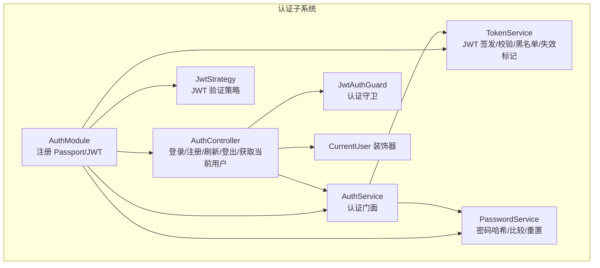
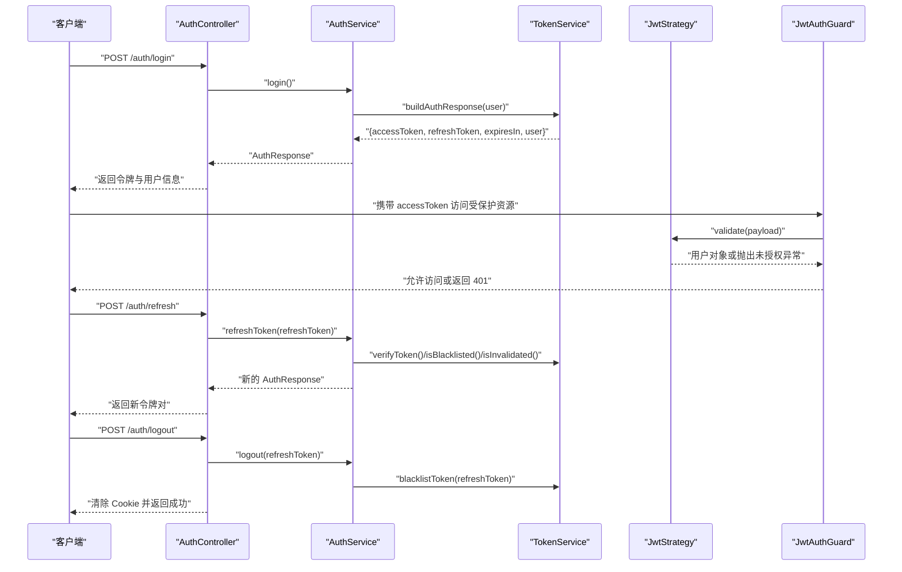
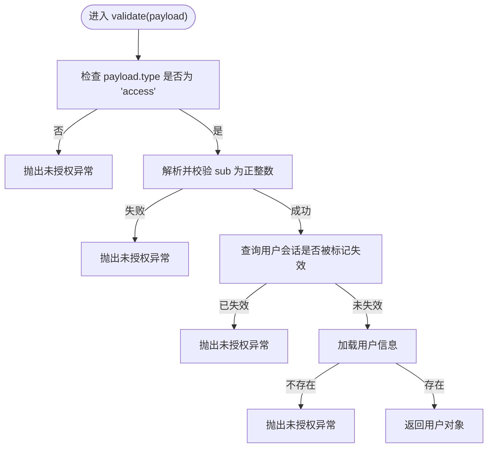
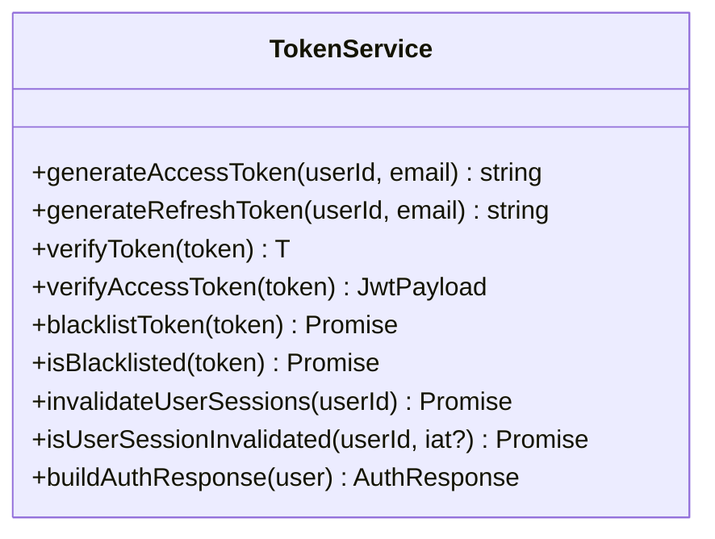
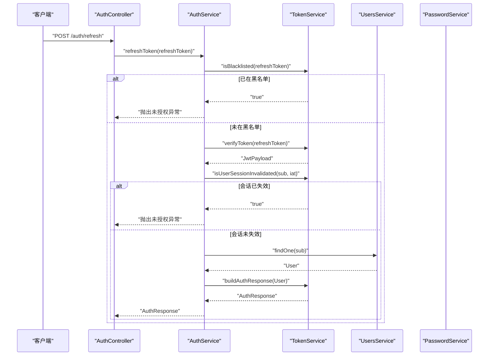
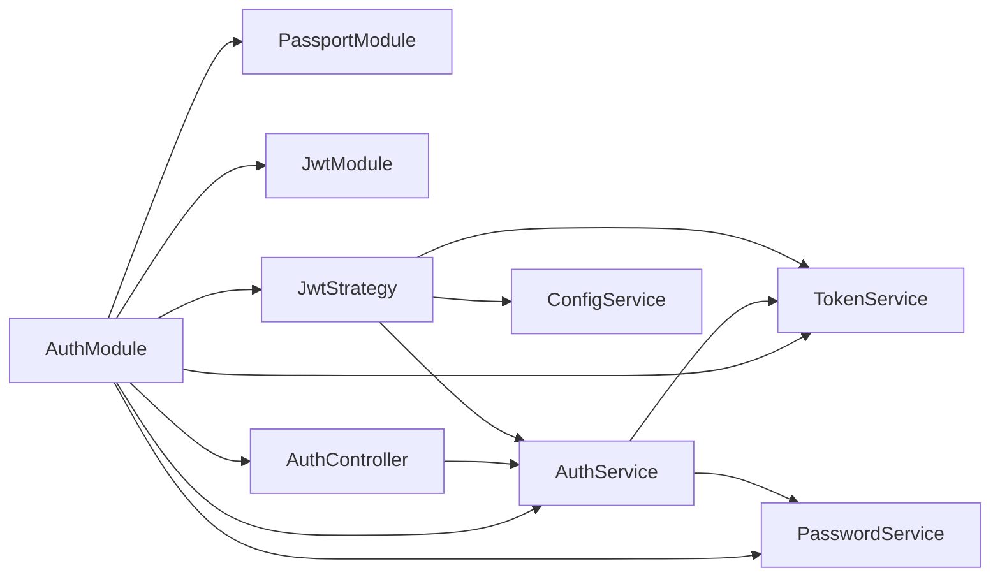

# JWT 认证机制

<cite>
**本文引用的文件**
- [apps/backend/src/auth/jwt.strategy.ts](file://apps/backend/src/auth/jwt.strategy.ts)
- [apps/backend/src/auth/jwt-auth.guard.ts](file://apps/backend/src/auth/jwt-auth.guard.ts)
- [apps/backend/src/auth/token.service.ts](file://apps/backend/src/auth/token.service.ts)
- [apps/backend/src/auth/auth.service.ts](file://apps/backend/src/auth/auth.service.ts)
- [apps/backend/src/auth/auth.controller.ts](file://apps/backend/src/auth/auth.controller.ts)
- [apps/backend/src/auth/auth.module.ts](file://apps/backend/src/auth/auth.module.ts)
- [apps/backend/src/auth/password.service.ts](file://apps/backend/src/auth/password.service.ts)
- [apps/backend/src/auth/current-user.decorator.ts](file://apps/backend/src/auth/current-user.decorator.ts)
- [apps/backend/src/app.module.ts](file://apps/backend/src/app.module.ts)
- [apps/backend/tests/auth/jwt.strategy.spec.ts](file://apps/backend/tests/auth/jwt.strategy.spec.ts)
- [apps/backend/tests/auth/token.service.spec.ts](file://apps/backend/tests/auth/token.service.spec.ts)
- [apps/backend/tests/auth/auth.service.spec.ts](file://apps/backend/tests/auth/auth.service.spec.ts)
</cite>

## 目录
1. [简介](#简介)
2. [项目结构](#项目结构)
3. [核心组件](#核心组件)
4. [架构总览](#架构总览)
5. [组件详解](#组件详解)
6. [依赖关系分析](#依赖关系分析)
7. [性能考量](#性能考量)
8. [故障排除指南](#故障排除指南)
9. [结论](#结论)
10. [附录](#附录)

## 简介
本文件系统性阐述本项目的 JWT 认证机制，覆盖令牌生成、验证与刷新流程；JwtStrategy 的实现原理与自定义策略配置；JwtAuthGuard 的权限控制与路由保护策略；令牌服务的签名、过期处理与黑名单管理；JWT 配置项与安全参数；令牌生命周期管理与异常处理；并提供可落地的最佳实践建议。

## 项目结构
认证相关代码集中在后端应用的 auth 子目录，采用按功能模块划分的方式组织，核心文件如下：
- 认证模块：负责注册 Passport/JWT、导出认证能力
- 控制器：对外暴露登录、注册、刷新、登出、获取当前用户等接口
- 服务层：整合用户、令牌与密码服务，提供统一认证入口
- 策略与守卫：Passport 策略与全局认证守卫
- 令牌服务：JWT 签发、校验、黑名单、会话失效标记
- 装饰器：从请求上下文提取当前用户

图表来源
- [apps/backend/src/auth/auth.module.ts:19-41](file://apps/backend/src/auth/auth.module.ts#L19-L41)
- [apps/backend/src/auth/auth.controller.ts:14-82](file://apps/backend/src/auth/auth.controller.ts#L14-L82)
- [apps/backend/src/auth/auth.service.ts:12-127](file://apps/backend/src/auth/auth.service.ts#L12-L127)
- [apps/backend/src/auth/token.service.ts:15-187](file://apps/backend/src/auth/token.service.ts#L15-L187)
- [apps/backend/src/auth/password.service.ts:9-100](file://apps/backend/src/auth/password.service.ts#L9-L100)
- [apps/backend/src/auth/jwt.strategy.ts:19-68](file://apps/backend/src/auth/jwt.strategy.ts#L19-L68)
- [apps/backend/src/auth/jwt-auth.guard.ts:8-10](file://apps/backend/src/auth/jwt-auth.guard.ts#L8-L10)
- [apps/backend/src/auth/current-user.decorator.ts:8-19](file://apps/backend/src/auth/current-user.decorator.ts#L8-L19)

章节来源
- [apps/backend/src/auth/auth.module.ts:19-41](file://apps/backend/src/auth/auth.module.ts#L19-L41)
- [apps/backend/src/auth/auth.controller.ts:14-82](file://apps/backend/src/auth/auth.controller.ts#L14-L82)
- [apps/backend/src/auth/auth.service.ts:12-127](file://apps/backend/src/auth/auth.service.ts#L12-L127)
- [apps/backend/src/auth/token.service.ts:15-187](file://apps/backend/src/auth/token.service.ts#L15-L187)
- [apps/backend/src/auth/password.service.ts:9-100](file://apps/backend/src/auth/password.service.ts#L9-L100)
- [apps/backend/src/auth/jwt.strategy.ts:19-68](file://apps/backend/src/auth/jwt.strategy.ts#L19-L68)
- [apps/backend/src/auth/jwt-auth.guard.ts:8-10](file://apps/backend/src/auth/jwt-auth.guard.ts#L8-L10)
- [apps/backend/src/auth/current-user.decorator.ts:8-19](file://apps/backend/src/auth/current-user.decorator.ts#L8-L19)

## 核心组件
- JwtStrategy：基于 passport-jwt 的策略，负责从请求头解析 Bearer 令牌，校验签名与过期时间，并结合会话失效标记与用户存在性进行最终验证。
- JwtAuthGuard：基于 AuthGuard('jwt') 的守卫，用于保护路由，统一拦截未通过 JwtStrategy 的请求。
- TokenService：封装 JWT 签发（短期访问令牌与长期刷新令牌）、令牌验证、黑名单管理、会话失效标记与认证响应构建。
- AuthService：认证门面，协调用户服务、令牌服务与密码服务，提供登录、注册、刷新、登出、密码重置等统一接口。
- AuthController：对外暴露认证相关 API，配合守卫与装饰器完成业务交互。
- PasswordService：密码哈希、比较与重置令牌生成与验证。
- CurrentUser 装饰器：从请求上下文提取当前用户对象或其字段。

章节来源
- [apps/backend/src/auth/jwt.strategy.ts:19-68](file://apps/backend/src/auth/jwt.strategy.ts#L19-L68)
- [apps/backend/src/auth/jwt-auth.guard.ts:8-10](file://apps/backend/src/auth/jwt-auth.guard.ts#L8-L10)
- [apps/backend/src/auth/token.service.ts:15-187](file://apps/backend/src/auth/token.service.ts#L15-L187)
- [apps/backend/src/auth/auth.service.ts:12-127](file://apps/backend/src/auth/auth.service.ts#L12-L127)
- [apps/backend/src/auth/auth.controller.ts:14-82](file://apps/backend/src/auth/auth.controller.ts#L14-L82)
- [apps/backend/src/auth/password.service.ts:9-100](file://apps/backend/src/auth/password.service.ts#L9-L100)
- [apps/backend/src/auth/current-user.decorator.ts:8-19](file://apps/backend/src/auth/current-user.decorator.ts#L8-L19)

## 架构总览
下图展示了认证流程的关键交互：客户端发起登录/注册，服务端签发访问与刷新令牌；后续请求携带访问令牌经 JwtStrategy 验证；刷新令牌用于换取新的令牌对；登出时将刷新令牌加入黑名单并清理 Cookie。

图表来源
- [apps/backend/src/auth/auth.controller.ts:14-82](file://apps/backend/src/auth/auth.controller.ts#L14-L82)
- [apps/backend/src/auth/auth.service.ts:41-101](file://apps/backend/src/auth/auth.service.ts#L41-L101)
- [apps/backend/src/auth/token.service.ts:78-185](file://apps/backend/src/auth/token.service.ts#L78-L185)
- [apps/backend/src/auth/jwt.strategy.ts:41-66](file://apps/backend/src/auth/jwt.strategy.ts#L41-L66)
- [apps/backend/src/auth/jwt-auth.guard.ts:8-10](file://apps/backend/src/auth/jwt-auth.guard.ts#L8-L10)

## 组件详解

### JwtStrategy 实现原理与自定义策略配置
- 令牌来源：从 Authorization 头部解析 Bearer 令牌。
- 校验要求：启用签名与过期时间校验；仅接受 type=access 的载荷。
- 用户校验：确保 sub 为正整数；查询用户是否存在；结合会话失效标记判断令牌是否仍有效。
- 异常处理：不满足条件时抛出未授权异常，交由全局过滤器统一处理。

图表来源
- [apps/backend/src/auth/jwt.strategy.ts:41-66](file://apps/backend/src/auth/jwt.strategy.ts#L41-L66)

章节来源
- [apps/backend/src/auth/jwt.strategy.ts:19-68](file://apps/backend/src/auth/jwt.strategy.ts#L19-L68)
- [apps/backend/src/auth/jwt.strategy.ts:41-66](file://apps/backend/src/auth/jwt.strategy.ts#L41-L66)

### JwtAuthGuard 权限控制与路由保护
- 基于 AuthGuard('jwt') 的守卫，统一拦截未通过 JwtStrategy 的请求。
- 在需要认证的路由上使用该守卫，即可实现基于 JWT 的访问控制。

章节来源
- [apps/backend/src/auth/jwt-auth.guard.ts:8-10](file://apps/backend/src/auth/jwt-auth.guard.ts#L8-L10)
- [apps/backend/src/auth/auth.controller.ts:53-80](file://apps/backend/src/auth/auth.controller.ts#L53-L80)

### 令牌服务：签名、过期处理与黑名单管理
- 签名密钥与过期时间：
  - 访问令牌：使用通用 JWT_SECRET，过期时间来自配置项。
  - 刷新令牌：生产环境需独立 JWT_REFRESH_SECRET，过期时间来自配置项。
- 令牌生成：
  - generateAccessToken：签发短期访问令牌。
  - generateRefreshToken：签发长期刷新令牌。
- 令牌验证：
  - verifyToken：优先尝试刷新密钥，再尝试访问密钥，均失败则视为过期。
  - verifyAccessToken：仅接受访问令牌且类型正确。
- 黑名单管理：
  - blacklistToken：对有效且未过期的令牌进行黑名单登记，TTL 为剩余有效期。
  - isBlacklisted：检查令牌是否在黑名单中。
- 会话失效标记：
  - invalidateUserSessions：记录用户会话失效时间戳。
  - isUserSessionInvalidated：若令牌签发时间早于失效标记，则判定为无效。
- 认证响应构建：
  - buildAuthResponse：同时返回访问与刷新令牌及过期时间。

图表来源
- [apps/backend/src/auth/token.service.ts:15-187](file://apps/backend/src/auth/token.service.ts#L15-L187)

章节来源
- [apps/backend/src/auth/token.service.ts:15-187](file://apps/backend/src/auth/token.service.ts#L15-L187)

### 认证服务：统一门面与业务编排
- 登录/注册：调用用户服务与令牌服务，返回完整认证响应。
- 刷新令牌：校验刷新令牌有效性、黑名单、会话失效标记，成功后重新签发令牌对。
- 登出：将刷新令牌加入黑名单，确保无法继续刷新。
- 密码重置：生成带有效期的重置令牌并通过邮件发送，重置后使用户会话整体失效。

图表来源
- [apps/backend/src/auth/auth.controller.ts:43-48](file://apps/backend/src/auth/auth.controller.ts#L43-L48)
- [apps/backend/src/auth/auth.service.ts:59-93](file://apps/backend/src/auth/auth.service.ts#L59-L93)
- [apps/backend/src/auth/token.service.ts:103-125](file://apps/backend/src/auth/token.service.ts#L103-L125)

章节来源
- [apps/backend/src/auth/auth.service.ts:12-127](file://apps/backend/src/auth/auth.service.ts#L12-L127)
- [apps/backend/src/auth/auth.controller.ts:14-82](file://apps/backend/src/auth/auth.controller.ts#L14-L82)

### 密码服务与令牌生命周期联动
- 密码哈希与比较：使用 bcrypt 进行安全存储与比对。
- 重置令牌：生成随机令牌并进行哈希存储，带过期时间；重置成功后调用令牌服务使用户会话整体失效，确保旧令牌不再可用。

章节来源
- [apps/backend/src/auth/password.service.ts:9-100](file://apps/backend/src/auth/password.service.ts#L9-L100)
- [apps/backend/src/auth/password.service.ts:66-89](file://apps/backend/src/auth/password.service.ts#L66-L89)

### 当前用户装饰器与控制器集成
- CurrentUser 装饰器：从请求上下文提取当前用户对象或指定字段，简化控制器中的用户读取逻辑。
- 控制器：在“获取当前用户”与“登出”等接口中使用守卫与装饰器，实现安全访问与 Cookie 清理。

章节来源
- [apps/backend/src/auth/current-user.decorator.ts:8-19](file://apps/backend/src/auth/current-user.decorator.ts#L8-L19)
- [apps/backend/src/auth/auth.controller.ts:53-80](file://apps/backend/src/auth/auth.controller.ts#L53-L80)

## 依赖关系分析
- AuthModule 注册 Passport 默认策略为 jwt，并通过 JwtModule 注入全局 JWT 配置（secret 与 signOptions）。
- AuthController 依赖 AuthService；AuthService 依赖 TokenService 与 PasswordService；JwtStrategy 依赖 ConfigService、AuthService 与 TokenService。
- AppModule 作为根模块引入 ConfigModule、LoggerModule、ThrottlerModule 等，为认证模块提供全局配置与安全基础能力。

图表来源
- [apps/backend/src/auth/auth.module.ts:19-41](file://apps/backend/src/auth/auth.module.ts#L19-L41)
- [apps/backend/src/app.module.ts:27-175](file://apps/backend/src/app.module.ts#L27-L175)

章节来源
- [apps/backend/src/auth/auth.module.ts:19-41](file://apps/backend/src/auth/auth.module.ts#L19-L41)
- [apps/backend/src/app.module.ts:27-175](file://apps/backend/src/app.module.ts#L27-L175)

## 性能考量
- 令牌签发与验证：使用内存级的 JwtService，避免频繁 IO；Redis 仅用于黑名单与会话失效标记，建议合理设置 TTL。
- 速率限制：全局 ThrottlerGuard 与控制器级 Throttle 装饰器共同限制暴力破解风险。
- 日志与监控：Pino 日志模块按状态码输出不同级别日志，便于定位认证相关问题。
- 建议：
  - 对高频接口开启缓存（如用户信息），减少数据库压力。
  - 使用只读副本或连接池优化数据库访问。
  - 合理设置令牌过期时间，平衡安全性与用户体验。

## 故障排除指南
- 401 未授权
  - 可能原因：令牌类型非访问令牌、签名密钥不匹配、令牌过期、会话被标记失效、用户不存在。
  - 排查步骤：确认 Authorization 头格式为 Bearer；检查 JWT_SECRET/JWT_REFRESH_SECRET 配置；核对 iat/exp 字段；确认用户状态正常。
- 刷新失败
  - 可能原因：刷新令牌在黑名单中、会话已被整体失效、令牌类型错误、用户不存在。
  - 排查步骤：检查黑名单状态；确认刷新令牌未被登出；核对令牌类型与用户状态。
- 登出无效
  - 可能原因：Redis 不可用导致黑名单写入失败；客户端未携带刷新令牌。
  - 排查步骤：确认 Redis 连接；确保前端传入 refreshToken；检查 Cookie 清理逻辑。
- 测试参考
  - 单元测试覆盖了 JwtStrategy、TokenService、AuthService 的关键分支，可据此定位问题。

章节来源
- [apps/backend/tests/auth/jwt.strategy.spec.ts:30-73](file://apps/backend/tests/auth/jwt.strategy.spec.ts#L30-L73)
- [apps/backend/tests/auth/token.service.spec.ts:72-179](file://apps/backend/tests/auth/token.service.spec.ts#L72-L179)
- [apps/backend/tests/auth/auth.service.spec.ts:124-174](file://apps/backend/tests/auth/auth.service.spec.ts#L124-L174)

## 结论
本项目采用成熟的 Passport + NestJS JWT 方案，结合 Redis 实现会话失效标记与黑名单管理，形成“短期访问令牌 + 长期刷新令牌”的双令牌模型。通过 JwtAuthGuard 统一保护路由，AuthService 作为门面协调各服务，既保证了安全性，也兼顾了可维护性与扩展性。建议在生产环境中严格配置密钥与过期时间，并持续完善监控与告警体系。

## 附录

### JWT 配置选项与安全参数
- 必填项
  - JWT_SECRET：访问令牌与默认密钥
  - NODE_ENV=production 时必须配置 JWT_REFRESH_SECRET：刷新令牌专用密钥
- 可选项（建议）
  - JWT_ACCESS_EXPIRES_IN：访问令牌过期间隔（秒）
  - JWT_REFRESH_EXPIRES_IN：刷新令牌过期间隔（秒）
  - RESET_PASSWORD_EXPIRES_IN：密码重置链接过期时间（秒）
  - THROTTLE_*：速率限制相关配置（短/中/长窗口）
- Redis
  - 用于黑名单与会话失效标记，需确保高可用与合理 TTL

章节来源
- [apps/backend/src/auth/token.service.ts:30-45](file://apps/backend/src/auth/token.service.ts#L30-L45)
- [apps/backend/src/auth/password.service.ts:48-50](file://apps/backend/src/auth/password.service.ts#L48-L50)
- [apps/backend/src/app.module.ts:117-138](file://apps/backend/src/app.module.ts#L117-L138)

### 令牌生命周期管理
- 登录：签发短期访问令牌与长期刷新令牌，返回给客户端。
- 使用：客户端携带访问令牌访问受保护资源，由 JwtStrategy 验证。
- 刷新：客户端提交刷新令牌，服务端校验后签发新的令牌对。
- 登出：将刷新令牌加入黑名单，清理 Cookie，阻止继续刷新。
- 会话失效：密码重置或管理员操作会使用户会话整体失效，旧令牌不再有效。

章节来源
- [apps/backend/src/auth/token.service.ts:78-185](file://apps/backend/src/auth/token.service.ts#L78-L185)
- [apps/backend/src/auth/auth.service.ts:59-101](file://apps/backend/src/auth/auth.service.ts#L59-L101)
- [apps/backend/src/auth/password.service.ts:88-89](file://apps/backend/src/auth/password.service.ts#L88-L89)