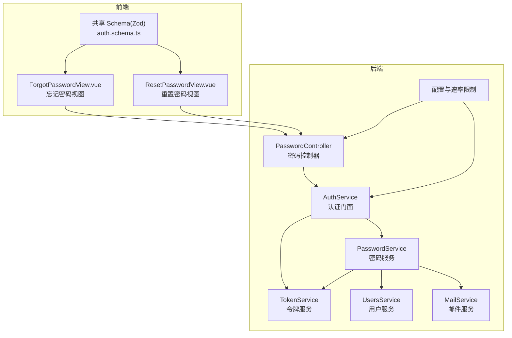
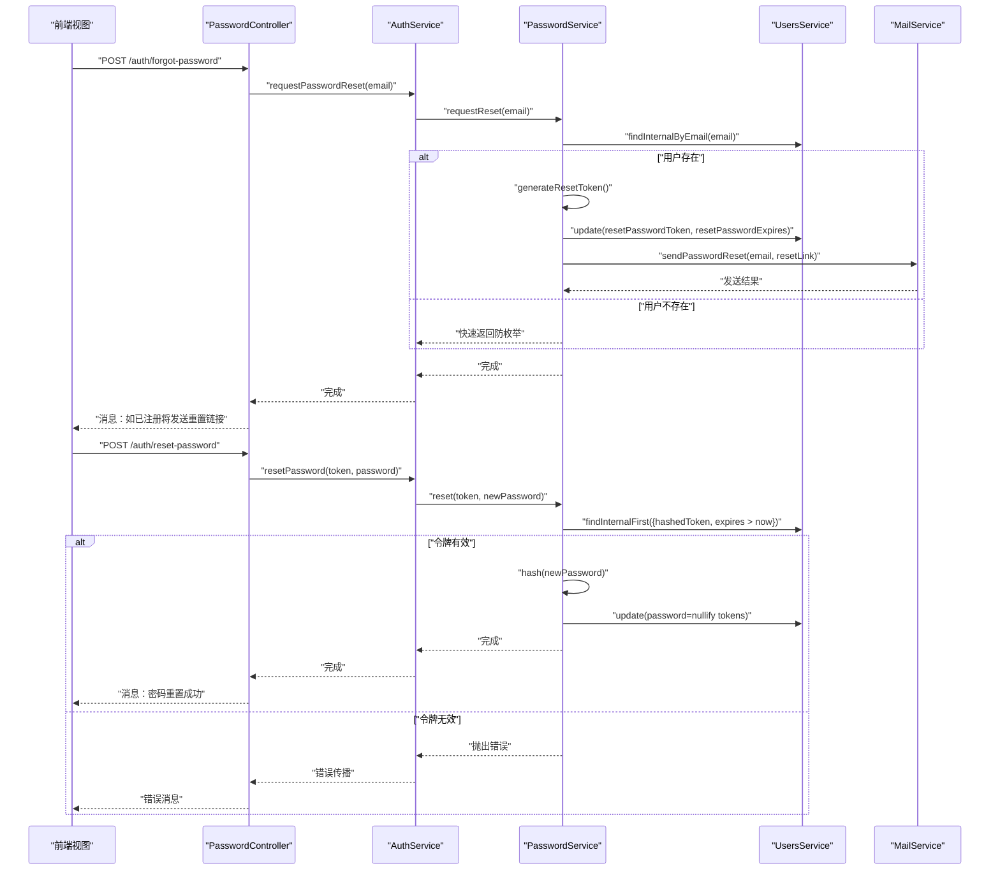
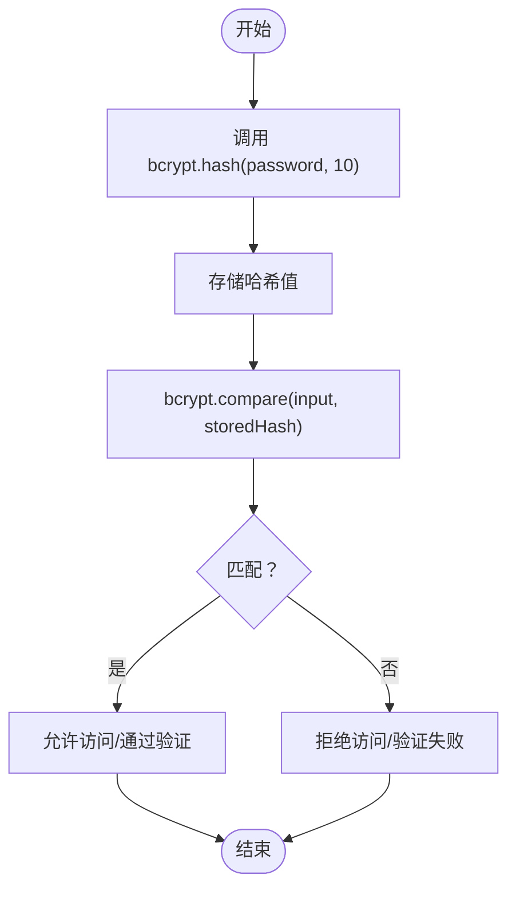
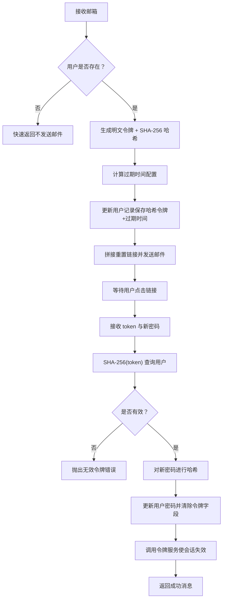
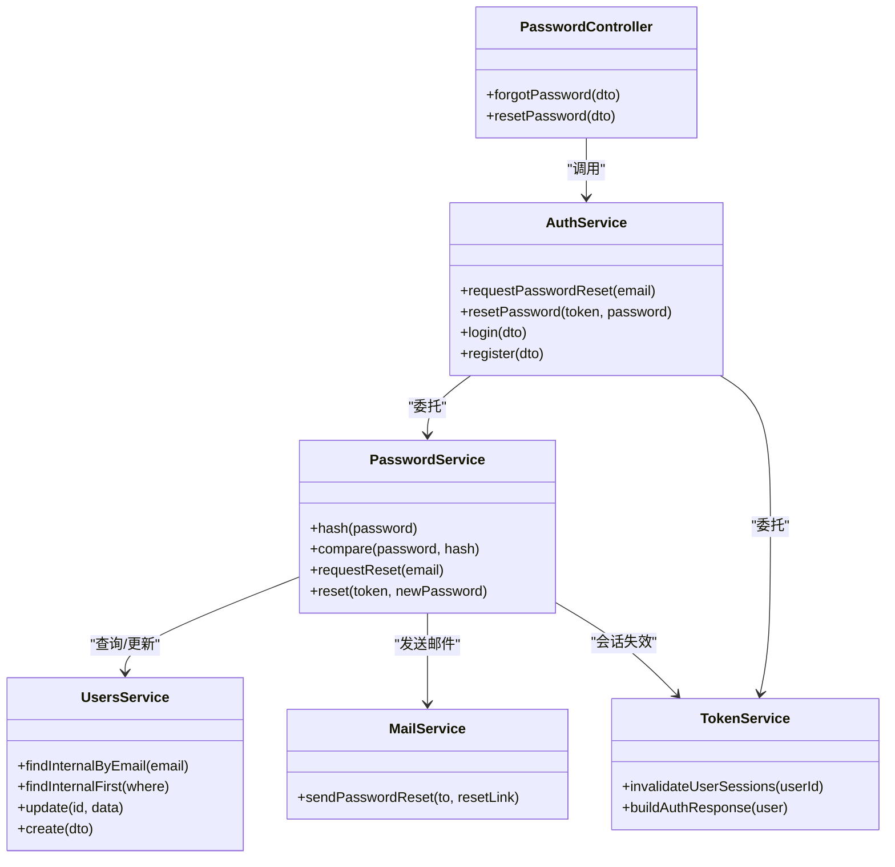

# 密码管理

<cite>
**本文引用的文件**
- [apps/backend/src/auth/password.controller.ts](file://apps/backend/src/auth/password.controller.ts)
- [apps/backend/src/auth/password.service.ts](file://apps/backend/src/auth/password.service.ts)
- [apps/backend/src/auth/auth.service.ts](file://apps/backend/src/auth/auth.service.ts)
- [apps/backend/src/auth/token.service.ts](file://apps/backend/src/auth/token.service.ts)
- [apps/backend/src/auth/auth.dto.ts](file://apps/backend/src/auth/auth.dto.ts)
- [apps/backend/src/users/users.service.ts](file://apps/backend/src/users/users.service.ts)
- [apps/backend/src/mail/mail.service.ts](file://apps/backend/src/mail/mail.service.ts)
- [packages/shared/src/schemas/auth.schema.ts](file://packages/shared/src/schemas/auth.schema.ts)
- [apps/frontend/src/features/auth/views/ForgotPasswordView.vue](file://apps/frontend/src/features/auth/views/ForgotPasswordView.vue)
- [apps/frontend/src/features/auth/views/ResetPasswordView.vue](file://apps/frontend/src/features/auth/views/ResetPasswordView.vue)
- [apps/backend/src/app.module.ts](file://apps/backend/src/app.module.ts)
- [apps/backend/src/common/filters/all-exceptions.filter.ts](file://apps/backend/src/common/filters/all-exceptions.filter.ts)
- [apps/backend/src/main.ts](file://apps/backend/src/main.ts)
</cite>

## 目录
1. [简介](#简介)
2. [项目结构](#项目结构)
3. [核心组件](#核心组件)
4. [架构总览](#架构总览)
5. [详细组件分析](#详细组件分析)
6. [依赖关系分析](#依赖关系分析)
7. [性能考量](#性能考量)
8. [故障排除指南](#故障排除指南)
9. [结论](#结论)
10. [附录](#附录)

## 简介
本文件面向密码管理系统的技术实现，围绕以下目标展开：  
- 密码加密算法的选择与实现原理  
- 密码强度验证规则与安全策略  
- 密码重置流程的完整实现（验证码生成、邮件发送、链接有效期管理）  
- 密码修改的安全机制与旧密码验证  
- 密码策略配置项与自定义规则  
- 常见密码相关攻击的防护措施与解决方案  
- 控制器接口规范与错误处理机制  

系统采用前后端分离架构，后端基于 NestJS，前端基于 Vue 3 + Vite，通过共享的 Zod Schema 实现跨端一致的输入校验；认证采用短期访问令牌与长期刷新令牌的双令牌模型，并结合 Redis 进行会话失效与黑名单管理。

## 项目结构
后端密码相关模块主要分布在认证与用户服务层，前端提供“忘记密码”和“重置密码”的视图组件，共享 Schema 负责输入约束。

图表来源
- [apps/backend/src/auth/password.controller.ts:1-39](file://apps/backend/src/auth/password.controller.ts#L1-L39)
- [apps/backend/src/auth/auth.service.ts:1-127](file://apps/backend/src/auth/auth.service.ts#L1-L127)
- [apps/backend/src/auth/password.service.ts:1-100](file://apps/backend/src/auth/password.service.ts#L1-L100)
- [apps/backend/src/auth/token.service.ts:1-187](file://apps/backend/src/auth/token.service.ts#L1-L187)
- [apps/backend/src/users/users.service.ts:1-110](file://apps/backend/src/users/users.service.ts#L1-L110)
- [apps/backend/src/mail/mail.service.ts:1-117](file://apps/backend/src/mail/mail.service.ts#L1-L117)
- [apps/backend/src/app.module.ts:116-138](file://apps/backend/src/app.module.ts#L116-L138)
- [apps/frontend/src/features/auth/views/ForgotPasswordView.vue:1-104](file://apps/frontend/src/features/auth/views/ForgotPasswordView.vue#L1-L104)
- [apps/frontend/src/features/auth/views/ResetPasswordView.vue:1-152](file://apps/frontend/src/features/auth/views/ResetPasswordView.vue#L1-L152)
- [packages/shared/src/schemas/auth.schema.ts:1-121](file://packages/shared/src/schemas/auth.schema.ts#L1-L121)

章节来源
- [apps/backend/src/auth/password.controller.ts:1-39](file://apps/backend/src/auth/password.controller.ts#L1-L39)
- [apps/backend/src/auth/auth.service.ts:1-127](file://apps/backend/src/auth/auth.service.ts#L1-L127)
- [apps/backend/src/auth/password.service.ts:1-100](file://apps/backend/src/auth/password.service.ts#L1-L100)
- [apps/backend/src/auth/token.service.ts:1-187](file://apps/backend/src/auth/token.service.ts#L1-L187)
- [apps/backend/src/users/users.service.ts:1-110](file://apps/backend/src/users/users.service.ts#L1-L110)
- [apps/backend/src/mail/mail.service.ts:1-117](file://apps/backend/src/mail/mail.service.ts#L1-L117)
- [apps/backend/src/app.module.ts:116-138](file://apps/backend/src/app.module.ts#L116-L138)
- [apps/frontend/src/features/auth/views/ForgotPasswordView.vue:1-104](file://apps/frontend/src/features/auth/views/ForgotPasswordView.vue#L1-L104)
- [apps/frontend/src/features/auth/views/ResetPasswordView.vue:1-152](file://apps/frontend/src/features/auth/views/ResetPasswordView.vue#L1-L152)
- [packages/shared/src/schemas/auth.schema.ts:1-121](file://packages/shared/src/schemas/auth.schema.ts#L1-L121)

## 核心组件
- 密码控制器：暴露“忘记密码”和“重置密码”两个接口，内置速率限制，返回统一消息。
- 密码服务：负责哈希、比较、重置令牌生成、有效期管理、邮件发送与会话失效。
- 认证服务：作为门面整合密码与令牌服务，提供登录、注册、刷新、登出等能力。
- 令牌服务：管理 JWT 的签发、校验、黑名单与会话失效标记，配合 Redis。
- 用户服务：提供用户查询、更新、创建等基础能力，内部查询包含密码字段。
- 邮件服务：封装邮件发送，支持国际化主题与内容。
- 前端视图：提供忘记密码与重置密码的表单与交互，使用共享 Schema 校验。

章节来源
- [apps/backend/src/auth/password.controller.ts:1-39](file://apps/backend/src/auth/password.controller.ts#L1-L39)
- [apps/backend/src/auth/password.service.ts:1-100](file://apps/backend/src/auth/password.service.ts#L1-L100)
- [apps/backend/src/auth/auth.service.ts:1-127](file://apps/backend/src/auth/auth.service.ts#L1-L127)
- [apps/backend/src/auth/token.service.ts:1-187](file://apps/backend/src/auth/token.service.ts#L1-L187)
- [apps/backend/src/users/users.service.ts:1-110](file://apps/backend/src/users/users.service.ts#L1-L110)
- [apps/backend/src/mail/mail.service.ts:1-117](file://apps/backend/src/mail/mail.service.ts#L1-L117)
- [apps/frontend/src/features/auth/views/ForgotPasswordView.vue:1-104](file://apps/frontend/src/features/auth/views/ForgotPasswordView.vue#L1-L104)
- [apps/frontend/src/features/auth/views/ResetPasswordView.vue:1-152](file://apps/frontend/src/features/auth/views/ResetPasswordView.vue#L1-L152)
- [packages/shared/src/schemas/auth.schema.ts:1-121](file://packages/shared/src/schemas/auth.schema.ts#L1-L121)

## 架构总览
下图展示了密码重置的端到端流程：从前端发起请求，到后端生成令牌、持久化有效期、发送邮件，再到前端引导用户重置密码并完成更新。

图表来源
- [apps/backend/src/auth/password.controller.ts:1-39](file://apps/backend/src/auth/password.controller.ts#L1-L39)
- [apps/backend/src/auth/auth.service.ts:106-112](file://apps/backend/src/auth/auth.service.ts#L106-L112)
- [apps/backend/src/auth/password.service.ts:39-89](file://apps/backend/src/auth/password.service.ts#L39-L89)
- [apps/backend/src/users/users.service.ts:55-83](file://apps/backend/src/users/users.service.ts#L55-L83)
- [apps/backend/src/mail/mail.service.ts:88-115](file://apps/backend/src/mail/mail.service.ts#L88-L115)

## 详细组件分析

### 密码加密与比较
- 加密算法：使用 bcryptjs，成本因子固定为 10，保证安全性与性能平衡。
- 比较方式：使用 bcrypt.compare 对明文与存储的哈希进行比较，避免时间侧信道。
- 存储策略：用户注册与密码重置均使用相同哈希流程，确保一致性。

图表来源
- [apps/backend/src/auth/password.service.ts:25-34](file://apps/backend/src/auth/password.service.ts#L25-L34)
- [apps/backend/src/users/users.service.ts:97-104](file://apps/backend/src/users/users.service.ts#L97-L104)

章节来源
- [apps/backend/src/auth/password.service.ts:25-34](file://apps/backend/src/auth/password.service.ts#L25-L34)
- [apps/backend/src/users/users.service.ts:97-104](file://apps/backend/src/users/users.service.ts#L97-L104)

### 密码强度验证规则与安全策略
- 输入约束：通过共享 Zod Schema 统一约束，最小长度、最大长度、必填等。
- 前端提示：前端视图提供密码强度标签与“两次输入一致”校验。
- 安全策略：
  - 速率限制：控制器对“忘记密码/重置密码”分别设置不同阈值，防止暴力尝试。
  - 防枚举：不存在用户时不发送邮件，避免泄露邮箱注册状态。
  - 令牌有效期：默认 1 小时，可由配置调整。
  - 会话失效：重置密码后调用令牌服务使该用户历史会话失效。

章节来源
- [packages/shared/src/schemas/auth.schema.ts:17-21](file://packages/shared/src/schemas/auth.schema.ts#L17-L21)
- [apps/frontend/src/features/auth/views/ResetPasswordView.vue:24-32](file://apps/frontend/src/features/auth/views/ResetPasswordView.vue#L24-L32)
- [apps/backend/src/auth/password.controller.ts:19-37](file://apps/backend/src/auth/password.controller.ts#L19-L37)
- [apps/backend/src/auth/password.service.ts:42-45](file://apps/backend/src/auth/password.service.ts#L42-L45)
- [apps/backend/src/auth/password.service.ts:48-50](file://apps/backend/src/auth/password.service.ts#L48-L50)
- [apps/backend/src/auth/token.service.ts:47-53](file://apps/backend/src/auth/token.service.ts#L47-L53)

### 密码重置流程实现
- 令牌生成：随机生成 32 字节十六进制字符串作为明文令牌，同时以 SHA-256 哈希持久化。
- 有效期管理：读取配置中的过期秒数，默认 1 小时，写入数据库。
- 邮件发送：根据前端地址拼接带 token 的重置链接，发送 HTML 邮件。
- 重置校验：按哈希查找用户，且令牌未过期；否则抛出无效令牌错误。
- 完成重置：对新密码进行哈希，清空令牌与过期时间字段；调用令牌服务使该用户会话失效。

图表来源
- [apps/backend/src/auth/password.service.ts:39-89](file://apps/backend/src/auth/password.service.ts#L39-L89)
- [apps/backend/src/mail/mail.service.ts:88-115](file://apps/backend/src/mail/mail.service.ts#L88-L115)
- [apps/backend/src/auth/token.service.ts:47-53](file://apps/backend/src/auth/token.service.ts#L47-L53)

章节来源
- [apps/backend/src/auth/password.service.ts:39-89](file://apps/backend/src/auth/password.service.ts#L39-L89)
- [apps/backend/src/mail/mail.service.ts:88-115](file://apps/backend/src/mail/mail.service.ts#L88-L115)
- [apps/backend/src/auth/token.service.ts:47-53](file://apps/backend/src/auth/token.service.ts#L47-L53)

### 密码修改的安全机制与旧密码验证
- 当前设计：后端未提供“旧密码校验”的修改接口。密码修改仅通过“忘记密码”流程完成。
- 安全影响：避免了“旧密码验证”带来的复杂性与潜在风险；重置流程更可控。
- 替代方案：若需支持“旧密码校验”，可在认证服务中新增修改密码方法，先调用密码比较，再执行哈希与更新。

章节来源
- [apps/backend/src/auth/auth.service.ts:106-112](file://apps/backend/src/auth/auth.service.ts#L106-L112)
- [apps/backend/src/auth/password.service.ts:66-89](file://apps/backend/src/auth/password.service.ts#L66-L89)

### 密码策略配置选项与自定义规则
- 可配置项（示例）：
  - 重置令牌有效期：RESET_PASSWORD_EXPIRES_IN（秒）
  - 前端地址：FRONTEND_URL（用于拼接重置链接）
  - JWT 密钥与过期时间：JWT_SECRET、JWT_REFRESH_SECRET、JWT_ACCESS_EXPIRES_IN、JWT_REFRESH_EXPIRES_IN
  - 速率限制：THROTTLE_SHORT_TTL/LIMIT、THROTTLE_MEDIUM_TTL/LIMIT、THROTTLE_LONG_TTL/LIMIT
- 自定义规则：可通过扩展共享 Schema 或前端校验进一步细化密码强度要求（如必须包含大小写字母、特殊字符等）。

章节来源
- [apps/backend/src/auth/password.service.ts:48-58](file://apps/backend/src/auth/password.service.ts#L48-L58)
- [apps/backend/src/auth/token.service.ts:30-44](file://apps/backend/src/auth/token.service.ts#L30-L44)
- [apps/backend/src/app.module.ts:117-138](file://apps/backend/src/app.module.ts#L117-L138)

### 常见密码相关攻击的防护措施
- 防枚举攻击：不存在用户时不发送邮件，避免泄露注册状态。
- 防暴力破解：控制器级速率限制，结合全局 Throttler 模块。
- CSRF 防护：后端拦截缺失 X-Requested-With 的非 GET 请求。
- 令牌安全：明文令牌仅用于生成哈希存储，传输与日志避免泄露。
- 会话安全：重置密码后使用户历史会话失效，降低会话劫持风险。

章节来源
- [apps/backend/src/auth/password.service.ts:42-45](file://apps/backend/src/auth/password.service.ts#L42-L45)
- [apps/backend/src/auth/password.controller.ts:19-37](file://apps/backend/src/auth/password.controller.ts#L19-L37)
- [apps/backend/src/main.ts:123-157](file://apps/backend/src/main.ts#L123-L157)
- [apps/backend/src/auth/token.service.ts:47-53](file://apps/backend/src/auth/token.service.ts#L47-L53)

### 控制器接口规范与错误处理机制
- 接口规范：
  - POST /auth/forgot-password：请求密码重置，返回统一消息。
  - POST /auth/reset-password：使用 token 重置密码，返回统一消息。
- 错误处理：
  - 业务异常：ConflictException、BadRequestException 等会被统一过滤器转换为标准响应。
  - Zod 校验错误：提取字段级错误映射，message 指向通用键。
  - 未知错误：统一返回内部错误并记录日志。

章节来源
- [apps/backend/src/auth/password.controller.ts:1-39](file://apps/backend/src/auth/password.controller.ts#L1-L39)
- [apps/backend/src/common/filters/all-exceptions.filter.ts:47-100](file://apps/backend/src/common/filters/all-exceptions.filter.ts#L47-L100)
- [apps/backend/src/auth/auth.dto.ts:1-41](file://apps/backend/src/auth/auth.dto.ts#L1-L41)

## 依赖关系分析

图表来源
- [apps/backend/src/auth/password.controller.ts:1-39](file://apps/backend/src/auth/password.controller.ts#L1-L39)
- [apps/backend/src/auth/auth.service.ts:1-127](file://apps/backend/src/auth/auth.service.ts#L1-L127)
- [apps/backend/src/auth/password.service.ts:1-100](file://apps/backend/src/auth/password.service.ts#L1-L100)
- [apps/backend/src/auth/token.service.ts:1-187](file://apps/backend/src/auth/token.service.ts#L1-L187)
- [apps/backend/src/users/users.service.ts:1-110](file://apps/backend/src/users/users.service.ts#L1-L110)
- [apps/backend/src/mail/mail.service.ts:1-117](file://apps/backend/src/mail/mail.service.ts#L1-L117)

章节来源
- [apps/backend/src/auth/password.controller.ts:1-39](file://apps/backend/src/auth/password.controller.ts#L1-L39)
- [apps/backend/src/auth/auth.service.ts:1-127](file://apps/backend/src/auth/auth.service.ts#L1-L127)
- [apps/backend/src/auth/password.service.ts:1-100](file://apps/backend/src/auth/password.service.ts#L1-L100)
- [apps/backend/src/auth/token.service.ts:1-187](file://apps/backend/src/auth/token.service.ts#L1-L187)
- [apps/backend/src/users/users.service.ts:1-110](file://apps/backend/src/users/users.service.ts#L1-L110)
- [apps/backend/src/mail/mail.service.ts:1-117](file://apps/backend/src/mail/mail.service.ts#L1-L117)

## 性能考量
- bcrypt 成本因子：固定为 10，在安全性与性能间取得平衡；如需更高安全等级可提升成本因子，但需评估 CPU 与延迟。
- 速率限制：多粒度 TTL 与 limit 配置，避免突发流量导致资源压力。
- Redis 黑名单与会话失效：使用 TTL 精准控制，减少内存占用。
- 前端校验：在客户端先行校验，减少无效请求到后端。

## 故障排除指南
- 重置邮件未送达
  - 检查邮件服务配置与 SMTP 连接。
  - 确认 FRONTEND_URL 正确，重置链接拼接无误。
- 无效重置令牌
  - 核对 token 是否被正确传递与拼接。
  - 检查 RESET_PASSWORD_EXPIRES_IN 配置是否过短。
- 重置后仍提示旧令牌
  - 确认令牌服务已调用使会话失效。
- 登录/注册频繁被限流
  - 调整全局 Throttler 配置或前端重试策略。
- CSRF 拦截
  - 确保请求头包含 X-Requested-With。

章节来源
- [apps/backend/src/mail/mail.service.ts:88-115](file://apps/backend/src/mail/mail.service.ts#L88-L115)
- [apps/backend/src/auth/password.service.ts:48-58](file://apps/backend/src/auth/password.service.ts#L48-L58)
- [apps/backend/src/auth/token.service.ts:47-53](file://apps/backend/src/auth/token.service.ts#L47-L53)
- [apps/backend/src/app.module.ts:117-138](file://apps/backend/src/app.module.ts#L117-L138)
- [apps/backend/src/main.ts:123-157](file://apps/backend/src/main.ts#L123-L157)

## 结论
本密码管理方案以 bcrypt 为核心加密手段，结合双令牌模型、Redis 会话失效与严格的速率限制，提供了安全可靠的密码重置与认证体验。通过共享 Schema 与统一异常过滤器，实现了前后端一致的输入约束与错误反馈。建议在满足合规的前提下，持续优化令牌有效期与成本因子，并根据业务场景扩展密码强度规则与审计日志。

## 附录
- 前端视图要点
  - 忘记密码：使用共享 Schema 校验邮箱，提交后显示成功提示。
  - 重置密码：二次确认密码，校验 token 是否存在，成功后跳转登录页。
- 配置建议
  - 重置有效期：建议 1 小时；根据业务需求可调整。
  - 速率限制：根据并发与风控策略动态调整。
  - JWT 密钥：生产环境务必配置独立刷新密钥。

章节来源
- [apps/frontend/src/features/auth/views/ForgotPasswordView.vue:1-104](file://apps/frontend/src/features/auth/views/ForgotPasswordView.vue#L1-L104)
- [apps/frontend/src/features/auth/views/ResetPasswordView.vue:1-152](file://apps/frontend/src/features/auth/views/ResetPasswordView.vue#L1-L152)
- [apps/backend/src/auth/password.service.ts:48-58](file://apps/backend/src/auth/password.service.ts#L48-L58)
- [apps/backend/src/app.module.ts:117-138](file://apps/backend/src/app.module.ts#L117-L138)