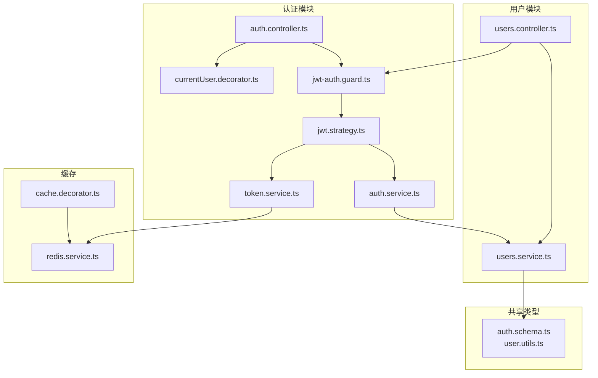
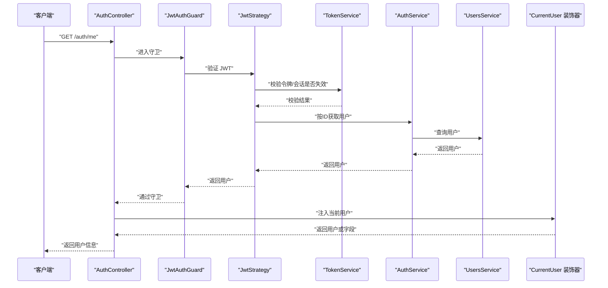
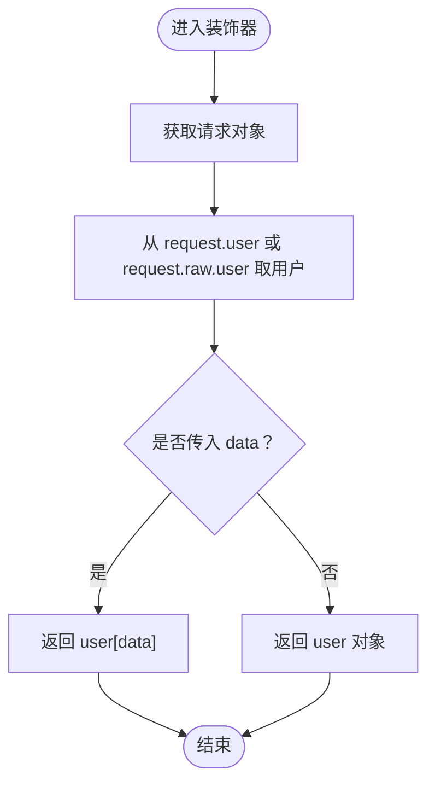
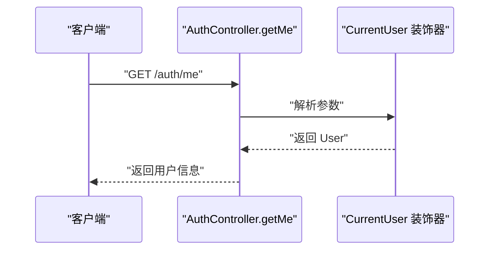
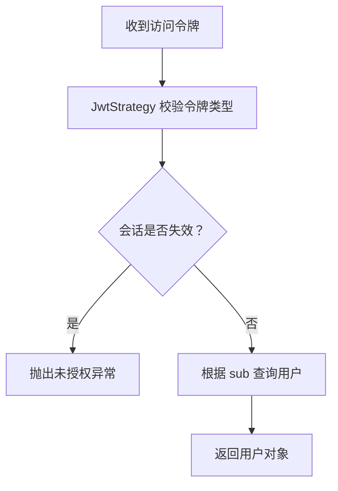
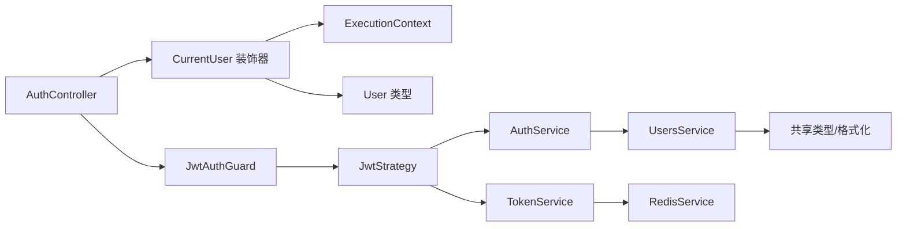

# 当前用户装饰器

<cite>
**本文引用的文件**
- [apps/backend/src/auth/current-user.decorator.ts](file://apps/backend/src/auth/current-user.decorator.ts)
- [apps/backend/src/auth/auth.controller.ts](file://apps/backend/src/auth/auth.controller.ts)
- [apps/backend/src/auth/jwt-auth.guard.ts](file://apps/backend/src/auth/jwt-auth.guard.ts)
- [apps/backend/src/auth/jwt.strategy.ts](file://apps/backend/src/auth/jwt.strategy.ts)
- [apps/backend/src/auth/token.service.ts](file://apps/backend/src/auth/token.service.ts)
- [apps/backend/src/auth/auth.service.ts](file://apps/backend/src/auth/auth.service.ts)
- [apps/backend/src/auth/auth.dto.ts](file://apps/backend/src/auth/auth.dto.ts)
- [packages/shared/src/schemas/auth.schema.ts](file://packages/shared/src/schemas/auth.schema.ts)
- [packages/shared/src/utils/user.utils.ts](file://packages/shared/src/utils/user.utils.ts)
- [apps/backend/src/redis/redis.service.ts](file://apps/backend/src/redis/redis.service.ts)
- [apps/backend/src/redis/cache.decorator.ts](file://apps/backend/src/redis/cache.decorator.ts)
- [apps/backend/src/users/users.controller.ts](file://apps/backend/src/users/users.controller.ts)
- [apps/backend/src/users/users.service.ts](file://apps/backend/src/users/users.service.ts)
</cite>

## 目录
1. [简介](#简介)
2. [项目结构](#项目结构)
3. [核心组件](#核心组件)
4. [架构总览](#架构总览)
5. [详细组件分析](#详细组件分析)
6. [依赖关系分析](#依赖关系分析)
7. [性能考量](#性能考量)
8. [故障排查指南](#故障排查指南)
9. [结论](#结论)
10. [附录](#附录)

## 简介
本技术文档围绕“当前用户装饰器”展开，系统性阐述其设计原理、实现细节、使用方法与最佳实践。装饰器通过 NestJS 参数装饰器机制，将已认证的用户对象注入到控制器方法参数中，支持按字段提取与类型安全返回。文档同时说明用户数据的提取流程、与 JWT 认证体系的集成方式、会话失效与缓存机制，并给出多场景使用示例与性能优化建议。

## 项目结构
与“当前用户装饰器”直接相关的代码分布在后端应用的认证与用户模块中，以及共享包中的用户类型定义。下图展示了装饰器与其上下游组件的关系：

图表来源
- [apps/backend/src/auth/current-user.decorator.ts:1-19](file://apps/backend/src/auth/current-user.decorator.ts#L1-L19)
- [apps/backend/src/auth/auth.controller.ts:1-82](file://apps/backend/src/auth/auth.controller.ts#L1-L82)
- [apps/backend/src/auth/jwt-auth.guard.ts:1-10](file://apps/backend/src/auth/jwt-auth.guard.ts#L1-L10)
- [apps/backend/src/auth/jwt.strategy.ts:1-68](file://apps/backend/src/auth/jwt.strategy.ts#L1-L68)
- [apps/backend/src/auth/token.service.ts:1-187](file://apps/backend/src/auth/token.service.ts#L1-L187)
- [apps/backend/src/auth/auth.service.ts:1-127](file://apps/backend/src/auth/auth.service.ts#L1-L127)
- [apps/backend/src/users/users.service.ts:1-110](file://apps/backend/src/users/users.service.ts#L1-L110)
- [apps/backend/src/users/users.controller.ts:1-50](file://apps/backend/src/users/users.controller.ts#L1-L50)
- [packages/shared/src/schemas/auth.schema.ts:1-121](file://packages/shared/src/schemas/auth.schema.ts#L1-L121)
- [packages/shared/src/utils/user.utils.ts:1-36](file://packages/shared/src/utils/user.utils.ts#L1-L36)
- [apps/backend/src/redis/redis.service.ts:1-233](file://apps/backend/src/redis/redis.service.ts#L1-L233)
- [apps/backend/src/redis/cache.decorator.ts:1-88](file://apps/backend/src/redis/cache.decorator.ts#L1-L88)

章节来源
- [apps/backend/src/auth/current-user.decorator.ts:1-19](file://apps/backend/src/auth/current-user.decorator.ts#L1-L19)
- [apps/backend/src/auth/auth.controller.ts:1-82](file://apps/backend/src/auth/auth.controller.ts#L1-L82)

## 核心组件
- 当前用户装饰器：基于 NestJS createParamDecorator，从请求上下文中提取用户对象或指定字段，支持类型安全返回。
- JWT 认证守卫：基于 Passport 的 JWT 守卫，拦截受保护路由。
- JWT 策略：解析并校验 JWT，确保仅访问令牌可用，且用户会话未被失效。
- 令牌服务：负责签发访问/刷新令牌、校验令牌、加入黑名单、检查会话是否失效。
- 认证服务：整合用户服务、令牌服务与密码服务，提供登录、注册、刷新、登出等统一入口。
- 用户服务：封装用户数据读取与写入，配合共享类型进行数据格式化。
- 共享类型：定义 User、AuthResponse 等类型，保证前后端一致的数据契约。
- 缓存服务与装饰器：提供 Redis 缓存能力与方法级缓存装饰器，支撑会话失效标记与缓存穿透防护。

章节来源
- [apps/backend/src/auth/current-user.decorator.ts:1-19](file://apps/backend/src/auth/current-user.decorator.ts#L1-L19)
- [apps/backend/src/auth/jwt-auth.guard.ts:1-10](file://apps/backend/src/auth/jwt-auth.guard.ts#L1-L10)
- [apps/backend/src/auth/jwt.strategy.ts:1-68](file://apps/backend/src/auth/jwt.strategy.ts#L1-L68)
- [apps/backend/src/auth/token.service.ts:1-187](file://apps/backend/src/auth/token.service.ts#L1-L187)
- [apps/backend/src/auth/auth.service.ts:1-127](file://apps/backend/src/auth/auth.service.ts#L1-L127)
- [apps/backend/src/users/users.service.ts:1-110](file://apps/backend/src/users/users.service.ts#L1-L110)
- [packages/shared/src/schemas/auth.schema.ts:1-121](file://packages/shared/src/schemas/auth.schema.ts#L1-L121)
- [apps/backend/src/redis/redis.service.ts:1-233](file://apps/backend/src/redis/redis.service.ts#L1-L233)
- [apps/backend/src/redis/cache.decorator.ts:1-88](file://apps/backend/src/redis/cache.decorator.ts#L1-L88)

## 架构总览
下图展示了“当前用户装饰器”的调用链路与关键参与者：

图表来源
- [apps/backend/src/auth/auth.controller.ts:53-60](file://apps/backend/src/auth/auth.controller.ts#L53-L60)
- [apps/backend/src/auth/jwt-auth.guard.ts:1-10](file://apps/backend/src/auth/jwt-auth.guard.ts#L1-L10)
- [apps/backend/src/auth/jwt.strategy.ts:41-66](file://apps/backend/src/auth/jwt.strategy.ts#L41-L66)
- [apps/backend/src/auth/token.service.ts:55-76](file://apps/backend/src/auth/token.service.ts#L55-L76)
- [apps/backend/src/auth/auth.service.ts:119-125](file://apps/backend/src/auth/auth.service.ts#L119-L125)
- [apps/backend/src/users/users.service.ts:27-39](file://apps/backend/src/users/users.service.ts#L27-L39)
- [apps/backend/src/auth/current-user.decorator.ts:8-18](file://apps/backend/src/auth/current-user.decorator.ts#L8-L18)

## 详细组件分析

### 当前用户装饰器实现原理
- 设计目标：从请求上下文提取已认证用户对象，支持按字段提取，提升控制器参数声明的简洁性与类型安全性。
- 数据源：优先从请求对象的 user 字段获取；若无则回退到 request.raw?.user，兼容不同框架适配层。
- 字段提取：当传入 data 参数（即 User 的某个键名）时，返回该字段值；否则返回完整用户对象。
- 类型安全：装饰器返回类型为 User 或 User[keyof User]，由调用方在控制器方法签名中声明具体类型。

图表来源
- [apps/backend/src/auth/current-user.decorator.ts:8-18](file://apps/backend/src/auth/current-user.decorator.ts#L8-L18)

章节来源
- [apps/backend/src/auth/current-user.decorator.ts:1-19](file://apps/backend/src/auth/current-user.decorator.ts#L1-L19)

### 在控制器中获取当前认证用户信息
- 路由示例：GET /auth/me 使用 JwtAuthGuard 保护，通过 CurrentUser 装饰器注入用户对象。
- 返回类型：控制器方法签名明确声明返回 User，装饰器保证类型安全。
- 场景扩展：可直接注入用户对象用于鉴权判断、日志记录、业务逻辑决策等。

图表来源
- [apps/backend/src/auth/auth.controller.ts:53-60](file://apps/backend/src/auth/auth.controller.ts#L53-L60)
- [apps/backend/src/auth/current-user.decorator.ts:8-18](file://apps/backend/src/auth/current-user.decorator.ts#L8-L18)

章节来源
- [apps/backend/src/auth/auth.controller.ts:53-60](file://apps/backend/src/auth/auth.controller.ts#L53-L60)

### 装饰器参数配置与类型安全
- 参数 data：可选，传入 User 的键名（如 'id'、'email'），装饰器返回对应字段值。
- 返回类型：当 data 存在时返回 User[keyof User]；否则返回 User。
- 控制器签名：应显式声明参数类型，确保编译期类型检查与 IDE 提示。

章节来源
- [apps/backend/src/auth/current-user.decorator.ts:8-18](file://apps/backend/src/auth/current-user.decorator.ts#L8-L18)
- [apps/backend/src/auth/auth.controller.ts:58-59](file://apps/backend/src/auth/auth.controller.ts#L58-L59)

### 用户数据的提取流程与缓存机制
- JWT 解析与校验：JwtStrategy 校验访问令牌类型与有效性，并检查会话是否失效。
- 会话失效检测：TokenService 通过 Redis 中的失效标记键（invalidate:{userId}）与令牌签发时间比较，判断令牌是否仍有效。
- 用户查询：AuthService 依据用户ID查询用户，返回格式化后的 User。
- 缓存要点：会话失效标记与黑名单均使用 Redis 缓存，具备 TTL 管理与命名空间前缀，降低数据库压力。

图表来源
- [apps/backend/src/auth/jwt.strategy.ts:41-66](file://apps/backend/src/auth/jwt.strategy.ts#L41-L66)
- [apps/backend/src/auth/token.service.ts:55-76](file://apps/backend/src/auth/token.service.ts#L55-L76)
- [apps/backend/src/auth/auth.service.ts:119-125](file://apps/backend/src/auth/auth.service.ts#L119-L125)

章节来源
- [apps/backend/src/auth/jwt.strategy.ts:1-68](file://apps/backend/src/auth/jwt.strategy.ts#L1-L68)
- [apps/backend/src/auth/token.service.ts:1-187](file://apps/backend/src/auth/token.service.ts#L1-L187)
- [apps/backend/src/auth/auth.service.ts:1-127](file://apps/backend/src/auth/auth.service.ts#L1-L127)

### 不同场景下的使用示例
- 获取当前用户信息：在受保护路由上使用 CurrentUser 装饰器直接获取 User。
- 获取当前用户字段：在需要特定字段（如用户ID）时，传入 data 参数以减少对象传输与解析开销。
- 其他控制器集成：UsersController 等受保护路由同样可复用 JwtAuthGuard 与 CurrentUser 装饰器，实现统一的用户上下文注入。

章节来源
- [apps/backend/src/auth/auth.controller.ts:53-60](file://apps/backend/src/auth/auth.controller.ts#L53-L60)
- [apps/backend/src/users/users.controller.ts:1-50](file://apps/backend/src/users/users.controller.ts#L1-L50)

### 与其他认证组件的集成方式与注意事项
- 与 JwtAuthGuard 集成：通过守卫确保只有携带有效访问令牌的请求才能进入控制器方法。
- 与 JwtStrategy 集成：守卫委托策略完成令牌解析与会话有效性校验。
- 与 TokenService 集成：策略依赖令牌服务进行会话失效检查与令牌验证。
- 注意事项：
  - 确保 JWT_SECRET 正确配置，生产环境建议区分访问与刷新密钥。
  - 会话失效通过 Redis 标记实现，需保证 Redis 可用性与一致性。
  - 控制器方法签名必须声明明确类型，避免装饰器返回类型推断导致的类型隐患。

章节来源
- [apps/backend/src/auth/jwt-auth.guard.ts:1-10](file://apps/backend/src/auth/jwt-auth_guard.ts#L1-L10)
- [apps/backend/src/auth/jwt.strategy.ts:1-68](file://apps/backend/src/auth/jwt.strategy.ts#L1-L68)
- [apps/backend/src/auth/token.service.ts:1-187](file://apps/backend/src/auth/token.service.ts#L1-L187)

## 依赖关系分析
- 装饰器依赖：ExecutionContext 上下文以获取请求对象；类型来自共享包 User。
- 控制器依赖：JwtAuthGuard 与 CurrentUser 装饰器共同完成认证与用户注入。
- 策略依赖：JwtStrategy 依赖 ConfigService、TokenService 与 AuthService。
- 令牌服务依赖：TokenService 依赖 JwtService、ConfigService 与 RedisService。
- 用户服务依赖：UsersService 依赖 PrismaService 并使用共享类型与格式化工具。

图表来源
- [apps/backend/src/auth/current-user.decorator.ts:1-19](file://apps/backend/src/auth/current-user.decorator.ts#L1-L19)
- [apps/backend/src/auth/auth.controller.ts:1-82](file://apps/backend/src/auth/auth.controller.ts#L1-L82)
- [apps/backend/src/auth/jwt-auth.guard.ts:1-10](file://apps/backend/src/auth/jwt-auth_guard.ts#L1-L10)
- [apps/backend/src/auth/jwt.strategy.ts:1-68](file://apps/backend/src/auth/jwt.strategy.ts#L1-L68)
- [apps/backend/src/auth/token.service.ts:1-187](file://apps/backend/src/auth/token.service.ts#L1-L187)
- [apps/backend/src/auth/auth.service.ts:1-127](file://apps/backend/src/auth/auth.service.ts#L1-L127)
- [apps/backend/src/users/users.service.ts:1-110](file://apps/backend/src/users/users.service.ts#L1-L110)
- [packages/shared/src/schemas/auth.schema.ts:1-121](file://packages/shared/src/schemas/auth.schema.ts#L1-L121)
- [packages/shared/src/utils/user.utils.ts:1-36](file://packages/shared/src/utils/user.utils.ts#L1-L36)
- [apps/backend/src/redis/redis.service.ts:1-233](file://apps/backend/src/redis/redis.service.ts#L1-L233)

章节来源
- [apps/backend/src/auth/current-user.decorator.ts:1-19](file://apps/backend/src/auth/current-user.decorator.ts#L1-L19)
- [apps/backend/src/auth/auth.controller.ts:1-82](file://apps/backend/src/auth/auth.controller.ts#L1-L82)
- [apps/backend/src/auth/jwt-auth.guard.ts:1-10](file://apps/backend/src/auth/jwt-auth_guard.ts#L1-L10)
- [apps/backend/src/auth/jwt.strategy.ts:1-68](file://apps/backend/src/auth/jwt.strategy.ts#L1-L68)
- [apps/backend/src/auth/token.service.ts:1-187](file://apps/backend/src/auth/token.service.ts#L1-L187)
- [apps/backend/src/auth/auth.service.ts:1-127](file://apps/backend/src/auth/auth.service.ts#L1-L127)
- [apps/backend/src/users/users.service.ts:1-110](file://apps/backend/src/users/users.service.ts#L1-L110)
- [packages/shared/src/schemas/auth.schema.ts:1-121](file://packages/shared/src/schemas/auth.schema.ts#L1-L121)
- [packages/shared/src/utils/user.utils.ts:1-36](file://packages/shared/src/utils/user.utils.ts#L1-L36)
- [apps/backend/src/redis/redis.service.ts:1-233](file://apps/backend/src/redis/redis.service.ts#L1-L233)

## 性能考量
- 令牌校验与会话失效检查：JwtStrategy 与 TokenService 的 Redis 读取为 O(1)，整体开销低。
- 缓存命中与穿透防护：RedisService 提供 getOrSet 等方法，可在高频读取场景下显著降低数据库压力。
- 方法级缓存装饰器：Cacheable 可对读取类接口进行缓存，结合 TTL 与键模板减少重复计算。
- 最佳实践：
  - 对频繁读取的用户信息启用缓存装饰器，合理设置 TTL。
  - 将会话失效标记与黑名单写入 Redis，避免数据库查询。
  - 控制器参数尽量只取所需字段，减少序列化与网络传输。

章节来源
- [apps/backend/src/redis/redis.service.ts:147-161](file://apps/backend/src/redis/redis.service.ts#L147-L161)
- [apps/backend/src/redis/cache.decorator.ts:42-58](file://apps/backend/src/redis/cache.decorator.ts#L42-L58)
- [apps/backend/src/auth/token.service.ts:130-170](file://apps/backend/src/auth/token.service.ts#L130-L170)

## 故障排查指南
- 未授权访问：
  - 检查请求头是否包含有效的 Bearer 令牌。
  - 确认令牌类型为访问令牌，且未被加入黑名单。
- 会话失效：
  - 若用户会话被强制失效，策略会拒绝访问；可通过刷新令牌重新获取。
- 用户不存在或数据异常：
  - 确认用户ID合法且存在；检查用户数据格式化流程。
- 缓存问题：
  - Redis 连接异常或键空间冲突可能导致缓存读取失败；检查前缀与 TTL 配置。

章节来源
- [apps/backend/src/auth/jwt.strategy.ts:41-66](file://apps/backend/src/auth/jwt.strategy.ts#L41-L66)
- [apps/backend/src/auth/token.service.ts:130-170](file://apps/backend/src/auth/token.service.ts#L130-L170)
- [apps/backend/src/auth/auth.service.ts:119-125](file://apps/backend/src/auth/auth.service.ts#L119-L125)
- [apps/backend/src/redis/redis.service.ts:86-95](file://apps/backend/src/redis/redis.service.ts#L86-L95)

## 结论
当前用户装饰器通过最小化的实现，将认证后的用户上下文无缝注入到控制器方法中，配合 JwtAuthGuard 与 JwtStrategy 形成完整的认证链路。借助 TokenService 的会话失效检测与 Redis 缓存，系统在保证安全性的同时兼顾性能。建议在高频读取场景启用缓存装饰器，并严格遵循类型声明与错误处理规范，以获得稳定可靠的用户体验。

## 附录
- 类型定义参考：User、AuthResponse 等类型由共享包提供，确保前后端一致。
- 用户格式化：formatUser 将数据库时间类型转换为 ISO 字符串，避免传输层差异。
- DTO 规范：AuthController 使用 DTO 对输入进行校验，Swagger 自动生成文档。

章节来源
- [packages/shared/src/schemas/auth.schema.ts:59-77](file://packages/shared/src/schemas/auth.schema.ts#L59-L77)
- [packages/shared/src/utils/user.utils.ts:19-28](file://packages/shared/src/utils/user.utils.ts#L19-L28)
- [apps/backend/src/auth/auth.dto.ts:1-41](file://apps/backend/src/auth/auth.dto.ts#L1-L41)