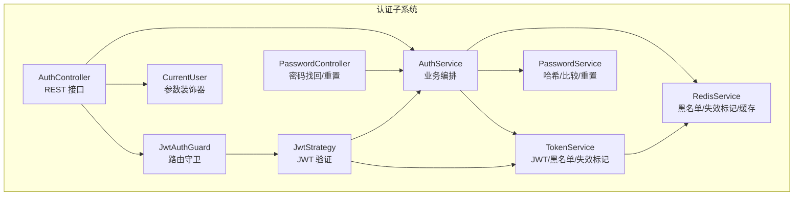
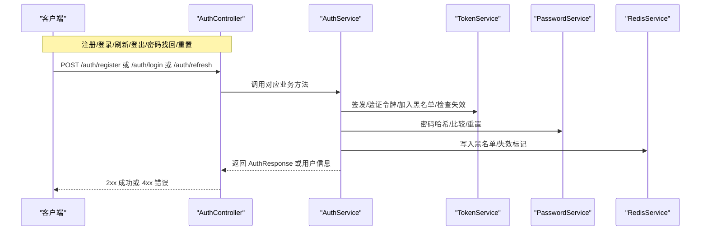
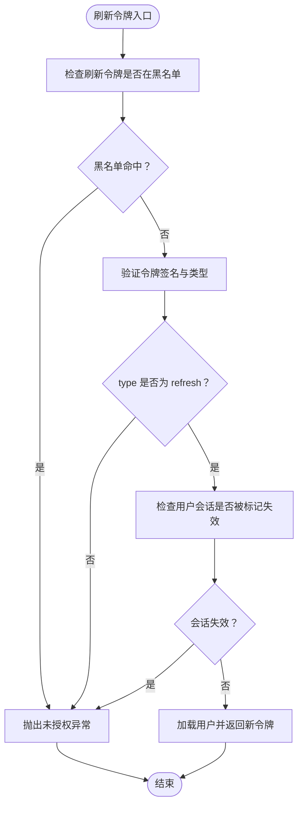
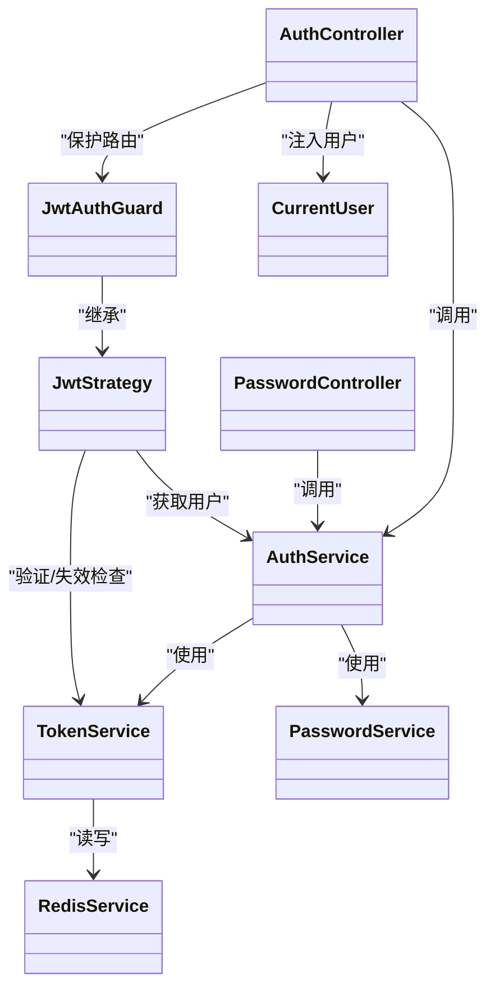

# 用户认证流程

<cite>
**本文引用的文件**
- [apps/backend/src/auth/auth.controller.ts](file://apps/backend/src/auth/auth.controller.ts)
- [apps/backend/src/auth/auth.service.ts](file://apps/backend/src/auth/auth.service.ts)
- [apps/backend/src/auth/auth.dto.ts](file://apps/backend/src/auth/auth.dto.ts)
- [apps/backend/src/auth/token.service.ts](file://apps/backend/src/auth/token.service.ts)
- [apps/backend/src/auth/password.service.ts](file://apps/backend/src/auth/password.service.ts)
- [apps/backend/src/auth/jwt-auth.guard.ts](file://apps/backend/src/auth/jwt-auth.guard.ts)
- [apps/backend/src/auth/jwt.strategy.ts](file://apps/backend/src/auth/jwt.strategy.ts)
- [apps/backend/src/auth/current-user.decorator.ts](file://apps/backend/src/auth/current-user.decorator.ts)
- [apps/backend/src/auth/password.controller.ts](file://apps/backend/src/auth/password.controller.ts)
- [apps/backend/src/auth/auth.module.ts](file://apps/backend/src/auth/auth.module.ts)
- [packages/shared/src/schemas/auth.schema.ts](file://packages/shared/src/schemas/auth.schema.ts)
- [apps/backend/src/redis/redis.service.ts](file://apps/backend/src/redis/redis.service.ts)
- [apps/backend/tests/e2e/auth.e2e.spec.ts](file://apps/backend/tests/e2e/auth.e2e.spec.ts)
- [apps/backend/tests/auth/auth.service.spec.ts](file://apps/backend/tests/auth/auth.service.spec.ts)
</cite>

## 目录
1. [简介](#简介)
2. [项目结构](#项目结构)
3. [核心组件](#核心组件)
4. [架构总览](#架构总览)
5. [详细组件分析](#详细组件分析)
6. [依赖关系分析](#依赖关系分析)
7. [性能考量](#性能考量)
8. [故障排查指南](#故障排查指南)
9. [结论](#结论)
10. [附录：API 接口规范与响应格式](#附录api-接口规范与响应格式)

## 简介
本文件系统性阐述用户认证流程的技术实现，覆盖注册、登录、登出、令牌刷新与“密码找回/重置”的完整业务闭环；解释认证服务的内部协作、DTO 校验规则、输入参数处理、会话与状态保持机制、多设备并发会话控制策略、认证中间件配置与使用方式，并提供错误处理策略与用户体验优化建议。同时给出端到端测试用例与关键流程图示，帮助开发者快速理解与维护。

## 项目结构
认证子系统采用分层设计：
- 控制器层：暴露 REST API，负责请求接收与响应封装
- 服务层：编排业务流程，协调用户、令牌与密码服务
- 数据传输对象层：基于共享 Schema 的 DTO，统一校验与文档生成
- 安全层：JWT 策略与守卫，拦截器与装饰器保障安全访问
- 基础设施：Redis 用于令牌黑名单、会话失效标记与缓存

图表来源
- [apps/backend/src/auth/auth.controller.ts:14-81](file://apps/backend/src/auth/auth.controller.ts#L14-L81)
- [apps/backend/src/auth/password.controller.ts:10-38](file://apps/backend/src/auth/password.controller.ts#L10-L38)
- [apps/backend/src/auth/auth.service.ts:12-126](file://apps/backend/src/auth/auth.service.ts#L12-L126)
- [apps/backend/src/auth/token.service.ts:15-186](file://apps/backend/src/auth/token.service.ts#L15-L186)
- [apps/backend/src/auth/password.service.ts:9-99](file://apps/backend/src/auth/password.service.ts#L9-L99)
- [apps/backend/src/auth/jwt.strategy.ts:19-67](file://apps/backend/src/auth/jwt.strategy.ts#L19-L67)
- [apps/backend/src/auth/jwt-auth.guard.ts:8-9](file://apps/backend/src/auth/jwt-auth.guard.ts#L8-L9)
- [apps/backend/src/auth/current-user.decorator.ts:8-18](file://apps/backend/src/auth/current-user.decorator.ts#L8-L18)
- [apps/backend/src/redis/redis.service.ts:51-202](file://apps/backend/src/redis/redis.service.ts#L51-L202)

章节来源
- [apps/backend/src/auth/auth.controller.ts:1-82](file://apps/backend/src/auth/auth.controller.ts#L1-L82)
- [apps/backend/src/auth/auth.module.ts:19-40](file://apps/backend/src/auth/auth.module.ts#L19-L40)

## 核心组件
- AuthController：提供 /auth/login、/auth/register、/auth/refresh、/auth/me、/auth/logout、/auth/forgot-password、/auth/reset-password 等接口
- AuthService：统一编排登录/注册/刷新/登出与密码找回/重置流程，调用 TokenService 与 PasswordService
- TokenService：签发/验证访问/刷新令牌，维护黑名单，标记用户会话失效
- PasswordService：密码哈希/比较，生成并校验重置令牌，触发邮件通知，重置后使用户会话失效
- JwtStrategy/JwtAuthGuard：基于 Passport 的 JWT 验证策略与守卫，拦截受保护路由
- CurrentUser 装饰器：便捷注入当前用户对象或其字段
- RedisService：提供黑名单、会话失效标记与通用缓存能力
- Shared Schemas：统一的 DTO 校验规则，自动生成 Swagger 文档

章节来源
- [apps/backend/src/auth/auth.controller.ts:16-81](file://apps/backend/src/auth/auth.controller.ts#L16-L81)
- [apps/backend/src/auth/auth.service.ts:12-126](file://apps/backend/src/auth/auth.service.ts#L12-L126)
- [apps/backend/src/auth/token.service.ts:15-186](file://apps/backend/src/auth/token.service.ts#L15-L186)
- [apps/backend/src/auth/password.service.ts:9-99](file://apps/backend/src/auth/password.service.ts#L9-L99)
- [apps/backend/src/auth/jwt.strategy.ts:19-67](file://apps/backend/src/auth/jwt.strategy.ts#L19-L67)
- [apps/backend/src/auth/jwt-auth.guard.ts:8-9](file://apps/backend/src/auth/jwt-auth.guard.ts#L8-L9)
- [apps/backend/src/auth/current-user.decorator.ts:8-18](file://apps/backend/src/auth/current-user.decorator.ts#L8-L18)
- [apps/backend/src/redis/redis.service.ts:51-202](file://apps/backend/src/redis/redis.service.ts#L51-L202)
- [packages/shared/src/schemas/auth.schema.ts:1-121](file://packages/shared/src/schemas/auth.schema.ts#L1-L121)

## 架构总览
认证系统以“控制器-服务-基础设施”三层协作为核心，配合 JWT 与 Redis 实现强安全与高可用的状态保持。

图表来源
- [apps/backend/src/auth/auth.controller.ts:22-80](file://apps/backend/src/auth/auth.controller.ts#L22-L80)
- [apps/backend/src/auth/auth.service.ts:41-101](file://apps/backend/src/auth/auth.service.ts#L41-L101)
- [apps/backend/src/auth/token.service.ts:175-185](file://apps/backend/src/auth/token.service.ts#L175-L185)
- [apps/backend/src/auth/password.service.ts:39-89](file://apps/backend/src/auth/password.service.ts#L39-L89)
- [apps/backend/src/redis/redis.service.ts:100-108](file://apps/backend/src/redis/redis.service.ts#L100-L108)

## 详细组件分析

### 组件一：认证控制器与路由
- 登录：限流 5 次/分钟，返回短期访问令牌与长期刷新令牌
- 注册：限流 3 次/分钟，创建用户并返回令牌
- 刷新：传入 refreshToken，校验黑名单与会话失效标记后签发新令牌
- 获取当前用户：JWT 守卫保护，返回用户信息
- 登出：传入 refreshToken 并将其加入黑名单，清理 Cookie
- 密码找回/重置：分别限流 3/5 次/分钟，发送邮件并完成重置

章节来源
- [apps/backend/src/auth/auth.controller.ts:22-80](file://apps/backend/src/auth/auth.controller.ts#L22-L80)
- [apps/backend/src/auth/password.controller.ts:19-37](file://apps/backend/src/auth/password.controller.ts#L19-L37)

### 组件二：认证服务（业务编排）
- validateUser：按邮箱查找用户，校验密码哈希
- login：校验失败抛出未授权异常，成功则构建认证响应
- register：创建用户后构建认证响应
- refreshToken：黑名单检查、类型校验、会话失效标记检查、用户存在性检查，通过后签发新令牌
- logout：将刷新令牌加入黑名单（忽略失败，保证登出接口稳定）
- requestPasswordReset/resetPassword：委托 PasswordService 完成

章节来源
- [apps/backend/src/auth/auth.service.ts:26-101](file://apps/backend/src/auth/auth.service.ts#L26-L101)

### 组件三：令牌服务（JWT/黑名单/失效标记）
- 生成访问令牌（短期）与刷新令牌（长期），区分密钥与过期时间
- verifyToken/verifyAccessToken：双密钥验证，严格区分 access 与 refresh 类型
- blacklistToken/isBlacklisted：基于 Redis 的黑名单持久化，按剩余 TTL 存储
- invalidateUserSessions/isUserSessionInvalidated：通过 Redis 记录用户会话失效时间点，刷新令牌校验时对比 iat

图表来源
- [apps/backend/src/auth/auth.service.ts:59-93](file://apps/backend/src/auth/auth.service.ts#L59-L93)
- [apps/backend/src/auth/token.service.ts:103-170](file://apps/backend/src/auth/token.service.ts#L103-L170)

章节来源
- [apps/backend/src/auth/token.service.ts:15-186](file://apps/backend/src/auth/token.service.ts#L15-L186)

### 组件四：密码服务（哈希/比较/重置）
- 哈希/比较：使用 bcrypt
- requestReset：生成随机令牌并 SHA256 哈希存储，设置过期时间，发送重置邮件
- reset：校验令牌与过期时间，更新密码并调用 TokenService 使用户会话失效

章节来源
- [apps/backend/src/auth/password.service.ts:25-89](file://apps/backend/src/auth/password.service.ts#L25-L89)

### 组件五：JWT 策略与守卫
- JwtStrategy：从 Authorization 头解析 Bearer 令牌，校验类型为 access，校验用户 ID 类型与有效性，检查会话失效标记，最终返回用户对象
- JwtAuthGuard：基于 JwtStrategy 的路由守卫，保护受保护接口

章节来源
- [apps/backend/src/auth/jwt.strategy.ts:41-66](file://apps/backend/src/auth/jwt.strategy.ts#L41-L66)
- [apps/backend/src/auth/jwt-auth.guard.ts:8-9](file://apps/backend/src/auth/jwt-auth.guard.ts#L8-L9)

### 组件六：当前用户装饰器
- CurrentUser：从请求对象提取当前用户，支持按字段取值

章节来源
- [apps/backend/src/auth/current-user.decorator.ts:8-18](file://apps/backend/src/auth/current-user.decorator.ts#L8-L18)

### 组件七：Redis 服务（黑名单/失效标记/缓存）
- 提供 set/get/del/has 等通用缓存操作，支持前缀与 TTL
- TokenService 使用 Redis 存储黑名单与用户会话失效标记

章节来源
- [apps/backend/src/redis/redis.service.ts:51-202](file://apps/backend/src/redis/redis.service.ts#L51-L202)
- [apps/backend/src/auth/token.service.ts:47-76](file://apps/backend/src/auth/token.service.ts#L47-L76)

### 组件八：DTO 验证规则与输入处理
- 登录：邮箱必填、合法格式、小写与去空白；密码长度 6-100
- 注册：邮箱、名称（2-50）、密码规则同上
- 刷新/登出：刷新令牌字符串必填
- 密码找回/重置：邮箱与密码规则，重置 token 必填

章节来源
- [apps/backend/src/auth/auth.dto.ts:15-40](file://apps/backend/src/auth/auth.dto.ts#L15-L40)
- [packages/shared/src/schemas/auth.schema.ts:25-110](file://packages/shared/src/schemas/auth.schema.ts#L25-L110)

## 依赖关系分析
- 控制器依赖 AuthService；AuthService 依赖 TokenService、PasswordService、UsersService
- TokenService 依赖 JwtService、ConfigService、RedisService
- JwtStrategy 依赖 ConfigService、AuthService、TokenService
- PasswordController 依赖 AuthService
- AuthModule 统一导入 JwtModule、PassportModule、RedisModule、MailModule、PrismaModule、UsersModule

图表来源
- [apps/backend/src/auth/auth.controller.ts:16-81](file://apps/backend/src/auth/auth.controller.ts#L16-L81)
- [apps/backend/src/auth/password.controller.ts:12-38](file://apps/backend/src/auth/password.controller.ts#L12-L38)
- [apps/backend/src/auth/auth.service.ts:14-21](file://apps/backend/src/auth/auth.service.ts#L14-L21)
- [apps/backend/src/auth/token.service.ts:22-29](file://apps/backend/src/auth/token.service.ts#L22-L29)
- [apps/backend/src/auth/jwt.strategy.ts:21-25](file://apps/backend/src/auth/jwt.strategy.ts#L21-L25)
- [apps/backend/src/auth/jwt-auth.guard.ts:8-9](file://apps/backend/src/auth/jwt-auth.guard.ts#L8-L9)
- [apps/backend/src/auth/current-user.decorator.ts:8-18](file://apps/backend/src/auth/current-user.decorator.ts#L8-L18)
- [apps/backend/src/redis/redis.service.ts:51-56](file://apps/backend/src/redis/redis.service.ts#L51-L56)

章节来源
- [apps/backend/src/auth/auth.module.ts:19-40](file://apps/backend/src/auth/auth.module.ts#L19-L40)

## 性能考量
- 令牌签发/验证：使用内存级 JWT，避免频繁数据库查询
- 黑名单与会话失效：Redis 存储，TTL 自动过期，降低内存压力
- 速率限制：对敏感接口启用限流，防止暴力破解与滥用
- 缓存穿透保护：RedisService 提供 getOrSet，减少重复查询
- 会话失效广播：invalidateUserSessions 通过 Redis 记录失效时间点，刷新令牌时快速判断

## 故障排查指南
- 401 未授权
  - 可能原因：无效凭据、令牌过期、非 access 类型令牌、会话被标记失效、刷新令牌在黑名单
  - 排查步骤：确认令牌类型与签名密钥；检查 Redis 中黑名单与失效标记；核对用户是否存在
- 登出后仍可刷新
  - 可能原因：刷新令牌未加入黑名单或 Redis 异常
  - 排查步骤：确认 logout 流程已调用 blacklistToken；检查 Redis 写入是否成功
- 密码重置无效
  - 可能原因：令牌过期或未正确哈希；用户不存在
  - 排查步骤：确认 resetPassword 接口收到的 token 已做 SHA256 哈希；检查过期时间与用户记录
- 速率限制触发
  - 可能原因：短时间内多次尝试
  - 排查步骤：查看限流配置与客户端重试策略

章节来源
- [apps/backend/src/auth/auth.service.ts:86-92](file://apps/backend/src/auth/auth.service.ts#L86-L92)
- [apps/backend/src/auth/token.service.ts:130-170](file://apps/backend/src/auth/token.service.ts#L130-L170)
- [apps/backend/src/auth/password.service.ts:66-89](file://apps/backend/src/auth/password.service.ts#L66-L89)
- [apps/backend/tests/e2e/auth.e2e.spec.ts:91-153](file://apps/backend/tests/e2e/auth.e2e.spec.ts#L91-L153)

## 结论
本认证体系通过“控制器-服务-基础设施”的清晰分层，结合 JWT 与 Redis 实现了安全、可扩展且具备良好用户体验的认证流程。通过严格的 DTO 校验、速率限制、会话失效标记与黑名单机制，有效抵御常见攻击与滥用行为。建议在生产环境确保密钥配置与 Redis 高可用，并持续监控令牌刷新与登出链路的稳定性。

## 附录：API 接口规范与响应格式

### 通用响应结构
- 成功响应：包含 success=true、data 字段与 http 状态码 2xx
- 失败响应：包含 success=false、message、statusCode 等字段

章节来源
- [apps/backend/tests/e2e/auth.e2e.spec.ts:3-18](file://apps/backend/tests/e2e/auth.e2e.spec.ts#L3-L18)

### 认证与会话相关接口
- POST /api/auth/register
  - 请求体：邮箱、名称、密码
  - 限流：3 次/分钟
  - 响应：AuthResponse（包含 accessToken、refreshToken、expiresIn、user）
- POST /api/auth/login
  - 请求体：邮箱、密码
  - 限流：5 次/分钟
  - 响应：AuthResponse
- POST /api/auth/refresh
  - 请求体：refreshToken
  - 限流：10 次/分钟
  - 响应：AuthResponse
- GET /api/auth/me
  - 鉴权：Bearer accessToken
  - 响应：User 对象
- POST /api/auth/logout
  - 请求体：refreshToken
  - 响应：{ message: "登出成功" }
- POST /api/auth/forgot-password
  - 请求体：邮箱
  - 限流：3 次/分钟
  - 响应：{ message: "...已发送到您的邮箱" }
- POST /api/auth/reset-password
  - 请求体：token、password
  - 限流：5 次/分钟
  - 响应：{ message: "密码重置成功..." }

章节来源
- [apps/backend/src/auth/auth.controller.ts:22-80](file://apps/backend/src/auth/auth.controller.ts#L22-L80)
- [apps/backend/src/auth/password.controller.ts:19-37](file://apps/backend/src/auth/password.controller.ts#L19-L37)
- [apps/backend/tests/e2e/auth.e2e.spec.ts:64-153](file://apps/backend/tests/e2e/auth.e2e.spec.ts#L64-L153)

### DTO 校验规则摘要
- 登录：邮箱必填、合法格式、小写与去空白；密码 6-100
- 注册：邮箱、名称 2-50、密码 6-100
- 刷新/登出：refreshToken 必填
- 密码找回/重置：邮箱、密码、token 必填

章节来源
- [apps/backend/src/auth/auth.dto.ts:15-40](file://apps/backend/src/auth/auth.dto.ts#L15-L40)
- [packages/shared/src/schemas/auth.schema.ts:25-110](file://packages/shared/src/schemas/auth.schema.ts#L25-L110)

### 会话管理与并发控制策略
- 令牌类型
  - 访问令牌：短期（秒），仅用于受保护资源访问
  - 刷新令牌：长期，用于换取新的访问令牌
- 黑名单
  - 登出时将刷新令牌加入黑名单，防止继续刷新
- 会话失效标记
  - 重置密码或强制失效时，写入用户失效时间戳；刷新令牌校验时对比 iat
- Cookie 清理
  - 登出接口清除 accessToken 与 refreshToken Cookie

章节来源
- [apps/backend/src/auth/token.service.ts:47-76](file://apps/backend/src/auth/token.service.ts#L47-L76)
- [apps/backend/src/auth/auth.controller.ts:69-80](file://apps/backend/src/auth/auth.controller.ts#L69-L80)
- [apps/backend/src/auth/password.service.ts:88-89](file://apps/backend/src/auth/password.service.ts#L88-L89)

### 认证中间件配置与使用
- JwtAuthGuard：用于保护受保护路由
- JwtStrategy：配置从 Authorization 头解析 Bearer 令牌，校验签名与类型
- CurrentUser：在受保护路由中注入当前用户对象
- 速率限制：Throttle 装饰器应用于敏感接口

章节来源
- [apps/backend/src/auth/jwt-auth.guard.ts:8-9](file://apps/backend/src/auth/jwt-auth.guard.ts#L8-L9)
- [apps/backend/src/auth/jwt.strategy.ts:21-36](file://apps/backend/src/auth/jwt.strategy.ts#L21-L36)
- [apps/backend/src/auth/current-user.decorator.ts:8-18](file://apps/backend/src/auth/current-user.decorator.ts#L8-L18)
- [apps/backend/src/auth/auth.controller.ts:22-48](file://apps/backend/src/auth/auth.controller.ts#L22-L48)