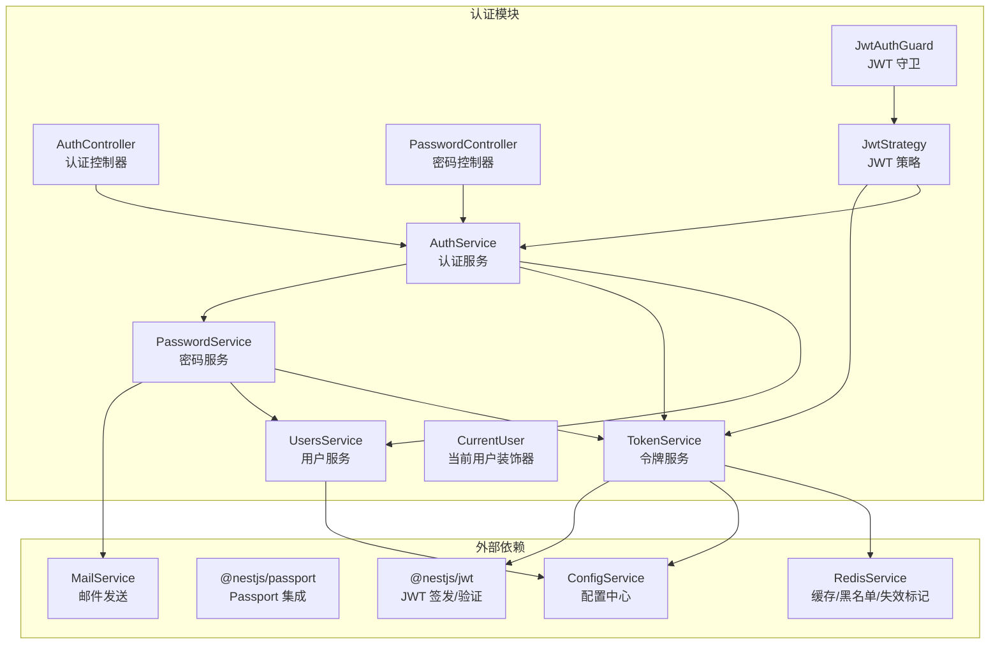
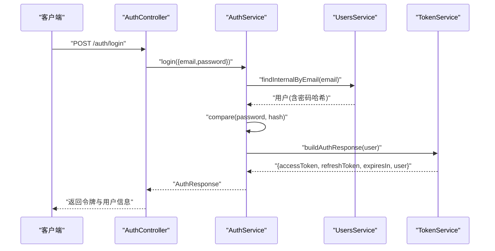
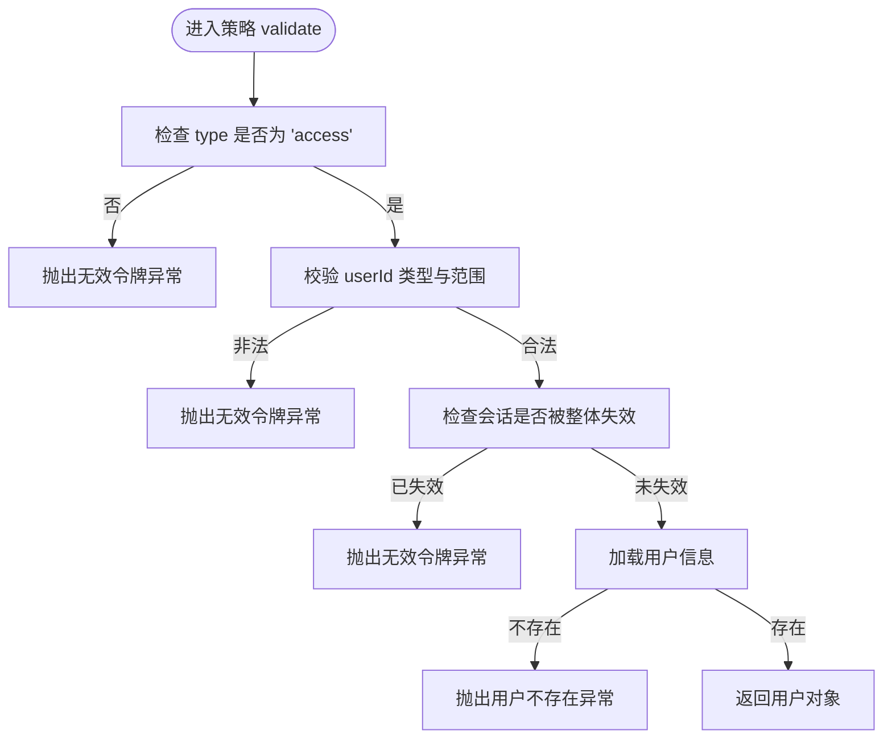
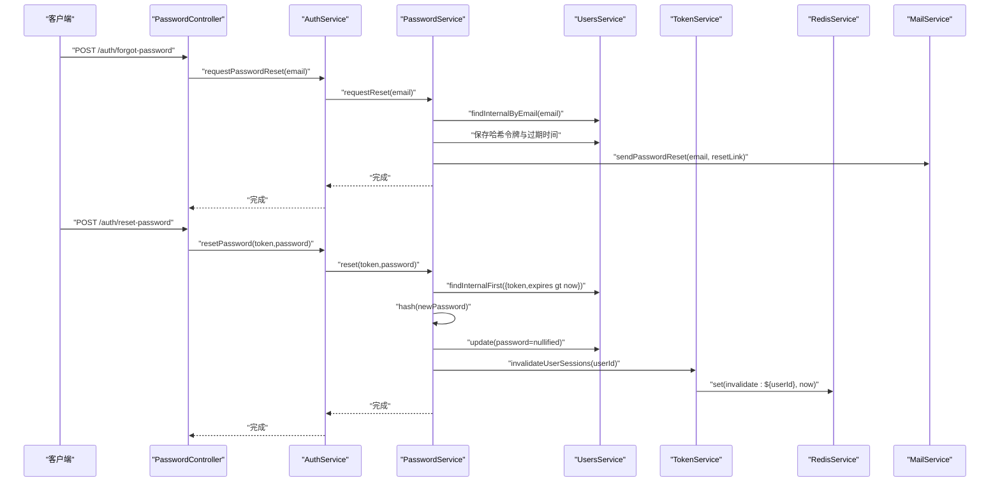
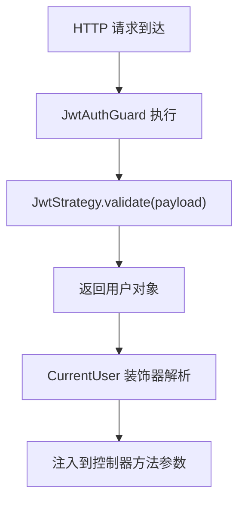
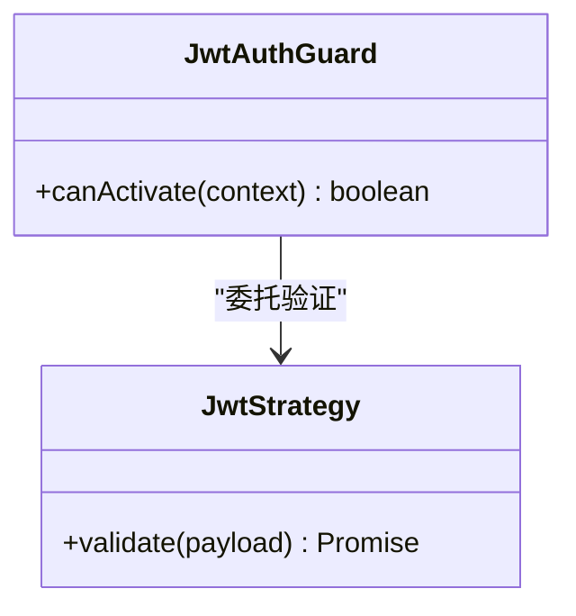
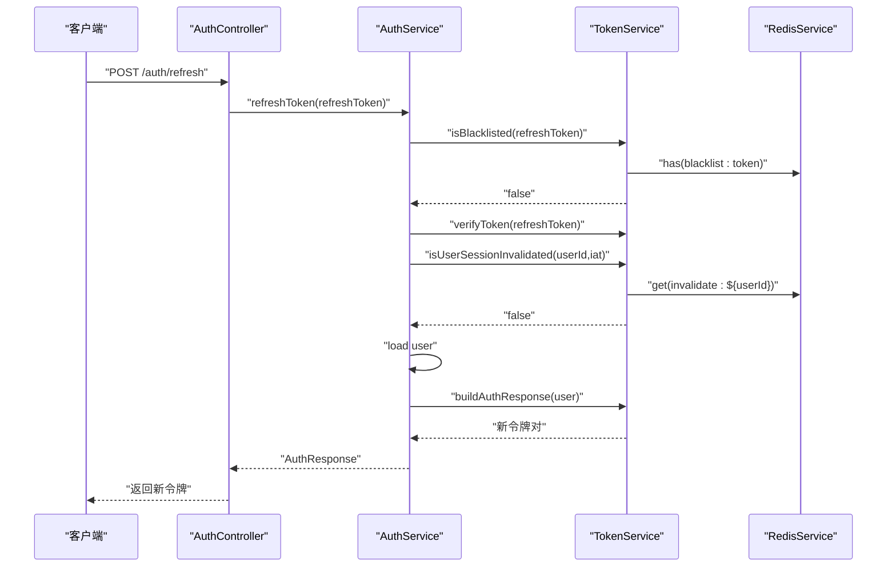
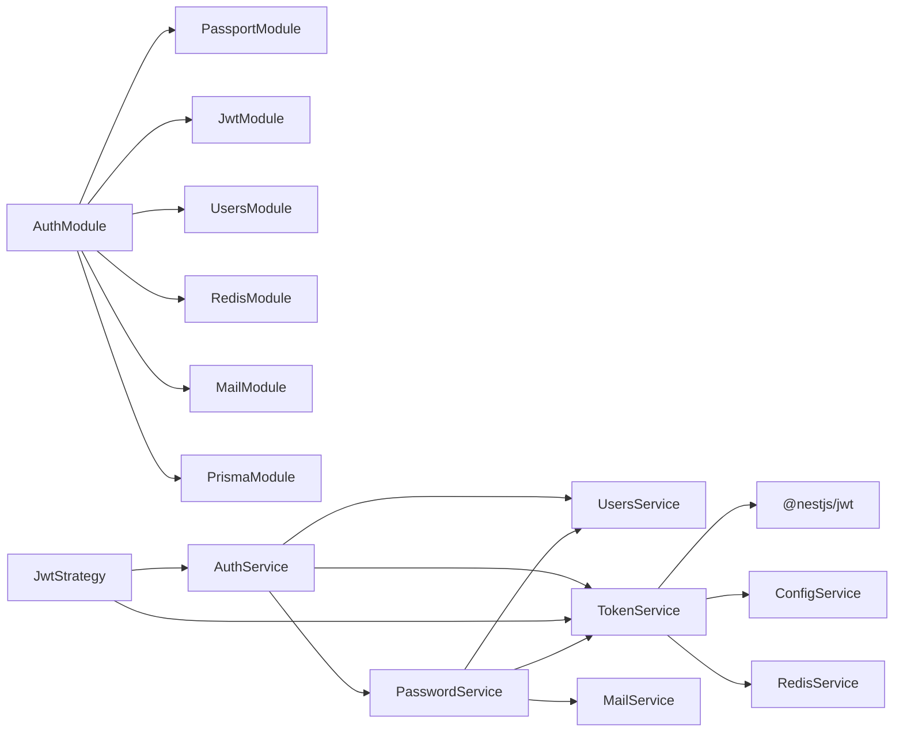

# 认证模块

<cite>
**本文引用的文件**
- [apps/backend/src/auth/auth.controller.ts](file://apps/backend/src/auth/auth.controller.ts)
- [apps/backend/src/auth/auth.service.ts](file://apps/backend/src/auth/auth.service.ts)
- [apps/backend/src/auth/auth.module.ts](file://apps/backend/src/auth/auth.module.ts)
- [apps/backend/src/auth/auth.dto.ts](file://apps/backend/src/auth/auth.dto.ts)
- [apps/backend/src/auth/current-user.decorator.ts](file://apps/backend/src/auth/current-user.decorator.ts)
- [apps/backend/src/auth/jwt-auth.guard.ts](file://apps/backend/src/auth/jwt-auth.guard.ts)
- [apps/backend/src/auth/jwt.strategy.ts](file://apps/backend/src/auth/jwt.strategy.ts)
- [apps/backend/src/auth/password.controller.ts](file://apps/backend/src/auth/password.controller.ts)
- [apps/backend/src/auth/password.service.ts](file://apps/backend/src/auth/password.service.ts)
- [apps/backend/src/auth/token.service.ts](file://apps/backend/src/auth/token.service.ts)
- [apps/backend/src/users/users.service.ts](file://apps/backend/src/users/users.service.ts)
- [apps/backend/src/redis/redis.service.ts](file://apps/backend/src/redis/redis.service.ts)
- [apps/backend/src/mail/mail.service.ts](file://apps/backend/src/mail/mail.service.ts)
- [packages/shared/src/schemas/auth.schema.ts](file://packages/shared/src/schemas/auth.schema.ts)
- [apps/backend/tests/auth/auth.service.spec.ts](file://apps/backend/tests/auth/auth.service.spec.ts)
- [apps/backend/tests/auth/token.service.spec.ts](file://apps/backend/tests/auth/token.service.spec.ts)
</cite>

## 目录
1. [简介](#简介)
2. [项目结构](#项目结构)
3. [核心组件](#核心组件)
4. [架构总览](#架构总览)
5. [详细组件分析](#详细组件分析)
6. [依赖关系分析](#依赖关系分析)
7. [性能考量](#性能考量)
8. [故障排查指南](#故障排查指南)
9. [结论](#结论)
10. [附录：API 规范与安全最佳实践](#附录api-规范与安全最佳实践)

## 简介
本文件系统性梳理认证模块的设计与实现，覆盖 JWT 认证机制、令牌生命周期与刷新、会话失效控制、自定义装饰器与守卫、密码重置流程、错误处理与安全策略，并给出 API 规范与常见威胁防护建议。目标是帮助开发者快速理解并正确扩展认证能力。

## 项目结构
认证模块位于后端应用的独立子目录，采用“按职责分层”的组织方式：
- 控制器层：处理 HTTP 请求与响应，暴露认证与密码相关接口
- 服务层：封装业务逻辑，协调用户、令牌与密码服务
- 策略与守卫：基于 Passport 的 JWT 验证与路由保护
- 数据传输对象：基于 Zod 的输入校验与 Swagger 文档生成
- 共享类型与校验：跨包的输入输出类型与校验规则
- 测试：对关键流程进行单元测试与行为验证

图表来源
- [apps/backend/src/auth/auth.controller.ts:1-82](file://apps/backend/src/auth/auth.controller.ts#L1-L82)
- [apps/backend/src/auth/password.controller.ts:1-39](file://apps/backend/src/auth/password.controller.ts#L1-L39)
- [apps/backend/src/auth/auth.service.ts:1-127](file://apps/backend/src/auth/auth.service.ts#L1-L127)
- [apps/backend/src/auth/password.service.ts:1-100](file://apps/backend/src/auth/password.service.ts#L1-L100)
- [apps/backend/src/auth/token.service.ts:1-187](file://apps/backend/src/auth/token.service.ts#L1-L187)
- [apps/backend/src/auth/jwt.strategy.ts:1-68](file://apps/backend/src/auth/jwt.strategy.ts#L1-L68)
- [apps/backend/src/auth/jwt-auth.guard.ts:1-10](file://apps/backend/src/auth/jwt-auth.guard.ts#L1-L10)
- [apps/backend/src/auth/current-user.decorator.ts:1-19](file://apps/backend/src/auth/current-user.decorator.ts#L1-L19)
- [apps/backend/src/users/users.service.ts:1-110](file://apps/backend/src/users/users.service.ts#L1-L110)
- [apps/backend/src/redis/redis.service.ts:1-233](file://apps/backend/src/redis/redis.service.ts#L1-L233)
- [apps/backend/src/mail/mail.service.ts:1-117](file://apps/backend/src/mail/mail.service.ts#L1-L117)

章节来源
- [apps/backend/src/auth/auth.module.ts:1-41](file://apps/backend/src/auth/auth.module.ts#L1-L41)

## 核心组件
- 认证控制器：提供登录、注册、刷新、登出、获取当前用户等接口
- 密码控制器：提供找回密码与重置密码接口
- 认证服务：整合用户、令牌与密码服务，提供统一认证入口
- 令牌服务：负责签发访问/刷新令牌、校验、黑名单、会话失效标记
- 密码服务：负责密码哈希、比较、重置令牌生成与校验、失效会话
- JWT 策略与守卫：基于 Passport 的访问令牌验证与路由保护
- 自定义装饰器：从请求上下文提取当前用户
- 用户服务：用户 CRUD、查询与去敏化输出
- Redis 缓存：黑名单、会话失效标记、速率限制等
- 邮件服务：发送密码重置邮件

章节来源
- [apps/backend/src/auth/auth.controller.ts:1-82](file://apps/backend/src/auth/auth.controller.ts#L1-L82)
- [apps/backend/src/auth/password.controller.ts:1-39](file://apps/backend/src/auth/password.controller.ts#L1-L39)
- [apps/backend/src/auth/auth.service.ts:1-127](file://apps/backend/src/auth/auth.service.ts#L1-L127)
- [apps/backend/src/auth/token.service.ts:1-187](file://apps/backend/src/auth/token.service.ts#L1-L187)
- [apps/backend/src/auth/password.service.ts:1-100](file://apps/backend/src/auth/password.service.ts#L1-L100)
- [apps/backend/src/auth/jwt.strategy.ts:1-68](file://apps/backend/src/auth/jwt.strategy.ts#L1-L68)
- [apps/backend/src/auth/jwt-auth.guard.ts:1-10](file://apps/backend/src/auth/jwt-auth.guard.ts#L1-L10)
- [apps/backend/src/auth/current-user.decorator.ts:1-19](file://apps/backend/src/auth/current-user.decorator.ts#L1-L19)
- [apps/backend/src/users/users.service.ts:1-110](file://apps/backend/src/users/users.service.ts#L1-L110)
- [apps/backend/src/redis/redis.service.ts:1-233](file://apps/backend/src/redis/redis.service.ts#L1-L233)
- [apps/backend/src/mail/mail.service.ts:1-117](file://apps/backend/src/mail/mail.service.ts#L1-L117)

## 架构总览
认证采用“双令牌模型”：短期访问令牌（Access Token）与长期刷新令牌（Refresh Token）。访问令牌由策略验证，刷新令牌仅用于换取新的令牌对；通过 Redis 维护黑名单与会话失效标记，实现细粒度的安全控制。

图表来源
- [apps/backend/src/auth/auth.controller.ts:22-27](file://apps/backend/src/auth/auth.controller.ts#L22-L27)
- [apps/backend/src/auth/auth.service.ts:41-49](file://apps/backend/src/auth/auth.service.ts#L41-L49)
- [apps/backend/src/auth/token.service.ts:175-185](file://apps/backend/src/auth/token.service.ts#L175-L185)
- [apps/backend/src/users/users.service.ts:55-57](file://apps/backend/src/users/users.service.ts#L55-L57)

章节来源
- [apps/backend/src/auth/auth.module.ts:19-39](file://apps/backend/src/auth/auth.module.ts#L19-L39)

## 详细组件分析

### JWT 认证机制与安全策略
- 双令牌模型
  - 访问令牌：短期有效，用于受保护资源访问
  - 刷新令牌：长期有效，仅用于换取新的令牌对
- 策略验证
  - 仅接受 type=access 的令牌
  - 校验用户存在与会话未失效
  - 强制 userId 类型校验，防止注入风险
- 会话失效控制
  - 通过 Redis 写入失效时间戳，验证 iat 是否早于失效时间
  - 密码重置后可整体失效用户会话
- 黑名单机制
  - 登出或异常场景将访问/刷新令牌写入黑名单，按剩余有效期 TTL 存储
- 秘钥分离
  - 开发环境：访问/刷新密钥相同
  - 生产环境：必须配置独立刷新密钥，提升安全性

图表来源
- [apps/backend/src/auth/jwt.strategy.ts:41-66](file://apps/backend/src/auth/jwt.strategy.ts#L41-L66)

章节来源
- [apps/backend/src/auth/jwt.strategy.ts:1-68](file://apps/backend/src/auth/jwt.strategy.ts#L1-L68)
- [apps/backend/src/auth/token.service.ts:47-76](file://apps/backend/src/auth/token.service.ts#L47-L76)

### 用户注册、登录、密码重置全流程
- 注册
  - 输入校验通过后，服务层调用用户服务创建用户并返回 AuthResponse
- 登录
  - 校验邮箱与密码，成功后签发访问/刷新令牌
- 密码重置
  - 请求重置：生成 SHA-256 哈希令牌与过期时间，发送重置链接
  - 重置密码：校验令牌与过期时间，更新密码并使该用户会话整体失效

图表来源
- [apps/backend/src/auth/password.controller.ts:19-37](file://apps/backend/src/auth/password.controller.ts#L19-L37)
- [apps/backend/src/auth/password.service.ts:39-89](file://apps/backend/src/auth/password.service.ts#L39-L89)
- [apps/backend/src/auth/token.service.ts:47-53](file://apps/backend/src/auth/token.service.ts#L47-L53)
- [apps/backend/src/redis/redis.service.ts:47-53](file://apps/backend/src/redis/redis.service.ts#L47-L53)
- [apps/backend/src/mail/mail.service.ts:91-115](file://apps/backend/src/mail/mail.service.ts#L91-L115)

章节来源
- [apps/backend/src/auth/password.controller.ts:1-39](file://apps/backend/src/auth/password.controller.ts#L1-L39)
- [apps/backend/src/auth/password.service.ts:1-100](file://apps/backend/src/auth/password.service.ts#L1-L100)
- [apps/backend/src/auth/auth.service.ts:106-112](file://apps/backend/src/auth/auth.service.ts#L106-L112)

### 自定义装饰器与当前用户提取
- CurrentUser 装饰器
  - 从请求对象的 user 或 raw.user 中提取当前用户
  - 支持传入属性键，按需返回用户某个字段
- 使用场景
  - 在受保护路由中，通过参数装饰器直接获取当前用户对象

图表来源
- [apps/backend/src/auth/current-user.decorator.ts:8-18](file://apps/backend/src/auth/current-user.decorator.ts#L8-L18)
- [apps/backend/src/auth/jwt-auth.guard.ts:8-9](file://apps/backend/src/auth/jwt-auth.guard.ts#L8-L9)
- [apps/backend/src/auth/jwt.strategy.ts:41-66](file://apps/backend/src/auth/jwt.strategy.ts#L41-L66)

章节来源
- [apps/backend/src/auth/current-user.decorator.ts:1-19](file://apps/backend/src/auth/current-user.decorator.ts#L1-L19)
- [apps/backend/src/auth/jwt-auth.guard.ts:1-10](file://apps/backend/src/auth/jwt-auth.guard.ts#L1-L10)

### 认证守卫与权限控制
- JwtAuthGuard
  - 基于 Passport 的 jwt 策略，拦截受保护路由
- 权限控制策略
  - 仅允许携带有效访问令牌的请求访问受保护资源
  - 访问令牌过期或被整体失效将拒绝请求
  - 刷新令牌仅用于换取新的令牌对，不参与资源访问

图表来源
- [apps/backend/src/auth/jwt-auth.guard.ts:8-9](file://apps/backend/src/auth/jwt-auth.guard.ts#L8-L9)
- [apps/backend/src/auth/jwt.strategy.ts:41-66](file://apps/backend/src/auth/jwt.strategy.ts#L41-L66)

章节来源
- [apps/backend/src/auth/jwt-auth.guard.ts:1-10](file://apps/backend/src/auth/jwt-auth.guard.ts#L1-L10)
- [apps/backend/src/auth/jwt.strategy.ts:1-68](file://apps/backend/src/auth/jwt.strategy.ts#L1-L68)

### 令牌刷新与会话管理
- 刷新流程
  - 校验刷新令牌是否在黑名单
  - 校验令牌类型与用户存在性
  - 校验用户会话是否被整体失效
  - 成功后签发新的令牌对
- 会话管理
  - 登出：将刷新令牌加入黑名单
  - 密码重置：整体失效用户会话，确保旧令牌无法刷新
  - 令牌签名：区分访问/刷新密钥，生产环境强制分离

图表来源
- [apps/backend/src/auth/auth.controller.ts:43-48](file://apps/backend/src/auth/auth.controller.ts#L43-L48)
- [apps/backend/src/auth/auth.service.ts:59-93](file://apps/backend/src/auth/auth.service.ts#L59-L93)
- [apps/backend/src/auth/token.service.ts:166-170](file://apps/backend/src/auth/token.service.ts#L166-L170)
- [apps/backend/src/redis/redis.service.ts:166-169](file://apps/backend/src/redis/redis.service.ts#L166-L169)

章节来源
- [apps/backend/src/auth/auth.service.ts:56-101](file://apps/backend/src/auth/auth.service.ts#L56-L101)
- [apps/backend/src/auth/token.service.ts:129-170](file://apps/backend/src/auth/token.service.ts#L129-L170)

### 密码加密算法与安全最佳实践
- 密码存储
  - 使用 bcryptjs 对密码进行哈希，成本因子固定为 10
- 令牌安全
  - 访问令牌短周期（默认 15 分钟），刷新令牌长周期（默认 7 天）
  - 生产环境强制配置独立刷新密钥
  - 令牌过期后自动失效，黑名单机制即时阻断
- 输入校验
  - 基于 Zod 的强类型校验，统一错误消息与国际化
- 防枚举攻击
  - 重置请求无论用户是否存在均快速返回，避免泄露账户信息
- 会话整体失效
  - 密码重置后写入失效时间戳，旧令牌无法继续刷新

章节来源
- [apps/backend/src/auth/password.service.ts:25-34](file://apps/backend/src/auth/password.service.ts#L25-L34)
- [apps/backend/src/users/users.service.ts:97-107](file://apps/backend/src/users/users.service.ts#L97-L107)
- [apps/backend/src/auth/token.service.ts:30-45](file://apps/backend/src/auth/token.service.ts#L30-L45)
- [apps/backend/src/auth/password.service.ts:42-45](file://apps/backend/src/auth/password.service.ts#L42-L45)
- [apps/backend/src/auth/token.service.ts:47-53](file://apps/backend/src/auth/token.service.ts#L47-L53)

## 依赖关系分析
- 模块导入
  - AuthModule 导入 Passport 与 JwtModule，注册默认策略为 jwt
  - 导入 Users、Redis、Mail、Prisma 模块以支撑认证功能
- 组件耦合
  - AuthService 作为门面，聚合 UsersService、TokenService、PasswordService
  - JwtStrategy 依赖 TokenService 与 AuthService 进行会话与用户校验
  - TokenService 依赖 JwtService、ConfigService、RedisService
  - PasswordService 依赖 UsersService、MailService、TokenService

图表来源
- [apps/backend/src/auth/auth.module.ts:19-39](file://apps/backend/src/auth/auth.module.ts#L19-L39)

章节来源
- [apps/backend/src/auth/auth.module.ts:1-41](file://apps/backend/src/auth/auth.module.ts#L1-L41)

## 性能考量
- 令牌签发/验证
  - 使用内存级缓存与合理的过期时间，降低数据库压力
- 黑名单与失效标记
  - Redis 存储具备 TTL，避免持久占用
- 速率限制
  - 登录/注册/重置等接口配置节流，防止暴力破解
- 并发与幂等
  - 登出接口忽略黑名单写入失败，保证用户体验与接口可用性

[本节为通用指导，无需列出具体文件来源]

## 故障排查指南
- 常见异常与定位
  - 无效凭据：登录失败或用户不存在
  - 无效令牌：访问令牌类型不符或已被整体失效
  - 无效刷新令牌：令牌不在黑名单但类型或用户状态异常
  - 令牌过期：验证阶段抛出过期异常
- 关键检查点
  - JWT_SECRET/JWT_REFRESH_SECRET 是否正确配置
  - Redis 是否正常运行且键空间前缀一致
  - 用户会话失效标记是否正确写入
  - 邮件服务配置是否正确，重置链接是否可达
- 单元测试参考
  - 认证服务：覆盖登录、登出、刷新等关键路径
  - 令牌服务：覆盖签发、验证、黑名单、会话失效等路径

章节来源
- [apps/backend/tests/auth/auth.service.spec.ts:85-175](file://apps/backend/tests/auth/auth.service.spec.ts#L85-L175)
- [apps/backend/tests/auth/token.service.spec.ts:72-179](file://apps/backend/tests/auth/token.service.spec.ts#L72-L179)

## 结论
该认证模块通过双令牌模型、策略化验证、Redis 黑名单与会话失效标记，构建了高可用、可扩展且安全的认证体系。配合严格的输入校验、密码哈希与防枚举策略，满足生产环境的安全要求。建议在生产环境中启用独立刷新密钥与完善的监控告警，持续优化令牌生命周期与缓存策略。

[本节为总结性内容，无需列出具体文件来源]

## 附录：API 规范与安全最佳实践

### API 接口规范
- 认证
  - POST /auth/login
    - 请求体：登录 DTO（邮箱、密码）
    - 响应：认证响应（访问令牌、刷新令牌、过期时间、用户信息）
  - POST /auth/register
    - 请求体：注册 DTO（邮箱、姓名、密码）
    - 响应：认证响应
  - POST /auth/refresh
    - 请求体：刷新令牌 DTO（刷新令牌）
    - 响应：新的认证响应
  - GET /auth/me
    - 请求头：Authorization: Bearer <访问令牌>
    - 响应：当前用户信息
  - POST /auth/logout
    - 请求体：登出 DTO（刷新令牌）
    - 响应：成功消息（同时清除客户端 Cookie）

- 密码管理
  - POST /auth/forgot-password
    - 请求体：找回密码 DTO（邮箱）
    - 响应：提示消息（无论邮箱是否存在）
  - POST /auth/reset-password
    - 请求体：重置密码 DTO（令牌、新密码）
    - 响应：成功消息

章节来源
- [apps/backend/src/auth/auth.controller.ts:22-80](file://apps/backend/src/auth/auth.controller.ts#L22-L80)
- [apps/backend/src/auth/password.controller.ts:19-37](file://apps/backend/src/auth/password.controller.ts#L19-L37)
- [apps/backend/src/auth/auth.dto.ts:15-41](file://apps/backend/src/auth/auth.dto.ts#L15-L41)
- [packages/shared/src/schemas/auth.schema.ts:25-110](file://packages/shared/src/schemas/auth.schema.ts#L25-L110)

### 错误处理方案
- 统一异常
  - 无效凭据、无效令牌、无效刷新令牌、用户不存在、令牌过期等
- 国际化与前端提示
  - 使用 i18n 键映射错误消息，便于多语言展示
- 速率限制
  - 登录/注册/重置接口配置节流，防止暴力破解

章节来源
- [apps/backend/src/auth/auth.service.ts:44-46](file://apps/backend/src/auth/auth.service.ts#L44-L46)
- [apps/backend/src/auth/jwt.strategy.ts:43-62](file://apps/backend/src/auth/jwt.strategy.ts#L43-L62)
- [apps/backend/src/auth/password.service.ts:76-78](file://apps/backend/src/auth/password.service.ts#L76-L78)

### 安全最佳实践
- 令牌管理
  - 生产环境强制配置独立刷新密钥
  - 登出与异常场景及时写入黑名单
  - 密码重置后整体失效用户会话
- 输入与输出
  - 使用 Zod 进行严格输入校验
  - 输出用户信息时去除敏感字段
- 邮件与链接
  - 重置链接带一次性令牌与过期时间
  - 防枚举攻击：无论邮箱是否存在均快速返回
- 基础设施
  - Redis 配置合理 TTL 与前缀，避免键冲突
  - 配置中心集中管理密钥与过期时间

章节来源
- [apps/backend/src/auth/token.service.ts:30-45](file://apps/backend/src/auth/token.service.ts#L30-L45)
- [apps/backend/src/auth/password.service.ts:42-45](file://apps/backend/src/auth/password.service.ts#L42-L45)
- [apps/backend/src/redis/redis.service.ts:7-15](file://apps/backend/src/redis/redis.service.ts#L7-L15)