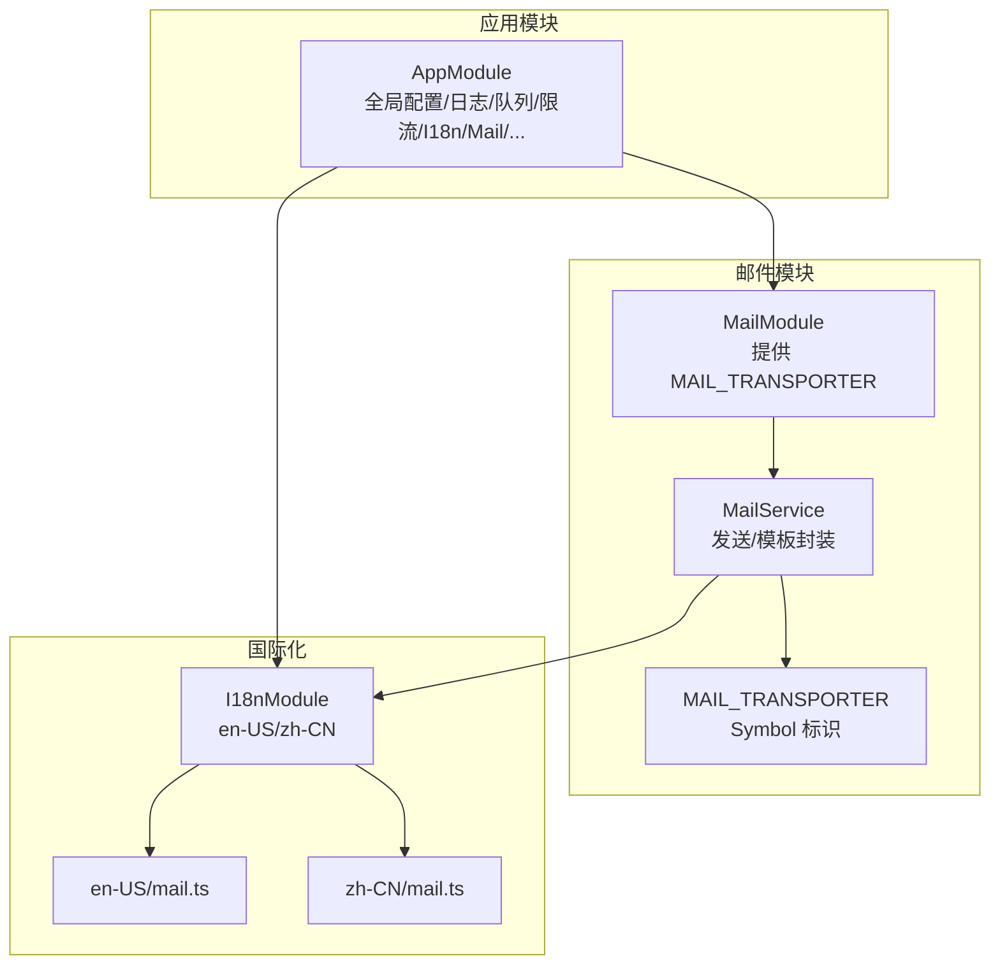
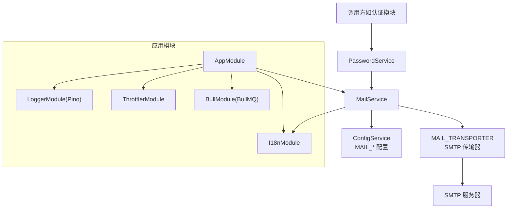
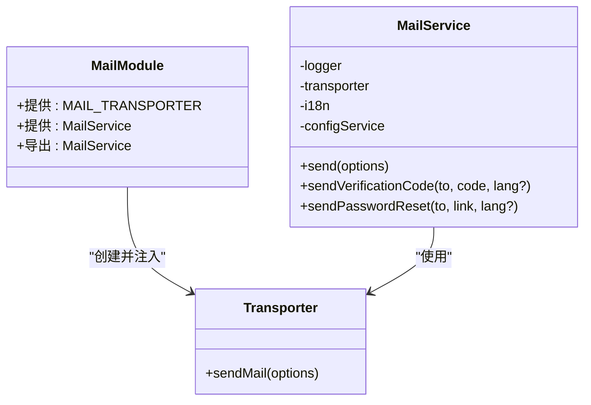
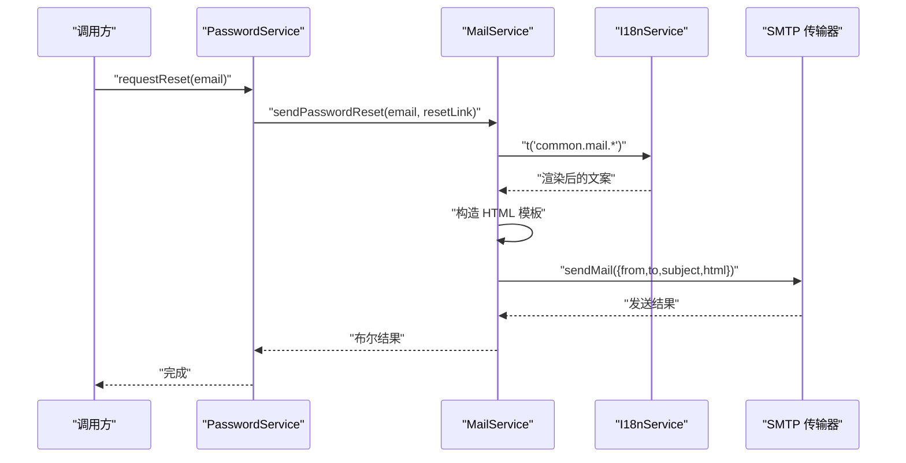
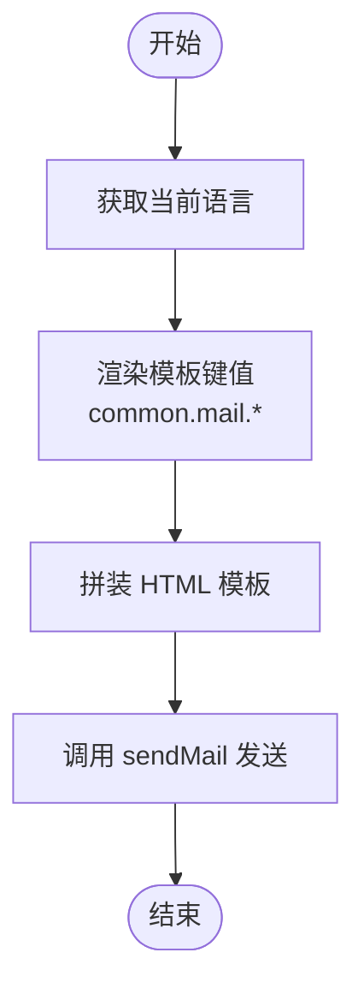
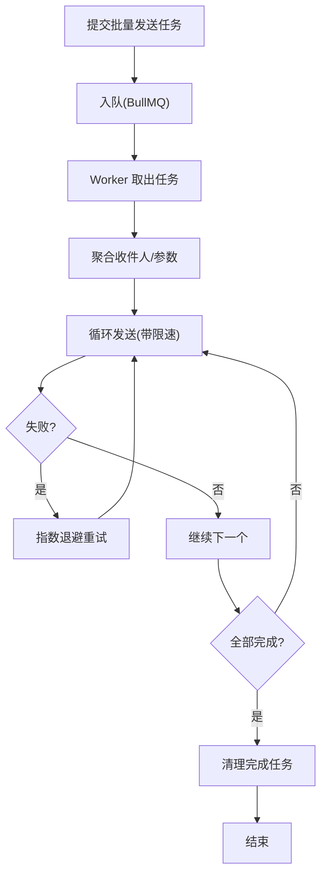
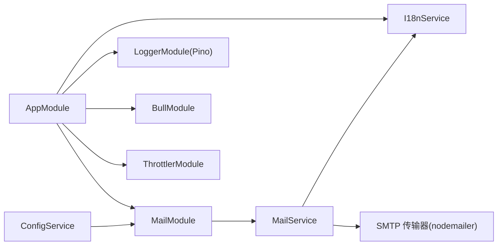

# 邮件服务

<cite>
**本文引用的文件**
- [apps/backend/src/mail/index.ts](file://apps/backend/src/mail/index.ts)
- [apps/backend/src/mail/mail.constants.ts](file://apps/backend/src/mail/mail.constants.ts)
- [apps/backend/src/mail/mail.module.ts](file://apps/backend/src/mail/mail.module.ts)
- [apps/backend/src/mail/mail.service.ts](file://apps/backend/src/mail/mail.service.ts)
- [apps/backend/src/i18n/en-US/mail.ts](file://apps/backend/src/i18n/en-US/mail.ts)
- [apps/backend/src/i18n/zh-CN/mail.ts](file://apps/backend/src/i18n/zh-CN/mail.ts)
- [apps/backend/src/i18n/en-US/common.ts](file://apps/backend/src/i18n/en-US/common.ts)
- [apps/backend/src/i18n/zh-CN/common.ts](file://apps/backend/src/i18n/zh-CN/common.ts)
- [apps/backend/src/app.module.ts](file://apps/backend/src/app.module.ts)
- [apps/backend/src/auth/password.service.ts](file://apps/backend/src/auth/password.service.ts)
- [apps/backend/tests/mail/mail.module.spec.ts](file://apps/backend/tests/mail/mail.module.spec.ts)
</cite>

## 目录
1. [简介](#简介)
2. [项目结构](#项目结构)
3. [核心组件](#核心组件)
4. [架构总览](#架构总览)
5. [详细组件分析](#详细组件分析)
6. [依赖关系分析](#依赖关系分析)
7. [性能考虑](#性能考虑)
8. [故障排查指南](#故障排查指南)
9. [结论](#结论)
10. [附录](#附录)

## 简介
本技术文档围绕邮件服务的实现进行系统性说明，涵盖以下主题：
- 配置与初始化：SMTP 服务器接入、认证参数与传输层配置
- 模板系统：基于国际化键值的模板渲染与多语言支持
- 发送流程：单发与常用业务场景封装（验证码、密码重置）
- 批量发送与队列：结合 BullMQ 的异步队列策略建议
- 追踪与统计：打开率与退信处理的扩展路径
- 安全与校验：内容安全过滤与格式验证建议
- 监控与日志：基于 NestJS Logger 与 Pino 的日志体系
- 性能优化与限流：并发控制与速率限制策略

## 项目结构
邮件服务位于后端应用的独立模块中，通过常量、模块工厂与服务类组织，配合国际化模块与全局配置模块完成运行时装配。

**图表来源**
- [apps/backend/src/app.module.ts](file://apps/backend/src/app.module.ts)
- [apps/backend/src/mail/mail.module.ts](file://apps/backend/src/mail/mail.module.ts)
- [apps/backend/src/mail/mail.service.ts](file://apps/backend/src/mail/mail.service.ts)
- [apps/backend/src/i18n/en-US/mail.ts](file://apps/backend/src/i18n/en-US/mail.ts)
- [apps/backend/src/i18n/zh-CN/mail.ts](file://apps/backend/src/i18n/zh-CN/mail.ts)

**章节来源**
- [apps/backend/src/mail/index.ts](file://apps/backend/src/mail/index.ts)
- [apps/backend/src/mail/mail.module.ts](file://apps/backend/src/mail/mail.module.ts)
- [apps/backend/src/mail/mail.service.ts](file://apps/backend/src/mail/mail.service.ts)
- [apps/backend/src/app.module.ts](file://apps/backend/src/app.module.ts)

## 核心组件
- 邮件常量：定义传输器注入标识，便于模块间解耦
- 邮件模块：基于 ConfigService 动态构建 SMTP 传输器，支持用户名/密码与安全选项
- 邮件服务：封装通用发送与两类常用模板（验证码、密码重置），并集成国际化键值
- 国际化：英文与中文两套邮件文案键值，由 I18nService 渲染
- 应用模块：全局注册日志、队列、限流与 I18n，暴露 MailService 供其他模块使用

**章节来源**
- [apps/backend/src/mail/mail.constants.ts](file://apps/backend/src/mail/mail.constants.ts)
- [apps/backend/src/mail/mail.module.ts](file://apps/backend/src/mail/mail.module.ts)
- [apps/backend/src/mail/mail.service.ts](file://apps/backend/src/mail/mail.service.ts)
- [apps/backend/src/i18n/en-US/mail.ts](file://apps/backend/src/i18n/en-US/mail.ts)
- [apps/backend/src/i18n/zh-CN/mail.ts](file://apps/backend/src/i18n/zh-CN/mail.ts)
- [apps/backend/src/app.module.ts](file://apps/backend/src/app.module.ts)

## 架构总览
下图展示邮件服务在应用中的位置与交互关系：

**图表来源**
- [apps/backend/src/app.module.ts](file://apps/backend/src/app.module.ts)
- [apps/backend/src/mail/mail.module.ts](file://apps/backend/src/mail/mail.module.ts)
- [apps/backend/src/mail/mail.service.ts](file://apps/backend/src/mail/mail.service.ts)
- [apps/backend/src/auth/password.service.ts](file://apps/backend/src/auth/password.service.ts)

## 详细组件分析

### 组件一：邮件模块与传输器
- 作用：创建并导出可注入的 SMTP 传输器实例
- 关键点：
  - 读取 MAIL_HOST、MAIL_PORT、MAIL_SECURE、MAIL_USER、MAIL_PASSWORD、MAIL_FROM 等配置
  - 当提供用户凭据时自动启用认证
  - 默认端口与安全模式具备容错处理
- 适用场景：作为全局单例注入到 MailService，统一管理发送通道

**图表来源**
- [apps/backend/src/mail/mail.module.ts](file://apps/backend/src/mail/mail.module.ts)
- [apps/backend/src/mail/mail.service.ts](file://apps/backend/src/mail/mail.service.ts)

**章节来源**
- [apps/backend/src/mail/mail.module.ts](file://apps/backend/src/mail/mail.module.ts)
- [apps/backend/src/mail/mail.constants.ts](file://apps/backend/src/mail/mail.constants.ts)

### 组件二：邮件服务与模板系统
- 作用：封装发送逻辑与常用模板，支持文本与 HTML
- 关键点：
  - 通用发送：设置发件人、收件人、主题与正文
  - 验证码模板：标题、正文、验证码展示区、有效期提示
  - 密码重置模板：标题、正文、重置按钮、有效期提示
  - 国际化：优先从 I18nContext 获取语言，否则回退到默认语言
- 适用场景：认证模块触发密码重置邮件；可扩展更多模板

**图表来源**
- [apps/backend/src/auth/password.service.ts](file://apps/backend/src/auth/password.service.ts)
- [apps/backend/src/mail/mail.service.ts](file://apps/backend/src/mail/mail.service.ts)
- [apps/backend/src/i18n/en-US/mail.ts](file://apps/backend/src/i18n/en-US/mail.ts)
- [apps/backend/src/i18n/zh-CN/mail.ts](file://apps/backend/src/i18n/zh-CN/mail.ts)

**章节来源**
- [apps/backend/src/mail/mail.service.ts](file://apps/backend/src/mail/mail.service.ts)
- [apps/backend/src/i18n/en-US/mail.ts](file://apps/backend/src/i18n/en-US/mail.ts)
- [apps/backend/src/i18n/zh-CN/mail.ts](file://apps/backend/src/i18n/zh-CN/mail.ts)

### 组件三：国际化与模板键值
- 作用：为邮件模板提供多语言文案
- 结构：按语言目录划分，键名遵循 common.mail.* 命名空间
- 用法：MailService 在渲染模板时通过 I18nService.t(key, { lang }) 获取对应语言文案

**图表来源**
- [apps/backend/src/mail/mail.service.ts](file://apps/backend/src/mail/mail.service.ts)
- [apps/backend/src/i18n/en-US/mail.ts](file://apps/backend/src/i18n/en-US/mail.ts)
- [apps/backend/src/i18n/zh-CN/mail.ts](file://apps/backend/src/i18n/zh-CN/mail.ts)

**章节来源**
- [apps/backend/src/i18n/en-US/common.ts](file://apps/backend/src/i18n/en-US/common.ts)
- [apps/backend/src/i18n/zh-CN/common.ts](file://apps/backend/src/i18n/zh-CN/common.ts)
- [apps/backend/src/i18n/en-US/mail.ts](file://apps/backend/src/i18n/en-US/mail.ts)
- [apps/backend/src/i18n/zh-CN/mail.ts](file://apps/backend/src/i18n/zh-CN/mail.ts)

### 组件四：批量发送与队列处理策略
- 现状：当前 MailService 为同步发送，适用于小规模或即时场景
- 建议：结合 BullMQ 实现异步队列
  - 作业类型：发送任务（含收件人列表、模板键、语言、占位符等）
  - 重试策略：指数退避、最大重试次数
  - 成功清理：完成后移除；失败保留以便排查
  - 并发控制：限制 worker 数量与每秒发送速率
- 优势：提升吞吐、隔离失败影响、便于扩展追踪与统计

[本图为概念性流程图，不直接映射具体源文件]

### 组件五：邮件追踪、打开率统计与退信处理
- 追踪与打开率：通过在模板中嵌入跟踪像素（1x1 像素 GIF）与唯一链接，结合数据库记录访问行为
- 退信处理：订阅 SMTP/IMAP 退信通知或使用第三方退信回调，解析并标记用户状态
- 建议：新增退信处理器与统计服务，定期清理过期记录

[本节为扩展设计建议，不直接映射具体源文件]

### 组件六：内容安全过滤与格式验证
- 内容安全：对 HTML 模板进行白名单过滤，仅允许安全标签与样式属性
- 格式验证：严格校验收件人邮箱格式、主题长度、正文大小
- 建议：引入内容安全策略（CSP）、HTML 净化库与输入校验中间件

[本节为扩展设计建议，不直接映射具体源文件]

## 依赖关系分析
- 模块耦合：MailModule 通过常量标识提供 Transporter，MailService 以依赖注入方式使用
- 外部依赖：nodemailer（SMTP 传输）、nestjs-i18n（国际化）、@nestjs/config（配置）
- 全局集成：AppModule 注册 LoggerModule（Pino）、BullModule（队列）、ThrottlerModule（限流）、I18nModule（国际化）

**图表来源**
- [apps/backend/src/mail/mail.module.ts](file://apps/backend/src/mail/mail.module.ts)
- [apps/backend/src/mail/mail.service.ts](file://apps/backend/src/mail/mail.service.ts)
- [apps/backend/src/app.module.ts](file://apps/backend/src/app.module.ts)

**章节来源**
- [apps/backend/src/mail/mail.module.ts](file://apps/backend/src/mail/mail.module.ts)
- [apps/backend/src/mail/mail.service.ts](file://apps/backend/src/mail/mail.service.ts)
- [apps/backend/src/app.module.ts](file://apps/backend/src/app.module.ts)

## 性能考虑
- 发送并发：限制单次批量任务的并发度，避免瞬时压垮 SMTP 服务器
- 速率限制：结合 ThrottlerModule 对外部请求限流，避免滥用
- 队列背压：合理设置队列深度与 worker 数量，防止内存与连接池耗尽
- 超时与重试：为 SMTP 调用设置超时，失败采用指数退避策略
- 日志与监控：使用 Pino 输出结构化日志，结合指标采集工具观测成功率与延迟

[本节提供通用指导，不直接分析具体文件]

## 故障排查指南
- 发送失败：查看 MailService 日志输出，定位错误信息与堆栈
- 配置问题：核对 MAIL_HOST、MAIL_PORT、MAIL_SECURE、MAIL_USER、MAIL_PASSWORD、MAIL_FROM
- 国际化缺失：确认 I18nModule 已正确加载 en-US/zh-CN，并存在 common.mail.* 键
- 单元测试参考：可通过 MailModule 的单元测试断言提供者是否正确暴露

**章节来源**
- [apps/backend/src/mail/mail.service.ts](file://apps/backend/src/mail/mail.service.ts)
- [apps/backend/tests/mail/mail.module.spec.ts](file://apps/backend/tests/mail/mail.module.spec.ts)

## 结论
该邮件服务以简洁清晰的方式实现了 SMTP 集成与模板渲染，结合国际化与全局日志、限流、队列能力，满足常见业务场景。建议后续引入队列异步发送、内容安全过滤、打开率与退信处理，以进一步提升可靠性与可观测性。

## 附录

### 配置项清单
- SMTP 主机与端口：MAIL_HOST、MAIL_PORT
- 安全模式：MAIL_SECURE（布尔字符串）
- 认证信息：MAIL_USER、MAIL_PASSWORD
- 发件人：MAIL_FROM（默认备用值）
- 国际化：fallbackLanguage 为 en-US，支持 en-US/zh-CN

**章节来源**
- [apps/backend/src/mail/mail.module.ts](file://apps/backend/src/mail/mail.module.ts)
- [apps/backend/src/mail/mail.service.ts](file://apps/backend/src/mail/mail.service.ts)
- [apps/backend/src/app.module.ts](file://apps/backend/src/app.module.ts)