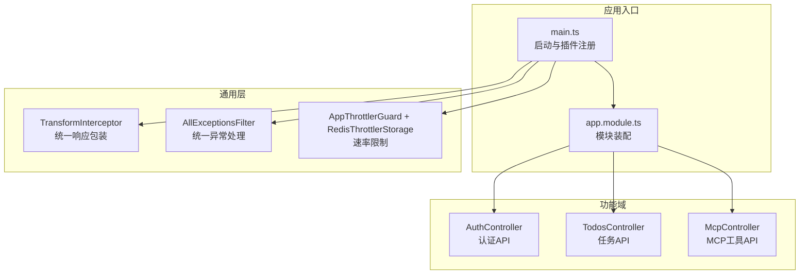
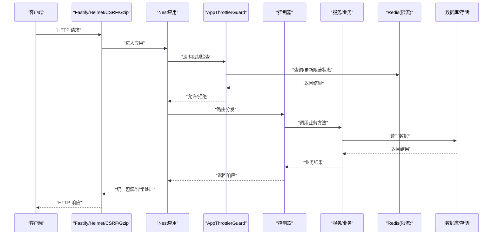
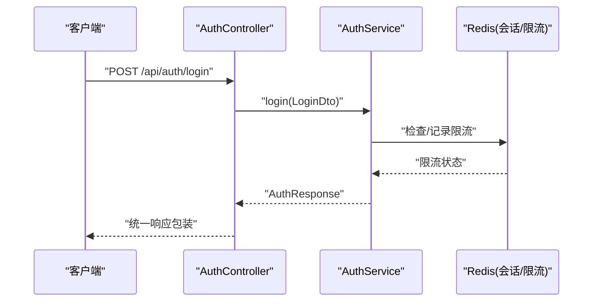
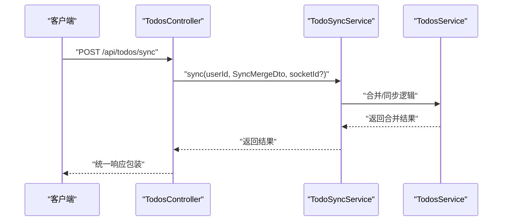
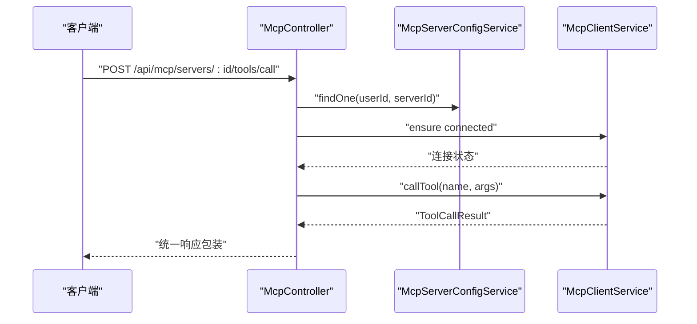
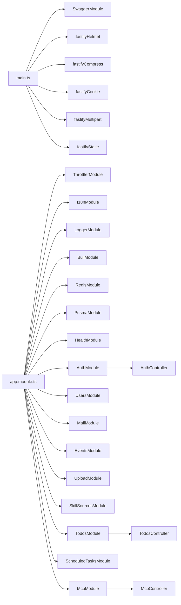

# API实现

<cite>
**本文引用的文件**
- [apps/backend/src/main.ts](file://apps/backend/src/main.ts)
- [apps/backend/src/app.module.ts](file://apps/backend/src/app.module.ts)
- [apps/backend/src/todos/todos.controller.ts](file://apps/backend/src/todos/todos.controller.ts)
- [apps/backend/src/todos/todos.dto.ts](file://apps/backend/src/todos/todos.dto.ts)
- [apps/backend/src/auth/auth.controller.ts](file://apps/backend/src/auth/auth.controller.ts)
- [apps/backend/src/auth/auth.dto.ts](file://apps/backend/src/auth/auth.dto.ts)
- [apps/backend/src/mcp/mcp.controller.ts](file://apps/backend/src/mcp/mcp.controller.ts)
- [apps/backend/src/mcp/mcp.dto.ts](file://apps/backend/src/mcp/mcp.dto.ts)
- [apps/backend/src/common/interceptors/transform.interceptor.ts](file://apps/backend/src/common/interceptors/transform.interceptor.ts)
- [apps/backend/src/common/filters/all-exceptions.filter.ts](file://apps/backend/src/common/filters/all-exceptions.filter.ts)
- [apps/backend/src/common/throttling/throttling.guard.ts](file://apps/backend/src/common/throttling/throttling.guard.ts)
- [apps/backend/src/common/throttling/redis-throttler.storage.ts](file://apps/backend/src/common/throttling/redis-throttler.storage.ts)
- [packages/shared/src/schemas/todo.schema.ts](file://packages/shared/src/schemas/todo.schema.ts)
- [packages/shared/src/schemas/auth.schema.ts](file://packages/shared/src/schemas/auth.schema.ts)
- [packages/shared/src/schemas/mcp.schema.ts](file://packages/shared/src/schemas/mcp.schema.ts)
</cite>

## 目录

1. [简介](#简介)
2. [项目结构](#项目结构)
3. [核心组件](#核心组件)
4. [架构总览](#架构总览)
5. [详细组件分析](#详细组件分析)
6. [依赖关系分析](#依赖关系分析)
7. [性能考虑](#性能考虑)
8. [故障排除指南](#故障排除指南)
9. [结论](#结论)
10. [附录](#附录)

## 简介

本文件面向 Lumina Todo API 的实现，系统性阐述 RESTful 设计原则与实现细节，覆盖控制器架构、路由定义、HTTP 状态码规范、DTO 设计与验证、错误处理、版本控制、文档生成、测试策略、性能优化、缓存与安全防护等主题。目标是帮助开发者与产品人员快速理解 API 的行为边界与最佳实践。

## 项目结构

后端采用 NestJS + Fastify 架构，通过模块化组织功能域，统一通过全局拦截器与异常过滤器保证响应一致性与错误可追踪性；Swagger 自动生成 OpenAPI 文档；Zod 作为统一的数据验证层；Redis 实现速率限制与缓存；Helmet、CSRF 校验与压缩等中间件保障安全与性能。

图表来源

- [apps/backend/src/main.ts:34-211](file://apps/backend/src/main.ts#L34-L211)
- [apps/backend/src/app.module.ts:28-159](file://apps/backend/src/app.module.ts#L28-L159)

章节来源

- [apps/backend/src/main.ts:34-211](file://apps/backend/src/main.ts#L34-L211)
- [apps/backend/src/app.module.ts:28-159](file://apps/backend/src/app.module.ts#L28-L159)

## 核心组件

- 控制器层：按领域划分模块控制器，统一使用 JWT 守卫保护受保护端点，Swagger 注解完善 API 文档。
- DTO 层：基于 Zod Schema 生成 DTO，自动对接 Swagger，提供强类型与可读性。
- 异常与响应：全局异常过滤器统一错误响应；全局响应拦截器统一成功响应包装。
- 速率限制：基于 Redis 的分布式限流，支持代理场景 IP 解析。
- 安全与性能：Helmet 安全头、CSRF 校验、Gzip 压缩、静态资源托管、CORS 配置。

章节来源

- [apps/backend/src/todos/todos.controller.ts:24-70](file://apps/backend/src/todos/todos.controller.ts#L24-L70)
- [apps/backend/src/auth/auth.controller.ts:17-81](file://apps/backend/src/auth/auth.controller.ts#L17-L81)
- [apps/backend/src/mcp/mcp.controller.ts:40-209](file://apps/backend/src/mcp/mcp.controller.ts#L40-L209)
- [apps/backend/src/common/interceptors/transform.interceptor.ts:18-30](file://apps/backend/src/common/interceptors/transform.interceptor.ts#L18-L30)
- [apps/backend/src/common/filters/all-exceptions.filter.ts:16-137](file://apps/backend/src/common/filters/all-exceptions.filter.ts#L16-L137)
- [apps/backend/src/common/throttling/throttling.guard.ts:28-34](file://apps/backend/src/common/throttling/throttling.guard.ts#L28-L34)
- [apps/backend/src/common/throttling/redis-throttler.storage.ts:106-173](file://apps/backend/src/common/throttling/redis-throttler.storage.ts#L106-L173)

## 架构总览

下图展示请求从接入到处理、验证、业务执行与响应的全链路：

图表来源

- [apps/backend/src/main.ts:34-211](file://apps/backend/src/main.ts#L34-L211)
- [apps/backend/src/common/throttling/throttling.guard.ts:28-34](file://apps/backend/src/common/throttling/throttling.guard.ts#L28-L34)
- [apps/backend/src/common/throttling/redis-throttler.storage.ts:106-173](file://apps/backend/src/common/throttling/redis-throttler.storage.ts#L106-L173)
- [apps/backend/src/common/interceptors/transform.interceptor.ts:18-30](file://apps/backend/src/common/interceptors/transform.interceptor.ts#L18-L30)
- [apps/backend/src/common/filters/all-exceptions.filter.ts:16-137](file://apps/backend/src/common/filters/all-exceptions.filter.ts#L16-L137)

## 详细组件分析

### 认证 API

- 路由与守卫
  - 路由前缀：/api/auth
  - 登录/注册/刷新/登出使用 Throttle 限制；受 JWT 守卫保护的 /me
- 请求参数与响应
  - 登录/注册：基于 Zod 的 LoginDto/RegisterDto，字段包含邮箱、密码等，自动映射到 Swagger
  - 刷新/登出：RefreshTokenDto/LogoutDto
  - 成功响应：统一包装，包含 accessToken、refreshToken、expiresIn、user
- 错误处理
  - Zod 验证错误映射为 400，结构化 errors 字段
  - 业务异常如重复邮箱、凭证无效等，映射到对应字段
- 安全特性
  - Helmet 安全头、CSRF 校验（非 GET/HEAD/OPTIONS）、Cookie 清理登出

图表来源

- [apps/backend/src/auth/auth.controller.ts:23-28](file://apps/backend/src/auth/auth.controller.ts#L23-L28)
- [apps/backend/src/auth/auth.dto.ts:15-20](file://apps/backend/src/auth/auth.dto.ts#L15-L20)
- [apps/backend/src/common/interceptors/transform.interceptor.ts:18-30](file://apps/backend/src/common/interceptors/transform.interceptor.ts#L18-L30)
- [apps/backend/src/common/filters/all-exceptions.filter.ts:52-87](file://apps/backend/src/common/filters/all-exceptions.filter.ts#L52-L87)

章节来源

- [apps/backend/src/auth/auth.controller.ts:17-81](file://apps/backend/src/auth/auth.controller.ts#L17-L81)
- [apps/backend/src/auth/auth.dto.ts:15-40](file://apps/backend/src/auth/auth.dto.ts#L15-L40)
- [packages/shared/src/schemas/auth.schema.ts:24-121](file://packages/shared/src/schemas/auth.schema.ts#L24-L121)

### 任务管理 API

- 路由与守卫
  - 路由前缀：/api/todos
  - 全部端点使用 JWT 守卫与 Bearer 认证
- 主要端点
  - POST /sync：离线优先的同步合并，接收 SyncMergeDto
  - GET /：获取当前用户全部任务
  - GET /trash：回收站
  - POST /:id/restore：恢复
  - DELETE /:id/permanent：永久删除
  - DELETE /trash/clear：清空回收站
- 请求参数与响应
  - SyncMergeDto 基于共享 Zod Schema，支持 todos 数组与 lastSyncAt 时间
  - 成功响应统一包装
- 错误处理
  - Zod 验证错误 400，业务错误映射字段

图表来源

- [apps/backend/src/todos/todos.controller.ts:30-38](file://apps/backend/src/todos/todos.controller.ts#L30-L38)
- [apps/backend/src/todos/todos.dto.ts:4](file://apps/backend/src/todos/todos.dto.ts#L4)
- [packages/shared/src/schemas/todo.schema.ts:40-68](file://packages/shared/src/schemas/todo.schema.ts#L40-L68)

章节来源

- [apps/backend/src/todos/todos.controller.ts:24-70](file://apps/backend/src/todos/todos.controller.ts#L24-L70)
- [apps/backend/src/todos/todos.dto.ts:4](file://apps/backend/src/todos/todos.dto.ts#L4)
- [packages/shared/src/schemas/todo.schema.ts:8-76](file://packages/shared/src/schemas/todo.schema.ts#L8-L76)

### MCP 工具 API

- 路由与守卫
  - 路由前缀：/api/mcp
  - 全部端点使用 JWT 守卫与 Bearer 认证
- 主要端点
  - 服务器配置：POST/GET/GET(单个)/PUT/DELETE /servers
  - 连接/断开：POST /servers/:id/connect, POST /servers/:id/disconnect
  - 工具发现：GET /tools, GET /servers/:id/tools
  - 工具调用：POST /servers/:id/tools/call
- 请求参数与响应
  - CreateMcpServerDto/UpdateMcpServerDto/CallToolDto 基于共享 Zod Schema
  - 工具调用返回 ToolCallResult，包含内容数组与可选错误标记
- 错误处理
  - Zod 验证错误 400；连接/权限问题抛出业务异常并映射字段
- 性能与安全
  - 工具发现与调用设置独立 Throttle；HTTP URL 仅允许公网地址；STDIO 命令参数校验

图表来源

- [apps/backend/src/mcp/mcp.controller.ts:193-207](file://apps/backend/src/mcp/mcp.controller.ts#L193-L207)
- [apps/backend/src/mcp/mcp.dto.ts:22-32](file://apps/backend/src/mcp/mcp.dto.ts#L22-L32)
- [packages/shared/src/schemas/mcp.schema.ts:177-220](file://packages/shared/src/schemas/mcp.schema.ts#L177-L220)

章节来源

- [apps/backend/src/mcp/mcp.controller.ts:40-209](file://apps/backend/src/mcp/mcp.controller.ts#L40-L209)
- [apps/backend/src/mcp/mcp.dto.ts:22-59](file://apps/backend/src/mcp/mcp.dto.ts#L22-L59)
- [packages/shared/src/schemas/mcp.schema.ts:123-220](file://packages/shared/src/schemas/mcp.schema.ts#L123-L220)

### DTO 设计与数据验证

- 设计原则
  - 所有 DTO 基于 Zod Schema，使用 createZodDto 包装，自动生成 Swagger 文档
  - 字段约束明确（长度、枚举、日期、URL、私有网络限制等）
- 验证规则示例
  - 认证：邮箱格式、密码长度、用户名长度
  - 任务：标题长度、递归规则枚举、日期/字符串兼容
  - MCP：HTTP URL 白名单（仅公网）、STDIO 命令必填、传输与配置一致性校验
- 输入输出转换
  - 控制器接收 DTO，服务层处理业务，响应统一包装
  - 特殊类型（如日期）在后端 DTO 中显式为 Date 类型，便于序列化

章节来源

- [apps/backend/src/auth/auth.dto.ts:15-40](file://apps/backend/src/auth/auth.dto.ts#L15-L40)
- [apps/backend/src/todos/todos.dto.ts:4](file://apps/backend/src/todos/todos.dto.ts#L4)
- [apps/backend/src/mcp/mcp.dto.ts:22-32](file://apps/backend/src/mcp/mcp.dto.ts#L22-L32)
- [packages/shared/src/schemas/auth.schema.ts:24-121](file://packages/shared/src/schemas/auth.schema.ts#L24-L121)
- [packages/shared/src/schemas/todo.schema.ts:8-76](file://packages/shared/src/schemas/todo.schema.ts#L8-L76)
- [packages/shared/src/schemas/mcp.schema.ts:123-220](file://packages/shared/src/schemas/mcp.schema.ts#L123-L220)

### HTTP 状态码与响应规范

- 统一响应
  - 成功：success=true，data=实际数据，timestamp=ISO 时间
- 错误响应
  - success=false，data=null，message=错误消息，errors=结构化字段错误，statusCode=HTTP 状态码，timestamp=ISO 时间
- 状态码策略
  - 验证错误：400
  - 未授权/令牌无效：401
  - 禁止访问：403
  - 资源冲突/业务异常：409
  - 未找到：404
  - 服务器内部错误：500
- Swagger 文档
  - 使用 DocumentBuilder 配置标题、描述、版本与 Bearer 认证，生成 /api/docs

章节来源

- [apps/backend/src/common/interceptors/transform.interceptor.ts:18-30](file://apps/backend/src/common/interceptors/transform.interceptor.ts#L18-L30)
- [apps/backend/src/common/filters/all-exceptions.filter.ts:16-137](file://apps/backend/src/common/filters/all-exceptions.filter.ts#L16-L137)
- [apps/backend/src/main.ts:181-191](file://apps/backend/src/main.ts#L181-L191)

### API 版本控制与文档生成

- 版本控制
  - 应用版本来自 package.json，注入到 Swagger 文档版本字段
- 文档生成
  - SwaggerModule.createDocument + cleanupOpenApiDoc 输出 OpenAPI
  - 文档访问：/api/docs
- 语言与本地化
  - I18n 支持错误消息与字段名的多语言渲染

章节来源

- [apps/backend/src/main.ts:45-46](file://apps/backend/src/main.ts#L45-L46)
- [apps/backend/src/main.ts:181-191](file://apps/backend/src/main.ts#L181-L191)

### 测试策略

- 单元测试
  - 各模块提供 service/spec 文件，覆盖核心业务逻辑与边界条件
- 端到端测试
  - e2e 目录包含 auth.e2e.spec 与 todos.e2e.spec，验证完整流程
- 建议
  - 为控制器新增端点补充 e2e 测试；为 DTO 增加边界值与非法输入测试

章节来源

- [apps/backend/tests/e2e/auth.e2e.spec.ts](file://apps/backend/tests/e2e/auth.e2e.spec.ts)
- [apps/backend/tests/e2e/todos.e2e.spec.ts](file://apps/backend/tests/e2e/todos.e2e.spec.ts)

## 依赖关系分析

图表来源

- [apps/backend/src/main.ts:34-211](file://apps/backend/src/main.ts#L34-L211)
- [apps/backend/src/app.module.ts:28-159](file://apps/backend/src/app.module.ts#L28-L159)

章节来源

- [apps/backend/src/main.ts:34-211](file://apps/backend/src/main.ts#L34-L211)
- [apps/backend/src/app.module.ts:28-159](file://apps/backend/src/app.module.ts#L28-L159)

## 性能考虑

- 压缩与静态资源
  - Gzip 压缩阈值与 zlib 选项优化传输体积
  - 静态资源托管 /api/public/ 与 /public/，减少不必要的后端处理
- 速率限制
  - Redis 分布式限流，Lua 脚本原子计数与封禁，支持代理场景 IP 解析
- 缓存策略
  - Redis 模块与装饰器可用于热点数据缓存（建议在具体服务中落地）
- 并发与队列
  - BullMQ 后台任务队列默认配置，适合定时任务与异步处理
- 数据库与序列化
  - Prisma 模块提供 ORM 能力，建议配合索引与查询优化

章节来源

- [apps/backend/src/main.ts:111-123](file://apps/backend/src/main.ts#L111-L123)
- [apps/backend/src/common/throttling/redis-throttler.storage.ts:106-173](file://apps/backend/src/common/throttling/redis-throttler.storage.ts#L106-L173)
- [apps/backend/src/app.module.ts:97-116](file://apps/backend/src/app.module.ts#L97-L116)

## 故障排除指南

- 统一错误响应
  - 所有异常经 AllExceptionsFilter 标准化输出，包含 message、errors、statusCode、timestamp
- Zod 验证错误
  - 自动映射字段路径与 i18n 翻译，errors 为结构化对象
- CSRF 防护
  - 非安全方法若缺少 X-Requested-With 头，直接返回 403
- 速率限制
  - 若 Redis 不可用，自动降级为内存存储并记录告警
- 日志与可观测性
  - Pino 日志器按状态码调整级别，自定义成功/错误消息格式

章节来源

- [apps/backend/src/common/filters/all-exceptions.filter.ts:16-137](file://apps/backend/src/common/filters/all-exceptions.filter.ts#L16-L137)
- [apps/backend/src/main.ts:125-167](file://apps/backend/src/main.ts#L125-L167)
- [apps/backend/src/common/throttling/redis-throttler.storage.ts:106-173](file://apps/backend/src/common/throttling/redis-throttler.storage.ts#L106-L173)
- [apps/backend/src/app.module.ts:35-89](file://apps/backend/src/app.module.ts#L35-L89)

## 结论

本实现以 NestJS 为核心，结合 Zod 验证、Swagger 文档、统一响应与异常处理、速率限制与安全中间件，构建了高一致性、可维护、可扩展的 RESTful API。通过共享 Schema 与 DTO，确保前后端契约清晰；通过 E2E 与单元测试覆盖关键路径；通过压缩、静态资源与队列优化性能。建议后续在服务层引入缓存装饰器与更细粒度的监控埋点，持续提升稳定性与可观测性。

## 附录

### API 端点一览（按模块）

- 认证
  - POST /api/auth/login
  - POST /api/auth/register
  - POST /api/auth/refresh
  - GET /api/auth/me
  - POST /api/auth/logout
- 任务
  - POST /api/todos/sync
  - GET /api/todos
  - GET /api/todos/trash
  - POST /api/todos/:id/restore
  - DELETE /api/todos/:id/permanent
  - DELETE /api/todos/trash/clear
- MCP
  - POST /api/mcp/servers
  - GET /api/mcp/servers
  - GET /api/mcp/servers/:id
  - PUT /api/mcp/servers/:id
  - DELETE /api/mcp/servers/:id
  - GET /api/mcp/tools
  - POST /api/mcp/servers/:id/connect
  - POST /api/mcp/servers/:id/disconnect
  - GET /api/mcp/servers/:id/tools
  - POST /api/mcp/servers/:id/tools/call

章节来源

- [apps/backend/src/auth/auth.controller.ts:23-81](file://apps/backend/src/auth/auth.controller.ts#L23-L81)
- [apps/backend/src/todos/todos.controller.ts:30-68](file://apps/backend/src/todos/todos.controller.ts#L30-L68)
- [apps/backend/src/mcp/mcp.controller.ts:51-207](file://apps/backend/src/mcp/mcp.controller.ts#L51-L207)
