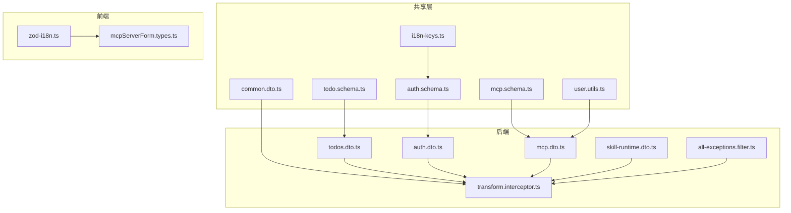
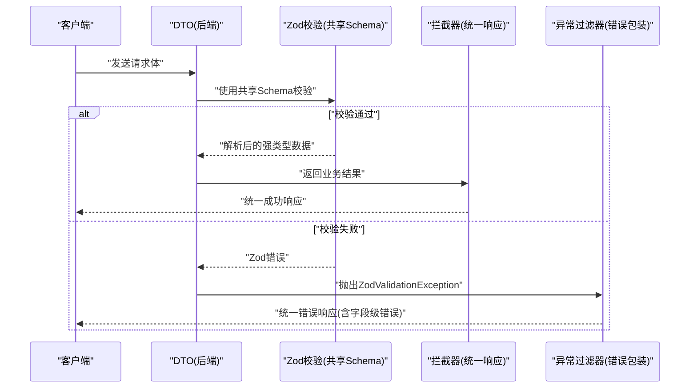
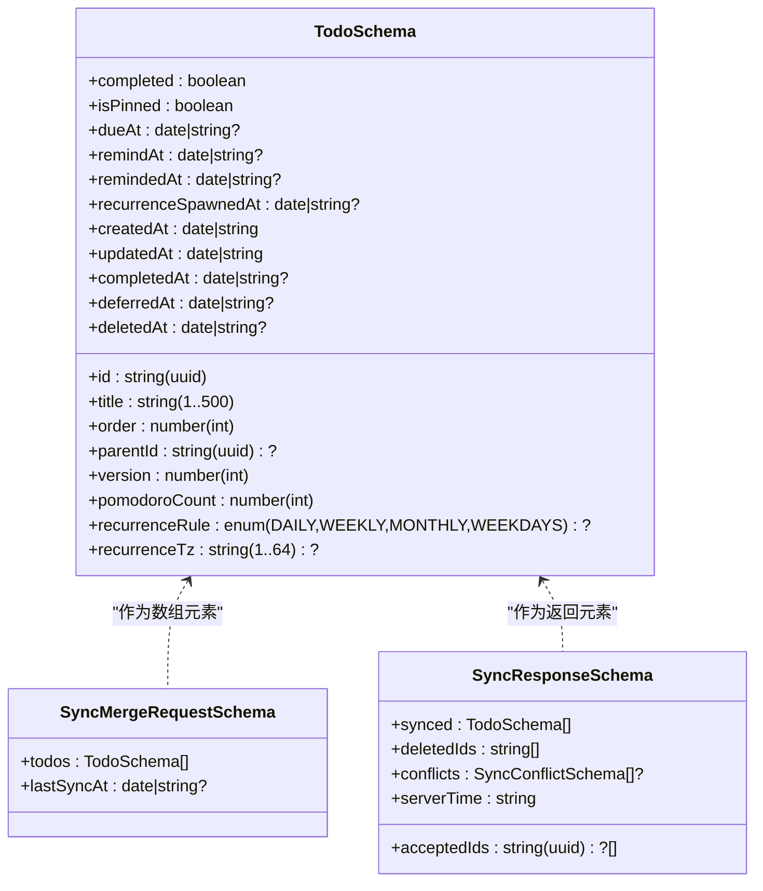
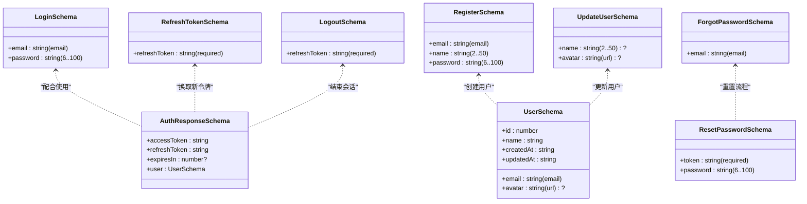
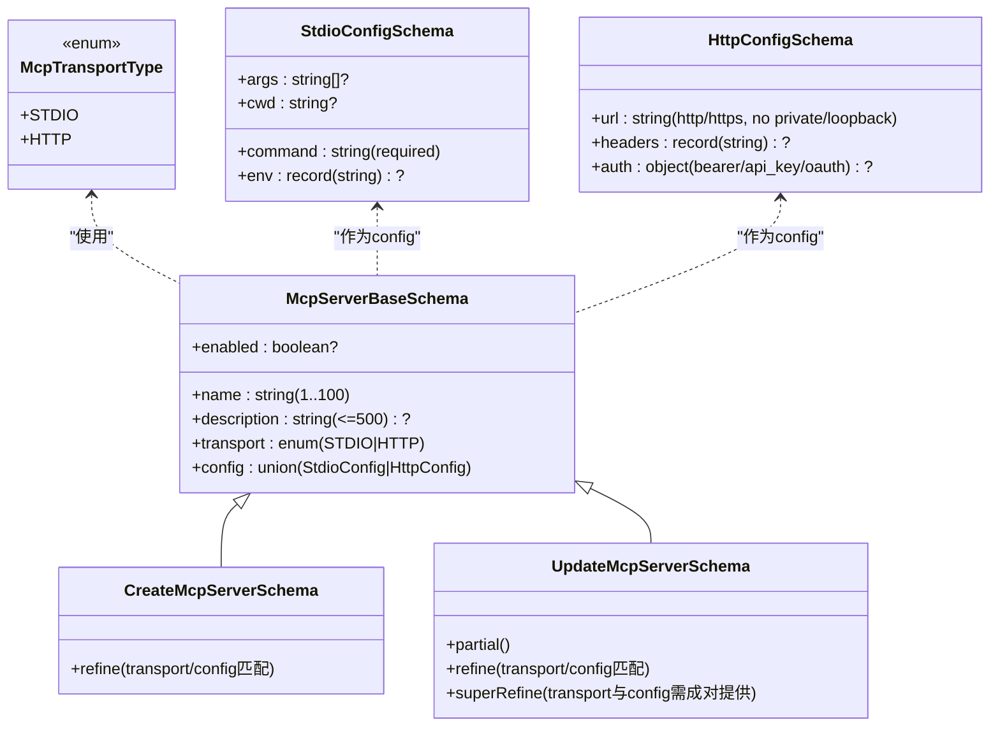
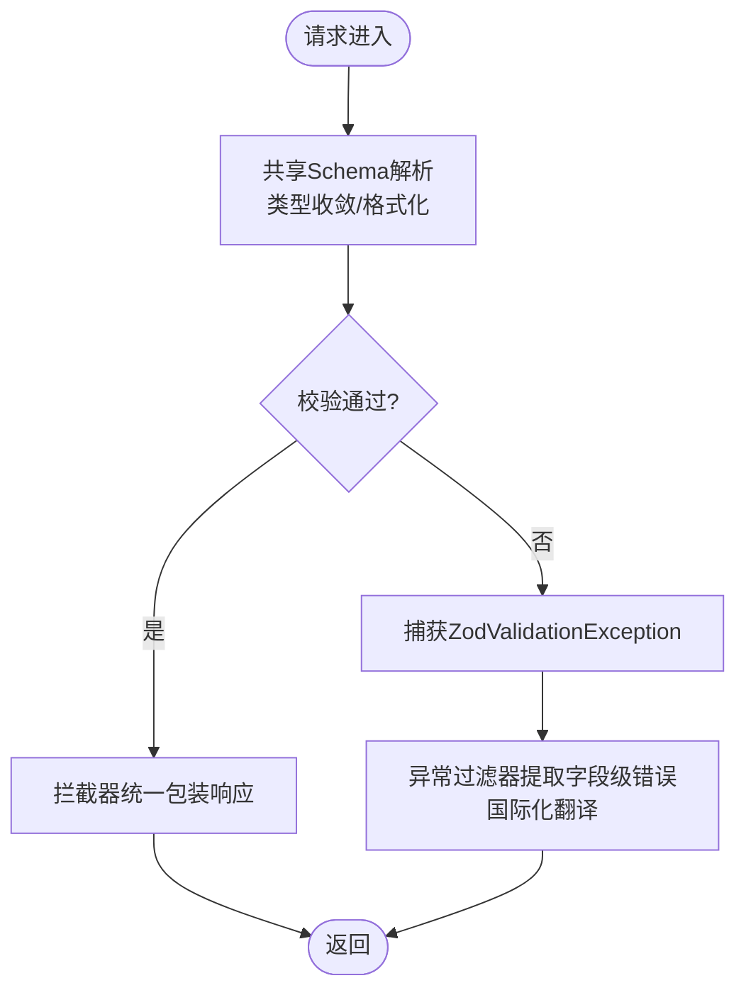
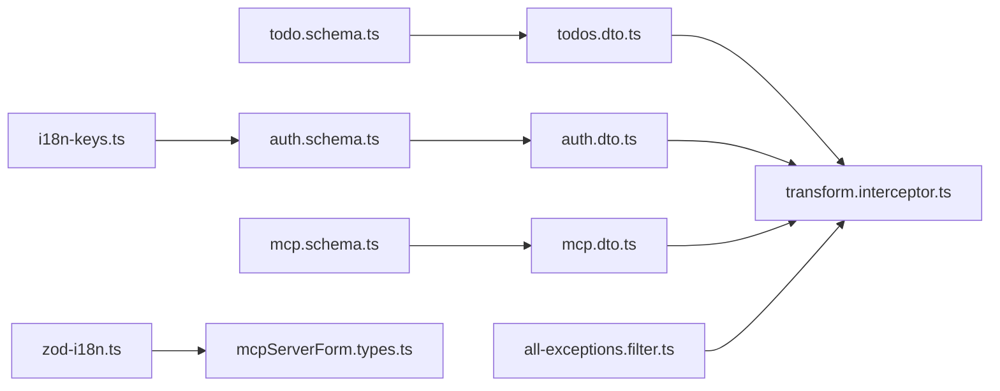

# DTO数据验证

<cite>
**本文引用的文件**
- [packages/shared/src/schemas/todo.schema.ts](file://packages/shared/src/schemas/todo.schema.ts)
- [packages/shared/src/schemas/auth.schema.ts](file://packages/shared/src/schemas/auth.schema.ts)
- [packages/shared/src/schemas/mcp.schema.ts](file://packages/shared/src/schemas/mcp.schema.ts)
- [packages/shared/src/schemas/i18n-keys.ts](file://packages/shared/src/schemas/i18n-keys.ts)
- [packages/shared/src/dto/common.dto.ts](file://packages/shared/src/dto/common.dto.ts)
- [apps/backend/src/todos/todos.dto.ts](file://apps/backend/src/todos/todos.dto.ts)
- [apps/backend/src/auth/auth.dto.ts](file://apps/backend/src/auth/auth.dto.ts)
- [apps/backend/src/mcp/mcp.dto.ts](file://apps/backend/src/mcp/mcp.dto.ts)
- [apps/backend/src/skill-sources/skill-runtime.dto.ts](file://apps/backend/src/skill-sources/skill-runtime.dto.ts)
- [apps/backend/src/common/interceptors/transform.interceptor.ts](file://apps/backend/src/common/interceptors/transform.interceptor.ts)
- [apps/backend/src/common/filters/all-exceptions.filter.ts](file://apps/backend/src/common/filters/all-exceptions.filter.ts)
- [apps/frontend/src/lib/zod-i18n.ts](file://apps/frontend/src/lib/zod-i18n.ts)
- [apps/frontend/src/features/mcp/components/mcpServerForm.types.ts](file://apps/frontend/src/features/mcp/components/mcpServerForm.types.ts)
- [packages/shared/src/utils/user.utils.ts](file://packages/shared/src/utils/user.utils.ts)
- [packages/shared/src/schemas/todo.schema.spec.ts](file://packages/shared/src/schemas/todo.schema.spec.ts)
- [packages/shared/src/schemas/mcp.schema.spec.ts](file://packages/shared/src/schemas/mcp.schema.spec.ts)
</cite>

## 目录

1. [简介](#简介)
2. [项目结构](#项目结构)
3. [核心组件](#核心组件)
4. [架构总览](#架构总览)
5. [详细组件分析](#详细组件分析)
6. [依赖关系分析](#依赖关系分析)
7. [性能考量](#性能考量)
8. [故障排查指南](#故障排查指南)
9. [结论](#结论)
10. [附录](#附录)

## 简介

本文件系统性梳理 Lumina Todo 的 DTO 数据验证体系，围绕以下目标展开：

- 解释数据传输对象（DTO）的设计原则与实现方式，涵盖 Zod 验证器、TypeScript 类型定义与数据转换机制。
- 深入说明三大模块的 DTO 结构：任务管理 DTO、用户认证 DTO、MCP 配置 DTO 的字段定义、验证规则与约束条件。
- 阐述输入数据的预处理、类型转换与错误处理策略。
- 解释共享 Schema 的设计理念、跨模块数据一致性与版本兼容性处理。
- 提供 DTO 设计最佳实践、性能优化与调试技巧。

## 项目结构

本项目采用“共享 Schema + NestJS DTO 包装 + 前端 Zod 国际化”的分层验证架构：

- 共享层（packages/shared）：集中定义 Zod Schema 与 TypeScript 类型，确保前后端一致的验证规则与类型契约。
- 后端层（apps/backend）：使用 nestjs-zod 将共享 Schema 包装为 DTO，结合拦截器与异常过滤器统一响应与错误输出。
- 前端层（apps/frontend）：在本地 Zod 实例上应用国际化错误映射，提升用户体验与可维护性。

图表来源

- [packages/shared/src/schemas/todo.schema.ts:1-76](file://packages/shared/src/schemas/todo.schema.ts#L1-L76)
- [packages/shared/src/schemas/auth.schema.ts:1-121](file://packages/shared/src/schemas/auth.schema.ts#L1-L121)
- [packages/shared/src/schemas/mcp.schema.ts:1-220](file://packages/shared/src/schemas/mcp.schema.ts#L1-L220)
- [packages/shared/src/schemas/i18n-keys.ts:1-13](file://packages/shared/src/schemas/i18n-keys.ts#L1-L13)
- [packages/shared/src/dto/common.dto.ts:1-81](file://packages/shared/src/dto/common.dto.ts#L1-L81)
- [packages/shared/src/utils/user.utils.ts:1-36](file://packages/shared/src/utils/user.utils.ts#L1-L36)
- [apps/backend/src/todos/todos.dto.ts:1-5](file://apps/backend/src/todos/todos.dto.ts#L1-L5)
- [apps/backend/src/auth/auth.dto.ts:1-41](file://apps/backend/src/auth/auth.dto.ts#L1-L41)
- [apps/backend/src/mcp/mcp.dto.ts:1-59](file://apps/backend/src/mcp/mcp.dto.ts#L1-L59)
- [apps/backend/src/skill-sources/skill-runtime.dto.ts:1-98](file://apps/backend/src/skill-sources/skill-runtime.dto.ts#L1-L98)
- [apps/backend/src/common/interceptors/transform.interceptor.ts:1-30](file://apps/backend/src/common/interceptors/transform.interceptor.ts#L1-L30)
- [apps/backend/src/common/filters/all-exceptions.filter.ts:1-137](file://apps/backend/src/common/filters/all-exceptions.filter.ts#L1-L137)
- [apps/frontend/src/lib/zod-i18n.ts:1-96](file://apps/frontend/src/lib/zod-i18n.ts#L1-L96)
- [apps/frontend/src/features/mcp/components/mcpServerForm.types.ts:1-25](file://apps/frontend/src/features/mcp/components/mcpServerForm.types.ts#L1-L25)

章节来源

- [packages/shared/src/schemas/todo.schema.ts:1-76](file://packages/shared/src/schemas/todo.schema.ts#L1-L76)
- [packages/shared/src/schemas/auth.schema.ts:1-121](file://packages/shared/src/schemas/auth.schema.ts#L1-L121)
- [packages/shared/src/schemas/mcp.schema.ts:1-220](file://packages/shared/src/schemas/mcp.schema.ts#L1-L220)
- [apps/backend/src/todos/todos.dto.ts:1-5](file://apps/backend/src/todos/todos.dto.ts#L1-L5)
- [apps/backend/src/auth/auth.dto.ts:1-41](file://apps/backend/src/auth/auth.dto.ts#L1-L41)
- [apps/backend/src/mcp/mcp.dto.ts:1-59](file://apps/backend/src/mcp/mcp.dto.ts#L1-L59)
- [apps/backend/src/skill-sources/skill-runtime.dto.ts:1-98](file://apps/backend/src/skill-sources/skill-runtime.dto.ts#L1-L98)
- [apps/backend/src/common/interceptors/transform.interceptor.ts:1-30](file://apps/backend/src/common/interceptors/transform.interceptor.ts#L1-L30)
- [apps/backend/src/common/filters/all-exceptions.filter.ts:1-137](file://apps/backend/src/common/filters/all-exceptions.filter.ts#L1-L137)
- [apps/frontend/src/lib/zod-i18n.ts:1-96](file://apps/frontend/src/lib/zod-i18n.ts#L1-L96)
- [apps/frontend/src/features/mcp/components/mcpServerForm.types.ts:1-25](file://apps/frontend/src/features/mcp/components/mcpServerForm.types.ts#L1-L25)
- [packages/shared/src/dto/common.dto.ts:1-81](file://packages/shared/src/dto/common.dto.ts#L1-L81)
- [packages/shared/src/utils/user.utils.ts:1-36](file://packages/shared/src/utils/user.utils.ts#L1-L36)

## 核心组件

- 共享 Schema 层：统一定义字段约束、枚举与复杂校验逻辑，确保前后端一致。
- DTO 包装层：基于 nestjs-zod 将 Schema 转换为 Nest DTO，自动支持 Swagger 文档生成。
- 响应与错误处理：统一响应包装与 Zod 错误国际化，提升可观测性与用户体验。
- 前端 Zod 国际化：在客户端应用统一的错误映射，增强本地化体验。

章节来源

- [packages/shared/src/schemas/todo.schema.ts:1-76](file://packages/shared/src/schemas/todo.schema.ts#L1-L76)
- [packages/shared/src/schemas/auth.schema.ts:1-121](file://packages/shared/src/schemas/auth.schema.ts#L1-L121)
- [packages/shared/src/schemas/mcp.schema.ts:1-220](file://packages/shared/src/schemas/mcp.schema.ts#L1-L220)
- [apps/backend/src/todos/todos.dto.ts:1-5](file://apps/backend/src/todos/todos.dto.ts#L1-L5)
- [apps/backend/src/auth/auth.dto.ts:1-41](file://apps/backend/src/auth/auth.dto.ts#L1-L41)
- [apps/backend/src/mcp/mcp.dto.ts:1-59](file://apps/backend/src/mcp/mcp.dto.ts#L1-L59)
- [apps/backend/src/common/interceptors/transform.interceptor.ts:1-30](file://apps/backend/src/common/interceptors/transform.interceptor.ts#L1-L30)
- [apps/backend/src/common/filters/all-exceptions.filter.ts:1-137](file://apps/backend/src/common/filters/all-exceptions.filter.ts#L1-L137)
- [apps/frontend/src/lib/zod-i18n.ts:1-96](file://apps/frontend/src/lib/zod-i18n.ts#L1-L96)

## 架构总览

下图展示从请求进入后端到响应返回的完整流程，包括 DTO 校验、拦截器包装与异常过滤器处理。

图表来源

- [apps/backend/src/todos/todos.dto.ts:1-5](file://apps/backend/src/todos/todos.dto.ts#L1-L5)
- [apps/backend/src/auth/auth.dto.ts:1-41](file://apps/backend/src/auth/auth.dto.ts#L1-L41)
- [apps/backend/src/mcp/mcp.dto.ts:1-59](file://apps/backend/src/mcp/mcp.dto.ts#L1-L59)
- [apps/backend/src/common/interceptors/transform.interceptor.ts:1-30](file://apps/backend/src/common/interceptors/transform.interceptor.ts#L1-L30)
- [apps/backend/src/common/filters/all-exceptions.filter.ts:1-137](file://apps/backend/src/common/filters/all-exceptions.filter.ts#L1-L137)

## 详细组件分析

### 任务管理 DTO

- 设计要点
  - 使用共享 Todo Schema 定义字段范围与约束，如 UUID 标识、布尔状态、整数排序与版本号、日期字段支持字符串或 Date 对象等。
  - 支持递归规则枚举与时区约束，以及延期、完成、删除等生命周期字段。
  - 同步相关：定义同步项、批量合并请求与冲突类型，确保服务端与客户端对齐。
- 关键字段与规则
  - 标识与元数据：id（UUID）、version（整数，默认 0）、order（整数，默认 0）、isPinned（布尔，默认 false）。
  - 时间与提醒：dueAt/remindAt/created/updated 等支持字符串或 Date；recurrenceRule 限定枚举值；recurrenceTz 限制长度。
  - 生命周期：completed/completedAt、deferredAt、deletedAt 等可空字段。
  - 同步：SyncMergeRequest 支持 lastSyncAt 的字符串或日期；SyncResponse 返回已同步、删除 ID、冲突等。
- 类型与转换
  - 通过 createZodDto 包装共享 Schema，自动获得强类型输入与 Swagger 文档。
  - 前端可复用相同 Schema 进行本地校验与国际化提示。

图表来源

- [packages/shared/src/schemas/todo.schema.ts:8-28](file://packages/shared/src/schemas/todo.schema.ts#L8-L28)
- [packages/shared/src/schemas/todo.schema.ts:40-51](file://packages/shared/src/schemas/todo.schema.ts#L40-L51)
- [packages/shared/src/schemas/todo.schema.ts:62-68](file://packages/shared/src/schemas/todo.schema.ts#L62-L68)

章节来源

- [packages/shared/src/schemas/todo.schema.ts:1-76](file://packages/shared/src/schemas/todo.schema.ts#L1-L76)
- [apps/backend/src/todos/todos.dto.ts:1-5](file://apps/backend/src/todos/todos.dto.ts#L1-L5)
- [packages/shared/src/schemas/todo.schema.spec.ts:1-57](file://packages/shared/src/schemas/todo.schema.spec.ts#L1-L57)

### 用户认证 DTO

- 设计要点
  - 共享邮箱与密码基础规则，注册与登录分别组合不同字段集。
  - 支持更新用户信息（名称、头像 URL）与认证响应（访问令牌、刷新令牌、用户信息）。
  - 刷新、登出、找回密码与重置密码均有独立 DTO。
- 关键字段与规则
  - 邮箱：必填、小写、去除空白；密码：6-100 字符。
  - 用户信息：id、email、name、avatar（可空 URL）。
  - 认证响应：accessToken、refreshToken、可选过期时间、user。
- 类型与转换
  - 通过 createZodDto 包装共享 Schema，自动获得强类型输入与 Swagger 文档。
  - 前端可复用相同 Schema 进行本地校验与国际化提示。

图表来源

- [packages/shared/src/schemas/auth.schema.ts:25-41](file://packages/shared/src/schemas/auth.schema.ts#L25-L41)
- [packages/shared/src/schemas/auth.schema.ts:59-77](file://packages/shared/src/schemas/auth.schema.ts#L59-L77)
- [packages/shared/src/schemas/auth.schema.ts:82-110](file://packages/shared/src/schemas/auth.schema.ts#L82-L110)

章节来源

- [packages/shared/src/schemas/auth.schema.ts:1-121](file://packages/shared/src/schemas/auth.schema.ts#L1-L121)
- [apps/backend/src/auth/auth.dto.ts:1-41](file://apps/backend/src/auth/auth.dto.ts#L1-L41)
- [packages/shared/src/schemas/i18n-keys.ts:1-13](file://packages/shared/src/schemas/i18n-keys.ts#L1-L13)

### MCP 配置 DTO

- 设计要点
  - 传输类型枚举（STDIO/HTTP），并针对每种类型提供专用配置 Schema。
  - HTTP 配置支持 URL 校验与私有/环回地址阻断，OAuth/Bearer/API-Key 认证模式。
  - 创建与更新 DTO 采用 refine 与 superRefine 实现“传输类型与配置必须匹配”及运行时配置更新的完整性约束。
- 关键字段与规则
  - 基础：name（1-100）、description（≤500）、transport（枚举）、enabled（布尔，默认 true）。
  - STDIO：command（必填）、args（数组）、env（键值）、cwd（可选）。
  - HTTP：url（http/https，且不允许私有/环回主机）、headers（可选）、auth（可选，支持 bearer/api_key/oauth）。
  - 更新约束：当更新运行时配置时，transport 与 config 必须同时提供，否则报错。
- 类型与转换
  - 后端 DTO 通过 createZodDto 包装共享 Schema，并对响应类型做 Date 扩展以适配 Prisma。
  - 前端表单类型与后端 DTO 字段保持一致，便于双向校验与交互。

图表来源

- [packages/shared/src/schemas/mcp.schema.ts:6-11](file://packages/shared/src/schemas/mcp.schema.ts#L6-L11)
- [packages/shared/src/schemas/mcp.schema.ts:79-84](file://packages/shared/src/schemas/mcp.schema.ts#L79-L84)
- [packages/shared/src/schemas/mcp.schema.ts:101-116](file://packages/shared/src/schemas/mcp.schema.ts#L101-L116)
- [packages/shared/src/schemas/mcp.schema.ts:123-130](file://packages/shared/src/schemas/mcp.schema.ts#L123-L130)
- [packages/shared/src/schemas/mcp.schema.ts:148-161](file://packages/shared/src/schemas/mcp.schema.ts#L148-L161)

章节来源

- [packages/shared/src/schemas/mcp.schema.ts:1-220](file://packages/shared/src/schemas/mcp.schema.ts#L1-L220)
- [apps/backend/src/mcp/mcp.dto.ts:1-59](file://apps/backend/src/mcp/mcp.dto.ts#L1-L59)
- [apps/frontend/src/features/mcp/components/mcpServerForm.types.ts:1-25](file://apps/frontend/src/features/mcp/components/mcpServerForm.types.ts#L1-L25)
- [packages/shared/src/schemas/mcp.schema.spec.ts:1-67](file://packages/shared/src/schemas/mcp.schema.spec.ts#L1-L67)

### 技能运行时 DTO（扩展）

- 设计要点
  - 支持模板值绑定（$source: arg|secret），允许在运行时注入参数或密钥。
  - HTTP 技能运行时请求包含 URL、方法、头部、查询、请求体、超时与响应类型等字段。
  - 通过严格模式（strict）与深度递归（lazy）确保复杂嵌套结构的可验证性。
- 关键字段与规则
  - 模板值：字符串、数字、布尔、null、绑定对象、数组与对象字典，均有限制。
  - HTTP 请求：URL 必填且合法，方法枚举，超时毫秒数范围，响应类型枚举。
- 类型与转换
  - 通过 createZodDto 包装，自动获得强类型输入与 Swagger 文档。

章节来源

- [apps/backend/src/skill-sources/skill-runtime.dto.ts:1-98](file://apps/backend/src/skill-sources/skill-runtime.dto.ts#L1-L98)

### 输入预处理、类型转换与错误处理策略

- 输入预处理
  - 共享 Schema 在解析阶段即完成类型收敛与格式化（如邮箱小写、去除空白、URL 合法性、枚举约束等）。
  - MCP HTTP URL 校验与私有/环回地址阻断，避免内网暴露风险。
- 类型转换
  - Todo 日期字段支持字符串或 Date，便于跨语言传输；后端响应中可由拦截器统一包装。
  - 用户信息在导出前由工具函数将 Date 转为 ISO 字符串，保证前后端一致。
- 错误处理
  - 全局异常过滤器识别 Zod 验证异常，提取字段路径与参数，进行国际化翻译并返回结构化错误对象。
  - 响应拦截器统一将成功响应包装为标准格式，包含 success、data、timestamp。

图表来源

- [apps/backend/src/common/filters/all-exceptions.filter.ts:52-86](file://apps/backend/src/common/filters/all-exceptions.filter.ts#L52-L86)
- [apps/backend/src/common/interceptors/transform.interceptor.ts:20-28](file://apps/backend/src/common/interceptors/transform.interceptor.ts#L20-L28)
- [packages/shared/src/utils/user.utils.ts:19-28](file://packages/shared/src/utils/user.utils.ts#L19-L28)

章节来源

- [apps/backend/src/common/filters/all-exceptions.filter.ts:1-137](file://apps/backend/src/common/filters/all-exceptions.filter.ts#L1-L137)
- [apps/backend/src/common/interceptors/transform.interceptor.ts:1-30](file://apps/backend/src/common/interceptors/transform.interceptor.ts#L1-L30)
- [packages/shared/src/utils/user.utils.ts:1-36](file://packages/shared/src/utils/user.utils.ts#L1-L36)

### 共享 Schema 的设计思想、一致性与版本兼容

- 设计思想
  - 将验证规则与类型定义集中在共享包，避免重复与漂移，确保前端、后端与测试用例的一致性。
  - 使用 refine/superRefine 实现跨字段约束（如 MCP 传输与配置必须匹配、更新时需成对提供）。
- 一致性保证
  - 前端通过本地 Zod 实例应用相同的错误映射，保证错误文案与后端一致。
  - 国际化键名集中管理，前后端共享验证消息键。
- 版本兼容
  - Todo 的 version 字段与同步冲突类型（如 VERSION_CONFLICT）为未来版本演进预留空间。
  - 建议新增字段时保持向后兼容，避免破坏既有客户端行为。

章节来源

- [packages/shared/src/schemas/todo.schema.ts:10-28](file://packages/shared/src/schemas/todo.schema.ts#L10-L28)
- [packages/shared/src/schemas/mcp.schema.ts:148-172](file://packages/shared/src/schemas/mcp.schema.ts#L148-L172)
- [packages/shared/src/schemas/i18n-keys.ts:1-13](file://packages/shared/src/schemas/i18n-keys.ts#L1-L13)
- [apps/frontend/src/lib/zod-i18n.ts:18-95](file://apps/frontend/src/lib/zod-i18n.ts#L18-L95)

## 依赖关系分析

- 模块耦合
  - 后端 DTO 仅依赖共享 Schema，降低耦合度，便于独立演进。
  - 异常过滤器与拦截器作为横切关注点，被所有控制器复用。
- 外部依赖
  - nestjs-zod：将 Zod Schema 转换为 Nest DTO 并生成 Swagger 文档。
  - Zod：强大的运行时类型检查与错误收集能力。
  - I18n：统一错误文案与字段名的本地化。

图表来源

- [packages/shared/src/schemas/todo.schema.ts:1-76](file://packages/shared/src/schemas/todo.schema.ts#L1-L76)
- [packages/shared/src/schemas/auth.schema.ts:1-121](file://packages/shared/src/schemas/auth.schema.ts#L1-L121)
- [packages/shared/src/schemas/mcp.schema.ts:1-220](file://packages/shared/src/schemas/mcp.schema.ts#L1-L220)
- [apps/backend/src/todos/todos.dto.ts:1-5](file://apps/backend/src/todos/todos.dto.ts#L1-L5)
- [apps/backend/src/auth/auth.dto.ts:1-41](file://apps/backend/src/auth/auth.dto.ts#L1-L41)
- [apps/backend/src/mcp/mcp.dto.ts:1-59](file://apps/backend/src/mcp/mcp.dto.ts#L1-L59)
- [apps/backend/src/common/interceptors/transform.interceptor.ts:1-30](file://apps/backend/src/common/interceptors/transform.interceptor.ts#L1-L30)
- [apps/backend/src/common/filters/all-exceptions.filter.ts:1-137](file://apps/backend/src/common/filters/all-exceptions.filter.ts#L1-L137)
- [apps/frontend/src/lib/zod-i18n.ts:1-96](file://apps/frontend/src/lib/zod-i18n.ts#L1-L96)
- [apps/frontend/src/features/mcp/components/mcpServerForm.types.ts:1-25](file://apps/frontend/src/features/mcp/components/mcpServerForm.types.ts#L1-L25)

章节来源

- [packages/shared/src/schemas/todo.schema.ts:1-76](file://packages/shared/src/schemas/todo.schema.ts#L1-L76)
- [packages/shared/src/schemas/auth.schema.ts:1-121](file://packages/shared/src/schemas/auth.schema.ts#L1-L121)
- [packages/shared/src/schemas/mcp.schema.ts:1-220](file://packages/shared/src/schemas/mcp.schema.ts#L1-L220)
- [apps/backend/src/todos/todos.dto.ts:1-5](file://apps/backend/src/todos/todos.dto.ts#L1-L5)
- [apps/backend/src/auth/auth.dto.ts:1-41](file://apps/backend/src/auth/auth.dto.ts#L1-L41)
- [apps/backend/src/mcp/mcp.dto.ts:1-59](file://apps/backend/src/mcp/mcp.dto.ts#L1-L59)
- [apps/backend/src/common/interceptors/transform.interceptor.ts:1-30](file://apps/backend/src/common/interceptors/transform.interceptor.ts#L1-L30)
- [apps/backend/src/common/filters/all-exceptions.filter.ts:1-137](file://apps/backend/src/common/filters/all-exceptions.filter.ts#L1-L137)
- [apps/frontend/src/lib/zod-i18n.ts:1-96](file://apps/frontend/src/lib/zod-i18n.ts#L1-L96)
- [apps/frontend/src/features/mcp/components/mcpServerForm.types.ts:1-25](file://apps/frontend/src/features/mcp/components/mcpServerForm.types.ts#L1-L25)

## 性能考量

- 避免过度嵌套：复杂 Schema（如技能运行时模板值）通过 lazy 与严格模式控制深度，减少解析开销。
- 选择性校验：仅在必要路径执行 refine/superRefine，避免对非关键路径造成额外负担。
- 缓存与复用：共享 Schema 在多处复用，减少重复定义与解析成本。
- 响应包装：拦截器与异常过滤器为所有路由提供统一处理，减少重复代码与分支判断。

## 故障排查指南

- Zod 校验失败
  - 检查字段路径与国际化键名是否正确映射；确认共享 Schema 中的验证规则与前端本地校验一致。
  - 参考异常过滤器如何提取字段级错误并进行国际化处理。
- MCP 配置问题
  - 确认 transport 与 config 是否匹配；更新运行时配置时需同时提供 transport 与 config。
  - HTTP URL 必须为 http/https 且不指向私有/环回地址。
- 响应格式异常
  - 确认拦截器是否生效；检查异常过滤器是否正确捕获并返回结构化错误对象。

章节来源

- [apps/backend/src/common/filters/all-exceptions.filter.ts:52-134](file://apps/backend/src/common/filters/all-exceptions.filter.ts#L52-L134)
- [packages/shared/src/schemas/mcp.schema.ts:148-172](file://packages/shared/src/schemas/mcp.schema.ts#L148-L172)

## 结论

本项目通过“共享 Schema + Nest DTO 包装 + 前端 Zod 国际化”的架构，实现了跨模块的数据一致性与可维护性。任务管理、用户认证与 MCP 配置三大模块的 DTO 均以 Zod 为核心，辅以严格的类型定义与错误处理策略，既保证了运行时安全，也提升了开发效率与用户体验。

## 附录

- 最佳实践
  - 将所有验证规则集中在共享 Schema，避免重复与漂移。
  - 使用 refine/superRefine 表达跨字段约束，确保业务一致性。
  - 前后端共享国际化键名，前端应用本地 Zod 错误映射，统一错误文案。
  - 对复杂嵌套结构使用 strict 与 lazy，控制解析成本与可维护性。
- 调试技巧
  - 在本地使用相同 Schema 进行单元测试，覆盖边界场景（如非法枚举、超长字符串、无效 URL）。
  - 利用异常过滤器的日志输出定位具体字段与错误原因。
  - 对日期字段采用字符串或 Date 的双重支持时，确保序列化/反序列化一致。
