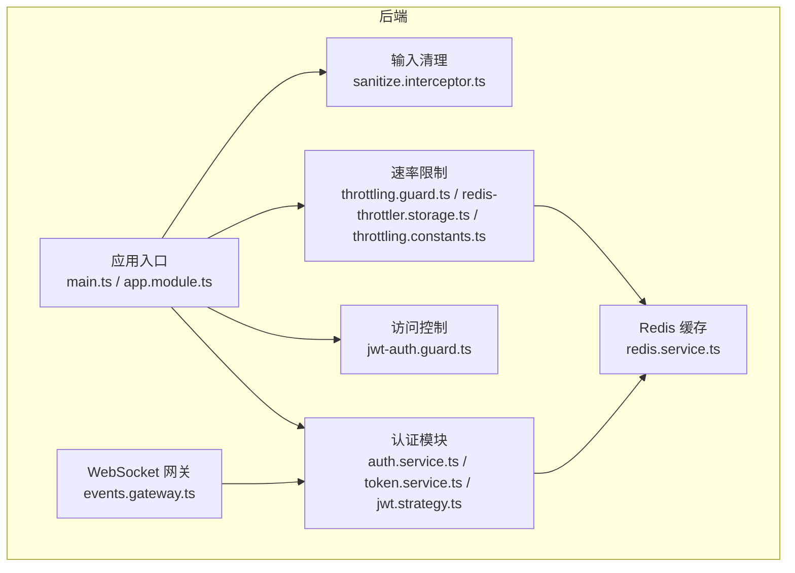
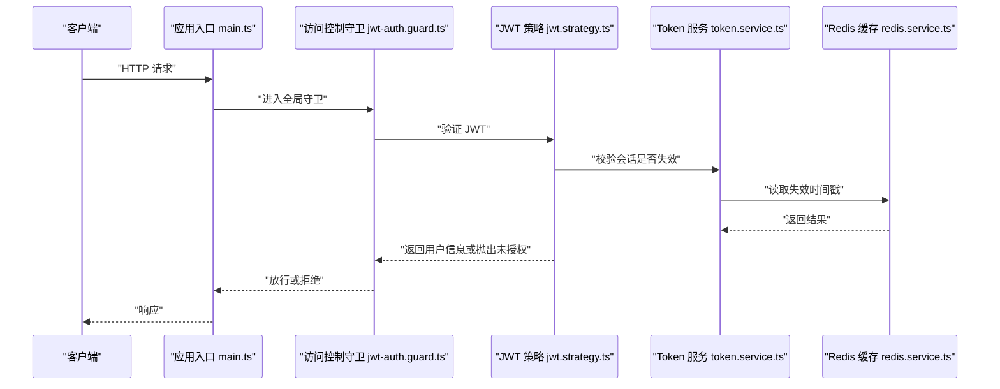
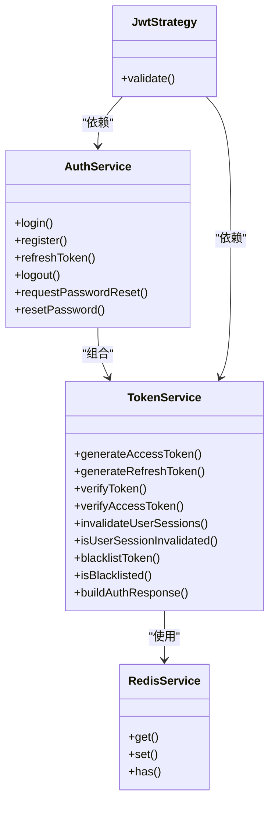
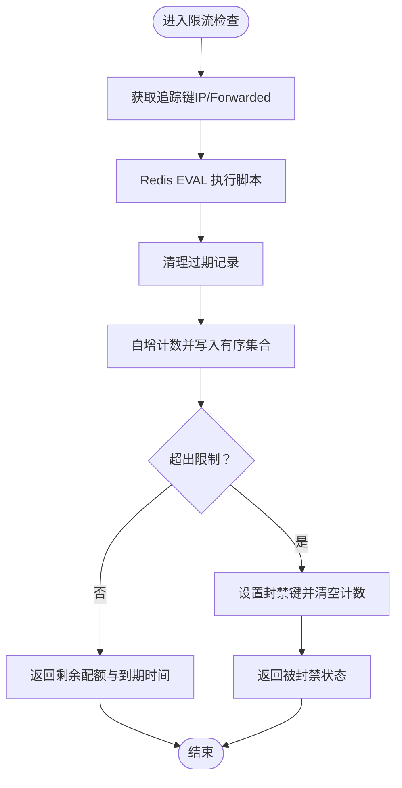
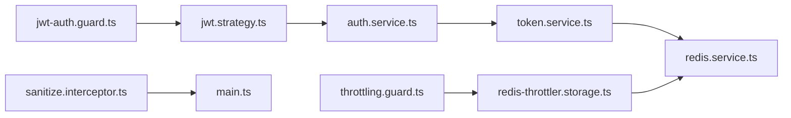

# 安全防护

<cite>
**本文引用的文件**
- [apps/backend/src/auth/jwt-auth.guard.ts](file://apps/backend/src/auth/jwt-auth.guard.ts)
- [apps/backend/src/auth/jwt.strategy.ts](file://apps/backend/src/auth/jwt.strategy.ts)
- [apps/backend/src/auth/token.service.ts](file://apps/backend/src/auth/token.service.ts)
- [apps/backend/src/auth/auth.service.ts](file://apps/backend/src/auth/auth.service.ts)
- [apps/backend/src/auth/password.service.ts](file://apps/backend/src/auth/password.service.ts)
- [apps/backend/src/common/throttling/throttling.guard.ts](file://apps/backend/src/common/throttling/throttling.guard.ts)
- [apps/backend/src/common/throttling/redis-throttler.storage.ts](file://apps/backend/src/common/throttling/redis-throttler.storage.ts)
- [apps/backend/src/common/throttling/throttling.constants.ts](file://apps/backend/src/common/throttling/throttling.constants.ts)
- [apps/backend/src/common/interceptors/sanitize.interceptor.ts](file://apps/backend/src/common/interceptors/sanitize.interceptor.ts)
- [apps/backend/src/redis/redis.service.ts](file://apps/backend/src/redis/redis.service.ts)
- [apps/backend/src/app.module.ts](file://apps/backend/src/app.module.ts)
- [apps/backend/src/main.ts](file://apps/backend/src/main.ts)
- [apps/backend/src/events/events.gateway.ts](file://apps/backend/src/events/events.gateway.ts)
- [apps/frontend/nginx.conf](file://apps/frontend/nginx.conf)
</cite>

## 目录

1. [简介](#简介)
2. [项目结构](#项目结构)
3. [核心组件](#核心组件)
4. [架构总览](#架构总览)
5. [组件详解](#组件详解)
6. [依赖关系分析](#依赖关系分析)
7. [性能考量](#性能考量)
8. [故障排查指南](#故障排查指南)
9. [结论](#结论)
10. [附录](#附录)

## 简介

本文件面向 Lumina Todo 安全防护体系，围绕以下主题进行系统化说明：

- JWT 认证机制：Token 生成、验证策略、刷新与注销流程
- 访问控制守卫与会话管理：基于策略的用户校验、会话失效与黑名单
- 速率限制系统：Redis 存储、滑动窗口算法与分布式限流
- CSRF 防护、XSS 预防与 SQL 注入防护
- 密码加密策略、安全头设置与 CORS 配置
- 安全最佳实践、漏洞防护与安全审计指南

## 项目结构

后端采用 NestJS + Fastify 架构，安全相关能力主要分布在认证模块、通用拦截器与限流模块，并通过全局中间件与守护器统一接入。

图示来源

- [apps/backend/src/app.module.ts:118-123](file://apps/backend/src/app.module.ts#L118-L123)
- [apps/backend/src/main.ts:34-211](file://apps/backend/src/main.ts#L34-L211)

章节来源

- [apps/backend/src/app.module.ts:118-123](file://apps/backend/src/app.module.ts#L118-L123)
- [apps/backend/src/main.ts:34-211](file://apps/backend/src/main.ts#L34-L211)

## 核心组件

- JWT 认证与会话管理：基于 passport-jwt 的策略与自定义守卫，结合 Redis 维护会话失效与黑名单
- 速率限制：基于 Redis 的 Lua 脚本实现滑动窗口，支持多窗口维度与分布式限流
- 输入清理：对请求体、查询与路径参数进行递归清理，阻断常见 XSS
- 安全头与 CORS：Helmet、CSP、CORS、Permissions-Policy 等统一配置
- CSRF 防护：强制要求 X-Requested-With 头，拦截非 AJAX 请求

章节来源

- [apps/backend/src/auth/jwt-auth.guard.ts:1-10](file://apps/backend/src/auth/jwt-auth.guard.ts#L1-L10)
- [apps/backend/src/auth/jwt.strategy.ts:1-68](file://apps/backend/src/auth/jwt.strategy.ts#L1-L68)
- [apps/backend/src/auth/token.service.ts:1-187](file://apps/backend/src/auth/token.service.ts#L1-L187)
- [apps/backend/src/common/throttling/throttling.guard.ts:1-34](file://apps/backend/src/common/throttling/throttling.guard.ts#L1-L34)
- [apps/backend/src/common/throttling/redis-throttler.storage.ts:1-173](file://apps/backend/src/common/throttling/redis-throttler.storage.ts#L1-L173)
- [apps/backend/src/common/interceptors/sanitize.interceptor.ts:1-64](file://apps/backend/src/common/interceptors/sanitize.interceptor.ts#L1-L64)
- [apps/backend/src/main.ts:48-131](file://apps/backend/src/main.ts#L48-L131)

## 架构总览

下图展示安全相关模块在请求生命周期中的交互：

图示来源

- [apps/backend/src/main.ts:34-211](file://apps/backend/src/main.ts#L34-L211)
- [apps/backend/src/auth/jwt-auth.guard.ts:1-10](file://apps/backend/src/auth/jwt-auth.guard.ts#L1-L10)
- [apps/backend/src/auth/jwt.strategy.ts:41-66](file://apps/backend/src/auth/jwt.strategy.ts#L41-L66)
- [apps/backend/src/auth/token.service.ts:55-76](file://apps/backend/src/auth/token.service.ts#L55-L76)
- [apps/backend/src/redis/redis.service.ts:99-121](file://apps/backend/src/redis/redis.service.ts#L99-L121)

## 组件详解

### JWT 认证机制与会话管理

- Token 生成
  - 访问令牌（短期）与刷新令牌（长期）分别使用不同密钥与过期时间
  - 生成后封装为统一认证响应，包含用户信息与过期时间
- Token 验证策略
  - 策略严格校验类型为“访问令牌”，并确保 payload 中用户 ID 为正整数
  - 结合 Redis 检查会话是否被整体失效（按用户维度）
- 刷新与注销
  - 刷新前先检查令牌是否在黑名单
  - 注销将当前刷新令牌加入黑名单，确保无法再次刷新
- 会话失效
  - 登出或重置密码时，按用户维度写入失效时间戳，后续访问令牌将被拒绝

图示来源

- [apps/backend/src/auth/auth.service.ts:12-127](file://apps/backend/src/auth/auth.service.ts#L12-L127)
- [apps/backend/src/auth/token.service.ts:15-187](file://apps/backend/src/auth/token.service.ts#L15-L187)
- [apps/backend/src/auth/jwt.strategy.ts:20-66](file://apps/backend/src/auth/jwt.strategy.ts#L20-L66)
- [apps/backend/src/redis/redis.service.ts:61-224](file://apps/backend/src/redis/redis.service.ts#L61-L224)

章节来源

- [apps/backend/src/auth/token.service.ts:78-125](file://apps/backend/src/auth/token.service.ts#L78-L125)
- [apps/backend/src/auth/token.service.ts:47-76](file://apps/backend/src/auth/token.service.ts#L47-L76)
- [apps/backend/src/auth/auth.service.ts:59-101](file://apps/backend/src/auth/auth.service.ts#L59-L101)
- [apps/backend/src/auth/jwt.strategy.ts:41-66](file://apps/backend/src/auth/jwt.strategy.ts#L41-L66)

### 访问控制守卫与角色权限

- 守卫职责
  - 基于 passport-jwt 的通用守卫，统一拦截受保护路由
  - 策略负责细粒度校验（类型、用户存在性、会话有效性）
- 角色权限
  - 当前策略仅区分访问令牌类型，未在策略层引入角色字段
  - 如需角色控制，可在策略返回的用户对象上扩展角色字段，并在业务层进行授权判断

章节来源

- [apps/backend/src/auth/jwt-auth.guard.ts:1-10](file://apps/backend/src/auth/jwt-auth.guard.ts#L1-L10)
- [apps/backend/src/auth/jwt.strategy.ts:8-13](file://apps/backend/src/auth/jwt.strategy.ts#L8-L13)
- [apps/backend/src/auth/jwt.strategy.ts:41-66](file://apps/backend/src/auth/jwt.strategy.ts#L41-L66)

### 速率限制系统（Redis + 滑动窗口）

- 滑动窗口算法
  - 使用 Redis ZSET 记录时间序列，Lua 脚本原子性维护 hits、block、sequence 等键
  - TTL 过期后自动清理，超过限制时设置 block 键并清空计数
- 分布式限流
  - 通过 Redis 原子脚本保证跨实例一致性
  - 失效回退：当无法获取原生命令客户端时，自动降级到内存存储
- 多窗口策略
  - short/medium/long 三档窗口，支持按功能域定制策略（如登录、注册、刷新等）

图示来源

- [apps/backend/src/common/throttling/redis-throttler.storage.ts:18-87](file://apps/backend/src/common/throttling/redis-throttler.storage.ts#L18-L87)
- [apps/backend/src/common/throttling/throttling.guard.ts:29-33](file://apps/backend/src/common/throttling/throttling.guard.ts#L29-L33)
- [apps/backend/src/common/throttling/throttling.constants.ts:67-198](file://apps/backend/src/common/throttling/throttling.constants.ts#L67-L198)

章节来源

- [apps/backend/src/common/throttling/redis-throttler.storage.ts:107-173](file://apps/backend/src/common/throttling/redis-throttler.storage.ts#L107-L173)
- [apps/backend/src/common/throttling/throttling.guard.ts:28-34](file://apps/backend/src/common/throttling/throttling.guard.ts#L28-L34)
- [apps/backend/src/common/throttling/throttling.constants.ts:11-198](file://apps/backend/src/common/throttling/throttling.constants.ts#L11-L198)

### CSRF 防护、XSS 预防与 SQL 注入防护

- CSRF 防护
  - 强制要求 X-Requested-With 请求头，拦截非 AJAX 请求
  - 对健康检查与 WebSocket 路径豁免
- XSS 预防
  - 全局拦截器对请求体、查询与路径参数进行递归清理，禁止任何 HTML 标签
- SQL 注入防护
  - 使用 Prisma ORM，参数化查询，避免拼接 SQL 字符串
  - 配合 Zod 验证管道，从源头约束输入结构

章节来源

- [apps/backend/src/main.ts:133-167](file://apps/backend/src/main.ts#L133-L167)
- [apps/backend/src/common/interceptors/sanitize.interceptor.ts:10-64](file://apps/backend/src/common/interceptors/sanitize.interceptor.ts#L10-L64)
- [apps/backend/src/app.module.ts:134-146](file://apps/backend/src/app.module.ts#L134-L146)

### 密码加密策略

- 使用 bcryptjs 进行密码哈希与比对
- 密码重置流程：生成随机令牌并以 SHA-256 存储，重置时校验有效期与哈希一致性
- 重置成功后使该用户的全部会话失效，保障安全

章节来源

- [apps/backend/src/auth/password.service.ts:24-34](file://apps/backend/src/auth/password.service.ts#L24-L34)
- [apps/backend/src/auth/password.service.ts:39-61](file://apps/backend/src/auth/password.service.ts#L39-L61)
- [apps/backend/src/auth/password.service.ts:66-89](file://apps/backend/src/auth/password.service.ts#L66-L89)
- [apps/backend/src/auth/token.service.ts:47-53](file://apps/backend/src/auth/token.service.ts#L47-L53)

### 安全头设置与 CORS 配置

- 安全头（Helmet）
  - CSP、X-Frame-Options、X-Content-Type-Options、Permissions-Policy 等
- CORS
  - 显式允许来源列表、凭证、方法与头部
  - WebSocket 网关复用相同 CORS 策略
- 前端 Nginx 补充安全头
  - X-Frame-Options、X-Content-Type-Options、X-XSS-Protection、Referrer-Policy、Content-Security-Policy、Permissions-Policy 等

章节来源

- [apps/backend/src/main.ts:48-131](file://apps/backend/src/main.ts#L48-L131)
- [apps/backend/src/events/events.gateway.ts:31-56](file://apps/backend/src/events/events.gateway.ts#L31-L56)
- [apps/frontend/nginx.conf:74-96](file://apps/frontend/nginx.conf#L74-L96)

## 依赖关系分析

- 认证链路
  - 守卫 -> 策略 -> 服务 -> Redis
- 限流链路
  - 守卫 -> 存储（Redis Lua 脚本）-> 回退（内存）
- 全局拦截器
  - XSS 清理与响应统一格式在应用启动时注册

图示来源

- [apps/backend/src/auth/jwt-auth.guard.ts:1-10](file://apps/backend/src/auth/jwt-auth.guard.ts#L1-L10)
- [apps/backend/src/auth/jwt.strategy.ts:20-66](file://apps/backend/src/auth/jwt.strategy.ts#L20-L66)
- [apps/backend/src/auth/auth.service.ts:12-127](file://apps/backend/src/auth/auth.service.ts#L12-L127)
- [apps/backend/src/auth/token.service.ts:15-187](file://apps/backend/src/auth/token.service.ts#L15-L187)
- [apps/backend/src/redis/redis.service.ts:61-224](file://apps/backend/src/redis/redis.service.ts#L61-L224)
- [apps/backend/src/common/throttling/throttling.guard.ts:28-34](file://apps/backend/src/common/throttling/throttling.guard.ts#L28-L34)
- [apps/backend/src/common/throttling/redis-throttler.storage.ts:107-173](file://apps/backend/src/common/throttling/redis-throttler.storage.ts#L107-L173)
- [apps/backend/src/common/interceptors/sanitize.interceptor.ts:10-64](file://apps/backend/src/common/interceptors/sanitize.interceptor.ts#L10-L64)

章节来源

- [apps/backend/src/app.module.ts:118-123](file://apps/backend/src/app.module.ts#L118-L123)
- [apps/backend/src/main.ts:169-180](file://apps/backend/src/main.ts#L169-L180)

## 性能考量

- 限流性能
  - Redis Lua 原子脚本减少网络往返，适合高并发场景
  - 失败回退至内存存储，避免影响整体可用性
- 缓存与会话
  - Redis 前缀与 TTL 管理，降低键冲突与内存占用
- 输入清理
  - 递归清理在请求体量较大时可能带来 CPU 压力，建议配合上游 WAF 或 CDN 层进一步清洗

## 故障排查指南

- JWT 相关
  - 若出现“无效令牌”或“用户不存在”，检查策略中的 payload 类型与用户 ID 校验逻辑
  - 若刷新失败，确认刷新令牌是否在黑名单，以及用户会话是否被整体失效
- 速率限制
  - 若频繁触发封禁，检查 Redis 是否可用；若回退到内存存储，注意容器重启导致状态丢失
  - 调整 short/medium/long 窗口的 limit 与 ttl，平衡安全与体验
- CSRF/XSS
  - 确认客户端是否正确携带 X-Requested-With 头
  - 检查全局拦截器是否生效，以及请求体是否被过度清理
- CORS/安全头
  - 核对前端与后端 CORS 配置是否一致，WebSocket 握手是否允许
  - 前端 Nginx 安全头与后端 Helmet 配置是否冲突

章节来源

- [apps/backend/src/auth/jwt.strategy.ts:41-66](file://apps/backend/src/auth/jwt.strategy.ts#L41-L66)
- [apps/backend/src/auth/auth.service.ts:59-101](file://apps/backend/src/auth/auth.service.ts#L59-L101)
- [apps/backend/src/common/throttling/redis-throttler.storage.ts:107-173](file://apps/backend/src/common/throttling/redis-throttler.storage.ts#L107-L173)
- [apps/backend/src/main.ts:133-167](file://apps/backend/src/main.ts#L133-L167)
- [apps/frontend/nginx.conf:74-96](file://apps/frontend/nginx.conf#L74-L96)

## 结论

本安全体系通过“强认证 + 限流 + 输入清理 + 安全头 + CORS”的组合拳，覆盖了认证、授权、速率限制、输入安全与传输安全等关键面。建议在生产环境中：

- 严格管理密钥与会话失效策略
- 持续监控限流命中率与 Redis 健康
- 结合 WAF 与 CDN 进一步强化 XSS/CSRF 防护
- 定期进行安全审计与渗透测试

## 附录

- 安全最佳实践
  - 强制 HTTPS 与安全传输
  - 最小权限原则与最小暴露面
  - 定期轮换密钥与审计日志
- 漏洞防护清单
  - CSRF：强制 X-Requested-With
  - XSS：输入清理 + CSP
  - 注入：ORM 参数化 + 输入验证
  - 暴力破解：多窗口限流 + 登录锁
- 安全审计要点
  - 审核密钥配置与权限模型
  - 核对 CORS 与安全头配置
  - 检查 Redis 可用性与备份策略
