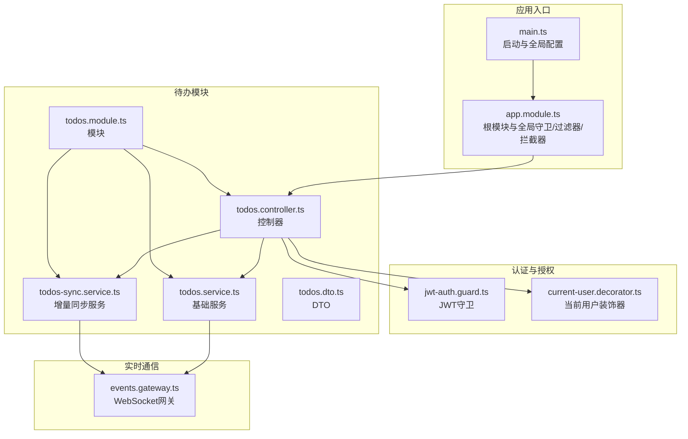
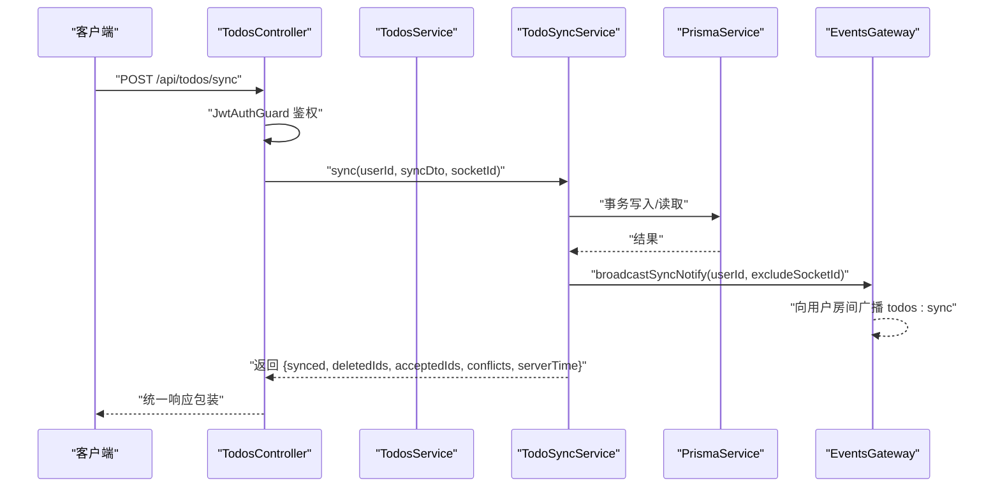
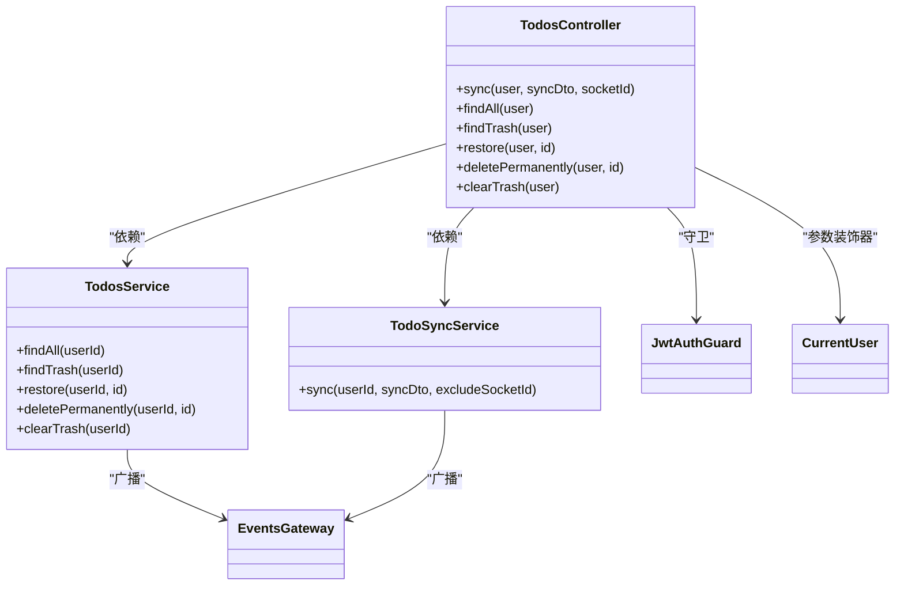
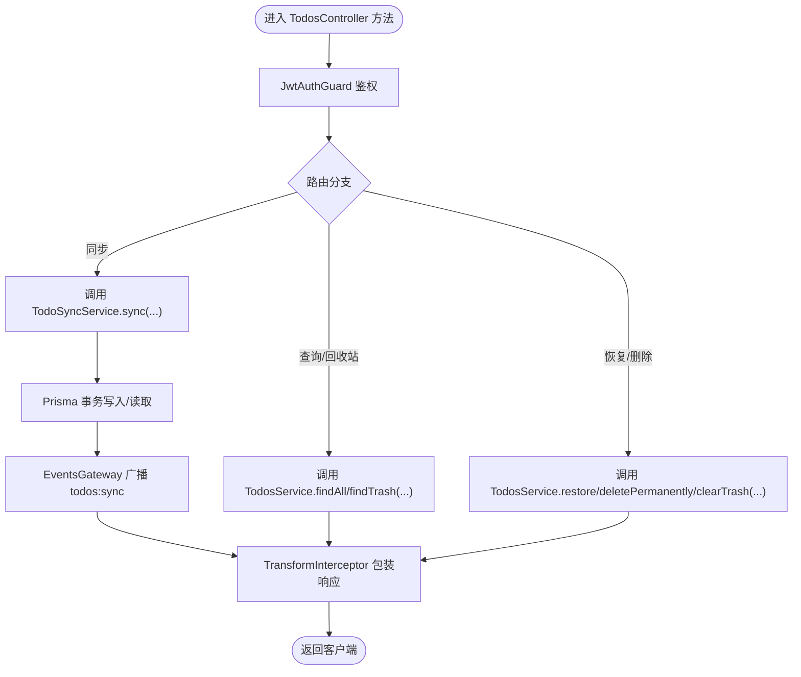
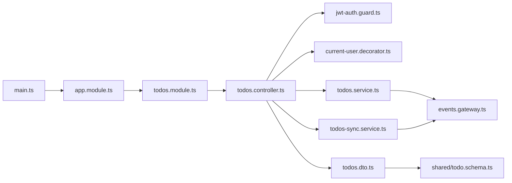

# 控制器设计

<cite>
**本文引用的文件**
- [apps/backend/src/todos/todos.controller.ts](file://apps/backend/src/todos/todos.controller.ts)
- [apps/backend/src/todos/todos.service.ts](file://apps/backend/src/todos/todos.service.ts)
- [apps/backend/src/todos/todos-sync.service.ts](file://apps/backend/src/todos/todos-sync.service.ts)
- [apps/backend/src/todos/todos.dto.ts](file://apps/backend/src/todos/todos.dto.ts)
- [apps/backend/src/todos/todos.module.ts](file://apps/backend/src/todos/todos.module.ts)
- [apps/backend/src/auth/jwt-auth.guard.ts](file://apps/backend/src/auth/jwt-auth.guard.ts)
- [apps/backend/src/auth/current-user.decorator.ts](file://apps/backend/src/auth/current-user.decorator.ts)
- [apps/backend/src/events/events.gateway.ts](file://apps/backend/src/events/events.gateway.ts)
- [apps/backend/src/app.module.ts](file://apps/backend/src/app.module.ts)
- [apps/backend/src/common/filters/all-exceptions.filter.ts](file://apps/backend/src/common/filters/all-exceptions.filter.ts)
- [apps/backend/src/common/interceptors/transform.interceptor.ts](file://apps/backend/src/common/interceptors/transform.interceptor.ts)
- [apps/backend/src/common/throttling/throttling.guard.ts](file://apps/backend/src/common/throttling/throttling.guard.ts)
- [apps/backend/src/main.ts](file://apps/backend/src/main.ts)
- [packages/shared/src/schemas/todo.schema.ts](file://packages/shared/src/schemas/todo.schema.ts)
</cite>

## 目录
1. [引言](#引言)
2. [项目结构](#项目结构)
3. [核心组件](#核心组件)
4. [架构总览](#架构总览)
5. [详细组件分析](#详细组件分析)
6. [依赖关系分析](#依赖关系分析)
7. [性能考量](#性能考量)
8. [故障排查指南](#故障排查指南)
9. [结论](#结论)
10. [附录](#附录)

## 引言
本文件面向Lumina Todo控制器设计，系统性阐述基于NestJS的控制器架构模式，包括装饰器使用、路由定义、依赖注入、认证保护、请求参数与响应格式、控制器与服务层交互、异常处理策略、中间件集成以及Swagger注解与文档生成。文档同时提供最佳实践、性能优化建议与安全防护措施，帮助开发者在保持代码一致性的同时提升可维护性与安全性。

## 项目结构
Lumina后端采用多模块架构，Todos模块位于apps/backend/src/todos目录，包含控制器、服务、DTO与模块声明；认证与实时通信分别由auth与events模块提供支持；全局中间件、异常过滤器、响应拦截器与Swagger在main.ts与app.module.ts中集中配置。

图表来源
- [apps/backend/src/main.ts:34-211](file://apps/backend/src/main.ts#L34-L211)
- [apps/backend/src/app.module.ts:155-160](file://apps/backend/src/app.module.ts#L155-L160)
- [apps/backend/src/todos/todos.controller.ts:20-70](file://apps/backend/src/todos/todos.controller.ts#L20-L70)
- [apps/backend/src/todos/todos.service.ts:27-147](file://apps/backend/src/todos/todos.service.ts#L27-L147)
- [apps/backend/src/todos/todos-sync.service.ts:41-226](file://apps/backend/src/todos/todos-sync.service.ts#L41-L226)
- [apps/backend/src/auth/jwt-auth.guard.ts:8-10](file://apps/backend/src/auth/jwt-auth.guard.ts#L8-L10)
- [apps/backend/src/auth/current-user.decorator.ts:8-19](file://apps/backend/src/auth/current-user.decorator.ts#L8-L19)
- [apps/backend/src/events/events.gateway.ts:57-266](file://apps/backend/src/events/events.gateway.ts#L57-L266)

章节来源
- [apps/backend/src/todos/todos.controller.ts:1-70](file://apps/backend/src/todos/todos.controller.ts#L1-L70)
- [apps/backend/src/todos/todos.module.ts:8-15](file://apps/backend/src/todos/todos.module.ts#L8-L15)
- [apps/backend/src/main.ts:34-211](file://apps/backend/src/main.ts#L34-L211)
- [apps/backend/src/app.module.ts:155-160](file://apps/backend/src/app.module.ts#L155-L160)

## 核心组件
- 控制器：负责路由定义、参数解析、认证守卫与Swagger注解，调用服务层完成业务逻辑。
- 服务层：
  - 基础服务：查询用户待办、回收站、恢复与永久删除、清空回收站。
  - 同步服务：实现增量合并、冲突检测、递归任务生成与实时广播。
- DTO：基于Zod Schema的类型安全输入校验。
- 装饰器与守卫：JwtAuthGuard提供JWT认证保护；CurrentUser装饰器从请求上下文提取当前用户。
- 实时网关：负责广播同步事件，实现跨设备实时同步。
- 全局中间件与过滤器：统一响应格式、异常处理、CSRF防护、XSS清理与Gzip压缩。

章节来源
- [apps/backend/src/todos/todos.controller.ts:24-70](file://apps/backend/src/todos/todos.controller.ts#L24-L70)
- [apps/backend/src/todos/todos.service.ts:28-147](file://apps/backend/src/todos/todos.service.ts#L28-L147)
- [apps/backend/src/todos/todos-sync.service.ts:42-226](file://apps/backend/src/todos/todos-sync.service.ts#L42-L226)
- [apps/backend/src/todos/todos.dto.ts:1-5](file://apps/backend/src/todos/todos.dto.ts#L1-L5)
- [apps/backend/src/auth/jwt-auth.guard.ts:8-10](file://apps/backend/src/auth/jwt-auth.guard.ts#L8-L10)
- [apps/backend/src/auth/current-user.decorator.ts:8-19](file://apps/backend/src/auth/current-user.decorator.ts#L8-L19)
- [apps/backend/src/events/events.gateway.ts:180-202](file://apps/backend/src/events/events.gateway.ts#L180-L202)
- [apps/backend/src/common/interceptors/transform.interceptor.ts:18-30](file://apps/backend/src/common/interceptors/transform.interceptor.ts#L18-L30)
- [apps/backend/src/common/filters/all-exceptions.filter.ts:16-137](file://apps/backend/src/common/filters/all-exceptions.filter.ts#L16-L137)
- [apps/backend/src/main.ts:169-180](file://apps/backend/src/main.ts#L169-L180)

## 架构总览
控制器通过装饰器声明路由与认证，使用依赖注入获取服务实例；服务层通过Prisma访问数据库，并在必要时通过EventsGateway广播同步事件；全局拦截器与过滤器统一处理响应与异常；Swagger自动生成API文档并与Zod Schema集成。

图表来源
- [apps/backend/src/todos/todos.controller.ts:30-38](file://apps/backend/src/todos/todos.controller.ts#L30-L38)
- [apps/backend/src/todos/todos-sync.service.ts:52-224](file://apps/backend/src/todos/todos-sync.service.ts#L52-L224)
- [apps/backend/src/events/events.gateway.ts:180-202](file://apps/backend/src/events/events.gateway.ts#L180-L202)
- [apps/backend/src/common/interceptors/transform.interceptor.ts:18-30](file://apps/backend/src/common/interceptors/transform.interceptor.ts#L18-L30)

## 详细组件分析

### 控制器类设计与装饰器使用
- 路由定义：使用@Controller('todos')声明控制器命名空间；各方法通过@Post、@Get、@Delete等装饰器定义REST端点。
- 认证保护：@UseGuards(JwtAuthGuard)对整个控制器启用JWT认证。
- Swagger注解：@ApiTags('Todos')、@ApiOperation、@ApiBearerAuth统一生成文档与认证说明。
- 参数解析：@CurrentUser装饰器从请求上下文提取当前用户；@Body、@Headers、@Param用于解析请求体、头部与路径参数。
- 依赖注入：构造函数注入TodosService与TodoSyncService，支持模块导出与测试替身。

图表来源
- [apps/backend/src/todos/todos.controller.ts:24-70](file://apps/backend/src/todos/todos.controller.ts#L24-L70)
- [apps/backend/src/todos/todos.service.ts:28-147](file://apps/backend/src/todos/todos.service.ts#L28-L147)
- [apps/backend/src/todos/todos-sync.service.ts:42-226](file://apps/backend/src/todos/todos-sync.service.ts#L42-L226)
- [apps/backend/src/auth/jwt-auth.guard.ts:8-10](file://apps/backend/src/auth/jwt-auth.guard.ts#L8-L10)
- [apps/backend/src/auth/current-user.decorator.ts:8-19](file://apps/backend/src/auth/current-user.decorator.ts#L8-L19)
- [apps/backend/src/events/events.gateway.ts:180-202](file://apps/backend/src/events/events.gateway.ts#L180-L202)

章节来源
- [apps/backend/src/todos/todos.controller.ts:20-70](file://apps/backend/src/todos/todos.controller.ts#L20-L70)
- [apps/backend/src/auth/jwt-auth.guard.ts:8-10](file://apps/backend/src/auth/jwt-auth.guard.ts#L8-L10)
- [apps/backend/src/auth/current-user.decorator.ts:8-19](file://apps/backend/src/auth/current-user.decorator.ts#L8-L19)

### 路由与端点组织
- 同步合并：POST /api/todos/sync，支持离线优先的增量合并与冲突检测。
- 查询：GET /api/todos 与 GET /api/todos/trash，分别获取常规与回收站列表。
- 恢复与删除：POST /api/todos/:id/restore、DELETE /api/todos/:id/permanent、DELETE /api/todos/trash/clear。
- 参数与头部：通过@Param('id')与@Headers('X-Socket-ID')获取路径参数与客户端Socket ID，用于广播去重。

章节来源
- [apps/backend/src/todos/todos.controller.ts:30-68](file://apps/backend/src/todos/todos.controller.ts#L30-L68)

### 依赖注入与模块组织
- 模块导入：TodosModule引入PrismaModule与EventsModule，控制器、服务与同步服务作为providers注册。
- 导出：TodosModule导出TodosService与TodoSyncService，便于其他模块复用。
- 全局配置：AppModule全局注册ThrottlerGuard、TransformInterceptor、AllExceptionsFilter等。

章节来源
- [apps/backend/src/todos/todos.module.ts:8-15](file://apps/backend/src/todos/todos.module.ts#L8-L15)
- [apps/backend/src/app.module.ts:147-153](file://apps/backend/src/app.module.ts#L147-L153)

### 认证与用户上下文
- JwtAuthGuard：继承AuthGuard('jwt')，统一保护受保护路由。
- CurrentUser装饰器：从请求上下文提取用户对象或指定字段，简化控制器参数解析。
- WebSocket认证：EventsGateway在网关初始化阶段通过中间件校验Token并绑定用户到Socket。

章节来源
- [apps/backend/src/auth/jwt-auth.guard.ts:8-10](file://apps/backend/src/auth/jwt-auth.guard.ts#L8-L10)
- [apps/backend/src/auth/current-user.decorator.ts:8-19](file://apps/backend/src/auth/current-user.decorator.ts#L8-L19)
- [apps/backend/src/events/events.gateway.ts:86-116](file://apps/backend/src/events/events.gateway.ts#L86-L116)

### 请求参数与响应格式
- 输入校验：todos.dto.ts基于共享Schema的SyncMergeRequestSchema，结合nestjs-zod实现强类型校验。
- 响应包装：TransformInterceptor将所有成功响应统一包装为{success, data, timestamp}结构。
- 异常处理：AllExceptionsFilter统一捕获异常，支持Zod验证错误与国际化消息映射。

章节来源
- [apps/backend/src/todos/todos.dto.ts:1-5](file://apps/backend/src/todos/todos.dto.ts#L1-L5)
- [packages/shared/src/schemas/todo.schema.ts:40-51](file://packages/shared/src/schemas/todo.schema.ts#L40-L51)
- [apps/backend/src/common/interceptors/transform.interceptor.ts:18-30](file://apps/backend/src/common/interceptors/transform.interceptor.ts#L18-L30)
- [apps/backend/src/common/filters/all-exceptions.filter.ts:16-137](file://apps/backend/src/common/filters/all-exceptions.filter.ts#L16-L137)

### 控制器与服务层交互
- 基础操作：TodosController调用TodosService执行查询、恢复、删除与清空回收站。
- 同步流程：TodosController调用TodoSyncService执行增量合并、冲突检测与递归任务生成，并在有变更时通过EventsGateway广播同步事件。
- 事务保证：服务层使用Prisma事务确保数据一致性（如永久删除与清空回收站）。

图表来源
- [apps/backend/src/todos/todos.controller.ts:30-68](file://apps/backend/src/todos/todos.controller.ts#L30-L68)
- [apps/backend/src/todos/todos-sync.service.ts:52-224](file://apps/backend/src/todos/todos-sync.service.ts#L52-L224)
- [apps/backend/src/todos/todos.service.ts:38-145](file://apps/backend/src/todos/todos.service.ts#L38-L145)
- [apps/backend/src/events/events.gateway.ts:180-202](file://apps/backend/src/events/events.gateway.ts#L180-L202)
- [apps/backend/src/common/interceptors/transform.interceptor.ts:18-30](file://apps/backend/src/common/interceptors/transform.interceptor.ts#L18-L30)

### 异常处理策略
- 全局异常过滤器：捕获所有未处理异常，区分HTTP状态码与Zod验证错误，输出统一结构化错误响应。
- 国际化：I18nContext用于将错误消息与字段名翻译为本地语言。
- 业务异常：对特定业务错误（如字段级错误）进行映射与结构化返回。

章节来源
- [apps/backend/src/common/filters/all-exceptions.filter.ts:16-137](file://apps/backend/src/common/filters/all-exceptions.filter.ts#L16-L137)

### 中间件与安全集成
- 全局中间件：CSRF防护（X-Requested-With校验）、Helmet安全头、Gzip压缩、静态资源托管。
- 全局拦截器：响应包装与XSS清理。
- 全局守卫：ThrottlerGuard统一速率限制，支持代理场景下的真实IP追踪。

章节来源
- [apps/backend/src/main.ts:48-180](file://apps/backend/src/main.ts#L48-L180)
- [apps/backend/src/common/throttling/throttling.guard.ts:29-34](file://apps/backend/src/common/throttling/throttling.guard.ts#L29-L34)

### Swagger注解与文档生成
- 文档构建：DocumentBuilder配置标题、描述、版本与Bearer认证。
- 清理OpenAPI：cleanupOpenApiDoc处理Zod Schema生成的文档，避免冗余与不一致。
- 访问地址：/api/docs。

章节来源
- [apps/backend/src/main.ts:181-191](file://apps/backend/src/main.ts#L181-L191)

## 依赖关系分析

图表来源
- [apps/backend/src/main.ts:34-211](file://apps/backend/src/main.ts#L34-L211)
- [apps/backend/src/app.module.ts:155-160](file://apps/backend/src/app.module.ts#L155-L160)
- [apps/backend/src/todos/todos.module.ts:8-15](file://apps/backend/src/todos/todos.module.ts#L8-L15)
- [apps/backend/src/todos/todos.controller.ts:20-70](file://apps/backend/src/todos/todos.controller.ts#L20-L70)
- [apps/backend/src/todos/todos.service.ts:28-147](file://apps/backend/src/todos/todos.service.ts#L28-L147)
- [apps/backend/src/todos/todos-sync.service.ts:42-226](file://apps/backend/src/todos/todos-sync.service.ts#L42-L226)
- [apps/backend/src/todos/todos.dto.ts:1-5](file://apps/backend/src/todos/todos.dto.ts#L1-L5)
- [packages/shared/src/schemas/todo.schema.ts:40-51](file://packages/shared/src/schemas/todo.schema.ts#L40-L51)

章节来源
- [apps/backend/src/todos/todos.controller.ts:1-70](file://apps/backend/src/todos/todos.controller.ts#L1-L70)
- [apps/backend/src/todos/todos.service.ts:1-147](file://apps/backend/src/todos/todos.service.ts#L1-L147)
- [apps/backend/src/todos/todos-sync.service.ts:1-226](file://apps/backend/src/todos/todos-sync.service.ts#L1-L226)
- [apps/backend/src/todos/todos.dto.ts:1-5](file://apps/backend/src/todos/todos.dto.ts#L1-L5)
- [apps/backend/src/todos/todos.module.ts:1-15](file://apps/backend/src/todos/todos.module.ts#L1-L15)
- [apps/backend/src/auth/jwt-auth.guard.ts:1-10](file://apps/backend/src/auth/jwt-auth.guard.ts#L1-L10)
- [apps/backend/src/auth/current-user.decorator.ts:1-19](file://apps/backend/src/auth/current-user.decorator.ts#L1-L19)
- [apps/backend/src/events/events.gateway.ts:1-266](file://apps/backend/src/events/events.gateway.ts#L1-L266)
- [apps/backend/src/app.module.ts:1-160](file://apps/backend/src/app.module.ts#L1-L160)
- [apps/backend/src/main.ts:1-211](file://apps/backend/src/main.ts#L1-L211)
- [packages/shared/src/schemas/todo.schema.ts:1-76](file://packages/shared/src/schemas/todo.schema.ts#L1-L76)

## 性能考量
- 事务批处理：同步服务在单个事务中批量处理客户端推送的变更，减少往返与锁竞争。
- 选择性字段：服务层使用select仅返回必要字段，降低序列化与网络传输开销。
- 广播防抖：EventsGateway对同一用户的广播进行500ms防抖，避免风暴式通知。
- 速率限制：全局ThrottlerGuard结合Redis存储，支持代理场景的真实IP识别。
- 压缩与缓存：Gzip压缩与静态资源托管减少带宽占用。

章节来源
- [apps/backend/src/todos/todos-sync.service.ts:67-179](file://apps/backend/src/todos/todos-sync.service.ts#L67-L179)
- [apps/backend/src/todos/todos.service.ts:5-25](file://apps/backend/src/todos/todos.service.ts#L5-L25)
- [apps/backend/src/events/events.gateway.ts:180-202](file://apps/backend/src/events/events.gateway.ts#L180-L202)
- [apps/backend/src/common/throttling/throttling.guard.ts:29-34](file://apps/backend/src/common/throttling/throttling.guard.ts#L29-L34)
- [apps/backend/src/main.ts:111-123](file://apps/backend/src/main.ts#L111-L123)

## 故障排查指南
- 认证失败：确认请求携带有效的Bearer Token且未过期；检查JwtAuthGuard是否正确应用。
- 参数校验失败：检查请求体是否符合SyncMergeRequestSchema；查看AllExceptionsFilter对Zod错误的结构化输出。
- 速率限制触发：检查客户端IP与代理链，确保AppThrottlerGuard能正确识别真实IP。
- 同步冲突：关注sync返回的conflicts数组，定位TOMBSTONED、OWNER_MISMATCH、VERSION_CONFLICT原因。
- 实时同步无响应：确认EventsGateway已正确广播todos:sync事件，检查用户房间加入与Socket ID排除逻辑。

章节来源
- [apps/backend/src/auth/jwt-auth.guard.ts:8-10](file://apps/backend/src/auth/jwt-auth.guard.ts#L8-L10)
- [apps/backend/src/common/filters/all-exceptions.filter.ts:52-87](file://apps/backend/src/common/filters/all-exceptions.filter.ts#L52-L87)
- [apps/backend/src/common/throttling/throttling.guard.ts:29-34](file://apps/backend/src/common/throttling/throttling.guard.ts#L29-L34)
- [apps/backend/src/todos/todos-sync.service.ts:35-40](file://apps/backend/src/todos/todos-sync.service.ts#L35-L40)
- [apps/backend/src/events/events.gateway.ts:180-202](file://apps/backend/src/events/events.gateway.ts#L180-L202)

## 结论
Lumina Todo控制器遵循NestJS最佳实践，通过装饰器清晰表达路由与认证意图，结合依赖注入与模块化组织实现高内聚低耦合；服务层以事务与选择性字段保障性能与一致性；全局中间件与过滤器统一了安全与响应格式；Swagger与Zod Schema确保文档质量与类型安全。该设计为扩展更多端点与功能提供了稳定基座。

## 附录
- 最佳实践
  - 使用Swagger注解明确API语义与认证要求。
  - 将复杂业务逻辑下沉至服务层，控制器仅做编排与参数解析。
  - 对关键写操作使用事务，确保一致性。
  - 通过装饰器与守卫实现细粒度权限控制。
- 性能优化
  - 选择性字段查询、批量事务处理、广播防抖。
  - 启用Gzip压缩与静态资源托管。
- 安全防护
  - Helmet安全头、CSRF校验、XSS清理、速率限制、Token失效校验。