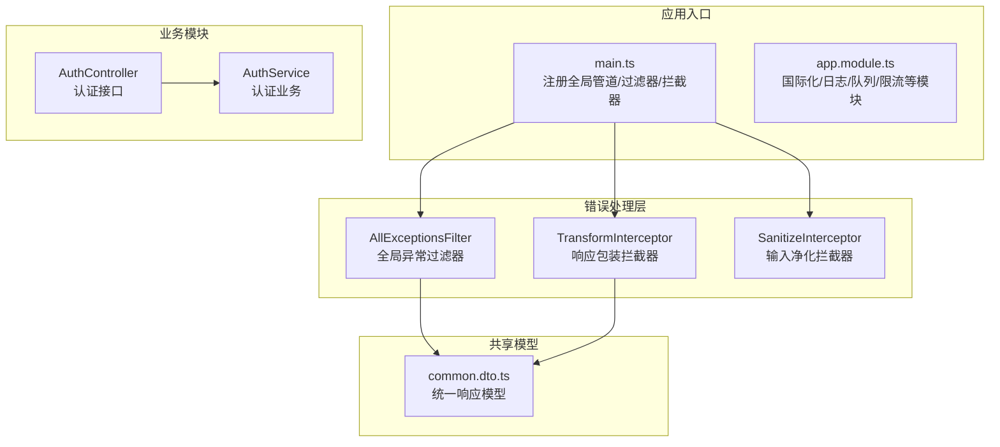
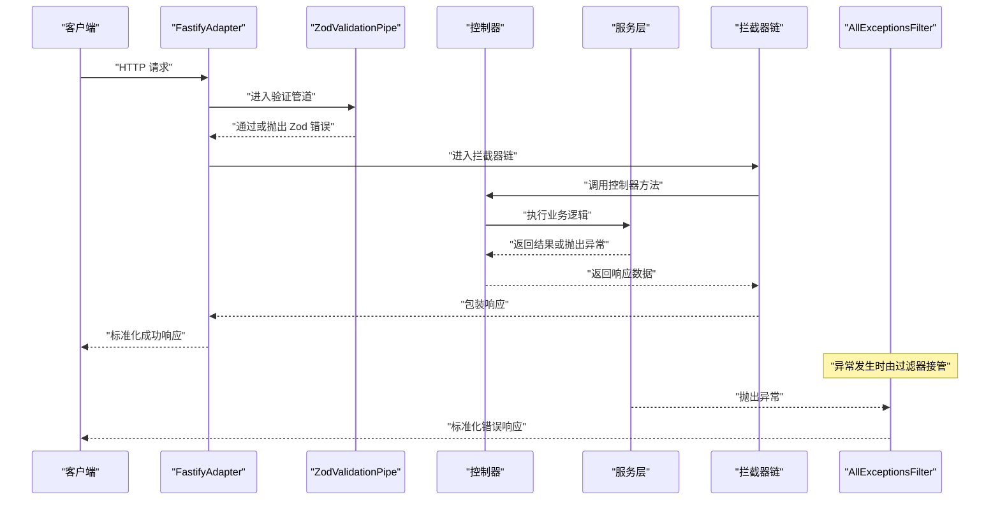
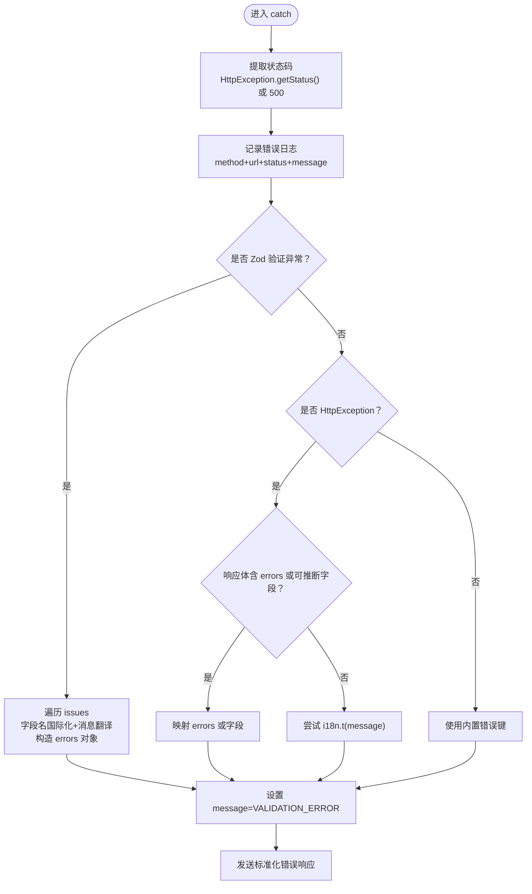
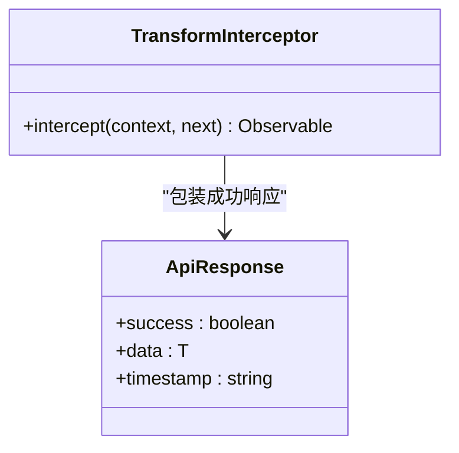
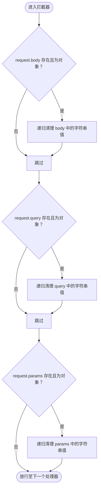
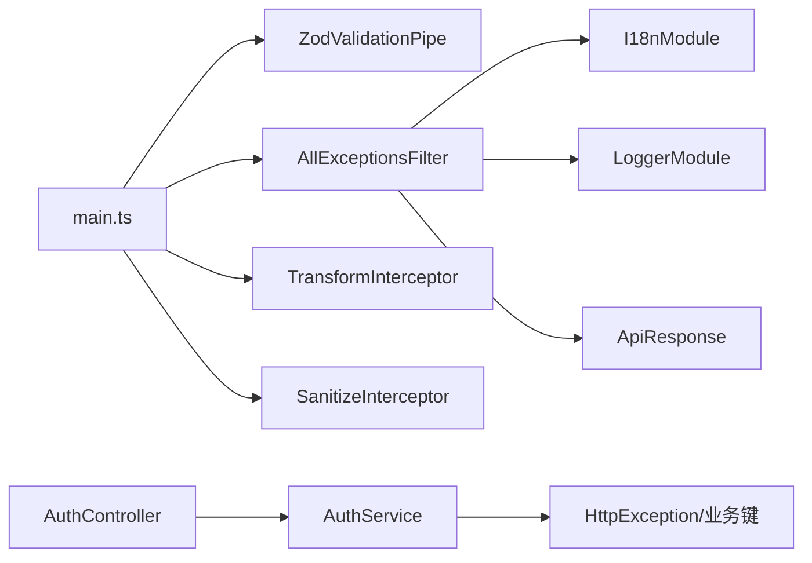

# 错误处理

<cite>
**本文引用的文件**
- [apps/backend/src/common/filters/all-exceptions.filter.ts](file://apps/backend/src/common/filters/all-exceptions.filter.ts)
- [apps/backend/src/common/interceptors/transform.interceptor.ts](file://apps/backend/src/common/interceptors/transform.interceptor.ts)
- [apps/backend/src/common/interceptors/sanitize.interceptor.ts](file://apps/backend/src/common/interceptors/sanitize.interceptor.ts)
- [apps/backend/src/main.ts](file://apps/backend/src/main.ts)
- [apps/backend/src/app.module.ts](file://apps/backend/src/app.module.ts)
- [apps/backend/src/auth/auth.service.ts](file://apps/backend/src/auth/auth.service.ts)
- [apps/backend/src/auth/auth.controller.ts](file://apps/backend/src/auth/auth.controller.ts)
- [packages/shared/src/dto/common.dto.ts](file://packages/shared/src/dto/common.dto.ts)
- [apps/backend/src/i18n/en-US/common.ts](file://apps/backend/src/i18n/en-US/common.ts)
- [apps/backend/src/i18n/zh-CN/common.ts](file://apps/backend/src/i18n/zh-CN/common.ts)
- [apps/backend/src/i18n/en-US/validation.ts](file://apps/backend/src/i18n/en-US/validation.ts)
- [apps/backend/src/i18n/zh-CN/validation.ts](file://apps/backend/src/i18n/zh-CN/validation.ts)
- [apps/backend/tests/common/filters/all-exceptions.filter.spec.ts](file://apps/backend/tests/common/filters/all-exceptions.filter.spec.ts)
</cite>

## 目录

1. [简介](#简介)
2. [项目结构](#项目结构)
3. [核心组件](#核心组件)
4. [架构总览](#架构总览)
5. [详细组件分析](#详细组件分析)
6. [依赖关系分析](#依赖关系分析)
7. [性能考量](#性能考量)
8. [故障排查指南](#故障排查指南)
9. [结论](#结论)
10. [附录](#附录)

## 简介

本文件系统性梳理 Lumina Todo 后端的错误处理体系，覆盖全局异常过滤器、拦截器、错误响应格式、HTTP 状态码映射、国际化与安全屏蔽、日志与调试、以及最佳实践与监控告警建议。目标是帮助开发者与运维人员快速理解并正确使用错误处理机制，提升系统的稳定性与可观测性。

## 项目结构

错误处理相关代码主要分布在以下位置：

- 全局异常过滤器：apps/backend/src/common/filters/all-exceptions.filter.ts
- 全局拦截器：apps/backend/src/common/interceptors/transform.interceptor.ts、apps/backend/src/common/interceptors/sanitize.interceptor.ts
- 应用入口与全局注册：apps/backend/src/main.ts
- 国际化与字段映射：apps/backend/src/i18n/\*
- 公共响应模型：packages/shared/src/dto/common.dto.ts
- 认证模块示例：apps/backend/src/auth/\*

图表来源

- [apps/backend/src/main.ts:172-179](file://apps/backend/src/main.ts#L172-L179)
- [apps/backend/src/common/filters/all-exceptions.filter.ts:16-137](file://apps/backend/src/common/filters/all-exceptions.filter.ts#L16-L137)
- [apps/backend/src/common/interceptors/transform.interceptor.ts:18-29](file://apps/backend/src/common/interceptors/transform.interceptor.ts#L18-L29)
- [apps/backend/src/common/interceptors/sanitize.interceptor.ts:9-36](file://apps/backend/src/common/interceptors/sanitize.interceptor.ts#L9-L36)
- [apps/backend/src/auth/auth.controller.ts:16-81](file://apps/backend/src/auth/auth.controller.ts#L16-L81)
- [apps/backend/src/auth/auth.service.ts:13-127](file://apps/backend/src/auth/auth.service.ts#L13-L127)
- [packages/shared/src/dto/common.dto.ts:4-34](file://packages/shared/src/dto/common.dto.ts#L4-L34)

章节来源

- [apps/backend/src/main.ts:172-179](file://apps/backend/src/main.ts#L172-L179)
- [apps/backend/src/app.module.ts:124-133](file://apps/backend/src/app.module.ts#L124-L133)

## 核心组件

- 全局异常过滤器 AllExceptionsFilter
  - 职责：统一捕获未处理异常，输出标准化错误响应；处理 Zod 验证错误、业务异常字段映射、国际化消息与字段名翻译；记录结构化日志。
  - 关键能力：状态码映射、结构化 errors 对象、i18n 消息与字段名翻译、默认兜底消息。
- 响应包装拦截器 TransformInterceptor
  - 职责：将所有成功响应统一包装为 { success: true, data, timestamp }。
- 输入净化拦截器 SanitizeInterceptor
  - 职责：对请求体、查询参数、路径参数进行递归 HTML/XSS 清理，禁止任何标签。
- 公共响应模型 ApiResponse
  - 职责：定义统一的成功/错误响应结构，便于前端解析与 UI 展示。

章节来源

- [apps/backend/src/common/filters/all-exceptions.filter.ts:16-137](file://apps/backend/src/common/filters/all-exceptions.filter.ts#L16-L137)
- [apps/backend/src/common/interceptors/transform.interceptor.ts:18-29](file://apps/backend/src/common/interceptors/transform.interceptor.ts#L18-L29)
- [apps/backend/src/common/interceptors/sanitize.interceptor.ts:9-64](file://apps/backend/src/common/interceptors/sanitize.interceptor.ts#L9-L64)
- [packages/shared/src/dto/common.dto.ts:4-34](file://packages/shared/src/dto/common.dto.ts#L4-L34)

## 架构总览

全局异常过滤器与拦截器在应用启动阶段被注册为全局组件，贯穿所有请求生命周期。Zod 验证管道在进入控制器之前完成参数校验；随后拦截器负责包装响应与净化输入；异常过滤器在异常发生时统一输出标准化错误响应。

图表来源

- [apps/backend/src/main.ts:169-179](file://apps/backend/src/main.ts#L169-L179)
- [apps/backend/src/common/filters/all-exceptions.filter.ts:27-135](file://apps/backend/src/common/filters/all-exceptions.filter.ts#L27-L135)
- [apps/backend/src/common/interceptors/transform.interceptor.ts:20-27](file://apps/backend/src/common/interceptors/transform.interceptor.ts#L20-L27)
- [apps/backend/src/common/interceptors/sanitize.interceptor.ts:17-35](file://apps/backend/src/common/interceptors/sanitize.interceptor.ts#L17-L35)

## 详细组件分析

### 全局异常过滤器 AllExceptionsFilter

- 设计要点
  - 统一捕获所有未处理异常，区分 HttpException 与未知错误，映射到对应 HTTP 状态码。
  - Zod 验证错误特殊处理：提取 issues，逐项进行字段名国际化与消息翻译，生成结构化 errors 对象。
  - 业务异常字段映射：如 auth.EMAIL_EXISTS、auth.USER_NOT_FOUND、auth.INVALID_CREDENTIALS 等，自动映射到 email、password 等字段。
  - 国际化：优先使用 i18n.t 翻译 message 与字段名；若为内置键则提供默认翻译；否则回退为原始键。
  - 日志：记录 method、URL、状态码与错误堆栈，便于定位问题。
  - 响应：统一输出 { success: false, data: null, message, errors?, statusCode, timestamp }。
- 状态码映射
  - HttpException：使用 getStatus()。
  - Zod 验证错误：强制 BAD_REQUEST。
  - 业务异常：按异常类型映射（如 ConflictException -> CONFLICT）。
  - 未知错误：INTERNAL_SERVER_ERROR。
- 错误响应格式
  - 结构化字段：message、errors（可选）、statusCode、timestamp。
  - 字段级错误：Record<string, string>，键为字段路径（点号分隔）。
- 国际化与字段名翻译
  - 字段名：common.fields.\* 键进行翻译。
  - 验证消息：validation._ 或业务键如 auth._，通过 i18n.t 进行翻译。
- 安全与调试
  - 过滤器不泄露内部堆栈细节；仅记录必要上下文。
  - 开发/生产日志级别与格式由 LoggerModule 配置决定。

图表来源

- [apps/backend/src/common/filters/all-exceptions.filter.ts:27-135](file://apps/backend/src/common/filters/all-exceptions.filter.ts#L27-L135)

章节来源

- [apps/backend/src/common/filters/all-exceptions.filter.ts:16-137](file://apps/backend/src/common/filters/all-exceptions.filter.ts#L16-L137)
- [apps/backend/src/i18n/en-US/common.ts:1-16](file://apps/backend/src/i18n/en-US/common.ts#L1-L16)
- [apps/backend/src/i18n/zh-CN/common.ts:1-16](file://apps/backend/src/i18n/zh-CN/common.ts#L1-L16)
- [apps/backend/src/i18n/en-US/validation.ts:1-12](file://apps/backend/src/i18n/en-US/validation.ts#L1-L12)
- [apps/backend/src/i18n/zh-CN/validation.ts:1-12](file://apps/backend/src/i18n/zh-CN/validation.ts#L1-L12)

### 响应包装拦截器 TransformInterceptor

- 设计要点
  - 将控制器返回的数据统一包装为 { success: true, data, timestamp }。
  - 保持原有数据结构不变，仅增加统一字段。
- 适用范围
  - 所有成功响应均会被包装；错误响应由异常过滤器处理，不经过该拦截器。

图表来源

- [apps/backend/src/common/interceptors/transform.interceptor.ts:18-29](file://apps/backend/src/common/interceptors/transform.interceptor.ts#L18-L29)
- [packages/shared/src/dto/common.dto.ts:4-11](file://packages/shared/src/dto/common.dto.ts#L4-L11)

章节来源

- [apps/backend/src/common/interceptors/transform.interceptor.ts:18-29](file://apps/backend/src/common/interceptors/transform.interceptor.ts#L18-L29)
- [packages/shared/src/dto/common.dto.ts:4-11](file://packages/shared/src/dto/common.dto.ts#L4-L11)

### 输入净化拦截器 SanitizeInterceptor

- 设计要点
  - 对请求体、查询参数、路径参数进行原地递归清理，禁止任何 HTML 标签与属性。
  - 递归处理数组与对象，仅对字符串值执行清理。
- 作用机制
  - 在请求进入控制器前执行，确保后续业务逻辑只接收“净化后”的输入。
  - 与 Zod 验证配合，既保证数据结构正确，又保证内容安全。

图表来源

- [apps/backend/src/common/interceptors/sanitize.interceptor.ts:17-62](file://apps/backend/src/common/interceptors/sanitize.interceptor.ts#L17-L62)

章节来源

- [apps/backend/src/common/interceptors/sanitize.interceptor.ts:9-64](file://apps/backend/src/common/interceptors/sanitize.interceptor.ts#L9-L64)

### 错误分类策略与 HTTP 状态码映射

- 分类策略
  - 客户端错误：参数无效、认证失败、资源冲突等，返回 4xx。
  - 服务器错误：未捕获异常、内部服务不可用等，返回 5xx。
  - 业务异常：通过 HttpException 携带业务键，过滤器进行字段映射与国际化。
- 状态码映射
  - HttpException：使用 getStatus()。
  - Zod 验证错误：强制 400。
  - 业务异常：如 ConflictException -> 409。
  - 未知错误：500。

章节来源

- [apps/backend/src/common/filters/all-exceptions.filter.ts:34-35](file://apps/backend/src/common/filters/all-exceptions.filter.ts#L34-L35)
- [apps/backend/src/common/filters/all-exceptions.filter.ts:57-58](file://apps/backend/src/common/filters/all-exceptions.filter.ts#L57-L58)
- [apps/backend/src/auth/auth.service.ts:44-46](file://apps/backend/src/auth/auth.service.ts#L44-L46)

### 国际化错误消息与安全错误信息屏蔽

- 国际化
  - message 与字段名通过 i18n.t 翻译；字段名使用 common.fields._；验证消息使用 validation._；业务键如 auth.\*。
  - 若翻译失败，回退为原始键或默认文案。
- 安全屏蔽
  - 异常过滤器不暴露内部堆栈；日志记录由 LoggerModule 控制级别与格式。
  - CSRF 防护在 onRequest 钩子中拦截缺失 X-Requested-With 的请求，返回标准化错误响应。

章节来源

- [apps/backend/src/common/filters/all-exceptions.filter.ts:20-25](file://apps/backend/src/common/filters/all-exceptions.filter.ts#L20-L25)
- [apps/backend/src/common/filters/all-exceptions.filter.ts:111-124](file://apps/backend/src/common/filters/all-exceptions.filter.ts#L111-L124)
- [apps/backend/src/main.ts:153-166](file://apps/backend/src/main.ts#L153-L166)

### 日志记录机制与调试信息处理

- 请求日志
  - LoggerModule.pinoHttp 自定义日志级别（>=500:error, >=400:warn, 否则 info）。
  - 自定义成功/错误消息格式，序列化请求/响应对象，排除健康检查端点。
- 错误日志
  - 异常过滤器记录 method、URL、状态码与错误消息；未知错误同时记录堆栈。
- 调试信息
  - 开发环境使用 pino-pretty 输出；生产环境使用 JSON 格式，便于日志收集系统处理。

章节来源

- [apps/backend/src/app.module.ts:35-89](file://apps/backend/src/app.module.ts#L35-L89)
- [apps/backend/src/common/filters/all-exceptions.filter.ts:40-45](file://apps/backend/src/common/filters/all-exceptions.filter.ts#L40-L45)

### 客户端错误与服务器错误的区别处理

- 客户端错误
  - 由 Zod 验证、业务异常（Unauthorized、Conflict 等）触发，状态码 4xx，message 与 errors 由 i18n 与字段映射提供。
- 服务器错误
  - 未知异常统一映射为 500，message 使用内置键并在 i18n 中提供默认翻译。
- 示例
  - 认证凭据无效：抛出 UnauthorizedException，过滤器映射为 401，并将 message 翻译为本地化文案。
  - 邮箱已存在：抛出 ConflictException 并携带业务键，过滤器映射到 email 字段与本地化消息。

章节来源

- [apps/backend/src/auth/auth.service.ts:44-46](file://apps/backend/src/auth/auth.service.ts#L44-L46)
- [apps/backend/src/auth/auth.service.ts:76-83](file://apps/backend/src/auth/auth.service.ts#L76-L83)
- [apps/backend/src/common/filters/all-exceptions.filter.ts:96-108](file://apps/backend/src/common/filters/all-exceptions.filter.ts#L96-L108)

## 依赖关系分析

- 全局注册
  - main.ts 中注册 ZodValidationPipe、AllExceptionsFilter、TransformInterceptor、SanitizeInterceptor。
- 模块与国际化
  - app.module.ts 配置 I18nModule 与 LoggerModule，为过滤器与拦截器提供语言与日志支持。
- 业务耦合
  - 认证模块通过 HttpException 抛出业务键，过滤器负责翻译与字段映射。
- 测试验证
  - 单元测试覆盖了 HttpException、业务键映射、Zod 多问题、未知错误等场景。

图表来源

- [apps/backend/src/main.ts:169-179](file://apps/backend/src/main.ts#L169-L179)
- [apps/backend/src/app.module.ts:124-133](file://apps/backend/src/app.module.ts#L124-L133)
- [apps/backend/src/auth/auth.controller.ts:16-81](file://apps/backend/src/auth/auth.controller.ts#L16-L81)
- [apps/backend/src/auth/auth.service.ts:13-127](file://apps/backend/src/auth/auth.service.ts#L13-L127)
- [packages/shared/src/dto/common.dto.ts:4-34](file://packages/shared/src/dto/common.dto.ts#L4-L34)

章节来源

- [apps/backend/src/main.ts:169-179](file://apps/backend/src/main.ts#L169-L179)
- [apps/backend/src/app.module.ts:124-133](file://apps/backend/src/app.module.ts#L124-L133)
- [apps/backend/tests/common/filters/all-exceptions.filter.spec.ts:1-126](file://apps/backend/tests/common/filters/all-exceptions.filter.spec.ts#L1-L126)

## 性能考量

- 拦截器与过滤器开销
  - 拦截器链路轻量，仅做简单包装与净化；Zod 验证在进入控制器前完成，减少控制器内重复校验。
- 日志性能
  - 生产环境使用 JSON 日志，避免格式化开销；自定义日志级别减少低价值日志写入。
- 响应一致性
  - 统一响应格式降低前端解析成本，减少重复的错误处理分支。

## 故障排查指南

- 常见问题定位
  - 400 验证错误：检查请求体与字段名是否符合 Zod 规则；查看 errors 中的字段路径与翻译后的消息。
  - 401/403 业务异常：确认业务键（如 auth.INVALID_CREDENTIALS、auth.INVALID_REFRESH_TOKEN）是否正确；核对国际化文件是否存在对应键。
  - 500 未知错误：查看异常过滤器日志中的堆栈；确认是否有未捕获异常。
- 调试步骤
  - 开启开发日志级别，观察 LoggerModule 输出；结合浏览器/客户端网络面板查看响应结构。
  - 使用单元测试用例作为参考，复现相同输入条件下的行为。
- 监控与告警
  - 建议基于日志系统建立告警规则：5xx 错误率、429/401/403 异常峰值、Zod 验证失败统计。
  - 对关键业务接口（如登录/注册）设置 SLA 与延迟告警。

章节来源

- [apps/backend/tests/common/filters/all-exceptions.filter.spec.ts:49-124](file://apps/backend/tests/common/filters/all-exceptions.filter.spec.ts#L49-L124)
- [apps/backend/src/common/filters/all-exceptions.filter.ts:40-45](file://apps/backend/src/common/filters/all-exceptions.filter.ts#L40-L45)

## 结论

Lumina Todo 的错误处理体系通过全局异常过滤器、拦截器与国际化/日志模块协同工作，实现了：

- 统一的错误响应格式与结构化字段级错误；
- 客户端与服务器错误的清晰区分与状态码映射；
- 输入净化与 CSRF/XSS 安全防护；
- 可扩展的国际化与默认兜底策略；
- 可观测的日志与测试覆盖。
  建议在实际部署中结合监控系统完善告警策略，并持续优化国际化与错误键设计，以提升用户体验与系统稳定性。

## 附录

- 最佳实践
  - 业务异常统一使用 HttpException 并携带业务键，便于过滤器翻译与字段映射。
  - 所有对外接口返回均遵循 ApiResponse；错误响应包含 message 与可选 errors。
  - 对敏感信息（如令牌、密码）避免在日志中输出；使用安全中间件与净化拦截器。
  - 为关键接口配置限流与健康检查，减少异常扩散。
- 监控与告警建议
  - 指标：错误率、响应时间、状态码分布、Zod 验证失败数。
  - 告警：5xx 持续升高、401/403 突增、日志中出现高频异常堆栈。
- 故障排查清单
  - 检查 main.ts 中全局组件注册顺序与配置。
  - 核对 app.module.ts 中国际化与日志模块配置。
  - 查看异常过滤器日志与单元测试用例，复现问题场景。
