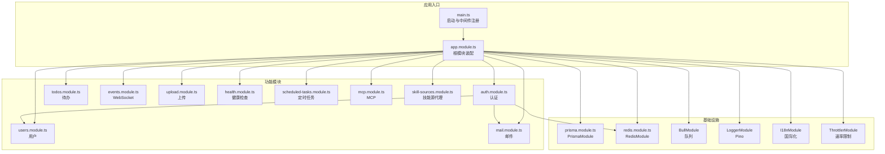
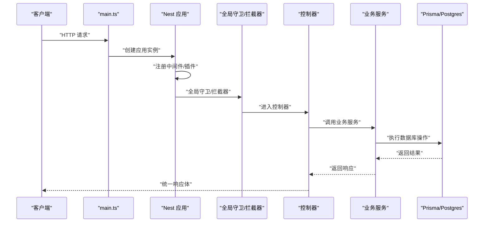
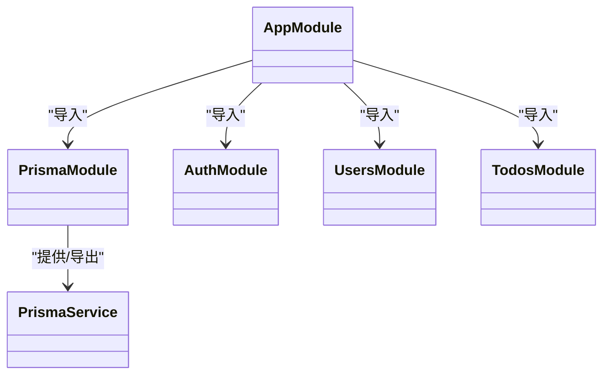
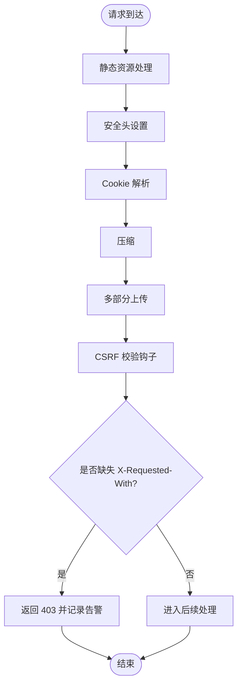
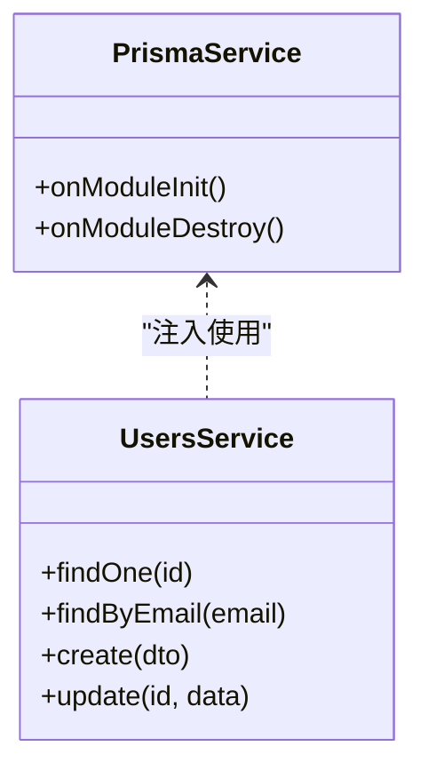
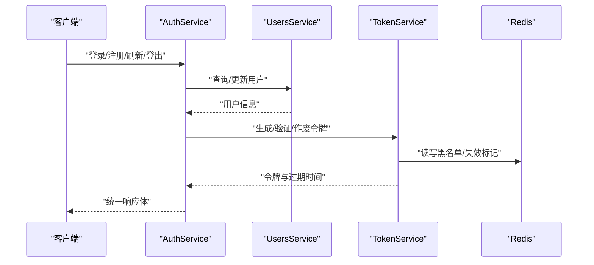
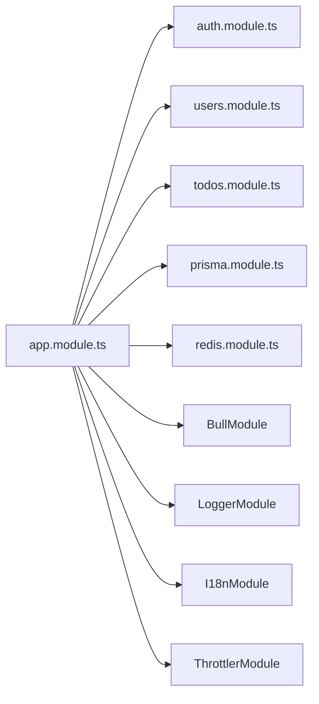

# 后端架构

<cite>
**本文引用的文件**
- [apps/backend/src/app.module.ts](file://apps/backend/src/app.module.ts)
- [apps/backend/src/main.ts](file://apps/backend/src/main.ts)
- [apps/backend/package.json](file://apps/backend/package.json)
- [apps/backend/src/prisma/prisma.module.ts](file://apps/backend/src/prisma/prisma.module.ts)
- [apps/backend/src/prisma/prisma.service.ts](file://apps/backend/src/prisma/prisma.service.ts)
- [apps/backend/src/auth/auth.module.ts](file://apps/backend/src/auth/auth.module.ts)
- [apps/backend/src/auth/auth.service.ts](file://apps/backend/src/auth/auth.service.ts)
- [apps/backend/src/auth/token.service.ts](file://apps/backend/src/auth/token.service.ts)
- [apps/backend/src/auth/password.service.ts](file://apps/backend/src/auth/password.service.ts)
- [apps/backend/src/auth/jwt-auth.guard.ts](file://apps/backend/src/auth/jwt-auth.guard.ts)
- [apps/backend/src/users/users.module.ts](file://apps/backend/src/users/users.module.ts)
- [apps/backend/src/users/users.service.ts](file://apps/backend/src/users/users.service.ts)
- [apps/backend/src/todos/todos.module.ts](file://apps/backend/src/todos/todos.module.ts)
</cite>

## 目录
1. [引言](#引言)
2. [项目结构](#项目结构)
3. [核心组件](#核心组件)
4. [架构总览](#架构总览)
5. [详细组件分析](#详细组件分析)
6. [依赖关系分析](#依赖关系分析)
7. [性能考量](#性能考量)
8. [故障排查指南](#故障排查指南)
9. [结论](#结论)
10. [附录](#附录)

## 引言
本文件面向后端开发者，系统性梳理 Lumina Todo 后端（NestJS + Fastify）的整体架构与实现细节，覆盖模块化组织、依赖注入、中间件与安全、Prisma ORM、REST 设计与控制器、JWT 认证与权限、健康检查与日志、缓存与队列、定时任务与异步处理等主题，并提供最佳实践与排障建议。

## 项目结构
后端采用多模块分层组织，根模块负责全局配置与模块装配；各功能域以独立模块划分，如认证、用户、待办、邮件、事件、上传、定时任务、技能源与 MCP 等。应用通过 Fastify 适配器提供高性能 HTTP 服务，结合 Pino 日志、Swagger 文档、Zod 验证、BullMQ 队列、Redis 缓存与速率限制等基础设施。

图表来源
- [apps/backend/src/app.module.ts:1-160](file://apps/backend/src/app.module.ts#L1-L160)
- [apps/backend/src/main.ts:1-211](file://apps/backend/src/main.ts#L1-L211)

章节来源
- [apps/backend/src/app.module.ts:1-160](file://apps/backend/src/app.module.ts#L1-L160)
- [apps/backend/src/main.ts:1-211](file://apps/backend/src/main.ts#L1-L211)

## 核心组件
- 根模块与全局配置：集中注册日志、事件发射、队列、速率限制、国际化、Prisma、Redis、健康检查、认证、用户、邮件、事件、上传、定时任务、MCP、技能源等模块；提供全局速率守卫。
- 应用入口：基于 Fastify 的高性能适配器，启用 CORS、静态资源、Helmet 安全头、压缩、多部分上传、CSRF 校验钩子、全局管道/过滤器/拦截器、Swagger 文档、优雅退出。
- 基础设施：Prisma 通过 Postgres 适配器连接数据库；Redis 用于缓存与令牌黑名单；BullMQ 用于后台任务；Pino 统一日志；I18n 支持多语言；Throttler 结合 Redis 实现全局限流。
- 功能模块：认证模块整合 Passport/JWT、Token/Password 服务；用户模块封装用户 CRUD；待办模块提供待办项与同步；事件模块支持 WebSocket；上传模块处理文件解析与存储；定时任务模块管理周期性任务；MCP 与技能源模块提供外部能力代理。

章节来源
- [apps/backend/src/app.module.ts:1-160](file://apps/backend/src/app.module.ts#L1-L160)
- [apps/backend/src/main.ts:1-211](file://apps/backend/src/main.ts#L1-L211)
- [apps/backend/src/prisma/prisma.module.ts:1-10](file://apps/backend/src/prisma/prisma.module.ts#L1-L10)
- [apps/backend/src/prisma/prisma.service.ts:1-34](file://apps/backend/src/prisma/prisma.service.ts#L1-L34)
- [apps/backend/src/auth/auth.module.ts:1-41](file://apps/backend/src/auth/auth.module.ts#L1-L41)
- [apps/backend/src/users/users.module.ts:1-14](file://apps/backend/src/users/users.module.ts#L1-L14)
- [apps/backend/src/todos/todos.module.ts:1-15](file://apps/backend/src/todos/todos.module.ts#L1-L15)

## 架构总览
下图展示应用启动到请求处理的关键流程：入口初始化、中间件链路、全局守卫与拦截器、模块装配与服务调用。

图表来源
- [apps/backend/src/main.ts:1-211](file://apps/backend/src/main.ts#L1-L211)
- [apps/backend/src/app.module.ts:1-160](file://apps/backend/src/app.module.ts#L1-L160)

## 详细组件分析

### 模块化与依赖注入
- 根模块通过 imports 装配各子模块，providers 注入全局守卫；子模块通过 @Global() 暴露服务（如 Prisma），实现跨模块共享。
- 依赖注入采用构造函数注入，服务间通过接口与抽象解耦，便于测试与替换。

图表来源
- [apps/backend/src/app.module.ts:1-160](file://apps/backend/src/app.module.ts#L1-L160)
- [apps/backend/src/prisma/prisma.module.ts:1-10](file://apps/backend/src/prisma/prisma.module.ts#L1-L10)
- [apps/backend/src/prisma/prisma.service.ts:1-34](file://apps/backend/src/prisma/prisma.service.ts#L1-L34)

章节来源
- [apps/backend/src/app.module.ts:1-160](file://apps/backend/src/app.module.ts#L1-L160)
- [apps/backend/src/prisma/prisma.module.ts:1-10](file://apps/backend/src/prisma/prisma.module.ts#L1-L10)
- [apps/backend/src/prisma/prisma.service.ts:1-34](file://apps/backend/src/prisma/prisma.service.ts#L1-L34)

### 中间件与安全
- 中间件链：静态资源、Helmet 安全头、Cookie、压缩、多部分上传、CSRF 校验钩子。
- CSRF 防护：对非安全方法请求校验 X-Requested-With 头，缺失则拒绝并记录告警。
- 安全头：CSP、跨源嵌入/资源策略等，降低常见 Web 攻击面。
- 全局管道/过滤器/拦截器：Zod 验证、异常过滤、响应转换、XSS 清理。

图表来源
- [apps/backend/src/main.ts:125-167](file://apps/backend/src/main.ts#L125-L167)

章节来源
- [apps/backend/src/main.ts:1-211](file://apps/backend/src/main.ts#L1-L211)

### Prisma ORM 与数据库设计
- 连接方式：通过 Postgres 适配器与连接池建立连接，模块化导出服务，生命周期中自动连接/断开。
- 查询封装：服务层统一调用 Prisma 客户端，返回格式化后的领域对象；对敏感字段进行脱敏处理。
- 数据一致性：利用 Prisma 的事务与唯一约束保障业务一致性；错误类型映射为标准异常。

图表来源
- [apps/backend/src/prisma/prisma.service.ts:1-34](file://apps/backend/src/prisma/prisma.service.ts#L1-L34)
- [apps/backend/src/users/users.service.ts:1-118](file://apps/backend/src/users/users.service.ts#L1-L118)

章节来源
- [apps/backend/src/prisma/prisma.module.ts:1-10](file://apps/backend/src/prisma/prisma.module.ts#L1-L10)
- [apps/backend/src/prisma/prisma.service.ts:1-34](file://apps/backend/src/prisma/prisma.service.ts#L1-L34)
- [apps/backend/src/users/users.service.ts:1-118](file://apps/backend/src/users/users.service.ts#L1-L118)

### REST 设计与控制器实现
- 统一响应：全局拦截器将业务返回包装为统一结构；异常过滤器将错误标准化。
- 参数验证：Zod 管道替代 class-validator，提升类型安全与文档生成质量。
- 控制器职责：仅编排请求/响应，不承载复杂业务；业务逻辑下沉至服务层。
- 示例模块：认证、用户、待办等模块均遵循上述模式，控制器与服务一一对应。

章节来源
- [apps/backend/src/main.ts:169-179](file://apps/backend/src/main.ts#L169-L179)
- [apps/backend/src/auth/auth.module.ts:1-41](file://apps/backend/src/auth/auth.module.ts#L1-L41)
- [apps/backend/src/users/users.module.ts:1-14](file://apps/backend/src/users/users.module.ts#L1-L14)
- [apps/backend/src/todos/todos.module.ts:1-15](file://apps/backend/src/todos/todos.module.ts#L1-L15)

### JWT 认证机制与权限控制
- 双令牌模型：短期访问令牌与长期刷新令牌，分别签名密钥可分离，生产环境强制配置刷新密钥。
- 令牌验证：支持同时验证访问/刷新令牌；访问令牌验证严格限定类型。
- 会话失效：通过 Redis 记录用户最后失效时间戳，刷新时校验令牌签发时间与失效时间。
- 黑名单：将过期或主动作废的令牌写入 Redis 黑名单，短时有效，避免重复使用。
- 登录/注册/刷新/登出：由认证服务编排用户服务、令牌服务与密码服务，统一返回结构。

图表来源
- [apps/backend/src/auth/auth.service.ts:1-127](file://apps/backend/src/auth/auth.service.ts#L1-L127)
- [apps/backend/src/auth/token.service.ts:1-187](file://apps/backend/src/auth/token.service.ts#L1-L187)
- [apps/backend/src/auth/password.service.ts:1-100](file://apps/backend/src/auth/password.service.ts#L1-L100)
- [apps/backend/src/users/users.service.ts:1-118](file://apps/backend/src/users/users.service.ts#L1-L118)

章节来源
- [apps/backend/src/auth/auth.module.ts:1-41](file://apps/backend/src/auth/auth.module.ts#L1-L41)
- [apps/backend/src/auth/auth.service.ts:1-127](file://apps/backend/src/auth/auth.service.ts#L1-L127)
- [apps/backend/src/auth/token.service.ts:1-187](file://apps/backend/src/auth/token.service.ts#L1-L187)
- [apps/backend/src/auth/password.service.ts:1-100](file://apps/backend/src/auth/password.service.ts#L1-L100)
- [apps/backend/src/auth/jwt-auth.guard.ts:1-10](file://apps/backend/src/auth/jwt-auth.guard.ts#L1-L10)
- [apps/backend/src/users/users.service.ts:1-118](file://apps/backend/src/users/users.service.ts#L1-L118)

### 健康检查、监控与日志
- 健康检查：Terminus 集成数据库与 Redis 健康探针，提供 Liveness/Readiness。
- 日志系统：Pino 全局日志器，按状态码动态日志级别，自定义请求日志格式，区分成功/错误消息，JSON 输出（生产）与彩色输出（开发）。
- 监控告警：建议结合外部监控平台采集日志与指标，结合健康检查端点进行容器编排与自动恢复。

章节来源
- [apps/backend/src/app.module.ts:35-89](file://apps/backend/src/app.module.ts#L35-L89)
- [apps/backend/src/health/health.module.ts](file://apps/backend/src/health/health.module.ts)

### 缓存策略、队列与异步任务
- 缓存：Redis 用于令牌黑名单、会话失效标记、通用缓存键空间；TokenService 使用带前缀的缓存键，配合 TTL 管理。
- 队列：BullMQ 作为后台任务队列，默认连接 Redis，配置完成即移除、失败重试与指数退避策略。
- 定时任务：ScheduledTasksModule 提供周期性任务处理器，适合定时清理、统计等场景。

章节来源
- [apps/backend/src/app.module.ts:97-116](file://apps/backend/src/app.module.ts#L97-L116)
- [apps/backend/src/auth/token.service.ts:47-76](file://apps/backend/src/auth/token.service.ts#L47-L76)
- [apps/backend/src/scheduled-tasks/scheduled-tasks.module.ts](file://apps/backend/src/scheduled-tasks/scheduled-tasks.module.ts)

### 文件上传与存储
- 多部分上传：Fastify 插件配置最大文件大小与数量，统一在上传模块中解析与存储。
- 存储服务：抽象存储接口，支持本地/云存储扩展（示例中使用 S3 客户端依赖）。

章节来源
- [apps/backend/src/main.ts:116-123](file://apps/backend/src/main.ts#L116-L123)
- [apps/backend/src/upload/upload.module.ts](file://apps/backend/src/upload/upload.module.ts)

### 事件与实时通信
- WebSocket：EventEmitter 与 Socket.IO 集成，支持事件广播与房间管理，适用于实时通知与协作场景。

章节来源
- [apps/backend/src/events/events.module.ts](file://apps/backend/src/events/events.module.ts)

### 国际化与文档
- 国际化：nestjs-i18n 加载本地化资源，支持请求头与 Accept-Language 解析。
- API 文档：Swagger 生成 OpenAPI 文档，结合 Zod 清洗工具提升文档质量。

章节来源
- [apps/backend/src/app.module.ts:124-133](file://apps/backend/src/app.module.ts#L124-L133)
- [apps/backend/src/main.ts:181-190](file://apps/backend/src/main.ts#L181-L190)

## 依赖关系分析
- 模块耦合：根模块聚合各子模块；认证模块依赖用户、邮件、Redis；用户/待办模块依赖 Prisma；队列/缓存/日志/国际化/限流均为全局基础设施。
- 外部依赖：Fastify、Prisma、BullMQ、Redis、Pino、I18n、Swagger、Passport/JWT、Bcrypt、Nodemailer 等。

图表来源
- [apps/backend/src/app.module.ts:1-160](file://apps/backend/src/app.module.ts#L1-L160)

章节来源
- [apps/backend/src/app.module.ts:1-160](file://apps/backend/src/app.module.ts#L1-L160)
- [apps/backend/package.json:31-86](file://apps/backend/package.json#L31-L86)

## 性能考量
- 传输与序列化：Fastify 适配器、Gzip 压缩、Pino JSON 输出；静态资源缓存友好。
- 数据库：Prisma Pg 适配器与连接池，建议合理设置连接数与慢查询监控。
- 缓存：热点数据与令牌黑名单使用 Redis，注意键空间前缀与 TTL 策略。
- 队列：后台任务异步化，避免阻塞主请求；失败重试与退避策略降低抖动。
- 限流：全局 Redis 限流，结合业务场景调整阈值与窗口。

## 故障排查指南
- 启动失败：检查 DATABASE_URL、JWT_SECRET、JWT_REFRESH_SECRET、REDIS_* 等环境变量；查看 Pino 启动日志。
- 认证异常：核对令牌签名密钥、过期时间、黑名单状态与用户失效标记；确认刷新令牌类型与签发时间。
- 上传失败：检查上传大小/文件数量限制、静态目录权限与磁盘空间。
- 队列异常：确认 Redis 连接、队列作业默认选项与重试策略；查看失败作业保留以便排查。
- 健康检查：通过 /api/health/liveness 与 /api/health/readiness 排查数据库与 Redis 状态。

章节来源
- [apps/backend/src/main.ts:196-204](file://apps/backend/src/main.ts#L196-L204)
- [apps/backend/src/auth/token.service.ts:130-170](file://apps/backend/src/auth/token.service.ts#L130-L170)
- [apps/backend/src/prisma/prisma.service.ts:10-21](file://apps/backend/src/prisma/prisma.service.ts#L10-L21)

## 结论
该后端以 NestJS 为核心，结合 Fastify、Prisma、Redis、BullMQ、Pino、Swagger 等技术栈，构建了模块化、可扩展、可观测且安全的系统。通过双令牌模型、会话失效与黑名单机制强化认证安全；通过统一响应、异常过滤与 Zod 验证提升 API 质量；通过队列与定时任务实现异步化与自动化。建议在生产环境中完善监控告警、数据库索引与慢查询治理，并持续优化缓存命中率与队列吞吐。

## 附录
- 开发与运维脚本：构建、测试、Lint、Prisma 命令等。
- 依赖清单：核心包与版本范围。

章节来源
- [apps/backend/package.json:7-29](file://apps/backend/package.json#L7-L29)
- [apps/backend/package.json:31-86](file://apps/backend/package.json#L31-L86)