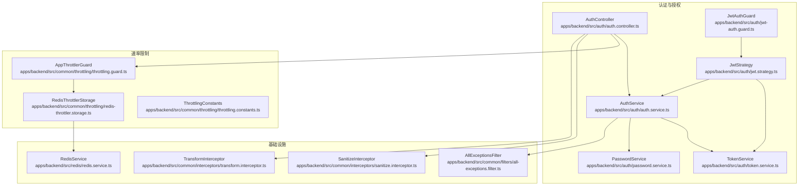
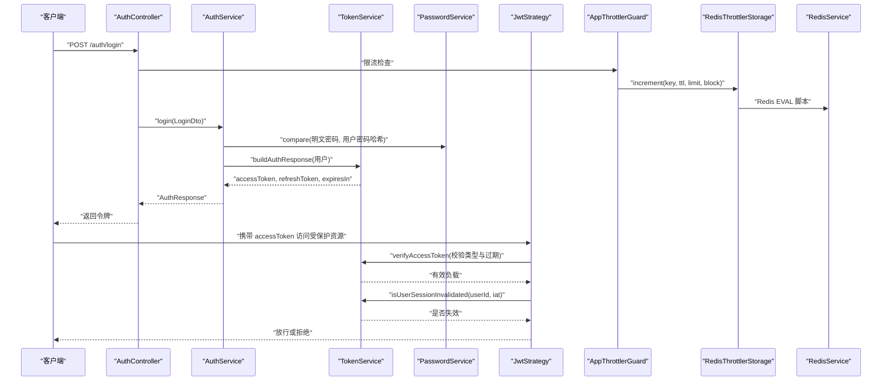
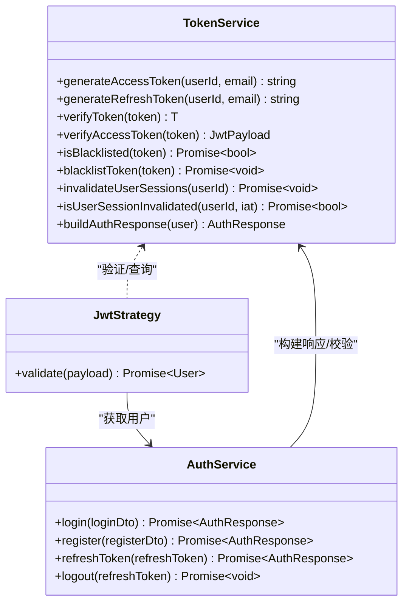
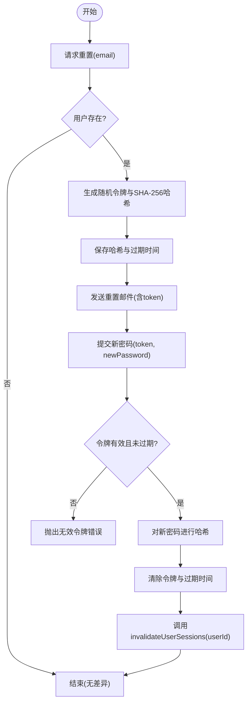
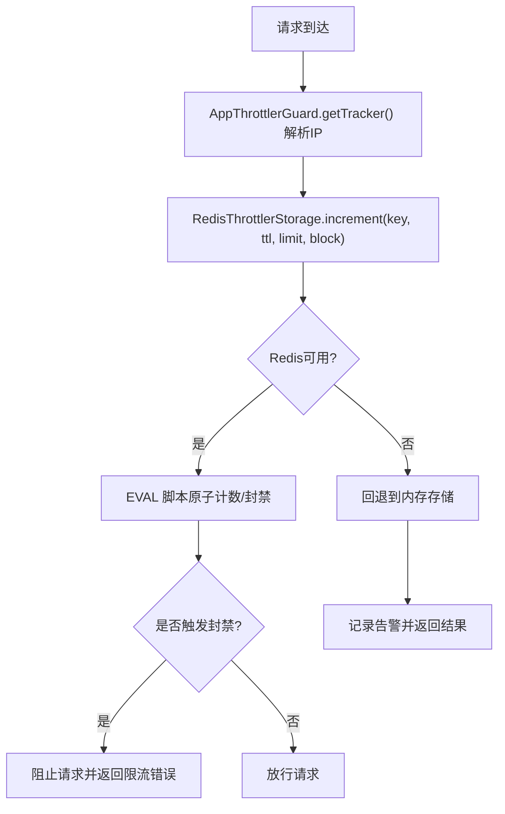
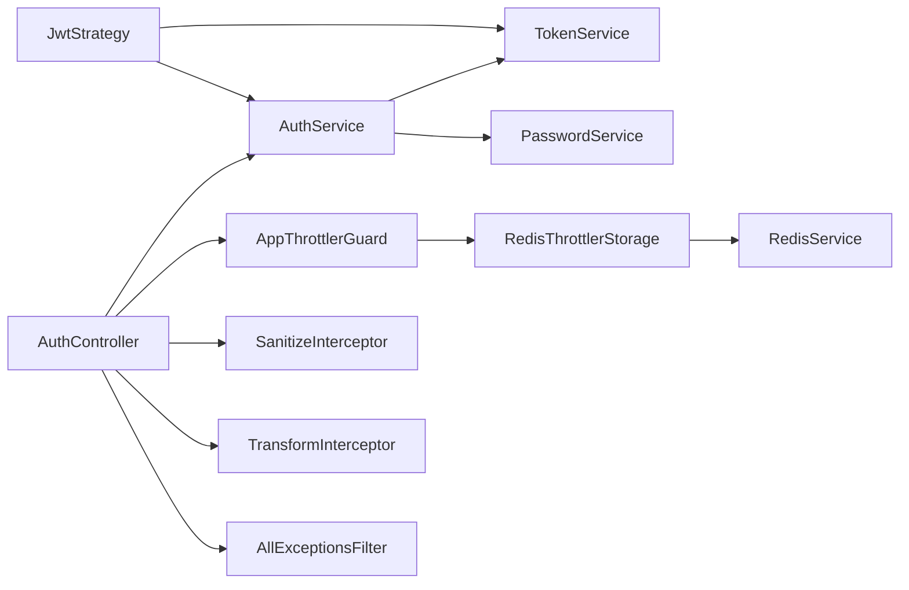

# 安全机制

<cite>
**本文引用的文件**
- [apps/backend/src/auth/auth.service.ts](file://apps/backend/src/auth/auth.service.ts)
- [apps/backend/src/auth/token.service.ts](file://apps/backend/src/auth/token.service.ts)
- [apps/backend/src/auth/password.service.ts](file://apps/backend/src/auth/password.service.ts)
- [apps/backend/src/auth/jwt.strategy.ts](file://apps/backend/src/auth/jwt.strategy.ts)
- [apps/backend/src/auth/jwt-auth.guard.ts](file://apps/backend/src/auth/jwt-auth.guard.ts)
- [apps/backend/src/auth/auth.controller.ts](file://apps/backend/src/auth/auth.controller.ts)
- [apps/backend/src/common/throttling/throttling.guard.ts](file://apps/backend/src/common/throttling/throttling.guard.ts)
- [apps/backend/src/common/throttling/redis-throttler.storage.ts](file://apps/backend/src/common/throttling/redis-throttler.storage.ts)
- [apps/backend/src/common/throttling/throttling.constants.ts](file://apps/backend/src/common/throttling/throttling.constants.ts)
- [apps/backend/src/redis/redis.service.ts](file://apps/backend/src/redis/redis.service.ts)
- [apps/backend/src/common/filters/all-exceptions.filter.ts](file://apps/backend/src/common/filters/all-exceptions.filter.ts)
- [apps/backend/src/common/interceptors/sanitize.interceptor.ts](file://apps/backend/src/common/interceptors/sanitize.interceptor.ts)
- [apps/backend/src/common/interceptors/transform.interceptor.ts](file://apps/backend/src/common/interceptors/transform.interceptor.ts)
- [scripts/security-audit.js](file://scripts/security-audit.js)
</cite>

## 目录
1. [简介](#简介)
2. [项目结构](#项目结构)
3. [核心组件](#核心组件)
4. [架构总览](#架构总览)
5. [详细组件分析](#详细组件分析)
6. [依赖关系分析](#依赖关系分析)
7. [性能考量](#性能考量)
8. [故障排查指南](#故障排查指南)
9. [结论](#结论)
10. [附录](#附录)

## 简介
本文件系统性梳理 Lumina Todo 的安全机制，覆盖认证与授权（JWT）、密码存储与重置、会话管理、速率限制与防暴力破解、XSS 防护、异常与审计、以及安全最佳实践与渗透测试建议。目标是帮助开发者与运维人员理解现有实现、识别风险点，并指导后续加固。

## 项目结构
后端采用 NestJS 模块化组织，安全相关能力主要分布在以下模块与文件：
- 认证与授权：auth.controller、auth.service、jwt.strategy、jwt-auth.guard、token.service、password.service
- 速率限制：throttling.guard、redis-throttler.storage、throttling.constants
- 缓存与会话：redis.service
- 异常与响应：all-exceptions.filter、transform.interceptor
- 输入清理：sanitize.interceptor

图表来源
- [apps/backend/src/auth/auth.controller.ts:1-81](file://apps/backend/src/auth/auth.controller.ts#L1-L81)
- [apps/backend/src/auth/auth.service.ts:1-127](file://apps/backend/src/auth/auth.service.ts#L1-L127)
- [apps/backend/src/auth/token.service.ts:1-187](file://apps/backend/src/auth/token.service.ts#L1-L187)
- [apps/backend/src/auth/password.service.ts:1-100](file://apps/backend/src/auth/password.service.ts#L1-L100)
- [apps/backend/src/auth/jwt.strategy.ts:1-68](file://apps/backend/src/auth/jwt.strategy.ts#L1-L68)
- [apps/backend/src/auth/jwt-auth.guard.ts:1-10](file://apps/backend/src/auth/jwt-auth.guard.ts#L1-L10)
- [apps/backend/src/common/throttling/throttling.guard.ts:1-34](file://apps/backend/src/common/throttling/throttling.guard.ts#L1-L34)
- [apps/backend/src/common/throttling/redis-throttler.storage.ts:1-173](file://apps/backend/src/common/throttling/redis-throttler.storage.ts#L1-L173)
- [apps/backend/src/common/throttling/throttling.constants.ts:1-198](file://apps/backend/src/common/throttling/throttling.constants.ts#L1-L198)
- [apps/backend/src/redis/redis.service.ts:1-255](file://apps/backend/src/redis/redis.service.ts#L1-L255)
- [apps/backend/src/common/filters/all-exceptions.filter.ts:1-137](file://apps/backend/src/common/filters/all-exceptions.filter.ts#L1-L137)
- [apps/backend/src/common/interceptors/sanitize.interceptor.ts:1-64](file://apps/backend/src/common/interceptors/sanitize.interceptor.ts#L1-L64)
- [apps/backend/src/common/interceptors/transform.interceptor.ts:1-30](file://apps/backend/src/common/interceptors/transform.interceptor.ts#L1-L30)

章节来源
- [apps/backend/src/auth/auth.controller.ts:1-81](file://apps/backend/src/auth/auth.controller.ts#L1-L81)
- [apps/backend/src/auth/auth.service.ts:1-127](file://apps/backend/src/auth/auth.service.ts#L1-L127)
- [apps/backend/src/auth/token.service.ts:1-187](file://apps/backend/src/auth/token.service.ts#L1-L187)
- [apps/backend/src/auth/password.service.ts:1-100](file://apps/backend/src/auth/password.service.ts#L1-L100)
- [apps/backend/src/auth/jwt.strategy.ts:1-68](file://apps/backend/src/auth/jwt.strategy.ts#L1-L68)
- [apps/backend/src/auth/jwt-auth.guard.ts:1-10](file://apps/backend/src/auth/jwt-auth.guard.ts#L1-L10)
- [apps/backend/src/common/throttling/throttling.guard.ts:1-34](file://apps/backend/src/common/throttling/throttling.guard.ts#L1-L34)
- [apps/backend/src/common/throttling/redis-throttler.storage.ts:1-173](file://apps/backend/src/common/throttling/redis-throttler.storage.ts#L1-L173)
- [apps/backend/src/common/throttling/throttling.constants.ts:1-198](file://apps/backend/src/common/throttling/throttling.constants.ts#L1-L198)
- [apps/backend/src/redis/redis.service.ts:1-255](file://apps/backend/src/redis/redis.service.ts#L1-L255)
- [apps/backend/src/common/filters/all-exceptions.filter.ts:1-137](file://apps/backend/src/common/filters/all-exceptions.filter.ts#L1-L137)
- [apps/backend/src/common/interceptors/sanitize.interceptor.ts:1-64](file://apps/backend/src/common/interceptors/sanitize.interceptor.ts#L1-L64)
- [apps/backend/src/common/interceptors/transform.interceptor.ts:1-30](file://apps/backend/src/common/interceptors/transform.interceptor.ts#L1-L30)

## 核心组件
- JWT 认证与令牌管理：通过 TokenService 生成/验证访问与刷新令牌，结合 Redis 实现会话失效与黑名单。
- 密码安全：PasswordService 使用 bcrypt 存储密码，重置流程使用一次性哈希令牌与过期时间。
- 速率限制：基于 Redis 的原子脚本计数与封禁，支持多窗口限流策略。
- 输入清理：SanitizeInterceptor 对请求体/查询/路径参数进行 HTML/XSS 清理。
- 异常与审计：全局异常过滤器记录结构化错误日志；统一响应包装便于前端处理。
- 会话与登出：登出时将刷新令牌加入黑名单，配合会话失效标记实现强制下线。

章节来源
- [apps/backend/src/auth/token.service.ts:1-187](file://apps/backend/src/auth/token.service.ts#L1-L187)
- [apps/backend/src/auth/password.service.ts:1-100](file://apps/backend/src/auth/password.service.ts#L1-L100)
- [apps/backend/src/common/throttling/redis-throttler.storage.ts:1-173](file://apps/backend/src/common/throttling/redis-throttler.storage.ts#L1-L173)
- [apps/backend/src/common/interceptors/sanitize.interceptor.ts:1-64](file://apps/backend/src/common/interceptors/sanitize.interceptor.ts#L1-L64)
- [apps/backend/src/common/filters/all-exceptions.filter.ts:1-137](file://apps/backend/src/common/filters/all-exceptions.filter.ts#L1-L137)
- [apps/backend/src/redis/redis.service.ts:1-255](file://apps/backend/src/redis/redis.service.ts#L1-L255)

## 架构总览
下图展示认证与授权、速率限制、输入清理与异常处理的整体交互。

图表来源
- [apps/backend/src/auth/auth.controller.ts:23-28](file://apps/backend/src/auth/auth.controller.ts#L23-L28)
- [apps/backend/src/auth/auth.service.ts:41-49](file://apps/backend/src/auth/auth.service.ts#L41-L49)
- [apps/backend/src/auth/token.service.ts:175-185](file://apps/backend/src/auth/token.service.ts#L175-L185)
- [apps/backend/src/auth/password.service.ts:32-34](file://apps/backend/src/auth/password.service.ts#L32-L34)
- [apps/backend/src/auth/jwt.strategy.ts:41-66](file://apps/backend/src/auth/jwt.strategy.ts#L41-L66)
- [apps/backend/src/common/throttling/throttling.guard.ts:29-32](file://apps/backend/src/common/throttling/throttling.guard.ts#L29-L32)
- [apps/backend/src/common/throttling/redis-throttler.storage.ts:114-156](file://apps/backend/src/common/throttling/redis-throttler.storage.ts#L114-L156)
- [apps/backend/src/redis/redis.service.ts:99-121](file://apps/backend/src/redis/redis.service.ts#L99-L121)

## 详细组件分析

### JWT 认证系统
- 令牌类型与生命周期
  - 访问令牌（短期）：由 TokenService 生成，有效期可配置，默认约 15 分钟。
  - 刷新令牌（长期）：由 TokenService 生成，有效期可配置，默认约 7 天。
- 令牌生成与验证
  - 使用不同密钥分别签名访问与刷新令牌，提升安全性。
  - 验证逻辑区分访问/刷新令牌类型，避免混用。
- 会话失效与强制下线
  - 通过 Redis 记录用户“会话失效时间戳”，刷新时比较 token.iat 与失效时间决定是否有效。
  - 登出将刷新令牌加入黑名单，利用剩余 TTL 写入 Redis，确保已发出但未过期的刷新令牌立即失效。
- 认证守卫与策略
  - JwtAuthGuard 作为通用守卫，结合 JwtStrategy 在请求进入业务层前完成身份校验。
  - JwtStrategy 校验 payload 类型、用户 ID 合法性、会话是否失效，并从 AuthService 拉取最新用户状态。

图表来源
- [apps/backend/src/auth/token.service.ts:17-45](file://apps/backend/src/auth/token.service.ts#L17-L45)
- [apps/backend/src/auth/token.service.ts:78-125](file://apps/backend/src/auth/token.service.ts#L78-L125)
- [apps/backend/src/auth/token.service.ts:130-170](file://apps/backend/src/auth/token.service.ts#L130-L170)
- [apps/backend/src/auth/jwt.strategy.ts:41-66](file://apps/backend/src/auth/jwt.strategy.ts#L41-L66)
- [apps/backend/src/auth/auth.service.ts:41-101](file://apps/backend/src/auth/auth.service.ts#L41-L101)

章节来源
- [apps/backend/src/auth/token.service.ts:1-187](file://apps/backend/src/auth/token.service.ts#L1-L187)
- [apps/backend/src/auth/jwt.strategy.ts:1-68](file://apps/backend/src/auth/jwt.strategy.ts#L1-L68)
- [apps/backend/src/auth/auth.service.ts:1-127](file://apps/backend/src/auth/auth.service.ts#L1-L127)

### 密码加密与重置
- 存储策略
  - 使用 bcrypt 对密码进行加盐哈希存储，成本因子固定，保证计算强度与一致性。
- 重置流程
  - 生成随机令牌并以 SHA-256 哈希持久化，设置过期时间（可配置）。
  - 发送重置链接到用户邮箱；提交新密码时校验令牌与过期时间，成功后清除令牌并使该用户所有会话失效。
- 防枚举攻击
  - 重置请求对不存在的邮箱不暴露差异，避免邮箱枚举。

图表来源
- [apps/backend/src/auth/password.service.ts:39-61](file://apps/backend/src/auth/password.service.ts#L39-L61)
- [apps/backend/src/auth/password.service.ts:66-89](file://apps/backend/src/auth/password.service.ts#L66-L89)
- [apps/backend/src/auth/token.service.ts:47-53](file://apps/backend/src/auth/token.service.ts#L47-L53)

章节来源
- [apps/backend/src/auth/password.service.ts:1-100](file://apps/backend/src/auth/password.service.ts#L1-L100)
- [apps/backend/src/auth/token.service.ts:47-53](file://apps/backend/src/auth/token.service.ts#L47-L53)

### 会话管理与权限控制
- 会话失效
  - 通过 Redis 为用户写入“失效时间戳”，刷新令牌时比较 token.iat 与该时间戳，早于失效时间的令牌视为无效。
- 强制下线
  - 登出时将刷新令牌加入黑名单，利用其剩余有效期作为 TTL，确保旧刷新令牌无法再换取新令牌。
- 权限控制
  - 受保护路由使用 JwtAuthGuard，仅允许携带有效访问令牌的请求通过；策略层进一步校验令牌类型与用户有效性。

章节来源
- [apps/backend/src/auth/token.service.ts:47-76](file://apps/backend/src/auth/token.service.ts#L47-L76)
- [apps/backend/src/auth/token.service.ts:130-149](file://apps/backend/src/auth/token.service.ts#L130-L149)
- [apps/backend/src/auth/jwt-auth.guard.ts:1-10](file://apps/backend/src/auth/jwt-auth.guard.ts#L1-L10)
- [apps/backend/src/auth/jwt.strategy.ts:41-66](file://apps/backend/src/auth/jwt.strategy.ts#L41-L66)

### 速率限制与防暴力破解
- 限流策略
  - 支持短、中、长三个时间窗口，每个窗口独立配置 TTL 与上限，部分场景开启封禁持续时间。
  - 针对登录、注册、刷新、忘记密码、重置密码等接口分别设定更严格的策略。
- 实现细节
  - 使用 Redis EVAL 脚本原子计数，维护有序集合记录命中时间，到期清理；超过阈值即封禁并清空计数。
  - 当 Redis 不可用时回退至内存存储，同时记录告警日志。
- IP 跟踪
  - 优先使用直连 IP，若不可用则从 X-Forwarded-For 中提取最后一个非空地址，避免代理环境下的绕过。

图表来源
- [apps/backend/src/common/throttling/throttling.guard.ts:29-32](file://apps/backend/src/common/throttling/throttling.guard.ts#L29-L32)
- [apps/backend/src/common/throttling/redis-throttler.storage.ts:114-156](file://apps/backend/src/common/throttling/redis-throttler.storage.ts#L114-L156)
- [apps/backend/src/common/throttling/throttling.constants.ts:90-118](file://apps/backend/src/common/throttling/throttling.constants.ts#L90-L118)

章节来源
- [apps/backend/src/common/throttling/throttling.guard.ts:1-34](file://apps/backend/src/common/throttling/throttling.guard.ts#L1-L34)
- [apps/backend/src/common/throttling/redis-throttler.storage.ts:1-173](file://apps/backend/src/common/throttling/redis-throttler.storage.ts#L1-L173)
- [apps/backend/src/common/throttling/throttling.constants.ts:1-198](file://apps/backend/src/common/throttling/throttling.constants.ts#L1-L198)

### XSS 防护与输入清理
- SanitizeInterceptor
  - 对请求体、查询参数、路径参数进行原地递归清理，禁止任何 HTML 标签，防止脚本注入。
- 建议
  - 结合内容安全策略（CSP）与只读 Cookie 属性（如 httpOnly、secure、sameSite）进一步强化前端安全。

章节来源
- [apps/backend/src/common/interceptors/sanitize.interceptor.ts:1-64](file://apps/backend/src/common/interceptors/sanitize.interceptor.ts#L1-L64)

### CORS、CSRF 与前端安全
- CORS
  - 代码库未提供显式 CORS 配置文件，请在应用启动时按需启用并限定来源、方法与头。
- CSRF
  - 本后端为无状态 API，未使用 Cookie 传输会话；建议前端在跨站场景下禁用自动携带凭据，或在后端引入同步 CSRF Token 机制。
- XSS
  - 已在后端通过 SanitizeInterceptor 清理输入；前端渲染 Markdown 时建议使用白名单渲染库与 CSP。

章节来源
- [apps/backend/src/common/interceptors/sanitize.interceptor.ts:1-64](file://apps/backend/src/common/interceptors/sanitize.interceptor.ts#L1-L64)

### 异常监控与安全审计
- 全局异常过滤器
  - 统一记录请求方法、URL、状态码与堆栈；支持 Zod 验证错误的结构化字段映射与国际化消息。
- 审计日志
  - 建议在鉴权、敏感操作（密码修改、登出、会话失效）处增加结构化审计事件，包含用户 ID、IP、UA、时间戳与结果。
- 威胁检测
  - 结合限流封禁、异常过滤器日志与 Redis 计数，建立告警规则（如短时间内大量封禁、异常 5xx 比例上升）。

章节来源
- [apps/backend/src/common/filters/all-exceptions.filter.ts:1-137](file://apps/backend/src/common/filters/all-exceptions.filter.ts#L1-L137)

## 依赖关系分析
- 组件耦合
  - AuthService 作为门面，协调 TokenService 与 PasswordService；JwtStrategy 依赖 TokenService 进行会话失效校验。
  - 限流 Guard 与 Storage 通过 RedisService 抽象访问底层客户端，降低耦合度。
- 外部依赖
  - Redis 用于令牌黑名单、会话失效标记与限流计数；NestJS JwtService、Passport、Throttler 提供认证与限流基础能力。

图表来源
- [apps/backend/src/auth/auth.service.ts:14-21](file://apps/backend/src/auth/auth.service.ts#L14-L21)
- [apps/backend/src/auth/jwt.strategy.ts:21-25](file://apps/backend/src/auth/jwt.strategy.ts#L21-L25)
- [apps/backend/src/common/throttling/throttling.guard.ts:29-32](file://apps/backend/src/common/throttling/throttling.guard.ts#L29-L32)
- [apps/backend/src/common/throttling/redis-throttler.storage.ts:121-125](file://apps/backend/src/common/throttling/redis-throttler.storage.ts#L121-L125)
- [apps/backend/src/redis/redis.service.ts:209-211](file://apps/backend/src/redis/redis.service.ts#L209-L211)
- [apps/backend/src/auth/auth.controller.ts:18](file://apps/backend/src/auth/auth.controller.ts#L18)

章节来源
- [apps/backend/src/auth/auth.service.ts:1-127](file://apps/backend/src/auth/auth.service.ts#L1-L127)
- [apps/backend/src/auth/jwt.strategy.ts:1-68](file://apps/backend/src/auth/jwt.strategy.ts#L1-L68)
- [apps/backend/src/common/throttling/throttling.guard.ts:1-34](file://apps/backend/src/common/throttling/throttling.guard.ts#L1-L34)
- [apps/backend/src/common/throttling/redis-throttler.storage.ts:1-173](file://apps/backend/src/common/throttling/redis-throttler.storage.ts#L1-L173)
- [apps/backend/src/redis/redis.service.ts:1-255](file://apps/backend/src/redis/redis.service.ts#L1-L255)
- [apps/backend/src/auth/auth.controller.ts:1-81](file://apps/backend/src/auth/auth.controller.ts#L1-L81)

## 性能考量
- 令牌与会话
  - 访问令牌短周期设计降低泄露风险；刷新令牌与黑名单结合实现快速下线，兼顾安全与体验。
- 限流
  - Redis 原子脚本减少网络往返与竞态；内存回退保障降级可用性。
- 输入清理
  - 仅对请求参数执行清理，避免对响应做重复处理；前端仍需配合 CSP 与安全头。

## 故障排查指南
- 登录频繁失败被限流
  - 检查对应窗口的 TTL 与 limit 配置；确认是否被封禁；核对 X-Forwarded-For 是否正确传递。
- 刷新令牌无效
  - 核对刷新令牌类型与过期时间；确认用户会话是否被强制失效；检查黑名单键是否存在且 TTL 正确。
- 密码重置无效
  - 校验令牌哈希与过期时间；确认用户存在且未被锁定；查看邮件是否送达。
- 异常未本地化或字段映射缺失
  - 检查国际化上下文与错误键；确认 AllExceptionsFilter 的字段映射逻辑是否覆盖到具体场景。

章节来源
- [apps/backend/src/common/throttling/throttling.constants.ts:90-118](file://apps/backend/src/common/throttling/throttling.constants.ts#L90-L118)
- [apps/backend/src/auth/token.service.ts:130-170](file://apps/backend/src/auth/token.service.ts#L130-L170)
- [apps/backend/src/auth/password.service.ts:66-89](file://apps/backend/src/auth/password.service.ts#L66-L89)
- [apps/backend/src/common/filters/all-exceptions.filter.ts:52-117](file://apps/backend/src/common/filters/all-exceptions.filter.ts#L52-L117)

## 结论
Lumina Todo 的安全体系以 JWT 为核心，结合 Redis 实现会话失效与黑名单，辅以 bcrypt 密码存储与一次性重置令牌，形成较为完整的认证与授权闭环。速率限制采用 Redis 原子脚本，具备良好的抗暴力破解能力；输入清理与全局异常过滤器提升了整体健壮性。建议在前端补充 CORS、CSRF 与 CSP 等安全头，在后端完善审计事件与告警联动，持续开展安全扫描与渗透测试。

## 附录
- 安全扫描与渗透测试建议
  - 使用自动化工具（如 OWASP ZAP、Burp Suite）对认证端点进行爆破与参数篡改测试。
  - 针对令牌刷新、密码重置、登出等关键路径模拟并发与边界条件。
  - 审计脚本参考：[scripts/security-audit.js](file://scripts/security-audit.js)

章节来源
- [scripts/security-audit.js](file://scripts/security-audit.js)