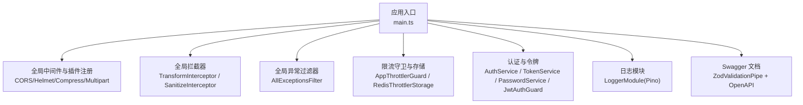
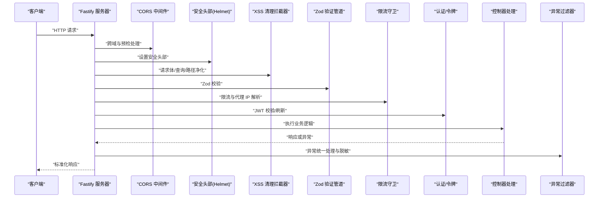
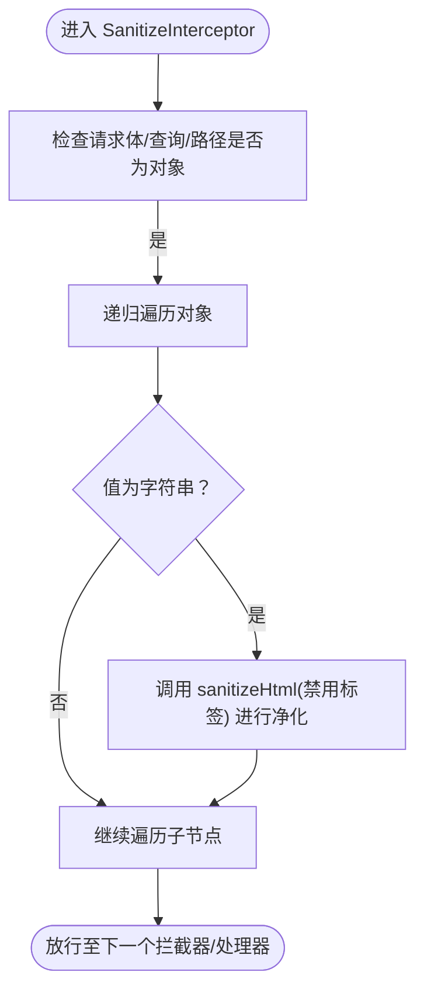
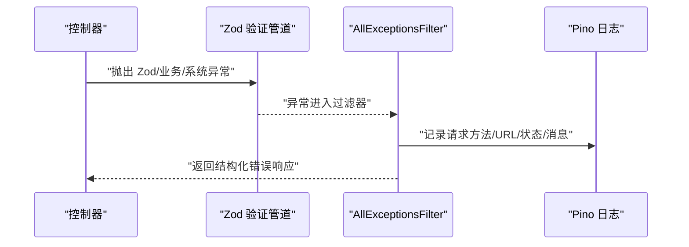
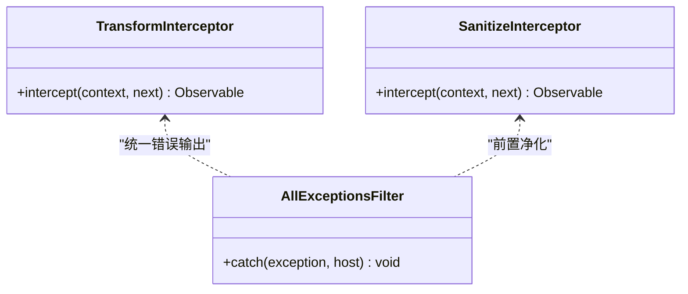
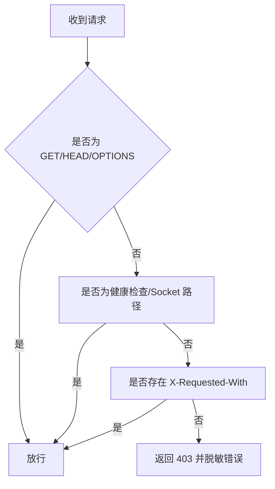
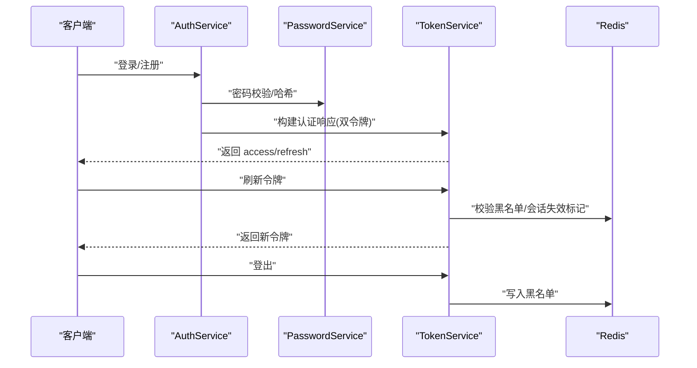
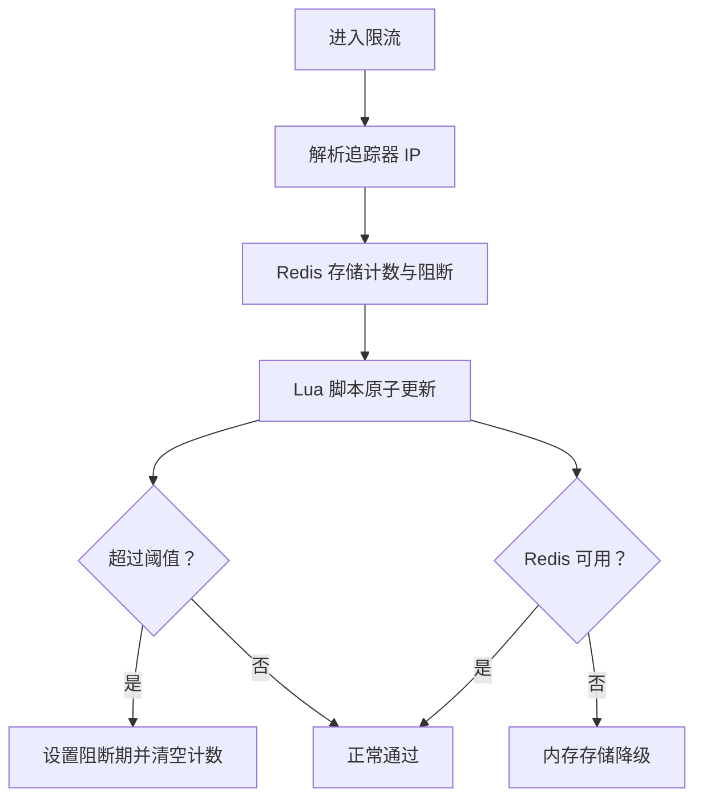
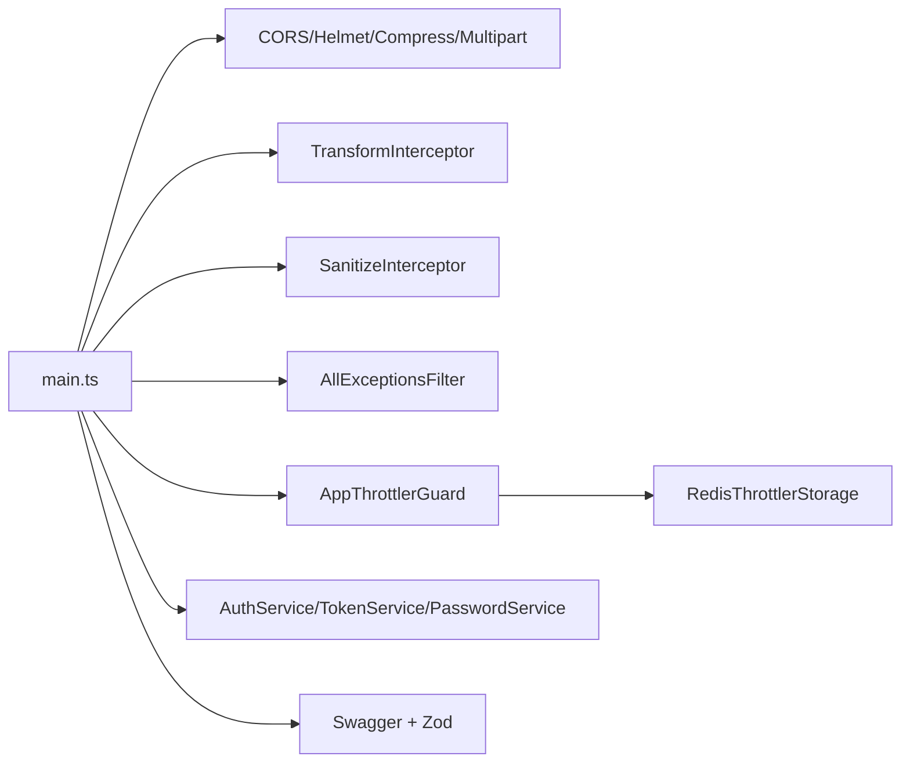

# 安全防护

<cite>
**本文引用的文件**
- [apps/backend/src/main.ts](file://apps/backend/src/main.ts)
- [apps/backend/src/app.module.ts](file://apps/backend/src/app.module.ts)
- [apps/backend/src/common/filters/all-exceptions.filter.ts](file://apps/backend/src/common/filters/all-exceptions.filter.ts)
- [apps/backend/src/common/interceptors/sanitize.interceptor.ts](file://apps/backend/src/common/interceptors/sanitize.interceptor.ts)
- [apps/backend/src/common/interceptors/transform.interceptor.ts](file://apps/backend/src/common/interceptors/transform.interceptor.ts)
- [apps/backend/src/common/throttling/throttling.guard.ts](file://apps/backend/src/common/throttling/throttling.guard.ts)
- [apps/backend/src/common/throttling/redis-throttler.storage.ts](file://apps/backend/src/common/throttling/redis-throttler.storage.ts)
- [apps/backend/src/auth/auth.service.ts](file://apps/backend/src/auth/auth.service.ts)
- [apps/backend/src/auth/password.service.ts](file://apps/backend/src/auth/password.service.ts)
- [apps/backend/src/auth/token.service.ts](file://apps/backend/src/auth/token.service.ts)
- [apps/backend/src/auth/jwt-auth.guard.ts](file://apps/backend/src/auth/jwt-auth.guard.ts)
- [scripts/security-audit.js](file://scripts/security-audit.js)
- [SECURITY.md](file://SECURITY.md)
</cite>

## 目录

1. [简介](#简介)
2. [项目结构](#项目结构)
3. [核心组件](#核心组件)
4. [架构总览](#架构总览)
5. [详细组件分析](#详细组件分析)
6. [依赖关系分析](#依赖关系分析)
7. [性能考量](#性能考量)
8. [故障排查指南](#故障排查指南)
9. [结论](#结论)
10. [附录](#附录)

## 简介

本文件面向 Lumina Todo 安全防护体系，系统性梳理后端安全机制与实践，覆盖输入验证与数据净化（XSS 防护、SQL 注入缓解、恶意代码过滤）、HTTP 异常过滤器与错误脱敏、请求拦截器的数据转换与安全检查、CORS 配置与跨域控制、安全头部与 HTTPS 强制跳转、安全 Cookie 设置、安全审计与异常监控、威胁检测与应急响应流程。文档以代码为依据，辅以可视化图示帮助不同背景读者理解。

## 项目结构

后端采用 NestJS + Fastify 架构，安全能力通过全局中间件、拦截器、异常过滤器、守卫与限流策略共同实现，并结合 Helmet、Cookie、压缩与静态资源托管等插件强化传输层与内容层安全。

图表来源

- [apps/backend/src/main.ts:34-211](file://apps/backend/src/main.ts#L34-L211)
- [apps/backend/src/app.module.ts:155-160](file://apps/backend/src/app.module.ts#L155-L160)

章节来源

- [apps/backend/src/main.ts:34-211](file://apps/backend/src/main.ts#L34-L211)
- [apps/backend/src/app.module.ts:155-160](file://apps/backend/src/app.module.ts#L155-L160)

## 核心组件

- 输入验证与数据净化
  - 全局 Zod 验证管道替代 class-validator，统一校验请求体、查询与路径参数，减少 SQL 注入与格式类风险。
  - XSS 清理拦截器对请求体、查询与路径参数进行原地净化，禁止任何 HTML 标签，阻断反射型与存储型 XSS。
- HTTP 异常过滤器与错误脱敏
  - 统一捕获未处理异常，记录结构化日志，按状态码分级；对 Zod 验证错误与业务异常进行结构化错误映射与国际化处理，避免泄露内部细节。
- 请求拦截器与响应包装
  - 响应统一包装为 success/data/timestamp 结构，便于前端一致处理；XSS 清理拦截器在进入业务逻辑前完成数据净化。
- 限流与速率控制
  - 基于 Redis 的分布式限流，支持阻断期与 TTL 窗口管理，结合代理 IP 解析，有效抵御暴力破解与 DoS。
- 认证与会话安全
  - 双令牌模型（短期访问令牌 + 长期刷新令牌），支持令牌黑名单、会话失效标记与刷新令牌校验，降低令牌滥用风险。
- CORS、安全头部与传输安全
  - 精细的 CORS 策略与 Allowed-Headers 白名单；Helmet 提供 CSP、X-Frame-Options 等安全头；CSRF 预检拦截与权限策略声明。
- 安全审计与合规
  - npm audit 脚本与安全政策文档，明确漏洞上报渠道与范围。

章节来源

- [apps/backend/src/main.ts:169-179](file://apps/backend/src/main.ts#L169-L179)
- [apps/backend/src/common/interceptors/sanitize.interceptor.ts:1-64](file://apps/backend/src/common/interceptors/sanitize.interceptor.ts#L1-L64)
- [apps/backend/src/common/filters/all-exceptions.filter.ts:1-137](file://apps/backend/src/common/filters/all-exceptions.filter.ts#L1-L137)
- [apps/backend/src/common/interceptors/transform.interceptor.ts:1-30](file://apps/backend/src/common/interceptors/transform.interceptor.ts#L1-L30)
- [apps/backend/src/common/throttling/throttling.guard.ts:1-34](file://apps/backend/src/common/throttling/throttling.guard.ts#L1-L34)
- [apps/backend/src/common/throttling/redis-throttler.storage.ts:1-173](file://apps/backend/src/common/throttling/redis-throttler.storage.ts#L1-L173)
- [apps/backend/src/auth/auth.service.ts:1-127](file://apps/backend/src/auth/auth.service.ts#L1-L127)
- [apps/backend/src/auth/token.service.ts:1-187](file://apps/backend/src/auth/token.service.ts#L1-L187)
- [apps/backend/src/auth/password.service.ts:1-100](file://apps/backend/src/auth/password.service.ts#L1-L100)
- [apps/backend/src/auth/jwt-auth.guard.ts:1-10](file://apps/backend/src/auth/jwt-auth.guard.ts#L1-L10)
- [scripts/security-audit.js:1-53](file://scripts/security-audit.js#L1-L53)
- [SECURITY.md:1-40](file://SECURITY.md#L1-L40)

## 架构总览

下图展示请求在系统中的流转与安全控制点，包括输入净化、验证、拦截、限流、认证与异常处理。

图表来源

- [apps/backend/src/main.ts:48-179](file://apps/backend/src/main.ts#L48-L179)
- [apps/backend/src/common/interceptors/sanitize.interceptor.ts:17-36](file://apps/backend/src/common/interceptors/sanitize.interceptor.ts#L17-L36)
- [apps/backend/src/common/filters/all-exceptions.filter.ts:27-135](file://apps/backend/src/common/filters/all-exceptions.filter.ts#L27-L135)
- [apps/backend/src/common/throttling/throttling.guard.ts:29-32](file://apps/backend/src/common/throttling/throttling.guard.ts#L29-L32)

## 详细组件分析

### 输入验证与数据净化（XSS、SQL 注入、恶意代码过滤）

- Zod 验证管道
  - 在应用启动阶段启用全局 Zod 验证管道，替代 class-validator，统一校验请求载荷，减少因类型不匹配导致的注入与解析异常。
- XSS 清理拦截器
  - 对请求体、查询参数与路径参数进行原地递归净化，禁用所有标签与属性，阻断反射型与存储型 XSS。
- SQL 注入缓解
  - 通过 ORM 层与参数化查询（Prisma）配合 Zod 类型约束，避免拼接式 SQL；同时严格白名单允许字段与格式，降低注入面。

图表来源

- [apps/backend/src/common/interceptors/sanitize.interceptor.ts:41-62](file://apps/backend/src/common/interceptors/sanitize.interceptor.ts#L41-L62)

章节来源

- [apps/backend/src/main.ts:169-170](file://apps/backend/src/main.ts#L169-L170)
- [apps/backend/src/common/interceptors/sanitize.interceptor.ts:1-64](file://apps/backend/src/common/interceptors/sanitize.interceptor.ts#L1-L64)

### HTTP 异常过滤器与错误脱敏

- 统一异常捕获
  - 捕获所有未处理异常，提取 HTTP 状态码与请求上下文，记录结构化日志。
- Zod 验证错误结构化映射
  - 将 Zod issues 转换为字段级错误对象，支持国际化键与参数替换，避免泄露内部堆栈。
- 业务异常与国际化
  - 对冲突类等业务异常进行字段映射与消息翻译，保证错误信息可读且不暴露敏感细节。
- 标准化响应
  - 输出 success/data/message/errors/statusCode/timestamp，便于前端统一处理与展示。

图表来源

- [apps/backend/src/common/filters/all-exceptions.filter.ts:27-135](file://apps/backend/src/common/filters/all-exceptions.filter.ts#L27-L135)
- [apps/backend/src/app.module.ts:35-89](file://apps/backend/src/app.module.ts#L35-L89)

章节来源

- [apps/backend/src/common/filters/all-exceptions.filter.ts:1-137](file://apps/backend/src/common/filters/all-exceptions.filter.ts#L1-L137)
- [apps/backend/src/app.module.ts:35-89](file://apps/backend/src/app.module.ts#L35-L89)

### 请求拦截器：数据转换、格式验证与安全检查

- 响应转换拦截器
  - 将成功响应统一包装为 success/data/timestamp，提升一致性与可观测性。
- XSS 清理拦截器
  - 在进入业务逻辑前完成输入净化，确保后续处理仅面对“安全”的数据。
- 与 Zod 验证协同
  - 验证失败由 Zod 验证管道拦截，交由异常过滤器统一输出，避免异常穿透。

图表来源

- [apps/backend/src/common/interceptors/transform.interceptor.ts:19-29](file://apps/backend/src/common/interceptors/transform.interceptor.ts#L19-L29)
- [apps/backend/src/common/interceptors/sanitize.interceptor.ts:10-36](file://apps/backend/src/common/interceptors/sanitize.interceptor.ts#L10-L36)
- [apps/backend/src/common/filters/all-exceptions.filter.ts:17-135](file://apps/backend/src/common/filters/all-exceptions.filter.ts#L17-L135)

章节来源

- [apps/backend/src/common/interceptors/transform.interceptor.ts:1-30](file://apps/backend/src/common/interceptors/transform.interceptor.ts#L1-L30)
- [apps/backend/src/common/interceptors/sanitize.interceptor.ts:1-64](file://apps/backend/src/common/interceptors/sanitize.interceptor.ts#L1-L64)

### CORS 配置策略、跨域请求控制与预检处理

- CORS 策略
  - 动态来源列表，支持显式白名单与通配符模式；允许凭证；限定方法与头部。
- 预检与安全校验
  - onRequest 钩子对非安全方法进行 CSRF 预检校验，缺失 X-Requested-With 头部直接拒绝，降低 CSRF 风险。
- 静态资源托管
  - 通过 Fastify Static 提供受控的公开资源前缀，避免直接暴露后端目录。

图表来源

- [apps/backend/src/main.ts:133-167](file://apps/backend/src/main.ts#L133-L167)

章节来源

- [apps/backend/src/main.ts:48-63](file://apps/backend/src/main.ts#L48-L63)
- [apps/backend/src/main.ts:133-167](file://apps/backend/src/main.ts#L133-L167)

### 安全头部、HTTPS 强制与安全 Cookie

- Helmet 安全头
  - 设置 CSP、X-Frame-Options、X-Content-Type-Options、Referrer-Policy 等；CSP 中默认仅 self，样式允许 unsafe-inline，脚本仅 self，图片允许 data:/https:/http:，并声明 upgradeInsecureRequests。
- 权限策略
  - 通过 onSend 钩子设置 Permissions-Policy，限制摄像头、麦克风、地理位置等权限。
- Cookie 与会话
  - 通过 @fastify/cookie 插件启用 Cookie 支持；结合 JWT 令牌模型与刷新令牌机制，降低 Cookie 泄露风险。

章节来源

- [apps/backend/src/main.ts:94-131](file://apps/backend/src/main.ts#L94-L131)
- [apps/backend/src/main.ts:109](file://apps/backend/src/main.ts#L109)

### 认证与令牌安全（XSS、SQL 注入、恶意代码之外的纵深防御）

- 双令牌模型
  - 访问令牌短期有效，刷新令牌长期有效；刷新时校验令牌类型、用户会话是否被标记失效。
- 令牌黑名单与会话失效
  - 登出与撤销操作将令牌写入黑名单，结合 Redis TTL 控制生命周期；支持按用户维度标记会话失效。
- 密码安全
  - 使用 bcrypt 进行哈希与比较；重置令牌采用 SHA-256 哈希存储，防枚举攻击；重置成功后使用户历史会话失效。

图表来源

- [apps/backend/src/auth/auth.service.ts:41-101](file://apps/backend/src/auth/auth.service.ts#L41-L101)
- [apps/backend/src/auth/password.service.ts:39-89](file://apps/backend/src/auth/password.service.ts#L39-L89)
- [apps/backend/src/auth/token.service.ts:103-170](file://apps/backend/src/auth/token.service.ts#L103-L170)

章节来源

- [apps/backend/src/auth/auth.service.ts:1-127](file://apps/backend/src/auth/auth.service.ts#L1-L127)
- [apps/backend/src/auth/password.service.ts:1-100](file://apps/backend/src/auth/password.service.ts#L1-L100)
- [apps/backend/src/auth/token.service.ts:1-187](file://apps/backend/src/auth/token.service.ts#L1-L187)
- [apps/backend/src/auth/jwt-auth.guard.ts:1-10](file://apps/backend/src/auth/jwt-auth.guard.ts#L1-L10)

### 限流与速率控制（暴力破解与 DoS 防护）

- 代理 IP 解析
  - 优先使用最后一条非空 forwarded ip，若不可用回退到直连 ip 或 unknown。
- Redis 分布式计数
  - 使用 Lua 脚本原子性维护 hits/zset、block 标记与 sequence，支持 TTL 与阻断期；异常时降级到内存存储。
- 降级与可观测性
  - 记录降级日志，保证限流功能可用性与稳定性。

图表来源

- [apps/backend/src/common/throttling/throttling.guard.ts:30-31](file://apps/backend/src/common/throttling/throttling.guard.ts#L30-L31)
- [apps/backend/src/common/throttling/redis-throttler.storage.ts:114-156](file://apps/backend/src/common/throttling/redis-throttler.storage.ts#L114-L156)

章节来源

- [apps/backend/src/common/throttling/throttling.guard.ts:1-34](file://apps/backend/src/common/throttling/throttling.guard.ts#L1-L34)
- [apps/backend/src/common/throttling/redis-throttler.storage.ts:1-173](file://apps/backend/src/common/throttling/redis-throttler.storage.ts#L1-L173)

### 安全审计日志、异常监控与威胁检测

- 安全审计
  - 通过 npm audit 脚本定期扫描生产依赖漏洞，支持忽略列表与严重级别过滤。
- 日志与监控
  - Pino 作为全局日志器，自定义日志级别与序列化器，区分成功与错误日志；异常过滤器记录结构化错误上下文。
- 威胁检测建议
  - 结合限流触发与异常频率统计，建立告警规则；对频繁的无效令牌、无效刷新、枚举类请求进行识别与阻断。

章节来源

- [scripts/security-audit.js:1-53](file://scripts/security-audit.js#L1-L53)
- [apps/backend/src/app.module.ts:35-89](file://apps/backend/src/app.module.ts#L35-L89)
- [apps/backend/src/common/filters/all-exceptions.filter.ts:38-45](file://apps/backend/src/common/filters/all-exceptions.filter.ts#L38-L45)

### 常见 Web 安全漏洞防护与应急响应

- XSS
  - 通过 XSS 清理拦截器与 CSP 限制，阻断反射型与存储型 XSS。
- CSRF
  - onRequest 钩子强制要求 X-Requested-With，结合 CORS 与 Cookie 策略降低跨站请求风险。
- SQL 注入
  - ORM 参数化 + Zod 类型约束，避免动态拼接 SQL。
- 令牌滥用
  - 双令牌模型 + 黑名单 + 会话失效标记 + 刷新令牌校验。
- 应急响应
  - 发现漏洞后立即评估影响范围，隔离受影响接口，发布修复版本并通知用户；参考安全政策文档进行披露与沟通。

章节来源

- [apps/backend/src/common/interceptors/sanitize.interceptor.ts:10-15](file://apps/backend/src/common/interceptors/sanitize.interceptor.ts#L10-L15)
- [apps/backend/src/main.ts:133-167](file://apps/backend/src/main.ts#L133-L167)
- [apps/backend/src/auth/token.service.ts:130-170](file://apps/backend/src/auth/token.service.ts#L130-L170)
- [SECURITY.md:12-40](file://SECURITY.md#L12-L40)

## 依赖关系分析

- 组件耦合
  - 异常过滤器与日志模块强耦合，确保错误可见性；拦截器与验证管道解耦，职责清晰。
  - 限流守卫依赖 Redis 存储，具备降级能力，避免单点故障。
  - 认证服务聚合密码与令牌服务，形成统一入口。
- 外部依赖
  - Fastify 插件链（Helmet、Cookie、Compress、Multipart、Static）构成传输层与内容层安全基线。
  - Swagger + Zod 生成 OpenAPI 文档，提升 API 可观测性与安全性。

图表来源

- [apps/backend/src/main.ts:48-191](file://apps/backend/src/main.ts#L48-L191)
- [apps/backend/src/common/throttling/throttling.guard.ts:29-32](file://apps/backend/src/common/throttling/throttling.guard.ts#L29-L32)
- [apps/backend/src/common/throttling/redis-throttler.storage.ts:107-156](file://apps/backend/src/common/throttling/redis-throttler.storage.ts#L107-L156)
- [apps/backend/src/auth/auth.service.ts:14-21](file://apps/backend/src/auth/auth.service.ts#L14-L21)

章节来源

- [apps/backend/src/main.ts:48-191](file://apps/backend/src/main.ts#L48-L191)
- [apps/backend/src/common/throttling/throttling.guard.ts:1-34](file://apps/backend/src/common/throttling/throttling.guard.ts#L1-L34)
- [apps/backend/src/common/throttling/redis-throttler.storage.ts:1-173](file://apps/backend/src/common/throttling/redis-throttler.storage.ts#L1-L173)
- [apps/backend/src/auth/auth.service.ts:1-127](file://apps/backend/src/auth/auth.service.ts#L1-L127)

## 性能考量

- 压缩与静态资源
  - 启用 gzip 压缩与静态资源托管，降低带宽占用；合理设置阈值与前缀，避免不必要的压缩与暴露。
- 限流与降级
  - Redis 脚本原子化计数与阻断，避免高并发下的竞态；降级到内存存储保障可用性。
- 日志级别
  - 生产环境使用 JSON 日志与自定义级别，减少格式化开销，提高可观测性。

章节来源

- [apps/backend/src/main.ts:111-123](file://apps/backend/src/main.ts#L111-L123)
- [apps/backend/src/app.module.ts:35-89](file://apps/backend/src/app.module.ts#L35-L89)
- [apps/backend/src/common/throttling/redis-throttler.storage.ts:127-156](file://apps/backend/src/common/throttling/redis-throttler.storage.ts#L127-L156)

## 故障排查指南

- 异常与错误脱敏
  - 检查异常过滤器日志，确认是否为 Zod 验证错误或业务异常；关注国际化键是否正确映射。
- XSS 清理后数据异常
  - 确认 SanitizeInterceptor 是否对目标字段生效；检查 CSP 与前端渲染逻辑。
- 限流误伤
  - 核对代理 IP 解析逻辑与 Redis 存储键命名；查看降级日志判断是否回退到内存存储。
- 认证问题
  - 校验 JWT Secret 配置、令牌类型与过期时间；检查黑名单与会话失效标记是否正确写入。

章节来源

- [apps/backend/src/common/filters/all-exceptions.filter.ts:27-135](file://apps/backend/src/common/filters/all-exceptions.filter.ts#L27-L135)
- [apps/backend/src/common/interceptors/sanitize.interceptor.ts:17-36](file://apps/backend/src/common/interceptors/sanitize.interceptor.ts#L17-L36)
- [apps/backend/src/common/throttling/throttling.guard.ts:30-31](file://apps/backend/src/common/throttling/throttling.guard.ts#L30-L31)
- [apps/backend/src/auth/token.service.ts:130-170](file://apps/backend/src/auth/token.service.ts#L130-L170)

## 结论

Lumina Todo 的安全体系以“输入净化 + 统一验证 + 异常脱敏 + 限流 + 认证令牌 + 安全头部”为核心，通过全局中间件与拦截器实现端到端防护。建议持续完善威胁检测与应急流程，保持依赖审计与配置轮换，确保系统在演进中维持高安全基线。

## 附录

- 安全政策与漏洞上报
  - 参考安全政策文档，明确受支持版本与上报渠道。
- 安全审计脚本
  - 使用脚本定期扫描生产依赖，过滤忽略项并按严重级别处理。

章节来源

- [SECURITY.md:1-40](file://SECURITY.md#L1-L40)
- [scripts/security-audit.js:1-53](file://scripts/security-audit.js#L1-L53)
