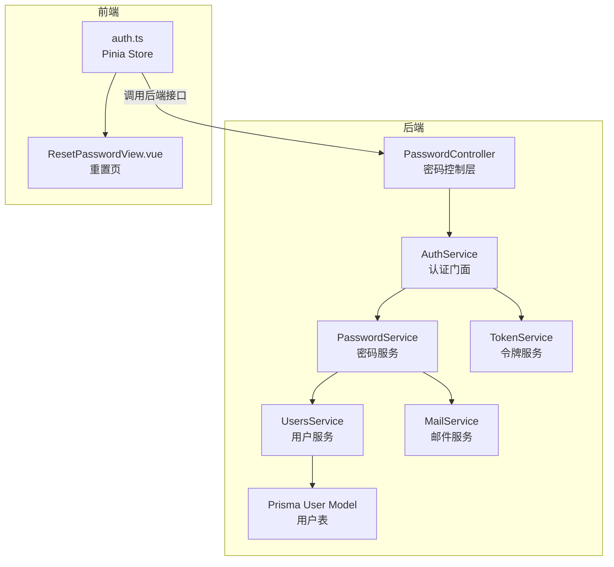
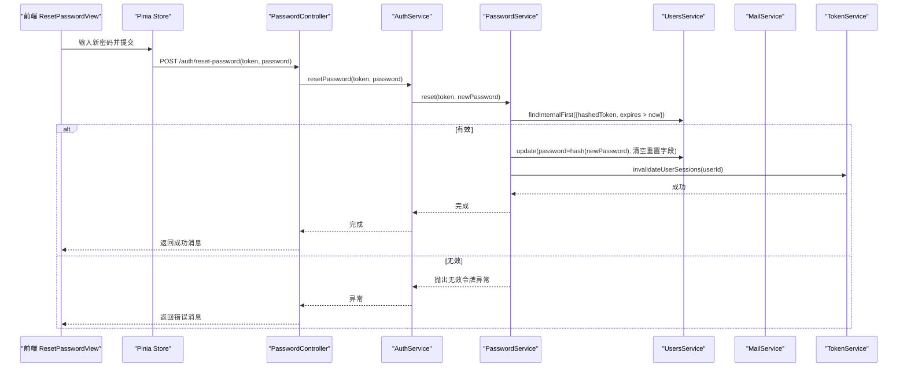
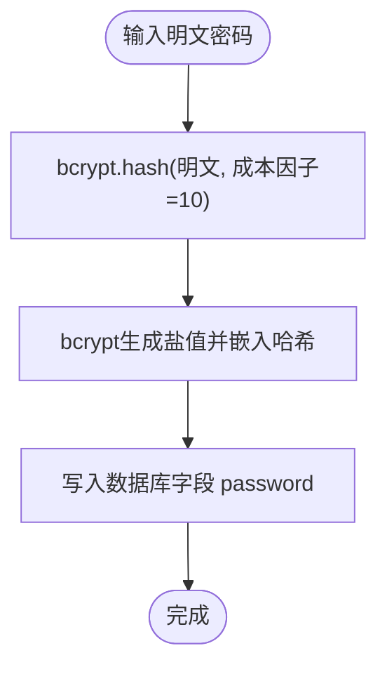
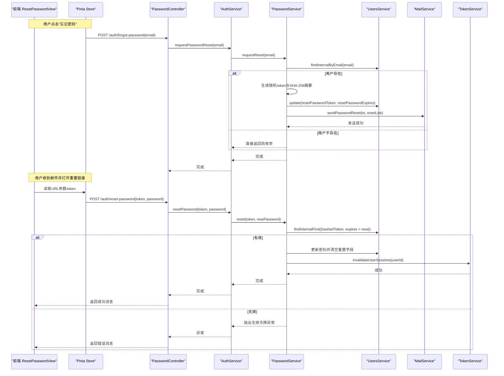
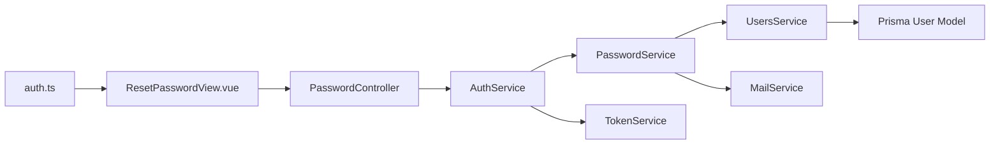

# 密码安全

<cite>
**本文引用的文件**
- [apps/backend/src/auth/password.controller.ts](file://apps/backend/src/auth/password.controller.ts)
- [apps/backend/src/auth/password.service.ts](file://apps/backend/src/auth/password.service.ts)
- [apps/backend/src/auth/auth.service.ts](file://apps/backend/src/auth/auth.service.ts)
- [apps/backend/src/auth/auth.dto.ts](file://apps/backend/src/auth/auth.dto.ts)
- [apps/backend/src/auth/token.service.ts](file://apps/backend/src/auth/token.service.ts)
- [apps/backend/src/auth/jwt.strategy.ts](file://apps/backend/src/auth/jwt.strategy.ts)
- [apps/backend/src/auth/jwt-auth.guard.ts](file://apps/backend/src/auth/jwt-auth.guard.ts)
- [apps/backend/src/users/users.service.ts](file://apps/backend/src/users/users.service.ts)
- [apps/backend/prisma/schema/user.prisma](file://apps/backend/prisma/schema/user.prisma)
- [packages/shared/src/schemas/auth.schema.ts](file://packages/shared/src/schemas/auth.schema.ts)
- [apps/backend/src/common/throttling/throttling.constants.ts](file://apps/backend/src/common/throttling/throttling.constants.ts)
- [apps/backend/src/mail/mail.service.ts](file://apps/backend/src/mail/mail.service.ts)
- [apps/backend/src/common/filters/all-exceptions.filter.ts](file://apps/backend/src/common/filters/all-exceptions.filter.ts)
- [apps/frontend/src/features/auth/views/ResetPasswordView.vue](file://apps/frontend/src/features/auth/views/ResetPasswordView.vue)
- [apps/frontend/src/features/auth/stores/auth.ts](file://apps/frontend/src/features/auth/stores/auth.ts)
</cite>

## 目录

1. [简介](#简介)
2. [项目结构](#项目结构)
3. [核心组件](#核心组件)
4. [架构总览](#架构总览)
5. [详细组件分析](#详细组件分析)
6. [依赖关系分析](#依赖关系分析)
7. [性能考量](#性能考量)
8. [故障排查指南](#故障排查指南)
9. [结论](#结论)
10. [附录](#附录)

## 简介

本文件面向 Lumina Todo 的密码安全体系，围绕以下目标展开：

- 密码加密存储机制：bcrypt 哈希、盐值生成与迭代次数配置
- 密码强度验证规则、复杂度要求与安全策略
- 密码重置流程：邮件验证与 Token 安全机制
- 密码修改流程：历史密码检查与安全审计建议
- 最佳实践、常见攻击防护与漏洞修复指南
- 密码相关 DTO 定义、控制器实现与错误处理策略

## 项目结构

后端采用 NestJS 分层架构，密码相关能力由认证模块与用户模块协作完成；前端通过 Pinia Store 调用后端接口并展示交互。

图表来源

- [apps/backend/src/auth/password.controller.ts:1-38](file://apps/backend/src/auth/password.controller.ts#L1-L38)
- [apps/backend/src/auth/auth.service.ts:1-127](file://apps/backend/src/auth/auth.service.ts#L1-L127)
- [apps/backend/src/auth/password.service.ts:1-100](file://apps/backend/src/auth/password.service.ts#L1-L100)
- [apps/backend/src/auth/token.service.ts:1-187](file://apps/backend/src/auth/token.service.ts#L1-L187)
- [apps/backend/src/users/users.service.ts:1-118](file://apps/backend/src/users/users.service.ts#L1-L118)
- [apps/backend/src/mail/mail.service.ts:1-117](file://apps/backend/src/mail/mail.service.ts#L1-L117)
- [apps/backend/prisma/schema/user.prisma:1-16](file://apps/backend/prisma/schema/user.prisma#L1-L16)
- [apps/frontend/src/features/auth/views/ResetPasswordView.vue:1-197](file://apps/frontend/src/features/auth/views/ResetPasswordView.vue#L1-L197)
- [apps/frontend/src/features/auth/stores/auth.ts:1-413](file://apps/frontend/src/features/auth/stores/auth.ts#L1-L413)

章节来源

- [apps/backend/src/auth/password.controller.ts:1-38](file://apps/backend/src/auth/password.controller.ts#L1-L38)
- [apps/backend/src/auth/auth.service.ts:1-127](file://apps/backend/src/auth/auth.service.ts#L1-L127)
- [apps/backend/src/auth/password.service.ts:1-100](file://apps/backend/src/auth/password.service.ts#L1-L100)
- [apps/backend/src/auth/token.service.ts:1-187](file://apps/backend/src/auth/token.service.ts#L1-L187)
- [apps/backend/src/users/users.service.ts:1-118](file://apps/backend/src/users/users.service.ts#L1-L118)
- [apps/backend/src/mail/mail.service.ts:1-117](file://apps/backend/src/mail/mail.service.ts#L1-L117)
- [apps/backend/prisma/schema/user.prisma:1-16](file://apps/backend/prisma/schema/user.prisma#L1-L16)
- [apps/frontend/src/features/auth/views/ResetPasswordView.vue:1-197](file://apps/frontend/src/features/auth/views/ResetPasswordView.vue#L1-L197)
- [apps/frontend/src/features/auth/stores/auth.ts:1-413](file://apps/frontend/src/features/auth/stores/auth.ts#L1-L413)

## 核心组件

- 密码控制层：暴露“忘记密码”“重置密码”接口，并应用限流策略
- 密码服务：负责 bcrypt 哈希、密码比较、重置令牌生成与校验、重置流程执行
- 认证服务：整合密码服务与令牌服务，提供统一登录/注册/重置入口
- 令牌服务：JWT 生命周期管理、会话失效标记、黑名单与刷新令牌校验
- 用户服务：用户查询、创建与更新（含密码字段）
- 邮件服务：发送密码重置邮件
- 数据模型：用户表包含 password、resetPasswordToken、resetPasswordExpires 字段
- 前端重置页与 Store：接收 token、二次确认密码、调用后端重置接口

章节来源

- [apps/backend/src/auth/password.controller.ts:1-38](file://apps/backend/src/auth/password.controller.ts#L1-L38)
- [apps/backend/src/auth/password.service.ts:1-100](file://apps/backend/src/auth/password.service.ts#L1-L100)
- [apps/backend/src/auth/auth.service.ts:1-127](file://apps/backend/src/auth/auth.service.ts#L1-L127)
- [apps/backend/src/auth/token.service.ts:1-187](file://apps/backend/src/auth/token.service.ts#L1-L187)
- [apps/backend/src/users/users.service.ts:1-118](file://apps/backend/src/users/users.service.ts#L1-L118)
- [apps/backend/prisma/schema/user.prisma:1-16](file://apps/backend/prisma/schema/user.prisma#L1-L16)
- [apps/backend/src/mail/mail.service.ts:1-117](file://apps/backend/src/mail/mail.service.ts#L1-L117)
- [apps/frontend/src/features/auth/views/ResetPasswordView.vue:1-197](file://apps/frontend/src/features/auth/views/ResetPasswordView.vue#L1-L197)
- [apps/frontend/src/features/auth/stores/auth.ts:1-413](file://apps/frontend/src/features/auth/stores/auth.ts#L1-L413)

## 架构总览

密码安全相关的关键交互如下：

图表来源

- [apps/backend/src/auth/password.controller.ts:19-36](file://apps/backend/src/auth/password.controller.ts#L19-L36)
- [apps/backend/src/auth/auth.service.ts:106-112](file://apps/backend/src/auth/auth.service.ts#L106-L112)
- [apps/backend/src/auth/password.service.ts:66-89](file://apps/backend/src/auth/password.service.ts#L66-L89)
- [apps/backend/src/users/users.service.ts:87-91](file://apps/backend/src/users/users.service.ts#L87-L91)
- [apps/backend/src/auth/token.service.ts:47-53](file://apps/backend/src/auth/token.service.ts#L47-L53)

## 详细组件分析

### 密码加密与存储机制

- bcrypt 哈希：使用 bcryptjs 对密码进行哈希，成本因子固定为 10
- 盐值生成：由 bcrypt 内部自动生成并随哈希结果存储
- 迭代次数：在 bcrypt 中称为“成本因子”，此处固定为 10
- 存储字段：用户表包含 password 字段用于存储哈希值

图表来源

- [apps/backend/src/users/users.service.ts](file://apps/backend/src/users/users.service.ts#L105)
- [apps/backend/src/auth/password.service.ts:25-27](file://apps/backend/src/auth/password.service.ts#L25-L27)

章节来源

- [apps/backend/src/users/users.service.ts](file://apps/backend/src/users/users.service.ts#L105)
- [apps/backend/src/auth/password.service.ts:25-27](file://apps/backend/src/auth/password.service.ts#L25-L27)
- [apps/backend/prisma/schema/user.prisma](file://apps/backend/prisma/schema/user.prisma#L5)

### 密码强度验证与安全策略

- 验证规则来源共享 Schema：最小长度 6、最大长度 100
- 前端重置页额外要求两次输入一致（confirmPassword）
- 建议的安全策略（最佳实践）：
  - 最小长度 ≥ 12，推荐 ≥ 16
  - 强制包含大小写字母、数字、特殊字符
  - 禁止使用常见弱口令字典
  - 引入“密码历史”限制，禁止重复最近 N 个旧密码
  - 结合速率限制与账户锁定策略

章节来源

- [packages/shared/src/schemas/auth.schema.ts:17-21](file://packages/shared/src/schemas/auth.schema.ts#L17-L21)
- [apps/frontend/src/features/auth/views/ResetPasswordView.vue:24-32](file://apps/frontend/src/features/auth/views/ResetPasswordView.vue#L24-L32)

### 密码重置流程与 Token 安全

- 令牌生成：随机 32 字节十六进制字符串作为明文 token，同时保存 SHA-256 摘要到数据库
- 过期控制：基于配置项设置过期时间（秒），查询时需满足“过期时间 > 当前时间”
- 邮件发送：构造前端重置链接，包含明文 token 参数
- 重置执行：服务端对传入 token 做 SHA-256 摘要后与数据库记录比对，通过后更新密码并清空重置字段
- 会话失效：重置成功后调用令牌服务标记该用户的会话为失效，强制重新登录

图表来源

- [apps/backend/src/auth/password.controller.ts:19-36](file://apps/backend/src/auth/password.controller.ts#L19-L36)
- [apps/backend/src/auth/auth.service.ts:106-112](file://apps/backend/src/auth/auth.service.ts#L106-L112)
- [apps/backend/src/auth/password.service.ts:39-61](file://apps/backend/src/auth/password.service.ts#L39-L61)
- [apps/backend/src/auth/password.service.ts:66-89](file://apps/backend/src/auth/password.service.ts#L66-L89)
- [apps/backend/src/users/users.service.ts:55-57](file://apps/backend/src/users/users.service.ts#L55-L57)
- [apps/backend/src/users/users.service.ts:87-91](file://apps/backend/src/users/users.service.ts#L87-L91)
- [apps/backend/src/mail/mail.service.ts:91-115](file://apps/backend/src/mail/mail.service.ts#L91-L115)
- [apps/backend/src/auth/token.service.ts:47-53](file://apps/backend/src/auth/token.service.ts#L47-L53)

章节来源

- [apps/backend/src/auth/password.service.ts:39-61](file://apps/backend/src/auth/password.service.ts#L39-L61)
- [apps/backend/src/auth/password.service.ts:66-89](file://apps/backend/src/auth/password.service.ts#L66-L89)
- [apps/backend/src/mail/mail.service.ts:91-115](file://apps/backend/src/mail/mail.service.ts#L91-L115)
- [apps/backend/src/users/users.service.ts:55-57](file://apps/backend/src/users/users.service.ts#L55-L57)
- [apps/backend/src/users/users.service.ts:87-91](file://apps/backend/src/users/users.service.ts#L87-L91)
- [apps/backend/src/auth/token.service.ts:47-53](file://apps/backend/src/auth/token.service.ts#L47-L53)

### 密码修改流程、历史密码检查与安全审计

- 当前实现要点：
  - 登录成功后返回短期访问令牌与长期刷新令牌
  - 刷新令牌时校验黑名单与会话失效标记
  - 重置密码成功后调用令牌服务使该用户会话失效
- 历史密码检查（建议增强）：
  - 在用户表新增“密码历史”字段或独立表，记录每次变更的哈希与时间戳
  - 重置/修改密码时禁止使用最近 N 条旧密码
- 安全审计（建议增强）：
  - 记录密码变更事件（时间、IP、UA、设备指纹）
  - 对异常登录（异地、高风险地区）触发二次验证或临时冻结

章节来源

- [apps/backend/src/auth/auth.service.ts:59-93](file://apps/backend/src/auth/auth.service.ts#L59-L93)
- [apps/backend/src/auth/token.service.ts:47-76](file://apps/backend/src/auth/token.service.ts#L47-L76)
- [apps/backend/src/auth/token.service.ts:130-149](file://apps/backend/src/auth/token.service.ts#L130-L149)

### DTO 定义与控制器实现

- DTO 来源：基于共享 Schema，使用 createZodDto 包装，自动生成 Swagger 文档
- 控制器：
  - POST /auth/forgot-password：请求密码重置（应用限流）
  - POST /auth/reset-password：重置密码（应用限流）

章节来源

- [apps/backend/src/auth/auth.dto.ts:1-41](file://apps/backend/src/auth/auth.dto.ts#L1-L41)
- [apps/backend/src/auth/password.controller.ts:19-36](file://apps/backend/src/auth/password.controller.ts#L19-L36)
- [apps/backend/src/common/throttling/throttling.constants.ts:108-118](file://apps/backend/src/common/throttling/throttling.constants.ts#L108-L118)

### 错误处理策略

- 全局异常过滤器：统一捕获异常，输出结构化错误响应，支持字段级错误映射与国际化
- 令牌相关错误：统一转换为 401 Unauthorized，避免泄露内部错误细节
- 密码重置错误：无效令牌抛出明确业务异常

章节来源

- [apps/backend/src/common/filters/all-exceptions.filter.ts:1-137](file://apps/backend/src/common/filters/all-exceptions.filter.ts#L1-L137)
- [apps/backend/src/auth/auth.service.ts:86-92](file://apps/backend/src/auth/auth.service.ts#L86-L92)
- [apps/backend/src/auth/password.service.ts:76-78](file://apps/backend/src/auth/password.service.ts#L76-L78)

## 依赖关系分析

- 控制器依赖认证服务，认证服务再依赖密码服务与令牌服务
- 密码服务依赖用户服务（查询/更新）、邮件服务（发送重置邮件）、令牌服务（会话失效）
- 用户服务依赖 Prisma，直接操作用户表
- 前端 Store 与视图通过 API 与后端交互

图表来源

- [apps/backend/src/auth/password.controller.ts:1-38](file://apps/backend/src/auth/password.controller.ts#L1-L38)
- [apps/backend/src/auth/auth.service.ts:1-127](file://apps/backend/src/auth/auth.service.ts#L1-L127)
- [apps/backend/src/auth/password.service.ts:1-100](file://apps/backend/src/auth/password.service.ts#L1-L100)
- [apps/backend/src/auth/token.service.ts:1-187](file://apps/backend/src/auth/token.service.ts#L1-L187)
- [apps/backend/src/users/users.service.ts:1-118](file://apps/backend/src/users/users.service.ts#L1-L118)
- [apps/backend/prisma/schema/user.prisma:1-16](file://apps/backend/prisma/schema/user.prisma#L1-L16)
- [apps/frontend/src/features/auth/views/ResetPasswordView.vue:1-197](file://apps/frontend/src/features/auth/views/ResetPasswordView.vue#L1-L197)
- [apps/frontend/src/features/auth/stores/auth.ts:1-413](file://apps/frontend/src/features/auth/stores/auth.ts#L1-L413)

章节来源

- [apps/backend/src/auth/password.controller.ts:1-38](file://apps/backend/src/auth/password.controller.ts#L1-L38)
- [apps/backend/src/auth/auth.service.ts:1-127](file://apps/backend/src/auth/auth.service.ts#L1-L127)
- [apps/backend/src/auth/password.service.ts:1-100](file://apps/backend/src/auth/password.service.ts#L1-L100)
- [apps/backend/src/auth/token.service.ts:1-187](file://apps/backend/src/auth/token.service.ts#L1-L187)
- [apps/backend/src/users/users.service.ts:1-118](file://apps/backend/src/users/users.service.ts#L1-L118)
- [apps/backend/prisma/schema/user.prisma:1-16](file://apps/backend/prisma/schema/user.prisma#L1-L16)
- [apps/frontend/src/features/auth/views/ResetPasswordView.vue:1-197](file://apps/frontend/src/features/auth/views/ResetPasswordView.vue#L1-L197)
- [apps/frontend/src/features/auth/stores/auth.ts:1-413](file://apps/frontend/src/features/auth/stores/auth.ts#L1-L413)

## 性能考量

- bcrypt 成本因子固定为 10，平衡安全性与性能；如需更高安全等级可提升至 12，但需评估 CPU 与延迟
- 重置令牌查询使用哈希字段与过期时间索引，建议在数据库层面建立复合索引以优化查询
- 限流策略已在控制器上启用，建议结合 Redis 存储器实现全局限流，避免多实例下的状态不一致

## 故障排查指南

- 重置邮件未送达
  - 检查邮件服务配置与传输器初始化
  - 确认发送方法返回布尔值并记录日志
- 无效重置令牌
  - 核对前端传递的 token 是否与数据库存储的 SHA-256 摘要一致
  - 确认过期时间是否已超过
- 登录后无法刷新令牌
  - 检查刷新令牌是否在黑名单中
  - 确认会话失效标记是否正确写入 Redis
- 429 太多请求
  - 检查限流配置与 Redis 存储器是否生效
  - 核对短/中/长窗口的 TTL 与限制值

章节来源

- [apps/backend/src/mail/mail.service.ts:43-60](file://apps/backend/src/mail/mail.service.ts#L43-L60)
- [apps/backend/src/auth/password.service.ts:66-78](file://apps/backend/src/auth/password.service.ts#L66-L78)
- [apps/backend/src/auth/token.service.ts:130-149](file://apps/backend/src/auth/token.service.ts#L130-L149)
- [apps/backend/src/common/throttling/throttling.constants.ts:108-118](file://apps/backend/src/common/throttling/throttling.constants.ts#L108-L118)

## 结论

本系统在密码存储方面采用 bcrypt 并内置盐值，具备基本抗彩虹表能力；在密码重置方面通过随机 token 与 SHA-256 摘要、过期时间与邮件联动，形成较为完整的闭环。建议进一步引入密码历史与重复检测、更强的成本因子、更严格的复杂度策略与更完善的审计能力，以满足更高安全等级需求。

## 附录

- 密码字段与重置相关字段
  - password：存储 bcrypt 哈希
  - resetPasswordToken：存储 SHA-256 摘要
  - resetPasswordExpires：重置令牌过期时间
- 前端交互
  - 重置页要求两次输入一致，提交后调用后端重置接口
  - 成功后跳转登录页

章节来源

- [apps/backend/prisma/schema/user.prisma:5-8](file://apps/backend/prisma/schema/user.prisma#L5-L8)
- [apps/frontend/src/features/auth/views/ResetPasswordView.vue:24-32](file://apps/frontend/src/features/auth/views/ResetPasswordView.vue#L24-L32)
- [apps/frontend/src/features/auth/stores/auth.ts:257-271](file://apps/frontend/src/features/auth/stores/auth.ts#L257-L271)
