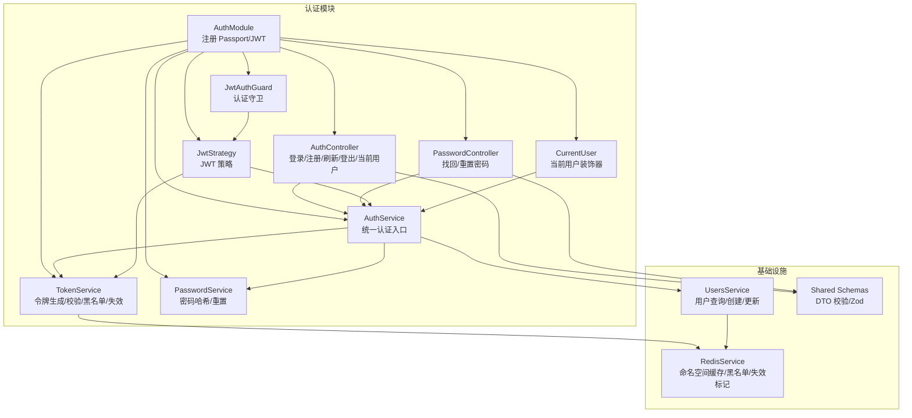
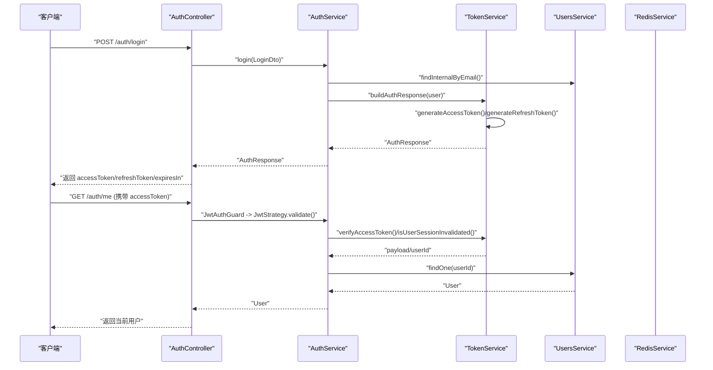
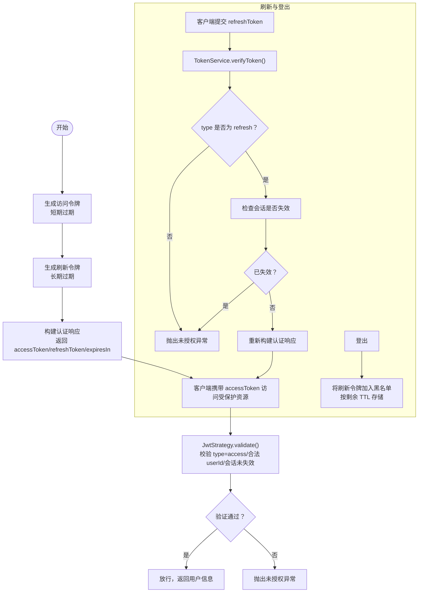
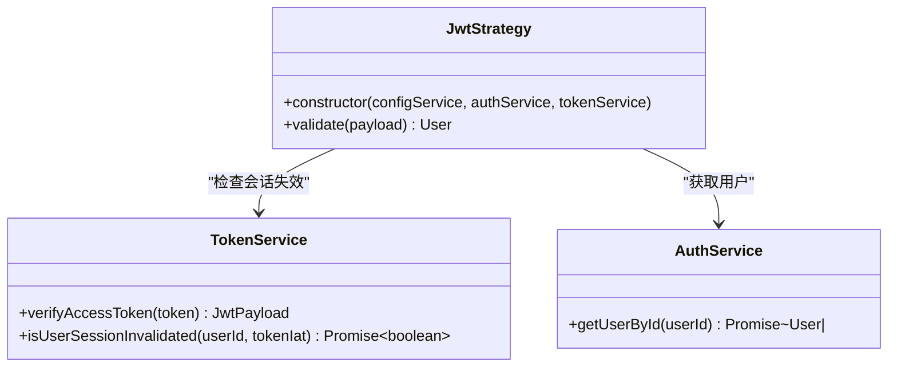
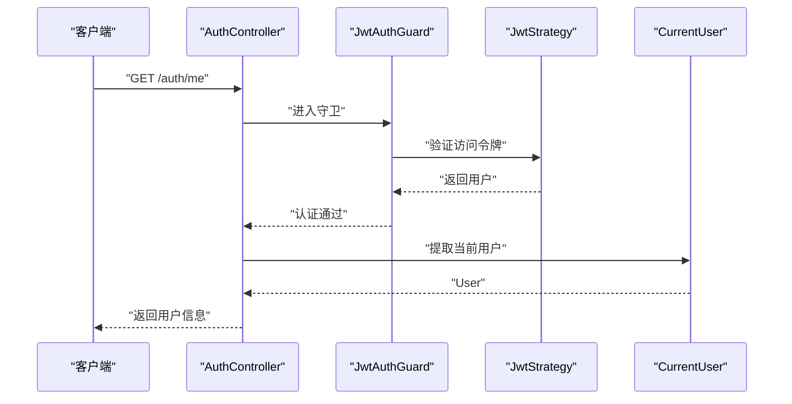
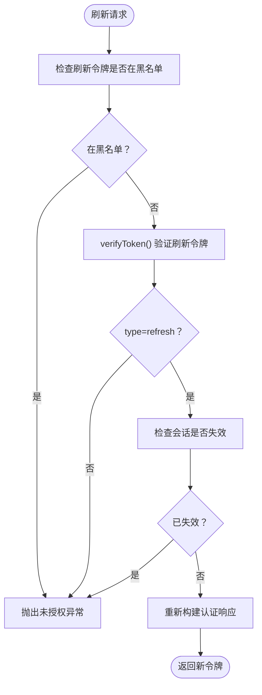
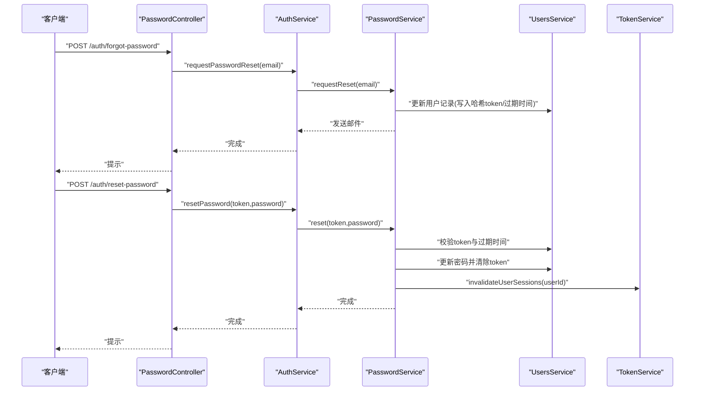
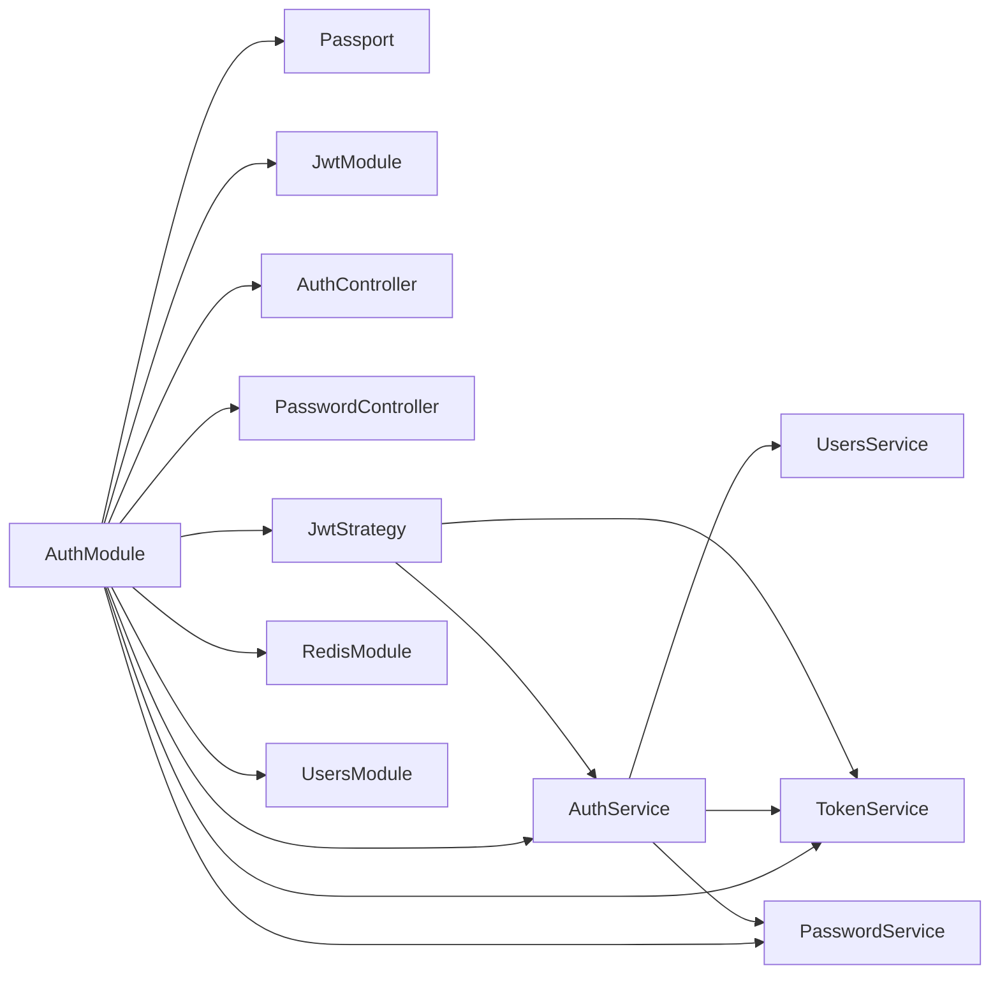

# 认证与授权

<cite>
**本文引用的文件**
- [apps/backend/src/auth/auth.module.ts](file://apps/backend/src/auth/auth.module.ts)
- [apps/backend/src/auth/auth.service.ts](file://apps/backend/src/auth/auth.service.ts)
- [apps/backend/src/auth/token.service.ts](file://apps/backend/src/auth/token.service.ts)
- [apps/backend/src/auth/jwt.strategy.ts](file://apps/backend/src/auth/jwt.strategy.ts)
- [apps/backend/src/auth/jwt-auth.guard.ts](file://apps/backend/src/auth/jwt-auth.guard.ts)
- [apps/backend/src/auth/current-user.decorator.ts](file://apps/backend/src/auth/current-user.decorator.ts)
- [apps/backend/src/auth/auth.controller.ts](file://apps/backend/src/auth/auth.controller.ts)
- [apps/backend/src/auth/password.service.ts](file://apps/backend/src/auth/password.service.ts)
- [apps/backend/src/auth/auth.dto.ts](file://apps/backend/src/auth/auth.dto.ts)
- [apps/backend/src/auth/password.controller.ts](file://apps/backend/src/auth/password.controller.ts)
- [apps/backend/src/redis/redis.service.ts](file://apps/backend/src/redis/redis.service.ts)
- [apps/backend/src/users/users.service.ts](file://apps/backend/src/users/users.service.ts)
- [packages/shared/src/schemas/auth.schema.ts](file://packages/shared/src/schemas/auth.schema.ts)
- [apps/backend/tests/auth/auth.service.spec.ts](file://apps/backend/tests/auth/auth.service.spec.ts)
- [apps/backend/tests/auth/jwt.strategy.spec.ts](file://apps/backend/tests/auth/jwt.strategy.spec.ts)
</cite>

## 目录

1. [简介](#简介)
2. [项目结构](#项目结构)
3. [核心组件](#核心组件)
4. [架构总览](#架构总览)
5. [详细组件分析](#详细组件分析)
6. [依赖关系分析](#依赖关系分析)
7. [性能考量](#性能考量)
8. [故障排查指南](#故障排查指南)
9. [结论](#结论)
10. [附录](#附录)

## 简介

本文件面向 Lumina Todo 的认证与授权子系统，系统采用基于 JWT 的双令牌模型（短期访问令牌 + 长期刷新令牌），结合 Passport.js 的 JWT 策略与 NestJS 守卫实现端到端认证；通过 Redis 实现令牌黑名单、会话失效标记与速率限制；配合 Zod Schema 的 DTO 校验与 Swagger 文档生成，形成安全、可维护且可测试的认证体系。

## 项目结构

认证相关代码主要位于后端应用的 auth 模块，围绕以下职责划分：

- 认证模块装配：注册 Passport/JWT、注入服务与控制器
- 认证服务：整合用户、令牌与密码服务，提供登录/注册/刷新/登出等统一入口
- 令牌服务：生成/校验访问/刷新令牌，黑名单与会话失效控制
- JWT 策略：从请求中提取并验证 JWT，确保仅允许访问令牌放行
- 认证守卫：对受保护路由进行认证拦截
- 当前用户装饰器：从请求上下文提取当前用户
- 密码服务：密码哈希/比较、重置令牌生成与邮件通知
- 控制器：对外暴露登录/注册/刷新/登出/当前用户/密码找回/重置等接口
- Redis 服务：提供命名空间缓存、黑名单与会话失效标记存储
- 用户服务：用户 CRUD、查询与去敏感化返回

图表来源

- [apps/backend/src/auth/auth.module.ts:19-40](file://apps/backend/src/auth/auth.module.ts#L19-L40)
- [apps/backend/src/auth/auth.controller.ts:16-80](file://apps/backend/src/auth/auth.controller.ts#L16-L80)
- [apps/backend/src/auth/password.controller.ts:12-37](file://apps/backend/src/auth/password.controller.ts#L12-L37)
- [apps/backend/src/auth/auth.service.ts:12-21](file://apps/backend/src/auth/auth.service.ts#L12-L21)
- [apps/backend/src/auth/token.service.ts:15-45](file://apps/backend/src/auth/token.service.ts#L15-L45)
- [apps/backend/src/auth/password.service.ts:9-20](file://apps/backend/src/auth/password.service.ts#L9-L20)
- [apps/backend/src/auth/jwt.strategy.ts:19-36](file://apps/backend/src/auth/jwt.strategy.ts#L19-L36)
- [apps/backend/src/auth/jwt-auth.guard.ts:8-9](file://apps/backend/src/auth/jwt-auth.guard.ts#L8-L9)
- [apps/backend/src/auth/current-user.decorator.ts:8-18](file://apps/backend/src/auth/current-user.decorator.ts#L8-L18)
- [apps/backend/src/redis/redis.service.ts:61-224](file://apps/backend/src/redis/redis.service.ts#L61-L224)
- [apps/backend/src/users/users.service.ts:12-14](file://apps/backend/src/users/users.service.ts#L12-L14)
- [packages/shared/src/schemas/auth.schema.ts:1-121](file://packages/shared/src/schemas/auth.schema.ts#L1-L121)

章节来源

- [apps/backend/src/auth/auth.module.ts:19-40](file://apps/backend/src/auth/auth.module.ts#L19-L40)
- [apps/backend/src/auth/auth.controller.ts:16-80](file://apps/backend/src/auth/auth.controller.ts#L16-L80)
- [apps/backend/src/auth/password.controller.ts:12-37](file://apps/backend/src/auth/password.controller.ts#L12-L37)
- [apps/backend/src/auth/auth.service.ts:12-21](file://apps/backend/src/auth/auth.service.ts#L12-L21)
- [apps/backend/src/auth/token.service.ts:15-45](file://apps/backend/src/auth/token.service.ts#L15-L45)
- [apps/backend/src/auth/password.service.ts:9-20](file://apps/backend/src/auth/password.service.ts#L9-L20)
- [apps/backend/src/auth/jwt.strategy.ts:19-36](file://apps/backend/src/auth/jwt.strategy.ts#L19-L36)
- [apps/backend/src/auth/jwt-auth.guard.ts:8-9](file://apps/backend/src/auth/jwt-auth.guard.ts#L8-L9)
- [apps/backend/src/auth/current-user.decorator.ts:8-18](file://apps/backend/src/auth/current-user.decorator.ts#L8-L18)
- [apps/backend/src/redis/redis.service.ts:61-224](file://apps/backend/src/redis/redis.service.ts#L61-L224)
- [apps/backend/src/users/users.service.ts:12-14](file://apps/backend/src/users/users.service.ts#L12-L14)
- [packages/shared/src/schemas/auth.schema.ts:1-121](file://packages/shared/src/schemas/auth.schema.ts#L1-L121)

## 核心组件

- 认证模块（AuthModule）
  - 注册 Passport 默认策略为 jwt，注册 JwtModule 并注入 ConfigService 获取密钥与过期时间
  - 导出 AuthService、TokenService、PasswordService、JwtModule、PassportModule 以供其他模块使用
- 认证服务（AuthService）
  - 统一入口：validateUser、login、register、refreshToken、logout、requestPasswordReset、resetPassword
  - 刷新令牌时校验黑名单、令牌类型、用户存在性与会话失效标记
  - 登出时尝试将刷新令牌加入黑名单
- 令牌服务（TokenService）
  - 双密钥：访问令牌使用 JWT_SECRET，刷新令牌在生产环境使用 JWT_REFRESH_SECRET，开发环境可复用
  - 生成访问令牌（短期）与刷新令牌（长期），构建认证响应
  - 校验令牌（区分访问/刷新），黑名单判定，按剩余 TTL 写入 Redis 黑名单
  - 会话失效：通过 Redis 记录用户最近失效时间戳，拒绝早于该时间戳的访问令牌
- JWT 策略（JwtStrategy）
  - 从 Authorization 头解析 Bearer 令牌，使用 JWT_SECRET 验证
  - 仅允许 type=access 的令牌放行；校验 userId 类型与正整数约束；检查会话是否被失效
- 认证守卫（JwtAuthGuard）
  - 基于 Passport 的 jwt 策略的 AuthGuard 包装，用于路由级保护
- 当前用户装饰器（CurrentUser）
  - 从请求上下文提取当前用户对象或其字段，简化控制器参数读取
- 密码服务（PasswordService）
  - 密码哈希/比较；生成 SHA-256 的重置令牌，写入用户记录并发送邮件
  - 重置成功后调用 TokenService.invalidateUserSessions 使旧会话失效
- 控制器
  - AuthController：登录/注册/刷新/登出/当前用户
  - PasswordController：找回密码/重置密码
- Redis 服务（RedisService）
  - 提供命名空间缓存、has/get/set/del、批量删除、TTL 刷新等能力
  - 为认证模块提供黑名单与会话失效标记的持久化存储
- 用户服务（UsersService）
  - 用户查询、创建、更新、去敏感化返回；内部查询包含密码字段

章节来源

- [apps/backend/src/auth/auth.module.ts:19-40](file://apps/backend/src/auth/auth.module.ts#L19-L40)
- [apps/backend/src/auth/auth.service.ts:12-126](file://apps/backend/src/auth/auth.service.ts#L12-L126)
- [apps/backend/src/auth/token.service.ts:15-186](file://apps/backend/src/auth/token.service.ts#L15-L186)
- [apps/backend/src/auth/jwt.strategy.ts:19-67](file://apps/backend/src/auth/jwt.strategy.ts#L19-L67)
- [apps/backend/src/auth/jwt-auth.guard.ts:8-9](file://apps/backend/src/auth/jwt-auth.guard.ts#L8-L9)
- [apps/backend/src/auth/current-user.decorator.ts:8-18](file://apps/backend/src/auth/current-user.decorator.ts#L8-L18)
- [apps/backend/src/auth/password.service.ts:9-99](file://apps/backend/src/auth/password.service.ts#L9-L99)
- [apps/backend/src/auth/auth.controller.ts:16-80](file://apps/backend/src/auth/auth.controller.ts#L16-L80)
- [apps/backend/src/auth/password.controller.ts:12-37](file://apps/backend/src/auth/password.controller.ts#L12-L37)
- [apps/backend/src/redis/redis.service.ts:61-224](file://apps/backend/src/redis/redis.service.ts#L61-L224)
- [apps/backend/src/users/users.service.ts:12-117](file://apps/backend/src/users/users.service.ts#L12-L117)

## 架构总览

下图展示从客户端发起请求到服务端完成认证与授权的关键交互：

图表来源

- [apps/backend/src/auth/auth.controller.ts:26-59](file://apps/backend/src/auth/auth.controller.ts#L26-L59)
- [apps/backend/src/auth/auth.service.ts:41-49](file://apps/backend/src/auth/auth.service.ts#L41-L49)
- [apps/backend/src/auth/token.service.ts:175-185](file://apps/backend/src/auth/token.service.ts#L175-L185)
- [apps/backend/src/auth/jwt.strategy.ts:41-66](file://apps/backend/src/auth/jwt.strategy.ts#L41-L66)
- [apps/backend/src/users/users.service.ts:27-39](file://apps/backend/src/users/users.service.ts#L27-L39)

## 详细组件分析

### JWT 认证流程与令牌生成/验证

- 令牌生成
  - 访问令牌：短期过期（默认约 15 分钟），使用 JWT_SECRET 签发
  - 刷新令牌：长期过期（默认约 7 天），生产环境使用 JWT_REFRESH_SECRET，开发环境可复用
  - 认证响应同时返回 accessToken、refreshToken 与 expiresIn
- 令牌验证
  - 访问令牌：JwtStrategy 仅接受 type=access 的 payload，并校验 userId 合法性与会话失效状态
  - 刷新令牌：TokenService.verifyToken 优先尝试刷新密钥，再尝试访问密钥；若均失败则视为过期
- 过期处理
  - 访问令牌过期由 JwtService 自动校验；刷新令牌过期由 Redis 黑名单与会话失效标记共同保障
  - 登出时将刷新令牌加入黑名单，按剩余 TTL 存储，确保无法用于刷新

图表来源

- [apps/backend/src/auth/token.service.ts:81-98](file://apps/backend/src/auth/token.service.ts#L81-L98)
- [apps/backend/src/auth/token.service.ts:103-125](file://apps/backend/src/auth/token.service.ts#L103-L125)
- [apps/backend/src/auth/jwt.strategy.ts:41-66](file://apps/backend/src/auth/jwt.strategy.ts#L41-L66)
- [apps/backend/src/auth/token.service.ts:130-149](file://apps/backend/src/auth/token.service.ts#L130-L149)

章节来源

- [apps/backend/src/auth/token.service.ts:15-45](file://apps/backend/src/auth/token.service.ts#L15-L45)
- [apps/backend/src/auth/token.service.ts:81-125](file://apps/backend/src/auth/token.service.ts#L81-L125)
- [apps/backend/src/auth/token.service.ts:130-185](file://apps/backend/src/auth/token.service.ts#L130-L185)
- [apps/backend/src/auth/jwt.strategy.ts:19-67](file://apps/backend/src/auth/jwt.strategy.ts#L19-L67)

### Passport.js 集成与自定义 JWT 策略

- PassportModule 注册默认策略为 jwt
- JwtModule 异步工厂从 ConfigService 获取 JWT_SECRET 与过期时间
- JwtStrategy
  - 从 Authorization 头解析 Bearer 令牌
  - 使用 JWT_SECRET 验证签名，严格区分访问令牌（type=access）
  - 校验 userId 类型与正整数约束，防止下游数据库查询异常
  - 调用 TokenService 检查会话是否被失效（基于 Redis 的失效时间戳）

图表来源

- [apps/backend/src/auth/jwt.strategy.ts:19-67](file://apps/backend/src/auth/jwt.strategy.ts#L19-L67)
- [apps/backend/src/auth/token.service.ts:55-76](file://apps/backend/src/auth/token.service.ts#L55-L76)
- [apps/backend/src/auth/auth.service.ts:119-125](file://apps/backend/src/auth/auth.service.ts#L119-L125)

章节来源

- [apps/backend/src/auth/auth.module.ts:25-34](file://apps/backend/src/auth/auth.module.ts#L25-L34)
- [apps/backend/src/auth/jwt.strategy.ts:19-67](file://apps/backend/src/auth/jwt.strategy.ts#L19-L67)

### 认证守卫与当前用户装饰器

- JwtAuthGuard
  - 通过 AuthGuard('jwt') 对路由进行认证拦截
- CurrentUser 装饰器
  - 从请求上下文提取 user 或 raw.user，支持按字段名取值
  - 在受保护路由中，可直接将 CurrentUser() 注入控制器方法参数

图表来源

- [apps/backend/src/auth/jwt-auth.guard.ts:8-9](file://apps/backend/src/auth/jwt-auth.guard.ts#L8-L9)
- [apps/backend/src/auth/jwt.strategy.ts:41-66](file://apps/backend/src/auth/jwt.strategy.ts#L41-L66)
- [apps/backend/src/auth/current-user.decorator.ts:8-18](file://apps/backend/src/auth/current-user.decorator.ts#L8-L18)
- [apps/backend/src/auth/auth.controller.ts:53-59](file://apps/backend/src/auth/auth.controller.ts#L53-L59)

章节来源

- [apps/backend/src/auth/jwt-auth.guard.ts:8-9](file://apps/backend/src/auth/jwt-auth.guard.ts#L8-L9)
- [apps/backend/src/auth/current-user.decorator.ts:8-18](file://apps/backend/src/auth/current-user.decorator.ts#L8-L18)
- [apps/backend/src/auth/auth.controller.ts:53-59](file://apps/backend/src/auth/auth.controller.ts#L53-L59)

### 令牌刷新策略与会话管理

- 刷新流程
  - 校验刷新令牌是否在黑名单
  - 验证令牌类型必须为 refresh
  - 检查用户会话是否被失效（基于 Redis 记录的失效时间戳）
  - 重新签发新的访问/刷新令牌
- 会话失效
  - 密码重置成功后，调用 TokenService.invalidateUserSessions(userId)，写入当前时间戳
  - 访问令牌的 iat 早于该时间戳即被拒绝
- 登出
  - 将刷新令牌加入黑名单，按剩余 TTL 存储，防止继续刷新

图表来源

- [apps/backend/src/auth/auth.service.ts:59-93](file://apps/backend/src/auth/auth.service.ts#L59-L93)
- [apps/backend/src/auth/token.service.ts:166-185](file://apps/backend/src/auth/token.service.ts#L166-L185)
- [apps/backend/src/auth/password.service.ts:88](file://apps/backend/src/auth/password.service.ts#L88)

章节来源

- [apps/backend/src/auth/auth.service.ts:59-101](file://apps/backend/src/auth/auth.service.ts#L59-L101)
- [apps/backend/src/auth/token.service.ts:47-76](file://apps/backend/src/auth/token.service.ts#L47-L76)
- [apps/backend/src/auth/password.service.ts:66-89](file://apps/backend/src/auth/password.service.ts#L66-L89)

### 密码重置与安全实践

- 密码重置
  - 生成随机 token 并计算 SHA-256 存入用户记录，设置过期时间
  - 发送包含 token 的重置链接至用户邮箱
  - 重置接口校验 token 与过期时间，成功后清除 token 字段并强制使旧会话失效
- 安全要点
  - 防枚举攻击：请求重置时无论邮箱是否存在均快速返回
  - 令牌不可逆：仅保存哈希后的重置令牌
  - 重置成功后立即失效历史会话，降低风险面

图表来源

- [apps/backend/src/auth/password.controller.ts:18-36](file://apps/backend/src/auth/password.controller.ts#L18-L36)
- [apps/backend/src/auth/auth.service.ts:106-112](file://apps/backend/src/auth/auth.service.ts#L106-L112)
- [apps/backend/src/auth/password.service.ts:39-89](file://apps/backend/src/auth/password.service.ts#L39-L89)
- [apps/backend/src/auth/token.service.ts:47-53](file://apps/backend/src/auth/token.service.ts#L47-L53)

章节来源

- [apps/backend/src/auth/password.controller.ts:18-36](file://apps/backend/src/auth/password.controller.ts#L18-L36)
- [apps/backend/src/auth/auth.service.ts:106-112](file://apps/backend/src/auth/auth.service.ts#L106-L112)
- [apps/backend/src/auth/password.service.ts:39-89](file://apps/backend/src/auth/password.service.ts#L39-L89)

### DTO 校验与国际化

- 使用共享的 Zod Schema（来自 packages/shared）定义登录/注册/刷新/登出/密码找回/重置等输入格式
- 通过 createZodDto 包装，自动支持 Swagger 文档生成与运行时校验
- 国际化文案位于 i18n 目录下的 auth.ts 等文件，便于多语言支持

章节来源

- [apps/backend/src/auth/auth.dto.ts:15-40](file://apps/backend/src/auth/auth.dto.ts#L15-L40)
- [packages/shared/src/schemas/auth.schema.ts:25-110](file://packages/shared/src/schemas/auth.schema.ts#L25-L110)

## 依赖关系分析

- 模块耦合
  - AuthModule 将 Passport/JWT、AuthController、AuthService、TokenService、PasswordService、JwtStrategy、RedisModule、UsersModule 等聚合
  - AuthService 作为门面，协调 UsersService、TokenService、PasswordService
  - JwtStrategy 依赖 TokenService 与 AuthService，实现访问令牌的细粒度校验
- 外部依赖
  - JwtService（NestJS）、ConfigService（NestJS）、Redis（cache-manager）
  - bcryptjs（密码哈希/比较）、crypto（重置令牌）
- 循环依赖
  - 通过 forwardRef 解决 AuthService 与 UsersService 的相互依赖

图表来源

- [apps/backend/src/auth/auth.module.ts:19-40](file://apps/backend/src/auth/auth.module.ts#L19-L40)
- [apps/backend/src/auth/auth.service.ts:14-21](file://apps/backend/src/auth/auth.service.ts#L14-L21)
- [apps/backend/src/auth/jwt.strategy.ts:21-25](file://apps/backend/src/auth/jwt.strategy.ts#L21-L25)

章节来源

- [apps/backend/src/auth/auth.module.ts:19-40](file://apps/backend/src/auth/auth.module.ts#L19-L40)
- [apps/backend/src/auth/auth.service.ts:14-21](file://apps/backend/src/auth/auth.service.ts#L14-L21)
- [apps/backend/src/auth/jwt.strategy.ts:21-25](file://apps/backend/src/auth/jwt.strategy.ts#L21-L25)

## 性能考量

- 令牌过期时间
  - 访问令牌短周期（减少泄露窗口），刷新令牌长周期（降低频繁登录成本）
- Redis 命名空间
  - 使用 CachePrefix.AUTH 对黑名单与会话失效键进行隔离，避免冲突
- TTL 策略
  - 黑名单按剩余 TTL 写入，避免长期占用内存；会话失效标记与刷新令牌有效期一致
- 限流
  - 登录/注册/刷新/找回密码/重置密码接口均配置 Throttle，缓解暴力破解与滥用

章节来源

- [apps/backend/src/auth/auth.module.ts:26-34](file://apps/backend/src/auth/auth.module.ts#L26-L34)
- [apps/backend/src/redis/redis.service.ts:18-25](file://apps/backend/src/redis/redis.service.ts#L18-L25)
- [apps/backend/src/auth/auth.controller.ts:24, 34, 44:24-44](file://apps/backend/src/auth/auth.controller.ts#L24-L44)
- [apps/backend/src/auth/password.controller.ts:20, 31:20-31](file://apps/backend/src/auth/password.controller.ts#L20-L31)

## 故障排查指南

- 常见错误码与定位
  - auth.INVALID_CREDENTIALS：用户名或密码不正确
  - auth.USER_NOT_FOUND：用户不存在
  - auth.INVALID_REFRESH_TOKEN：刷新令牌无效（类型不符、已失效、不在库中）
  - auth.INVALID_TOKEN：访问令牌无效（类型不符、用户不存在、会话已失效）
  - auth.TOKEN_EXPIRED：令牌过期
  - auth.INVALID_RESET_TOKEN：重置令牌无效或过期
  - auth.EMAIL_EXISTS：注册邮箱已存在
  - auth.INVALID_USER_ID / auth.USER_ID_NOT_FOUND：用户 ID 不合法或不存在
- 排查步骤
  - 确认 JWT_SECRET 与 JWT_REFRESH_SECRET 已正确配置（生产环境需配置刷新密钥）
  - 检查 Redis 连接与命名空间缓存可用性
  - 登录失败：确认 UsersService.findInternalByEmail 返回包含密码的用户记录，PasswordService.compare 成功
  - 刷新失败：检查 TokenService.isBlacklisted、verifyToken 返回的 type 是否为 refresh，以及 isUserSessionInvalidated
  - 登出后仍可访问：确认 Redis 黑名单写入成功，且刷新令牌未被重复使用
  - 密码重置：确认邮件发送成功，前端链接中的 token 未过期，重置后调用 invalidateUserSessions
- 单元测试参考
  - AuthService.refreshToken 场景覆盖：黑名单、会话失效、用户不存在、成功刷新
  - JwtStrategy.validate 场景覆盖：非访问令牌、会话失效、有效用户

章节来源

- [apps/backend/src/auth/auth.service.ts:44-92](file://apps/backend/src/auth/auth.service.ts#L44-L92)
- [apps/backend/src/auth/token.service.ts:103-125](file://apps/backend/src/auth/token.service.ts#L103-L125)
- [apps/backend/src/auth/jwt.strategy.ts:41-66](file://apps/backend/src/auth/jwt.strategy.ts#L41-L66)
- [apps/backend/tests/auth/auth.service.spec.ts:124-175](file://apps/backend/tests/auth/auth.service.spec.ts#L124-L175)
- [apps/backend/tests/auth/jwt.strategy.spec.ts:30-73](file://apps/backend/tests/auth/jwt.strategy.spec.ts#L30-L73)

## 结论

本认证与授权系统通过双令牌模型与严格的策略校验，实现了高安全性与良好用户体验的平衡。借助 Passport.js、NestJS 守卫与装饰器，以及 Redis 的黑名单与会话失效机制，系统具备完善的令牌生命周期管理与会话控制能力。配合 DTO 校验与限流策略，整体方案具备良好的可维护性与扩展性。

## 附录

- 配置项建议
  - JWT_SECRET：强随机字符串，生产环境务必配置
  - JWT_REFRESH_SECRET：生产环境专用，与访问密钥分离
  - JWT_ACCESS_EXPIRES_IN：建议 900（秒）
  - JWT_REFRESH_EXPIRES_IN：建议 604800（秒）
  - RESET_PASSWORD_EXPIRES_IN：建议 3600（秒）
  - FRONTEND_URL：用于拼接重置链接
- 最佳实践
  - 前端应安全存储 refresh_token，仅在内存中持有 access_token
  - 登出时清除本地令牌并调用后端登出接口
  - 密码重置成功后，引导用户重新登录以建立新会话
  - 生产环境启用 HTTPS 与安全的 Cookie 属性（如 httpOnly、secure、sameSite）
