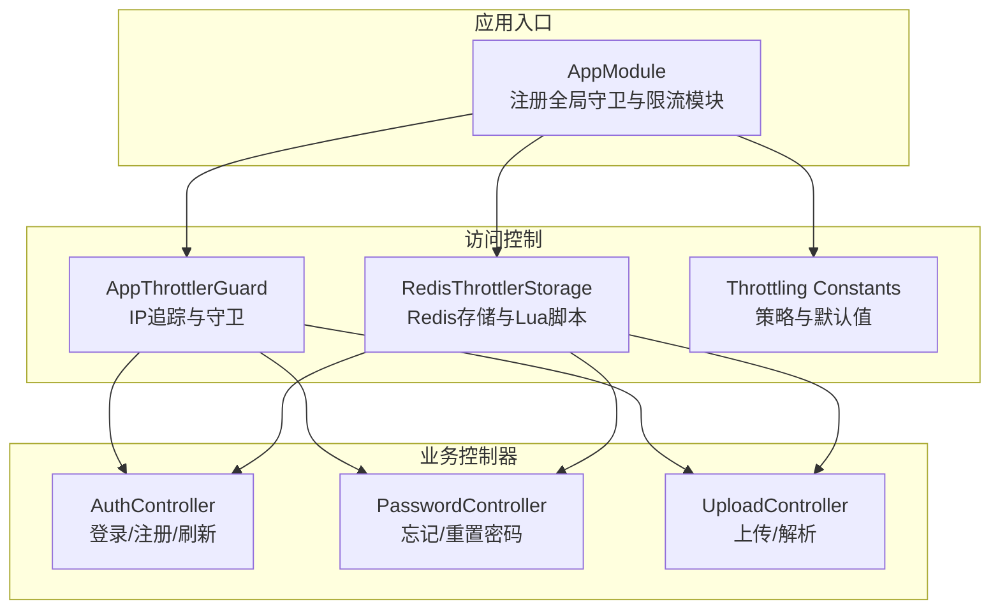
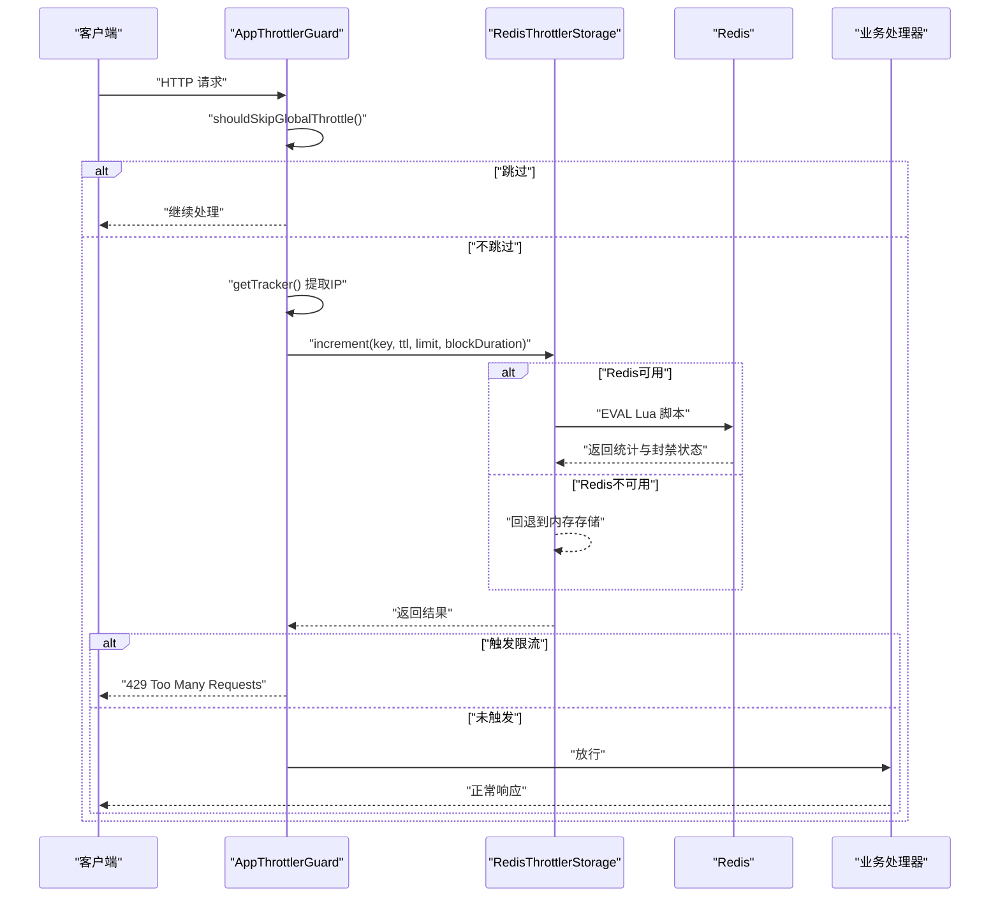
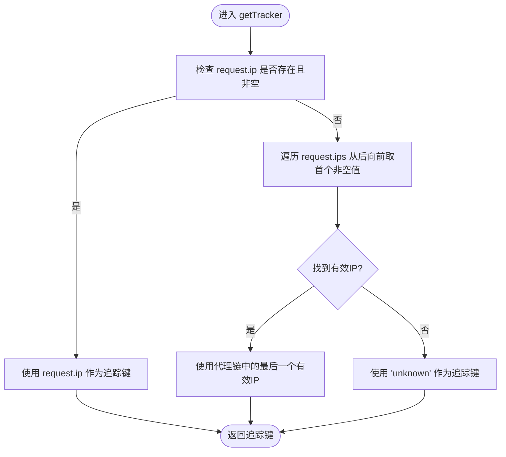
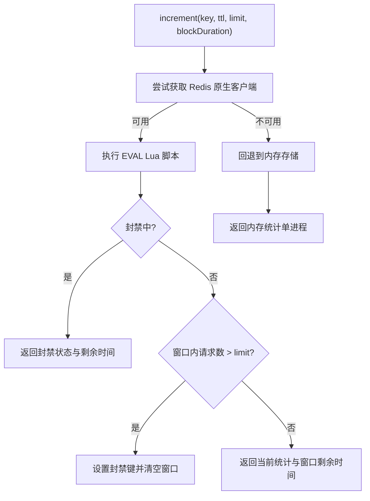
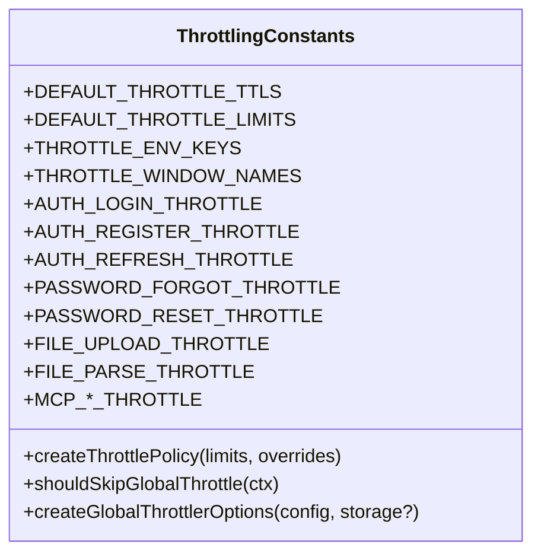
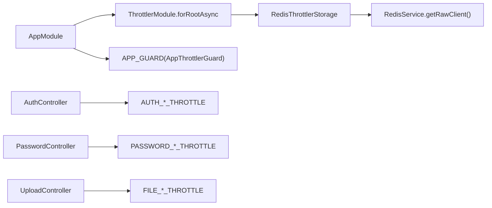

# 访问控制

<cite>
**本文引用的文件**   
- [apps/backend/src/common/throttling/index.ts](file://apps/backend/src/common/throttling/index.ts)
- [apps/backend/src/common/throttling/throttling.guard.ts](file://apps/backend/src/common/throttling/throttling.guard.ts)
- [apps/backend/src/common/throttling/redis-throttler.storage.ts](file://apps/backend/src/common/throttling/redis-throttler.storage.ts)
- [apps/backend/src/common/throttling/throttling.constants.ts](file://apps/backend/src/common/throttling/throttling.constants.ts)
- [apps/backend/src/redis/redis.service.ts](file://apps/backend/src/redis/redis.service.ts)
- [apps/backend/src/app.module.ts](file://apps/backend/src/app.module.ts)
- [apps/backend/src/auth/auth.controller.ts](file://apps/backend/src/auth/auth.controller.ts)
- [apps/backend/src/auth/password.controller.ts](file://apps/backend/src/auth/password.controller.ts)
- [apps/backend/src/upload/upload.controller.ts](file://apps/backend/src/upload/upload.controller.ts)
- [apps/backend/tests/common/throttling.guard.spec.ts](file://apps/backend/tests/common/throttling.guard.spec.ts)
- [apps/backend/tests/common/redis-throttler.storage.spec.ts](file://apps/backend/tests/common/redis-throttler.storage.spec.ts)
- [apps/backend/tests/common/throttling.constants.spec.ts](file://apps/backend/tests/common/throttling.constants.spec.ts)
- [apps/backend/tests/e2e/auth.e2e.spec.ts](file://apps/backend/tests/e2e/auth.e2e.spec.ts)
- [apps/backend/tests/e2e/test-app.ts](file://apps/backend/tests/e2e/test-app.ts)
</cite>

## 目录
1. [简介](#简介)
2. [项目结构](#项目结构)
3. [核心组件](#核心组件)
4. [架构总览](#架构总览)
5. [组件详解](#组件详解)
6. [依赖关系分析](#依赖关系分析)
7. [性能与扩展性](#性能与扩展性)
8. [故障排除指南](#故障排除指南)
9. [结论](#结论)
10. [附录：配置与监控](#附录配置与监控)

## 简介
本文件系统性阐述 Lumina Todo 后端的访问控制与速率限制体系，重点覆盖以下方面：
- 速率限制机制的实现原理：基于 Redis 的 Lua 脚本实现滑动窗口算法，确保跨进程/多实例的一致性。
- 并发控制与一致性：通过原子 Lua 脚本与有序集合（zset）维护请求序列，避免竞态条件。
- Throttling 守卫的工作流程、配置参数与自定义规则。
- 不同端点的访问频率限制策略：认证、密码找回、文件上传/解析、MCP 工具调用等。
- 性能影响、缓存优化与分布式部署注意事项。
- 可观测性与故障排除建议。

## 项目结构
访问控制相关代码集中在后端应用的公共模块中，并在全局守卫层启用，同时在各业务控制器上按需叠加细粒度限流策略。

图表来源
- [apps/backend/src/app.module.ts:118-123](file://apps/backend/src/app.module.ts#L118-L123)
- [apps/backend/src/common/throttling/throttling.guard.ts:28-33](file://apps/backend/src/common/throttling/throttling.guard.ts#L28-L33)
- [apps/backend/src/common/throttling/redis-throttler.storage.ts:106-156](file://apps/backend/src/common/throttling/redis-throttler.storage.ts#L106-L156)
- [apps/backend/src/common/throttling/throttling.constants.ts:67-197](file://apps/backend/src/common/throttling/throttling.constants.ts#L67-L197)
- [apps/backend/src/auth/auth.controller.ts:23-48](file://apps/backend/src/auth/auth.controller.ts#L23-L48)
- [apps/backend/src/auth/password.controller.ts:19-36](file://apps/backend/src/auth/password.controller.ts#L19-L36)
- [apps/backend/src/upload/upload.controller.ts:95-116](file://apps/backend/src/upload/upload.controller.ts#L95-L116)

章节来源
- [apps/backend/src/app.module.ts:118-123](file://apps/backend/src/app.module.ts#L118-L123)
- [apps/backend/src/common/throttling/index.ts:1-4](file://apps/backend/src/common/throttling/index.ts#L1-L4)

## 核心组件
- AppThrottlerGuard：全局守卫，负责从请求中提取客户端 IP（优先直连 IP，其次从代理链取最后一个有效 IP），作为限流键。
- RedisThrottlerStorage：限流存储实现，使用 Redis Lua 脚本原子地维护滑动窗口计数与封禁状态。
- Throttling Constants：定义全局滑动窗口（短/中/长）的 TTL 与限额，以及面向业务场景的命名策略（如认证、密码、文件等）。
- RedisService：统一的 Redis 缓存服务，提供前缀管理与底层客户端访问能力。

章节来源
- [apps/backend/src/common/throttling/throttling.guard.ts:28-33](file://apps/backend/src/common/throttling/throttling.guard.ts#L28-L33)
- [apps/backend/src/common/throttling/redis-throttler.storage.ts:106-156](file://apps/backend/src/common/throttling/redis-throttler.storage.ts#L106-L156)
- [apps/backend/src/common/throttling/throttling.constants.ts:67-197](file://apps/backend/src/common/throttling/throttling.constants.ts#L67-L197)
- [apps/backend/src/redis/redis.service.ts:18-25](file://apps/backend/src/redis/redis.service.ts#L18-L25)

## 架构总览
全局守卫在每个请求进入时触发，先判断是否跳过（如 OPTIONS 与健康检查），再根据提取的客户端 IP 与策略键进行限流判断。若 Redis 可用则走原子 Lua 脚本；否则回退到内存存储。

图表来源
- [apps/backend/src/common/throttling/throttling.guard.ts:162-171](file://apps/backend/src/common/throttling/throttling.guard.ts#L162-L171)
- [apps/backend/src/common/throttling/throttling.guard.ts:28-33](file://apps/backend/src/common/throttling/throttling.guard.ts#L28-L33)
- [apps/backend/src/common/throttling/redis-throttler.storage.ts:127-156](file://apps/backend/src/common/throttling/redis-throttler.storage.ts#L127-L156)
- [apps/backend/tests/e2e/test-app.ts:478-479](file://apps/backend/tests/e2e/test-app.ts#L478-L479)

## 组件详解

### 1) AppThrottlerGuard：IP追踪与守卫
- IP提取逻辑：
  - 优先使用直连 IP（request.ip）。
  - 若不可用或为空，则从代理链数组（request.ips）中从后向前取第一个非空值。
- 作用：作为限流键的唯一标识，保证同一客户端在多代理/负载均衡场景下被一致限流。

图表来源
- [apps/backend/src/common/throttling/throttling.guard.ts:9-32](file://apps/backend/src/common/throttling/throttling.guard.ts#L9-L32)

章节来源
- [apps/backend/src/common/throttling/throttling.guard.ts:28-33](file://apps/backend/src/common/throttling/throttling.guard.ts#L28-L33)
- [apps/backend/tests/common/throttling.guard.spec.ts:5-41](file://apps/backend/tests/common/throttling.guard.spec.ts#L5-L41)

### 2) RedisThrottlerStorage：滑动窗口与Lua原子脚本
- 存储键命名：使用统一前缀与策略名组合，形成可读且隔离的键空间。
- Lua 脚本职责：
  - 清理过期窗口内的请求记录（基于有序集合 ZSET）。
  - 计算最早请求的剩余生存时间，用于“窗口剩余时间”指标。
  - 在未被封禁时递增序列号并写入当前时间戳，维护滑动窗口。
  - 当请求数超过阈值时，设置封禁键并在后续请求直接返回封禁状态。
  - 返回结构包含：当前窗口总命中数、窗口剩余时间（秒）、是否被封禁、封禁剩余时间（秒）。
- 回退策略：当底层 Redis 客户端不可用时，转为内存存储，保证服务可用但不跨进程共享状态。

图表来源
- [apps/backend/src/common/throttling/redis-throttler.storage.ts:114-156](file://apps/backend/src/common/throttling/redis-throttler.storage.ts#L114-L156)
- [apps/backend/src/common/throttling/redis-throttler.storage.ts:18-87](file://apps/backend/src/common/throttling/redis-throttler.storage.ts#L18-L87)

章节来源
- [apps/backend/src/common/throttling/redis-throttler.storage.ts:106-173](file://apps/backend/src/common/throttling/redis-throttler.storage.ts#L106-L173)
- [apps/backend/tests/common/redis-throttler.storage.spec.ts:59-101](file://apps/backend/tests/common/redis-throttler.storage.spec.ts#L59-L101)
- [apps/backend/tests/common/redis-throttler.storage.spec.ts:103-134](file://apps/backend/tests/common/redis-throttler.storage.spec.ts#L103-L134)

### 3) Throttling Constants：策略与默认值
- 全局滑动窗口：
  - short：默认 TTL=1s，limit=10；适合高频短周期请求。
  - medium：默认 TTL=10s，limit=50；适合中频请求。
  - long：默认 TTL=60s，limit=100；适合低频但总量较大的请求。
- 环境变量覆盖：可通过环境变量对每个窗口的 TTL 与 limit 进行覆盖。
- 业务策略：
  - 认证类：登录、注册、刷新分别有独立策略，限制更严格。
  - 密码类：忘记密码、重置密码有独立策略，兼顾安全与用户体验。
  - 文件类：上传与解析分别有限流策略，避免资源滥用。
  - 外部集成类：MCP 连接、工具发现与调用均有独立策略。
- 跳过规则：
  - OPTIONS 预检请求与健康检查端点（/api/health 或其子路径）不参与全局限流。

图表来源
- [apps/backend/src/common/throttling/throttling.constants.ts:11-197](file://apps/backend/src/common/throttling/throttling.constants.ts#L11-L197)

章节来源
- [apps/backend/src/common/throttling/throttling.constants.ts:67-197](file://apps/backend/src/common/throttling/throttling.constants.ts#L67-L197)
- [apps/backend/tests/common/throttling.constants.spec.ts:17-55](file://apps/backend/tests/common/throttling.constants.spec.ts#L17-L55)

### 4) 控制器级限流策略
- 认证控制器：
  - 登录：使用 AUTH_LOGIN_THROTTLE。
  - 注册：使用 AUTH_REGISTER_THROTTLE。
  - 刷新：使用 AUTH_REFRESH_THROTTLE。
- 密码控制器：
  - 忘记密码：使用 PASSWORD_FORGOT_THROTTLE。
  - 重置密码：使用 PASSWORD_RESET_THROTTLE。
- 上传控制器：
  - 单文件上传：使用 FILE_UPLOAD_THROTTLE。
  - 文件解析：使用 FILE_PARSE_THROTTLE。
- 其他：MCP 连接、工具发现与调用等也有相应策略。

章节来源
- [apps/backend/src/auth/auth.controller.ts:23-48](file://apps/backend/src/auth/auth.controller.ts#L23-L48)
- [apps/backend/src/auth/password.controller.ts:19-36](file://apps/backend/src/auth/password.controller.ts#L19-L36)
- [apps/backend/src/upload/upload.controller.ts:95-116](file://apps/backend/src/upload/upload.controller.ts#L95-L116)

## 依赖关系分析
- 全局守卫与存储：
  - AppModule 通过异步工厂注入 RedisService，并将其包装为 RedisThrottlerStorage 注入到 ThrottlerModule。
  - APP_GUARD 全局绑定 AppThrottlerGuard，确保所有路由均受控。
- 控制器与策略：
  - 各控制器通过 @Throttle() 装饰器应用业务级策略，策略来源于 throttling.constants。
- Redis 前缀与命名空间：
  - RedisService 提供统一前缀（含 RATE_LIMIT），RedisThrottlerStorage 使用该前缀构建键，避免冲突。

图表来源
- [apps/backend/src/app.module.ts:118-123](file://apps/backend/src/app.module.ts#L118-L123)
- [apps/backend/src/app.module.ts:148-152](file://apps/backend/src/app.module.ts#L148-L152)
- [apps/backend/src/common/throttling/redis-throttler.storage.ts:158-160](file://apps/backend/src/common/throttling/redis-throttler.storage.ts#L158-L160)
- [apps/backend/src/auth/auth.controller.ts:10](file://apps/backend/src/auth/auth.controller.ts#L10)
- [apps/backend/src/auth/password.controller.ts:6](file://apps/backend/src/auth/password.controller.ts#L6)
- [apps/backend/src/upload/upload.controller.ts:17](file://apps/backend/src/upload/upload.controller.ts#L17)

章节来源
- [apps/backend/src/app.module.ts:118-123](file://apps/backend/src/app.module.ts#L118-L123)
- [apps/backend/src/common/throttling/redis-throttler.storage.ts:158-160](file://apps/backend/src/common/throttling/redis-throttler.storage.ts#L158-L160)

## 性能与扩展性
- 原子性与一致性：
  - Lua 脚本保证窗口清理、计数与封禁判定的原子性，避免竞态。
  - 使用有序集合维护请求序列，天然具备时间排序能力，确保滑动窗口语义正确。
- Redis 命中与开销：
  - 每次请求仅一次 EVAL 与少量 ZSET/INCR/PSETEX 操作，开销极低。
  - 键空间采用前缀隔离，便于运维与容量规划。
- 回退策略：
  - Redis 不可用时自动回退至内存存储，保障服务可用性，但不跨进程共享状态。
- 分布式部署：
  - 通过共享 Redis 实现跨实例一致的限流状态，适合多副本/容器化部署。
  - 建议为限流键设置合理的 TTL，避免长期占用内存。

[本节为通用性能讨论，无需列出具体文件来源]

## 故障排除指南
- 症状：频繁出现 429。
  - 排查要点：
    - 检查是否命中了业务策略（如登录/注册/密码重置）。
    - 确认客户端 IP 是否被代理链正确传递（可通过日志或抓包验证）。
    - 查看 Redis 是否可用，以及 Lua 脚本是否执行成功。
  - 参考证据：
    - e2e 测试中对注册与登录的限流行为有明确断言。
    - 存储层在 Redis 不可用时会回退到内存存储，可据此定位问题。

- 症状：限流未生效或跨实例不一致。
  - 排查要点：
    - 确认所有实例连接的是同一 Redis。
    - 检查是否误用了 skipIf 规则（如健康检查与 OPTIONS）。
    - 核对环境变量是否覆盖了全局 TTL/limit。

- 症状：偶发封禁导致误伤。
  - 排查要点：
    - 检查 blockDuration 是否合理（默认与 TTL 相同，可能过短）。
    - 调整策略的 limit/ttl 以适配真实流量模式。

章节来源
- [apps/backend/tests/e2e/auth.e2e.spec.ts:176-211](file://apps/backend/tests/e2e/auth.e2e.spec.ts#L176-L211)
- [apps/backend/tests/common/redis-throttler.storage.spec.ts:87-101](file://apps/backend/tests/common/redis-throttler.storage.spec.ts#L87-L101)
- [apps/backend/tests/common/throttling.constants.spec.ts:17-25](file://apps/backend/tests/common/throttling.constants.spec.ts#L17-L25)

## 结论
Lumina Todo 的访问控制体系以全局守卫为核心，结合 Redis 原子 Lua 脚本实现高可靠、跨实例一致的滑动窗口限流。通过细粒度的业务策略与灵活的环境变量覆盖，既能满足安全需求，又能兼顾性能与可运维性。建议在生产环境中：
- 明确各端点的限流策略并定期评估；
- 监控 Redis 命中率与延迟；
- 对关键路径设置合理的封禁时长；
- 在灰度发布期间逐步调整策略参数。

[本节为总结性内容，无需列出具体文件来源]

## 附录：配置与监控

### A. 环境变量与默认值
- 全局滑动窗口默认值（秒/请求数）：
  - short：TTL=1s，limit=10
  - medium：TTL=10s，limit=50
  - long：TTL=60s，limit=100
- 可通过以下环境变量覆盖：
  - THROTTLE_SHORT_TTL / THROTTLE_SHORT_LIMIT
  - THROTTLE_MEDIUM_TTL / THROTTLE_MEDIUM_LIMIT
  - THROTTLE_LONG_TTL / THROTTLE_LONG_LIMIT

章节来源
- [apps/backend/src/common/throttling/throttling.constants.ts:11-36](file://apps/backend/src/common/throttling/throttling.constants.ts#L11-L36)
- [apps/backend/src/common/throttling/throttling.constants.ts:173-185](file://apps/backend/src/common/throttling/throttling.constants.ts#L173-L185)

### B. 端点与策略映射
- 认证类：登录、注册、刷新
- 密码类：忘记密码、重置密码
- 上传类：单文件上传、文件解析
- 外部集成类：MCP 连接、工具发现、工具调用

章节来源
- [apps/backend/src/auth/auth.controller.ts:23-48](file://apps/backend/src/auth/auth.controller.ts#L23-L48)
- [apps/backend/src/auth/password.controller.ts:19-36](file://apps/backend/src/auth/password.controller.ts#L19-L36)
- [apps/backend/src/upload/upload.controller.ts:95-116](file://apps/backend/src/upload/upload.controller.ts#L95-L116)
- [apps/backend/src/common/throttling/throttling.constants.ts:90-160](file://apps/backend/src/common/throttling/throttling.constants.ts#L90-L160)

### C. 监控指标建议
- 限流触发次数（按端点/策略维度）
- Redis 命中率与延迟
- 封禁持续时间分布
- 窗口剩余时间分布
- 回退到内存存储的次数

[本节为通用监控建议，无需列出具体文件来源]

### D. 动态调整与自定义规则
- 动态调整：
  - 通过环境变量热更新全局窗口参数。
  - 业务策略可通过 createThrottlePolicy 动态组合。
- 自定义规则：
  - 可在 shouldSkipGlobalThrottle 中增加新的跳过条件（如特定路径或方法）。
  - 可新增业务策略常量并应用到控制器。

章节来源
- [apps/backend/src/common/throttling/throttling.constants.ts:67-82](file://apps/backend/src/common/throttling/throttling.constants.ts#L67-L82)
- [apps/backend/src/common/throttling/throttling.constants.ts:162-171](file://apps/backend/src/common/throttling/throttling.constants.ts#L162-L171)