# Prisma配置与初始化

<cite>
**本文档引用的文件**
- [apps/backend/src/prisma/prisma.module.ts](file://apps/backend/src/prisma/prisma.module.ts)
- [apps/backend/src/prisma/prisma.service.ts](file://apps/backend/src/prisma/prisma.service.ts)
- [apps/backend/prisma.config.js](file://apps/backend/prisma.config.js)
- [apps/backend/prisma/schema/base.prisma](file://apps/backend/prisma/schema/base.prisma)
- [apps/backend/prisma/schema/user.prisma](file://apps/backend/prisma/schema/user.prisma)
- [apps/backend/prisma/schema/todo.prisma](file://apps/backend/prisma/schema/todo.prisma)
- [apps/backend/prisma/schema/mcp.prisma](file://apps/backend/prisma/schema/mcp.prisma)
- [apps/backend/src/app.module.ts](file://apps/backend/src/app.module.ts)
- [apps/backend/src/main.ts](file://apps/backend/src/main.ts)
- [apps/backend/src/users/users.service.ts](file://apps/backend/src/users/users.service.ts)
- [apps/backend/src/todos/todos.service.ts](file://apps/backend/src/todos/todos.service.ts)
- [apps/backend/src/health/prisma.health.ts](file://apps/backend/src/health/prisma.health.ts)
- [apps/backend/package.json](file://apps/backend/package.json)
</cite>

## 目录
1. [简介](#简介)
2. [项目结构](#项目结构)
3. [核心组件](#核心组件)
4. [架构概览](#架构概览)
5. [详细组件分析](#详细组件分析)
6. [依赖关系分析](#依赖关系分析)
7. [性能考虑](#性能考虑)
8. [故障排除指南](#故障排除指南)
9. [结论](#结论)
10. [附录](#附录)

## 简介

本文档深入解析Lumina Todo项目中Prisma的配置与初始化过程。项目采用NestJS框架结合Prisma ORM，通过PostgreSQL数据库提供数据持久化能力。本文将详细说明Prisma客户端的初始化流程、连接池配置、依赖注入机制、模块生命周期管理以及错误处理策略。

## 项目结构

Lumina Todo项目的Prisma相关文件组织如下：

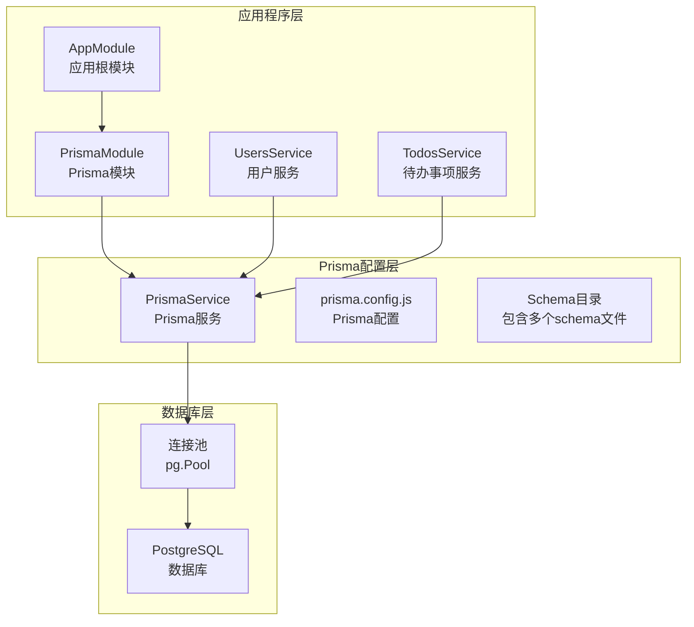

**图表来源**
- [apps/backend/src/app.module.ts:134](file://apps/backend/src/app.module.ts#L134)
- [apps/backend/src/prisma/prisma.module.ts:1-10](file://apps/backend/src/prisma/prisma.module.ts#L1-L10)

**章节来源**
- [apps/backend/src/app.module.ts:1-160](file://apps/backend/src/app.module.ts#L1-L160)
- [apps/backend/src/prisma/prisma.module.ts:1-10](file://apps/backend/src/prisma/prisma.module.ts#L1-L10)

## 核心组件

### PrismaService - 主要服务类

PrismaService是整个系统的核心组件，继承自PrismaClient并实现了NestJS的生命周期接口：

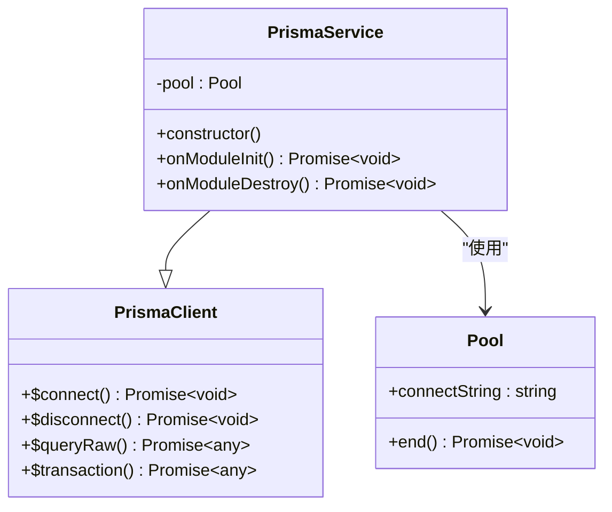

**图表来源**
- [apps/backend/src/prisma/prisma.service.ts:1-34](file://apps/backend/src/prisma/prisma.service.ts#L1-L34)

### PrismaModule - 依赖注入模块

PrismaModule采用全局注册模式，提供PrismaService的单例实例：

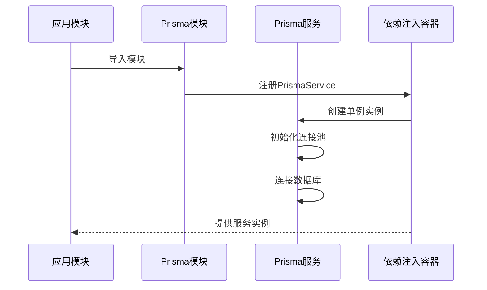

**图表来源**
- [apps/backend/src/prisma/prisma.module.ts:4-8](file://apps/backend/src/prisma/prisma.module.ts#L4-L8)
- [apps/backend/src/prisma/prisma.service.ts:10-21](file://apps/backend/src/prisma/prisma.service.ts#L10-L21)

**章节来源**
- [apps/backend/src/prisma/prisma.service.ts:1-34](file://apps/backend/src/prisma/prisma.service.ts#L1-L34)
- [apps/backend/src/prisma/prisma.module.ts:1-10](file://apps/backend/src/prisma/prisma.module.ts#L1-L10)

## 架构概览

### 数据库适配器选择策略

项目采用PostgreSQL适配器策略，通过PrismaPg适配器实现与原生pg连接池的集成：

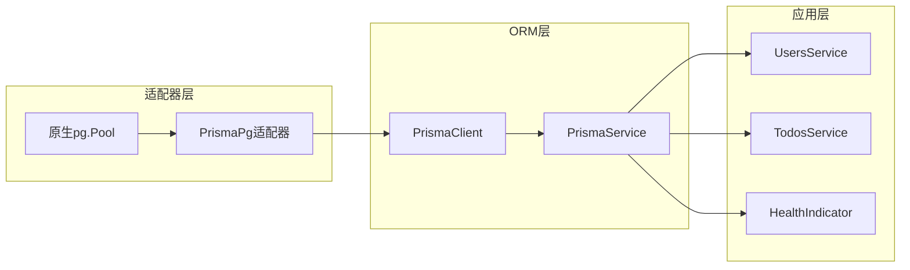

**图表来源**
- [apps/backend/src/prisma/prisma.service.ts:3-4](file://apps/backend/src/prisma/prisma.service.ts#L3-L4)
- [apps/backend/src/prisma/prisma.service.ts:17-20](file://apps/backend/src/prisma/prisma.service.ts#L17-L20)

### 连接生命周期管理

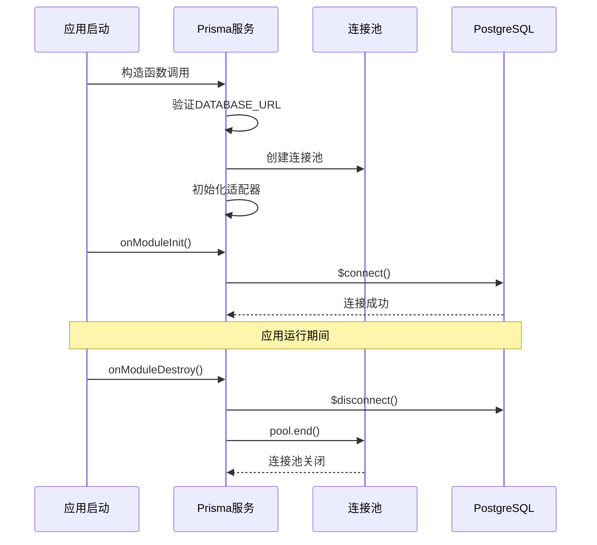

**图表来源**
- [apps/backend/src/prisma/prisma.service.ts:23-32](file://apps/backend/src/prisma/prisma.service.ts#L23-L32)

**章节来源**
- [apps/backend/src/prisma/prisma.service.ts:10-32](file://apps/backend/src/prisma/prisma.service.ts#L10-L32)

## 详细组件分析

### PrismaService 实现细节

#### 连接字符串管理

PrismaService通过环境变量DATABASE_URL管理数据库连接字符串，该设计提供了灵活的部署配置能力：

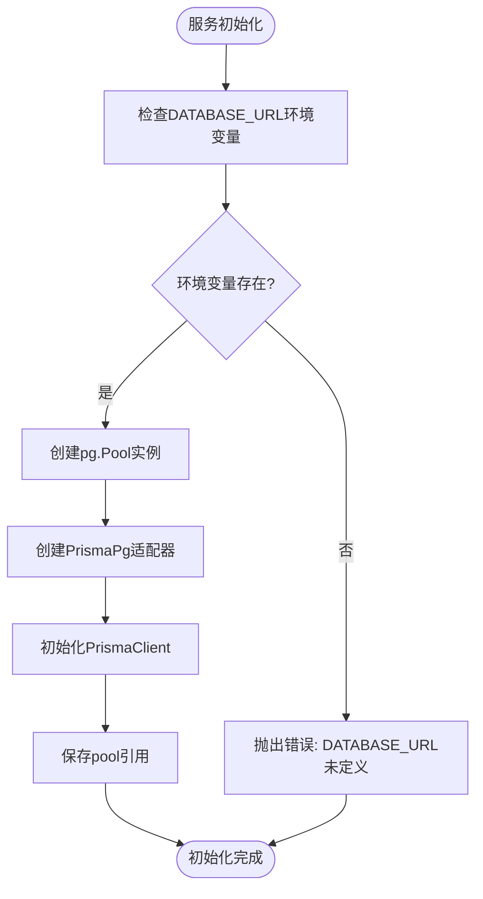

**图表来源**
- [apps/backend/src/prisma/prisma.service.ts:10-21](file://apps/backend/src/prisma/prisma.service.ts#L10-L21)

#### 连接池参数配置

项目使用默认的pg.Pool配置，主要参数包括：
- `connectionString`: 来自DATABASE_URL环境变量
- 默认连接池大小：由pg库决定
- 连接超时：使用pg库默认超时设置

#### 错误处理机制

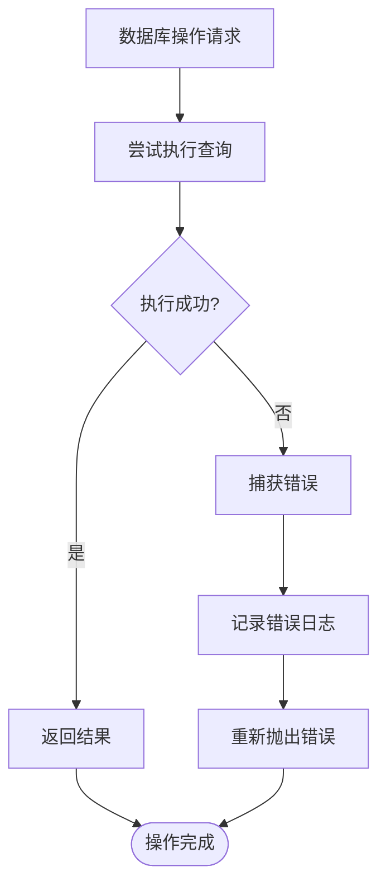

**图表来源**
- [apps/backend/src/health/prisma.health.ts:20-29](file://apps/backend/src/health/prisma.health.ts#L20-L29)

**章节来源**
- [apps/backend/src/prisma/prisma.service.ts:13-15](file://apps/backend/src/prisma/prisma.service.ts#L13-L15)
- [apps/backend/src/health/prisma.health.ts:19-31](file://apps/backend/src/health/prisma.health.ts#L19-L31)

### PrismaModule 依赖注入配置

#### 单例模式实现

PrismaModule采用NestJS的全局模块模式，确保PrismaService在整个应用中只有一个实例：

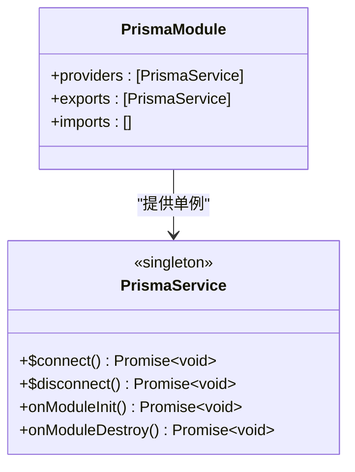

**图表来源**
- [apps/backend/src/prisma/prisma.module.ts:4-8](file://apps/backend/src/prisma/prisma.module.ts#L4-L8)

#### 模块销毁处理

PrismaService实现了OnModuleDestroy接口，在模块销毁时执行清理操作：

**章节来源**
- [apps/backend/src/prisma/prisma.module.ts:1-10](file://apps/backend/src/prisma/prisma.module.ts#L1-L10)
- [apps/backend/src/prisma/prisma.service.ts:27-32](file://apps/backend/src/prisma/prisma.service.ts#L27-L32)

### 数据库模型定义

#### 用户模型 (User)

用户模型定义了完整的用户信息结构，包括认证相关字段和关联关系：

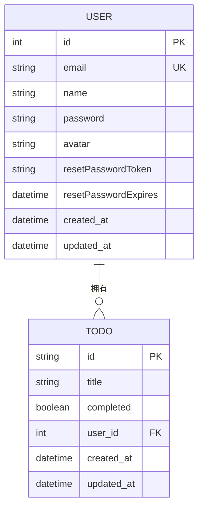

**图表来源**
- [apps/backend/prisma/schema/user.prisma:1-16](file://apps/backend/prisma/schema/user.prisma#L1-L16)
- [apps/backend/prisma/schema/todo.prisma:1-40](file://apps/backend/prisma/schema/todo.prisma#L1-L40)

#### 待办事项模型 (Todo)

待办事项模型支持复杂的业务需求，包括递归关系、软删除和时间追踪：

**章节来源**
- [apps/backend/prisma/schema/user.prisma:1-16](file://apps/backend/prisma/schema/user.prisma#L1-L16)
- [apps/backend/prisma/schema/todo.prisma:1-40](file://apps/backend/prisma/schema/todo.prisma#L1-L40)

## 依赖关系分析

### 外部依赖关系

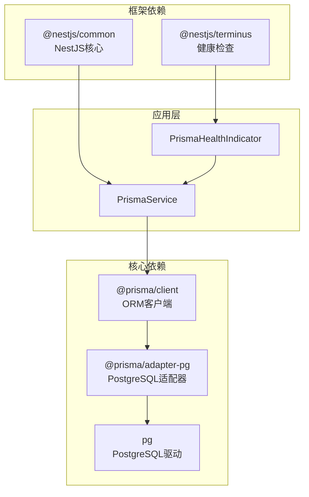

**图表来源**
- [apps/backend/package.json:57-78](file://apps/backend/package.json#L57-L78)
- [apps/backend/src/health/prisma.health.ts:1-32](file://apps/backend/src/health/prisma.health.ts#L1-L32)

### 内部模块依赖

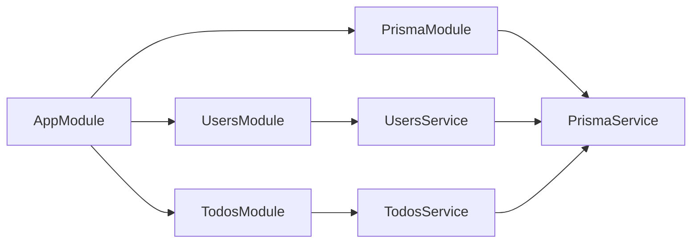

**图表来源**
- [apps/backend/src/app.module.ts:134](file://apps/backend/src/app.module.ts#L134)
- [apps/backend/src/users/users.service.ts:14](file://apps/backend/src/users/users.service.ts#L14)
- [apps/backend/src/todos/todos.service.ts:29](file://apps/backend/src/todos/todos.service.ts#L29)

**章节来源**
- [apps/backend/package.json:1-109](file://apps/backend/package.json#L1-L109)
- [apps/backend/src/app.module.ts:134](file://apps/backend/src/app.module.ts#L134)

## 性能考虑

### 连接池优化建议

基于当前实现，建议考虑以下优化措施：

1. **连接池大小调优**
   - 根据并发请求量调整最大连接数
   - 设置合适的空闲超时时间
   - 配置连接生命周期管理

2. **查询性能优化**
   - 为常用查询字段建立索引
   - 使用选择性查询减少数据传输
   - 实施适当的缓存策略

3. **事务处理优化**
   - 合理使用事务边界
   - 避免长时间持有连接
   - 实施超时控制

### 监控与诊断

建议实施以下监控措施：
- 连接池使用率监控
- 查询执行时间统计
- 错误率和异常跟踪
- 数据库性能指标收集

## 故障排除指南

### 常见问题及解决方案

#### 连接失败问题

**症状**: 应用启动时报数据库连接错误

**可能原因**:
1. DATABASE_URL环境变量未正确设置
2. 数据库服务器不可达
3. 认证凭据错误

**解决步骤**:
1. 验证DATABASE_URL格式正确性
2. 检查网络连通性
3. 确认数据库用户权限
4. 查看详细的错误日志

#### 连接池耗尽

**症状**: 应用出现连接等待或超时

**解决方法**:
1. 增加连接池最大连接数
2. 优化查询执行时间
3. 实施连接复用策略
4. 检查长连接泄漏

#### 模块销毁问题

**症状**: 应用优雅关闭时出现连接未正确释放

**解决方法**:
1. 确保onModuleDestroy正确实现
2. 检查连接池关闭顺序
3. 验证资源清理完整性

**章节来源**
- [apps/backend/src/prisma/prisma.service.ts:13-15](file://apps/backend/src/prisma/prisma.service.ts#L13-L15)
- [apps/backend/src/prisma/prisma.service.ts:27-32](file://apps/backend/src/prisma/prisma.service.ts#L27-L32)

## 结论

Lumina Todo项目的Prisma配置展现了现代Node.js应用的最佳实践：

1. **清晰的架构分离**: 通过PrismaModule实现依赖注入，PrismaService封装数据库操作
2. **可靠的连接管理**: 使用PostgreSQL适配器和原生连接池，确保连接安全
3. **完善的生命周期管理**: 正确处理模块初始化和销毁过程
4. **灵活的配置策略**: 通过环境变量实现多环境部署支持

该配置为后续的功能扩展和性能优化奠定了坚实基础，建议在生产环境中进一步完善监控和告警机制。

## 附录

### 环境变量配置指南

| 变量名 | 必需性 | 默认值 | 描述 |
|--------|--------|--------|------|
| DATABASE_URL | 必需 | 无 | PostgreSQL连接字符串 |
| PORT | 可选 | 3000 | 应用监听端口 |
| NODE_ENV | 可选 | development | 运行环境 |

### 连接超时设置

当前实现使用默认的超时配置，如需自定义可在连接池创建时指定相应参数。

### 重连策略

PrismaClient内置重连机制，建议在应用层面实施指数退避策略处理临时性连接失败。