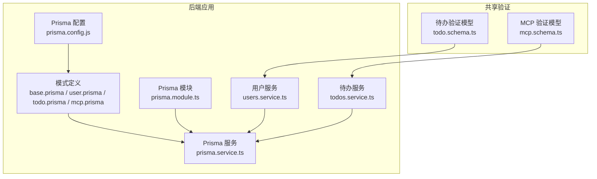
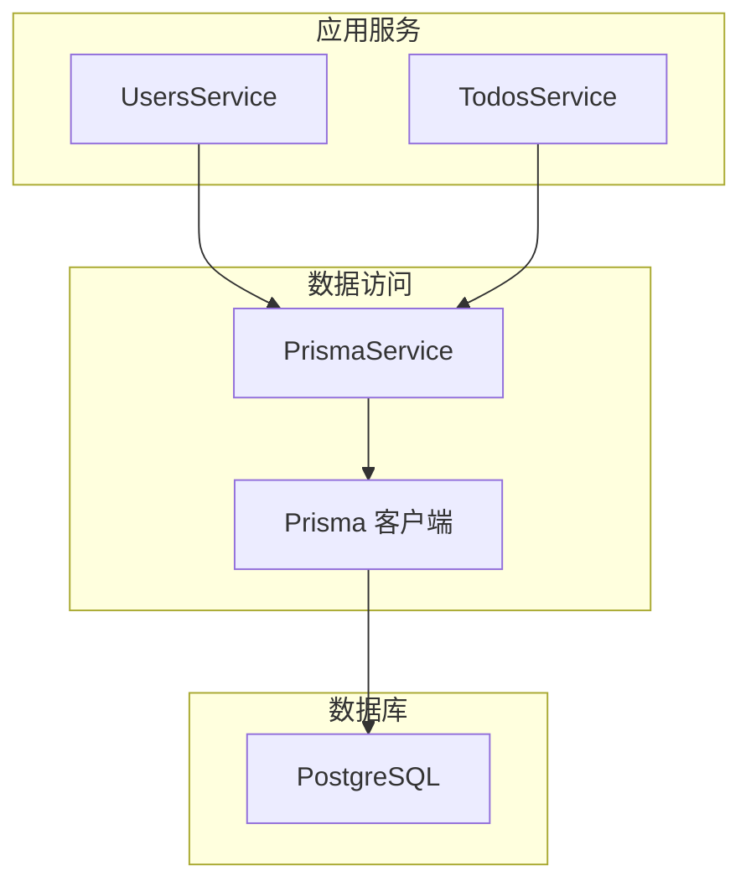
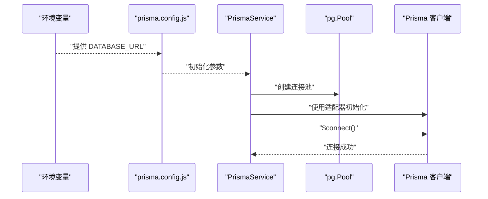
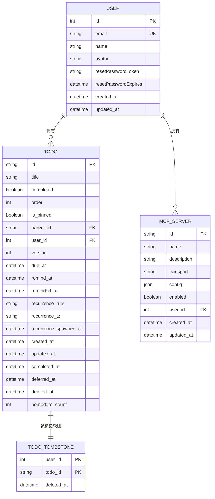
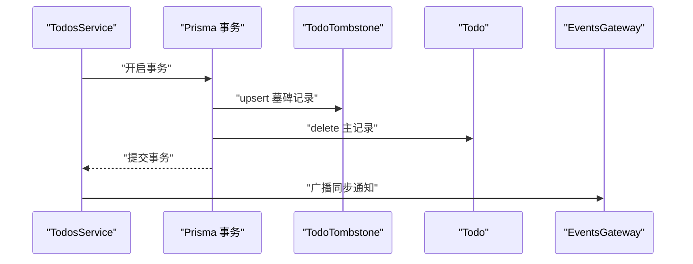
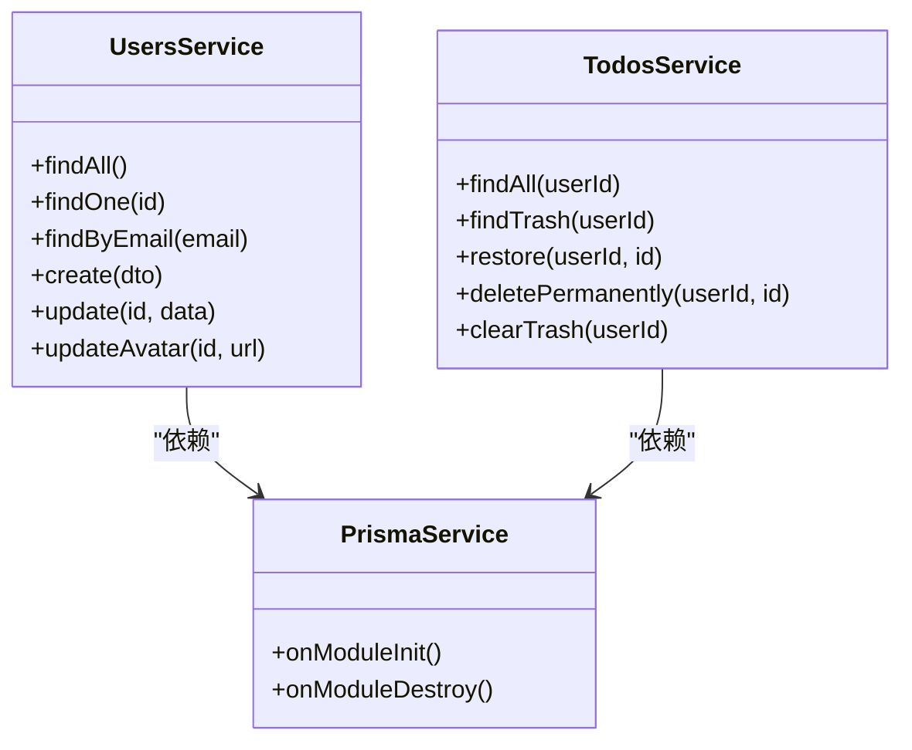
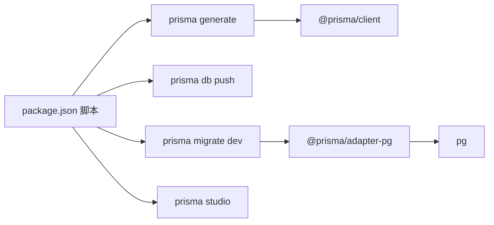

# 数据库设计

<cite>
**本文引用的文件**
- [apps/backend/prisma/schema/base.prisma](file://apps/backend/prisma/schema/base.prisma)
- [apps/backend/prisma/schema/user.prisma](file://apps/backend/prisma/schema/user.prisma)
- [apps/backend/prisma/schema/todo.prisma](file://apps/backend/prisma/schema/todo.prisma)
- [apps/backend/prisma/schema/mcp.prisma](file://apps/backend/prisma/schema/mcp.prisma)
- [apps/backend/prisma.config.js](file://apps/backend/prisma.config.js)
- [apps/backend/src/prisma/prisma.service.ts](file://apps/backend/src/prisma/prisma.service.ts)
- [apps/backend/src/prisma/prisma.module.ts](file://apps/backend/src/prisma/prisma.module.ts)
- [apps/backend/src/users/users.service.ts](file://apps/backend/src/users/users.service.ts)
- [apps/backend/src/todos/todos.service.ts](file://apps/backend/src/todos/todos.service.ts)
- [apps/backend/package.json](file://apps/backend/package.json)
- [packages/shared/src/schemas/todo.schema.ts](file://packages/shared/src/schemas/todo.schema.ts)
- [packages/shared/src/schemas/mcp.schema.ts](file://packages/shared/src/schemas/mcp.schema.ts)
</cite>

## 目录
1. [简介](#简介)
2. [项目结构](#项目结构)
3. [核心组件](#核心组件)
4. [架构总览](#架构总览)
5. [详细组件分析](#详细组件分析)
6. [依赖分析](#依赖分析)
7. [性能考虑](#性能考虑)
8. [故障排查指南](#故障排查指南)
9. [结论](#结论)
10. [附录](#附录)

## 简介
本文件面向 Lumina Todo 的数据库与数据访问层，系统化阐述基于 Prisma ORM 的配置与使用，覆盖数据库连接、模型定义、索引与查询优化、事务管理、数据访问层设计模式与验证规则，并提供性能优化、备份恢复与版本迁移实践建议。目标读者既包括开发者也包括对数据库设计有需求的产品与运维人员。

## 项目结构
后端应用采用 NestJS 架构，数据库层通过 Prisma 实现。核心文件分布如下：
- Prisma 配置与模式：apps/backend/prisma/schema/*.prisma
- Prisma 运行时适配：apps/backend/src/prisma/prisma.service.ts、prisma.module.ts
- 应用脚本与依赖：apps/backend/package.json
- 共享验证模型：packages/shared/src/schemas/*.schema.ts

图表来源
- [apps/backend/prisma.config.js:1-22](file://apps/backend/prisma.config.js#L1-L22)
- [apps/backend/prisma/schema/base.prisma:1-9](file://apps/backend/prisma/schema/base.prisma#L1-L9)
- [apps/backend/prisma/schema/user.prisma:1-16](file://apps/backend/prisma/schema/user.prisma#L1-L16)
- [apps/backend/prisma/schema/todo.prisma:1-40](file://apps/backend/prisma/schema/todo.prisma#L1-L40)
- [apps/backend/prisma/schema/mcp.prisma:1-16](file://apps/backend/prisma/schema/mcp.prisma#L1-L16)
- [apps/backend/src/prisma/prisma.service.ts:1-34](file://apps/backend/src/prisma/prisma.service.ts#L1-L34)
- [apps/backend/src/prisma/prisma.module.ts:1-10](file://apps/backend/src/prisma/prisma.module.ts#L1-L10)
- [apps/backend/src/users/users.service.ts:1-118](file://apps/backend/src/users/users.service.ts#L1-L118)
- [apps/backend/src/todos/todos.service.ts:1-147](file://apps/backend/src/todos/todos.service.ts#L1-L147)
- [packages/shared/src/schemas/todo.schema.ts:1-76](file://packages/shared/src/schemas/todo.schema.ts#L1-L76)
- [packages/shared/src/schemas/mcp.schema.ts:1-220](file://packages/shared/src/schemas/mcp.schema.ts#L1-L220)

章节来源
- [apps/backend/prisma.config.js:1-22](file://apps/backend/prisma.config.js#L1-L22)
- [apps/backend/package.json:26-29](file://apps/backend/package.json#L26-L29)

## 核心组件
- Prisma 客户端与适配器：通过 PostgreSQL 适配器与 pg 连接池建立连接，支持在 NestJS 生命周期中自动连接与断开。
- 数据模型：User（用户）、Todo（待办）、McpServer（MCP 服务器），以及 TodoTombstone（软删除墓碑）。
- 数据访问层：UsersService、TodosService 通过 PrismaService 执行查询与事务。
- 验证层：共享包中的 Zod Schema 对 Todo 与 MCP 配置进行运行时校验。

章节来源
- [apps/backend/src/prisma/prisma.service.ts:1-34](file://apps/backend/src/prisma/prisma.service.ts#L1-L34)
- [apps/backend/src/prisma/prisma.module.ts:1-10](file://apps/backend/src/prisma/prisma.module.ts#L1-L10)
- [apps/backend/src/users/users.service.ts:1-118](file://apps/backend/src/users/users.service.ts#L1-L118)
- [apps/backend/src/todos/todos.service.ts:1-147](file://apps/backend/src/todos/todos.service.ts#L1-L147)
- [packages/shared/src/schemas/todo.schema.ts:1-76](file://packages/shared/src/schemas/todo.schema.ts#L1-L76)
- [packages/shared/src/schemas/mcp.schema.ts:1-220](file://packages/shared/src/schemas/mcp.schema.ts#L1-L220)

## 架构总览
下图展示数据库层与应用服务之间的交互关系，以及 Prisma 在其中的角色。

图表来源
- [apps/backend/src/users/users.service.ts:1-118](file://apps/backend/src/users/users.service.ts#L1-L118)
- [apps/backend/src/todos/todos.service.ts:1-147](file://apps/backend/src/todos/todos.service.ts#L1-L147)
- [apps/backend/src/prisma/prisma.service.ts:1-34](file://apps/backend/src/prisma/prisma.service.ts#L1-L34)

## 详细组件分析

### Prisma 配置与连接
- 生成器与二进制目标：客户端生成器与多平台二进制目标配置，便于跨平台部署。
- 数据源：PostgreSQL 提供商，使用 DATABASE_URL 环境变量作为连接字符串。
- 配置文件：prisma.config.js 统一管理 schema、datasource.url、migrations 路径，优先从进程环境变量注入，开发环境可加载 .env。
- 运行时适配：PrismaService 使用 @prisma/adapter-pg 与 pg.Pool 建立连接；模块级导出，全局注入到 NestJS 容器。

图表来源
- [apps/backend/prisma.config.js:13-21](file://apps/backend/prisma.config.js#L13-L21)
- [apps/backend/src/prisma/prisma.service.ts:10-21](file://apps/backend/src/prisma/prisma.service.ts#L10-L21)

章节来源
- [apps/backend/prisma/schema/base.prisma:1-9](file://apps/backend/prisma/schema/base.prisma#L1-L9)
- [apps/backend/prisma.config.js:1-22](file://apps/backend/prisma.config.js#L1-L22)
- [apps/backend/src/prisma/prisma.service.ts:1-34](file://apps/backend/src/prisma/prisma.service.ts#L1-L34)
- [apps/backend/src/prisma/prisma.module.ts:1-10](file://apps/backend/src/prisma/prisma.module.ts#L1-L10)

### 数据模型与关系

#### User 用户模型
- 主键：自增整数 id
- 唯一约束：email
- 关系：一对多到 McpServer 与 Todo
- 时间戳：createdAt、updatedAt
- 映射：表名为 users

章节来源
- [apps/backend/prisma/schema/user.prisma:1-16](file://apps/backend/prisma/schema/user.prisma#L1-L16)

#### Todo 待办模型
- 主键：UUID id
- 字段：标题、完成状态、排序、置顶、父节点、版本号、到期/提醒时间、重复规则与时区、创建/更新/完成/推迟/删除时间、番茄钟计数
- 关系：belongsTo User（外键 userId）
- 索引：复合索引（userId, updatedAt）、（userId, remindAt）、（userId, dueAt）、（deletedAt）
- 表映射：todos
- 副表：TodoTombstone（墓碑表），用于软删除追踪

章节来源
- [apps/backend/prisma/schema/todo.prisma:1-40](file://apps/backend/prisma/schema/todo.prisma#L1-L40)

#### McpServer MCP 服务器模型
- 主键：UUID id
- 字段：名称、描述、传输类型（stdio/http）、配置（JSON）、启用标志、所属用户
- 关系：belongsTo User（外键 userId），删除时级联
- 索引：（userId）
- 表映射：mcp_servers

章节来源
- [apps/backend/prisma/schema/mcp.prisma:1-16](file://apps/backend/prisma/schema/mcp.prisma#L1-L16)

图表来源
- [apps/backend/prisma/schema/user.prisma:1-16](file://apps/backend/prisma/schema/user.prisma#L1-L16)
- [apps/backend/prisma/schema/todo.prisma:1-40](file://apps/backend/prisma/schema/todo.prisma#L1-L40)
- [apps/backend/prisma/schema/mcp.prisma:1-16](file://apps/backend/prisma/schema/mcp.prisma#L1-L16)

### 查询优化与索引策略
- 复合索引
  - Todo：按（userId, updatedAt）、（userId, remindAt）、（userId, dueAt）优化用户维度的排序与筛选。
  - TodoTombstone：按（userId, deletedAt）优化回收站查询。
  - McpServer：按（userId）优化用户维度的服务器列表查询。
- 删除策略：软删除（deletedAt 非空）配合墓碑表，避免物理删除带来的复杂性与回滚成本。
- 查询选择：TodosService 使用显式 select 仅返回必要字段，减少网络与序列化开销。

章节来源
- [apps/backend/prisma/schema/todo.prisma:24-28](file://apps/backend/prisma/schema/todo.prisma#L24-L28)
- [apps/backend/prisma/schema/todo.prisma:37](file://apps/backend/prisma/schema/todo.prisma#L37)
- [apps/backend/prisma/schema/mcp.prisma:13](file://apps/backend/prisma/schema/mcp.prisma#L13)
- [apps/backend/src/todos/todos.service.ts:5-25](file://apps/backend/src/todos/todos.service.ts#L5-L25)

### 事务管理与一致性
- 永久删除：在单个事务中先 upsert 墓碑记录，再删除主记录，保证软删除与硬删除的一致性。
- 清空回收站：批量 upsert 墓碑并删除对应记录，使用事务确保原子性。
- 广播通知：删除完成后通过事件网关广播同步通知，保持客户端状态一致。

图表来源
- [apps/backend/src/todos/todos.service.ts:97-111](file://apps/backend/src/todos/todos.service.ts#L97-L111)
- [apps/backend/src/todos/todos.service.ts:127-145](file://apps/backend/src/todos/todos.service.ts#L127-L145)

章节来源
- [apps/backend/src/todos/todos.service.ts:97-111](file://apps/backend/src/todos/todos.service.ts#L97-L111)
- [apps/backend/src/todos/todos.service.ts:127-145](file://apps/backend/src/todos/todos.service.ts#L127-L145)

### 数据访问层设计模式
- 单例与生命周期：PrismaService 作为全局单例，在 NestJS 模块初始化时连接数据库，在销毁时断开连接与关闭连接池。
- 服务封装：UsersService、TodosService 将业务逻辑与数据访问解耦，统一通过 PrismaService 执行查询、更新与事务。
- 选择性字段：TodosService 使用 select 仅返回必要字段，降低带宽与序列化成本。
- 错误处理：服务层对无效输入与未找到资源进行明确异常抛出，便于上层统一处理。

图表来源
- [apps/backend/src/prisma/prisma.service.ts:6-32](file://apps/backend/src/prisma/prisma.service.ts#L6-L32)
- [apps/backend/src/users/users.service.ts:12-118](file://apps/backend/src/users/users.service.ts#L12-L118)
- [apps/backend/src/todos/todos.service.ts:28-147](file://apps/backend/src/todos/todos.service.ts#L28-L147)

章节来源
- [apps/backend/src/prisma/prisma.module.ts:1-10](file://apps/backend/src/prisma/prisma.module.ts#L1-L10)
- [apps/backend/src/prisma/prisma.service.ts:1-34](file://apps/backend/src/prisma/prisma.service.ts#L1-L34)
- [apps/backend/src/users/users.service.ts:1-118](file://apps/backend/src/users/users.service.ts#L1-L118)
- [apps/backend/src/todos/todos.service.ts:1-147](file://apps/backend/src/todos/todos.service.ts#L1-L147)

### 数据验证规则
- Todo 验证：Zod Schema 约束 id（UUID）、title（长度限制）、布尔字段默认值、日期字段格式、递归规则枚举、时区长度等。
- 同步模型：定义同步项、批量合并请求与冲突响应的数据结构，确保服务间一致性。
- MCP 验证：严格校验传输类型与配置匹配（stdio/http），URL 合法性与公网可达性限制，支持 bearer/api_key/oauth 认证方式。

章节来源
- [packages/shared/src/schemas/todo.schema.ts:1-76](file://packages/shared/src/schemas/todo.schema.ts#L1-L76)
- [packages/shared/src/schemas/mcp.schema.ts:1-220](file://packages/shared/src/schemas/mcp.schema.ts#L1-L220)

## 依赖分析
- Prisma 版本：7.2.0
- 适配器：@prisma/adapter-pg 与 pg 8.16.3
- NestJS 模块：PrismaModule 全局导出 PrismaService
- 应用脚本：提供 prisma:generate、prisma:push、prisma:migrate、prisma:studio 等命令

图表来源
- [apps/backend/package.json:26-29](file://apps/backend/package.json#L26-L29)

章节来源
- [apps/backend/package.json:26-29](file://apps/backend/package.json#L26-L29)

## 性能考虑
- 连接池与适配器：使用 @prisma/adapter-pg 与 pg.Pool，合理设置连接池大小与超时，避免高并发下的连接争用。
- 索引策略：针对高频查询字段建立复合索引，减少全表扫描；对软删除字段建立独立索引以加速回收站查询。
- 查询裁剪：仅选择必要字段，减少序列化与网络传输；分页查询避免一次性拉取大量数据。
- 事务批处理：批量 upsert 墓碑与删除操作，减少往返次数与锁竞争。
- 缓存与事件：结合 Redis 缓存与事件广播，降低数据库压力并提升实时性。

## 故障排查指南
- 连接失败
  - 检查 DATABASE_URL 是否正确注入，确认连接字符串格式与数据库可达性。
  - 查看 PrismaService 初始化日志，确认 $connect 成功。
- 权限与迁移
  - 使用 prisma:migrate 命令执行迁移；如需预览变更，使用 prisma:studio。
  - 若 schema 与数据库不一致，使用 prisma:push 快速同步（仅开发环境）。
- 查询异常
  - 检查索引是否命中，必要时补充复合索引。
  - 确认软删除过滤条件（deletedAt 为空/非空）是否符合预期。
- 事务问题
  - 确保事务内所有写操作在同一事务上下文中执行；关注 upsert 与 delete 的顺序与幂等性。

章节来源
- [apps/backend/src/prisma/prisma.service.ts:10-21](file://apps/backend/src/prisma/prisma.service.ts#L10-L21)
- [apps/backend/package.json:26-29](file://apps/backend/package.json#L26-L29)

## 结论
本设计以 Prisma 为核心，结合 NestJS 的模块化与服务化能力，实现了清晰的数据访问层与强约束的模型定义。通过合理的索引策略、事务管理与验证规则，兼顾了性能、一致性与可维护性。建议在生产环境中配合连接池优化、监控告警与定期备份演练，持续保障系统稳定运行。

## 附录
- 版本迁移指南
  - 开发阶段：使用 prisma:generate 生成客户端，prisma:push 快速同步。
  - 预发布/生产：使用 prisma:migrate 生成并执行迁移，prisma:studio 预览变更。
- 备份与恢复
  - 使用数据库自带的备份工具（如 pg_dump）定期导出快照。
  - 恢复时先还原数据，再执行 prisma:migrate 确保 schema 最新。
- 常用命令
  - 生成客户端：prisma:generate
  - 推送模式：prisma:push
  - 迁移开发：prisma:migrate
  - 启动 Studio：prisma:studio

章节来源
- [apps/backend/package.json:26-29](file://apps/backend/package.json#L26-L29)