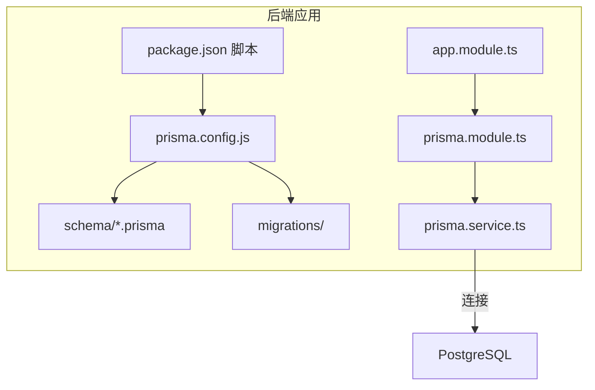
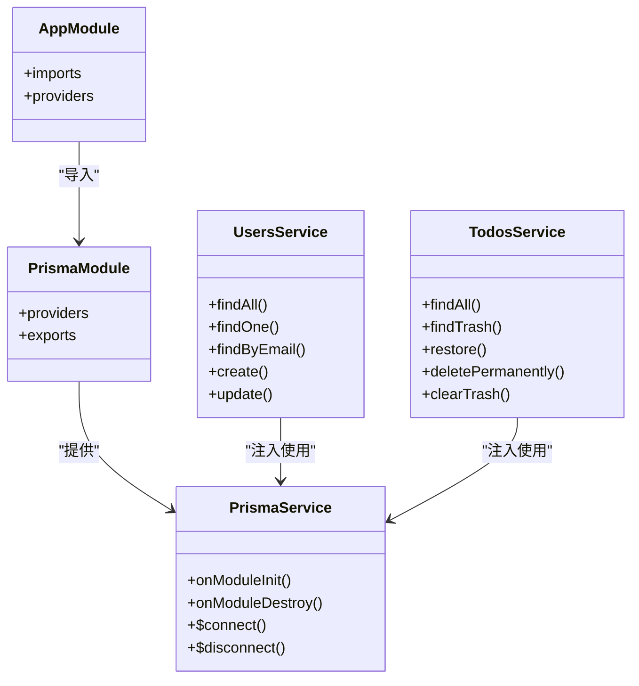
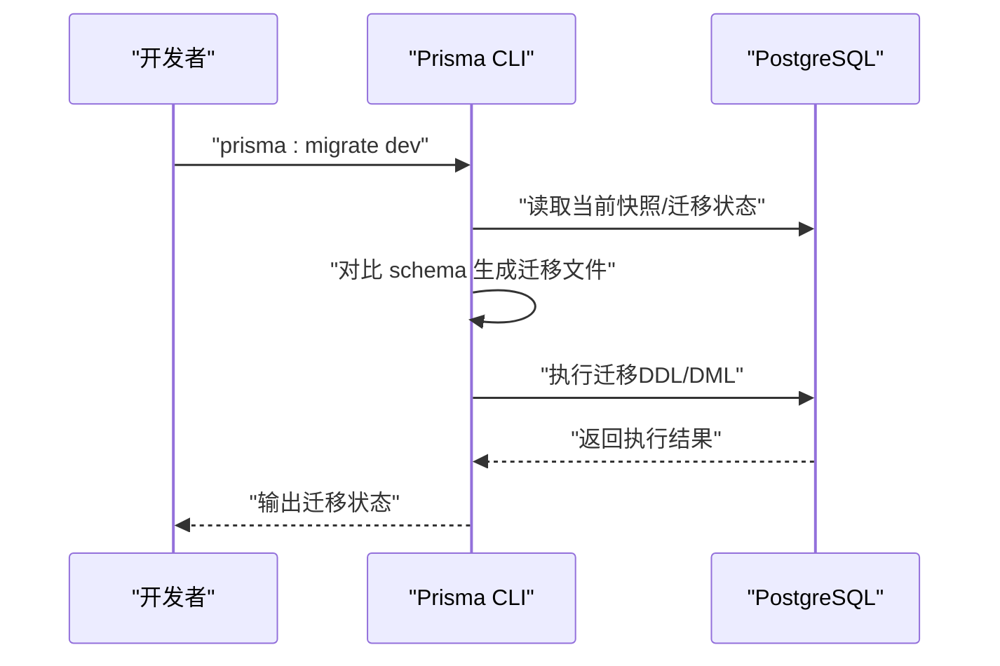
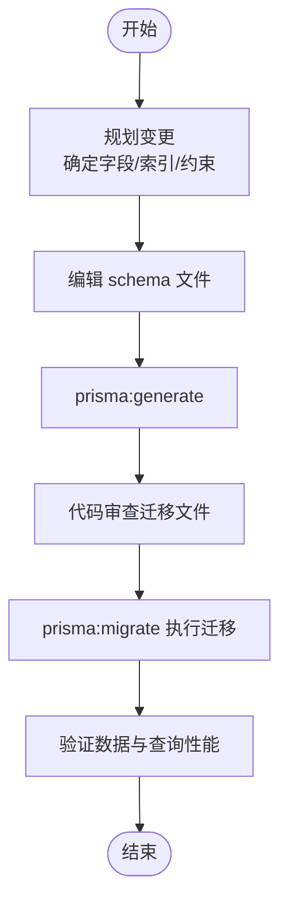
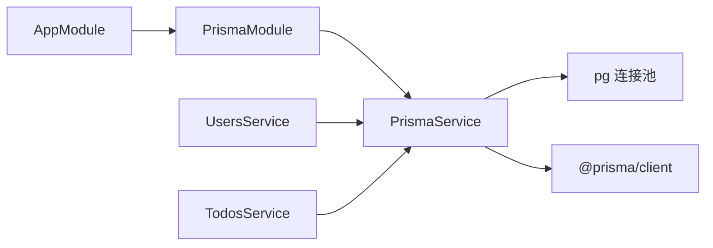

# 数据库迁移管理

<cite>
**本文引用的文件**
- [apps/backend/prisma/schema/base.prisma](file://apps/backend/prisma/schema/base.prisma)
- [apps/backend/prisma/schema/user.prisma](file://apps/backend/prisma/schema/user.prisma)
- [apps/backend/prisma/schema/todo.prisma](file://apps/backend/prisma/schema/todo.prisma)
- [apps/backend/prisma/schema/mcp.prisma](file://apps/backend/prisma/schema/mcp.prisma)
- [apps/backend/prisma.config.js](file://apps/backend/prisma.config.js)
- [apps/backend/package.json](file://apps/backend/package.json)
- [apps/backend/src/prisma/prisma.module.ts](file://apps/backend/src/prisma/prisma.module.ts)
- [apps/backend/src/prisma/prisma.service.ts](file://apps/backend/src/prisma/prisma.service.ts)
- [apps/backend/src/app.module.ts](file://apps/backend/src/app.module.ts)
- [apps/backend/src/users/users.service.ts](file://apps/backend/src/users/users.service.ts)
- [apps/backend/src/todos/todos.service.ts](file://apps/backend/src/todos/todos.service.ts)
</cite>

## 目录

1. [简介](#简介)
2. [项目结构](#项目结构)
3. [核心组件](#核心组件)
4. [架构总览](#架构总览)
5. [详细组件分析](#详细组件分析)
6. [依赖分析](#依赖分析)
7. [性能考虑](#性能考虑)
8. [故障排查指南](#故障排查指南)
9. [结论](#结论)
10. [附录](#附录)

## 简介

本文件面向 Lumina Todo 的数据库迁移管理，系统性阐述 Prisma Migrate 的工作原理、迁移文件生成与执行流程，并结合项目现有 Prisma 配置与代码，给出迁移策略、版本控制与团队协作最佳实践，覆盖数据迁移脚本编写、回滚机制、生产环境部署注意事项、迁移冲突解决、数据完整性检查与性能优化等主题。同时提供可操作的迁移示例与常见场景处理方案，帮助团队安全高效地演进数据库模式。

## 项目结构

Lumina Todo 后端采用 NestJS + Prisma 架构，数据库通过 PostgreSQL 提供。Prisma 配置位于后端应用目录，迁移文件与模式文件分离存放，便于版本控制与团队协作。

- Prisma 配置文件：apps/backend/prisma.config.js
- 模式文件：apps/backend/prisma/schema/\*.prisma
- 迁移文件：apps/backend/prisma/migrations（由 Prisma Migrate 自动生成）
- 后端包脚本：apps/backend/package.json 中包含 prisma:migrate、prisma:generate、prisma:push 等命令
- Prisma 客户端注入：通过 PrismaModule 与 PrismaService 在应用启动时连接数据库

图表来源

- [apps/backend/prisma.config.js:13-21](file://apps/backend/prisma.config.js#L13-L21)
- [apps/backend/package.json:26-29](file://apps/backend/package.json#L26-L29)
- [apps/backend/src/prisma/prisma.module.ts:1-10](file://apps/backend/src/prisma/prisma.module.ts#L1-L10)
- [apps/backend/src/prisma/prisma.service.ts:10-21](file://apps/backend/src/prisma/prisma.service.ts#L10-L21)
- [apps/backend/src/app.module.ts:134-134](file://apps/backend/src/app.module.ts#L134-L134)

章节来源

- [apps/backend/prisma.config.js:13-21](file://apps/backend/prisma.config.js#L13-L21)
- [apps/backend/package.json:26-29](file://apps/backend/package.json#L26-L29)
- [apps/backend/src/prisma/prisma.module.ts:1-10](file://apps/backend/src/prisma/prisma.module.ts#L1-L10)
- [apps/backend/src/prisma/prisma.service.ts:10-21](file://apps/backend/src/prisma/prisma.service.ts#L10-L21)
- [apps/backend/src/app.module.ts:134-134](file://apps/backend/src/app.module.ts#L134-L134)

## 核心组件

- Prisma 配置与数据源
  - 数据源类型：PostgreSQL
  - 配置项：schema 路径、migrations 路径、datasource.url 来自环境变量 DATABASE_URL
- 模式模型
  - 用户模型：用户表结构、唯一索引、关联关系
  - 待办模型：待办表结构、软删除、索引、时间字段
  - MCP 服务器模型：用户与服务器的外键关系、级联删除
  - 基础模型：墓碑表（软删除记录）
- Prisma 客户端与连接
  - 通过 PrismaService 使用 PrismaPg 适配器连接 PostgreSQL
  - 应用启动时建立连接，销毁时断开并释放连接池
- 迁移命令
  - 开发环境：prisma:migrate（基于 dev 方案）
  - 生成客户端：prisma:generate
  - 推送模式：prisma:push（仅限开发）

章节来源

- [apps/backend/prisma/schema/base.prisma:1-9](file://apps/backend/prisma/schema/base.prisma#L1-L9)
- [apps/backend/prisma/schema/user.prisma:1-16](file://apps/backend/prisma/schema/user.prisma#L1-L16)
- [apps/backend/prisma/schema/todo.prisma:1-40](file://apps/backend/prisma/schema/todo.prisma#L1-L40)
- [apps/backend/prisma/schema/mcp.prisma:1-16](file://apps/backend/prisma/schema/mcp.prisma#L1-L16)
- [apps/backend/src/prisma/prisma.service.ts:10-21](file://apps/backend/src/prisma/prisma.service.ts#L10-L21)
- [apps/backend/package.json:26-29](file://apps/backend/package.json#L26-L29)

## 架构总览

下图展示 Prisma 在应用中的角色与数据流：应用模块导入 PrismaModule，PrismaService 作为 PrismaClient 实例负责数据库连接；业务模块通过注入的 PrismaService 访问数据库。

图表来源

- [apps/backend/src/app.module.ts:134-134](file://apps/backend/src/app.module.ts#L134-L134)
- [apps/backend/src/prisma/prisma.module.ts:1-10](file://apps/backend/src/prisma/prisma.module.ts#L1-L10)
- [apps/backend/src/prisma/prisma.service.ts:23-32](file://apps/backend/src/prisma/prisma.service.ts#L23-L32)
- [apps/backend/src/users/users.service.ts:14-14](file://apps/backend/src/users/users.service.ts#L14-L14)
- [apps/backend/src/todos/todos.service.ts:29-33](file://apps/backend/src/todos/todos.service.ts#L29-L33)

## 详细组件分析

### Prisma 配置与数据源

- 配置要点
  - schema 路径：prisma/schema
  - migrations 路径：prisma/migrations
  - datasource.url：从环境变量 DATABASE_URL 读取
- 环境加载
  - 优先尝试加载根目录 .env，生产环境通常由容器注入
- 数据源类型
  - provider = postgresql
  - generator client 指向 prisma-client-js

章节来源

- [apps/backend/prisma.config.js:13-21](file://apps/backend/prisma.config.js#L13-L21)
- [apps/backend/prisma/schema/base.prisma:6-8](file://apps/backend/prisma/schema/base.prisma#L6-L8)

### 模式文件与模型设计

- 用户模型（User）
  - 主键、唯一邮箱、时间戳、与 Todo/McpServer 的一对多关系
- 待办模型（Todo）
  - UUID 主键、布尔字段、时间字段、软删除标记、递归父子关系、多维索引
- MCP 服务器模型（McpServer）
  - Json 字段存储配置、外键关联用户、启用标志、级联删除
- 基础模型（TodoTombstone）
  - 软删除墓碑表，记录被删除的待办项与时间

章节来源

- [apps/backend/prisma/schema/user.prisma:1-16](file://apps/backend/prisma/schema/user.prisma#L1-L16)
- [apps/backend/prisma/schema/todo.prisma:1-40](file://apps/backend/prisma/schema/todo.prisma#L1-L40)
- [apps/backend/prisma/schema/mcp.prisma:1-16](file://apps/backend/prisma/schema/mcp.prisma#L1-L16)
- [apps/backend/prisma/schema/base.prisma:1-9](file://apps/backend/prisma/schema/base.prisma#L1-L9)

### Prisma 客户端与连接管理

- 连接方式
  - 使用 PrismaPg 适配器与 pg 连接池
  - 通过 DATABASE_URL 初始化连接池
- 生命周期
  - onModuleInit：启动时连接数据库
  - onModuleDestroy：关闭 Prisma 连接并结束连接池
- 全局注入
  - PrismaModule 以全局模块导出 PrismaService，业务模块可直接注入使用

章节来源

- [apps/backend/src/prisma/prisma.service.ts:10-21](file://apps/backend/src/prisma/prisma.service.ts#L10-L21)
- [apps/backend/src/prisma/prisma.module.ts:1-10](file://apps/backend/src/prisma/prisma.module.ts#L1-L10)
- [apps/backend/src/app.module.ts:134-134](file://apps/backend/src/app.module.ts#L134-L134)

### 迁移命令与工作流

- 开发环境迁移
  - 使用 prisma:migrate（对应 prisma migrate dev），基于本地数据库快照与变更生成迁移文件
- 客户端生成
  - 使用 prisma:generate，基于当前 schema 生成 Prisma 客户端类型
- 模式推送（开发）
  - 使用 prisma:push，将 schema 直接推送至数据库（不生成迁移文件）
- 生产环境建议
  - 不使用 prisma:push；通过 prisma:migrate 生成并审阅迁移文件后再执行

章节来源

- [apps/backend/package.json:26-29](file://apps/backend/package.json#L26-L29)

### 迁移策略与版本控制

- 分支与合并
  - 每个功能分支独立进行 schema 变更，避免多人同时修改同一迁移文件
  - 合并前确保本地已同步最新迁移并执行 prisma:generate
- 迁移文件命名
  - 使用 Prisma 默认语义化命名，保持可读性与顺序一致性
- 迁移文件内容
  - 包含数据库变更与 Prisma 客户端类型更新，提交到版本控制
- 审查与回滚
  - 迁移文件应纳入代码审查；生产回滚需准备逆向迁移或备份恢复

章节来源

- [apps/backend/package.json:26-29](file://apps/backend/package.json#L26-L29)

### 团队协作最佳实践

- 环境隔离
  - 开发、测试、预发布、生产各自独立 DATABASE_URL
- 并发变更
  - 避免同时对同一张表进行结构变更；如必须，先在本地生成迁移并合并后再推送
- 客户端同步
  - 每次迁移后执行 prisma:generate，确保类型与数据库一致
- 文档与注释
  - 在迁移文件中添加简要注释说明变更目的与影响范围

章节来源

- [apps/backend/prisma.config.js:7-11](file://apps/backend/prisma.config.js#L7-L11)
- [apps/backend/package.json:26-29](file://apps/backend/package.json#L26-L29)

### 数据迁移脚本编写

- 事务封装
  - 对涉及多表或多步骤的数据变更使用事务，保证原子性
- 索引与约束
  - 新增索引、唯一约束、外键时注意性能与兼容性
- 软删除与墓碑
  - 使用墓碑表记录软删除，便于审计与恢复
- 示例场景
  - 批量重写字段值：在事务中分批更新，避免长事务锁表
  - 添加枚举/JSON 字段：先添加列再补充默认值与索引
  - 删除列：先迁移数据，再删除列，最后重建索引

章节来源

- [apps/backend/src/todos/todos.service.ts:97-107](file://apps/backend/src/todos/todos.service.ts#L97-L107)
- [apps/backend/src/todos/todos.service.ts:127-141](file://apps/backend/src/todos/todos.service.ts#L127-L141)

### 回滚机制

- 开发环境
  - 使用 prisma migrate dev 的回滚能力（有限）
- 生产环境
  - 通过逆向迁移文件回滚；若无逆向迁移，需依赖备份恢复
- 审计与验证
  - 回滚前后核对关键指标（行数、索引、约束）

章节来源

- [apps/backend/package.json:28-28](file://apps/backend/package.json#L28-L28)

### 生产环境部署注意事项

- 部署前
  - 在非生产环境验证迁移文件与客户端生成结果
  - 确认 DATABASE_URL 正确且可达
- 部署中
  - 顺序：生成客户端 -> 执行迁移 -> 启动应用
  - 如需停机维护，提前通知并选择维护窗口
- 部署后
  - 观察应用日志与数据库健康状态
  - 运行最小化查询验证核心功能

章节来源

- [apps/backend/prisma.config.js:15-17](file://apps/backend/prisma.config.js#L15-L17)
- [apps/backend/package.json:26-29](file://apps/backend/package.json#L26-L29)

### 迁移冲突解决方案

- 冲突原因
  - 多人同时生成同一批次迁移；或本地与远程迁移状态不同步
- 解决步骤
  - 同步远程分支，重新生成迁移
  - 在本地执行 prisma:migrate，确认无冲突
  - 若出现“历史不一致”，先回滚到最近一次成功迁移，再重新生成并执行
- 预防措施
  - 强制 PR 合并前执行迁移与客户端生成
  - 使用 CI 检查迁移文件是否被修改

章节来源

- [apps/backend/package.json:26-29](file://apps/backend/package.json#L26-L29)

### 数据完整性检查

- 约束校验
  - 外键、唯一性、非空约束在迁移中显式声明
- 索引策略
  - 为高频查询字段建立索引；避免冗余索引
- 软删除一致性
  - 删除与墓碑表联动，确保审计与恢复路径一致

章节来源

- [apps/backend/prisma/schema/todo.prisma:24-28](file://apps/backend/prisma/schema/todo.prisma#L24-L28)
- [apps/backend/prisma/schema/user.prisma:12-12](file://apps/backend/prisma/schema/user.prisma#L12-L12)
- [apps/backend/prisma/schema/mcp.prisma:11-11](file://apps/backend/prisma/schema/mcp.prisma#L11-L11)

### 迁移性能优化技巧

- 批处理
  - 大规模数据更新使用分批处理，减少锁竞争
- 索引优化
  - 在大批量导入后重建或调整索引
- 事务边界
  - 将多个 DDL/DML 放入单个事务，减少往返与锁持有时间
- 连接池
  - 使用 PrismaPg 适配器与连接池，提升并发与稳定性

章节来源

- [apps/backend/src/prisma/prisma.service.ts:17-20](file://apps/backend/src/prisma/prisma.service.ts#L17-L20)
- [apps/backend/src/todos/todos.service.ts:127-141](file://apps/backend/src/todos/todos.service.ts#L127-L141)

### 实际迁移示例与常见场景

- 场景一：新增字段并设置默认值
  - 在 schema 中添加字段与默认值
  - 执行 prisma:migrate 生成迁移文件
  - 执行 prisma:generate 更新客户端
- 场景二：为现有列添加索引
  - 在 schema 中添加索引声明
  - 执行 prisma:migrate 生成索引创建迁移
  - 验证查询计划与性能
- 场景三：软删除与墓碑联动
  - 在业务层使用事务同时更新墓碑表与主表
  - 通过查询过滤 deletedAt 字段实现软删除
- 场景四：批量数据重写
  - 使用事务分批更新，避免长时间锁表
  - 更新完成后重建相关索引

图表来源

- [apps/backend/package.json:28-28](file://apps/backend/package.json#L28-L28)

图表来源

- [apps/backend/package.json:26-29](file://apps/backend/package.json#L26-L29)

## 依赖分析

- 组件耦合
  - AppModule 依赖 PrismaModule；PrismaModule 导出 PrismaService
  - 业务模块（如 UsersService、TodosService）通过依赖注入使用 PrismaService
- 外部依赖
  - @prisma/client、@prisma/adapter-pg、pg
  - NestJS 模块系统与生命周期钩子
- 潜在风险
  - 迁移未同步导致的生产异常
  - 未执行 prisma:generate 导致类型不一致

图表来源

- [apps/backend/src/app.module.ts:134-134](file://apps/backend/src/app.module.ts#L134-L134)
- [apps/backend/src/prisma/prisma.module.ts:1-10](file://apps/backend/src/prisma/prisma.module.ts#L1-L10)
- [apps/backend/src/prisma/prisma.service.ts:17-20](file://apps/backend/src/prisma/prisma.service.ts#L17-L20)
- [apps/backend/src/users/users.service.ts:14-14](file://apps/backend/src/users/users.service.ts#L14-L14)
- [apps/backend/src/todos/todos.service.ts:29-33](file://apps/backend/src/todos/todos.service.ts#L29-L33)

章节来源

- [apps/backend/src/app.module.ts:134-134](file://apps/backend/src/app.module.ts#L134-L134)
- [apps/backend/src/prisma/prisma.module.ts:1-10](file://apps/backend/src/prisma/prisma.module.ts#L1-L10)
- [apps/backend/src/prisma/prisma.service.ts:17-20](file://apps/backend/src/prisma/prisma.service.ts#L17-L20)
- [apps/backend/src/users/users.service.ts:14-14](file://apps/backend/src/users/users.service.ts#L14-L14)
- [apps/backend/src/todos/todos.service.ts:29-33](file://apps/backend/src/todos/todos.service.ts#L29-L33)

## 性能考虑

- 迁移期间的锁与阻塞
  - 避免在高峰期执行大规模 DDL；必要时使用维护窗口
- 查询性能
  - 为高频查询字段建立合适索引；定期分析查询计划
- 连接与并发
  - 使用连接池与适配器，合理设置超时与重试
- 客户端生成
  - 迁移后立即生成客户端，避免类型不一致导致的运行时错误

## 故障排查指南

- 迁移失败
  - 检查 DATABASE_URL 是否正确；确认数据库可达
  - 查看迁移文件是否包含语法错误或不兼容的 DDL
  - 在本地执行 prisma:migrate dev 验证
- 类型不一致
  - 执行 prisma:generate 后重启应用
  - 确认 @prisma/client 版本与 Prisma 版本匹配
- 连接问题
  - 检查 PrismaService 的 onModuleInit/onModuleDestroy 生命周期
  - 确认连接池初始化与关闭逻辑

章节来源

- [apps/backend/prisma.config.js:15-17](file://apps/backend/prisma.config.js#L15-L17)
- [apps/backend/src/prisma/prisma.service.ts:23-32](file://apps/backend/src/prisma/prisma.service.ts#L23-L32)
- [apps/backend/package.json:26-29](file://apps/backend/package.json#L26-L29)

## 结论

Lumina Todo 已具备完善的 Prisma 迁移基础设施：明确的配置、清晰的模式文件、全局的 Prisma 客户端注入与标准的迁移命令。遵循本文提出的策略与最佳实践，可在保障数据完整性与性能的前提下，安全高效地推进数据库演进。建议团队将迁移流程纳入 CI/CD，持续验证迁移与客户端生成，确保生产环境稳定可靠。

## 附录

- 常用命令
  - 生成客户端：prisma:generate
  - 开发迁移：prisma:migrate
  - 推送模式（开发）：prisma:push
- 关键文件清单
  - 配置：apps/backend/prisma.config.js
  - 模式：apps/backend/prisma/schema/\*.prisma
  - 客户端注入：apps/backend/src/prisma/prisma.module.ts、apps/backend/src/prisma/prisma.service.ts
  - 应用入口：apps/backend/src/app.module.ts
