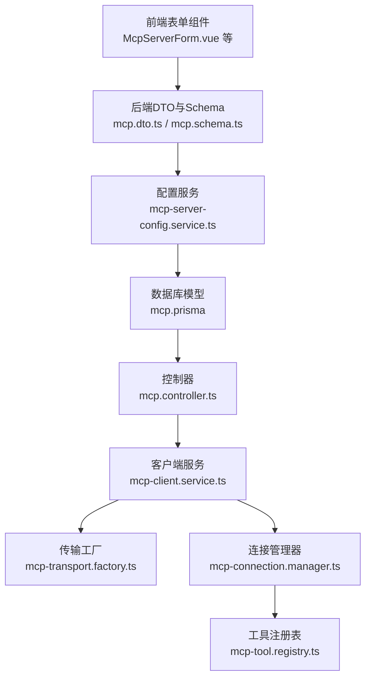
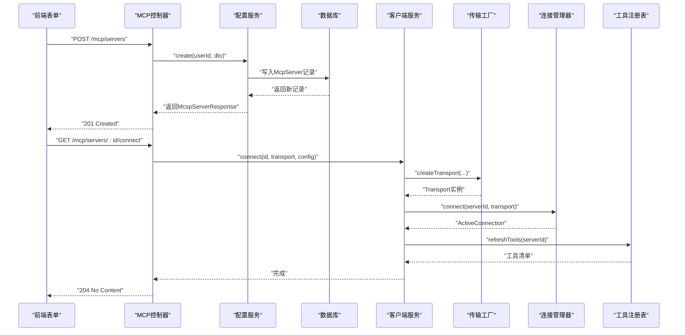
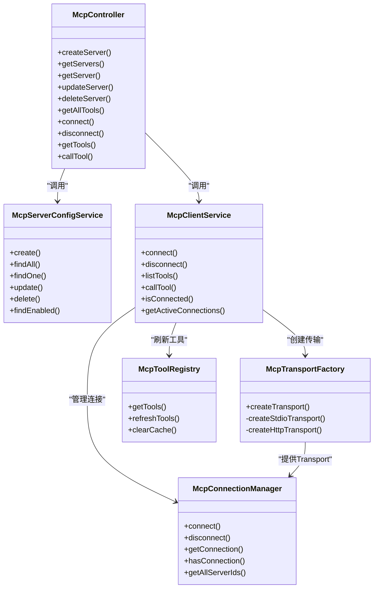

# MCP服务器模型

<cite>
**本文引用的文件**
- [apps/backend/src/mcp/mcp-server-config.service.ts](file://apps/backend/src/mcp/mcp-server-config.service.ts)
- [apps/backend/src/mcp/mcp.dto.ts](file://apps/backend/src/mcp/mcp.dto.ts)
- [packages/shared/src/schemas/mcp.schema.ts](file://packages/shared/src/schemas/mcp.schema.ts)
- [apps/backend/src/mcp/mcp-client.service.ts](file://apps/backend/src/mcp/mcp-client.service.ts)
- [apps/backend/src/mcp/core/mcp-transport.factory.ts](file://apps/backend/src/mcp/core/mcp-transport.factory.ts)
- [apps/backend/src/mcp/core/mcp-connection.manager.ts](file://apps/backend/src/mcp/core/mcp-connection.manager.ts)
- [apps/backend/src/mcp/core/mcp-tool.registry.ts](file://apps/backend/src/mcp/core/mcp-tool.registry.ts)
- [apps/backend/src/mcp/mcp.controller.ts](file://apps/backend/src/mcp/mcp.controller.ts)
- [apps/backend/prisma/schema/mcp.prisma](file://apps/backend/prisma/schema/mcp.prisma)
- [apps/frontend/src/features/mcp/components/McpServerForm.vue](file://apps/frontend/src/features/mcp/components/McpServerForm.vue)
- [apps/frontend/src/features/mcp/components/McpServerHttpConfig.vue](file://apps/frontend/src/features/mcp/components/McpServerHttpConfig.vue)
- [apps/frontend/src/features/mcp/components/McpServerStdioConfig.vue](file://apps/frontend/src/features/mcp/components/McpServerStdioConfig.vue)
- [apps/frontend/src/features/mcp/components/mcpServerForm.types.ts](file://apps/frontend/src/features/mcp/components/mcpServerForm.types.ts)
- [apps/backend/src/common/throttling/throttling.constants.ts](file://apps/backend/src/common/throttling/throttling.constants.ts)
</cite>

## 目录

1. [简介](#简介)
2. [项目结构](#项目结构)
3. [核心组件](#核心组件)
4. [架构总览](#架构总览)
5. [详细组件分析](#详细组件分析)
6. [依赖关系分析](#依赖关系分析)
7. [性能考量](#性能考量)
8. [故障排除指南](#故障排除指南)
9. [结论](#结论)
10. [附录](#附录)

## 简介

本文件系统化梳理并解释MCP服务器配置模型在本仓库中的实现与使用方式，覆盖以下关键主题：

- MCP服务器配置实体的字段定义与约束（名称、描述、连接类型、主机与端口、认证、传输配置等）
- 安全存储与传输机制（API Key、Bearer Token等）
- 传输层配置与重连/超时策略
- 工具发现与协议支持范围
- 服务器状态与健康检查机制
- 最佳实践与故障排除建议

## 项目结构

围绕MCP服务器模型的相关代码分布在后端NestJS应用、共享Schema库以及前端Vue组件中，形成“前端表单输入 → 后端DTO校验与持久化 → 传输工厂与连接管理 → 工具注册表”的完整链路。

图表来源

- [apps/frontend/src/features/mcp/components/McpServerForm.vue:1-188](file://apps/frontend/src/features/mcp/components/McpServerForm.vue#L1-L188)
- [apps/backend/src/mcp/mcp.dto.ts:1-59](file://apps/backend/src/mcp/mcp.dto.ts#L1-L59)
- [packages/shared/src/schemas/mcp.schema.ts:1-220](file://packages/shared/src/schemas/mcp.schema.ts#L1-L220)
- [apps/backend/src/mcp/mcp-server-config.service.ts:1-156](file://apps/backend/src/mcp/mcp-server-config.service.ts#L1-L156)
- [apps/backend/prisma/schema/mcp.prisma:1-16](file://apps/backend/prisma/schema/mcp.prisma#L1-L16)
- [apps/backend/src/mcp/mcp.controller.ts:1-209](file://apps/backend/src/mcp/mcp.controller.ts#L1-L209)
- [apps/backend/src/mcp/mcp-client.service.ts:1-124](file://apps/backend/src/mcp/mcp-client.service.ts#L1-L124)
- [apps/backend/src/mcp/core/mcp-transport.factory.ts:1-220](file://apps/backend/src/mcp/core/mcp-transport.factory.ts#L1-L220)
- [apps/backend/src/mcp/core/mcp-connection.manager.ts:1-101](file://apps/backend/src/mcp/core/mcp-connection.manager.ts#L1-L101)
- [apps/backend/src/mcp/core/mcp-tool.registry.ts:1-48](file://apps/backend/src/mcp/core/mcp-tool.registry.ts#L1-L48)

章节来源

- [apps/backend/src/mcp/mcp-server-config.service.ts:1-156](file://apps/backend/src/mcp/mcp-server-config.service.ts#L1-L156)
- [apps/backend/src/mcp/mcp.dto.ts:1-59](file://apps/backend/src/mcp/mcp.dto.ts#L1-L59)
- [packages/shared/src/schemas/mcp.schema.ts:1-220](file://packages/shared/src/schemas/mcp.schema.ts#L1-L220)
- [apps/backend/src/mcp/mcp.controller.ts:1-209](file://apps/backend/src/mcp/mcp.controller.ts#L1-L209)
- [apps/backend/prisma/schema/mcp.prisma:1-16](file://apps/backend/prisma/schema/mcp.prisma#L1-L16)

## 核心组件

- 配置实体与Schema：定义服务器名称、描述、连接类型、传输配置（HTTP/STDIO）及启用状态等字段，并进行严格校验。
- 配置服务：负责CRUD、所有权校验、启用筛选与响应转换。
- 控制器：对外暴露REST接口，执行鉴权、节流与调用客户端服务。
- 客户端服务：统一门面，协调传输工厂、连接管理器与工具注册表。
- 传输工厂：根据配置创建STDIO或HTTP传输，执行安全校验与环境限制。
- 连接管理器：维护活跃连接，设置请求超时，捕获STDIO错误与关闭事件。
- 工具注册表：缓存工具清单，按需刷新。
- 前端表单：提供HTTP与STDIO配置界面，支持认证类型切换与参数编辑。

章节来源

- [apps/backend/src/mcp/mcp-server-config.service.ts:1-156](file://apps/backend/src/mcp/mcp-server-config.service.ts#L1-L156)
- [apps/backend/src/mcp/mcp-client.service.ts:1-124](file://apps/backend/src/mcp/mcp-client.service.ts#L1-L124)
- [apps/backend/src/mcp/core/mcp-transport.factory.ts:1-220](file://apps/backend/src/mcp/core/mcp-transport.factory.ts#L1-L220)
- [apps/backend/src/mcp/core/mcp-connection.manager.ts:1-101](file://apps/backend/src/mcp/core/mcp-connection.manager.ts#L1-L101)
- [apps/backend/src/mcp/core/mcp-tool.registry.ts:1-48](file://apps/backend/src/mcp/core/mcp-tool.registry.ts#L1-L48)
- [apps/frontend/src/features/mcp/components/McpServerForm.vue:1-188](file://apps/frontend/src/features/mcp/components/McpServerForm.vue#L1-L188)

## 架构总览

下图展示从“前端提交配置”到“后端建立MCP连接并发现工具”的端到端流程。

图表来源

- [apps/backend/src/mcp/mcp.controller.ts:1-209](file://apps/backend/src/mcp/mcp.controller.ts#L1-L209)
- [apps/backend/src/mcp/mcp-server-config.service.ts:1-156](file://apps/backend/src/mcp/mcp-server-config.service.ts#L1-L156)
- [apps/backend/src/mcp/mcp-client.service.ts:1-124](file://apps/backend/src/mcp/mcp-client.service.ts#L1-L124)
- [apps/backend/src/mcp/core/mcp-transport.factory.ts:1-220](file://apps/backend/src/mcp/core/mcp-transport.factory.ts#L1-L220)
- [apps/backend/src/mcp/core/mcp-connection.manager.ts:1-101](file://apps/backend/src/mcp/core/mcp-connection.manager.ts#L1-L101)
- [apps/backend/src/mcp/core/mcp-tool.registry.ts:1-48](file://apps/backend/src/mcp/core/mcp-tool.registry.ts#L1-L48)

## 详细组件分析

### 配置实体与字段定义

- 基础字段
  - 名称：必填且长度限制，用于标识服务器。
  - 描述：可选，用于补充说明。
  - 启用状态：布尔值，默认启用；仅启用的服务器参与工具发现。
  - 连接类型：枚举，支持STDIO与HTTP两种。
- 传输配置
  - STDIO：包含命令、参数数组、环境变量映射、工作目录等。
  - HTTP：包含URL、请求头、认证子配置（Bearer Token、API Key、OAuth）。
- 数据持久化
  - 使用JSON字段存储config，便于灵活承载不同传输类型的配置对象。

章节来源

- [packages/shared/src/schemas/mcp.schema.ts:123-129](file://packages/shared/src/schemas/mcp.schema.ts#L123-L129)
- [packages/shared/src/schemas/mcp.schema.ts:79-86](file://packages/shared/src/schemas/mcp.schema.ts#L79-L86)
- [packages/shared/src/schemas/mcp.schema.ts:99-118](file://packages/shared/src/schemas/mcp.schema.ts#L99-L118)
- [apps/backend/prisma/schema/mcp.prisma:1-16](file://apps/backend/prisma/schema/mcp.prisma#L1-L16)

### 认证字段与安全机制

- 支持的认证类型
  - Bearer：将token放入Authorization头。
  - API Key：将apiKey放入自定义或默认头部（默认X-API-Key）。
  - OAuth：与Bearer类似，由上层提供token。
- 传输安全
  - HTTP URL必须为http/https，且不允许私有/回环域名与特定本地域后缀。
  - 解析目标主机并进行DNS解析，若解析结果指向私有/回环地址则拒绝。
- STDIO安全
  - 默认仅开发环境允许STDIO；生产环境需显式开启并通过白名单控制允许的命令。
  - 对包名进行规范化修正，避免历史包名差异导致的问题。
  - 仅允许有限的环境变量透传，降低敏感信息泄露风险。

章节来源

- [packages/shared/src/schemas/mcp.schema.ts:108-116](file://packages/shared/src/schemas/mcp.schema.ts#L108-L116)
- [apps/backend/src/mcp/core/mcp-transport.factory.ts:91-110](file://apps/backend/src/mcp/core/mcp-transport.factory.ts#L91-L110)
- [apps/backend/src/mcp/core/mcp-transport.factory.ts:128-188](file://apps/backend/src/mcp/core/mcp-transport.factory.ts#L128-L188)
- [apps/backend/src/mcp/core/mcp-transport.factory.ts:67-89](file://apps/backend/src/mcp/core/mcp-transport.factory.ts#L67-L89)

### 传输配置与重连/超时策略

- HTTP传输
  - 在连接前进行URL与主机可达性校验，确保不指向私有/回环网络。
  - 动态导入StreamableHTTP传输，按配置注入请求头与认证信息。
- STDIO传输
  - 校验命令合法性与白名单，必要时对包名进行修正。
  - 仅透传受控环境变量，其余来自进程环境。
- 超时与重连
  - 连接管理器在构造Client时设置请求超时（毫秒级），并在STDIO场景下监听stderr与关闭事件，自动清理连接。
  - 若连接断开，后续操作会触发重新连接（懒加载）。

章节来源

- [apps/backend/src/mcp/core/mcp-transport.factory.ts:190-218](file://apps/backend/src/mcp/core/mcp-transport.factory.ts#L190-L218)
- [apps/backend/src/mcp/core/mcp-connection.manager.ts:29-73](file://apps/backend/src/mcp/core/mcp-connection.manager.ts#L29-L73)

### 工具发现与协议支持范围

- 工具发现
  - 通过连接管理器获取Client实例，调用listTools获取工具清单。
  - 工具注册表缓存工具列表，失败时回退到已有缓存。
- 协议支持
  - 通过SDK Client与Server进行MCP协议交互，具体能力由Server端实现决定。
  - 本项目未在客户端侧显式声明capabilities，而是采用空对象初始化，表示遵循SDK默认行为。

章节来源

- [apps/backend/src/mcp/core/mcp-tool.registry.ts:20-42](file://apps/backend/src/mcp/core/mcp-tool.registry.ts#L20-L42)
- [apps/backend/src/mcp/core/mcp-connection.manager.ts:29-40](file://apps/backend/src/mcp/core/mcp-connection.manager.ts#L29-L40)

### 服务器状态与健康检查

- 连接状态
  - 通过连接管理器维护活跃连接Map，提供查询与断开能力。
  - 客户端服务暴露isConnected与getActiveConnections，便于UI与业务层感知。
- 健康检查
  - 连接管理器在STDIO场景下监听stderr输出与关闭事件，便于快速定位异常。
  - 控制器在工具发现与调用前进行懒加载连接，失败时记录日志并跳过该服务器。

章节来源

- [apps/backend/src/mcp/core/mcp-connection.manager.ts:89-99](file://apps/backend/src/mcp/core/mcp-connection.manager.ts#L89-L99)
- [apps/backend/src/mcp/mcp-client.service.ts:113-122](file://apps/backend/src/mcp/mcp-client.service.ts#L113-L122)
- [apps/backend/src/mcp/mcp.controller.ts:119-135](file://apps/backend/src/mcp/mcp.controller.ts#L119-L135)

### 前端表单与交互

- 表单状态
  - 统一的表单状态类型定义，涵盖名称、描述、连接类型、启用状态与传输配置。
- HTTP配置
  - 支持认证类型切换（无、Bearer、API Key），动态提示URL中可能存在的密钥参数。
- STDIO配置
  - 支持命令、参数与环境变量的增删改，提交前进行标准化处理（拆分命令与参数、去重、收尾处理）。

章节来源

- [apps/frontend/src/features/mcp/components/mcpServerForm.types.ts:1-25](file://apps/frontend/src/features/mcp/components/mcpServerForm.types.ts#L1-L25)
- [apps/frontend/src/features/mcp/components/McpServerHttpConfig.vue:1-180](file://apps/frontend/src/features/mcp/components/McpServerHttpConfig.vue#L1-L180)
- [apps/frontend/src/features/mcp/components/McpServerStdioConfig.vue:1-215](file://apps/frontend/src/features/mcp/components/McpServerStdioConfig.vue#L1-L215)
- [apps/frontend/src/features/mcp/components/McpServerForm.vue:1-188](file://apps/frontend/src/features/mcp/components/McpServerForm.vue#L1-L188)

## 依赖关系分析

- 后端模块内聚度高，职责清晰：控制器负责接口与节流，服务负责数据访问，客户端服务作为门面协调传输与连接，传输工厂与连接管理器分别承担“创建”和“生命周期管理”，工具注册表负责“发现与缓存”。
- 前后端通过共享Schema与DTO保持一致的数据契约，前端负责用户体验与输入校验，后端负责安全与业务规则。

图表来源

- [apps/backend/src/mcp/mcp.controller.ts:1-209](file://apps/backend/src/mcp/mcp.controller.ts#L1-L209)
- [apps/backend/src/mcp/mcp-server-config.service.ts:1-156](file://apps/backend/src/mcp/mcp-server-config.service.ts#L1-L156)
- [apps/backend/src/mcp/mcp-client.service.ts:1-124](file://apps/backend/src/mcp/mcp-client.service.ts#L1-L124)
- [apps/backend/src/mcp/core/mcp-transport.factory.ts:1-220](file://apps/backend/src/mcp/core/mcp-transport.factory.ts#L1-L220)
- [apps/backend/src/mcp/core/mcp-connection.manager.ts:1-101](file://apps/backend/src/mcp/core/mcp-connection.manager.ts#L1-L101)
- [apps/backend/src/mcp/core/mcp-tool.registry.ts:1-48](file://apps/backend/src/mcp/core/mcp-tool.registry.ts#L1-L48)

## 性能考量

- 节流策略
  - 连接、工具发现与工具调用均配置独立节流策略，避免滥用与资源争抢。
- 连接复用
  - 连接管理器复用已建立的连接，减少重复握手成本。
- 缓存策略
  - 工具注册表缓存工具清单，刷新失败时回退至旧缓存，提升稳定性。
- 超时设置
  - 连接管理器设置请求超时，防止长时间阻塞影响吞吐。

章节来源

- [apps/backend/src/common/throttling/throttling.constants.ts:144-160](file://apps/backend/src/common/throttling/throttling.constants.ts#L144-L160)
- [apps/backend/src/mcp/core/mcp-connection.manager.ts:35-38](file://apps/backend/src/mcp/core/mcp-connection.manager.ts#L35-L38)
- [apps/backend/src/mcp/core/mcp-tool.registry.ts:13-18](file://apps/backend/src/mcp/core/mcp-tool.registry.ts#L13-L18)

## 故障排除指南

- 无法连接STDIO服务器
  - 检查是否处于生产环境且未开启STDIO或未配置允许命令白名单。
  - 确认命令不含空格（应拆分为command与args）。
  - 查看stderr输出与关闭事件日志。
- HTTP连接被拒绝
  - URL是否为http/https；主机是否为私有/回环或本地域后缀。
  - DNS解析是否能解析到非私有/回环地址。
- 认证失败
  - Bearer：确认Authorization头是否正确设置。
  - API Key：确认头部名称与值是否正确，注意默认头部键名。
- 工具不可见
  - 确认服务器处于启用状态。
  - 确认已建立连接后再进行工具发现。
  - 检查工具注册表缓存是否有效。
- 接口限流
  - 观察节流策略配置，避免过于频繁的连接/调用请求。

章节来源

- [apps/backend/src/mcp/core/mcp-transport.factory.ts:67-89](file://apps/backend/src/mcp/core/mcp-transport.factory.ts#L67-L89)
- [apps/backend/src/mcp/core/mcp-transport.factory.ts:91-110](file://apps/backend/src/mcp/core/mcp-transport.factory.ts#L91-L110)
- [apps/backend/src/mcp/core/mcp-connection.manager.ts:44-58](file://apps/backend/src/mcp/core/mcp-connection.manager.ts#L44-L58)
- [apps/backend/src/mcp/core/mcp-tool.registry.ts:20-42](file://apps/backend/src/mcp/core/mcp-tool.registry.ts#L20-L42)
- [apps/backend/src/common/throttling/throttling.constants.ts:144-160](file://apps/backend/src/common/throttling/throttling.constants.ts#L144-L160)

## 结论

本MCP服务器模型在“数据契约（共享Schema）—前端表单—后端DTO/服务—传输与连接—工具注册表”的全链路上实现了强约束与安全控制。通过严格的URL与主机校验、可控的STDIO白名单、合理的超时与缓存策略，以及面向生产的节流与错误处理，既保证了易用性也兼顾了安全性与稳定性。

## 附录

### 字段定义与约束速览

- 基础字段
  - 名称：必填，最大长度限制。
  - 描述：可选，最大长度限制。
  - 启用状态：布尔值，默认启用。
  - 连接类型：枚举（STDIO/HTTP）。
- 传输配置
  - STDIO：命令、参数数组、环境变量映射、工作目录。
  - HTTP：URL、请求头、认证（Bearer Token/API Key/OAuth）。
- 数据存储
  - JSON字段存储config，支持灵活扩展。

章节来源

- [packages/shared/src/schemas/mcp.schema.ts:123-129](file://packages/shared/src/schemas/mcp.schema.ts#L123-L129)
- [packages/shared/src/schemas/mcp.schema.ts:79-86](file://packages/shared/src/schemas/mcp.schema.ts#L79-L86)
- [packages/shared/src/schemas/mcp.schema.ts:99-118](file://packages/shared/src/schemas/mcp.schema.ts#L99-L118)
- [apps/backend/prisma/schema/mcp.prisma:1-16](file://apps/backend/prisma/schema/mcp.prisma#L1-L16)
