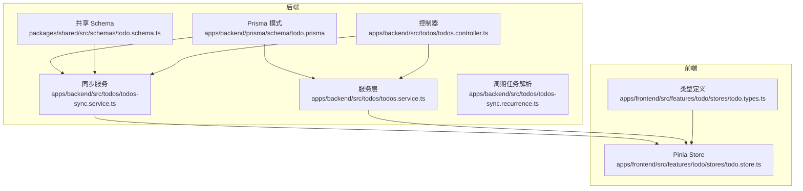
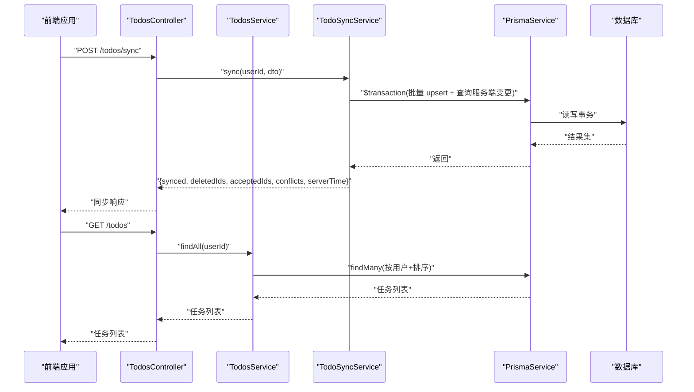
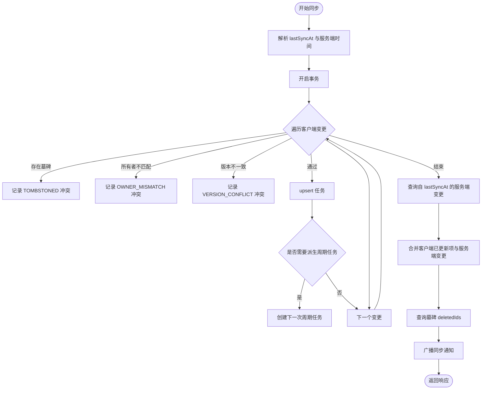
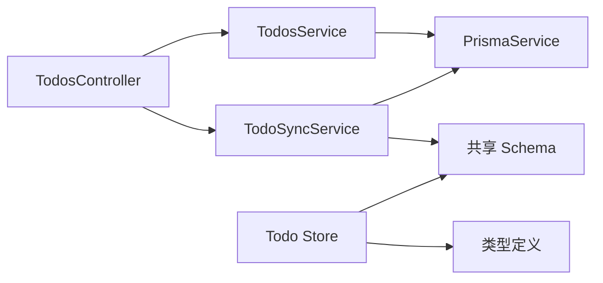

# 任务模型

<cite>
**本文引用的文件**
- [apps/backend/prisma/schema/todo.prisma](file://apps/backend/prisma/schema/todo.prisma)
- [packages/shared/src/schemas/todo.schema.ts](file://packages/shared/src/schemas/todo.schema.ts)
- [apps/backend/src/todos/todos.service.ts](file://apps/backend/src/todos/todos.service.ts)
- [apps/backend/src/todos/todos.controller.ts](file://apps/backend/src/todos/todos.controller.ts)
- [apps/backend/src/todos/todos-sync.service.ts](file://apps/backend/src/todos/todos-sync.service.ts)
- [apps/backend/src/todos/todos-sync.recurrence.ts](file://apps/backend/src/todos/todos-sync.recurrence.ts)
- [apps/backend/tests/todos.service.spec.ts](file://apps/backend/tests/todos.service.spec.ts)
- [apps/backend/tests/todos-sync.service.spec.ts](file://apps/backend/tests/todos-sync.service.spec.ts)
- [apps/frontend/src/features/todo/stores/todo.store.ts](file://apps/frontend/src/features/todo/stores/todo.store.ts)
- [apps/frontend/src/features/todo/stores/todo.types.ts](file://apps/frontend/src/features/todo/stores/todo.types.ts)
</cite>

## 目录

1. [简介](#简介)
2. [项目结构](#项目结构)
3. [核心组件](#核心组件)
4. [架构总览](#架构总览)
5. [详细组件分析](#详细组件分析)
6. [依赖分析](#依赖分析)
7. [性能考虑](#性能考虑)
8. [故障排查指南](#故障排查指南)
9. [结论](#结论)
10. [附录](#附录)

## 简介

本文件系统化梳理 Todo 任务模型的字段定义、状态流转、时间管理、父子任务关系、分类组织、并发控制与同步机制，并提供复杂查询示例与性能优化建议。目标读者既包括后端工程师，也包括对数据模型感兴趣的前端与产品同学。

## 项目结构

围绕任务模型的关键文件分布于后端 Prisma 模式、共享 Schema、后端服务与控制器、前端 Pinia Store 与类型定义中。下图展示与任务模型直接相关的模块与文件映射：

图表来源

- [apps/backend/prisma/schema/todo.prisma:1-40](file://apps/backend/prisma/schema/todo.prisma#L1-L40)
- [packages/shared/src/schemas/todo.schema.ts:1-76](file://packages/shared/src/schemas/todo.schema.ts#L1-L76)
- [apps/backend/src/todos/todos.controller.ts:1-70](file://apps/backend/src/todos/todos.controller.ts#L1-L70)
- [apps/backend/src/todos/todos.service.ts:1-147](file://apps/backend/src/todos/todos.service.ts#L1-L147)
- [apps/backend/src/todos/todos-sync.service.ts:1-226](file://apps/backend/src/todos/todos-sync.service.ts#L1-L226)
- [apps/backend/src/todos/todos-sync.recurrence.ts:1-210](file://apps/backend/src/todos/todos-sync.recurrence.ts#L1-L210)
- [apps/frontend/src/features/todo/stores/todo.store.ts:1-389](file://apps/frontend/src/features/todo/stores/todo.store.ts#L1-L389)
- [apps/frontend/src/features/todo/stores/todo.types.ts:1-69](file://apps/frontend/src/features/todo/stores/todo.types.ts#L1-L69)

章节来源

- [apps/backend/prisma/schema/todo.prisma:1-40](file://apps/backend/prisma/schema/todo.prisma#L1-L40)
- [packages/shared/src/schemas/todo.schema.ts:1-76](file://packages/shared/src/schemas/todo.schema.ts#L1-L76)
- [apps/backend/src/todos/todos.controller.ts:1-70](file://apps/backend/src/todos/todos.controller.ts#L1-L70)
- [apps/backend/src/todos/todos.service.ts:1-147](file://apps/backend/src/todos/todos.service.ts#L1-L147)
- [apps/backend/src/todos/todos-sync.service.ts:1-226](file://apps/backend/src/todos/todos-sync.service.ts#L1-L226)
- [apps/backend/src/todos/todos-sync.recurrence.ts:1-210](file://apps/backend/src/todos/todos-sync.recurrence.ts#L1-L210)
- [apps/frontend/src/features/todo/stores/todo.store.ts:1-389](file://apps/frontend/src/features/todo/stores/todo.store.ts#L1-L389)
- [apps/frontend/src/features/todo/stores/todo.types.ts:1-69](file://apps/frontend/src/features/todo/stores/todo.types.ts#L1-L69)

## 核心组件

- 数据模型（Prisma）
  - 关键字段：id、title、completed、order、isPinned、parentId、userId、version、dueAt、remindAt、remindedAt、recurrenceRule、recurrenceTz、recurrenceSpawnedAt、createdAt、updatedAt、completedAt、deferredAt、deletedAt、pomodoroCount
  - 索引：(userId, updatedAt)、(userId, remindAt)、(userId, dueAt)、(deletedAt)
- 共享 Schema（Zod）
  - 定义了 Todo 的序列化/反序列化约束，包含日期字段支持字符串或 Date 类型，recurrenceRule 枚举，以及同步相关字段与校验
- 后端服务
  - 基础查询：按用户筛选、排序（按 isPinned、order、createdAt）
  - 回收站：查询 deletedAt 非空的任务
  - 恢复/永久删除/清空回收站：带 Tombstone 记录与事件广播
- 同步服务
  - 离线优先合并：基于版本号冲突检测、墓碑忽略、周期任务生成与时区处理
- 前端 Store
  - 统一 Todo 类型、日期归一化、过滤/排序、同步状态与冲突管理、父子展开状态持久化

章节来源

- [apps/backend/prisma/schema/todo.prisma:1-40](file://apps/backend/prisma/schema/todo.prisma#L1-L40)
- [packages/shared/src/schemas/todo.schema.ts:1-76](file://packages/shared/src/schemas/todo.schema.ts#L1-L76)
- [apps/backend/src/todos/todos.service.ts:35-145](file://apps/backend/src/todos/todos.service.ts#L35-L145)
- [apps/backend/src/todos/todos-sync.service.ts:49-224](file://apps/backend/src/todos/todos-sync.service.ts#L49-L224)
- [apps/frontend/src/features/todo/stores/todo.store.ts:1-389](file://apps/frontend/src/features/todo/stores/todo.store.ts#L1-L389)

## 架构总览

下图展示“客户端 → 控制器 → 服务 → Prisma → 数据库”的端到端调用链，以及“同步服务”在事务内处理客户端变更与服务端拉取的流程。

图表来源

- [apps/backend/src/todos/todos.controller.ts:30-68](file://apps/backend/src/todos/todos.controller.ts#L30-L68)
- [apps/backend/src/todos/todos.service.ts:35-47](file://apps/backend/src/todos/todos.service.ts#L35-L47)
- [apps/backend/src/todos/todos-sync.service.ts:52-224](file://apps/backend/src/todos/todos-sync.service.ts#L52-L224)

章节来源

- [apps/backend/src/todos/todos.controller.ts:1-70](file://apps/backend/src/todos/todos.controller.ts#L1-L70)
- [apps/backend/src/todos/todos.service.ts:1-147](file://apps/backend/src/todos/todos.service.ts#L1-L147)
- [apps/backend/src/todos/todos-sync.service.ts:1-226](file://apps/backend/src/todos/todos-sync.service.ts#L1-L226)

## 详细组件分析

### 字段定义与业务语义

- 标题与描述
  - title：必填，长度限制由共享 Schema 约束
- 状态与优先级
  - completed：布尔完成标记；配合父任务联动（见“父子任务关系”）
  - isPinned：置顶排序优先
  - order：同级排序权重
  - pomodoroCount：专注计数（用于统计与追踪）
- 时间管理
  - dueAt：到期时间（可为空）
  - remindAt：提醒时间（可为空）
  - remindedAt：实际提醒时间（用于保持提醒一致性）
  - completedAt：完成时间（可为空）
  - deferredAt：推迟时间（可为空）
  - createdAt/updatedAt：记录创建与最后修改
  - deletedAt：软删除标记（配合 Tombstone）
- 周期任务
  - recurrenceRule：枚举 DAILY/WEEKDAYS/WEEKLY/MONTHLY
  - recurrenceTz：周期时区（校验有效性）
  - recurrenceSpawnedAt：已生成下一次周期任务的时间戳（防重复生成）
- 并发控制
  - version：整型版本号，严格版本匹配避免客户端时钟漂移导致的冲突
- 用户与层级
  - userId：归属用户
  - parentId：父任务 id（可空）

章节来源

- [apps/backend/prisma/schema/todo.prisma:1-40](file://apps/backend/prisma/schema/todo.prisma#L1-L40)
- [packages/shared/src/schemas/todo.schema.ts:8-28](file://packages/shared/src/schemas/todo.schema.ts#L8-L28)
- [apps/backend/src/todos/todos-sync.recurrence.ts:9-28](file://apps/backend/src/todos/todos-sync.recurrence.ts#L9-L28)

### 任务状态与转换规则

- 状态来源
  - completed：任务完成主状态
  - completedAt：完成时间戳
  - deletedAt：软删除状态
  - deferredAt：推迟状态
- 转换规则
  - 完成 → 推迟：当任务被推迟且仍为子任务时，清除 parentId 并设置 deferredAt
  - 子任务完成 → 父任务联动：若子任务全部完成，则父任务也应视为完成
  - 周期任务完成 → 自动派生下一次任务：满足条件时生成下一条相同规则的待办
- 注意
  - 父子任务联动与推迟清理在前端 Store 中有行为验证（测试覆盖）

章节来源

- [apps/backend/tests/todos-sync.service.spec.ts:105-141](file://apps/backend/tests/todos-sync.service.spec.ts#L105-L141)
- [apps/frontend/tests/features/todo/stores/todo.actions.spec.ts:221-230](file://apps/frontend/tests/features/todo/stores/todo.actions.spec.ts#L221-L230)
- [apps/frontend/tests/features/todo/stores/todo.actions.spec.ts:232-262](file://apps/frontend/tests/features/todo/stores/todo.actions.spec.ts#L232-L262)
- [apps/frontend/tests/features/todo/stores/todo.actions.spec.ts:821-838](file://apps/frontend/tests/features/todo/stores/todo.actions.spec.ts#L821-L838)

### 时间处理机制

- dueAt/remindAt/remindedAt
  - 客户端可传入字符串或 Date，服务端统一解析为 Date
  - 提醒一致性：当现有 remindAt 与客户端一致时，保留 remindedAt
- 周期任务时间推进
  - 基于 dueAt 与 recurrenceTz 推进下一次 dueAt/remindAt
  - 周末跳过（WEEKDAYS 规则）
  - 夏令时（DST）保持“墙钟时间”不变
- 推迟与到期
  - 推迟任务在成为子任务时清除 deferredAt
  - 完成任务在成为子任务时清除 deferredAt

章节来源

- [apps/backend/src/todos/todos-sync.recurrence.ts:52-85](file://apps/backend/src/todos/todos-sync.recurrence.ts#L52-L85)
- [apps/backend/src/todos/todos-sync.recurrence.ts:59-78](file://apps/backend/src/todos/todos-sync.recurrence.ts#L59-L78)
- [apps/backend/src/todos/todos-sync.recurrence.ts:107-150](file://apps/backend/src/todos/todos-sync.recurrence.ts#L107-L150)
- [apps/backend/tests/todos-sync.service.spec.ts:541-587](file://apps/backend/tests/todos-sync.service.spec.ts#L541-L587)

### 父子任务关系与层级

- 结构设计
  - parentId：指向父任务 id（可空）
  - order：同父任务内的顺序
  - isPinned：父任务置顶优先
- 行为规则
  - 子任务完成 → 父任务联动完成
  - 子任务被推迟 → 清除 parentId 并设置 deferredAt
  - 子任务被设为子任务 → 清除 deferredAt
- 展开与排序
  - 前端根据 isPinned 与 order 排序，支持树形展开

章节来源

- [apps/frontend/tests/features/todo/stores/todo.actions.spec.ts:221-230](file://apps/frontend/tests/features/todo/stores/todo.actions.spec.ts#L221-L230)
- [apps/frontend/tests/features/todo/stores/todo.actions.spec.ts:232-262](file://apps/frontend/tests/features/todo/stores/todo.actions.spec.ts#L232-L262)
- [apps/frontend/tests/features/todo/stores/todo.actions.spec.ts:821-838](file://apps/frontend/tests/features/todo/stores/todo.actions.spec.ts#L821-L838)
- [apps/frontend/src/features/todo/stores/todo.store.ts:47-49](file://apps/frontend/src/features/todo/stores/todo.store.ts#L47-L49)

### 分类与组织

- 当前模型未包含 categoryId、tags 字段
- 若需扩展分类与标签，可在 Prisma 模式中新增关联表或 JSON 字段，并在共享 Schema 与服务层补充校验与查询逻辑

章节来源

- [apps/backend/prisma/schema/todo.prisma:1-40](file://apps/backend/prisma/schema/todo.prisma#L1-L40)
- [packages/shared/src/schemas/todo.schema.ts:1-76](file://packages/shared/src/schemas/todo.schema.ts#L1-L76)

### 并发控制与同步

- 版本号机制
  - version：严格版本匹配，避免客户端时钟漂移导致的冲突
- 墓碑机制
  - 删除任务写入 Tombstone，客户端再次推送时被忽略并返回冲突
- 同步流程
  - 事务内批量 upsert 客户端变更
  - 拉取自 lastSyncAt 以来的服务端变更
  - 返回 acceptedIds/conflicts/deletedIds/serverTime

图表来源

- [apps/backend/src/todos/todos-sync.service.ts:52-224](file://apps/backend/src/todos/todos-sync.service.ts#L52-L224)
- [apps/backend/src/todos/todos-sync.recurrence.ts:153-209](file://apps/backend/src/todos/todos-sync.recurrence.ts#L153-L209)

章节来源

- [apps/backend/src/todos/todos-sync.service.ts:49-224](file://apps/backend/src/todos/todos-sync.service.ts#L49-L224)
- [apps/backend/tests/todos-sync.service.spec.ts:237-267](file://apps/backend/tests/todos-sync.service.spec.ts#L237-L267)
- [apps/backend/tests/todos-sync.service.spec.ts:269-327](file://apps/backend/tests/todos-sync.service.spec.ts#L269-L327)
- [apps/backend/tests/todos-sync.service.spec.ts:329-402](file://apps/backend/tests/todos-sync.service.spec.ts#L329-L402)

### 复杂查询示例与性能优化

- 常见查询
  - 获取用户所有未删除任务并按置顶、顺序、创建时间排序
    - 参考：[findAll 实现:38-47](file://apps/backend/src/todos/todos.service.ts#L38-L47)
  - 获取回收站任务（按删除时间倒序）
    - 参考：[findTrash 实现:52-61](file://apps/backend/src/todos/todos.service.ts#L52-L61)
  - 按索引高效查询
    - (userId, updatedAt)：增量同步拉取
    - (userId, remindAt)：提醒扫描
    - (userId, dueAt)：到期扫描
    - (deletedAt)：回收站扫描
    - 参考：[索引定义:24-28](file://apps/backend/prisma/schema/todo.prisma#L24-L28)
- 性能建议
  - 使用索引覆盖查询，减少回表
  - 增量同步采用 gte 条件并结合 lastSyncAt
  - 周期任务派生仅在必要时创建，避免重复生成
  - 前端 Store 对日期进行本地归一化，减少渲染抖动

章节来源

- [apps/backend/src/todos/todos.service.ts:35-61](file://apps/backend/src/todos/todos.service.ts#L35-L61)
- [apps/backend/prisma/schema/todo.prisma:24-28](file://apps/backend/prisma/schema/todo.prisma#L24-L28)
- [apps/backend/tests/todos-sync.service.spec.ts:143-172](file://apps/backend/tests/todos-sync.service.spec.ts#L143-L172)

## 依赖分析

- 后端
  - 控制器依赖服务与同步服务
  - 服务与同步服务依赖 PrismaService
  - 共享 Schema 作为前后端契约
- 前端
  - Store 依赖共享类型与同步云函数
  - 类型定义与 Store 保持一致

图表来源

- [apps/backend/src/todos/todos.controller.ts:25-28](file://apps/backend/src/todos/todos.controller.ts#L25-L28)
- [apps/backend/src/todos/todos.service.ts:29-33](file://apps/backend/src/todos/todos.service.ts#L29-L33)
- [apps/backend/src/todos/todos-sync.service.ts:43-47](file://apps/backend/src/todos/todos-sync.service.ts#L43-L47)
- [packages/shared/src/schemas/todo.schema.ts:1-76](file://packages/shared/src/schemas/todo.schema.ts#L1-L76)
- [apps/frontend/src/features/todo/stores/todo.store.ts:221-232](file://apps/frontend/src/features/todo/stores/todo.store.ts#L221-L232)
- [apps/frontend/src/features/todo/stores/todo.types.ts:3-19](file://apps/frontend/src/features/todo/stores/todo.types.ts#L3-L19)

章节来源

- [apps/backend/src/todos/todos.controller.ts:1-70](file://apps/backend/src/todos/todos.controller.ts#L1-L70)
- [apps/backend/src/todos/todos.service.ts:1-147](file://apps/backend/src/todos/todos.service.ts#L1-L147)
- [apps/backend/src/todos/todos-sync.service.ts:1-226](file://apps/backend/src/todos/todos-sync.service.ts#L1-L226)
- [packages/shared/src/schemas/todo.schema.ts:1-76](file://packages/shared/src/schemas/todo.schema.ts#L1-L76)
- [apps/frontend/src/features/todo/stores/todo.store.ts:1-389](file://apps/frontend/src/features/todo/stores/todo.store.ts#L1-L389)
- [apps/frontend/src/features/todo/stores/todo.types.ts:1-69](file://apps/frontend/src/features/todo/stores/todo.types.ts#L1-L69)

## 性能考虑

- 数据库层面
  - 利用复合索引加速增量同步与提醒/到期扫描
  - 事务批处理 upsert，降低锁竞争
- 应用层面
  - 前端 Store 对日期归一化与展开状态持久化，减少无效渲染
  - 同步服务在事务内完成 upsert 与查询，避免中间态暴露
- 周期任务
  - 仅在首次完成时派生下一次任务，避免重复创建
  - 时区推进使用 dayjs 插件，确保跨 DST 的稳定性

## 故障排查指南

- 冲突类型
  - TOMBSTONED：客户端推送已被删除的任务
  - OWNER_MISMATCH：任务归属不匹配
  - VERSION_CONFLICT：版本号不一致
- 排查步骤
  - 检查 lastSyncAt 是否有效，服务端会回退到 epoch
  - 核对客户端提交的 version 与服务端现有 version
  - 确认墓碑记录是否存在
- 相关测试
  - 冲突与墓碑、版本不一致、周期任务派生等均有单元测试覆盖

章节来源

- [apps/backend/tests/todos-sync.service.spec.ts:237-267](file://apps/backend/tests/todos-sync.service.spec.ts#L237-L267)
- [apps/backend/tests/todos-sync.service.spec.ts:269-327](file://apps/backend/tests/todos-sync.service.spec.ts#L269-L327)
- [apps/backend/tests/todos-sync.service.spec.ts:329-402](file://apps/backend/tests/todos-sync.service.spec.ts#L329-L402)

## 结论

该任务模型以 Prisma 为核心，结合共享 Schema、严格的版本控制与墓碑机制，实现了离线优先的增量同步。通过索引与事务优化，兼顾了查询效率与并发安全。父子任务联动、周期任务与时区处理完善了日常使用场景。未来可按需扩展分类与标签字段，保持与现有契约一致。

## 附录

- 字段对照表（Prisma 模式 → 共享 Schema → 前端类型）
  - id/title/completed/order/isPinned/parentId/version/pomodoroCount → 三处一致
  - dueAt/remindAt/remindedAt/recurrenceRule/recurrenceTz/recurrenceSpawnedAt → 三处一致
  - createdAt/updatedAt/completedAt/deferredAt/deletedAt → 三处一致
- 周期规则
  - DAILY/WEEKDAYS/WEEKLY/MONTHLY
- 时区处理
  - 使用 dayjs.utc 与 dayjs.timezone，确保跨 DST 的“墙钟时间”稳定

章节来源

- [apps/backend/prisma/schema/todo.prisma:1-40](file://apps/backend/prisma/schema/todo.prisma#L1-L40)
- [packages/shared/src/schemas/todo.schema.ts:3-22](file://packages/shared/src/schemas/todo.schema.ts#L3-L22)
- [apps/frontend/src/features/todo/stores/todo.types.ts:3-19](file://apps/frontend/src/features/todo/stores/todo.types.ts#L3-L19)
- [apps/backend/src/todos/todos-sync.recurrence.ts:9-50](file://apps/backend/src/todos/todos-sync.recurrence.ts#L9-L50)
