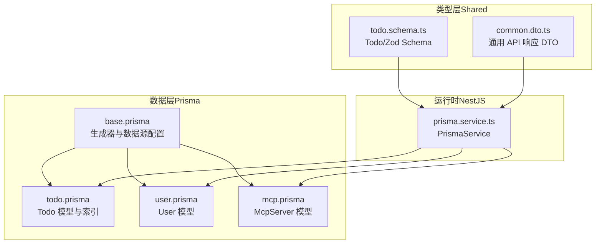
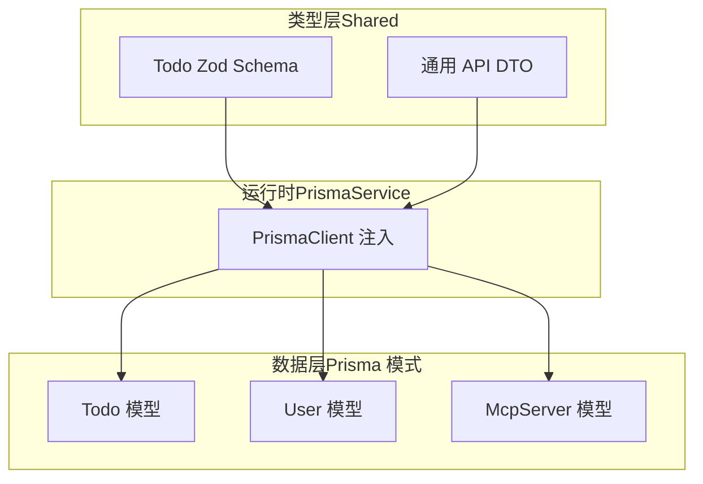
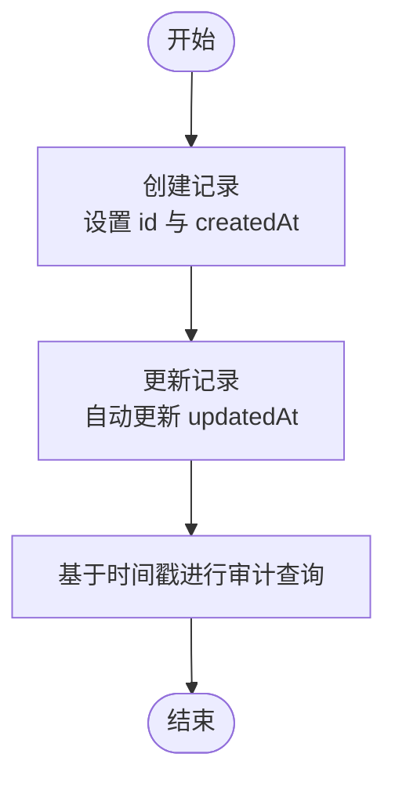
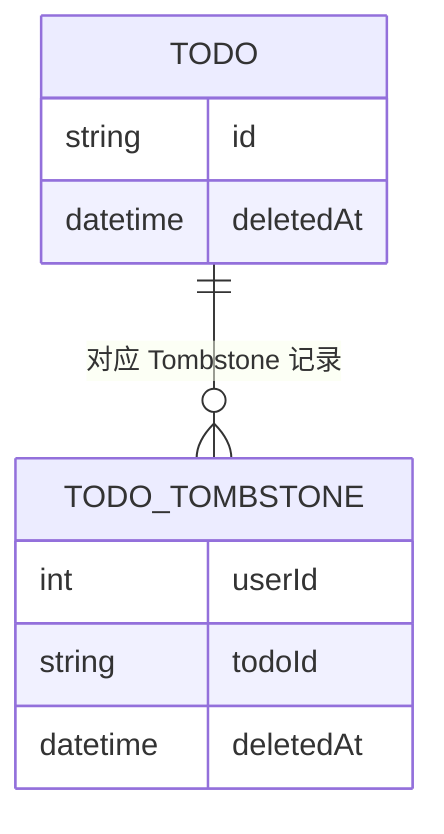
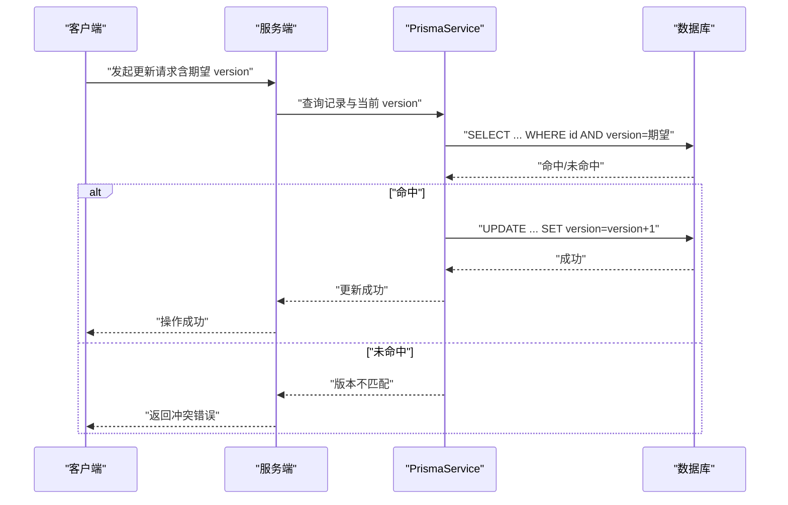
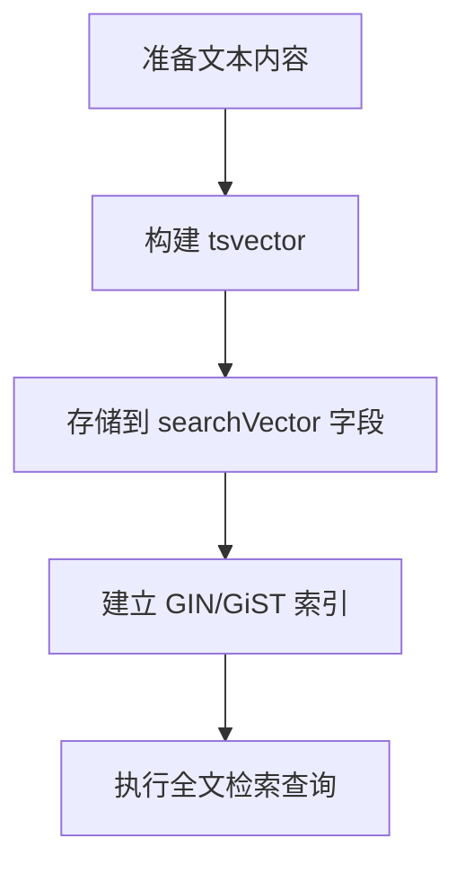
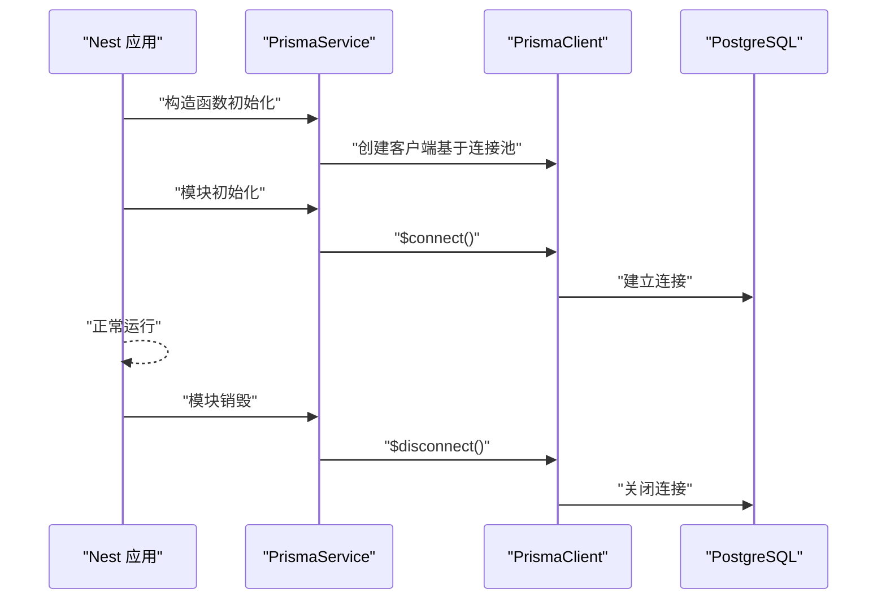
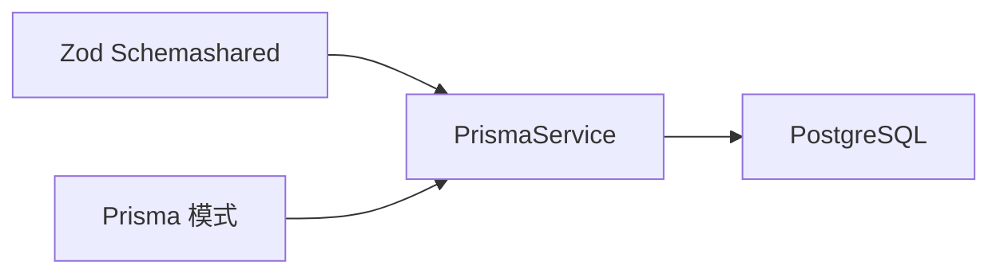

# 共享模型

<cite>
**本文引用的文件**
- [apps/backend/prisma/schema/base.prisma](file://apps/backend/prisma/schema/base.prisma)
- [apps/backend/prisma/schema/todo.prisma](file://apps/backend/prisma/schema/todo.prisma)
- [apps/backend/prisma/schema/user.prisma](file://apps/backend/prisma/schema/user.prisma)
- [apps/backend/prisma/schema/mcp.prisma](file://apps/backend/prisma/schema/mcp.prisma)
- [packages/shared/src/schemas/todo.schema.ts](file://packages/shared/src/schemas/todo.schema.ts)
- [packages/shared/src/dto/common.dto.ts](file://packages/shared/src/dto/common.dto.ts)
- [apps/backend/src/prisma/prisma.service.ts](file://apps/backend/src/prisma/prisma.service.ts)
</cite>

## 目录

1. [简介](#简介)
2. [项目结构](#项目结构)
3. [核心组件](#核心组件)
4. [架构总览](#架构总览)
5. [详细组件分析](#详细组件分析)
6. [依赖关系分析](#依赖关系分析)
7. [性能考量](#性能考量)
8. [故障排查指南](#故障排查指南)
9. [结论](#结论)
10. [附录](#附录)

## 简介

本文件围绕“共享基础模型”进行系统化说明，重点覆盖以下主题：

- 通用字段：id、createdAt、updatedAt 的设计理念与审计追踪机制
- 软删除字段：deletedAt、deletedBy 的实现原理与数据保护策略
- 版本控制字段：version 在并发场景下的乐观锁实现
- 索引优化字段：searchVector 的全文搜索支持（概念性说明）
- 数据验证规则：createdAt 默认值、updatedBy 自动更新的触发器机制（概念性说明）
- 跨模块一致性与迁移策略：Prisma 迁移与共享模式的协同
- 实际 Prisma 客户端使用示例与 TypeScript 类型推导路径

本说明面向不同技术背景的读者，既提供高层概览，也给出可追溯到源码的实现细节与图示。

## 项目结构

共享模型主要由三部分构成：

- 数据层（Prisma 模式定义）：在 schema 中声明模型、字段、索引与约束
- 类型层（Zod Schema 与 DTO）：在 shared 包中定义前端/后端共用的数据契约与类型
- 运行时（Prisma 客户端服务）：在 NestJS 中注入 PrismaService 提供数据库连接与生命周期管理

**图表来源**

- [apps/backend/prisma/schema/base.prisma:1-9](file://apps/backend/prisma/schema/base.prisma#L1-L9)
- [apps/backend/prisma/schema/todo.prisma:1-40](file://apps/backend/prisma/schema/todo.prisma#L1-L40)
- [apps/backend/prisma/schema/user.prisma:1-16](file://apps/backend/prisma/schema/user.prisma#L1-L16)
- [apps/backend/prisma/schema/mcp.prisma:1-16](file://apps/backend/prisma/schema/mcp.prisma#L1-L16)
- [packages/shared/src/schemas/todo.schema.ts:1-76](file://packages/shared/src/schemas/todo.schema.ts#L1-L76)
- [packages/shared/src/dto/common.dto.ts:1-81](file://packages/shared/src/dto/common.dto.ts#L1-L81)
- [apps/backend/src/prisma/prisma.service.ts:1-34](file://apps/backend/src/prisma/prisma.service.ts#L1-L34)

**章节来源**

- [apps/backend/prisma/schema/base.prisma:1-9](file://apps/backend/prisma/schema/base.prisma#L1-L9)
- [apps/backend/prisma/schema/todo.prisma:1-40](file://apps/backend/prisma/schema/todo.prisma#L1-L40)
- [apps/backend/prisma/schema/user.prisma:1-16](file://apps/backend/prisma/schema/user.prisma#L1-L16)
- [apps/backend/prisma/schema/mcp.prisma:1-16](file://apps/backend/prisma/schema/mcp.prisma#L1-L16)
- [packages/shared/src/schemas/todo.schema.ts:1-76](file://packages/shared/src/schemas/todo.schema.ts#L1-L76)
- [packages/shared/src/dto/common.dto.ts:1-81](file://packages/shared/src/dto/common.dto.ts#L1-L81)
- [apps/backend/src/prisma/prisma.service.ts:1-34](file://apps/backend/src/prisma/prisma.service.ts#L1-L34)

## 核心组件

本节聚焦共享模型的关键字段与行为，结合 Prisma 模式与 Zod 类型进行说明。

- 通用标识与时间戳
  - id：全局唯一标识，用于跨模块关联与审计
  - createdAt：记录创建时间，默认值由数据库函数提供
  - updatedAt：记录最后修改时间，由 Prisma 的 @updatedAt 自动维护

- 软删除
  - deletedAt：标记删除的时间点，配合 Tombstone 表实现安全回收
  - deletedBy：在当前模式中未直接出现，建议在业务层或触发器中维护

- 并发控制
  - version：整型版本号，用于乐观锁冲突检测

- 索引优化
  - 当前模式未定义 searchVector；如需全文检索，可在数据库层引入向量列并建立 GIN/GiST 索引

- 数据验证
  - createdAt 默认值：由 Prisma 模式中的 @default(now()) 提供
  - updatedBy 自动更新：Prisma 模式中未提供 updatedBy 字段；可通过触发器或业务层在更新时写入

- 跨模块一致性
  - 通过共享 Zod Schema 与 Prisma 模式，确保前后端与数据库层的一致性

**章节来源**

- [apps/backend/prisma/schema/todo.prisma:1-40](file://apps/backend/prisma/schema/todo.prisma#L1-L40)
- [apps/backend/prisma/schema/user.prisma:1-16](file://apps/backend/prisma/schema/user.prisma#L1-L16)
- [packages/shared/src/schemas/todo.schema.ts:1-76](file://packages/shared/src/schemas/todo.schema.ts#L1-L76)

## 架构总览

下图展示共享模型在数据层、类型层与运行时之间的交互关系：

**图表来源**

- [apps/backend/prisma/schema/todo.prisma:1-40](file://apps/backend/prisma/schema/todo.prisma#L1-L40)
- [apps/backend/prisma/schema/user.prisma:1-16](file://apps/backend/prisma/schema/user.prisma#L1-L16)
- [apps/backend/prisma/schema/mcp.prisma:1-16](file://apps/backend/prisma/schema/mcp.prisma#L1-L16)
- [packages/shared/src/schemas/todo.schema.ts:1-76](file://packages/shared/src/schemas/todo.schema.ts#L1-L76)
- [packages/shared/src/dto/common.dto.ts:1-81](file://packages/shared/src/dto/common.dto.ts#L1-L81)
- [apps/backend/src/prisma/prisma.service.ts:1-34](file://apps/backend/src/prisma/prisma.service.ts#L1-L34)

## 详细组件分析

### 通用字段：id、createdAt、updatedAt 与审计追踪

- 设计理念
  - id：采用 UUID 或自增整数，满足跨模块关联与分布式环境下的唯一性需求
  - createdAt：统一使用数据库默认值，避免应用层时间漂移
  - updatedAt：通过 Prisma 的 @updatedAt 自动更新，形成天然的审计轨迹

- 审计追踪机制
  - 通过 createdAt/updatedAt 的组合，可实现变更历史的最小化追踪
  - 对于更复杂的审计需求，可在业务层记录变更日志表（概念性建议）

**章节来源**

- [apps/backend/prisma/schema/todo.prisma:16-17](file://apps/backend/prisma/schema/todo.prisma#L16-L17)
- [apps/backend/prisma/schema/user.prisma:9-10](file://apps/backend/prisma/schema/user.prisma#L9-L10)

### 软删除字段：deletedAt、deletedBy 的实现与保护策略

- 实现原理
  - deletedAt：在记录上增加删除时间戳，查询时默认过滤掉已删除记录
  - deletedBy：当前模式未直接定义该字段，建议在业务层或数据库触发器中维护

- 数据保护策略
  - 引入 Tombstone 表（如 TodoTombstone），记录被删除的主键与删除时间，便于恢复与审计
  - 查询层默认隐藏 deletedAt 非空的记录，仅在特定接口（如回收站）显式允许

**图表来源**

- [apps/backend/prisma/schema/todo.prisma:31-39](file://apps/backend/prisma/schema/todo.prisma#L31-L39)

**章节来源**

- [apps/backend/prisma/schema/todo.prisma:20-27](file://apps/backend/prisma/schema/todo.prisma#L20-L27)
- [apps/backend/prisma/schema/todo.prisma:31-39](file://apps/backend/prisma/schema/todo.prisma#L31-L39)

### 版本控制字段：version 的乐观锁实现

- 并发场景下的冲突检测
  - version 初始值为 0，每次更新时递增
  - 冲突检测：当提交的 version 与数据库中不一致时，判定为并发冲突

- 乐观锁流程
  - 读取：获取记录及其 version
  - 更新：在更新请求中携带期望的 version
  - 写入：数据库仅在 version 匹配时才更新并递增
  - 结果：若不匹配，返回冲突错误，提示用户重试或合并

**章节来源**

- [apps/backend/prisma/schema/todo.prisma](file://apps/backend/prisma/schema/todo.prisma#L9)
- [packages/shared/src/schemas/todo.schema.ts](file://packages/shared/src/schemas/todo.schema.ts#L15)

### 索引优化字段：searchVector 的全文搜索支持

- 当前状态
  - 模式中未定义 searchVector 字段
- 建议方案
  - 在数据库层引入向量列（如 PostgreSQL 的 tsvector），并建立 GIN/GiST 索引
  - 在 Prisma 模式中新增 searchVector 字段，并在查询层提供全文检索接口

[本图为概念性说明，不对应具体源码文件]

### 数据验证规则：createdAt 默认值与 updatedBy 自动更新

- createdAt 默认值
  - 通过 Prisma 模式中的 @default(now()) 设置，确保创建时的精确时间
- updatedBy 自动更新
  - 当前模式未提供 updatedBy 字段
  - 可通过数据库触发器或应用层在更新时写入当前用户标识，以实现审计追踪

**章节来源**

- [apps/backend/prisma/schema/todo.prisma](file://apps/backend/prisma/schema/todo.prisma#L16)
- [apps/backend/prisma/schema/user.prisma:9-10](file://apps/backend/prisma/schema/user.prisma#L9-L10)

### 跨模块一致性与迁移策略

- 一致性保障
  - 使用共享 Zod Schema 统一前后端数据契约，避免类型漂移
  - 使用 Prisma 模式统一数据库结构，确保索引、约束与关系一致
- 迁移策略
  - 采用 Prisma Migrate 管理数据库演进，先在本地/测试环境验证，再灰度发布
  - 对涉及软删除与版本控制的变更，优先在非生产环境进行回归测试

**章节来源**

- [packages/shared/src/schemas/todo.schema.ts:1-76](file://packages/shared/src/schemas/todo.schema.ts#L1-L76)
- [apps/backend/prisma/schema/todo.prisma:1-40](file://apps/backend/prisma/schema/todo.prisma#L1-L40)

### Prisma 客户端使用示例与 TypeScript 类型推导

- 客户端注入与生命周期
  - 通过 NestJS 的 PrismaService 获取 PrismaClient 实例，并在模块初始化/销毁时完成连接与断开
- 类型推导路径
  - Todo 模型：参考 Prisma 模式中的字段定义与关系映射
  - Zod 类型：参考 shared 包中的 TodoSchema 推导出的类型，用于前端/后端数据校验

**图表来源**

- [apps/backend/src/prisma/prisma.service.ts:1-34](file://apps/backend/src/prisma/prisma.service.ts#L1-L34)

**章节来源**

- [apps/backend/src/prisma/prisma.service.ts:1-34](file://apps/backend/src/prisma/prisma.service.ts#L1-L34)
- [packages/shared/src/schemas/todo.schema.ts](file://packages/shared/src/schemas/todo.schema.ts#L70)

## 依赖关系分析

- 模块耦合
  - Prisma 模式与 Zod Schema 形成双向约束：前者定义结构，后者定义校验
  - PrismaService 作为运行时入口，向上提供统一的数据库访问能力
- 外部依赖
  - PostgreSQL 作为持久化存储
  - Prisma Client 与 Prisma Adapter-PG 作为 ORM 与连接适配

**图表来源**

- [apps/backend/prisma/schema/todo.prisma:1-40](file://apps/backend/prisma/schema/todo.prisma#L1-L40)
- [apps/backend/prisma/schema/user.prisma:1-16](file://apps/backend/prisma/schema/user.prisma#L1-L16)
- [apps/backend/src/prisma/prisma.service.ts:1-34](file://apps/backend/src/prisma/prisma.service.ts#L1-L34)

**章节来源**

- [apps/backend/prisma/schema/todo.prisma:1-40](file://apps/backend/prisma/schema/todo.prisma#L1-L40)
- [apps/backend/prisma/schema/user.prisma:1-16](file://apps/backend/prisma/schema/user.prisma#L1-L16)
- [apps/backend/src/prisma/prisma.service.ts:1-34](file://apps/backend/src/prisma/prisma.service.ts#L1-L34)

## 性能考量

- 索引设计
  - 为高频查询字段建立复合索引（如用户维度 + 时间字段），减少全表扫描
  - 对软删除字段建立独立索引，加速过滤
- 查询优化
  - 使用分页与投影，避免一次性加载过多数据
  - 对并发更新场景，优先采用乐观锁，降低悲观锁带来的阻塞
- 存储与连接
  - 使用连接池与长连接，减少连接开销
  - 对只读查询使用只读副本（概念性建议）

[本节为通用指导，不直接分析具体文件]

## 故障排查指南

- 常见问题
  - 版本冲突：当更新失败且提示版本不匹配时，重新拉取最新数据并合并
  - 软删除误删：检查 Tombstone 表与 deletedAt 字段，确认删除时间与原因
  - 审计缺失：确认 updatedAt 是否正确更新，必要时补充触发器或业务层写入 updatedBy
- 工具与方法
  - 使用 Prisma 日志与慢查询分析定位性能瓶颈
  - 通过通用 API 响应 DTO 统一错误结构，便于前端处理

**章节来源**

- [packages/shared/src/dto/common.dto.ts:1-81](file://packages/shared/src/dto/common.dto.ts#L1-L81)
- [apps/backend/prisma/schema/todo.prisma:31-39](file://apps/backend/prisma/schema/todo.prisma#L31-L39)

## 结论

共享基础模型通过 Prisma 模式与 Zod Schema 的协同，实现了跨模块的一致性与可维护性。在通用字段、软删除、版本控制与索引优化等方面，提供了清晰的设计思路与实践路径。建议在后续迭代中补充 updatedBy 触发器、searchVector 全文检索与更完善的审计日志，以进一步提升系统的可观测性与扩展性。

[本节为总结性内容，不直接分析具体文件]

## 附录

- 关键字段一览
  - id：全局唯一标识
  - createdAt：创建时间（默认值）
  - updatedAt：更新时间（自动更新）
  - deletedAt：软删除时间戳
  - version：乐观锁版本号
- 相关文件路径
  - Prisma 模式：[todo.prisma:1-40](file://apps/backend/prisma/schema/todo.prisma#L1-L40)、[user.prisma:1-16](file://apps/backend/prisma/schema/user.prisma#L1-L16)、[mcp.prisma:1-16](file://apps/backend/prisma/schema/mcp.prisma#L1-L16)
  - Zod Schema：[todo.schema.ts:1-76](file://packages/shared/src/schemas/todo.schema.ts#L1-L76)
  - 通用 DTO：[common.dto.ts:1-81](file://packages/shared/src/dto/common.dto.ts#L1-L81)
  - Prisma 客户端：[prisma.service.ts:1-34](file://apps/backend/src/prisma/prisma.service.ts#L1-L34)

[本节为汇总性内容，不直接分析具体文件]
