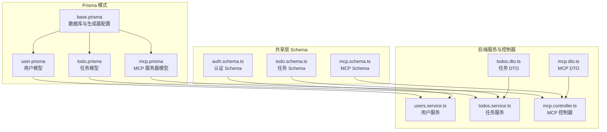
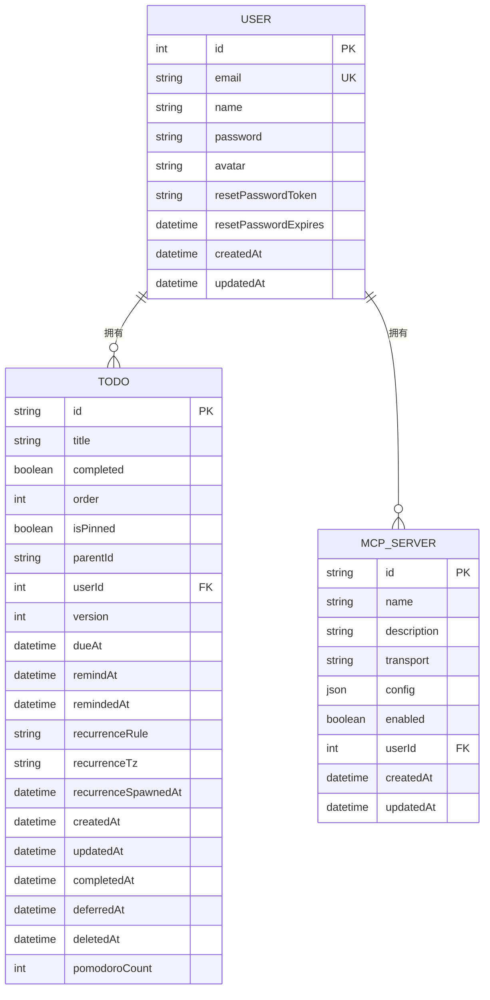
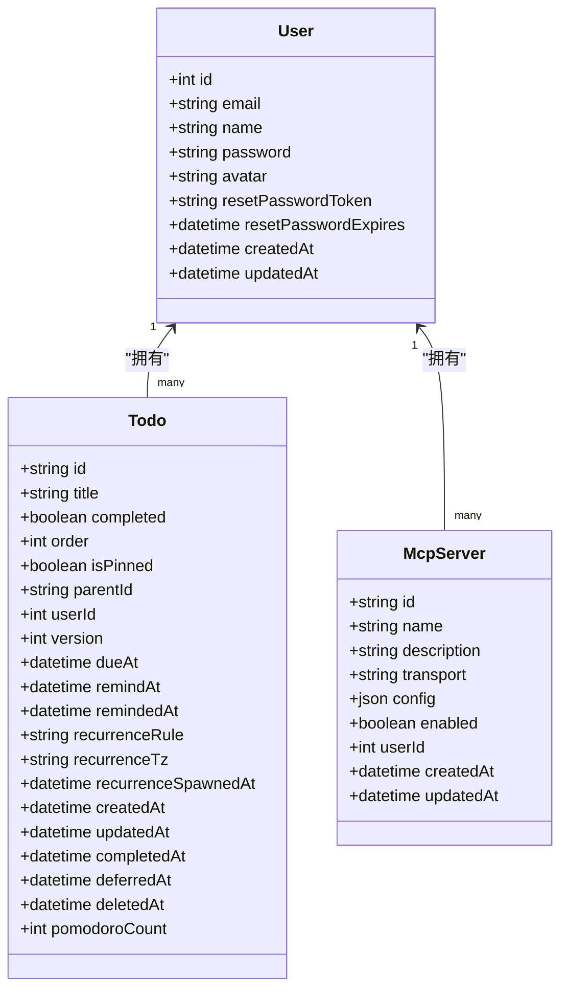
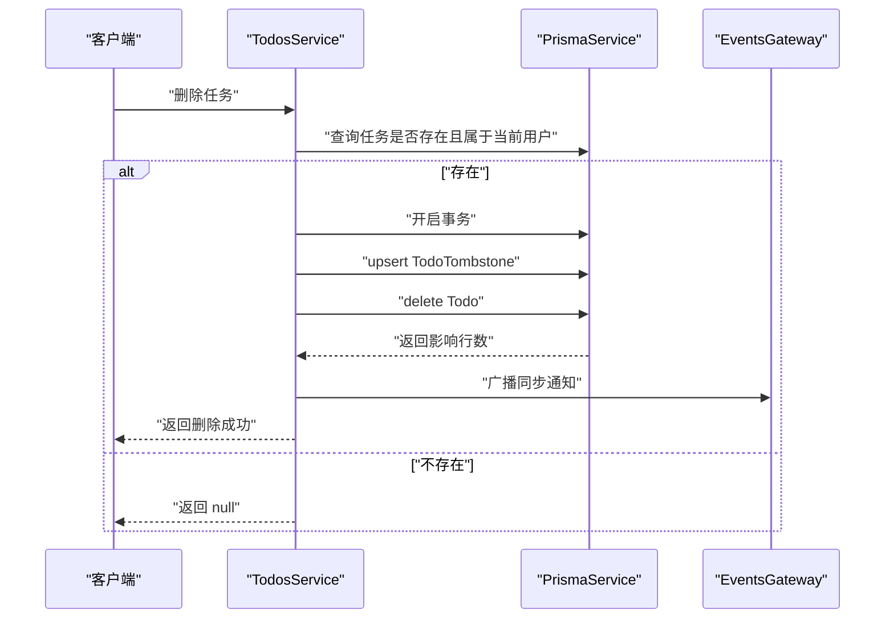
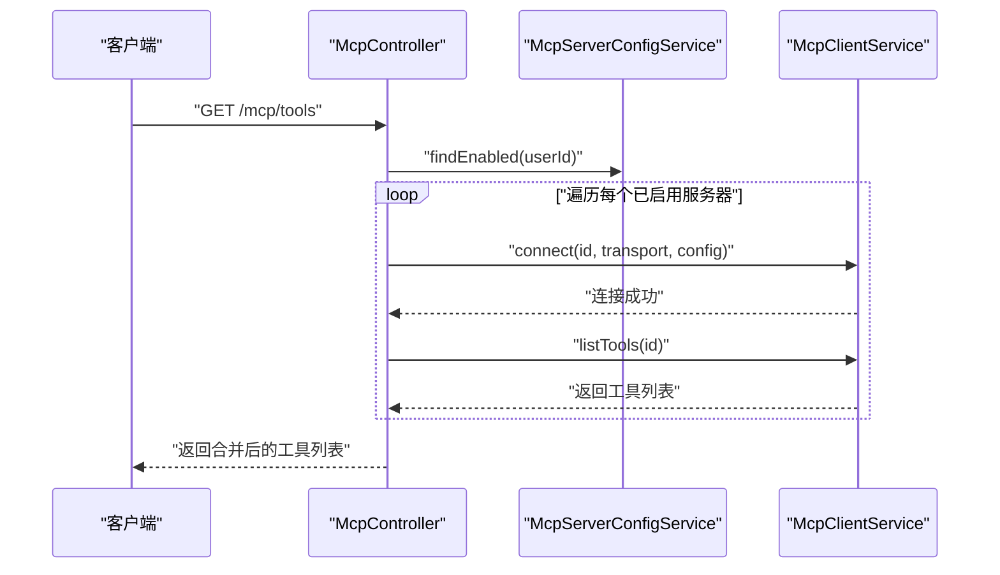
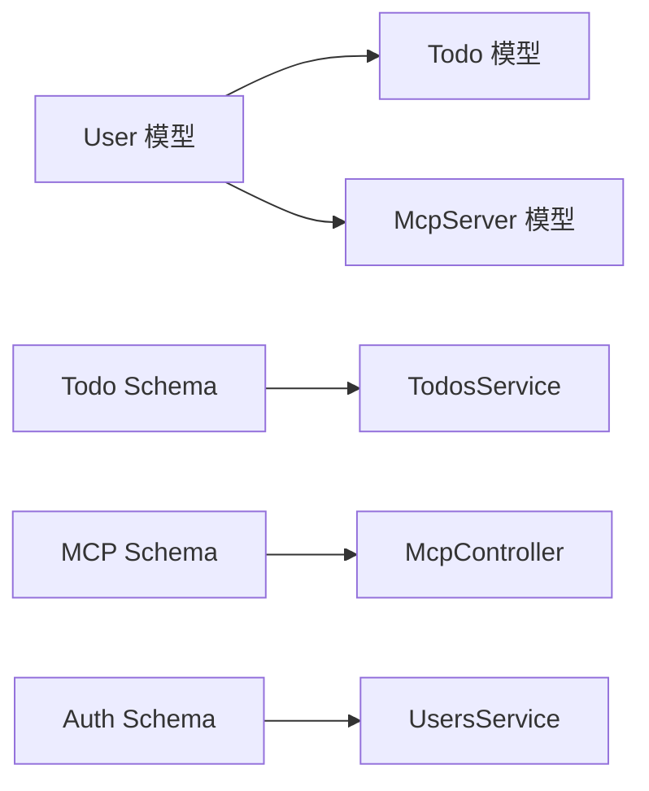

# 数据模型设计

<cite>
**本文引用的文件**
- [apps/backend/prisma/schema/user.prisma](file://apps/backend/prisma/schema/user.prisma)
- [apps/backend/prisma/schema/todo.prisma](file://apps/backend/prisma/schema/todo.prisma)
- [apps/backend/prisma/schema/mcp.prisma](file://apps/backend/prisma/schema/mcp.prisma)
- [apps/backend/prisma/schema/base.prisma](file://apps/backend/prisma/schema/base.prisma)
- [packages/shared/src/schemas/todo.schema.ts](file://packages/shared/src/schemas/todo.schema.ts)
- [packages/shared/src/schemas/mcp.schema.ts](file://packages/shared/src/schemas/mcp.schema.ts)
- [packages/shared/src/schemas/auth.schema.ts](file://packages/shared/src/schemas/auth.schema.ts)
- [packages/shared/src/utils/user.utils.ts](file://packages/shared/src/utils/user.utils.ts)
- [apps/backend/src/users/users.service.ts](file://apps/backend/src/users/users.service.ts)
- [apps/backend/src/todos/todos.service.ts](file://apps/backend/src/todos/todos.service.ts)
- [apps/backend/src/mcp/mcp.controller.ts](file://apps/backend/src/mcp/mcp.controller.ts)
- [apps/backend/src/mcp/mcp.dto.ts](file://apps/backend/src/mcp/mcp.dto.ts)
- [apps/backend/src/todos/todos.dto.ts](file://apps/backend/src/todos/todos.dto.ts)
</cite>

## 目录
1. [简介](#简介)
2. [项目结构](#项目结构)
3. [核心组件](#核心组件)
4. [架构总览](#架构总览)
5. [详细组件分析](#详细组件分析)
6. [依赖分析](#依赖分析)
7. [性能考量](#性能考量)
8. [故障排查指南](#故障排查指南)
9. [结论](#结论)
10. [附录](#附录)

## 简介
本文件系统性梳理 Lumina Todo 的核心数据模型，聚焦以下三类模型：User 用户模型、Todo 任务模型、McpServer MCP 服务器模型。内容涵盖字段定义与数据类型选择、业务语义、模型间关联关系与约束、审计追踪机制、以及模型演进与向后兼容策略。同时结合共享层的 Zod Schema 与后端服务实现，帮助读者从数据库到应用层全面理解数据模型。

## 项目结构
围绕数据模型的关键文件分布如下：
- Prisma 模式文件：位于 apps/backend/prisma/schema 下，定义了 User、Todo、McpServer 三大模型及索引、映射等元信息。
- 共享层 Schema：位于 packages/shared/src/schemas 下，定义 Todo、MCP 服务器、认证等输入输出的校验规则。
- 应用层服务与控制器：位于 apps/backend/src 下，体现模型在业务流程中的使用方式与约束。

图表来源
- [apps/backend/prisma/schema/user.prisma:1-16](file://apps/backend/prisma/schema/user.prisma#L1-L16)
- [apps/backend/prisma/schema/todo.prisma:1-40](file://apps/backend/prisma/schema/todo.prisma#L1-L40)
- [apps/backend/prisma/schema/mcp.prisma:1-16](file://apps/backend/prisma/schema/mcp.prisma#L1-L16)
- [apps/backend/prisma/schema/base.prisma:1-9](file://apps/backend/prisma/schema/base.prisma#L1-L9)
- [packages/shared/src/schemas/todo.schema.ts:1-76](file://packages/shared/src/schemas/todo.schema.ts#L1-L76)
- [packages/shared/src/schemas/mcp.schema.ts:1-220](file://packages/shared/src/schemas/mcp.schema.ts#L1-L220)
- [packages/shared/src/schemas/auth.schema.ts:1-121](file://packages/shared/src/schemas/auth.schema.ts#L1-L121)
- [apps/backend/src/users/users.service.ts:1-118](file://apps/backend/src/users/users.service.ts#L1-L118)
- [apps/backend/src/todos/todos.service.ts:1-147](file://apps/backend/src/todos/todos.service.ts#L1-L147)
- [apps/backend/src/mcp/mcp.controller.ts:1-209](file://apps/backend/src/mcp/mcp.controller.ts#L1-L209)
- [apps/backend/src/mcp/mcp.dto.ts:1-59](file://apps/backend/src/mcp/mcp.dto.ts#L1-L59)
- [apps/backend/src/todos/todos.dto.ts:1-5](file://apps/backend/src/todos/todos.dto.ts#L1-L5)

章节来源
- [apps/backend/prisma/schema/user.prisma:1-16](file://apps/backend/prisma/schema/user.prisma#L1-L16)
- [apps/backend/prisma/schema/todo.prisma:1-40](file://apps/backend/prisma/schema/todo.prisma#L1-L40)
- [apps/backend/prisma/schema/mcp.prisma:1-16](file://apps/backend/prisma/schema/mcp.prisma#L1-L16)
- [apps/backend/prisma/schema/base.prisma:1-9](file://apps/backend/prisma/schema/base.prisma#L1-L9)

## 核心组件
本节对三大核心数据模型进行逐项解析，包括字段定义、数据类型、业务含义、索引与约束、以及与共享层 Schema 的对应关系。

- User 用户模型
  - 关键字段与类型
    - id: 整数主键，自增
    - email: 字符串，唯一
    - name: 字符串
    - password: 字符串（可空，用于密码认证）
    - avatar: 字符串（可空，头像地址）
    - resetPasswordToken / resetPasswordExpires: 字符串与日期时间（可空，用于密码重置）
    - createdAt / updatedAt: 日期时间，默认值与自动更新
  - 业务含义
    - 标识系统用户身份，承载认证凭据与个人资料；与 Todo、McpServer 存在一对多关系。
  - 关系与约束
    - 与 Todo: 一对多（一个用户拥有多个任务）
    - 与 McpServer: 一对多（一个用户可配置多个 MCP 服务器）
  - 审计追踪
    - 使用 createdAt / updatedAt 实现创建与更新时间的审计。
  - 与共享层 Schema 对应
    - 认证相关 Schema 在 auth.schema.ts 中定义，用户模型的序列化在 user.utils.ts 中处理。

- Todo 任务模型
  - 关键字段与类型
    - id: 字符串主键，UUID
    - title: 字符串
    - completed: 布尔，默认 false
    - order: 整数，默认 0（排序优先级）
    - isPinned: 布尔，默认 false（置顶）
    - parentId: 字符串（可空，UUID，父子关系）
    - userId: 整数（外键，指向 User）
    - version: 整数，默认 0（乐观并发控制）
    - dueAt / remindAt / remindedAt: 日期时间（可空，截止时间、提醒时间、已提醒时间）
    - recurrenceRule / recurrenceTz / recurrenceSpawnedAt: 日期时间（可空，重复规则、时区、派生时间）
    - createdAt / updatedAt / completedAt / deferredAt / deletedAt: 日期时间（可空，状态时间戳）
    - pomodoroCount: 整数，默认 0（专注计数）
  - 业务含义
    - 表达用户的任务条目，支持完成状态、排序、置顶、父子层级、重复计划、提醒与删除软删除。
  - 关系与约束
    - 与 User: 多对一（任务属于用户）
    - 与自身: 通过 parentId 支持父子层级（子任务继承用户上下文）
    - 索引：针对 userId+updatedAt、userId+remindAt、userId+dueAt、deletedAt 建立复合或单列索引，优化查询。
  - 审计追踪
    - 使用 createdAt / updatedAt 记录创建与更新；deletedAt 实现软删除；version 支持同步冲突检测。
  - 与共享层 Schema 对应
    - 任务 Schema 在 todo.schema.ts 中定义，包含字段范围、可空性与默认值约束；同步相关类型亦在此定义。

- McpServer MCP 服务器模型
  - 关键字段与类型
    - id: 字符串主键，UUID
    - name: 字符串
    - description: 字符串（可空）
    - transport: 字符串（传输类型枚举）
    - config: JSON（传输配置，按 transport 类型不同而异）
    - enabled: 布尔，默认 true（是否启用）
    - userId: 整数（外键，指向 User）
    - createdAt / updatedAt: 日期时间
  - 业务含义
    - 描述用户配置的 MCP 服务器连接参数，支持 stdio 与 http 两种传输方式，并可注入鉴权信息。
  - 关系与约束
    - 与 User: 多对一（服务器属于用户），onDelete: Cascade（用户删除时级联删除其服务器配置）。
    - 索引：针对 userId 建立索引，便于按用户检索。
  - 审计追踪
    - 使用 createdAt / updatedAt 记录创建与更新。
  - 与共享层 Schema 对应
    - MCP 服务器 Schema 在 mcp.schema.ts 中定义，包含传输类型、配置校验、URL 白名单与鉴权模式等。

章节来源
- [apps/backend/prisma/schema/user.prisma:1-16](file://apps/backend/prisma/schema/user.prisma#L1-L16)
- [apps/backend/prisma/schema/todo.prisma:1-40](file://apps/backend/prisma/schema/todo.prisma#L1-L40)
- [apps/backend/prisma/schema/mcp.prisma:1-16](file://apps/backend/prisma/schema/mcp.prisma#L1-L16)
- [packages/shared/src/schemas/todo.schema.ts:1-76](file://packages/shared/src/schemas/todo.schema.ts#L1-L76)
- [packages/shared/src/schemas/mcp.schema.ts:1-220](file://packages/shared/src/schemas/mcp.schema.ts#L1-L220)
- [packages/shared/src/schemas/auth.schema.ts:1-121](file://packages/shared/src/schemas/auth.schema.ts#L1-L121)
- [packages/shared/src/utils/user.utils.ts:1-36](file://packages/shared/src/utils/user.utils.ts#L1-L36)

## 架构总览
下图展示数据模型在系统中的位置与交互关系，以及与共享层 Schema 的映射。

图表来源
- [apps/backend/prisma/schema/user.prisma:1-16](file://apps/backend/prisma/schema/user.prisma#L1-L16)
- [apps/backend/prisma/schema/todo.prisma:1-40](file://apps/backend/prisma/schema/todo.prisma#L1-L40)
- [apps/backend/prisma/schema/mcp.prisma:1-16](file://apps/backend/prisma/schema/mcp.prisma#L1-L16)

## 详细组件分析

### User 用户模型
- 字段与类型
  - 主键与标识：id（整数，自增）、email（字符串，唯一）
  - 凭据与资料：password（字符串，可空）、name（字符串）、avatar（字符串，可空）
  - 密码重置：resetPasswordToken（字符串，可空）、resetPasswordExpires（日期时间，可空）
  - 审计：createdAt（默认 now）、updatedAt（自动更新）
- 业务语义
  - 用户身份与认证主体；与任务、MCP 服务器存在一对多关系。
- 关系与约束
  - 与 Todo：一对多
  - 与 McpServer：一对多
- 审计追踪
  - 通过 createdAt / updatedAt 记录创建与更新时间；password 字段用于认证，resetPassword* 字段支持密码重置流程。
- 与共享层 Schema 的对应
  - 认证 Schema（登录、注册、用户信息、令牌）在 auth.schema.ts 中定义；用户格式化在 user.utils.ts 中将 Date 转换为 ISO 字符串。
- 服务层使用
  - users.service.ts 提供查找、创建、更新、头像更新等方法，内部使用 PrismaService 访问数据库。

图表来源
- [apps/backend/prisma/schema/user.prisma:1-16](file://apps/backend/prisma/schema/user.prisma#L1-L16)
- [apps/backend/prisma/schema/todo.prisma:1-40](file://apps/backend/prisma/schema/todo.prisma#L1-L40)
- [apps/backend/prisma/schema/mcp.prisma:1-16](file://apps/backend/prisma/schema/mcp.prisma#L1-L16)

章节来源
- [apps/backend/prisma/schema/user.prisma:1-16](file://apps/backend/prisma/schema/user.prisma#L1-L16)
- [packages/shared/src/schemas/auth.schema.ts:1-121](file://packages/shared/src/schemas/auth.schema.ts#L1-L121)
- [packages/shared/src/utils/user.utils.ts:1-36](file://packages/shared/src/utils/user.utils.ts#L1-L36)
- [apps/backend/src/users/users.service.ts:1-118](file://apps/backend/src/users/users.service.ts#L1-L118)

### Todo 任务模型
- 字段与类型
  - 主键与标识：id（字符串，UUID）
  - 状态与排序：completed（布尔，默认 false）、order（整数，默认 0）、isPinned（布尔，默认 false）
  - 层级：parentId（字符串，UUID，可空）
  - 关联：userId（整数，外键）
  - 并发：version（整数，默认 0）
  - 时间：dueAt、remindAt、remindedAt、createdAt、updatedAt、completedAt、deferredAt、deletedAt（可空）
  - 计数：pomodoroCount（整数，默认 0）
  - 重复：recurrenceRule（枚举，可空）、recurrenceTz（字符串，可空）、recurrenceSpawnedAt（可空）
- 业务语义
  - 表达任务的生命周期状态、时间安排、层级关系与重复规则；deletedAt 实现软删除；version 支持同步冲突检测。
- 关系与约束
  - 与 User：多对一（任务属于用户）
  - 与自身：父子关系（子任务继承用户上下文）
  - 索引：userId+updatedAt、userId+remindAt、userId+dueAt、deletedAt
- 审计追踪
  - createdAt / updatedAt 记录创建与更新；deletedAt 实现软删除；version 用于版本控制。
- 与共享层 Schema 的对应
  - 任务 Schema 在 todo.schema.ts 中定义，包含字段范围、可空性与默认值约束；同步相关类型亦在此定义。
- 服务层使用
  - todos.service.ts 提供查询、回收站、恢复、永久删除、清空回收站等操作；使用事务保证 tombstone 与删除的一致性；广播同步通知。

图表来源
- [apps/backend/src/todos/todos.service.ts:87-111](file://apps/backend/src/todos/todos.service.ts#L87-L111)

章节来源
- [apps/backend/prisma/schema/todo.prisma:1-40](file://apps/backend/prisma/schema/todo.prisma#L1-L40)
- [packages/shared/src/schemas/todo.schema.ts:1-76](file://packages/shared/src/schemas/todo.schema.ts#L1-L76)
- [apps/backend/src/todos/todos.service.ts:1-147](file://apps/backend/src/todos/todos.service.ts#L1-L147)
- [apps/backend/src/todos/todos.dto.ts:1-5](file://apps/backend/src/todos/todos.dto.ts#L1-L5)

### McpServer MCP 服务器模型
- 字段与类型
  - 主键与标识：id（字符串，UUID）
  - 基本信息：name（字符串）、description（字符串，可空）
  - 连接配置：transport（字符串，枚举）、config（JSON）
  - 状态：enabled（布尔，默认 true）
  - 关联：userId（整数，外键）
  - 审计：createdAt / updatedAt
- 业务语义
  - 描述用户配置的 MCP 服务器连接参数，支持 stdio 与 http 两种传输方式；config 内可包含命令行参数、环境变量、HTTP URL 与鉴权信息。
- 关系与约束
  - 与 User：多对一（服务器属于用户），onDelete: Cascade（用户删除时级联删除其服务器配置）
  - 索引：userId
- 审计追踪
  - createdAt / updatedAt 记录创建与更新。
- 与共享层 Schema 的对应
  - 传输类型、配置校验、URL 白名单与鉴权模式在 mcp.schema.ts 中定义；控制器与 DTO 在 mcp.controller.ts 与 mcp.dto.ts 中使用。
- 控制器与服务层使用
  - mcp.controller.ts 提供创建、查询、更新、删除、连接、断开、工具发现与调用等接口；DTO 使用共享层 Schema 进行输入校验。

图表来源
- [apps/backend/src/mcp/mcp.controller.ts:110-136](file://apps/backend/src/mcp/mcp.controller.ts#L110-L136)

章节来源
- [apps/backend/prisma/schema/mcp.prisma:1-16](file://apps/backend/prisma/schema/mcp.prisma#L1-L16)
- [packages/shared/src/schemas/mcp.schema.ts:1-220](file://packages/shared/src/schemas/mcp.schema.ts#L1-L220)
- [apps/backend/src/mcp/mcp.controller.ts:1-209](file://apps/backend/src/mcp/mcp.controller.ts#L1-L209)
- [apps/backend/src/mcp/mcp.dto.ts:1-59](file://apps/backend/src/mcp/mcp.dto.ts#L1-L59)

## 依赖分析
- 模型间依赖
  - Todo.userId -> User.id（多对一）
  - McpServer.userId -> User.id（多对一，onDelete: Cascade）
- 共享层依赖
  - Todo 与 MCP 的输入输出类型由 shared 层的 Zod Schema 定义，确保前后端一致的校验规则。
- 服务层依赖
  - users.service.ts 依赖 PrismaService 访问 User 表
  - todos.service.ts 依赖 PrismaService 与 EventsGateway
  - mcp.controller.ts 依赖 McpServerConfigService 与 McpClientService

图表来源
- [apps/backend/prisma/schema/user.prisma:1-16](file://apps/backend/prisma/schema/user.prisma#L1-L16)
- [apps/backend/prisma/schema/todo.prisma:1-40](file://apps/backend/prisma/schema/todo.prisma#L1-L40)
- [apps/backend/prisma/schema/mcp.prisma:1-16](file://apps/backend/prisma/schema/mcp.prisma#L1-L16)
- [packages/shared/src/schemas/todo.schema.ts:1-76](file://packages/shared/src/schemas/todo.schema.ts#L1-L76)
- [packages/shared/src/schemas/mcp.schema.ts:1-220](file://packages/shared/src/schemas/mcp.schema.ts#L1-L220)
- [packages/shared/src/schemas/auth.schema.ts:1-121](file://packages/shared/src/schemas/auth.schema.ts#L1-L121)
- [apps/backend/src/users/users.service.ts:1-118](file://apps/backend/src/users/users.service.ts#L1-L118)
- [apps/backend/src/todos/todos.service.ts:1-147](file://apps/backend/src/todos/todos.service.ts#L1-L147)
- [apps/backend/src/mcp/mcp.controller.ts:1-209](file://apps/backend/src/mcp/mcp.controller.ts#L1-L209)

章节来源
- [apps/backend/prisma/schema/user.prisma:1-16](file://apps/backend/prisma/schema/user.prisma#L1-L16)
- [apps/backend/prisma/schema/todo.prisma:1-40](file://apps/backend/prisma/schema/todo.prisma#L1-L40)
- [apps/backend/prisma/schema/mcp.prisma:1-16](file://apps/backend/prisma/schema/mcp.prisma#L1-L16)
- [packages/shared/src/schemas/todo.schema.ts:1-76](file://packages/shared/src/schemas/todo.schema.ts#L1-L76)
- [packages/shared/src/schemas/mcp.schema.ts:1-220](file://packages/shared/src/schemas/mcp.schema.ts#L1-L220)
- [packages/shared/src/schemas/auth.schema.ts:1-121](file://packages/shared/src/schemas/auth.schema.ts#L1-L121)
- [apps/backend/src/users/users.service.ts:1-118](file://apps/backend/src/users/users.service.ts#L1-L118)
- [apps/backend/src/todos/todos.service.ts:1-147](file://apps/backend/src/todos/todos.service.ts#L1-L147)
- [apps/backend/src/mcp/mcp.controller.ts:1-209](file://apps/backend/src/mcp/mcp.controller.ts#L1-L209)

## 性能考量
- 索引策略
  - Todo 模型针对 userId+updatedAt、userId+remindAt、userId+dueAt、deletedAt 建立索引，有助于按用户维度的排序、提醒与回收站查询。
  - McpServer 模型针对 userId 建立索引，便于按用户检索服务器配置。
- 查询优化
  - 服务层在查询时尽量使用 select 精简字段集，减少网络与内存开销。
  - 回收站与软删除采用事务保证一致性，避免脏读。
- 连接与工具发现
  - MCP 工具发现采用惰性连接策略，仅在需要时建立连接，降低资源占用。
- 并发与同步
  - Todo 的 version 字段用于乐观锁与冲突检测，配合 shared 层的同步 Schema，保障多端同步一致性。

## 故障排查指南
- 认证与用户相关
  - 用户不存在或 ID 不合法：users.service.ts 在查找用户时会抛出相应异常，需检查传入 ID 与邮箱唯一性。
  - 密码重置：resetPasswordToken 与 resetPasswordExpires 字段为空表示未发起重置流程。
- 任务相关
  - 恢复与删除：若任务不存在或不属于当前用户，服务层返回 null；永久删除会写入 TodoTombstone 并删除记录，需确认事务执行结果。
  - 回收站清理：清空回收站会批量 upsert tombstone 并删除记录，注意大范围删除的事务成本。
- MCP 服务器相关
  - 服务器不存在或无权限：控制器在删除、连接、断开、工具发现前会先验证所有权，失败时抛出异常。
  - 工具发现失败：控制器捕获异常并记录日志，不影响其他服务器的工具发现。
  - 传输配置校验：shared 层对 HTTP URL、私有地址与鉴权方式进行严格校验，避免不安全配置。

章节来源
- [apps/backend/src/users/users.service.ts:1-118](file://apps/backend/src/users/users.service.ts#L1-L118)
- [apps/backend/src/todos/todos.service.ts:1-147](file://apps/backend/src/todos/todos.service.ts#L1-L147)
- [apps/backend/src/mcp/mcp.controller.ts:1-209](file://apps/backend/src/mcp/mcp.controller.ts#L1-L209)
- [packages/shared/src/schemas/mcp.schema.ts:1-220](file://packages/shared/src/schemas/mcp.schema.ts#L1-L220)

## 结论
本数据模型设计围绕用户、任务与 MCP 服务器三大实体展开，通过明确的字段定义、合理的数据类型选择与严格的索引策略，支撑起认证、任务管理与外部工具集成等核心业务。共享层 Schema 确保前后端一致的输入输出校验，服务层实现关注点分离并提供完善的错误处理与审计能力。未来演进可在保持向后兼容的前提下，逐步引入更细粒度的权限控制、更丰富的任务属性与更灵活的同步策略。

## 附录
- 数据库与生成器配置
  - 生成器：prisma-client-js
  - 二进制目标：原生与多种 Linux 发行版
  - 数据源：PostgreSQL
- 通用字段设计理念
  - createdAt / updatedAt：统一的审计字段，便于追踪数据生命周期。
  - deletedAt：软删除标记，配合 Tombstone 表实现可追溯的删除历史。
  - version：乐观锁版本号，用于同步冲突检测与解决。

章节来源
- [apps/backend/prisma/schema/base.prisma:1-9](file://apps/backend/prisma/schema/base.prisma#L1-L9)