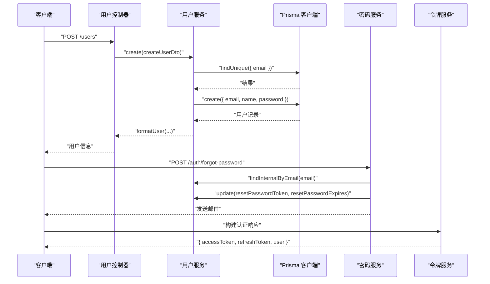
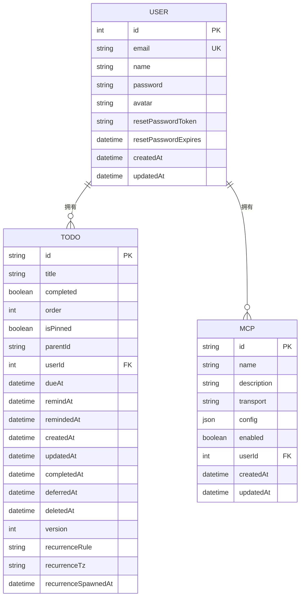
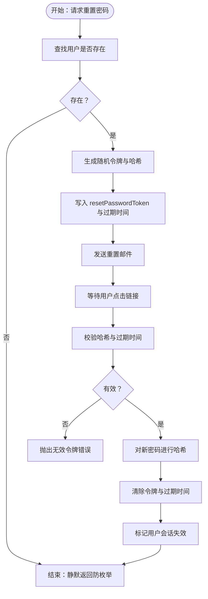
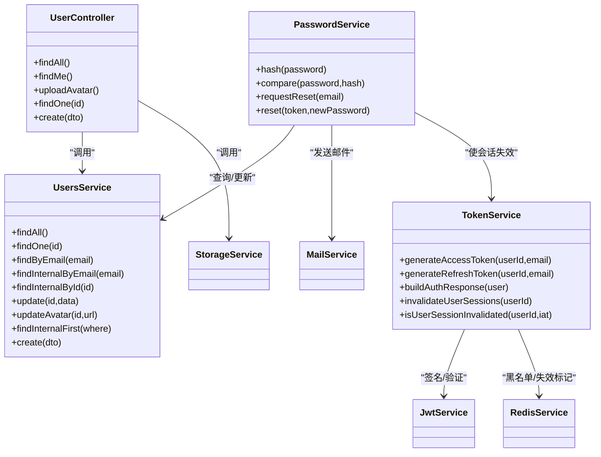

# 用户模型

<cite>
**本文引用的文件**
- [apps/backend/prisma/schema/user.prisma](file://apps/backend/prisma/schema/user.prisma)
- [apps/backend/prisma/schema/todo.prisma](file://apps/backend/prisma/schema/todo.prisma)
- [apps/backend/prisma/schema/mcp.prisma](file://apps/backend/prisma/schema/mcp.prisma)
- [apps/backend/src/users/users.service.ts](file://apps/backend/src/users/users.service.ts)
- [apps/backend/src/users/users.controller.ts](file://apps/backend/src/users/users.controller.ts)
- [apps/backend/src/auth/password.service.ts](file://apps/backend/src/auth/password.service.ts)
- [apps/backend/src/auth/token.service.ts](file://apps/backend/src/auth/token.service.ts)
- [packages/shared/src/schemas/auth.schema.ts](file://packages/shared/src/schemas/auth.schema.ts)
- [packages/shared/src/utils/user.utils.ts](file://packages/shared/src/utils/user.utils.ts)
- [apps/backend/tests/users/users.service.spec.ts](file://apps/backend/tests/users/users.service.spec.ts)
</cite>

## 目录
1. [简介](#简介)
2. [项目结构](#项目结构)
3. [核心组件](#核心组件)
4. [架构总览](#架构总览)
5. [详细组件分析](#详细组件分析)
6. [依赖关系分析](#依赖关系分析)
7. [性能考量](#性能考量)
8. [故障排查指南](#故障排查指南)
9. [结论](#结论)
10. [附录](#附录)

## 简介
本文件围绕后端用户模型进行系统化说明，覆盖字段定义与约束、认证相关字段设计、状态管理字段、设置相关字段、权限控制字段，并结合 Prisma 查询与 TypeScript 类型定义给出实践参考。目标是帮助开发者快速理解并正确使用用户模型。

## 项目结构
用户模型位于后端 Prisma Schema 中，同时由用户服务与控制器提供业务能力，配合认证模块完成密码重置与令牌签发流程。共享包提供统一的类型与校验规则。

```mermaid
graph TB
subgraph "后端应用"
U["用户服务<br/>users.service.ts"]
C["用户控制器<br/>users.controller.ts"]
PS["密码服务<br/>password.service.ts"]
TS["令牌服务<br/>token.service.ts"]
PRISMA["Prisma 客户端"]
end
subgraph "数据模型"
USER["模型 User<br/>user.prisma"]
TODO["模型 Todo<br/>todo.prisma"]
MCP["模型 McpServer<br/>mcp.prisma"]
end
subgraph "共享类型"
SCHEMA["认证 Schema<br/>auth.schema.ts"]
UTILS["用户工具<br/>user.utils.ts"]
end
C --> U
U --> PRISMA
PS --> U
TS --> U
PRISMA --> USER
USER <- --> TODO
USER <- --> MCP
SCHEMA --> U
SCHEMA --> PS
SCHEMA --> TS
UTILS --> U
```

**图表来源**
- [apps/backend/src/users/users.service.ts:12-118](file://apps/backend/src/users/users.service.ts#L12-L118)
- [apps/backend/src/users/users.controller.ts:26-135](file://apps/backend/src/users/users.controller.ts#L26-L135)
- [apps/backend/src/auth/password.service.ts:9-100](file://apps/backend/src/auth/password.service.ts#L9-L100)
- [apps/backend/src/auth/token.service.ts:15-187](file://apps/backend/src/auth/token.service.ts#L15-L187)
- [apps/backend/prisma/schema/user.prisma:1-16](file://apps/backend/prisma/schema/user.prisma#L1-L16)
- [apps/backend/prisma/schema/todo.prisma:1-40](file://apps/backend/prisma/schema/todo.prisma#L1-L40)
- [apps/backend/prisma/schema/mcp.prisma:1-16](file://apps/backend/prisma/schema/mcp.prisma#L1-L16)
- [packages/shared/src/schemas/auth.schema.ts:1-120](file://packages/shared/src/schemas/auth.schema.ts#L1-L120)
- [packages/shared/src/utils/user.utils.ts:1-36](file://packages/shared/src/utils/user.utils.ts#L1-L36)

**章节来源**
- [apps/backend/src/users/users.service.ts:12-118](file://apps/backend/src/users/users.service.ts#L12-L118)
- [apps/backend/src/users/users.controller.ts:26-135](file://apps/backend/src/users/users.controller.ts#L26-L135)
- [apps/backend/prisma/schema/user.prisma:1-16](file://apps/backend/prisma/schema/user.prisma#L1-L16)
- [packages/shared/src/schemas/auth.schema.ts:1-120](file://packages/shared/src/schemas/auth.schema.ts#L1-L120)

## 核心组件
- 用户模型（Prisma）
  - 字段与约束
    - id: 整数主键，自增
    - email: 字符串，唯一索引
    - name: 字符串
    - password: 字符串（可空）
    - avatar: 字符串（可空）
    - resetPasswordToken: 字符串（可空）
    - resetPasswordExpires: 日期时间（可空）
    - createdAt/updatedAt: 自动填充时间戳
    - 关系：与 Todo、McpServer 一对多
  - 设计要点
    - email 唯一性确保登录与找回密码的确定性
    - password 可空用于第三方登录或仅邮箱激活场景
    - resetPasswordToken 与 resetPasswordExpires 支持安全的密码重置流程
- 用户服务（业务层）
  - 提供查询、创建、更新、头像上传等能力
  - 统一返回格式化的用户对象（ISO 时间字符串）
- 用户控制器（接口层）
  - 对外暴露用户相关 HTTP 接口，含头像上传、获取当前用户等
- 密码服务（认证）
  - 生成安全的重置令牌，写入数据库并发送邮件
  - 校验令牌有效性与过期时间，重置密码并使会话失效
- 令牌服务（认证）
  - 生成短期访问令牌与长期刷新令牌
  - 提供令牌黑名单、会话失效标记、令牌验证等能力
- 共享类型（前后端一致）
  - 定义用户类型、注册/登录/更新等输入类型
  - 定义用户格式化函数，保证前端接收 ISO 字符串时间

**章节来源**
- [apps/backend/prisma/schema/user.prisma:1-16](file://apps/backend/prisma/schema/user.prisma#L1-L16)
- [apps/backend/src/users/users.service.ts:12-118](file://apps/backend/src/users/users.service.ts#L12-L118)
- [apps/backend/src/users/users.controller.ts:26-135](file://apps/backend/src/users/users.controller.ts#L26-L135)
- [apps/backend/src/auth/password.service.ts:9-100](file://apps/backend/src/auth/password.service.ts#L9-L100)
- [apps/backend/src/auth/token.service.ts:15-187](file://apps/backend/src/auth/token.service.ts#L15-L187)
- [packages/shared/src/schemas/auth.schema.ts:1-120](file://packages/shared/src/schemas/auth.schema.ts#L1-L120)
- [packages/shared/src/utils/user.utils.ts:1-36](file://packages/shared/src/utils/user.utils.ts#L1-L36)

## 架构总览
用户模型贯穿数据层、服务层、控制器与认证模块，形成“数据模型 → 业务处理 → 接口暴露 → 认证安全”的闭环。



**图表来源**
- [apps/backend/src/users/users.controller.ts:126-133](file://apps/backend/src/users/users.controller.ts#L126-L133)
- [apps/backend/src/users/users.service.ts:94-116](file://apps/backend/src/users/users.service.ts#L94-L116)
- [apps/backend/src/auth/password.service.ts:38-61](file://apps/backend/src/auth/password.service.ts#L38-L61)
- [apps/backend/src/auth/token.service.ts:174-185](file://apps/backend/src/auth/token.service.ts#L174-L185)

## 详细组件分析

### 用户模型字段详解
- id
  - 类型：整数
  - 约束：主键，自增
  - 用途：唯一标识用户
- email
  - 类型：字符串
  - 约束：唯一索引
  - 用途：登录凭据、找回密码定位
- name
  - 类型：字符串
  - 约束：无强制唯一性
  - 用途：展示名称
- password
  - 类型：字符串（可空）
  - 约束：可空
  - 用途：本地账户密码哈希
  - 安全：服务层创建时进行哈希处理
- avatar
  - 类型：字符串（可空）
  - 约束：可空
  - 用途：头像 URL
- resetPasswordToken / resetPasswordExpires
  - 类型：字符串（可空）、日期时间（可空）
  - 约束：可空
  - 用途：密码重置令牌与过期时间
  - 安全：令牌以哈希形式存储，防止泄露明文
- createdAt / updatedAt
  - 类型：日期时间
  - 约束：自动填充
  - 用途：审计与排序



**图表来源**
- [apps/backend/prisma/schema/user.prisma:1-16](file://apps/backend/prisma/schema/user.prisma#L1-L16)
- [apps/backend/prisma/schema/todo.prisma:1-40](file://apps/backend/prisma/schema/todo.prisma#L1-L40)
- [apps/backend/prisma/schema/mcp.prisma:1-16](file://apps/backend/prisma/schema/mcp.prisma#L1-L16)

**章节来源**
- [apps/backend/prisma/schema/user.prisma:1-16](file://apps/backend/prisma/schema/user.prisma#L1-L16)
- [apps/backend/prisma/schema/todo.prisma:1-40](file://apps/backend/prisma/schema/todo.prisma#L1-L40)
- [apps/backend/prisma/schema/mcp.prisma:1-16](file://apps/backend/prisma/schema/mcp.prisma#L1-L16)

### 认证相关字段：emailVerified、passwordResetToken
- emailVerified
  - 当前模型未包含该字段
  - 若需实现邮箱验证，建议新增布尔字段并配合邮件发送与校验流程
- passwordResetToken 与 resetPasswordExpires
  - 设计目的：支持安全的密码重置流程
  - 安全考虑：
    - 明文令牌不入库，仅存储哈希
    - 设置过期时间，防止长期有效
    - 通过邮件发送一次性链接，降低泄露风险
  - 流程要点：
    - 生成随机令牌与哈希值
    - 写入用户记录并发送邮件
    - 校验哈希与过期时间后重置密码
    - 重置完成后清除令牌并使历史会话失效



**图表来源**
- [apps/backend/src/auth/password.service.ts:38-89](file://apps/backend/src/auth/password.service.ts#L38-L89)
- [apps/backend/src/auth/token.service.ts:47-76](file://apps/backend/src/auth/token.service.ts#L47-L76)

**章节来源**
- [apps/backend/src/auth/password.service.ts:38-89](file://apps/backend/src/auth/password.service.ts#L38-L89)
- [apps/backend/src/auth/token.service.ts:47-76](file://apps/backend/src/auth/token.service.ts#L47-L76)

### 用户状态管理字段：isActive、isEmailPublic
- isActive
  - 当前模型未包含该字段
  - 建议新增布尔字段用于账户启用/禁用控制
- isEmailPublic
  - 当前模型未包含该字段
  - 建议新增布尔字段用于控制邮箱是否公开显示
  - 实施建议：在用户查询与序列化时根据该标志决定是否返回邮箱

**章节来源**
- [apps/backend/prisma/schema/user.prisma:1-16](file://apps/backend/prisma/schema/user.prisma#L1-L16)

### 用户设置相关字段：themePreference、languagePreference
- 当前模型未包含这些字段
- 建议新增字符串字段用于主题与语言偏好
- 存储建议：
  - 主题：light/dark/system
  - 语言：zh-CN/en-US 等标准标签
- 使用建议：在用户控制器或中间件中读取并应用到前端渲染

**章节来源**
- [apps/backend/prisma/schema/user.prisma:1-16](file://apps/backend/prisma/schema/user.prisma#L1-L16)

### 用户权限控制字段：roles、permissions
- 当前模型未包含 roles 与 permissions 字段
- 建议方案：
  - roles：字符串数组或枚举集合，用于角色分级
  - permissions：字符串数组，细粒度权限点
- 安全建议：
  - 在鉴权守卫中校验角色与权限
  - 权限变更即时生效，避免缓存污染
  - 与 JWT 载荷或 Redis 缓存保持同步

**章节来源**
- [apps/backend/src/auth/token.service.ts:15-187](file://apps/backend/src/auth/token.service.ts#L15-L187)

### TypeScript 类型与 Prisma 查询示例
- TypeScript 类型
  - 用户类型：由共享包中的 Schema 定义，包含 id、email、name、avatar、createdAt、updatedAt
  - 注册/登录/更新输入类型：由共享包中的 Schema 定义，包含邮箱、姓名、密码等
  - 用户格式化：将 Date 类型转换为 ISO 字符串，便于前端处理
- Prisma 查询示例（路径）
  - 查询所有用户：[apps/backend/src/users/users.service.ts:19-22](file://apps/backend/src/users/users.service.ts#L19-L22)
  - 根据 ID 查询用户：[apps/backend/src/users/users.service.ts:27-39](file://apps/backend/src/users/users.service.ts#L27-L39)
  - 根据邮箱查询用户：[apps/backend/src/users/users.service.ts:44-50](file://apps/backend/src/users/users.service.ts#L44-L50)
  - 创建用户（含密码哈希）：[apps/backend/src/users/users.service.ts:96-116](file://apps/backend/src/users/users.service.ts#L96-L116)
  - 更新用户头像：[apps/backend/src/users/users.service.ts:80-82](file://apps/backend/src/users/users.service.ts#L80-L82)
  - 密码重置令牌写入：[apps/backend/src/auth/password.service.ts:52-55](file://apps/backend/src/auth/password.service.ts#L52-L55)
  - 校验重置令牌与过期时间：[apps/backend/src/auth/password.service.ts:69-74](file://apps/backend/src/auth/password.service.ts#L69-L74)
  - 生成访问/刷新令牌：[apps/backend/src/auth/token.service.ts:81-98](file://apps/backend/src/auth/token.service.ts#L81-L98)
  - 构建认证响应：[apps/backend/src/auth/token.service.ts:174-185](file://apps/backend/src/auth/token.service.ts#L174-L185)

**章节来源**
- [packages/shared/src/schemas/auth.schema.ts:57-120](file://packages/shared/src/schemas/auth.schema.ts#L57-L120)
- [packages/shared/src/utils/user.utils.ts:1-36](file://packages/shared/src/utils/user.utils.ts#L1-L36)
- [apps/backend/src/users/users.service.ts:19-116](file://apps/backend/src/users/users.service.ts#L19-L116)
- [apps/backend/src/auth/password.service.ts:38-89](file://apps/backend/src/auth/password.service.ts#L38-L89)
- [apps/backend/src/auth/token.service.ts:81-185](file://apps/backend/src/auth/token.service.ts#L81-L185)

## 依赖关系分析
- 用户模型依赖关系
  - User 与 Todo：一对多（用户拥有多个待办）
  - User 与 McpServer：一对多（用户拥有多个 MCP 服务器）
- 服务间依赖
  - 用户控制器依赖用户服务与存储服务
  - 密码服务依赖用户服务、邮件服务与令牌服务
  - 令牌服务依赖 JWT 与 Redis
- 类型一致性
  - 共享 Schema 保证前后端类型一致
  - 用户工具负责时间格式化，避免跨层格式差异



**图表来源**
- [apps/backend/src/users/users.controller.ts:26-135](file://apps/backend/src/users/users.controller.ts#L26-L135)
- [apps/backend/src/users/users.service.ts:12-118](file://apps/backend/src/users/users.service.ts#L12-L118)
- [apps/backend/src/auth/password.service.ts:9-100](file://apps/backend/src/auth/password.service.ts#L9-L100)
- [apps/backend/src/auth/token.service.ts:15-187](file://apps/backend/src/auth/token.service.ts#L15-L187)

**章节来源**
- [apps/backend/src/users/users.controller.ts:26-135](file://apps/backend/src/users/users.controller.ts#L26-L135)
- [apps/backend/src/users/users.service.ts:12-118](file://apps/backend/src/users/users.service.ts#L12-L118)
- [apps/backend/src/auth/password.service.ts:9-100](file://apps/backend/src/auth/password.service.ts#L9-L100)
- [apps/backend/src/auth/token.service.ts:15-187](file://apps/backend/src/auth/token.service.ts#L15-L187)

## 性能考量
- 查询优化
  - 对 email 使用唯一索引，确保登录与注册查询高效
  - 对常用过滤字段建立复合索引（如用户维度 + 时间）
- 序列化成本
  - 将 Date 转换为字符串可减少前端解析开销
- 缓存策略
  - 令牌黑名单与会话失效标记可借助 Redis 快速判定
- IO 优化
  - 头像上传前清理旧资源，避免磁盘冗余

[本节为通用指导，无需特定文件引用]

## 故障排查指南
- 常见问题与定位
  - 用户不存在：检查 ID/邮箱查询是否返回空
    - 参考：[apps/backend/src/users/users.service.ts:27-39](file://apps/backend/src/users/users.service.ts#L27-L39)
  - 邮箱已存在：注册时重复邮箱触发冲突异常
    - 参考：[apps/backend/src/users/users.service.ts:96-103](file://apps/backend/src/users/users.service.ts#L96-L103)
  - 无效重置令牌：令牌不存在或已过期
    - 参考：[apps/backend/src/auth/password.service.ts:69-78](file://apps/backend/src/auth/password.service.ts#L69-L78)
  - 令牌过期或无效：JWT 验证失败
    - 参考：[apps/backend/src/auth/token.service.ts:103-125](file://apps/backend/src/auth/token.service.ts#L103-L125)
- 单元测试参考
  - 测试用户查询、创建与冲突处理
    - 参考：[apps/backend/tests/users/users.service.spec.ts:23-103](file://apps/backend/tests/users/users.service.spec.ts#L23-L103)

**章节来源**
- [apps/backend/src/users/users.service.ts:27-116](file://apps/backend/src/users/users.service.ts#L27-L116)
- [apps/backend/src/auth/password.service.ts:69-89](file://apps/backend/src/auth/password.service.ts#L69-L89)
- [apps/backend/src/auth/token.service.ts:103-125](file://apps/backend/src/auth/token.service.ts#L103-L125)
- [apps/backend/tests/users/users.service.spec.ts:23-103](file://apps/backend/tests/users/users.service.spec.ts#L23-L103)

## 结论
用户模型以简洁的字段满足核心需求，并通过服务层与认证模块实现安全与可用性平衡。建议按需扩展状态与设置字段，并完善权限体系。遵循现有类型与查询模式，可平滑演进至更复杂的用户治理能力。

[本节为总结性内容，无需特定文件引用]

## 附录
- 实际使用建议
  - 新增字段时同步更新 Prisma Schema、服务方法与类型定义
  - 对敏感字段（如密码、令牌）严格遵循最小暴露原则
  - 在控制器与服务层统一处理异常与边界情况
- 相关文件路径
  - 用户模型：[apps/backend/prisma/schema/user.prisma:1-16](file://apps/backend/prisma/schema/user.prisma#L1-L16)
  - 用户服务：[apps/backend/src/users/users.service.ts:12-118](file://apps/backend/src/users/users.service.ts#L12-L118)
  - 用户控制器：[apps/backend/src/users/users.controller.ts:26-135](file://apps/backend/src/users/users.controller.ts#L26-L135)
  - 密码服务：[apps/backend/src/auth/password.service.ts:9-100](file://apps/backend/src/auth/password.service.ts#L9-L100)
  - 令牌服务：[apps/backend/src/auth/token.service.ts:15-187](file://apps/backend/src/auth/token.service.ts#L15-L187)
  - 共享类型：[packages/shared/src/schemas/auth.schema.ts:1-120](file://packages/shared/src/schemas/auth.schema.ts#L1-L120)
  - 用户工具：[packages/shared/src/utils/user.utils.ts:1-36](file://packages/shared/src/utils/user.utils.ts#L1-L36)

[本节为补充说明，无需特定文件引用]