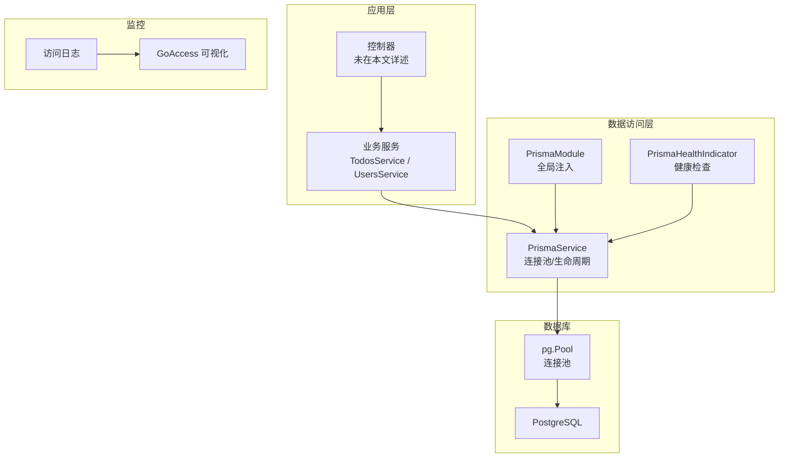
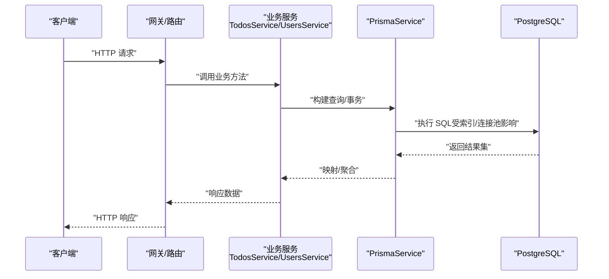
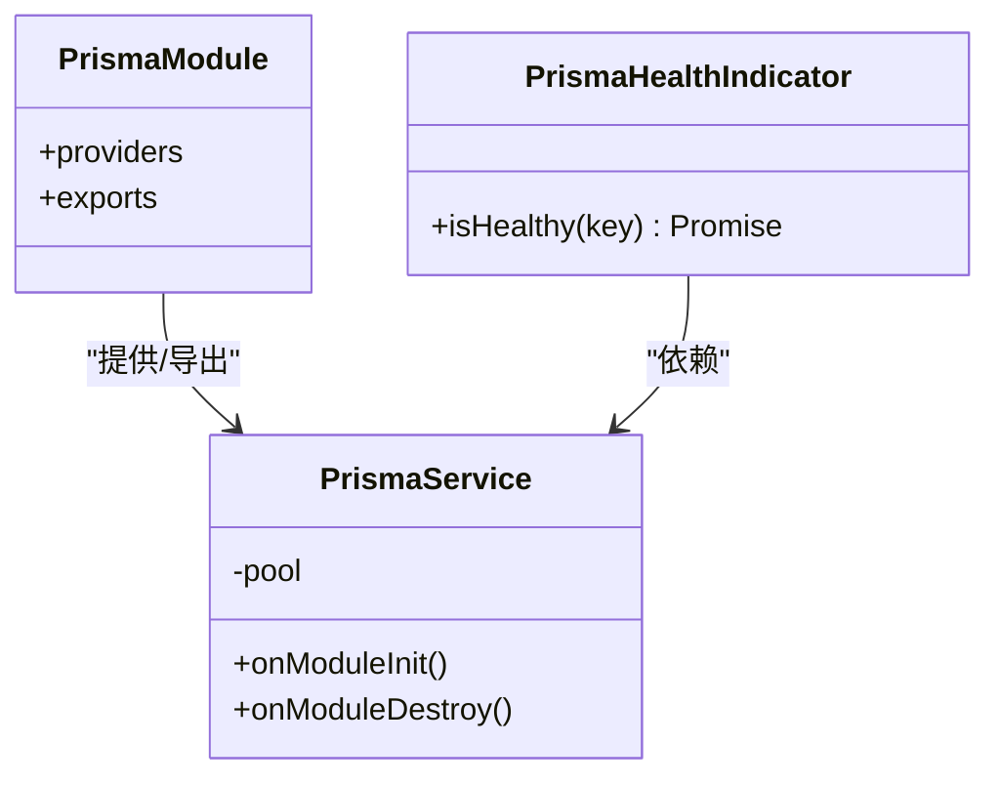
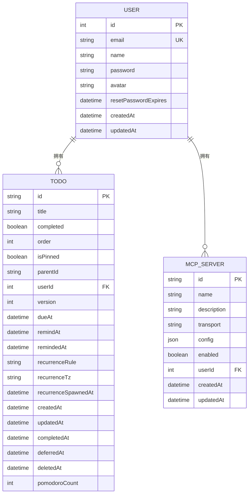
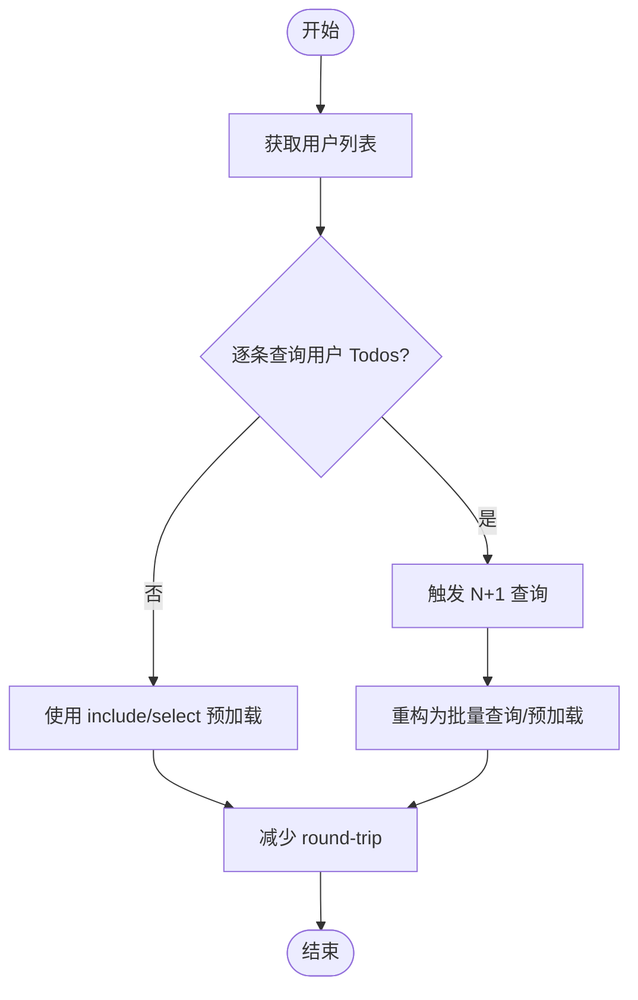
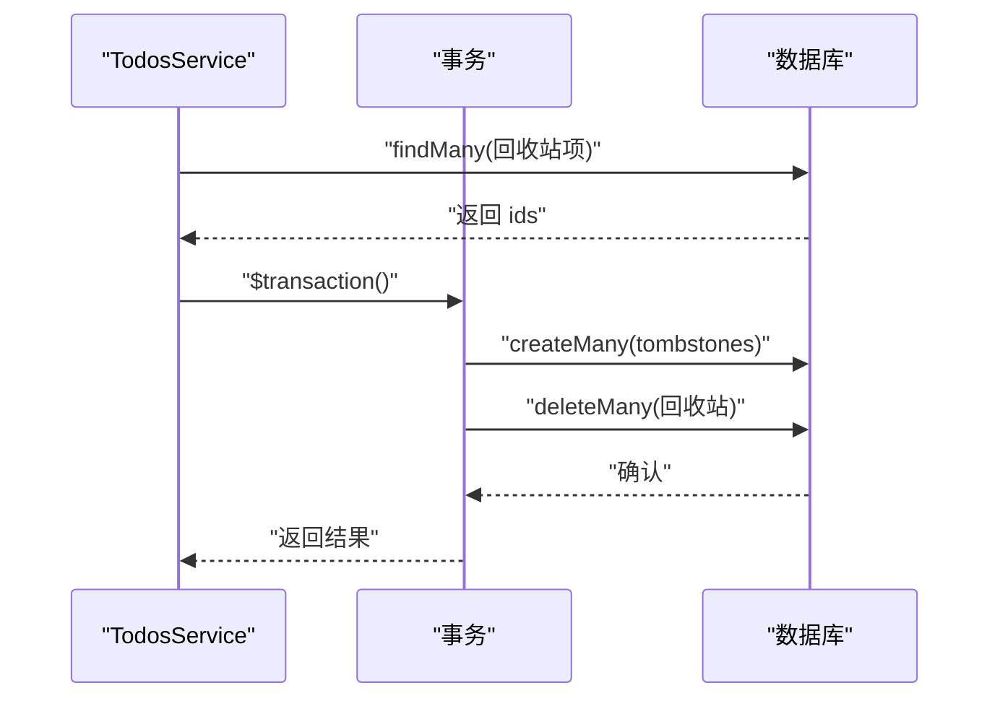
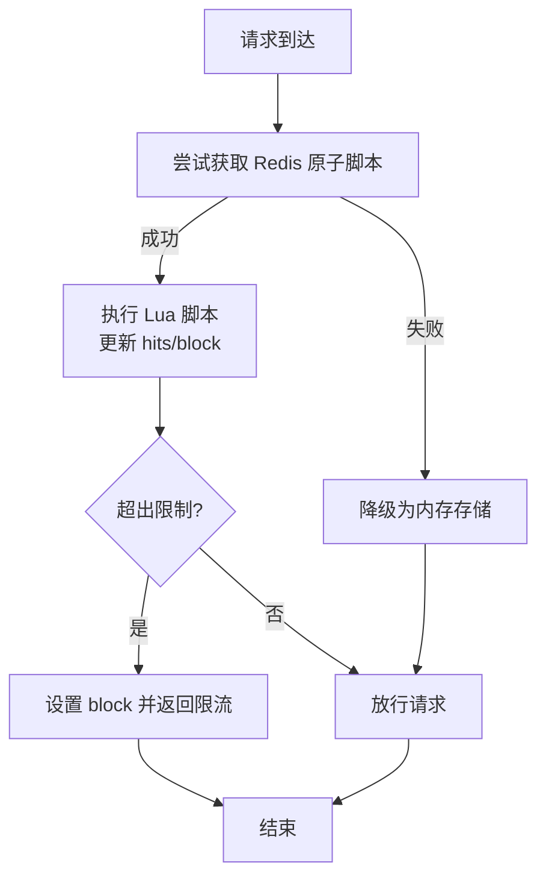
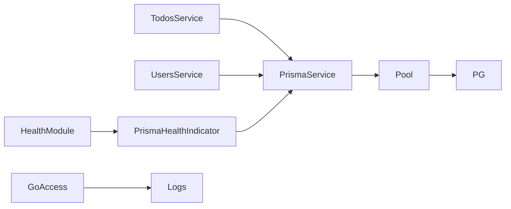

# 查询优化与性能

<cite>
**本文引用的文件**
- [apps/backend/src/prisma/prisma.service.ts](file://apps/backend/src/prisma/prisma.service.ts)
- [apps/backend/src/prisma/prisma.module.ts](file://apps/backend/src/prisma/prisma.module.ts)
- [apps/backend/src/health/prisma.health.ts](file://apps/backend/src/health/prisma.health.ts)
- [apps/backend/src/health/health.module.ts](file://apps/backend/src/health/health.module.ts)
- [apps/backend/src/todos/todos.service.ts](file://apps/backend/src/todos/todos.service.ts)
- [apps/backend/src/users/users.service.ts](file://apps/backend/src/users/users.service.ts)
- [apps/backend/prisma/schema/todo.prisma](file://apps/backend/prisma/schema/todo.prisma)
- [apps/backend/prisma/schema/user.prisma](file://apps/backend/prisma/schema/user.prisma)
- [apps/backend/prisma/schema/base.prisma](file://apps/backend/prisma/schema/base.prisma)
- [apps/backend/prisma/schema/mcp.prisma](file://apps/backend/prisma/schema/mcp.prisma)
- [apps/backend/src/common/throttling/redis-throttler.storage.ts](file://apps/backend/src/common/throttling/redis-throttler.storage.ts)
- [apps/backend/src/common/throttling/throttling.constants.ts](file://apps/backend/src/common/throttling/throttling.constants.ts)
- [apps/backend/tests/common/throttling.constants.spec.ts](file://apps/backend/tests/common/throttling.constants.spec.ts)
- [apps/backend/tests/common/redis-throttler.storage.spec.ts](file://apps/backend/tests/common/redis-throttler.storage.spec.ts)
- [apps/backend/tests/common/throttling.guard.spec.ts](file://apps/backend/tests/common/throttling.guard.spec.ts)
- [apps/backend/tests/e2e/test-app.ts](file://apps/backend/tests/e2e/test-app.ts)
- [docker-compose.yml](file://docker-compose.yml)
</cite>

## 目录
1. [简介](#简介)
2. [项目结构](#项目结构)
3. [核心组件](#核心组件)
4. [架构总览](#架构总览)
5. [详细组件分析](#详细组件分析)
6. [依赖关系分析](#依赖关系分析)
7. [性能考量](#性能考量)
8. [故障排查指南](#故障排查指南)
9. [结论](#结论)
10. [附录](#附录)

## 简介
本文件聚焦 Lumina Todo 后端在数据库查询方面的优化实践，围绕 Prisma 查询性能分析、索引策略设计、查询计划优化、N+1 问题识别与解决、批量查询与懒加载策略、数据库连接池与并发控制、慢查询监控与性能指标分析等主题展开。文档同时提供可落地的查询重构技巧与实际案例，帮助开发者在保证功能正确性的前提下，系统性提升数据库层的吞吐与稳定性。

## 项目结构
后端采用 NestJS + Prisma 架构，数据库适配通过 PostgreSQL 与 pg 连接池实现；查询优化相关的关键位置包括：
- Prisma 服务与模块：负责连接池初始化、生命周期管理与健康检查
- Schema 定义：定义模型与索引，直接影响查询计划与执行效率
- 业务服务：todos.service 与 users.service 展示了常见查询模式与潜在优化点
- 限流与并发：基于 Redis 的滑动窗口限流，保障数据库在高并发下的稳定性
- 监控与可视化：通过日志与 GoAccess 实时可视化访问日志，辅助定位慢请求

图表来源
- [apps/backend/src/prisma/prisma.service.ts:1-34](file://apps/backend/src/prisma/prisma.service.ts#L1-L34)
- [apps/backend/src/prisma/prisma.module.ts:1-10](file://apps/backend/src/prisma/prisma.module.ts#L1-L10)
- [apps/backend/src/health/prisma.health.ts:1-31](file://apps/backend/src/health/prisma.health.ts#L1-L31)
- [docker-compose.yml:176-206](file://docker-compose.yml#L176-L206)

章节来源
- [apps/backend/src/prisma/prisma.service.ts:1-34](file://apps/backend/src/prisma/prisma.service.ts#L1-L34)
- [apps/backend/src/prisma/prisma.module.ts:1-10](file://apps/backend/src/prisma/prisma.module.ts#L1-L10)
- [apps/backend/src/health/prisma.health.ts:1-31](file://apps/backend/src/health/prisma.health.ts#L1-L31)
- [docker-compose.yml:176-206](file://docker-compose.yml#L176-L206)

## 核心组件
- PrismaService：封装 PrismaClient，使用 @prisma/adapter-pg 与 pg.Pool 建立连接池，统一 onModuleInit/onModuleDestroy 生命周期管理，确保连接安全释放。
- PrismaModule：全局导出 PrismaService，供各业务模块按需注入。
- PrismaHealthIndicator：通过原生 SQL 执行健康检查，验证数据库连通性。
- TodosService/ UsersService：展示典型查询模式，包含排序、过滤、事务与批量写入场景，是 N+1 与批量优化的切入点。
- Schema 索引：在 Todo/User/McpServer 模型上定义复合索引与唯一索引，支撑高频查询路径。
- 限流与并发：Redis 滑动窗口限流，避免突发流量对数据库造成压力。
- 监控：容器化部署中集成 GoAccess，实时可视化访问日志，辅助定位慢请求与异常峰值。

章节来源
- [apps/backend/src/prisma/prisma.service.ts:1-34](file://apps/backend/src/prisma/prisma.service.ts#L1-L34)
- [apps/backend/src/prisma/prisma.module.ts:1-10](file://apps/backend/src/prisma/prisma.module.ts#L1-L10)
- [apps/backend/src/health/prisma.health.ts:1-31](file://apps/backend/src/health/prisma.health.ts#L1-L31)
- [apps/backend/src/todos/todos.service.ts:1-147](file://apps/backend/src/todos/todos.service.ts#L1-L147)
- [apps/backend/src/users/users.service.ts:1-118](file://apps/backend/src/users/users.service.ts#L1-L118)
- [apps/backend/prisma/schema/todo.prisma:1-40](file://apps/backend/prisma/schema/todo.prisma#L1-L40)
- [apps/backend/prisma/schema/user.prisma:1-16](file://apps/backend/prisma/schema/user.prisma#L1-L16)
- [apps/backend/prisma/schema/mcp.prisma:1-16](file://apps/backend/prisma/schema/mcp.prisma#L1-L16)
- [apps/backend/src/common/throttling/redis-throttler.storage.ts:106-141](file://apps/backend/src/common/throttling/redis-throttler.storage.ts#L106-L141)
- [apps/backend/src/common/throttling/throttling.constants.ts:169-197](file://apps/backend/src/common/throttling/throttling.constants.ts#L169-L197)
- [docker-compose.yml:176-206](file://docker-compose.yml#L176-L206)

## 架构总览
下图展示了从请求到数据库的调用链路，以及关键的优化节点（索引、批量、连接池、限流）：

图表来源
- [apps/backend/src/todos/todos.service.ts:38-47](file://apps/backend/src/todos/todos.service.ts#L38-L47)
- [apps/backend/src/users/users.service.ts:19-39](file://apps/backend/src/users/users.service.ts#L19-L39)
- [apps/backend/src/prisma/prisma.service.ts:23-32](file://apps/backend/src/prisma/prisma.service.ts#L23-L32)

## 详细组件分析

### Prisma 查询性能与连接池
- 连接池初始化：通过 DATABASE_URL 构造 pg.Pool，并以 PrismaPg 作为适配器注入 PrismaClient，确保连接复用与并发可控。
- 生命周期管理：onModuleInit 负责连接，onModuleDestroy 负责断开与关闭连接池，避免资源泄漏。
- 健康检查：通过原生 SQL 验证数据库可用性，便于在启动阶段快速发现连接问题。

图表来源
- [apps/backend/src/prisma/prisma.service.ts:1-34](file://apps/backend/src/prisma/prisma.service.ts#L1-L34)
- [apps/backend/src/prisma/prisma.module.ts:1-10](file://apps/backend/src/prisma/prisma.module.ts#L1-L10)
- [apps/backend/src/health/prisma.health.ts:1-31](file://apps/backend/src/health/prisma.health.ts#L1-L31)

章节来源
- [apps/backend/src/prisma/prisma.service.ts:1-34](file://apps/backend/src/prisma/prisma.service.ts#L1-L34)
- [apps/backend/src/health/prisma.health.ts:19-30](file://apps/backend/src/health/prisma.health.ts#L19-L30)

### 索引策略设计与查询计划
- Todo 模型关键索引
  - 用户维度时间过滤：在 (userId, updatedAt)、(userId, remindAt)、(userId, dueAt) 上建立复合索引，支持按用户分组的时间类查询。
  - 删除标记过滤：在 (deletedAt) 上建立索引，加速软删除场景的筛选与回收站查询。
- User 模型
  - email 唯一索引，保障登录与注册场景的高效查找。
- McpServer 模型
  - 在 (userId) 上建立索引，支撑用户与 MCP 服务器的关联查询。
- 设计原则
  - 将最常用过滤条件放在复合索引前列，优先命中选择性高的列。
  - 对频繁排序字段（如 updatedAt、createdAt）结合索引，减少排序开销。
  - 软删除字段（deletedAt）建议配合覆盖索引或物化视图策略，降低全表扫描概率。

图表来源
- [apps/backend/prisma/schema/user.prisma:1-16](file://apps/backend/prisma/schema/user.prisma#L1-L16)
- [apps/backend/prisma/schema/todo.prisma:1-40](file://apps/backend/prisma/schema/todo.prisma#L1-L40)
- [apps/backend/prisma/schema/mcp.prisma:1-16](file://apps/backend/prisma/schema/mcp.prisma#L1-L16)

章节来源
- [apps/backend/prisma/schema/todo.prisma:24-28](file://apps/backend/prisma/schema/todo.prisma#L24-L28)
- [apps/backend/prisma/schema/user.prisma:3-3](file://apps/backend/prisma/schema/user.prisma#L3-L3)
- [apps/backend/prisma/schema/mcp.prisma:13-13](file://apps/backend/prisma/schema/mcp.prisma#L13-L13)

### N+1 查询问题识别与解决
- 典型场景
  - 列表页渲染：先获取用户列表，再逐条查询其 Todos，导致 N 次额外查询。
  - 关联对象：查询 Todo 时未预加载 User，导致每条记录触发一次关联查询。
- 解决方案
  - 使用 include 或 select 预加载关联数据，避免逐条查询。
  - 对于批量操作，优先使用 findMany + where IN，减少多次 round-trip。
  - 在服务层集中处理数据聚合，避免在控制器或前端重复发起查询。
- 在本项目中的体现
  - TodosService 的 findAll/findTrash 已明确指定 select 字段，有助于减少传输与解析成本，但若涉及关联查询仍需注意 N+1 风险。
  - UsersService 的 findByEmail/findOne 已使用精确 where 条件，建议在需要时增加 include 预加载。

章节来源
- [apps/backend/src/todos/todos.service.ts:38-47](file://apps/backend/src/todos/todos.service.ts#L38-L47)
- [apps/backend/src/users/users.service.ts:44-50](file://apps/backend/src/users/users.service.ts#L44-L50)

### 批量查询优化与懒加载策略
- 批量查询
  - 使用 findMany + where IN 替代循环逐条查询，显著降低数据库往返次数。
  - 对于回收站清理、批量软删等场景，优先使用 createMany/upsert + deleteMany 组合事务，减少多次往返。
- 懒加载与预加载
  - 仅在必要时加载关联对象，避免不必要的 JOIN 与大对象传输。
  - 对高频访问的数据采用缓存（如 Redis），降低数据库压力。
- 在本项目中的体现
  - clearTrash 使用 ids 批量 upsert tombstone 再 deleteMany，有效减少往返。
  - 事务包裹删除与 tombstone 写入，保证一致性与性能平衡。

图表来源
- [apps/backend/src/todos/todos.service.ts:117-141](file://apps/backend/src/todos/todos.service.ts#L117-L141)

章节来源
- [apps/backend/src/todos/todos.service.ts:117-141](file://apps/backend/src/todos/todos.service.ts#L117-L141)

### 查询重构技巧与实战案例
- 案例一：按用户与时间范围查询 Todo
  - 现状：按 userId + updatedAt 排序，使用复合索引 (userId, updatedAt)。
  - 优化：明确 select 字段，避免全量返回；必要时增加覆盖索引以消除回表。
- 案例二：回收站查询
  - 现状：使用 deletedAt 非空过滤，配合 (deletedAt) 索引。
  - 优化：批量清理时合并 upsert + deleteMany，减少往返。
- 案例三：用户登录/注册
  - 现状：email 唯一索引，findByEmail/findOne。
  - 优化：在高频场景引入 Redis 缓存，降低数据库压力；对密码字段仅在内部接口暴露。

章节来源
- [apps/backend/src/todos/todos.service.ts:52-61](file://apps/backend/src/todos/todos.service.ts#L52-L61)
- [apps/backend/src/todos/todos.service.ts:117-141](file://apps/backend/src/todos/todos.service.ts#L117-L141)
- [apps/backend/src/users/users.service.ts:44-50](file://apps/backend/src/users/users.service.ts#L44-L50)
- [apps/backend/prisma/schema/todo.prisma:27-27](file://apps/backend/prisma/schema/todo.prisma#L27-L27)

### 并发控制与限流
- 滑动窗口限流（Redis）
  - 使用 Lua 脚本原子性维护 hits 窗口与 block 状态，支持 TTL 与 blockDuration 控制。
  - 当超过 limit 时进入 block，阻断后续请求直至冷却。
- 默认与自定义配置
  - 提供 short/medium/long 三档窗口，支持环境变量覆盖。
  - 特定路径（如健康检查）自动跳过限流。
- 容错降级
  - 当 Redis 不可用时，自动降级为内存存储，保证系统可用性。

图表来源
- [apps/backend/src/common/throttling/redis-throttler.storage.ts:106-141](file://apps/backend/src/common/throttling/redis-throttler.storage.ts#L106-L141)
- [apps/backend/src/common/throttling/throttling.constants.ts:169-197](file://apps/backend/src/common/throttling/throttling.constants.ts#L169-L197)
- [apps/backend/tests/common/redis-throttler.storage.spec.ts:59-85](file://apps/backend/tests/common/redis-throttler.storage.spec.ts#L59-L85)
- [apps/backend/tests/common/throttling.constants.spec.ts:27-55](file://apps/backend/tests/common/throttling.constants.spec.ts#L27-L55)

章节来源
- [apps/backend/src/common/throttling/redis-throttler.storage.ts:106-141](file://apps/backend/src/common/throttling/redis-throttling/redis-throttler.storage.ts#L106-L141)
- [apps/backend/src/common/throttling/throttling.constants.ts:169-197](file://apps/backend/src/common/throttling/throttling.constants.ts#L169-L197)
- [apps/backend/tests/common/redis-throttler.storage.spec.ts:87-101](file://apps/backend/tests/common/redis-throttler.storage.spec.ts#L87-L101)
- [apps/backend/tests/common/throttling.constants.spec.ts:17-25](file://apps/backend/tests/common/throttling.constants.spec.ts#L17-L25)

## 依赖关系分析
- 组件耦合
  - 业务服务依赖 PrismaService，PrismaModule 提供全局注入，降低跨模块重复配置。
  - 健康检查依赖 PrismaService，确保数据库可用性前置校验。
- 外部依赖
  - PostgreSQL 与 pg.Pool 提供连接池能力；GoAccess 用于访问日志可视化。
- 潜在风险
  - 若业务层未统一通过 PrismaService 访问数据库，可能导致连接泄漏或限流绕过。
  - Redis 限流脚本依赖原子性，需确保 Lua 脚本与客户端版本兼容。

图表来源
- [apps/backend/src/todos/todos.service.ts:29-33](file://apps/backend/src/todos/todos.service.ts#L29-L33)
- [apps/backend/src/users/users.service.ts:14-14](file://apps/backend/src/users/users.service.ts#L14-L14)
- [apps/backend/src/health/health.module.ts:1-13](file://apps/backend/src/health/health.module.ts#L1-L13)
- [apps/backend/src/health/prisma.health.ts:10-13](file://apps/backend/src/health/prisma.health.ts#L10-L13)
- [apps/backend/src/prisma/prisma.service.ts:17-21](file://apps/backend/src/prisma/prisma.service.ts#L17-L21)
- [docker-compose.yml:176-206](file://docker-compose.yml#L176-L206)

章节来源
- [apps/backend/src/todos/todos.service.ts:29-33](file://apps/backend/src/todos/todos.service.ts#L29-L33)
- [apps/backend/src/users/users.service.ts:14-14](file://apps/backend/src/users/users.service.ts#L14-L14)
- [apps/backend/src/health/health.module.ts:8-12](file://apps/backend/src/health/health.module.ts#L8-L12)
- [apps/backend/src/health/prisma.health.ts:10-13](file://apps/backend/src/health/prisma.health.ts#L10-L13)
- [apps/backend/src/prisma/prisma.service.ts:17-21](file://apps/backend/src/prisma/prisma.service.ts#L17-L21)
- [docker-compose.yml:176-206](file://docker-compose.yml#L176-L206)

## 性能考量
- 查询层面
  - 明确 select 字段，避免全量返回；对只读场景尽量使用只读副本或缓存。
  - 使用复合索引覆盖常见 where/orderBy 组合，减少排序与回表。
  - 对高频写入场景使用事务合并多步操作，降低锁竞争。
- 连接池与并发
  - 合理设置连接池大小与超时参数，避免连接耗尽与长事务占用。
  - 在高并发场景启用限流，防止数据库被压垮。
- 监控与诊断
  - 通过访问日志与 GoAccess 可视化观察请求分布与异常峰值。
  - 结合数据库慢查询日志与事务分析，定位热点 SQL。

## 故障排查指南
- 数据库连接失败
  - 检查 DATABASE_URL 是否正确；通过 PrismaHealthIndicator 快速验证连通性。
- 查询性能下降
  - 分析是否存在 N+1；确认复合索引是否被使用；评估是否需要覆盖索引。
- 并发过高导致延迟上升
  - 检查限流配置与 Redis 脚本执行情况；必要时调整窗口与阈值。
- 日志与可视化
  - 确认容器日志挂载与 GoAccess 命令参数；查看实时报告定位慢请求。

章节来源
- [apps/backend/src/health/prisma.health.ts:19-30](file://apps/backend/src/health/prisma.health.ts#L19-L30)
- [apps/backend/src/common/throttling/redis-throttler.storage.ts:106-141](file://apps/backend/src/common/throttling/redis-throttler.storage.ts#L106-L141)
- [docker-compose.yml:176-206](file://docker-compose.yml#L176-L206)

## 结论
通过对 Prisma 连接池、Schema 索引、查询模式与并发控制的系统性优化，Lumina Todo 能够在高并发与复杂查询场景下保持稳定与高性能。建议持续关注查询计划变化、定期审查索引使用情况，并结合限流与监控体系，形成闭环的性能治理流程。

## 附录
- 环境变量与默认配置
  - DATABASE_URL：数据库连接字符串，必须存在。
  - 限流相关：支持通过环境变量覆盖 short/medium/long 窗口的 TTL 与 limit。
- 测试参考
  - 单元测试覆盖 Redis 限流脚本行为、滑动窗口语义与降级逻辑。
  - E2E 测试包含内存版 Prisma 客户端，便于模拟复杂查询与事务场景。

章节来源
- [apps/backend/src/prisma/prisma.service.ts:10-21](file://apps/backend/src/prisma/prisma.service.ts#L10-L21)
- [apps/backend/src/common/throttling/throttling.constants.ts:169-197](file://apps/backend/src/common/throttling/throttling.constants.ts#L169-L197)
- [apps/backend/tests/common/redis-throttler.storage.spec.ts:59-85](file://apps/backend/tests/common/redis-throttler.storage.spec.ts#L59-L85)
- [apps/backend/tests/common/throttling.constants.spec.ts:27-55](file://apps/backend/tests/common/throttling.constants.spec.ts#L27-L55)
- [apps/backend/tests/e2e/test-app.ts:149-370](file://apps/backend/tests/e2e/test-app.ts#L149-L370)