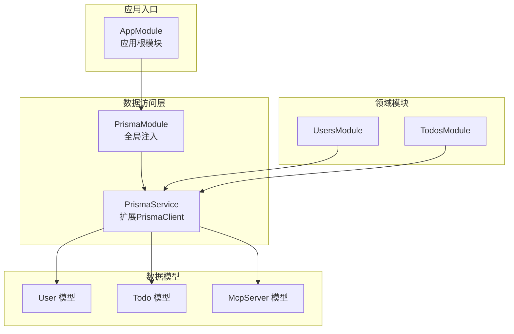
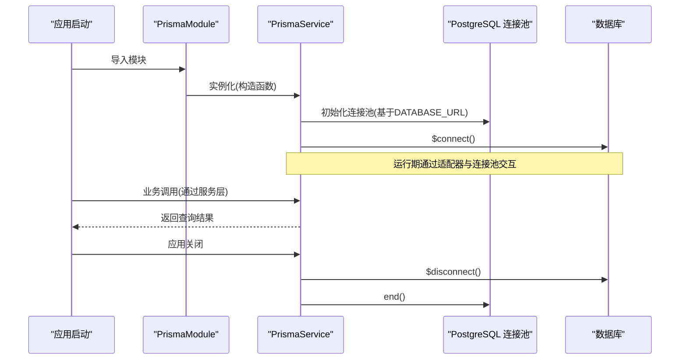
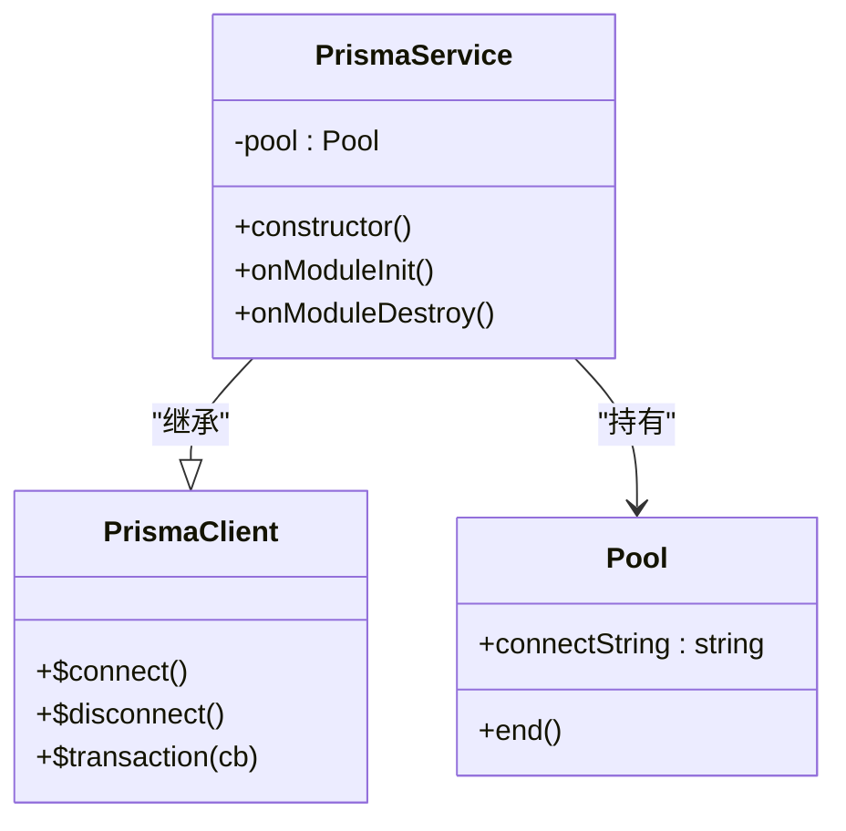
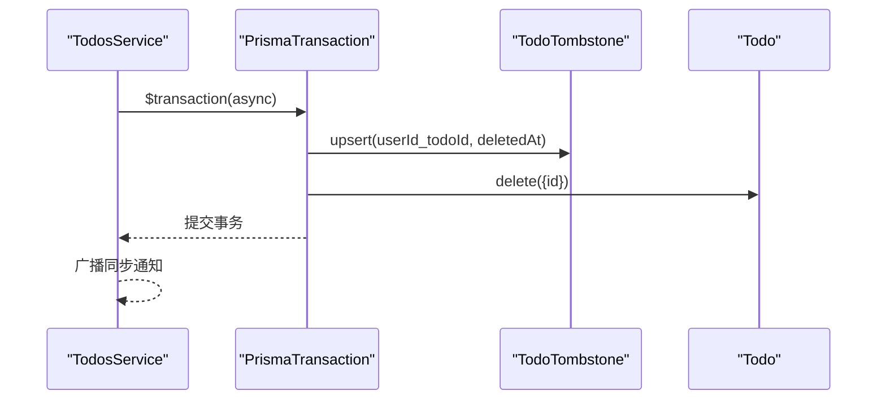
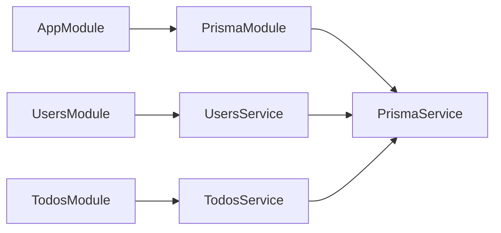
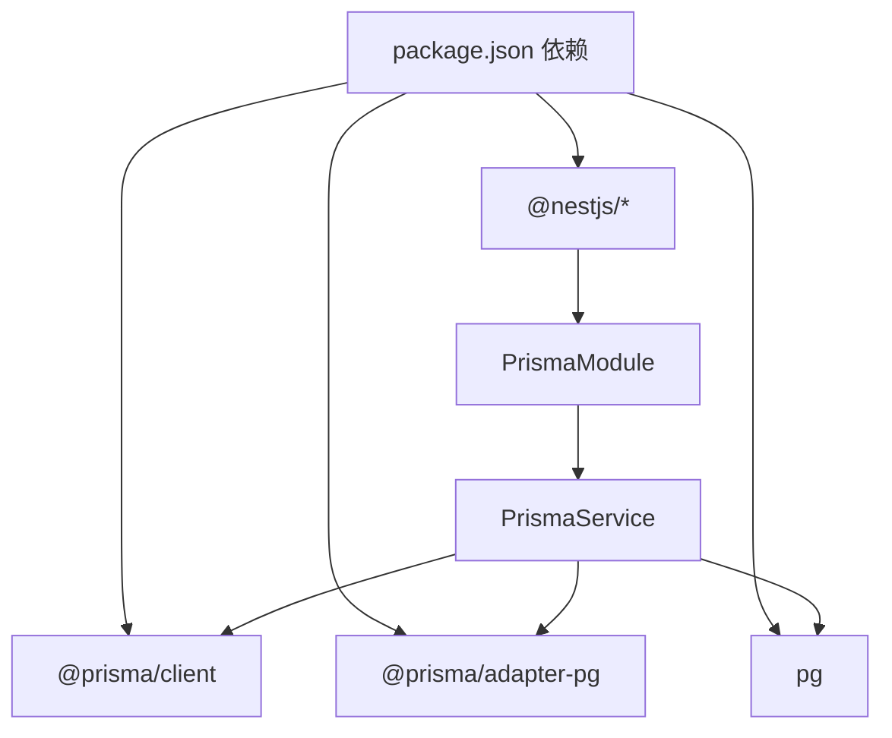

# Prisma数据访问层

<cite>
**本文引用的文件**
- [apps/backend/prisma/schema/base.prisma](file://apps/backend/prisma/schema/base.prisma)
- [apps/backend/prisma/schema/user.prisma](file://apps/backend/prisma/schema/user.prisma)
- [apps/backend/prisma/schema/todo.prisma](file://apps/backend/prisma/schema/todo.prisma)
- [apps/backend/prisma/schema/mcp.prisma](file://apps/backend/prisma/schema/mcp.prisma)
- [apps/backend/src/prisma/prisma.service.ts](file://apps/backend/src/prisma/prisma.service.ts)
- [apps/backend/src/prisma/prisma.module.ts](file://apps/backend/src/prisma/prisma.module.ts)
- [apps/backend/src/app.module.ts](file://apps/backend/src/app.module.ts)
- [apps/backend/src/users/users.service.ts](file://apps/backend/src/users/users.service.ts)
- [apps/backend/src/todos/todos.service.ts](file://apps/backend/src/todos/todos.service.ts)
- [apps/backend/src/todos/todos.module.ts](file://apps/backend/src/todos/todos.module.ts)
- [apps/backend/src/users/users.module.ts](file://apps/backend/src/users/users.module.ts)
- [apps/backend/prisma.config.js](file://apps/backend/prisma.config.js)
- [apps/backend/package.json](file://apps/backend/package.json)
</cite>

## 目录

1. [简介](#简介)
2. [项目结构](#项目结构)
3. [核心组件](#核心组件)
4. [架构总览](#架构总览)
5. [详细组件分析](#详细组件分析)
6. [依赖分析](#依赖分析)
7. [性能考虑](#性能考虑)
8. [故障排除指南](#故障排除指南)
9. [结论](#结论)
10. [附录](#附录)

## 简介

本文件系统性梳理并解释本项目的Prisma数据访问层，涵盖以下主题：

- Prisma ORM配置与初始化：生成器、适配器、连接池与生命周期管理
- 数据库连接池管理：PostgreSQL连接池与Prisma适配器的协作
- 事务处理机制：原生事务与批量写入策略
- 查询优化策略：选择性投影、索引设计与排序
- 数据模型设计：实体关系映射、字段约束与索引策略
- Prisma Client使用模式：服务层封装、批量操作与复杂查询
- 数据迁移与种子：迁移路径与命令
- 与NestJS依赖注入集成：全局模块、服务注册与模块导出

## 项目结构

本项目采用按功能域划分的模块化组织方式，Prisma相关代码集中在backend应用中，并通过NestJS模块系统进行全局注入与导出。

图表来源

- [apps/backend/src/app.module.ts:134](file://apps/backend/src/app.module.ts#L134)
- [apps/backend/src/prisma/prisma.module.ts:1-10](file://apps/backend/src/prisma/prisma.module.ts#L1-L10)
- [apps/backend/src/prisma/prisma.service.ts:1-34](file://apps/backend/src/prisma/prisma.service.ts#L1-L34)
- [apps/backend/src/users/users.module.ts:1-14](file://apps/backend/src/users/users.module.ts#L1-L14)
- [apps/backend/src/todos/todos.module.ts:1-15](file://apps/backend/src/todos/todos.module.ts#L1-L15)

章节来源

- [apps/backend/src/app.module.ts:134](file://apps/backend/src/app.module.ts#L134)
- [apps/backend/src/prisma/prisma.module.ts:1-10](file://apps/backend/src/prisma/prisma.module.ts#L1-L10)
- [apps/backend/src/prisma/prisma.service.ts:1-34](file://apps/backend/src/prisma/prisma.service.ts#L1-L34)

## 核心组件

- PrismaService：继承自PrismaClient，负责连接池初始化、模块生命周期钩子与连接关闭
- PrismaModule：全局模块，向整个应用提供PrismaService并统一导出
- 数据模型：User、Todo、McpServer，定义实体关系、唯一性约束、索引与映射
- 服务层封装：UsersService、TodosService对PrismaClient进行领域封装，暴露业务方法

章节来源

- [apps/backend/src/prisma/prisma.service.ts:1-34](file://apps/backend/src/prisma/prisma.service.ts#L1-L34)
- [apps/backend/src/prisma/prisma.module.ts:1-10](file://apps/backend/src/prisma/prisma.module.ts#L1-L10)
- [apps/backend/src/users/users.service.ts:1-118](file://apps/backend/src/users/users.service.ts#L1-L118)
- [apps/backend/src/todos/todos.service.ts:1-147](file://apps/backend/src/todos/todos.service.ts#L1-L147)

## 架构总览

下图展示了Prisma在NestJS中的集成路径、连接池与客户端的关系，以及服务层如何消费PrismaService。

图表来源

- [apps/backend/src/prisma/prisma.module.ts:1-10](file://apps/backend/src/prisma/prisma.module.ts#L1-L10)
- [apps/backend/src/prisma/prisma.service.ts:10-32](file://apps/backend/src/prisma/prisma.service.ts#L10-L32)

## 详细组件分析

### PrismaService：连接池与生命周期

- 连接池初始化：从环境变量读取DATABASE_URL，创建pg.Pool并传入@prisma/adapter-pg
- 生命周期钩子：实现OnModuleInit与OnModuleDestroy，分别执行$connect与$disconnect，并结束连接池
- 错误处理：若未设置DATABASE_URL则抛出异常，避免静默失败

图表来源

- [apps/backend/src/prisma/prisma.service.ts:1-34](file://apps/backend/src/prisma/prisma.service.ts#L1-L34)

章节来源

- [apps/backend/src/prisma/prisma.service.ts:10-32](file://apps/backend/src/prisma/prisma.service.ts#L10-L32)

### PrismaModule：全局注册与导出

- 使用@Global()确保PrismaService在整个应用范围内可用
- 在providers中注册PrismaService，在exports中导出，供其他模块注入

章节来源

- [apps/backend/src/prisma/prisma.module.ts:1-10](file://apps/backend/src/prisma/prisma.module.ts#L1-L10)

### 数据模型设计与索引策略

#### User 模型

- 主键：自增整数ID
- 唯一约束：email
- 关系：一对多到Todo与McpServer
- 映射：表名为users

章节来源

- [apps/backend/prisma/schema/user.prisma:1-16](file://apps/backend/prisma/schema/user.prisma#L1-L16)

#### Todo 模型

- 主键：UUID
- 字段：标题、完成状态、排序、置顶、父节点、用户ID、版本号、到期/提醒时间、回收站软删除时间、番茄钟计数等
- 关系：belongsTo User(userId -> User.id)
- 索引：复合索引(userId, updatedAt)、(userId, remindAt)、(userId, dueAt)、(deletedAt)
- 映射：表名为todos

章节来源

- [apps/backend/prisma/schema/todo.prisma:1-40](file://apps/backend/prisma/schema/todo.prisma#L1-L40)

#### McpServer 模型

- 主键：UUID
- 字段：名称、描述、传输类型、配置(Json)、启用状态、用户ID
- 关系：belongsTo User(userId -> User.id)，删除时级联
- 索引：(userId)
- 映射：表名为mcp_servers

章节来源

- [apps/backend/prisma/schema/mcp.prisma:1-16](file://apps/backend/prisma/schema/mcp.prisma#L1-L16)

#### TodoTombstone 模型

- 复合主键：(userId, todoId)
- 字段：deletedAt
- 索引：(userId, deletedAt)
- 映射：表名为todo_tombstones

章节来源

- [apps/backend/prisma/schema/todo.prisma:31-40](file://apps/backend/prisma/schema/todo.prisma#L31-L40)

### 查询优化策略

- 选择性投影：TodosService对查询结果进行字段选择，减少网络与序列化开销
- 排序策略：按置顶、顺序、创建时间排序，满足前端展示需求
- 软删除：通过deletedAt字段区分逻辑删除，配合索引提升查询效率
- 批量写入：在清空回收站场景使用createMany与deleteMany，降低往返次数

章节来源

- [apps/backend/src/todos/todos.service.ts:5-25](file://apps/backend/src/todos/todos.service.ts#L5-L25)
- [apps/backend/src/todos/todos.service.ts:38-47](file://apps/backend/src/todos/todos.service.ts#L38-L47)
- [apps/backend/src/todos/todos.service.ts:117-141](file://apps/backend/src/todos/todos.service.ts#L117-L141)

### 事务处理机制

- 原生事务：使用$transaction包裹多个写操作，保证一致性
- 批量UPSERT：在永久删除场景中，先在todo_tombstone上upsert记录，再删除todo
- 批量写入：清空回收站时，先批量写入墓碑记录，再批量删除

图表来源

- [apps/backend/src/todos/todos.service.ts:97-111](file://apps/backend/src/todos/todos.service.ts#L97-L111)

章节来源

- [apps/backend/src/todos/todos.service.ts:97-111](file://apps/backend/src/todos/todos.service.ts#L97-L111)
- [apps/backend/src/todos/todos.service.ts:127-141](file://apps/backend/src/todos/todos.service.ts#L127-L141)

### 复杂查询与关联查询示例

- 基础查询：UsersService提供按ID、邮箱查找用户的方法
- 关联查询：TodosService通过select仅返回必要字段，避免N+1问题
- 软删除查询：区分deletedAt为null与非null的记录集

章节来源

- [apps/backend/src/users/users.service.ts:19-50](file://apps/backend/src/users/users.service.ts#L19-L50)
- [apps/backend/src/todos/todos.service.ts:38-47](file://apps/backend/src/todos/todos.service.ts#L38-L47)
- [apps/backend/src/todos/todos.service.ts:52-61](file://apps/backend/src/todos/todos.service.ts#L52-L61)

### 与NestJS依赖注入集成

- 全局模块：PrismaModule在AppModule中导入，使PrismaService全局可用
- 服务注入：UsersService与TodosService通过构造函数注入PrismaService
- 模块导出：PrismaModule导出PrismaService；TodosModule与UsersModule导出各自服务

图表来源

- [apps/backend/src/app.module.ts:134](file://apps/backend/src/app.module.ts#L134)
- [apps/backend/src/prisma/prisma.module.ts:1-10](file://apps/backend/src/prisma/prisma.module.ts#L1-L10)
- [apps/backend/src/users/users.module.ts:1-14](file://apps/backend/src/users/users.module.ts#L1-L14)
- [apps/backend/src/todos/todos.module.ts:1-15](file://apps/backend/src/todos/todos.module.ts#L1-L15)

章节来源

- [apps/backend/src/app.module.ts:134](file://apps/backend/src/app.module.ts#L134)
- [apps/backend/src/users/users.module.ts:1-14](file://apps/backend/src/users/users.module.ts#L1-L14)
- [apps/backend/src/todos/todos.module.ts:1-15](file://apps/backend/src/todos/todos.module.ts#L1-L15)

### 数据迁移与种子

- 迁移命令：通过package.json脚本调用prisma migrate dev
- 生成客户端：通过prisma generate
- Studio可视化：通过prisma studio
- 配置文件：prisma.config.js指定schema目录、迁移目录与datasource.url

章节来源

- [apps/backend/package.json:26-29](file://apps/backend/package.json#L26-L29)
- [apps/backend/prisma.config.js:13-21](file://apps/backend/prisma.config.js#L13-L21)

## 依赖分析

- 外部依赖：@prisma/client、@prisma/adapter-pg、pg
- NestJS集成：通过@Global()与@Module()实现全局服务注册
- 服务间耦合：UsersService与TodosService均依赖PrismaService，保持低耦合高内聚

图表来源

- [apps/backend/package.json:31-87](file://apps/backend/package.json#L31-L87)
- [apps/backend/src/prisma/prisma.module.ts:1-10](file://apps/backend/src/prisma/prisma.module.ts#L1-L10)
- [apps/backend/src/prisma/prisma.service.ts:1-34](file://apps/backend/src/prisma/prisma.service.ts#L1-L34)

章节来源

- [apps/backend/package.json:31-87](file://apps/backend/package.json#L31-L87)

## 性能考虑

- 选择性投影：通过明确的select字段减少网络与序列化成本
- 索引策略：针对高频过滤与排序字段建立复合索引，如(userId, updatedAt)、(userId, remindAt)、(userId, dueAt)、(deletedAt)
- 批量操作：在批量写入场景使用createMany与deleteMany，降低往返次数
- 连接池：使用pg.Pool与@prisma/adapter-pg，结合$connect/$disconnect与模块销毁钩子，确保资源正确释放

章节来源

- [apps/backend/src/todos/todos.service.ts:5-25](file://apps/backend/src/todos/todos.service.ts#L5-L25)
- [apps/backend/src/todos/todos.service.ts:117-141](file://apps/backend/src/todos/todos.service.ts#L117-L141)
- [apps/backend/prisma/schema/todo.prisma:24-28](file://apps/backend/prisma/schema/todo.prisma#L24-L28)

## 故障排除指南

- DATABASE_URL缺失：构造函数中会抛出异常，需检查环境变量配置
- 连接失败：确认DATABASE_URL可访问，检查网络与数据库状态
- 事务回滚：$transaction内部任一步骤失败将回滚，检查upsert与delete参数
- 软删除不生效：确认deletedAt字段查询条件与索引是否正确

章节来源

- [apps/backend/src/prisma/prisma.service.ts:10-21](file://apps/backend/src/prisma/prisma.service.ts#L10-L21)
- [apps/backend/src/todos/todos.service.ts:97-111](file://apps/backend/src/todos/todos.service.ts#L97-L111)

## 结论

本项目的Prisma数据访问层通过全局模块化注册、连接池与适配器的合理配置、严格的索引与查询优化策略，以及事务化的批量写入，实现了高性能与可维护性的平衡。服务层对PrismaClient进行封装，既保证了领域逻辑的清晰，又便于测试与扩展。

## 附录

- Prisma配置文件：prisma.config.js
- 包管理脚本：package.json中的prisma相关命令
- 数据模型文件：base.prisma、user.prisma、todo.prisma、mcp.prisma

章节来源

- [apps/backend/prisma.config.js:13-21](file://apps/backend/prisma.config.js#L13-L21)
- [apps/backend/package.json:26-29](file://apps/backend/package.json#L26-L29)
- [apps/backend/prisma/schema/base.prisma:1-9](file://apps/backend/prisma/schema/base.prisma#L1-L9)
- [apps/backend/prisma/schema/user.prisma:1-16](file://apps/backend/prisma/schema/user.prisma#L1-L16)
- [apps/backend/prisma/schema/todo.prisma:1-40](file://apps/backend/prisma/schema/todo.prisma#L1-L40)
- [apps/backend/prisma/schema/mcp.prisma:1-16](file://apps/backend/prisma/schema/mcp.prisma#L1-L16)
