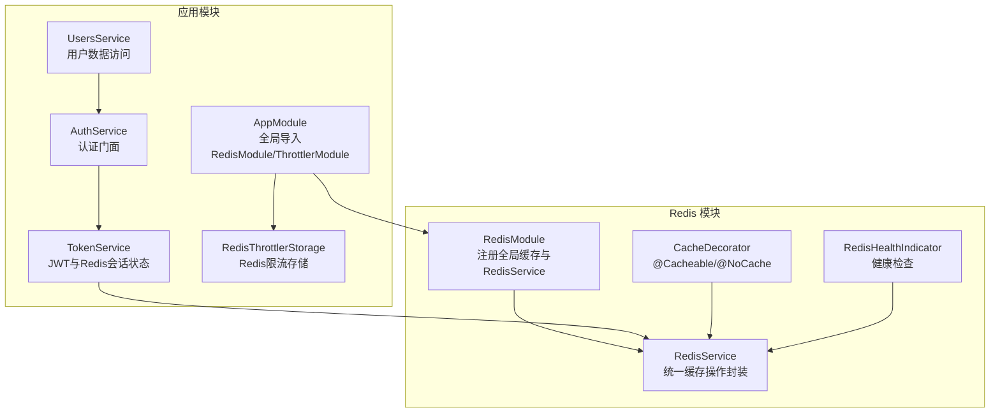
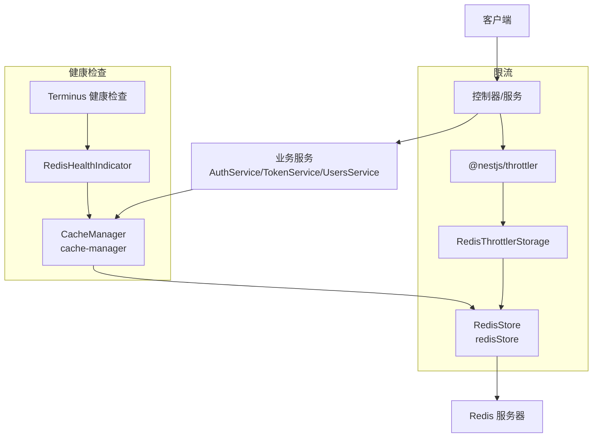
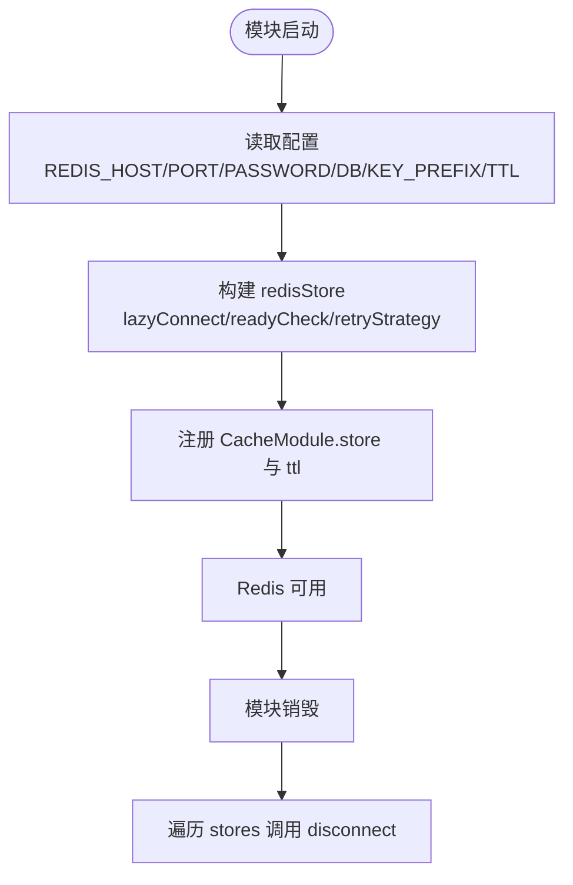
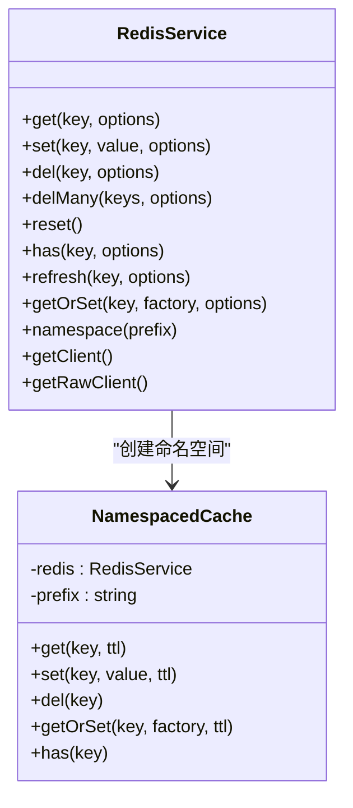
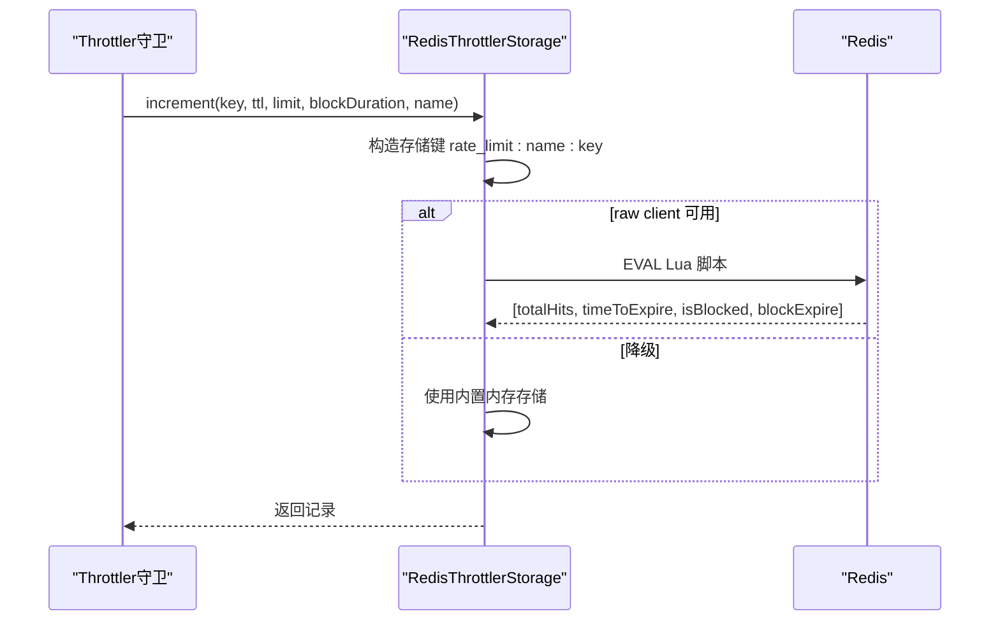
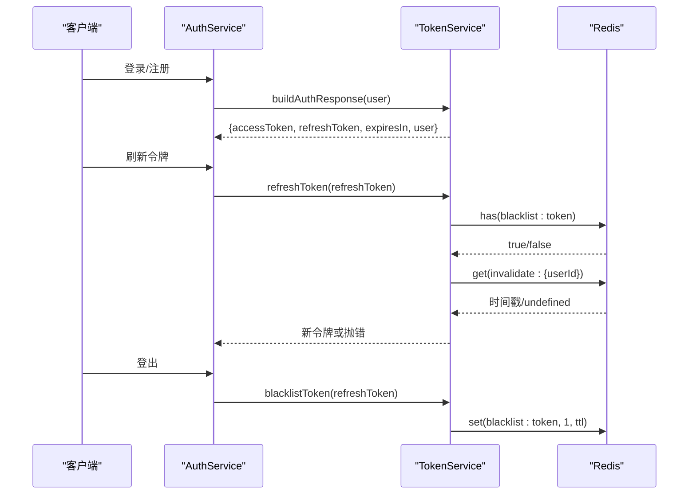
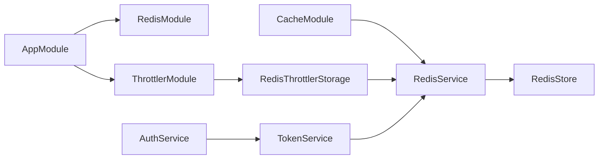

# Redis缓存与会话

<cite>
**本文引用的文件**
- [apps/backend/src/redis/redis.module.ts](file://apps/backend/src/redis/redis.module.ts)
- [apps/backend/src/redis/redis.service.ts](file://apps/backend/src/redis/redis.service.ts)
- [apps/backend/src/redis/cache.decorator.ts](file://apps/backend/src/redis/cache.decorator.ts)
- [apps/backend/src/redis/redis.health.ts](file://apps/backend/src/redis/redis.health.ts)
- [apps/backend/src/redis/index.ts](file://apps/backend/src/redis/index.ts)
- [apps/backend/src/common/throttling/redis-throttler.storage.ts](file://apps/backend/src/common/throttling/redis-throttler.storage.ts)
- [apps/backend/src/app.module.ts](file://apps/backend/src/app.module.ts)
- [apps/backend/src/auth/token.service.ts](file://apps/backend/src/auth/token.service.ts)
- [apps/backend/src/auth/auth.service.ts](file://apps/backend/src/auth/auth.service.ts)
- [apps/backend/src/users/users.service.ts](file://apps/backend/src/users/users.service.ts)
</cite>

## 目录
1. [简介](#简介)
2. [项目结构](#项目结构)
3. [核心组件](#核心组件)
4. [架构总览](#架构总览)
5. [详细组件分析](#详细组件分析)
6. [依赖关系分析](#依赖关系分析)
7. [性能考量](#性能考量)
8. [故障排查指南](#故障排查指南)
9. [结论](#结论)
10. [附录](#附录)

## 简介
本文件系统性梳理后端应用中的 Redis 缓存与会话模块，覆盖以下主题：
- Redis 连接配置与连接池管理
- 缓存策略设计：键前缀、TTL、命名空间、穿透防护、失效策略
- 分布式限流（基于 Redis 的滑动窗口/固定窗口混合实现）
- JWT 令牌缓存与会话状态管理
- 缓存装饰器的使用方法与最佳实践
- 健康检查机制、性能监控指标与故障恢复策略
- 与 NestJS 模块系统的集成方式与最佳实践

## 项目结构
Redis 缓存与会话相关代码集中在 apps/backend/src/redis 与 apps/backend/src/common/throttling 目录，并在应用根模块中完成全局注册。

**图表来源**
- [apps/backend/src/redis/redis.module.ts:1-84](file://apps/backend/src/redis/redis.module.ts#L1-L84)
- [apps/backend/src/redis/redis.service.ts:1-255](file://apps/backend/src/redis/redis.service.ts#L1-L255)
- [apps/backend/src/redis/cache.decorator.ts:1-88](file://apps/backend/src/redis/cache.decorator.ts#L1-L88)
- [apps/backend/src/redis/redis.health.ts:1-43](file://apps/backend/src/redis/redis.health.ts#L1-L43)
- [apps/backend/src/app.module.ts:1-160](file://apps/backend/src/app.module.ts#L1-L160)
- [apps/backend/src/common/throttling/redis-throttler.storage.ts:1-173](file://apps/backend/src/common/throttling/redis-throttler.storage.ts#L1-L173)
- [apps/backend/src/auth/token.service.ts:1-187](file://apps/backend/src/auth/token.service.ts#L1-L187)
- [apps/backend/src/auth/auth.service.ts:1-127](file://apps/backend/src/auth/auth.service.ts#L1-L127)
- [apps/backend/src/users/users.service.ts:1-118](file://apps/backend/src/users/users.service.ts#L1-L118)

**章节来源**
- [apps/backend/src/redis/index.ts:1-5](file://apps/backend/src/redis/index.ts#L1-L5)
- [apps/backend/src/app.module.ts:118-123](file://apps/backend/src/app.module.ts#L118-L123)

## 核心组件
- RedisModule：异步注册全局缓存模块，注入 ConfigService，使用 redisStore 初始化连接池，支持重试策略、ready 检查、键前缀与默认 TTL。
- RedisService：统一缓存操作封装，提供 get/set/del/delMany/reset、has、refresh、getOrSet（穿透防护）、命名空间 NamespacedCache、底层客户端访问。
- CacheDecorator：@Cacheable/@NoCache 装饰器，结合 @nestjs/cache-manager 的 CacheInterceptor、CacheKey、CacheTTL 实现方法级缓存。
- RedisHealthIndicator：Terminus 健康检查，通过 set/get 测试 Redis 连接与读写一致性。
- RedisThrottlerStorage：基于 Redis Lua 脚本的限流存储，支持滑动窗口语义与阻断窗口，降级到内存存储。
- TokenService：JWT 生成与校验、令牌黑名单、用户会话失效标记，配合 Redis 实现会话状态管理。
- AuthService：认证门面，整合 TokenService、PasswordService、UsersService。
- UsersService：用户数据访问层，为认证流程提供用户信息。

**章节来源**
- [apps/backend/src/redis/redis.module.ts:1-84](file://apps/backend/src/redis/redis.module.ts#L1-L84)
- [apps/backend/src/redis/redis.service.ts:1-255](file://apps/backend/src/redis/redis.service.ts#L1-L255)
- [apps/backend/src/redis/cache.decorator.ts:1-88](file://apps/backend/src/redis/cache.decorator.ts#L1-L88)
- [apps/backend/src/redis/redis.health.ts:1-43](file://apps/backend/src/redis/redis.health.ts#L1-L43)
- [apps/backend/src/common/throttling/redis-throttler.storage.ts:1-173](file://apps/backend/src/common/throttling/redis-throttler.storage.ts#L1-L173)
- [apps/backend/src/auth/token.service.ts:1-187](file://apps/backend/src/auth/token.service.ts#L1-L187)
- [apps/backend/src/auth/auth.service.ts:1-127](file://apps/backend/src/auth/auth.service.ts#L1-L127)
- [apps/backend/src/users/users.service.ts:1-118](file://apps/backend/src/users/users.service.ts#L1-L118)

## 架构总览
Redis 在本项目中承担三类角色：
- 缓存层：提供键值缓存、命名空间、穿透防护、TTL 管理
- 会话状态存储：JWT 黑名单、用户会话失效标记
- 限流存储：基于 Redis 的滑动/固定窗口混合限流

**图表来源**
- [apps/backend/src/app.module.ts:118-123](file://apps/backend/src/app.module.ts#L118-L123)
- [apps/backend/src/redis/redis.module.ts:28-78](file://apps/backend/src/redis/redis.module.ts#L28-L78)
- [apps/backend/src/redis/redis.health.ts:10-42](file://apps/backend/src/redis/redis.health.ts#L10-L42)
- [apps/backend/src/common/throttling/redis-throttler.storage.ts:106-173](file://apps/backend/src/common/throttling/redis-throttler.storage.ts#L106-L173)

## 详细组件分析

### Redis 连接配置与连接池管理
- 异步工厂：通过 ConfigModule 注入 ConfigService，读取 REDIS_* 环境变量，构造 redisStore。
- 连接参数：host/port/password/db/keyPrefix/lazyConnect/enableReadyCheck/maxRetriesPerRequest/retryStrategy。
- 默认 TTL：模块级默认 TTL 以毫秒形式传入 cache-manager。
- 连接生命周期：RedisService 实现 OnModuleDestroy，在销毁时遍历 stores 并调用 disconnect。

**图表来源**
- [apps/backend/src/redis/redis.module.ts:28-78](file://apps/backend/src/redis/redis.module.ts#L28-L78)
- [apps/backend/src/redis/redis.service.ts:68-87](file://apps/backend/src/redis/redis.service.ts#L68-L87)

**章节来源**
- [apps/backend/src/redis/redis.module.ts:10-77](file://apps/backend/src/redis/redis.module.ts#L10-L77)
- [apps/backend/src/redis/redis.service.ts:61-87](file://apps/backend/src/redis/redis.service.ts#L61-L87)

### 缓存策略设计与装饰器
- 键前缀与命名空间：CachePrefix 枚举与 NamespacedCache，自动为键添加前缀，隔离不同业务域。
- TTL 管理：默认 TTL 常量；get/set 支持按需覆盖；refresh 通过重新 set 实现“续期”。
- 穿透防护：getOrSet 在缓存缺失时调用 factory 获取数据并写入，仅当值非空/非 null 时缓存。
- 命令级缓存：@Cacheable 支持自定义 key、ttl、是否使用请求/查询参数生成键；@NoCache 标记禁用缓存。
- 命名空间便捷操作：namespace(prefix) 返回 NamespacedCache，内部复用 RedisService 的方法。

**图表来源**
- [apps/backend/src/redis/redis.service.ts:18-255](file://apps/backend/src/redis/redis.service.ts#L18-L255)

**章节来源**
- [apps/backend/src/redis/redis.service.ts:18-255](file://apps/backend/src/redis/redis.service.ts#L18-L255)
- [apps/backend/src/redis/cache.decorator.ts:12-88](file://apps/backend/src/redis/cache.decorator.ts#L12-L88)

### 分布式限流实现机制
- 存储实现：RedisThrottlerStorage 使用 Redis EVAL 执行 Lua 脚本，维护 hits 历史（zset）、序列号（incr）、阻断键（block），实现滑动窗口与阻断窗口。
- 降级策略：若无法获取底层 Redis 客户端（raw client），回退到 @nestjs/throttler 内置的内存存储。
- 键空间：使用 CachePrefix.RATE_LIMIT 前缀，区分不同限流器名称（throttlerName）。

**图表来源**
- [apps/backend/src/common/throttling/redis-throttler.storage.ts:106-173](file://apps/backend/src/common/throttling/redis-throttler.storage.ts#L106-L173)

**章节来源**
- [apps/backend/src/common/throttling/redis-throttler.storage.ts:18-173](file://apps/backend/src/common/throttling/redis-throttler.storage.ts#L18-L173)

### 会话存储与 JWT 令牌缓存
- 令牌黑名单：blacklistToken 根据 token 的 exp 计算剩余 TTL，将 token 写入 Redis 黑名单键，前缀为 CachePrefix.AUTH。
- 会话失效标记：invalidateUserSessions 将当前时间戳写入 invalidate:{userId}，用于后续校验刷新令牌是否仍有效。
- 刷新令牌校验：refreshToken 会检查黑名单与用户会话失效标记，确保安全。
- 用户状态管理：AuthService 对外暴露 login/register/logout/refresh 等能力，内部委托 TokenService 与 UsersService。

**图表来源**
- [apps/backend/src/auth/auth.service.ts:41-101](file://apps/backend/src/auth/auth.service.ts#L41-L101)
- [apps/backend/src/auth/token.service.ts:47-170](file://apps/backend/src/auth/token.service.ts#L47-L170)

**章节来源**
- [apps/backend/src/auth/auth.service.ts:1-127](file://apps/backend/src/auth/auth.service.ts#L1-L127)
- [apps/backend/src/auth/token.service.ts:1-187](file://apps/backend/src/auth/token.service.ts#L1-L187)

### 缓存装饰器使用方法与最佳实践
- @Cacheable：对方法启用缓存拦截，可选设置缓存键与 TTL；适合读多写少、结果稳定的接口。
- @NoCache：禁用缓存，适用于敏感或易变数据。
- 建议：
  - 为高并发接口使用 @Cacheable，并合理设置 TTL。
  - 对需要强一致性的接口禁用缓存。
  - 结合 getOrSet 实现“缓存穿透防护”，避免空值污染缓存。

**章节来源**
- [apps/backend/src/redis/cache.decorator.ts:23-88](file://apps/backend/src/redis/cache.decorator.ts#L23-L88)

### 健康检查机制
- RedisHealthIndicator 通过写入与读取测试键，验证 Redis 连接与读写一致性，返回 Terminus 健康状态。
- 建议在健康检查端点中包含该指示器，便于容器编排与运维监控。

**章节来源**
- [apps/backend/src/redis/redis.health.ts:10-42](file://apps/backend/src/redis/redis.health.ts#L10-L42)

## 依赖关系分析
- RedisModule 作为全局模块，向整个应用提供 CacheModule 与 RedisService。
- ThrottlerModule 通过 RedisModule 注入 RedisService，使用 RedisThrottlerStorage 实现分布式限流。
- TokenService 依赖 RedisService 与 ConfigService/JwtService，负责会话状态与令牌管理。
- RedisService 依赖 @nestjs/cache-manager 的 Cache，提供统一的缓存操作。

**图表来源**
- [apps/backend/src/app.module.ts:118-123](file://apps/backend/src/app.module.ts#L118-L123)
- [apps/backend/src/redis/redis.module.ts:28-82](file://apps/backend/src/redis/redis.module.ts#L28-L82)
- [apps/backend/src/common/throttling/redis-throttler.storage.ts:106-112](file://apps/backend/src/common/throttling/redis-throttler.storage.ts#L106-L112)
- [apps/backend/src/auth/token.service.ts:22-29](file://apps/backend/src/auth/token.service.ts#L22-L29)

**章节来源**
- [apps/backend/src/app.module.ts:118-123](file://apps/backend/src/app.module.ts#L118-L123)
- [apps/backend/src/redis/redis.module.ts:28-82](file://apps/backend/src/redis/redis.module.ts#L28-L82)

## 性能考量
- 连接池与重试：模块侧配置了最大重试次数与指数退避策略，降低瞬时故障影响。
- TTL 设计：模块默认 TTL 以毫秒传入 cache-manager；RedisService 支持按需覆盖，建议针对热点数据设置更短 TTL 以避免缓存雪崩。
- 命名空间：通过前缀隔离不同业务域，减少键冲突与误删风险。
- Lua 脚本：限流存储使用 EVAL，原子性保证滑动窗口与阻断窗口逻辑，降低竞争条件。
- 健康检查：定期运行 RedisHealthIndicator，提前发现连接问题。

[本节为通用指导，无需具体文件引用]

## 故障排查指南
- 连接失败：检查 REDIS_HOST/REDIS_PORT/REDIS_PASSWORD/REDIS_DB 等环境变量；关注模块初始化日志与重试记录。
- 缓存不可用：确认 CacheModule 已正确注册；检查 RedisService 的 onModuleDestroy 是否触发异常。
- 限流降级：若 Redis 不可用，RedisThrottlerStorage 会回退到内存存储；可通过日志观察降级次数。
- 令牌黑名单无效：确认 TokenService 的 blacklistToken 是否被调用，以及 exp 计算是否正确。
- 健康检查失败：查看 RedisHealthIndicator 抛出的 HealthCheckError 详情，核对键值读写是否一致。

**章节来源**
- [apps/backend/src/redis/redis.module.ts:56-76](file://apps/backend/src/redis/redis.module.ts#L56-L76)
- [apps/backend/src/common/throttling/redis-throttler.storage.ts:149-156](file://apps/backend/src/common/throttling/redis-throttler.storage.ts#L149-L156)
- [apps/backend/src/redis/redis.health.ts:34-41](file://apps/backend/src/redis/redis.health.ts#L34-L41)

## 结论
本模块通过 NestJS 全局缓存与 RedisStore，提供了统一、可扩展的缓存与会话能力。结合装饰器、命名空间、Lua 脚本限流与健康检查，形成从连接管理到业务使用的完整闭环。建议在生产环境中合理设置 TTL、启用健康检查、监控限流降级情况，并对关键路径使用 @Cacheable 与 getOrSet 保障性能与一致性。

[本节为总结，无需具体文件引用]

## 附录

### 与 NestJS 模块系统的集成方式与最佳实践
- 全局注册：RedisModule 使用 @Global() 与 exports 暴露 CacheModule 与 RedisService，确保任意模块可直接注入。
- 异步配置：通过 useFactory 与 ConfigService 注入，支持环境变量驱动的配置。
- 限流集成：ThrottlerModule 通过 RedisModule 注入 RedisService，使用 RedisThrottlerStorage 实现跨实例限流。
- 最佳实践：
  - 将 Redis 配置集中于 .env，避免硬编码。
  - 为不同业务域使用命名空间前缀，避免键冲突。
  - 对高频读取接口使用 @Cacheable，对敏感接口使用 @NoCache。
  - 定期清理过期键，避免缓存膨胀。

**章节来源**
- [apps/backend/src/redis/redis.module.ts:26-82](file://apps/backend/src/redis/redis.module.ts#L26-L82)
- [apps/backend/src/app.module.ts:118-123](file://apps/backend/src/app.module.ts#L118-L123)