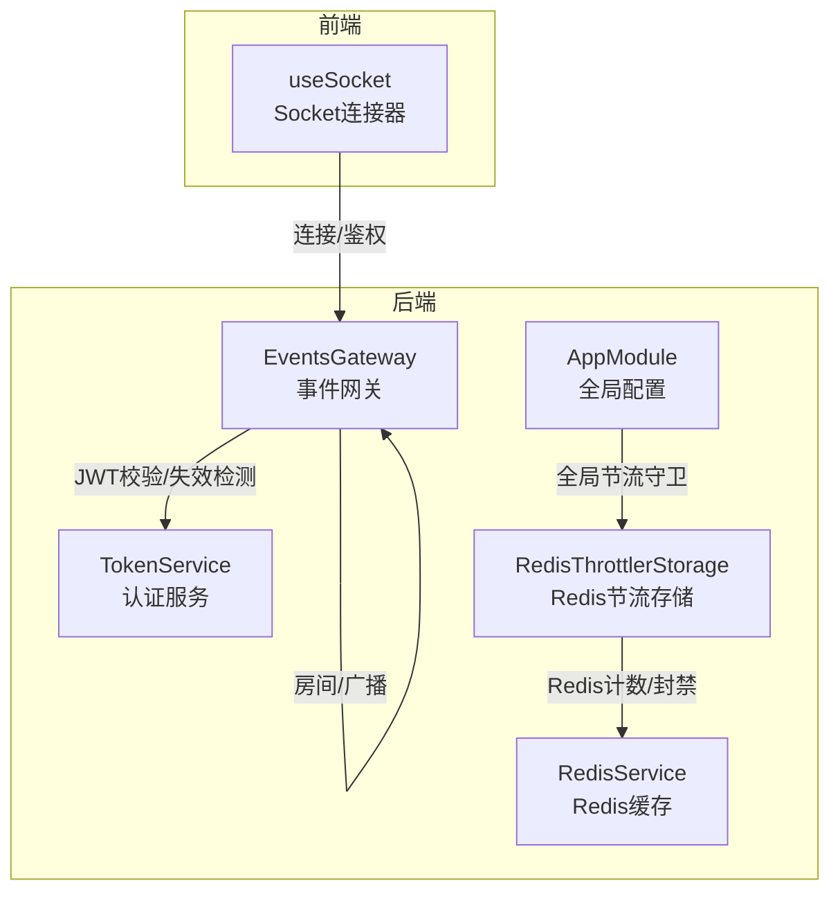
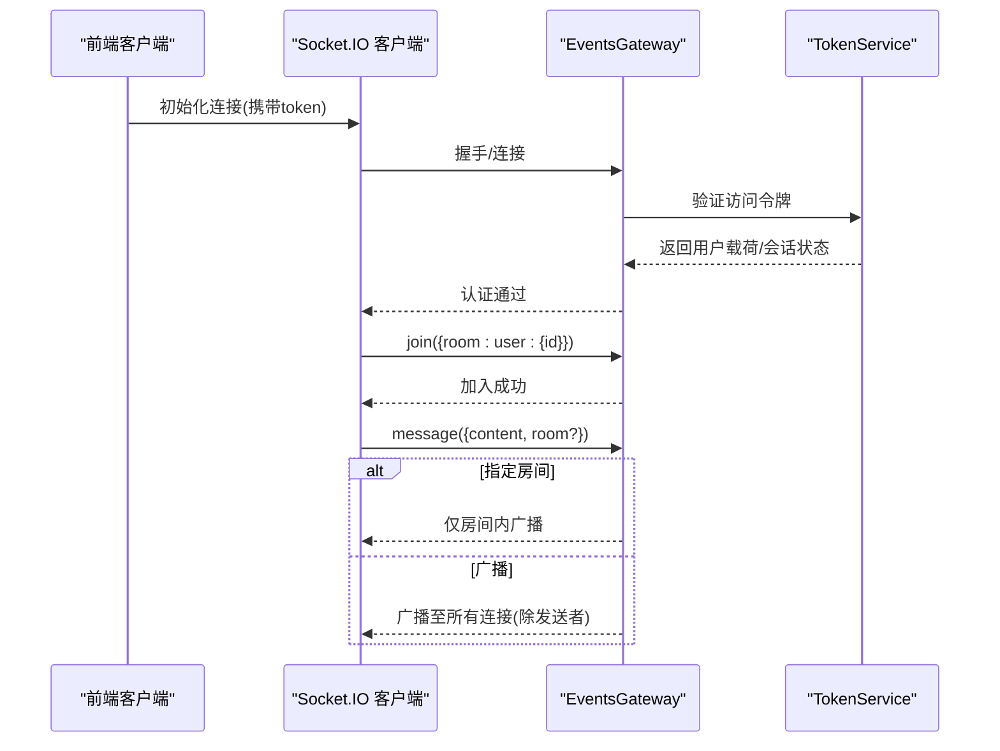
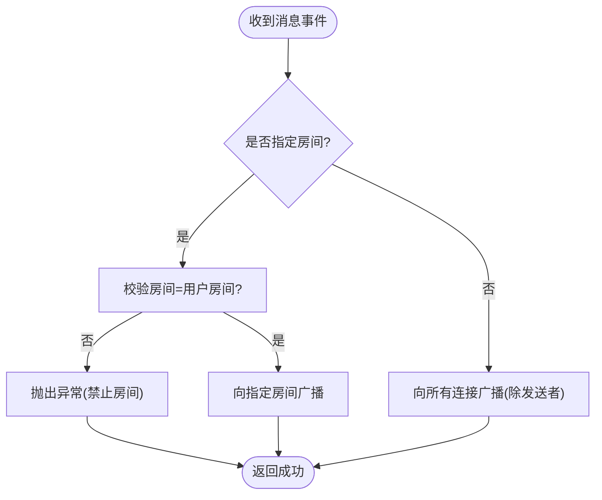
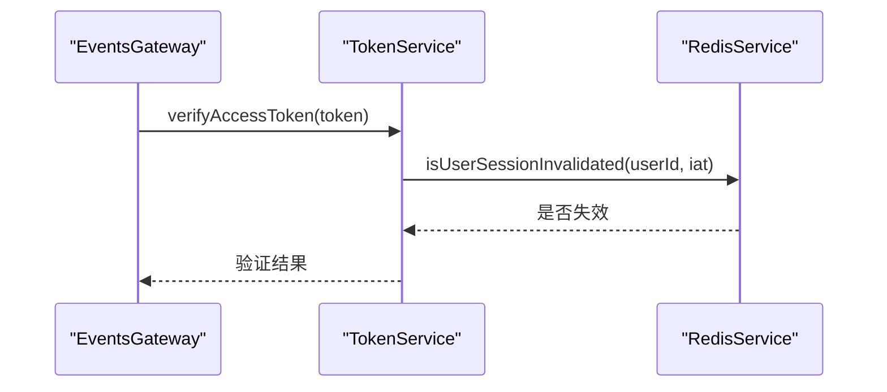
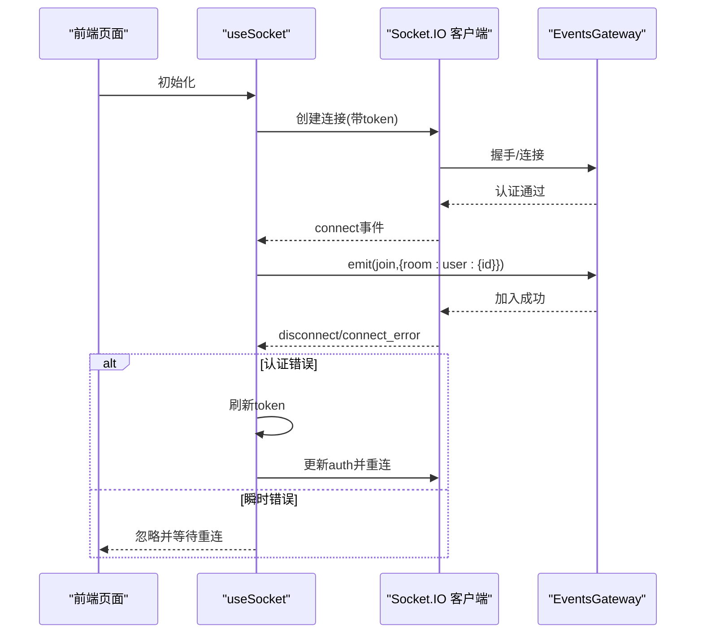
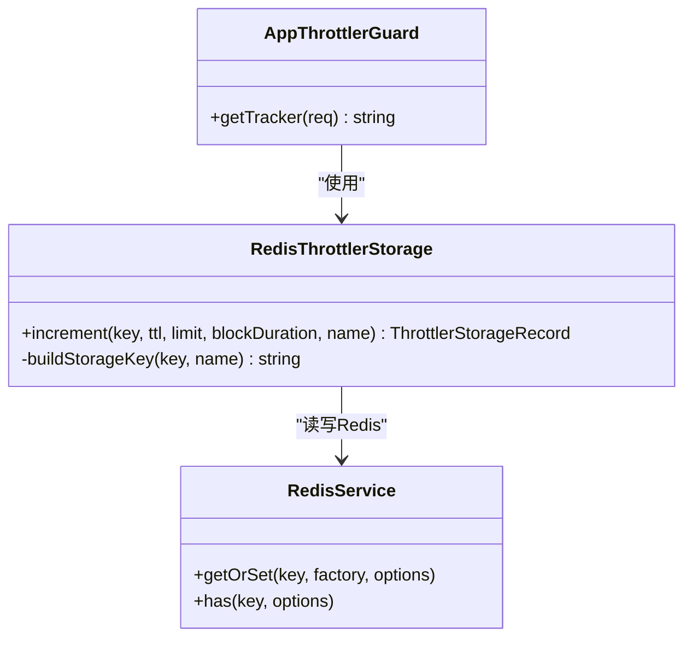
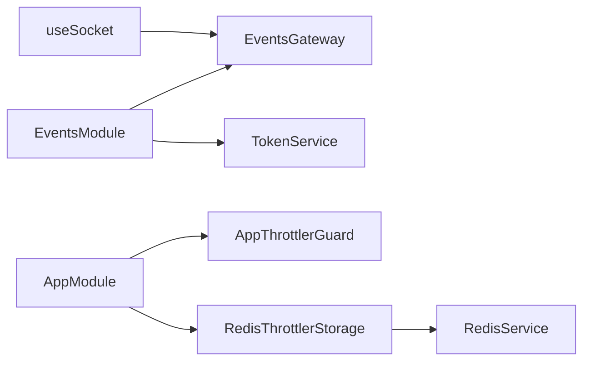

# WebSocket实时通信

<cite>
**本文引用的文件**
- [apps/backend/src/events/events.gateway.ts](file://apps/backend/src/events/events.gateway.ts)
- [apps/backend/src/events/events.module.ts](file://apps/backend/src/events/events.module.ts)
- [apps/backend/src/auth/token.service.ts](file://apps/backend/src/auth/token.service.ts)
- [apps/backend/src/app.module.ts](file://apps/backend/src/app.module.ts)
- [apps/backend/src/common/throttling/throttling.guard.ts](file://apps/backend/src/common/throttling/throttling.guard.ts)
- [apps/backend/src/common/throttling/redis-throttler.storage.ts](file://apps/backend/src/common/throttling/redis-throttler.storage.ts)
- [apps/backend/src/common/throttling/throttling.constants.ts](file://apps/backend/src/common/throttling/throttling.constants.ts)
- [apps/backend/src/redis/redis.service.ts](file://apps/backend/src/redis/redis.service.ts)
- [apps/frontend/src/composables/useSocket.ts](file://apps/frontend/src/composables/useSocket.ts)
- [apps/frontend/src/composables/useSocket.errors.ts](file://apps/frontend/src/composables/useSocket.errors.ts)
- [apps/backend/tests/events/events.gateway.spec.ts](file://apps/backend/tests/events/events.gateway.spec.ts)
</cite>

## 目录
1. [简介](#简介)
2. [项目结构](#项目结构)
3. [核心组件](#核心组件)
4. [架构总览](#架构总览)
5. [组件详解](#组件详解)
6. [依赖关系分析](#依赖关系分析)
7. [性能与可扩展性](#性能与可扩展性)
8. [故障排查指南](#故障排查指南)
9. [结论](#结论)
10. [附录：客户端使用示例](#附录客户端使用示例)

## 简介
本文件面向WebSocket实时通信模块，系统性阐述WebSocket网关的架构设计、连接管理、房间系统与消息广播机制；解释事件驱动的实时通信模式、消息序列化与反序列化、连接状态管理与断线重连策略；覆盖房间权限控制、用户身份验证、消息过滤与去重机制；并提供与Throttling守卫的集成实现、连接频率限制与防刷机制，以及错误处理策略、性能优化与大规模并发处理方案。

## 项目结构
WebSocket实时通信由后端网关与前端连接器协同完成：
- 后端
  - 事件网关：负责握手、鉴权、房间管理、广播与事件派发
  - 认证服务：JWT校验、会话失效检测、令牌黑名单
  - 速率限制：基于Redis的多窗口节流策略
  - Redis缓存：会话失效标记、速率限制键空间
- 前端
  - Socket连接器：自动连接、鉴权参数传递、房间加入、断线重连与错误分类

**图表来源**
- [apps/backend/src/events/events.gateway.ts:57-266](file://apps/backend/src/events/events.gateway.ts#L57-L266)
- [apps/backend/src/auth/token.service.ts:15-187](file://apps/backend/src/auth/token.service.ts#L15-L187)
- [apps/backend/src/common/throttling/redis-throttler.storage.ts:106-173](file://apps/backend/src/common/throttling/redis-throttler.storage.ts#L106-L173)
- [apps/backend/src/redis/redis.service.ts:61-200](file://apps/backend/src/redis/redis.service.ts#L61-L200)
- [apps/backend/src/app.module.ts:117-123](file://apps/backend/src/app.module.ts#L117-L123)
- [apps/frontend/src/composables/useSocket.ts:56-191](file://apps/frontend/src/composables/useSocket.ts#L56-L191)

**章节来源**
- [apps/backend/src/events/events.module.ts:1-15](file://apps/backend/src/events/events.module.ts#L1-L15)
- [apps/backend/src/app.module.ts:117-154](file://apps/backend/src/app.module.ts#L117-L154)

## 核心组件
- 事件网关（EventsGateway）
  - 负责CORS、传输协议、命名空间配置
  - 中间件进行JWT鉴权与会话有效性校验
  - 自动加入用户私有房间，支持房间加入/离开与消息广播
  - 提供服务内广播接口（向房间/全部）
- 认证服务（TokenService）
  - 生成/验证访问令牌，支持会话失效检测与令牌黑名单
- 速率限制（Throttling）
  - 全局守卫与Redis存储，支持短/中/长窗口限流与封禁
- Redis缓存（RedisService）
  - 统一键空间管理，支持会话失效标记与速率限制键空间

**章节来源**
- [apps/backend/src/events/events.gateway.ts:20-145](file://apps/backend/src/events/events.gateway.ts#L20-L145)
- [apps/backend/src/auth/token.service.ts:55-76](file://apps/backend/src/auth/token.service.ts#L55-L76)
- [apps/backend/src/common/throttling/throttling.guard.ts:28-34](file://apps/backend/src/common/throttling/throttling.guard.ts#L28-L34)
- [apps/backend/src/common/throttling/redis-throttler.storage.ts:106-173](file://apps/backend/src/common/throttling/redis-throttler.storage.ts#L106-L173)
- [apps/backend/src/redis/redis.service.ts:18-66](file://apps/backend/src/redis/redis.service.ts#L18-L66)

## 架构总览
WebSocket网关采用“事件驱动 + 房间隔离”的实时通信架构：
- 连接阶段：CORS白名单、传输协议选择、鉴权中间件
- 鉴权阶段：提取JWT，验证签名与类型，检查会话是否失效
- 进入阶段：自动加入用户私有房间，准备接收/发送消息
- 业务阶段：按需加入/离开房间，发送消息或广播
- 广播阶段：后端防抖，合并高频通知，仅对目标房间广播

**图表来源**
- [apps/backend/src/events/events.gateway.ts:86-175](file://apps/backend/src/events/events.gateway.ts#L86-L175)
- [apps/backend/src/auth/token.service.ts:115-125](file://apps/backend/src/auth/token.service.ts#L115-L125)

## 组件详解

### 事件网关（EventsGateway）
- CORS与传输
  - 支持多Origin白名单、凭证、显式允许头
  - 传输协议优先级：websocket优先，回退polling
- 鉴权中间件
  - 从握手参数或头部提取token，验证访问令牌有效性
  - 检查会话是否被标记为失效（Redis标记）
- 连接生命周期
  - 连接建立后自动加入用户私有房间
  - 断开连接记录日志
- 房间与广播
  - 房间权限：仅允许加入自身房间（user:{id}）
  - 消息广播：支持指定房间广播与全站广播（除发送者）
  - 后端防抖广播：同一用户在500ms内仅发出一次todos:sync广播
- 服务内广播
  - 对外暴露broadcastToRoom/broadcastToAll，供其他服务触发广播

**图表来源**
- [apps/backend/src/events/events.gateway.ts:150-175](file://apps/backend/src/events/events.gateway.ts#L150-L175)

**章节来源**
- [apps/backend/src/events/events.gateway.ts:20-145](file://apps/backend/src/events/events.gateway.ts#L20-L145)
- [apps/backend/src/events/events.gateway.ts:177-265](file://apps/backend/src/events/events.gateway.ts#L177-L265)

### 认证与会话控制（TokenService）
- 访问令牌验证：校验签名与类型(access)，并结合iat判断会话是否失效
- 会话失效检测：通过Redis记录用户最近失效时间戳，若token签发时间早于失效时间则拒绝
- 令牌黑名单：支持将即将过期的令牌加入黑名单，缩短攻击窗口

**图表来源**
- [apps/backend/src/events/events.gateway.ts:90-115](file://apps/backend/src/events/events.gateway.ts#L90-L115)
- [apps/backend/src/auth/token.service.ts:55-76](file://apps/backend/src/auth/token.service.ts#L55-L76)
- [apps/backend/src/redis/redis.service.ts:98-121](file://apps/backend/src/redis/redis.service.ts#L98-L121)

**章节来源**
- [apps/backend/src/auth/token.service.ts:55-76](file://apps/backend/src/auth/token.service.ts#L55-L76)

### 房间权限与消息广播
- 权限控制
  - ensureOwnRoomAccess：仅允许访问user:{id}房间
  - 测试覆盖：拒绝加入他人房间、允许加入自身房间
- 广播策略
  - 指定房间广播：仅房间内成员可见
  - 全站广播：除发送者外广播
  - 后端防抖：同一用户在500ms内合并广播，避免风暴

**章节来源**
- [apps/backend/src/events/events.gateway.ts:77-84](file://apps/backend/src/events/events.gateway.ts#L77-L84)
- [apps/backend/tests/events/events.gateway.spec.ts:37-58](file://apps/backend/tests/events/events.gateway.spec.ts#L37-L58)

### 前端连接与断线重连（useSocket）
- 连接初始化
  - 自动连接、携带凭证与token
  - 指定命名空间/events与socket.io路径
- 房间加入
  - 连接成功后自动加入user:{id}房间
- 断线重连
  - 配置重连次数与延迟，区分瞬时错误与认证错误
  - 认证错误时自动刷新token并重连
- 错误分类
  - 认证类错误关键词识别
  - 瞬时传输错误忽略并等待重连

**图表来源**
- [apps/frontend/src/composables/useSocket.ts:59-111](file://apps/frontend/src/composables/useSocket.ts#L59-L111)
- [apps/frontend/src/composables/useSocket.errors.ts:23-32](file://apps/frontend/src/composables/useSocket.errors.ts#L23-L32)

**章节来源**
- [apps/frontend/src/composables/useSocket.ts:56-191](file://apps/frontend/src/composables/useSocket.ts#L56-L191)
- [apps/frontend/src/composables/useSocket.errors.ts:1-33](file://apps/frontend/src/composables/useSocket.errors.ts#L1-L33)

### 与Throttling守卫的集成
- 全局守卫
  - AppThrottlerGuard：从请求中提取真实IP（考虑代理链），作为节流键
- Redis存储
  - RedisThrottlerStorage：使用Lua脚本原子计数、窗口清理、封禁逻辑
  - 失败回退：Redis不可用时降级到内存存储
- 配置策略
  - createGlobalThrottlerOptions：读取环境变量，构建短/中/长窗口
  - 预设策略：登录、注册、刷新、文件上传等场景的限流策略

**图表来源**
- [apps/backend/src/common/throttling/throttling.guard.ts:28-34](file://apps/backend/src/common/throttling/throttling.guard.ts#L28-L34)
- [apps/backend/src/common/throttling/redis-throttler.storage.ts:106-173](file://apps/backend/src/common/throttling/redis-throttler.storage.ts#L106-L173)
- [apps/backend/src/redis/redis.service.ts:159-174](file://apps/backend/src/redis/redis.service.ts#L159-L174)

**章节来源**
- [apps/backend/src/common/throttling/throttling.guard.ts:28-34](file://apps/backend/src/common/throttling/throttling.guard.ts#L28-L34)
- [apps/backend/src/common/throttling/redis-throttler.storage.ts:106-173](file://apps/backend/src/common/throttling/redis-throttler.storage.ts#L106-L173)
- [apps/backend/src/common/throttling/throttling.constants.ts:173-198](file://apps/backend/src/common/throttling/throttling.constants.ts#L173-L198)
- [apps/backend/src/app.module.ts:117-123](file://apps/backend/src/app.module.ts#L117-L123)

## 依赖关系分析
- 模块依赖
  - EventsModule导入AuthModule，EventsGateway依赖TokenService
  - AppModule启用ThrottlerModule并注入RedisService，全局注册AppThrottlerGuard
- 网关依赖
  - EventsGateway依赖TokenService进行JWT校验与会话失效检测
  - RedisService提供会话失效标记与速率限制键空间
- 前端依赖
  - useSocket依赖useAuthStore提供的token，自动传递至后端

**图表来源**
- [apps/backend/src/events/events.module.ts:9-14](file://apps/backend/src/events/events.module.ts#L9-L14)
- [apps/backend/src/events/events.gateway.ts:66-66](file://apps/backend/src/events/events.gateway.ts#L66-L66)
- [apps/backend/src/app.module.ts:117-154](file://apps/backend/src/app.module.ts#L117-L154)
- [apps/frontend/src/composables/useSocket.ts:56-191](file://apps/frontend/src/composables/useSocket.ts#L56-L191)

**章节来源**
- [apps/backend/src/events/events.module.ts:1-15](file://apps/backend/src/events/events.module.ts#L1-L15)
- [apps/backend/src/app.module.ts:117-154](file://apps/backend/src/app.module.ts#L117-L154)

## 性能与可扩展性
- 连接与传输
  - 优先websocket，回退polling，降低握手与首包延迟
  - 命名空间/events分离业务，减少无关广播
- 广播优化
  - 后端防抖：同一用户500ms内合并todos:sync广播，避免风暴
  - except排除发送者，减少重复投递
- 速率限制
  - 多窗口限流（短/中/长），Redis Lua原子计数，支持封禁
  - 失败回退到内存存储，保证稳定性
- Redis键空间
  - 会话失效标记与速率限制键统一前缀，便于运维与清理

**章节来源**
- [apps/backend/src/events/events.gateway.ts:180-202](file://apps/backend/src/events/events.gateway.ts#L180-L202)
- [apps/backend/src/common/throttling/redis-throttler.storage.ts:106-173](file://apps/backend/src/common/throttling/redis-throttler.storage.ts#L106-L173)
- [apps/backend/src/redis/redis.service.ts:18-66](file://apps/backend/src/redis/redis.service.ts#L18-L66)

## 故障排查指南
- 常见错误与定位
  - 认证失败：检查token是否有效、是否被标记为失效、是否在黑名单
  - 房间访问被拒：确认房间名是否为user:{当前用户id}
  - 广播无响应：确认是否在正确房间、是否被防抖合并
  - 断线重连：区分瞬时传输错误与认证错误，前者自动重连，后者需刷新token
- 前端日志与冷却
  - useSocket对意外错误进行指纹去重与冷却输出，避免刷屏
- 后端日志
  - 网关记录握手、连接、断开、房间加入/离开、广播等关键事件

**章节来源**
- [apps/backend/src/events/events.gateway.ts:86-145](file://apps/backend/src/events/events.gateway.ts#L86-L145)
- [apps/frontend/src/composables/useSocket.ts:32-51](file://apps/frontend/src/composables/useSocket.ts#L32-L51)
- [apps/frontend/src/composables/useSocket.errors.ts:23-32](file://apps/frontend/src/composables/useSocket.errors.ts#L23-L32)

## 结论
该WebSocket实时通信模块以事件网关为核心，结合JWT鉴权、Redis会话失效检测与多窗口限流，实现了安全、稳定且高性能的实时通信能力。房间权限控制与后端防抖广播进一步提升了系统的可控性与抗风暴能力。前端连接器提供了完善的断线重连与错误分类策略，配合后端的命名空间与传输优化，能够满足大规模并发场景下的可靠通信需求。

## 附录：客户端使用示例
以下示例展示如何在前端建立连接、加入房间、发送消息与接收通知。请参考以下文件中的具体实现位置：

- 建立连接与自动加入房间
  - 参考：[apps/frontend/src/composables/useSocket.ts:59-111](file://apps/frontend/src/composables/useSocket.ts#L59-L111)
- 发送消息
  - 参考：[apps/frontend/src/composables/useSocket.ts:113-120](file://apps/frontend/src/composables/useSocket.ts#L113-L120)
- 接收通知（todos:sync）
  - 参考：[apps/frontend/src/features/todo/stores/todo.cloud.listeners.ts:24-31](file://apps/frontend/src/features/todo/stores/todo.cloud.listeners.ts#L24-L31)