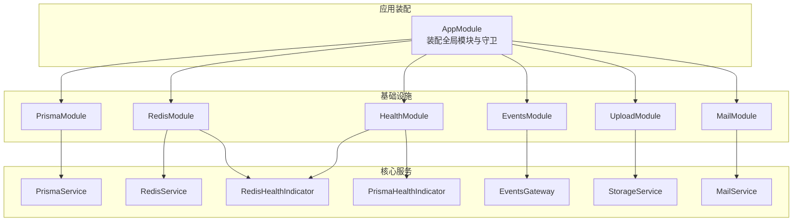
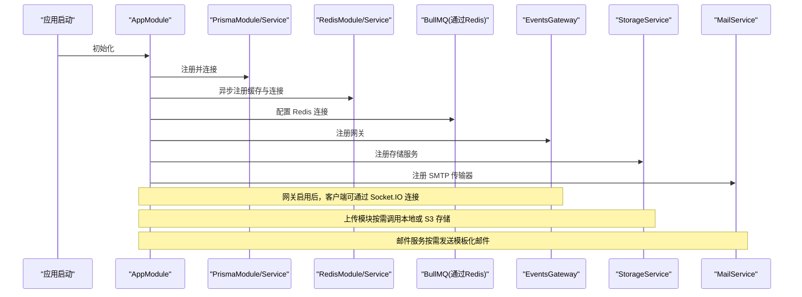
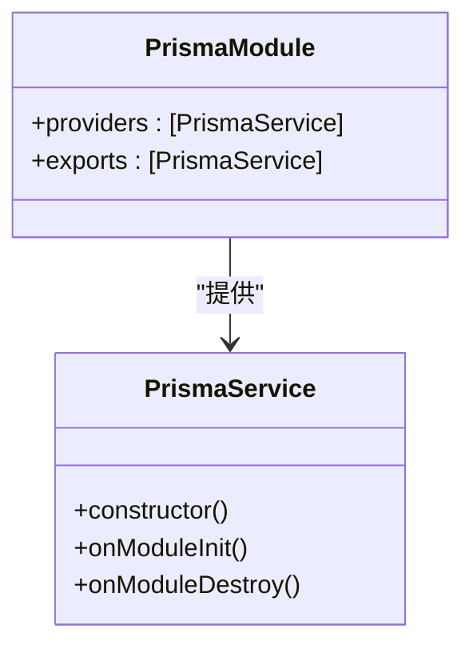
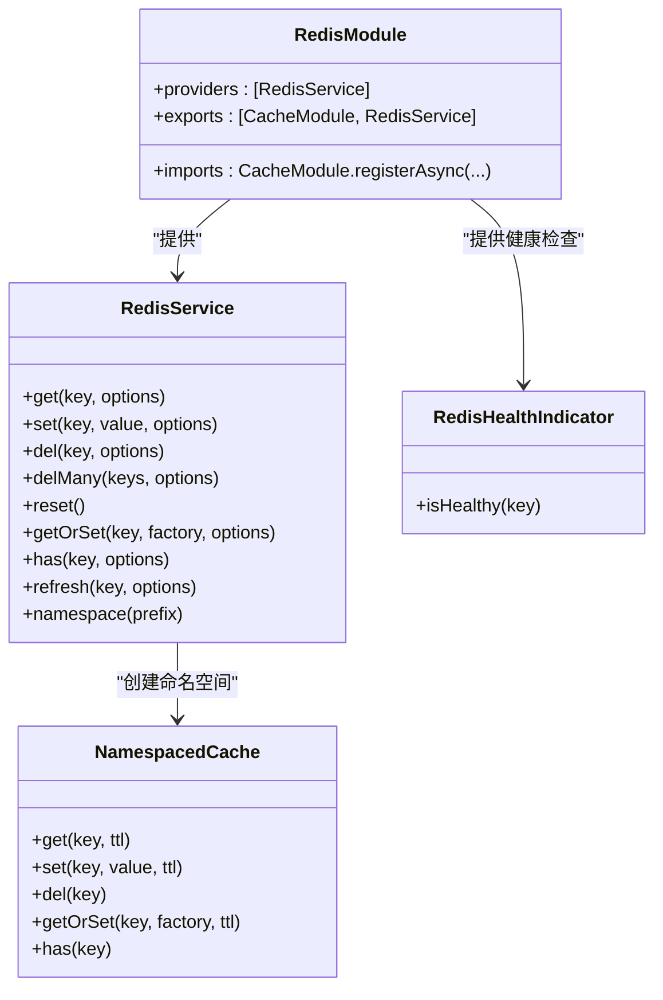
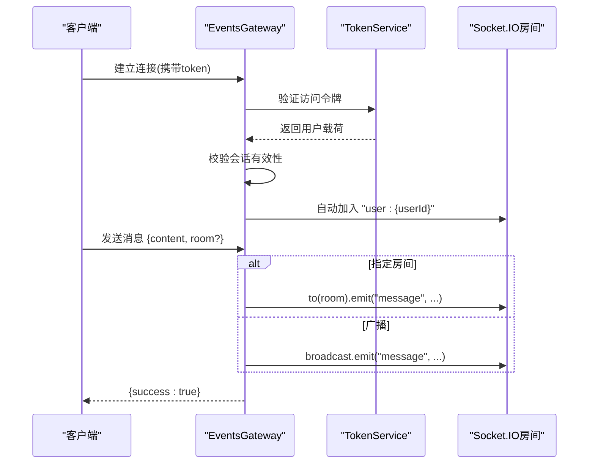
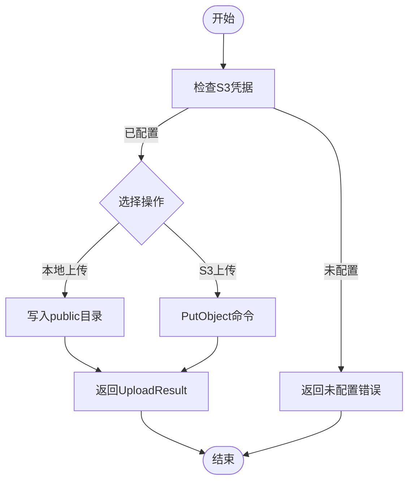
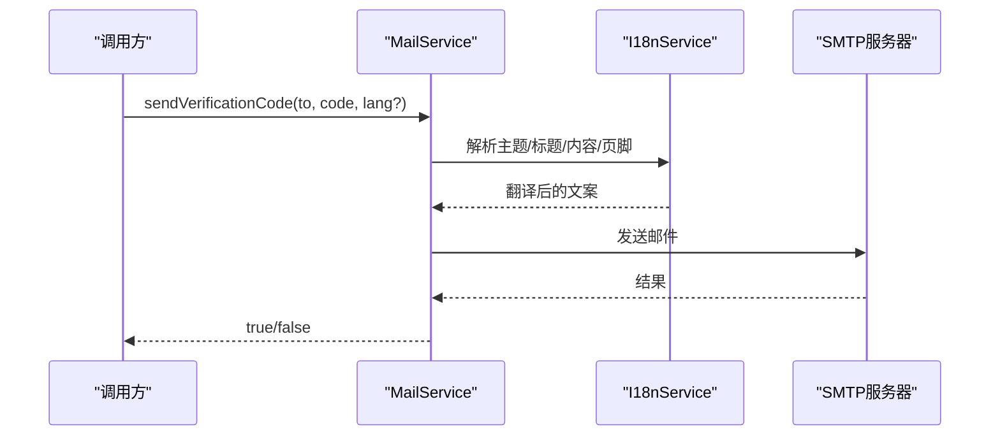
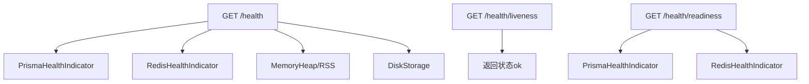
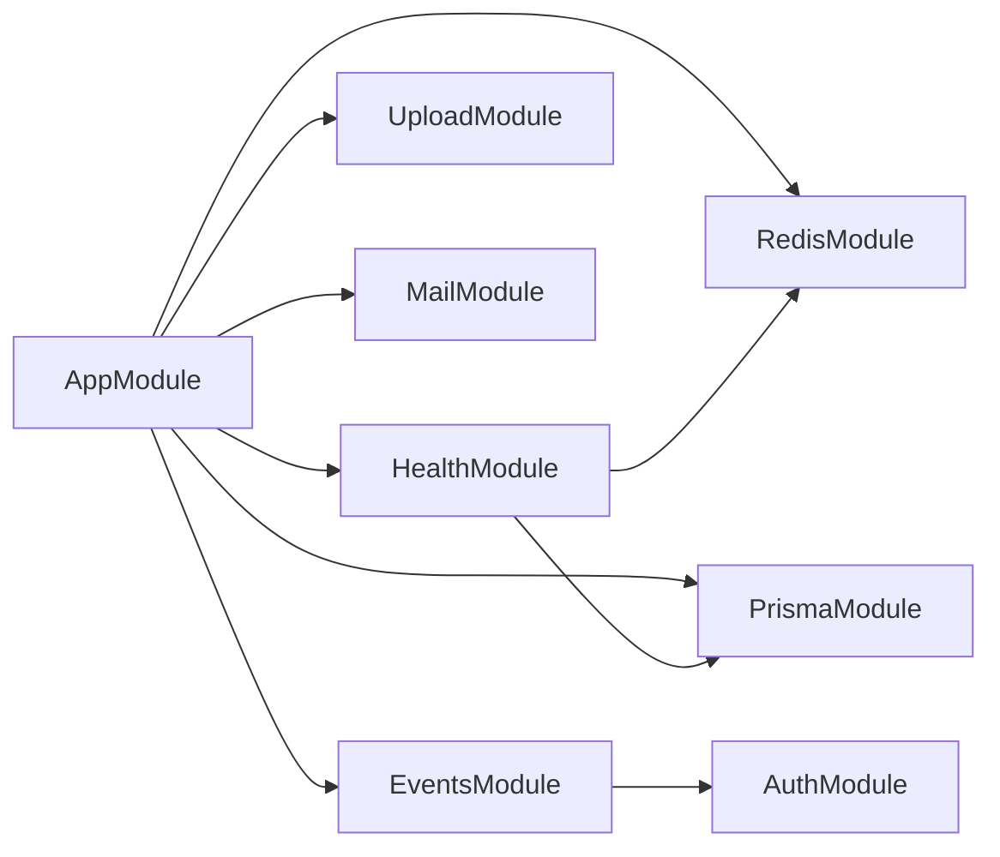

# 基础设施模块

<cite>
**本文引用的文件**
- [apps/backend/src/prisma/prisma.module.ts](file://apps/backend/src/prisma/prisma.module.ts)
- [apps/backend/src/prisma/prisma.service.ts](file://apps/backend/src/prisma/prisma.service.ts)
- [apps/backend/src/redis/redis.module.ts](file://apps/backend/src/redis/redis.module.ts)
- [apps/backend/src/redis/redis.service.ts](file://apps/backend/src/redis/redis.service.ts)
- [apps/backend/src/redis/cache.decorator.ts](file://apps/backend/src/redis/cache.decorator.ts)
- [apps/backend/src/redis/redis.health.ts](file://apps/backend/src/redis/redis.health.ts)
- [apps/backend/src/events/events.module.ts](file://apps/backend/src/events/events.module.ts)
- [apps/backend/src/events/events.gateway.ts](file://apps/backend/src/events/events.gateway.ts)
- [apps/backend/src/upload/upload.module.ts](file://apps/backend/src/upload/upload.module.ts)
- [apps/backend/src/upload/storage.service.ts](file://apps/backend/src/upload/storage.service.ts)
- [apps/backend/src/mail/mail.module.ts](file://apps/backend/src/mail/mail.module.ts)
- [apps/backend/src/mail/mail.service.ts](file://apps/backend/src/mail/mail.service.ts)
- [apps/backend/src/health/health.module.ts](file://apps/backend/src/health/health.module.ts)
- [apps/backend/src/health/health.controller.ts](file://apps/backend/src/health/health.controller.ts)
- [apps/backend/src/health/prisma.health.ts](file://apps/backend/src/health/prisma.health.ts)
- [apps/backend/src/app.module.ts](file://apps/backend/src/app.module.ts)
- [apps/backend/package.json](file://apps/backend/package.json)
</cite>

## 目录

1. [简介](#简介)
2. [项目结构](#项目结构)
3. [核心组件](#核心组件)
4. [架构总览](#架构总览)
5. [详细组件分析](#详细组件分析)
6. [依赖关系分析](#依赖关系分析)
7. [性能考量](#性能考量)
8. [故障排查指南](#故障排查指南)
9. [结论](#结论)
10. [附录](#附录)

## 简介

本文件系统性梳理 Lumina Todo 后端基础设施模块，覆盖以下方面：

- Prisma 模块：数据访问层设计、PostgreSQL 连接池与 PrismaPg 适配、生命周期管理与事务建议
- Redis 模块：缓存策略、命名空间与键前缀、TTL 管理、分布式锁思路、会话存储、健康检查
- 事件模块：WebSocket 网关、CORS 与认证、房间管理、消息广播、防抖广播
- 上传模块：本地与 S3 存储、签名 URL、批量上传、错误处理
- 邮件模块：SMTP 配置、模板化发送、国际化主题与内容
- 健康检查模块：数据库与 Redis 健康指示器、存活/就绪探针、阈值配置

## 项目结构

基础设施相关模块分布于后端应用的独立子模块中，并由根模块统一装配。下图展示与基础设施强相关的模块关系与依赖方向。

图表来源

- [apps/backend/src/app.module.ts:28-155](file://apps/backend/src/app.module.ts#L28-L155)
- [apps/backend/src/prisma/prisma.module.ts:1-10](file://apps/backend/src/prisma/prisma.module.ts#L1-L10)
- [apps/backend/src/redis/redis.module.ts:1-84](file://apps/backend/src/redis/redis.module.ts#L1-L84)
- [apps/backend/src/events/events.module.ts:1-15](file://apps/backend/src/events/events.module.ts#L1-L15)
- [apps/backend/src/upload/upload.module.ts:1-16](file://apps/backend/src/upload/upload.module.ts#L1-L16)
- [apps/backend/src/mail/mail.module.ts:1-37](file://apps/backend/src/mail/mail.module.ts#L1-L37)
- [apps/backend/src/health/health.module.ts:1-14](file://apps/backend/src/health/health.module.ts#L1-L14)

章节来源

- [apps/backend/src/app.module.ts:28-155](file://apps/backend/src/app.module.ts#L28-L155)

## 核心组件

- Prisma 数据访问层：基于 PrismaClient 与 PrismaPg 适配 PostgreSQL，提供连接池与生命周期管理
- Redis 缓存与会话：基于 cache-manager + ioredis，支持 TTL、命名空间、批量删除、刷新 TTL
- WebSocket 网关：Socket.IO 网关，CORS 白名单、鉴权中间件、房间管理、广播与防抖
- 文件上传：本地与 S3（含 OSS/MinIO）双栈，支持签名 URL、批量上传、错误降级
- 邮件服务：SMTP 配置、模板化发送、国际化主题与正文
- 健康检查：Terminus 集成，数据库与 Redis 健康指示器，存活/就绪探针

章节来源

- [apps/backend/src/prisma/prisma.service.ts:1-34](file://apps/backend/src/prisma/prisma.service.ts#L1-L34)
- [apps/backend/src/redis/redis.service.ts:1-255](file://apps/backend/src/redis/redis.service.ts#L1-L255)
- [apps/backend/src/events/events.gateway.ts:1-266](file://apps/backend/src/events/events.gateway.ts#L1-L266)
- [apps/backend/src/upload/storage.service.ts:1-216](file://apps/backend/src/upload/storage.service.ts#L1-L216)
- [apps/backend/src/mail/mail.service.ts:1-117](file://apps/backend/src/mail/mail.service.ts#L1-L117)
- [apps/backend/src/health/health.controller.ts:1-80](file://apps/backend/src/health/health.controller.ts#L1-L80)

## 架构总览

下图展示基础设施模块在运行时的关键交互：应用启动装配、模块初始化、服务间协作与外部依赖。

图表来源

- [apps/backend/src/app.module.ts:98-123](file://apps/backend/src/app.module.ts#L98-L123)
- [apps/backend/src/redis/redis.module.ts:28-78](file://apps/backend/src/redis/redis.module.ts#L28-L78)
- [apps/backend/src/events/events.gateway.ts:20-56](file://apps/backend/src/events/events.gateway.ts#L20-L56)
- [apps/backend/src/upload/storage.service.ts:45-69](file://apps/backend/src/upload/storage.service.ts#L45-L69)
- [apps/backend/src/mail/mail.module.ts:11-35](file://apps/backend/src/mail/mail.module.ts#L11-L35)

## 详细组件分析

### Prisma 模块

- 设计要点
  - 使用 PrismaPg 适配器与 pg 的连接池，实现原生连接复用与高性能
  - 在构造函数中解析 DATABASE_URL，创建连接池并注入 PrismaClient
  - 实现 OnModuleInit/OnModuleDestroy 生命周期钩子，确保连接与池的正确建立与释放
- 连接池管理
  - 通过 pg.Pool 管理连接，PrismaService 持有引用以便在销毁阶段关闭
- 事务处理机制
  - 代码未显式提供事务封装，建议在业务服务中使用 PrismaClient 的事务 API 进行多语句一致性控制
  - 可结合 NestJS 的拦截器或守卫在需要时开启事务作用域
- 配置与部署
  - 依赖 DATABASE_URL 环境变量；容器化部署时应确保该变量正确注入
- 性能与优化
  - 连接池大小与并发请求数相关，建议结合压测调整
  - 对热点查询配合 Redis 缓存，减少数据库压力
- 故障恢复
  - onModuleInit 失败会抛出异常；onModuleDestroy 确保连接池关闭，避免资源泄露

图表来源

- [apps/backend/src/prisma/prisma.module.ts:1-10](file://apps/backend/src/prisma/prisma.module.ts#L1-L10)
- [apps/backend/src/prisma/prisma.service.ts:6-34](file://apps/backend/src/prisma/prisma.service.ts#L6-L34)

章节来源

- [apps/backend/src/prisma/prisma.module.ts:1-10](file://apps/backend/src/prisma/prisma.module.ts#L1-L10)
- [apps/backend/src/prisma/prisma.service.ts:1-34](file://apps/backend/src/prisma/prisma.service.ts#L1-L34)

### Redis 模块

- 缓存策略
  - 基于 cache-manager + ioredis-yet，支持 TTL、键前缀、批量删除、刷新 TTL
  - 提供命名空间 NamespacedCache，自动为键添加前缀，便于隔离与清理
- 键前缀与 TTL
  - 内置 CachePrefix 枚举（用户、会话、认证、限流、配置、临时），可按场景选择
  - TTL 常量集中管理，默认 TTL 为 5 分钟，支持按方法传参覆盖
- 分布式锁与会话存储
  - 代码未直接实现分布式锁；可通过 SET key value NX EX ttl 的原子操作实现简单互斥
  - 会话存储可利用命名空间与 TTL 管理，结合 JWT 令牌校验
- 健康检查
  - RedisHealthIndicator 通过 set/get 测试连通性与读写一致性
- 配置项
  - REDIS_HOST、REDIS_PORT、REDIS_PASSWORD、REDIS_DB、REDIS_KEY_PREFIX、REDIS_DEFAULT_TTL（秒）
- 性能与优化
  - 合理设置 TTL，避免缓存雪崩；对热点键使用短 TTL 并配合 getOrSet 防穿透
  - 批量删除使用 Promise.all 并发执行
- 故障恢复
  - onModuleDestroy 主动关闭底层连接；连接工厂具备重试策略与日志

图表来源

- [apps/backend/src/redis/redis.module.ts:28-82](file://apps/backend/src/redis/redis.module.ts#L28-L82)
- [apps/backend/src/redis/redis.service.ts:61-224](file://apps/backend/src/redis/redis.service.ts#L61-L224)
- [apps/backend/src/redis/redis.health.ts:10-42](file://apps/backend/src/redis/redis.health.ts#L10-L42)

章节来源

- [apps/backend/src/redis/redis.module.ts:1-84](file://apps/backend/src/redis/redis.module.ts#L1-L84)
- [apps/backend/src/redis/redis.service.ts:1-255](file://apps/backend/src/redis/redis.service.ts#L1-L255)
- [apps/backend/src/redis/redis.health.ts:1-43](file://apps/backend/src/redis/redis.health.ts#L1-L43)
- [apps/backend/src/redis/cache.decorator.ts:1-88](file://apps/backend/src/redis/cache.decorator.ts#L1-L88)

### 事件模块（WebSocket 网关）

- 网关设计
  - 基于 Socket.IO，启用 polling 与 websocket 传输，支持 CORS 白名单与凭证
  - 认证中间件从握手头部或 auth 字段提取令牌，验证后绑定用户信息
- 房间管理
  - 自动加入用户专属房间 user:{userId}，支持 join/leave 事件
  - 严格校验房间归属，防止越权访问
- 消息广播机制
  - message 事件支持向指定房间或广播给所有客户端（除发送者）
  - 广播同步通知采用 500ms 防抖，避免频繁广播导致风暴
- 生命周期与清理
  - OnGatewayInit 注册认证中间件；OnModuleDestroy 清理定时器，避免内存泄漏

图表来源

- [apps/backend/src/events/events.gateway.ts:86-141](file://apps/backend/src/events/events.gateway.ts#L86-L141)
- [apps/backend/src/events/events.gateway.ts:150-175](file://apps/backend/src/events/events.gateway.ts#L150-L175)
- [apps/backend/src/events/events.gateway.ts:177-202](file://apps/backend/src/events/events.gateway.ts#L177-L202)
- [apps/backend/src/events/events.gateway.ts:207-250](file://apps/backend/src/events/events.gateway.ts#L207-L250)

章节来源

- [apps/backend/src/events/events.module.ts:1-15](file://apps/backend/src/events/events.module.ts#L1-L15)
- [apps/backend/src/events/events.gateway.ts:1-266](file://apps/backend/src/events/events.gateway.ts#L1-L266)

### 上传模块

- 存储策略
  - 本地存储：写入 public 目录，返回 /api/public/{key}
  - S3/兼容存储：AWS S3、OSS、MinIO；支持自定义 endpoint
- 安全验证
  - 未在代码中发现专用的文件类型白名单/黑名单校验；建议在业务层增加 MIME/扩展名校验
- 云存储集成
  - 通过 S3_ACCESS_KEY_ID、S3_SECRET_ACCESS_KEY、S3_BUCKET、S3_REGION、S3_ENDPOINT 配置
  - 未配置时，上传/删除/签名 URL 接口返回“未配置”错误
- 文件操作
  - upload/uploadMany：上传文件并返回 key/url/bucket/size/mimetype
  - delete/deleteLocal：删除对象或本地文件
  - getSignedUrl：生成带过期时间的预签名 URL
- 错误处理
  - 目录创建失败、文件写入失败抛出 ServiceUnavailable 异常
  - 未配置存储时抛出“存储未配置”异常

图表来源

- [apps/backend/src/upload/storage.service.ts:45-69](file://apps/backend/src/upload/storage.service.ts#L45-L69)
- [apps/backend/src/upload/storage.service.ts:115-139](file://apps/backend/src/upload/storage.service.ts#L115-L139)
- [apps/backend/src/upload/storage.service.ts:144-146](file://apps/backend/src/upload/storage.service.ts#L144-L146)
- [apps/backend/src/upload/storage.service.ts:208-214](file://apps/backend/src/upload/storage.service.ts#L208-L214)

章节来源

- [apps/backend/src/upload/upload.module.ts:1-16](file://apps/backend/src/upload/upload.module.ts#L1-L16)
- [apps/backend/src/upload/storage.service.ts:1-216](file://apps/backend/src/upload/storage.service.ts#L1-L216)

### 邮件模块

- 配置与传输
  - 通过 MAIL_HOST、MAIL_PORT、MAIL_USER、MAIL_PASSWORD、MAIL_SECURE、MAIL_FROM 配置 SMTP
  - 使用 nodemailer 创建传输器实例
- 模板管理与发送
  - send：通用发送接口，支持 text/html
  - sendVerificationCode/sendPasswordReset：基于 i18n 的模板化发送，自动获取当前语言
- 国际化
  - 通过 i18n 服务与语言解析器，支持 x-lang 请求头与 Accept-Language
- 错误处理
  - 发送失败记录错误日志并返回 false，便于上层判断

图表来源

- [apps/backend/src/mail/mail.module.ts:11-35](file://apps/backend/src/mail/mail.module.ts#L11-L35)
- [apps/backend/src/mail/mail.service.ts:65-86](file://apps/backend/src/mail/mail.service.ts#L65-L86)
- [apps/backend/src/mail/mail.service.ts:91-115](file://apps/backend/src/mail/mail.service.ts#L91-L115)

章节来源

- [apps/backend/src/mail/mail.module.ts:1-37](file://apps/backend/src/mail/mail.module.ts#L1-L37)
- [apps/backend/src/mail/mail.service.ts:1-117](file://apps/backend/src/mail/mail.service.ts#L1-L117)

### 健康检查模块

- 综合健康检查
  - 数据库：PrismaHealthIndicator 执行 SELECT 1
  - Redis：RedisHealthIndicator 执行 set/get 测试
  - 内存：heap 与 rss 阈值检查
  - 磁盘：阈值百分比检查
- 存活/就绪探针
  - liveness：返回基本存活信息
  - readiness：仅检查数据库与 Redis
- 配置与扩展
  - 可在 HealthCheckService 中追加更多健康指示器

图表来源

- [apps/backend/src/health/health.controller.ts:34-78](file://apps/backend/src/health/health.controller.ts#L34-L78)
- [apps/backend/src/health/prisma.health.ts:19-30](file://apps/backend/src/health/prisma.health.ts#L19-L30)
- [apps/backend/src/redis/redis.health.ts:20-41](file://apps/backend/src/redis/redis.health.ts#L20-L41)

章节来源

- [apps/backend/src/health/health.module.ts:1-14](file://apps/backend/src/health/health.module.ts#L1-L14)
- [apps/backend/src/health/health.controller.ts:1-80](file://apps/backend/src/health/health.controller.ts#L1-L80)
- [apps/backend/src/health/prisma.health.ts:1-32](file://apps/backend/src/health/prisma.health.ts#L1-L32)
- [apps/backend/src/redis/redis.health.ts:1-43](file://apps/backend/src/redis/redis.health.ts#L1-L43)

## 依赖关系分析

- 模块耦合
  - AppModule 统一装配 Redis、BullMQ、I18n、Throttler 等基础设施
  - EventsModule 依赖 AuthModule 进行网关认证
  - HealthModule 依赖 PrismaModule 与 RedisModule
- 外部依赖
  - PostgreSQL 通过 pg 与 PrismaPg 适配
  - Redis 通过 ioredis 与 cache-manager
  - S3 通过 @aws-sdk/client-s3
  - SMTP 通过 nodemailer
- 潜在循环依赖
  - 当前模块间无明显循环导入；注意在业务模块中避免反向依赖网关/存储服务

图表来源

- [apps/backend/src/app.module.ts:134-145](file://apps/backend/src/app.module.ts#L134-L145)
- [apps/backend/src/events/events.module.ts:3](file://apps/backend/src/events/events.module.ts#L3)
- [apps/backend/src/health/health.module.ts:3-6](file://apps/backend/src/health/health.module.ts#L3-L6)

章节来源

- [apps/backend/src/app.module.ts:1-160](file://apps/backend/src/app.module.ts#L1-L160)

## 性能考量

- 数据库
  - 使用 PrismaPg + pg.Pool 提升连接复用效率；建议结合连接池大小与并发压测调优
  - 对高频查询配合 Redis 缓存，降低数据库负载
- 缓存
  - 合理设置 TTL，避免缓存雪崩；热点键使用短 TTL 并配合 getOrSet
  - 批量删除使用并发 Promise.all
- WebSocket
  - 广播同步通知 500ms 防抖，避免风暴；可按业务场景进一步限速
- 上传
  - 本地上传写入 public 目录，建议在网关层限制访问范围与大小
  - S3 上传建议启用压缩与分片（如需），并合理设置过期时间
- 邮件
  - 模板化发送减少重复构建；对失败重试与退避策略进行监控
- 健康检查
  - 综合健康检查包含数据库、Redis、内存与磁盘，建议在生产环境适当放宽阈值

## 故障排查指南

- Prisma
  - 症状：启动时报 DATABASE_URL 未定义或连接失败
  - 处理：确认环境变量注入；检查数据库可达性与凭据
- Redis
  - 症状：连接失败、重试过多、无法关闭连接
  - 处理：检查 REDIS\_\* 配置；查看日志中的重试警告；确保 onModuleDestroy 被调用
- WebSocket
  - 症状：CORS 拒绝、认证失败、房间越权
  - 处理：核对 CORS_ORIGIN；确认令牌有效且未失效；检查房间命名规则 user:{userId}
- 上传
  - 症状：目录创建失败、文件写入失败、存储未配置
  - 处理：检查权限与磁盘空间；配置 S3 凭据；确认 endpoint 与 region
- 邮件
  - 症状：发送失败、主题/内容为空
  - 处理：检查 SMTP 配置；确认 i18n 语言解析；查看错误日志
- 健康检查
  - 症状：/health 返回失败
  - 处理：分别检查数据库与 Redis 健康指示器；调整阈值或修复依赖

章节来源

- [apps/backend/src/prisma/prisma.service.ts:13-15](file://apps/backend/src/prisma/prisma.service.ts#L13-L15)
- [apps/backend/src/redis/redis.module.ts:56-64](file://apps/backend/src/redis/redis.module.ts#L56-L64)
- [apps/backend/src/events/events.gateway.ts:21-50](file://apps/backend/src/events/events.gateway.ts#L21-L50)
- [apps/backend/src/upload/storage.service.ts:84-101](file://apps/backend/src/upload/storage.service.ts#L84-L101)
- [apps/backend/src/mail/mail.service.ts:55-59](file://apps/backend/src/mail/mail.service.ts#L55-L59)
- [apps/backend/src/health/health.controller.ts:38-53](file://apps/backend/src/health/health.controller.ts#L38-L53)

## 结论

本基础设施模块以模块化方式提供了稳定、可扩展的基础能力：

- 数据访问层通过 PrismaPg 与连接池实现高可靠与高性能
- Redis 提供灵活的缓存与会话能力，并内置健康检查
- WebSocket 网关具备完善的认证、房间与广播机制
- 上传模块支持本地与 S3 双栈，具备签名 URL 能力
- 邮件模块集成 SMTP 与国际化模板
- 健康检查覆盖关键依赖，便于运维监控与告警

建议在生产环境中结合压测与监控持续优化连接池、缓存策略与广播频率，并完善文件类型校验与分布式锁实现。

## 附录

- 关键配置项（节选）
  - 数据库：DATABASE_URL
  - Redis：REDIS_HOST、REDIS_PORT、REDIS_PASSWORD、REDIS_DB、REDIS_KEY_PREFIX、REDIS_DEFAULT_TTL
  - 上传：S3_ACCESS_KEY_ID、S3_SECRET_ACCESS_KEY、S3_BUCKET、S3_REGION、S3_ENDPOINT
  - 邮件：MAIL_HOST、MAIL_PORT、MAIL_USER、MAIL_PASSWORD、MAIL_SECURE、MAIL_FROM
  - WebSocket：CORS_ORIGIN（逗号分隔）、transports（polling/websocket）

章节来源

- [apps/backend/src/prisma/prisma.service.ts:11](file://apps/backend/src/prisma/prisma.service.ts#L11)
- [apps/backend/src/redis/redis.module.ts:34-41](file://apps/backend/src/redis/redis.module.ts#L34-L41)
- [apps/backend/src/upload/storage.service.ts:46-51](file://apps/backend/src/upload/storage.service.ts#L46-L51)
- [apps/backend/src/mail/mail.module.ts:16-27](file://apps/backend/src/mail/mail.module.ts#L16-L27)
- [apps/backend/src/events/events.gateway.ts:26-50](file://apps/backend/src/events/events.gateway.ts#L26-L50)
