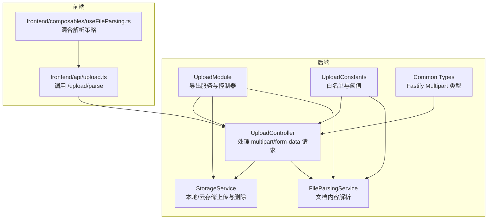
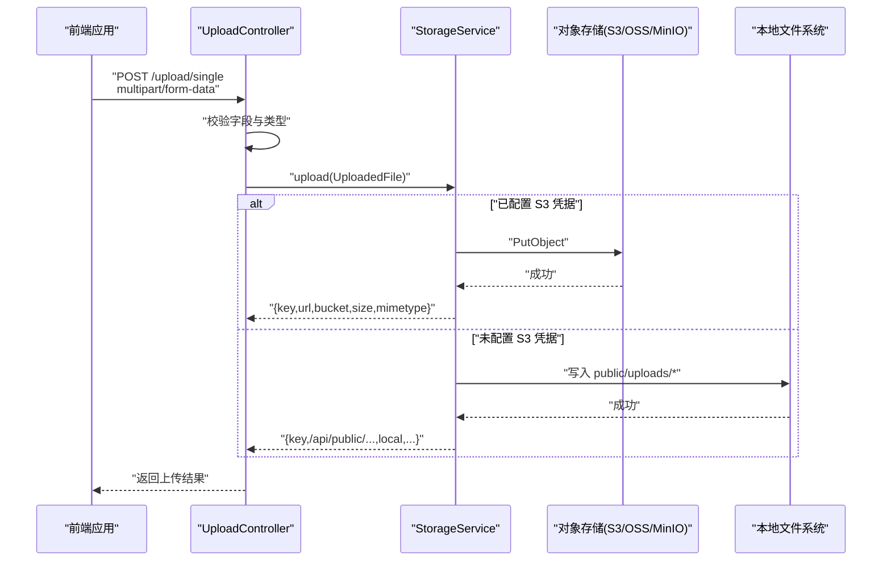
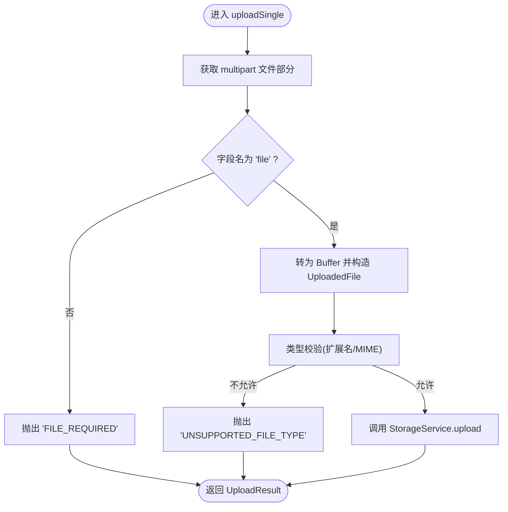
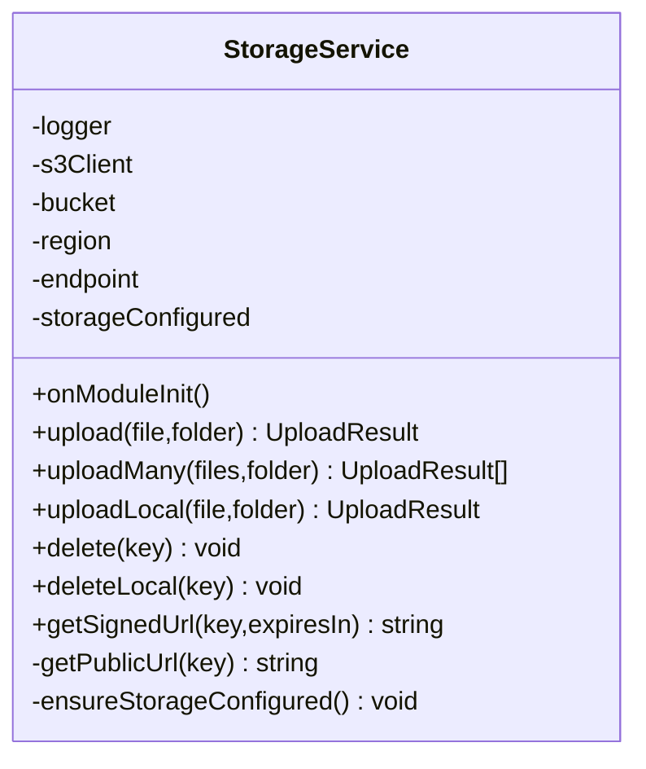
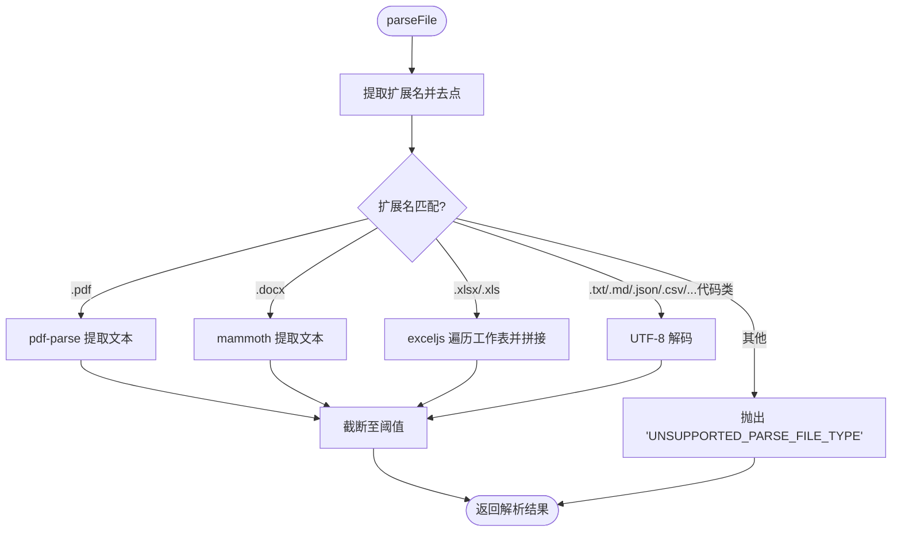
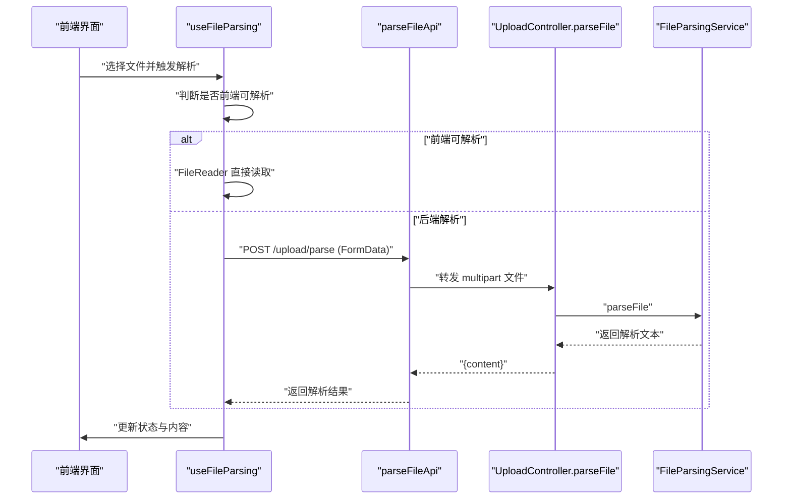
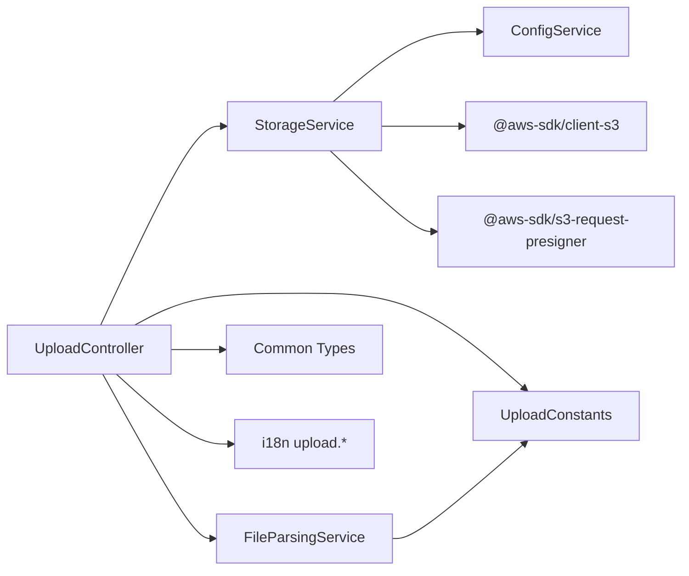

# 文件上传与存储

<cite>
**本文引用的文件**
- [apps/backend/src/upload/upload.controller.ts](file://apps/backend/src/upload/upload.controller.ts)
- [apps/backend/src/upload/storage.service.ts](file://apps/backend/src/upload/storage.service.ts)
- [apps/backend/src/upload/file-parsing.service.ts](file://apps/backend/src/upload/file-parsing.service.ts)
- [apps/backend/src/upload/upload.module.ts](file://apps/backend/src/upload/upload.module.ts)
- [apps/backend/src/upload/upload.constants.ts](file://apps/backend/src/upload/upload.constants.ts)
- [apps/backend/src/common/types.ts](file://apps/backend/src/common/types.ts)
- [apps/backend/src/i18n/en-US/upload.ts](file://apps/backend/src/i18n/en-US/upload.ts)
- [apps/backend/src/i18n/zh-CN/upload.ts](file://apps/backend/src/i18n/zh-CN/upload.ts)
- [apps/frontend/src/api/upload.ts](file://apps/frontend/src/api/upload.ts)
- [apps/frontend/src/composables/useFileParsing.ts](file://apps/frontend/src/composables/useFileParsing.ts)
- [apps/backend/tests/upload/upload.controller.spec.ts](file://apps/backend/tests/upload/upload.controller.spec.ts)
- [apps/backend/tests/upload/storage.service.spec.ts](file://apps/backend/tests/upload/storage.service.spec.ts)
- [apps/backend/tests/upload/file-parsing.service.spec.ts](file://apps/backend/tests/upload/file-parsing.service.spec.ts)
</cite>

## 目录
1. [简介](#简介)
2. [项目结构](#项目结构)
3. [核心组件](#核心组件)
4. [架构总览](#架构总览)
5. [详细组件分析](#详细组件分析)
6. [依赖关系分析](#依赖关系分析)
7. [性能考量](#性能考量)
8. [故障排查指南](#故障排查指南)
9. [结论](#结论)
10. [附录](#附录)

## 简介
本文件上传与存储模块提供完整的文件上传、类型校验、内容解析与存储能力，支持本地存储与云存储（AWS S3 及兼容 S3 的对象存储）。模块包含以下关键能力：
- 安全验证：基于白名单的 MIME 类型与扩展名检查，拒绝不受支持的文件类型。
- 存储策略：优先使用云存储；若未配置凭据则回退至本地存储，并提供统一接口。
- 内容解析：对 PDF、DOCX、XLS/XLSX 等复杂文档进行文本抽取；对纯文本/代码类文件进行前端直读或后端解析。
- 错误处理与国际化：统一的错误码与多语言提示，便于前端展示与用户理解。
- 集成与扩展：通过配置项灵活接入 AWS S3、OSS、MinIO 等对象存储；支持预签名 URL 与公开访问 URL。

## 项目结构
后端采用 NestJS 模块化组织，文件上传相关代码集中在 apps/backend/src/upload 目录，前端通过 API 与 Composable 与后端交互。

图表来源
- [apps/backend/src/upload/upload.controller.ts:1-161](file://apps/backend/src/upload/upload.controller.ts#L1-L161)
- [apps/backend/src/upload/storage.service.ts:1-216](file://apps/backend/src/upload/storage.service.ts#L1-L216)
- [apps/backend/src/upload/file-parsing.service.ts:1-142](file://apps/backend/src/upload/file-parsing.service.ts#L1-L142)
- [apps/backend/src/upload/upload.module.ts:1-16](file://apps/backend/src/upload/upload.module.ts#L1-L16)
- [apps/backend/src/upload/upload.constants.ts:1-66](file://apps/backend/src/upload/upload.constants.ts#L1-L66)
- [apps/backend/src/common/types.ts:1-16](file://apps/backend/src/common/types.ts#L1-L16)
- [apps/frontend/src/api/upload.ts:1-23](file://apps/frontend/src/api/upload.ts#L1-L23)
- [apps/frontend/src/composables/useFileParsing.ts:1-122](file://apps/frontend/src/composables/useFileParsing.ts#L1-L122)

章节来源
- [apps/backend/src/upload/upload.module.ts:1-16](file://apps/backend/src/upload/upload.module.ts#L1-L16)
- [apps/backend/src/upload/upload.controller.ts:1-161](file://apps/backend/src/upload/upload.controller.ts#L1-L161)
- [apps/backend/src/upload/storage.service.ts:1-216](file://apps/backend/src/upload/storage.service.ts#L1-L216)
- [apps/backend/src/upload/file-parsing.service.ts:1-142](file://apps/backend/src/upload/file-parsing.service.ts#L1-L142)
- [apps/backend/src/upload/upload.constants.ts:1-66](file://apps/backend/src/upload/upload.constants.ts#L1-L66)
- [apps/backend/src/common/types.ts:1-16](file://apps/backend/src/common/types.ts#L1-L16)
- [apps/frontend/src/api/upload.ts:1-23](file://apps/frontend/src/api/upload.ts#L1-L23)
- [apps/frontend/src/composables/useFileParsing.ts:1-122](file://apps/frontend/src/composables/useFileParsing.ts#L1-L122)

## 核心组件
- UploadController：接收 multipart/form-data，执行文件类型校验，调用存储服务完成上传/批量上传/删除，或调用解析服务进行内容提取。
- StorageService：封装本地与云存储上传、删除、URL 生成；根据配置自动选择 S3 或本地存储；支持预签名 URL。
- FileParsingService：按扩展名分派解析器，支持 PDF、DOCX、XLS/XLSX 以及多种文本/代码扩展名；对超长内容进行截断。
- UploadModule：聚合导出控制器与服务，供业务模块按需注入。
- UploadConstants：集中维护允许的 MIME 类型、扩展名、可解析文本扩展名与最大解析字符数。
- Common Types：定义 Fastify 的 multipart 文件类型，保证控制器与服务层类型安全。
- 国际化：提供英文与中文的上传相关错误消息，便于统一提示。

章节来源
- [apps/backend/src/upload/upload.controller.ts:1-161](file://apps/backend/src/upload/upload.controller.ts#L1-L161)
- [apps/backend/src/upload/storage.service.ts:1-216](file://apps/backend/src/upload/storage.service.ts#L1-L216)
- [apps/backend/src/upload/file-parsing.service.ts:1-142](file://apps/backend/src/upload/file-parsing.service.ts#L1-L142)
- [apps/backend/src/upload/upload.module.ts:1-16](file://apps/backend/src/upload/upload.module.ts#L1-L16)
- [apps/backend/src/upload/upload.constants.ts:1-66](file://apps/backend/src/upload/upload.constants.ts#L1-L66)
- [apps/backend/src/common/types.ts:1-16](file://apps/backend/src/common/types.ts#L1-L16)
- [apps/backend/src/i18n/en-US/upload.ts:1-10](file://apps/backend/src/i18n/en-US/upload.ts#L1-L10)
- [apps/backend/src/i18n/zh-CN/upload.ts:1-10](file://apps/backend/src/i18n/zh-CN/upload.ts#L1-L10)

## 架构总览
下图展示了从浏览器到后端控制器、存储服务与对象存储的整体流程。

图表来源
- [apps/backend/src/upload/upload.controller.ts:67-90](file://apps/backend/src/upload/upload.controller.ts#L67-L90)
- [apps/backend/src/upload/storage.service.ts:115-139](file://apps/backend/src/upload/storage.service.ts#L115-L139)
- [apps/backend/src/upload/storage.service.ts:74-111](file://apps/backend/src/upload/storage.service.ts#L74-L111)

## 详细组件分析

### UploadController：请求处理与安全校验
- 处理单文件上传：接收 multipart/form-data，提取文件部分，转换为内部 UploadedFile 结构，执行类型校验后交由存储服务。
- 处理多文件上传：遍历 files() 迭代器，限制最多 10 个（由前端约束），统一校验与上传。
- 文件解析：对指定文件进行内容解析，返回文本摘要，不保存文件。
- 删除文件：根据 key 删除对象存储或本地文件。
- 安全校验：基于白名单 MIME 类型与扩展名，拒绝不受支持类型；缺失文件字段时抛出明确错误。

图表来源
- [apps/backend/src/upload/upload.controller.ts:82-90](file://apps/backend/src/upload/upload.controller.ts#L82-L90)
- [apps/backend/src/upload/upload.controller.ts:35-65](file://apps/backend/src/upload/upload.controller.ts#L35-L65)

章节来源
- [apps/backend/src/upload/upload.controller.ts:1-161](file://apps/backend/src/upload/upload.controller.ts#L1-L161)
- [apps/backend/src/common/types.ts:1-16](file://apps/backend/src/common/types.ts#L1-L16)
- [apps/backend/src/i18n/en-US/upload.ts:1-10](file://apps/backend/src/i18n/en-US/upload.ts#L1-L10)
- [apps/backend/src/i18n/zh-CN/upload.ts:1-10](file://apps/backend/src/i18n/zh-CN/upload.ts#L1-L10)

### StorageService：本地与云存储抽象
- 初始化：读取 S3_REGION、S3_BUCKET、S3_ENDPOINT、S3_ACCESS_KEY_ID、S3_SECRET_ACCESS_KEY；若凭据齐全则初始化 S3Client，否则标记未配置。
- 上传：
  - 云存储：生成随机 UUID 作为文件名，使用 PutObject 写入；返回 key、公开 URL、bucket、size、mimetype。
  - 本地存储：写入 apps/backend/public/{folder}/ 下，返回 /api/public/{key} 形式的 URL。
- 批量上传：并发执行所有文件上传。
- 删除：
  - 云存储：DeleteObject。
  - 本地存储：删除对应物理文件。
- URL 生成：支持公开 URL 与预签名 URL；当配置了 endpoint 时适配 OSS/MinIO 格式。
- 异常处理：未配置存储时统一抛出“STORAGE_NOT_CONFIGURED”。

图表来源
- [apps/backend/src/upload/storage.service.ts:34-215](file://apps/backend/src/upload/storage.service.ts#L34-L215)

章节来源
- [apps/backend/src/upload/storage.service.ts:1-216](file://apps/backend/src/upload/storage.service.ts#L1-L216)

### FileParsingService：文档内容解析
- 解析策略：
  - PDF：使用 pdf-parse 提取文本。
  - DOCX：使用 mammoth 提取纯文本。
  - XLS/XLSX：使用 exceljs 加载工作簿，遍历所有工作表，拼接单元格为 CSV 风格文本。
  - 文本/代码：直接按 UTF-8 解码。
- 错误处理：捕获解析异常并转换为统一的 BadRequestException；保留已知上传前缀的错误消息，其他异常统一为“FILE_PARSING_FAILED”。
- 截断策略：超过 MAX_PARSED_CONTENT_CHARS 的内容会被截断并在末尾添加省略号标识。

图表来源
- [apps/backend/src/upload/file-parsing.service.ts:16-72](file://apps/backend/src/upload/file-parsing.service.ts#L16-L72)
- [apps/backend/src/upload/upload.constants.ts:45-66](file://apps/backend/src/upload/upload.constants.ts#L45-L66)

章节来源
- [apps/backend/src/upload/file-parsing.service.ts:1-142](file://apps/backend/src/upload/file-parsing.service.ts#L1-L142)
- [apps/backend/src/upload/upload.constants.ts:1-66](file://apps/backend/src/upload/upload.constants.ts#L1-L66)

### 前端集成：解析与上传
- 前端 API：parseFileApi 通过 FormData 调用 /upload/parse，后端返回解析后的文本内容。
- 混合解析策略：对简单文本/代码文件使用 FileReader 前端直读；对复杂文档（PDF/Word/Excel）使用后端解析，且需要登录态。
- 内容截断：前端同样对解析内容进行长度限制，并给出提示。

图表来源
- [apps/frontend/src/api/upload.ts:11-22](file://apps/frontend/src/api/upload.ts#L11-L22)
- [apps/frontend/src/composables/useFileParsing.ts:47-95](file://apps/frontend/src/composables/useFileParsing.ts#L47-L95)
- [apps/backend/src/upload/upload.controller.ts:95-116](file://apps/backend/src/upload/upload.controller.ts#L95-L116)
- [apps/backend/src/upload/file-parsing.service.ts:16-72](file://apps/backend/src/upload/file-parsing.service.ts#L16-L72)

章节来源
- [apps/frontend/src/api/upload.ts:1-23](file://apps/frontend/src/api/upload.ts#L1-L23)
- [apps/frontend/src/composables/useFileParsing.ts:1-122](file://apps/frontend/src/composables/useFileParsing.ts#L1-L122)

## 依赖关系分析
- 控制器依赖存储服务与解析服务，二者均通过依赖注入提供。
- 常量模块集中维护白名单与阈值，被控制器与解析服务共同使用。
- 类型模块为 Fastify 的 multipart 文件提供类型约束，避免运行期错误。
- 国际化模块为控制器与解析服务的错误消息提供多语言支持。

图表来源
- [apps/backend/src/upload/upload.controller.ts:1-161](file://apps/backend/src/upload/upload.controller.ts#L1-L161)
- [apps/backend/src/upload/storage.service.ts:1-216](file://apps/backend/src/upload/storage.service.ts#L1-L216)
- [apps/backend/src/upload/file-parsing.service.ts:1-142](file://apps/backend/src/upload/file-parsing.service.ts#L1-L142)
- [apps/backend/src/upload/upload.constants.ts:1-66](file://apps/backend/src/upload/upload.constants.ts#L1-L66)
- [apps/backend/src/common/types.ts:1-16](file://apps/backend/src/common/types.ts#L1-L16)
- [apps/backend/src/i18n/en-US/upload.ts:1-10](file://apps/backend/src/i18n/en-US/upload.ts#L1-L10)
- [apps/backend/src/i18n/zh-CN/upload.ts:1-10](file://apps/backend/src/i18n/zh-CN/upload.ts#L1-L10)

章节来源
- [apps/backend/src/upload/upload.module.ts:1-16](file://apps/backend/src/upload/upload.module.ts#L1-L16)
- [apps/backend/src/upload/upload.controller.ts:1-161](file://apps/backend/src/upload/upload.controller.ts#L1-L161)
- [apps/backend/src/upload/storage.service.ts:1-216](file://apps/backend/src/upload/storage.service.ts#L1-L216)
- [apps/backend/src/upload/file-parsing.service.ts:1-142](file://apps/backend/src/upload/file-parsing.service.ts#L1-L142)
- [apps/backend/src/upload/upload.constants.ts:1-66](file://apps/backend/src/upload/upload.constants.ts#L1-L66)
- [apps/backend/src/common/types.ts:1-16](file://apps/backend/src/common/types.ts#L1-L16)
- [apps/backend/src/i18n/en-US/upload.ts:1-10](file://apps/backend/src/i18n/en-US/upload.ts#L1-L10)
- [apps/backend/src/i18n/zh-CN/upload.ts:1-10](file://apps/backend/src/i18n/zh-CN/upload.ts#L1-L10)

## 性能考量
- 并发上传：批量上传使用 Promise.all 并行处理，提升吞吐量；建议前端限制一次性上传数量以避免内存峰值。
- 内容解析：PDF/DOCX/XLSX 解析可能占用较多 CPU 与内存，建议对大文件进行体积限制与速率限制。
- 本地存储：写入磁盘存在 I/O 开销，建议在容器环境中挂载高性能持久卷或使用对象存储替代本地存储。
- 对象存储：S3/MinIO/OSS 的网络延迟与带宽直接影响上传速度；可结合 CDN 与预签名 URL 优化下载体验。
- 缓存与压缩：对于频繁访问的静态资源，建议配合 CDN 与缓存头策略减少重复传输。

## 故障排查指南
- 未配置存储凭证
  - 现象：调用上传/删除/签名 URL 接口时报“STORAGE_NOT_CONFIGURED”。
  - 处理：正确设置 S3_REGION、S3_BUCKET、S3_ACCESS_KEY_ID、S3_SECRET_ACCESS_KEY；若使用 OSS/MinIO，还需设置 S3_ENDPOINT。
- 不支持的文件类型
  - 现象：上传/解析时报“UNSUPPORTED_FILE_TYPE”或“UNSUPPORTED_PARSE_FILE_TYPE”。
  - 处理：确认扩展名与 MIME 类型是否在白名单中；必要时扩展 ALLOWED_UPLOAD_EXTENSIONS 或 ALLOWED_UPLOAD_MIME_TYPES。
- 本地写入失败
  - 现象：本地上传报错“DIRECTORY_CREATION_FAILED”或“FILE_WRITE_FAILED”。
  - 处理：检查 public/uploads 目录权限与磁盘空间；确保进程拥有写权限。
- 解析失败
  - 现象：解析接口返回“FILE_PARSING_FAILED”。
  - 处理：检查文件是否损坏或格式是否受支持；查看后端日志定位具体异常。
- 预签名 URL 无效
  - 现象：签名链接无法访问。
  - 处理：确认对象存储 ACL 与桶策略；检查过期时间与时区；OSS/MinIO 需启用 PathStyle 访问。

章节来源
- [apps/backend/src/i18n/en-US/upload.ts:1-10](file://apps/backend/src/i18n/en-US/upload.ts#L1-L10)
- [apps/backend/src/i18n/zh-CN/upload.ts:1-10](file://apps/backend/src/i18n/zh-CN/upload.ts#L1-L10)
- [apps/backend/src/upload/storage.service.ts:208-214](file://apps/backend/src/upload/storage.service.ts#L208-L214)
- [apps/backend/src/upload/file-parsing.service.ts:48-72](file://apps/backend/src/upload/file-parsing.service.ts#L48-L72)
- [apps/backend/tests/upload/storage.service.spec.ts:32-46](file://apps/backend/tests/upload/storage.service.spec.ts#L32-L46)
- [apps/backend/tests/upload/upload.controller.spec.ts:46-70](file://apps/backend/tests/upload/upload.controller.spec.ts#L46-L70)

## 结论
该模块以清晰的职责分离实现了从请求接入、类型校验、内容解析到存储落地的完整链路。通过白名单策略与严格的错误处理，保障了安全性与可维护性；通过统一的存储抽象，既支持本地开发也易于迁移到云存储。建议在生产环境完善速率限制、体积限制与 CDN 配置，以获得更优的性能与成本表现。

## 附录

### 配置项与默认值
- S3_REGION：对象存储区域，默认 us-east-1。
- S3_BUCKET：桶名称，默认 lumina-uploads。
- S3_ENDPOINT：可选，用于 OSS/MinIO 等兼容 S3 的服务。
- S3_ACCESS_KEY_ID / S3_SECRET_ACCESS_KEY：云存储访问凭据，未配置时回退到本地存储。

章节来源
- [apps/backend/src/upload/storage.service.ts:45-69](file://apps/backend/src/upload/storage.service.ts#L45-L69)

### 文件类型与大小限制策略
- 允许的 MIME 类型与扩展名：见白名单常量。
- 解析内容最大长度：MAX_PARSED_CONTENT_CHARS。
- 建议：前端对单文件大小与数量进行限制，后端通过速率限制与队列保护防止资源耗尽。

章节来源
- [apps/backend/src/upload/upload.constants.ts:1-66](file://apps/backend/src/upload/upload.constants.ts#L1-L66)
- [apps/backend/src/upload/upload.controller.ts:11-17](file://apps/backend/src/upload/upload.controller.ts#L11-L17)

### 与 AWS S3/阿里云 OSS/MinIO 的集成要点
- 凭据与区域：按需设置 S3_REGION、S3_BUCKET、S3_ACCESS_KEY_ID、S3_SECRET_ACCESS_KEY。
- Endpoint 与 PathStyle：配置 S3_ENDPOINT 时会启用 forcePathStyle，适配 OSS/MinIO。
- URL 生成：getPublicUrl 自动区分 OSS/MinIO 与标准 S3 的 URL 格式；getSignedUrl 支持临时访问。
- 成本优化：合理设置生命周期规则、存储类别与跨区域复制策略；结合 CDN 降低带宽成本。

章节来源
- [apps/backend/src/upload/storage.service.ts:186-206](file://apps/backend/src/upload/storage.service.ts#L186-L206)
- [apps/backend/src/upload/storage.service.ts:58-66](file://apps/backend/src/upload/storage.service.ts#L58-L66)

### 实际使用示例（代码片段路径）
- 处理 multipart/form-data 单文件上传
  - [apps/backend/src/upload/upload.controller.ts:82-90](file://apps/backend/src/upload/upload.controller.ts#L82-L90)
- 处理 multipart/form-data 多文件上传
  - [apps/backend/src/upload/upload.controller.ts:136-149](file://apps/backend/src/upload/upload.controller.ts#L136-L149)
- 文件流传输与类型校验
  - [apps/backend/src/upload/upload.controller.ts:35-65](file://apps/backend/src/upload/upload.controller.ts#L35-L65)
- 前端解析复杂文档
  - [apps/frontend/src/api/upload.ts:11-22](file://apps/frontend/src/api/upload.ts#L11-L22)
  - [apps/frontend/src/composables/useFileParsing.ts:67-74](file://apps/frontend/src/composables/useFileParsing.ts#L67-L74)
- 错误处理与国际化提示
  - [apps/backend/src/i18n/en-US/upload.ts:1-10](file://apps/backend/src/i18n/en-US/upload.ts#L1-L10)
  - [apps/backend/src/i18n/zh-CN/upload.ts:1-10](file://apps/backend/src/i18n/zh-CN/upload.ts#L1-L10)