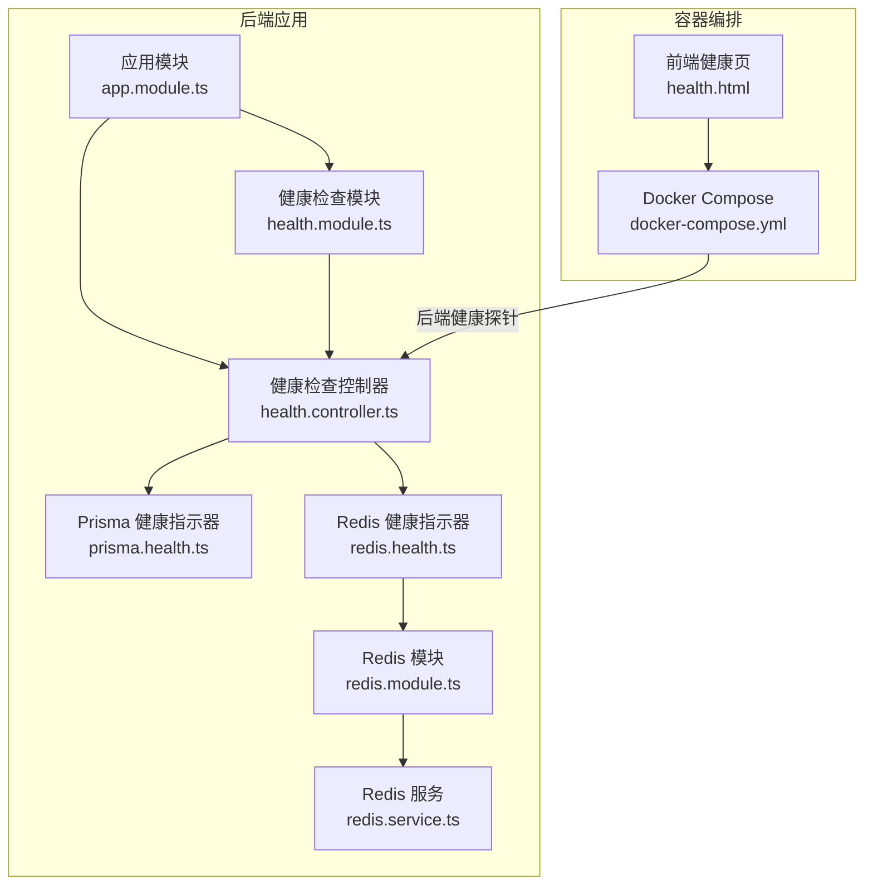
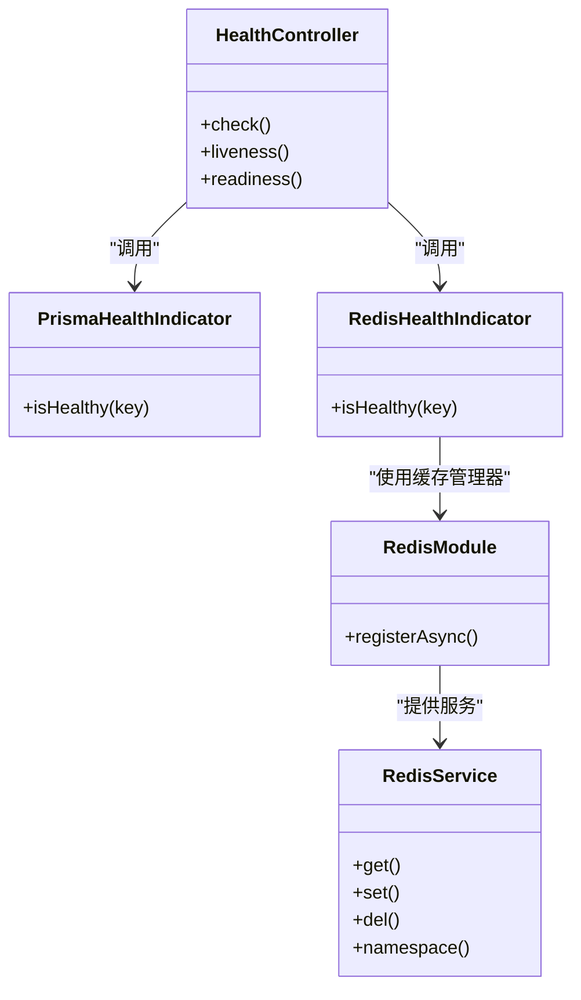
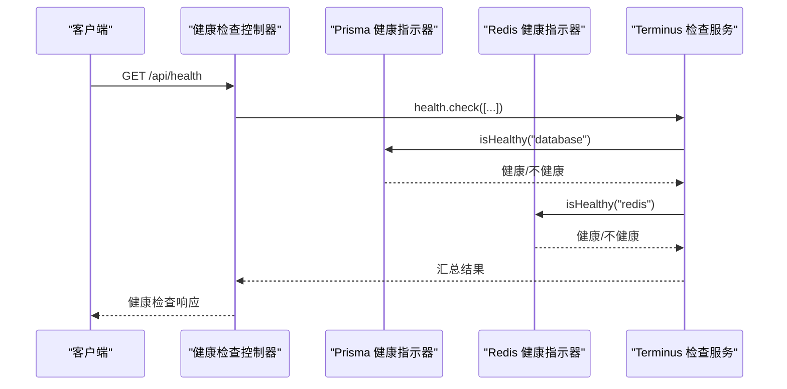
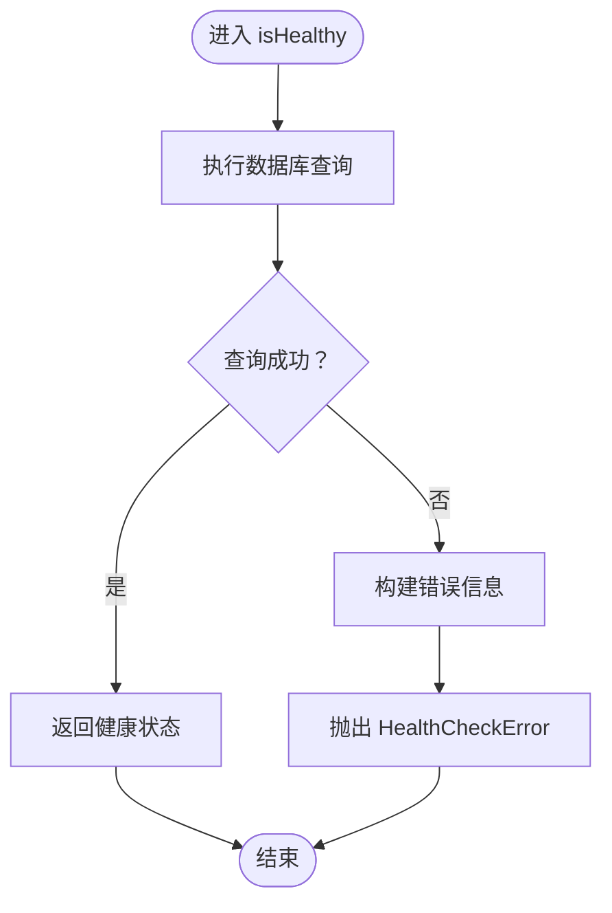
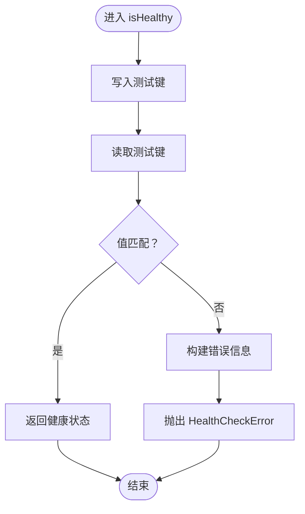
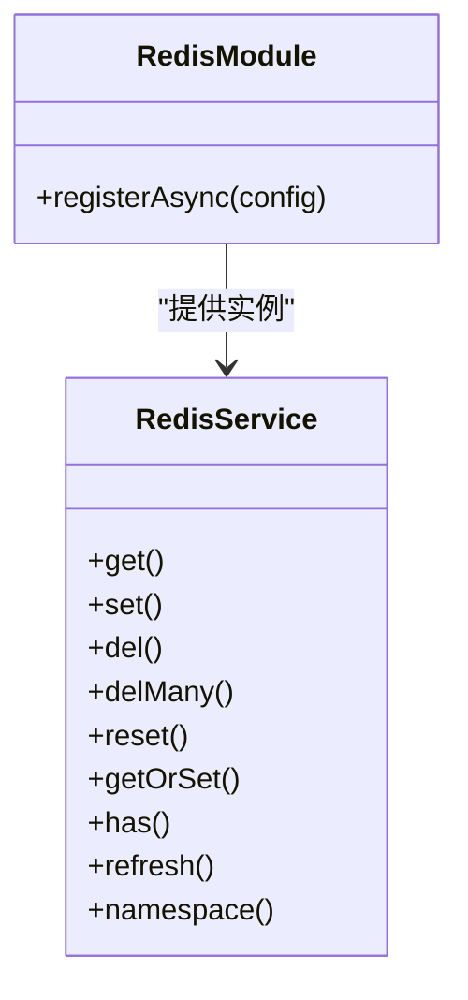
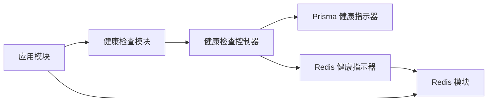

# 系统健康检查

<cite>
**本文引用的文件**
- [apps/backend/src/health/health.controller.ts](file://apps/backend/src/health/health.controller.ts)
- [apps/backend/src/health/health.module.ts](file://apps/backend/src/health/health.module.ts)
- [apps/backend/src/health/prisma.health.ts](file://apps/backend/src/health/prisma.health.ts)
- [apps/backend/src/redis/redis.health.ts](file://apps/backend/src/redis/redis.health.ts)
- [apps/backend/src/redis/redis.module.ts](file://apps/backend/src/redis/redis.module.ts)
- [apps/backend/src/redis/redis.service.ts](file://apps/backend/src/redis/redis.service.ts)
- [apps/backend/src/app.module.ts](file://apps/backend/src/app.module.ts)
- [docker-compose.yml](file://docker-compose.yml)
- [apps/frontend/public/health.html](file://apps/frontend/public/health.html)
</cite>

## 目录
1. [简介](#简介)
2. [项目结构](#项目结构)
3. [核心组件](#核心组件)
4. [架构总览](#架构总览)
5. [详细组件分析](#详细组件分析)
6. [依赖关系分析](#依赖关系分析)
7. [性能考量](#性能考量)
8. [故障排查指南](#故障排查指南)
9. [结论](#结论)
10. [附录](#附录)

## 简介
本文件系统性阐述后端健康检查模块的设计与实现，覆盖以下方面：
- 健康检查架构：基于 NestJS Terminus 的统一健康检查框架
- 监控指标采集：数据库连接、Redis 缓存、内存与磁盘
- 服务状态评估：健康指示器与错误聚合
- 告警机制：结合容器编排平台的存活/就绪探针
- 自定义健康检查器：扩展数据库、缓存与外部依赖
- 响应格式与错误处理：标准化输出与异常传播
- Kubernetes 集成：存活探针与就绪探针配置策略

## 项目结构
后端健康检查相关代码集中在 apps/backend 下，主要文件如下：
- 控制器与模块：apps/backend/src/health/*
- Redis 健康检查与模块：apps/backend/src/redis/*
- 应用根模块装配：apps/backend/src/app.module.ts
- 容器编排健康检查配置：docker-compose.yml
- 前端健康页：apps/frontend/public/health.html

**图表来源**
- [apps/backend/src/health/health.controller.ts:1-80](file://apps/backend/src/health/health.controller.ts#L1-L80)
- [apps/backend/src/health/health.module.ts:1-14](file://apps/backend/src/health/health.module.ts#L1-L14)
- [apps/backend/src/health/prisma.health.ts:1-32](file://apps/backend/src/health/prisma.health.ts#L1-L32)
- [apps/backend/src/redis/redis.health.ts:1-43](file://apps/backend/src/redis/redis.health.ts#L1-L43)
- [apps/backend/src/redis/redis.module.ts:1-84](file://apps/backend/src/redis/redis.module.ts#L1-L84)
- [apps/backend/src/redis/redis.service.ts:1-255](file://apps/backend/src/redis/redis.service.ts#L1-L255)
- [apps/backend/src/app.module.ts:1-160](file://apps/backend/src/app.module.ts#L1-L160)
- [docker-compose.yml:128-137](file://docker-compose.yml#L128-L137)
- [apps/frontend/public/health.html:1-11](file://apps/frontend/public/health.html#L1-L11)

**章节来源**
- [apps/backend/src/health/health.controller.ts:1-80](file://apps/backend/src/health/health.controller.ts#L1-L80)
- [apps/backend/src/health/health.module.ts:1-14](file://apps/backend/src/health/health.module.ts#L1-L14)
- [apps/backend/src/redis/redis.module.ts:1-84](file://apps/backend/src/redis/redis.module.ts#L1-L84)
- [apps/backend/src/app.module.ts:1-160](file://apps/backend/src/app.module.ts#L1-L160)
- [docker-compose.yml:128-137](file://docker-compose.yml#L128-L137)
- [apps/frontend/public/health.html:1-11](file://apps/frontend/public/health.html#L1-L11)

## 核心组件
- 健康检查控制器：提供 /api/health（综合）、/api/health/liveness（存活）、/api/health/readiness（就绪）三个端点
- 健康检查模块：装配 Terminus、Prisma 模块与健康指示器
- Prisma 健康指示器：执行轻量 SQL 检测数据库连接
- Redis 健康指示器：通过 set/get 测试缓存连通性与一致性
- Redis 模块：集中配置 Redis 连接、TTL、键前缀与重试策略
- Redis 服务：封装统一的缓存操作接口，支持命名空间与批量操作
- 应用模块：全局装配健康检查模块与 Redis 模块
- 容器编排：Docker Compose 中配置后端健康探针与前端健康页

**章节来源**
- [apps/backend/src/health/health.controller.ts:1-80](file://apps/backend/src/health/health.controller.ts#L1-L80)
- [apps/backend/src/health/health.module.ts:1-14](file://apps/backend/src/health/health.module.ts#L1-L14)
- [apps/backend/src/health/prisma.health.ts:1-32](file://apps/backend/src/health/prisma.health.ts#L1-L32)
- [apps/backend/src/redis/redis.health.ts:1-43](file://apps/backend/src/redis/redis.health.ts#L1-L43)
- [apps/backend/src/redis/redis.module.ts:1-84](file://apps/backend/src/redis/redis.module.ts#L1-L84)
- [apps/backend/src/redis/redis.service.ts:1-255](file://apps/backend/src/redis/redis.service.ts#L1-L255)
- [apps/backend/src/app.module.ts:1-160](file://apps/backend/src/app.module.ts#L1-L160)

## 架构总览
健康检查采用“控制器 + 指示器 + 外部依赖”的分层架构：
- 控制器负责路由与组合检查项
- 指示器封装具体依赖的健康判断逻辑
- 外部依赖（数据库、缓存）通过模块化注入

**图表来源**
- [apps/backend/src/health/health.controller.ts:1-80](file://apps/backend/src/health/health.controller.ts#L1-L80)
- [apps/backend/src/health/prisma.health.ts:1-32](file://apps/backend/src/health/prisma.health.ts#L1-L32)
- [apps/backend/src/redis/redis.health.ts:1-43](file://apps/backend/src/redis/redis.health.ts#L1-L43)
- [apps/backend/src/redis/redis.module.ts:1-84](file://apps/backend/src/redis/redis.module.ts#L1-L84)
- [apps/backend/src/redis/redis.service.ts:1-255](file://apps/backend/src/redis/redis.service.ts#L1-L255)

## 详细组件分析

### 健康检查控制器
- 综合健康检查：包含数据库、Redis、内存堆与 RSS、磁盘使用率检查
- 存活探针：返回固定结构的健康状态，用于容器存活判定
- 就绪探针：仅检查数据库与 Redis，确保业务可承接流量

**图表来源**
- [apps/backend/src/health/health.controller.ts:34-54](file://apps/backend/src/health/health.controller.ts#L34-L54)
- [apps/backend/src/health/prisma.health.ts:19-30](file://apps/backend/src/health/prisma.health.ts#L19-L30)
- [apps/backend/src/redis/redis.health.ts:20-41](file://apps/backend/src/redis/redis.health.ts#L20-L41)

**章节来源**
- [apps/backend/src/health/health.controller.ts:30-78](file://apps/backend/src/health/health.controller.ts#L30-L78)

### Prisma 健康指示器
- 通过执行轻量查询验证数据库连接可用性
- 成功返回健康状态；失败抛出 HealthCheckError 并携带错误详情

**图表来源**
- [apps/backend/src/health/prisma.health.ts:19-30](file://apps/backend/src/health/prisma.health.ts#L19-L30)

**章节来源**
- [apps/backend/src/health/prisma.health.ts:1-32](file://apps/backend/src/health/prisma.health.ts#L1-L32)

### Redis 健康指示器
- 通过写入与读取测试键验证缓存连通性与一致性
- 成功返回健康状态；失败抛出 HealthCheckError 并携带错误详情

**图表来源**
- [apps/backend/src/redis/redis.health.ts:20-41](file://apps/backend/src/redis/redis.health.ts#L20-L41)

**章节来源**
- [apps/backend/src/redis/redis.health.ts:1-43](file://apps/backend/src/redis/redis.health.ts#L1-L43)

### Redis 模块与服务
- 模块：集中配置 Redis 连接参数、TTL、键前缀与重试策略
- 服务：提供统一的缓存操作接口，支持命名空间与批量操作

**图表来源**
- [apps/backend/src/redis/redis.module.ts:26-82](file://apps/backend/src/redis/redis.module.ts#L26-L82)
- [apps/backend/src/redis/redis.service.ts:61-224](file://apps/backend/src/redis/redis.service.ts#L61-L224)

**章节来源**
- [apps/backend/src/redis/redis.module.ts:1-84](file://apps/backend/src/redis/redis.module.ts#L1-L84)
- [apps/backend/src/redis/redis.service.ts:1-255](file://apps/backend/src/redis/redis.service.ts#L1-L255)

### 健康检查模块装配
- 引入 TerminusModule 与 PrismaModule
- 注册健康检查控制器与健康指示器

**章节来源**
- [apps/backend/src/health/health.module.ts:1-14](file://apps/backend/src/health/health.module.ts#L1-L14)
- [apps/backend/src/app.module.ts:134-136](file://apps/backend/src/app.module.ts#L134-L136)

## 依赖关系分析
- 控制器依赖 Terminus 的 HealthCheckService 与内置内存/磁盘指示器
- Prisma 健康指示器依赖 PrismaService
- Redis 健康指示器依赖 CacheManager（由 Redis 模块提供）
- 应用模块全局装配健康检查模块与 Redis 模块

**图表来源**
- [apps/backend/src/app.module.ts:134-136](file://apps/backend/src/app.module.ts#L134-L136)
- [apps/backend/src/health/health.module.ts:8-12](file://apps/backend/src/health/health.module.ts#L8-L12)
- [apps/backend/src/health/health.controller.ts:22-28](file://apps/backend/src/health/health.controller.ts#L22-L28)
- [apps/backend/src/redis/redis.health.ts:12-14](file://apps/backend/src/redis/redis.health.ts#L12-L14)

**章节来源**
- [apps/backend/src/app.module.ts:1-160](file://apps/backend/src/app.module.ts#L1-L160)
- [apps/backend/src/health/health.module.ts:1-14](file://apps/backend/src/health/health.module.ts#L1-L14)

## 性能考量
- 健康检查应保持低开销：使用轻量查询与最小化网络往返
- Redis 健康检查采用短 TTL 测试键，避免持久化影响
- 内存与磁盘检查阈值需结合实例规格与负载进行调优
- 健康检查端点应跳过速率限制，避免在高负载下误判

[本节为通用指导，无需特定文件来源]

## 故障排查指南
- 数据库不可达：检查 Prisma 连接字符串与网络连通性
- Redis 不可达：检查 Redis 模块配置、密码与网络策略
- 健康检查异常：查看控制器抛出的 HealthCheckError 错误详情
- 容器未就绪：确认就绪探针仅依赖数据库与 Redis，避免非关键依赖干扰

**章节来源**
- [apps/backend/src/health/prisma.health.ts:23-29](file://apps/backend/src/health/prisma.health.ts#L23-L29)
- [apps/backend/src/redis/redis.health.ts:34-40](file://apps/backend/src/redis/redis.health.ts#L34-L40)
- [apps/backend/src/health/health.controller.ts:74-77](file://apps/backend/src/health/health.controller.ts#L74-L77)

## 结论
该健康检查模块以 Terminus 为核心，结合自定义 Prisma 与 Redis 健康指示器，实现了对数据库与缓存的关键依赖检测，并通过存活/就绪探针与容器编排平台协同工作。模块具备良好的扩展性，便于新增外部依赖的健康检查项。

[本节为总结，无需特定文件来源]

## 附录

### 响应格式与错误处理
- 综合健康检查：返回 Terminus 标准化健康检查结果
- 存活探针：返回固定结构的健康状态
- 就绪探针：仅检查数据库与 Redis，快速判断业务可承载流量
- 错误处理：指示器捕获异常并抛出 HealthCheckError，包含错误详情

**章节来源**
- [apps/backend/src/health/health.controller.ts:34-78](file://apps/backend/src/health/health.controller.ts#L34-L78)
- [apps/backend/src/health/prisma.health.ts:23-29](file://apps/backend/src/health/prisma.health.ts#L23-L29)
- [apps/backend/src/redis/redis.health.ts:34-40](file://apps/backend/src/redis/redis.health.ts#L34-L40)

### 自定义健康检查器实现步骤
- 新建指示器类，继承 HealthIndicator
- 在构造函数中注入所需依赖（如 PrismaService、CacheManager）
- 实现 isHealthy(key) 方法，执行轻量检查并返回状态
- 在健康检查模块中注册该指示器
- 在控制器中组合该检查项

**章节来源**
- [apps/backend/src/health/prisma.health.ts:1-32](file://apps/backend/src/health/prisma.health.ts#L1-L32)
- [apps/backend/src/redis/redis.health.ts:1-43](file://apps/backend/src/redis/redis.health.ts#L1-L43)
- [apps/backend/src/health/health.module.ts:8-12](file://apps/backend/src/health/health.module.ts#L8-L12)

### 健康检查端点配置与调用
- 综合健康检查：GET /api/health
- 存活探针：GET /api/health/liveness
- 就绪探针：GET /api/health/readiness

**章节来源**
- [apps/backend/src/health/health.controller.ts:34-78](file://apps/backend/src/health/health.controller.ts#L34-L78)

### 配置检查间隔与阈值
- 内存堆阈值：200MB
- 内存 RSS 阈值：300MB
- 磁盘阈值：90% 已用
- Redis 健康检查 TTL：1 秒
- 容器健康探针：后端健康探针每 15 秒一次，超时 5 秒，重试 5 次，启动期 60 秒

**章节来源**
- [apps/backend/src/health/health.controller.ts:43-52](file://apps/backend/src/health/health.controller.ts#L43-L52)
- [apps/backend/src/redis/redis.health.ts:26-27](file://apps/backend/src/redis/redis.health.ts#L26-L27)
- [docker-compose.yml:128-137](file://docker-compose.yml#L128-L137)

### 与容器编排平台集成
- Docker Compose：后端服务配置健康探针，依赖数据库与缓存健康
- 前端健康页：提供静态健康页，便于外部探针探测
- 健康页路径：/health

**章节来源**
- [docker-compose.yml:128-137](file://docker-compose.yml#L128-L137)
- [apps/frontend/public/health.html:1-11](file://apps/frontend/public/health.html#L1-L11)