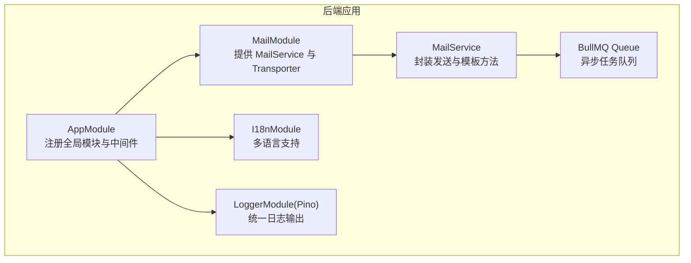
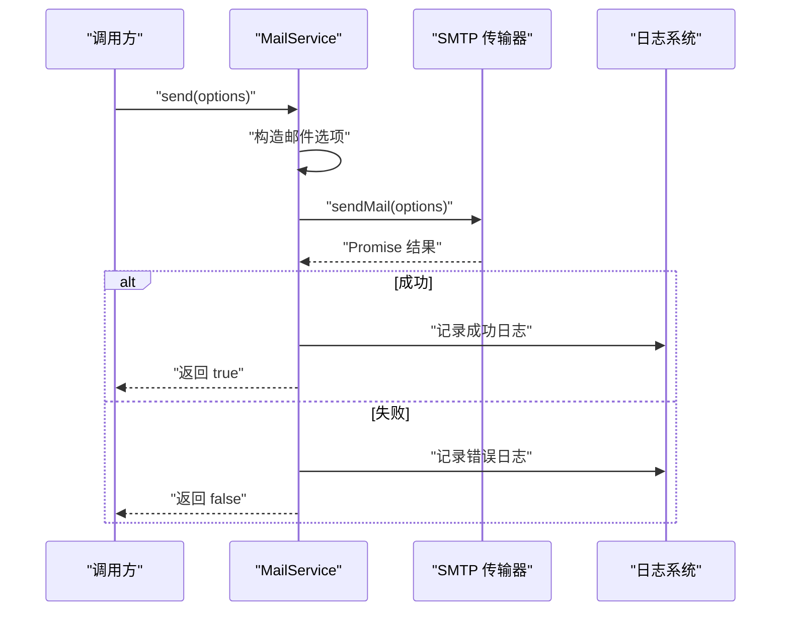
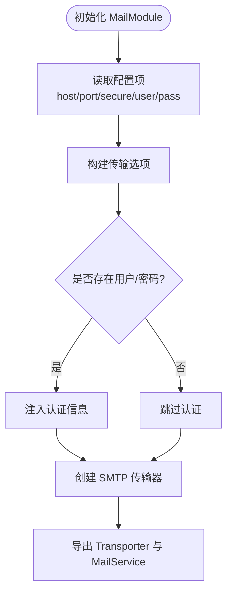
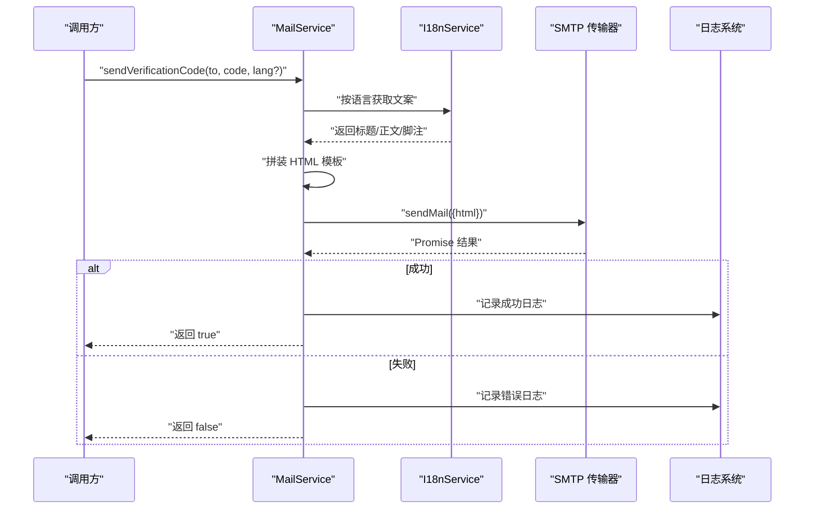
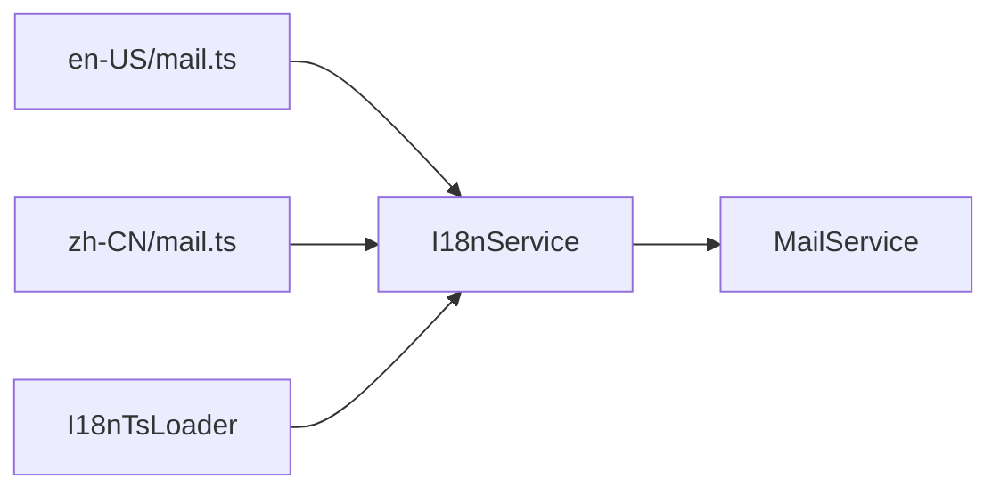
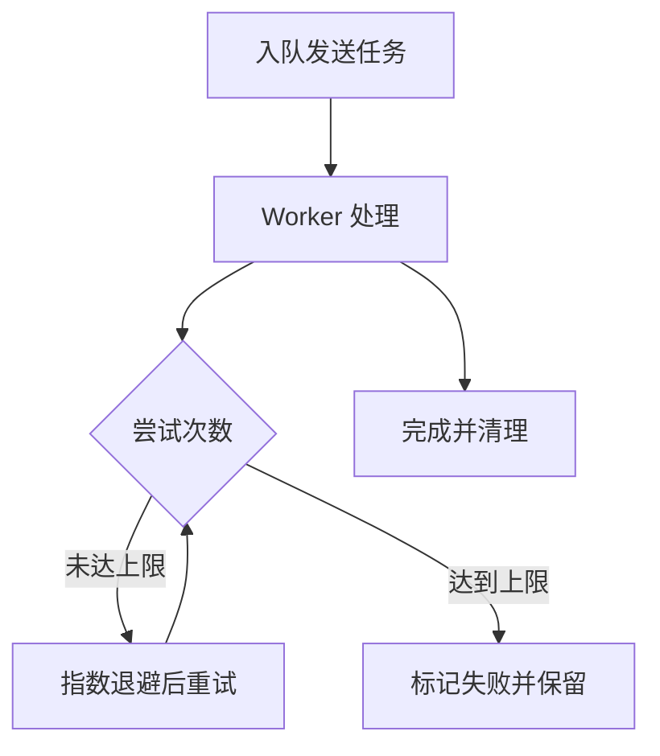
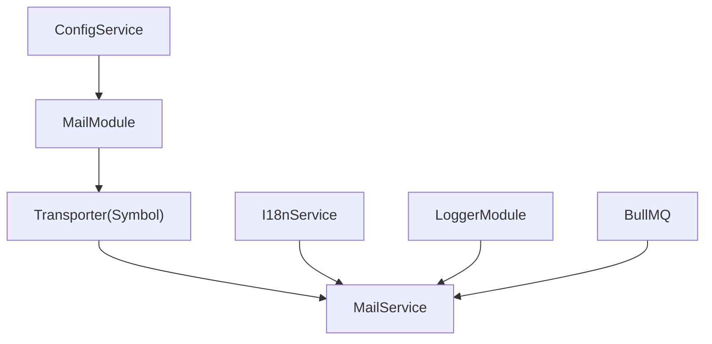

# 邮件服务系统

<cite>
**本文引用的文件**
- [apps/backend/src/mail/index.ts](file://apps/backend/src/mail/index.ts)
- [apps/backend/src/mail/mail.constants.ts](file://apps/backend/src/mail/mail.constants.ts)
- [apps/backend/src/mail/mail.module.ts](file://apps/backend/src/mail/mail.module.ts)
- [apps/backend/src/mail/mail.service.ts](file://apps/backend/src/mail/mail.service.ts)
- [apps/backend/src/i18n/en-US/mail.ts](file://apps/backend/src/i18n/en-US/mail.ts)
- [apps/backend/src/i18n/zh-CN/mail.ts](file://apps/backend/src/i18n/zh-CN/mail.ts)
- [apps/backend/src/i18n/i18n-ts.loader.ts](file://apps/backend/src/i18n/i18n-ts.loader.ts)
- [apps/backend/src/app.module.ts](file://apps/backend/src/app.module.ts)
- [apps/backend/src/scheduled-tasks/scheduled-tasks.module.ts](file://apps/backend/src/scheduled-tasks/scheduled-tasks.module.ts)
- [apps/backend/src/scheduled-tasks/scheduled-tasks.processor.ts](file://apps/backend/src/scheduled-tasks/scheduled-tasks.processor.ts)
- [apps/backend/src/common/interceptors/sanitize.interceptor.ts](file://apps/backend/src/common/interceptors/sanitize.interceptor.ts)
- [apps/backend/src/common/filters/all-exceptions.filter.ts](file://apps/backend/src/common/filters/all-exceptions.filter.ts)
- [apps/backend/tests/mail/mail.module.spec.ts](file://apps/backend/tests/mail/mail.module.spec.ts)
</cite>

## 目录

1. [简介](#简介)
2. [项目结构](#项目结构)
3. [核心组件](#核心组件)
4. [架构总览](#架构总览)
5. [详细组件分析](#详细组件分析)
6. [依赖关系分析](#依赖关系分析)
7. [性能考量](#性能考量)
8. [故障排查指南](#故障排查指南)
9. [结论](#结论)
10. [附录](#附录)

## 简介

本文件面向“邮件服务系统”模块，系统性阐述以下主题：

- 配置参数与 SMTP 连接设置
- TLS/SSL 安全机制
- 发送队列管理（基于 BullMQ 的异步处理与失败重试）
- 邮件模板系统设计（HTML 模板渲染、动态内容填充、多语言支持）
- 异步发送、失败重试策略、发送状态跟踪与日志记录
- 实际示例路径（通过源码路径定位，不直接展示代码）
- 内容安全过滤（XSS 防护）、恶意链接检测建议
- 第三方邮件服务商集成方式、API 密钥管理与成本控制策略

## 项目结构

邮件服务位于后端应用的独立模块中，采用 NestJS 模块化组织，配合国际化与日志模块共同工作。

图示来源

- [apps/backend/src/app.module.ts:28-146](file://apps/backend/src/app.module.ts#L28-L146)
- [apps/backend/src/mail/mail.module.ts:11-36](file://apps/backend/src/mail/mail.module.ts#L11-L36)
- [apps/backend/src/mail/mail.service.ts:18-26](file://apps/backend/src/mail/mail.service.ts#L18-L26)

章节来源

- [apps/backend/src/mail/index.ts:1-4](file://apps/backend/src/mail/index.ts#L1-L4)
- [apps/backend/src/mail/mail.module.ts:11-36](file://apps/backend/src/mail/mail.module.ts#L11-L36)
- [apps/backend/src/mail/mail.service.ts:18-26](file://apps/backend/src/mail/mail.service.ts#L18-L26)
- [apps/backend/src/app.module.ts:28-146](file://apps/backend/src/app.module.ts#L28-L146)

## 核心组件

- 邮件模块（MailModule）：负责创建并导出 SMTP 传输器实例，注入配置服务读取 SMTP 参数。
- 邮件服务（MailService）：封装发送接口、验证码与密码重置模板邮件的生成与发送。
- 国际化（I18nModule + I18nTsLoader）：提供多语言文案与模板标题/正文/按钮文案。
- 日志（LoggerModule/Pino）：统一记录发送成功与失败日志。
- 队列（BullMQ）：提供异步发送、失败重试与指数退避策略。

章节来源

- [apps/backend/src/mail/mail.module.ts:11-36](file://apps/backend/src/mail/mail.module.ts#L11-L36)
- [apps/backend/src/mail/mail.service.ts:18-116](file://apps/backend/src/mail/mail.service.ts#L18-L116)
- [apps/backend/src/i18n/i18n-ts.loader.ts:86-184](file://apps/backend/src/i18n/i18n-ts.loader.ts#L86-L184)
- [apps/backend/src/app.module.ts:35-133](file://apps/backend/src/app.module.ts#L35-L133)

## 架构总览

邮件服务的发送流程由同步调用与异步队列两种模式构成。同步模式适合即时反馈场景；异步模式适合批量与高吞吐场景，并具备失败重试与日志追踪能力。

图示来源

- [apps/backend/src/mail/mail.service.ts:43-60](file://apps/backend/src/mail/mail.service.ts#L43-L60)

## 详细组件分析

### 邮件模块与 SMTP 连接

- 传输器创建：通过配置服务读取主机、端口、是否启用安全模式、认证凭据等参数，构建 SMTP 传输器。
- 安全机制：secure 字段控制是否启用 TLS；当 secure=true 且端口未显式设置时，通常使用 465；否则默认 587。
- 凭据注入：当配置中存在用户与密码时，自动注入到传输器认证字段。

图示来源

- [apps/backend/src/mail/mail.module.ts:16-30](file://apps/backend/src/mail/mail.module.ts#L16-L30)

章节来源

- [apps/backend/src/mail/mail.module.ts:16-30](file://apps/backend/src/mail/mail.module.ts#L16-L30)

### 邮件服务与发送接口

- 发送接口：接收收件人、主题、纯文本与 HTML 内容，统一通过传输器发送，并记录日志。
- 模板方法：
  - 验证码邮件：生成带验证码的 HTML 模板，包含标题、正文、验证码展示区与有效期说明。
  - 密码重置邮件：生成带重置链接的 HTML 模板，包含标题、正文、按钮与有效期说明。
- 语言选择：优先从 I18n 上下文获取语言，否则回退至默认语言。

图示来源

- [apps/backend/src/mail/mail.service.ts:65-86](file://apps/backend/src/mail/mail.service.ts#L65-L86)
- [apps/backend/src/mail/mail.service.ts:91-115](file://apps/backend/src/mail/mail.service.ts#L91-L115)

章节来源

- [apps/backend/src/mail/mail.service.ts:43-115](file://apps/backend/src/mail/mail.service.ts#L43-L115)

### 国际化与模板文案

- 多语言文案：在 en-US 与 zh-CN 目录下分别提供邮件文案键值，涵盖验证码与密码重置相关文案。
- 加载器：I18nTsLoader 递归扫描语言目录，合并同名键值，支持热更新（可选）。

图示来源

- [apps/backend/src/i18n/en-US/mail.ts:1-15](file://apps/backend/src/i18n/en-US/mail.ts#L1-L15)
- [apps/backend/src/i18n/zh-CN/mail.ts:1-14](file://apps/backend/src/i18n/zh-CN/mail.ts#L1-L14)
- [apps/backend/src/i18n/i18n-ts.loader.ts:136-183](file://apps/backend/src/i18n/i18n-ts.loader.ts#L136-L183)

章节来源

- [apps/backend/src/i18n/en-US/mail.ts:1-15](file://apps/backend/src/i18n/en-US/mail.ts#L1-L15)
- [apps/backend/src/i18n/zh-CN/mail.ts:1-14](file://apps/backend/src/i18n/zh-CN/mail.ts#L1-L14)
- [apps/backend/src/i18n/i18n-ts.loader.ts:136-183](file://apps/backend/src/i18n/i18n-ts.loader.ts#L136-L183)

### 异步发送与队列管理（BullMQ）

- 队列配置：默认作业选项包含重试次数、指数退避延迟、完成后自动清理等。
- 定时任务模块：演示了基于 BullMQ 的 repeat 机制，可用于周期性任务（如健康检查、清理、统计等）。
- 失败重试策略：通过 attempts 与 backoff（指数退避）实现，失败作业保留以便排查。

图示来源

- [apps/backend/src/app.module.ts:98-116](file://apps/backend/src/app.module.ts#L98-L116)
- [apps/backend/src/scheduled-tasks/scheduled-tasks.module.ts:15-91](file://apps/backend/src/scheduled-tasks/scheduled-tasks.module.ts#L15-L91)

章节来源

- [apps/backend/src/app.module.ts:98-116](file://apps/backend/src/app.module.ts#L98-L116)
- [apps/backend/src/scheduled-tasks/scheduled-tasks.module.ts:15-91](file://apps/backend/src/scheduled-tasks/scheduled-tasks.module.ts#L15-L91)

### 发送状态跟踪与日志记录

- 成功/失败日志：发送方法内部对成功与失败分别记录日志，便于审计与问题定位。
- 全局异常过滤：统一捕获异常并输出结构化错误响应，便于前端与监控系统消费。

章节来源

- [apps/backend/src/mail/mail.service.ts:53-59](file://apps/backend/src/mail/mail.service.ts#L53-L59)
- [apps/backend/src/common/filters/all-exceptions.filter.ts:17-136](file://apps/backend/src/common/filters/all-exceptions.filter.ts#L17-L136)

### 内容安全与 XSS 防护

- 请求体清理：SanitizeInterceptor 对请求体、查询参数与路径参数进行递归清理，禁止任何 HTML 标签，降低 XSS 风险。
- 建议：对模板中的用户输入进行严格白名单校验与转义；对外链进行可信域名校验与短链化处理。

章节来源

- [apps/backend/src/common/interceptors/sanitize.interceptor.ts:10-36](file://apps/backend/src/common/interceptors/sanitize.interceptor.ts#L10-L36)

### 实际使用示例（代码路径）

以下示例均通过“源码路径”定位，不直接展示代码内容：

- 发送普通邮件（文本）：[apps/backend/src/mail/mail.service.ts:43-60](file://apps/backend/src/mail/mail.service.ts#L43-L60)
- 发送 HTML 邮件：[apps/backend/src/mail/mail.service.ts:43-60](file://apps/backend/src/mail/mail.service.ts#L43-L60)
- 发送带验证码的 HTML 邮件：[apps/backend/src/mail/mail.service.ts:65-86](file://apps/backend/src/mail/mail.service.ts#L65-L86)
- 发送密码重置链接邮件：[apps/backend/src/mail/mail.service.ts:91-115](file://apps/backend/src/mail/mail.service.ts#L91-L115)
- 验证码文案键值（英文）：[apps/backend/src/i18n/en-US/mail.ts:3-7](file://apps/backend/src/i18n/en-US/mail.ts#L3-L7)
- 验证码文案键值（中文）：[apps/backend/src/i18n/zh-CN/mail.ts:3-7](file://apps/backend/src/i18n/zh-CN/mail.ts#L3-L7)
- 密码重置文案键值（英文）：[apps/backend/src/i18n/en-US/mail.ts:8-14](file://apps/backend/src/i18n/en-US/mail.ts#L8-L14)
- 密码重置文案键值（中文）：[apps/backend/src/i18n/zh-CN/mail.ts:8-13](file://apps/backend/src/i18n/zh-CN/mail.ts#L8-L13)

## 依赖关系分析

- MailModule 依赖 ConfigService 与 nodemailer 创建 Transporter。
- MailService 依赖 Transporter、ConfigService 与 I18nService。
- 应用模块全局注册 LoggerModule、I18nModule、BullMQ 与 MailModule。

图示来源

- [apps/backend/src/mail/mail.module.ts:14-30](file://apps/backend/src/mail/mail.module.ts#L14-L30)
- [apps/backend/src/mail/mail.service.ts:22-26](file://apps/backend/src/mail/mail.service.ts#L22-L26)
- [apps/backend/src/app.module.ts:35-133](file://apps/backend/src/app.module.ts#L35-L133)

章节来源

- [apps/backend/src/mail/mail.module.ts:14-30](file://apps/backend/src/mail/mail.module.ts#L14-L30)
- [apps/backend/src/mail/mail.service.ts:22-26](file://apps/backend/src/mail/mail.service.ts#L22-L26)
- [apps/backend/src/app.module.ts:35-133](file://apps/backend/src/app.module.ts#L35-L133)

## 性能考量

- 异步发送：通过 BullMQ 将发送任务放入队列，避免阻塞请求线程，提升吞吐量。
- 指数退避：减少瞬时重试导致的抖动，提高稳定性。
- 日志级别：生产环境使用 JSON 日志，便于集中采集与检索。
- 资源隔离：将 SMTP 凭据与日志配置分离于配置服务，便于不同环境差异化管理。

## 故障排查指南

- 发送失败：检查日志输出与错误栈，确认 SMTP 主机、端口、凭据与安全模式配置是否正确。
- 多语言文案缺失：确认 I18nTsLoader 是否正确加载对应语言目录与文件，必要时开启 watch 模式。
- 队列堆积：检查 Worker 是否正常运行、Redis 连接是否稳定、作业重试策略是否合理。
- 全局异常：通过 AllExceptionsFilter 输出结构化错误，结合日志定位具体问题。

章节来源

- [apps/backend/src/mail/mail.service.ts:53-59](file://apps/backend/src/mail/mail.service.ts#L53-L59)
- [apps/backend/src/i18n/i18n-ts.loader.ts:104-120](file://apps/backend/src/i18n/i18n-ts.loader.ts#L104-L120)
- [apps/backend/src/common/filters/all-exceptions.filter.ts:17-136](file://apps/backend/src/common/filters/all-exceptions.filter.ts#L17-L136)

## 结论

该邮件服务模块以简洁清晰的方式实现了 SMTP 发送、多语言模板与异步队列处理。通过配置驱动的传输器创建、I18n 文案与 Pino 日志，系统具备良好的可维护性与可观测性。建议在生产环境中进一步完善内容安全策略、接入更完善的监控与告警体系，并结合第三方邮件服务商的最佳实践进行成本优化与合规管理。

## 附录

### 配置参数清单（基于当前实现）

- MAIL_HOST：SMTP 主机地址
- MAIL_PORT：SMTP 端口，默认 587
- MAIL_SECURE：是否启用安全模式（true/false 字符串）
- MAIL_USER：SMTP 用户名
- MAIL_PASSWORD：SMTP 密码
- MAIL_FROM：发件人默认地址

章节来源

- [apps/backend/src/mail/mail.module.ts:17-27](file://apps/backend/src/mail/mail.module.ts#L17-L27)
- [apps/backend/src/mail/mail.service.ts:46](file://apps/backend/src/mail/mail.service.ts#L46)

### 测试参考

- 模块编译与提供者暴露测试：[apps/backend/tests/mail/mail.module.spec.ts:28-37](file://apps/backend/tests/mail/mail.module.spec.ts#L28-L37)
