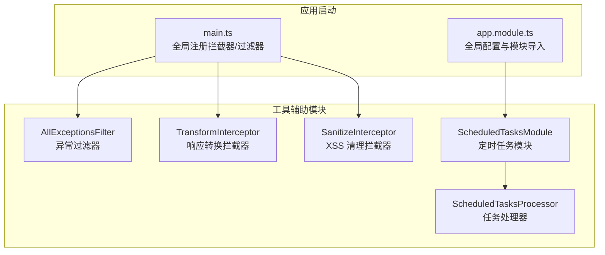
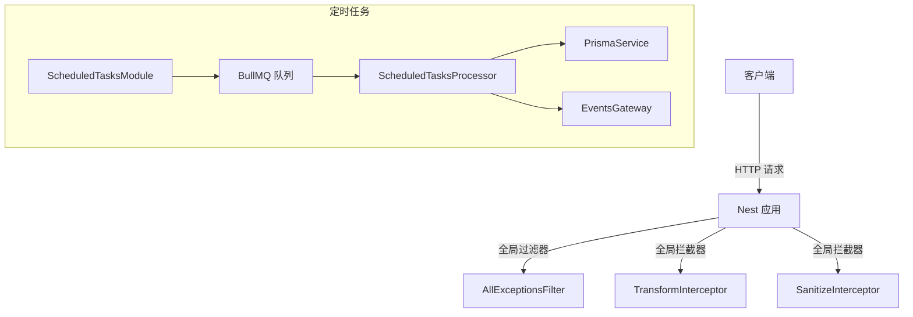
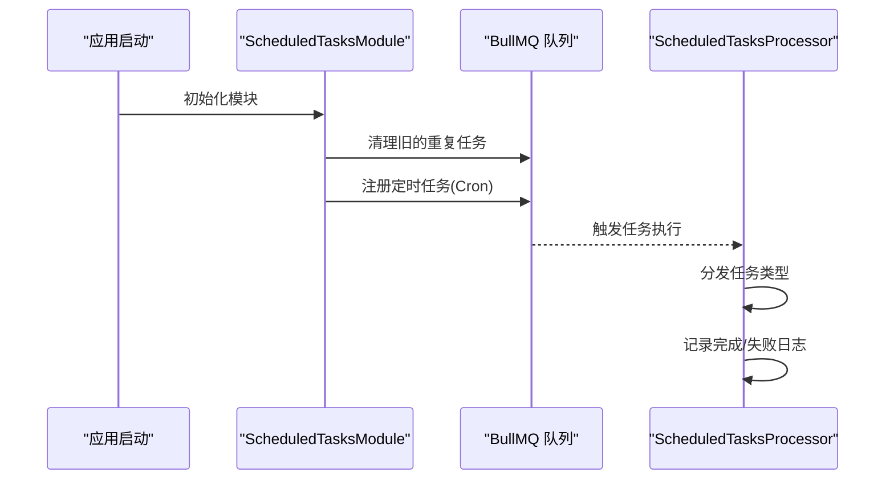
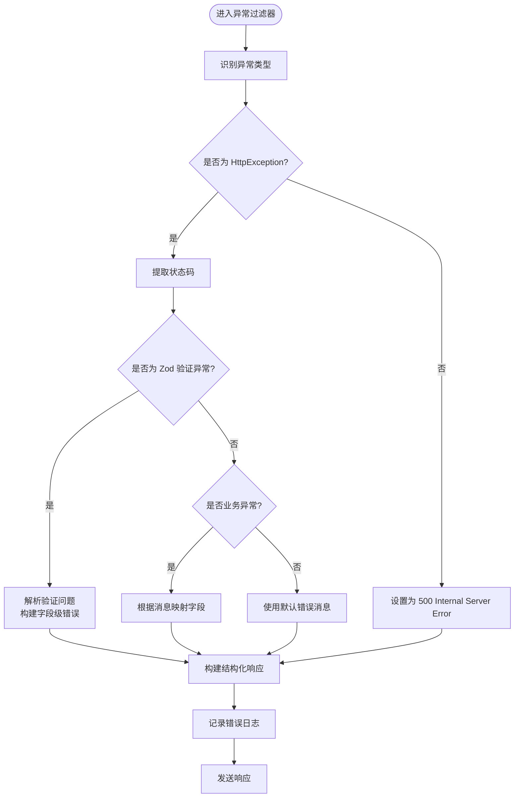
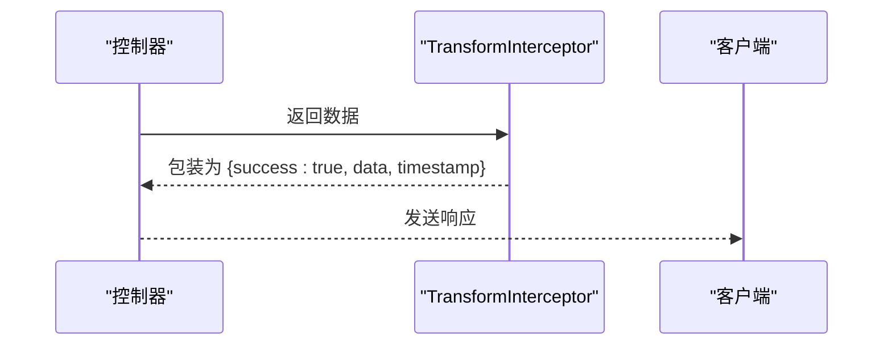
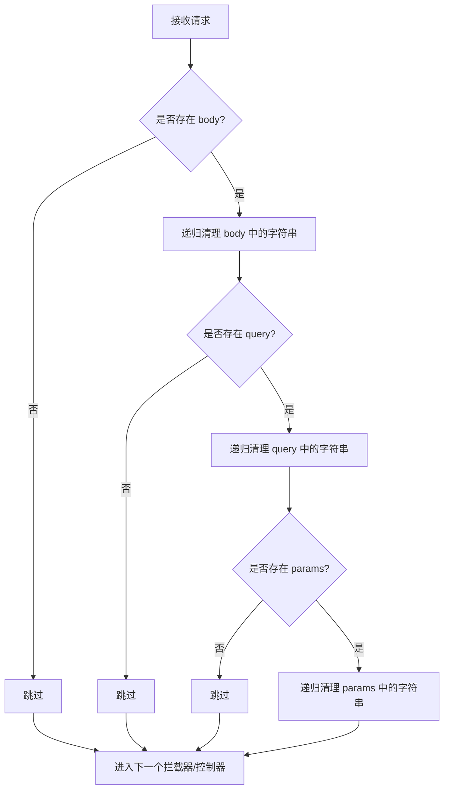
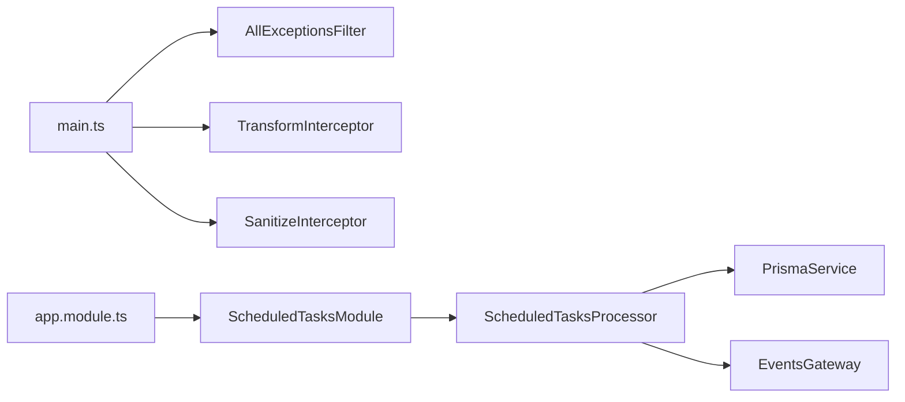

# 工具辅助模块

<cite>
**本文引用的文件**
- [scheduled-tasks.module.ts](file://apps/backend/src/scheduled-tasks/scheduled-tasks.module.ts)
- [scheduled-tasks.processor.ts](file://apps/backend/src/scheduled-tasks/scheduled-tasks.processor.ts)
- [constants.ts](file://apps/backend/src/scheduled-tasks/constants.ts)
- [all-exceptions.filter.ts](file://apps/backend/src/common/filters/all-exceptions.filter.ts)
- [transform.interceptor.ts](file://apps/backend/src/common/interceptors/transform.interceptor.ts)
- [sanitize.interceptor.ts](file://apps/backend/src/common/interceptors/sanitize.interceptor.ts)
- [app.module.ts](file://apps/backend/src/app.module.ts)
- [main.ts](file://apps/backend/src/main.ts)
- [todos.dto.ts](file://apps/backend/src/todos/todos.dto.ts)
- [common.dto.ts](file://packages/shared/src/dto/common.dto.ts)
- [all-exceptions.filter.spec.ts](file://apps/backend/tests/common/filters/all-exceptions.filter.spec.ts)
- [scheduled-tasks.processor.spec.ts](file://apps/backend/tests/scheduled-tasks.processor.spec.ts)
</cite>

## 目录
1. [简介](#简介)
2. [项目结构](#项目结构)
3. [核心组件](#核心组件)
4. [架构总览](#架构总览)
5. [详细组件分析](#详细组件分析)
6. [依赖关系分析](#依赖关系分析)
7. [性能考量](#性能考量)
8. [故障排查指南](#故障排查指南)
9. [结论](#结论)
10. [附录](#附录)

## 简介
本文件系统性梳理 Lumina Todo 后端的工具辅助模块，重点覆盖以下方面：
- 定时任务模块（ScheduledTasksModule）：Cron 表达式配置、任务调度策略、失败重试机制与事件广播。
- 异常过滤器（AllExceptionsFilter）：统一错误处理、错误码标准化、国际化与字段级错误映射、Zod 验证错误解析。
- 数据转换拦截器（TransformInterceptor）：响应格式化、统一成功包装、时间戳注入。
- 数据净化拦截器（SanitizeInterceptor）：XSS 防护、输入验证、安全过滤。

同时给出设计原则、使用场景、最佳实践以及自定义工具模块开发指南，帮助开发者在保证安全性与可维护性的前提下扩展工具链。

## 项目结构
工具辅助模块位于后端应用的公共目录，并通过全局注册在启动阶段生效。定时任务模块独立管理队列与处理器，其余模块通过全局拦截器与过滤器对请求生命周期进行横切增强。

图表来源
- [main.ts:172-179](file://apps/backend/src/main.ts#L172-L179)
- [app.module.ts:144](file://apps/backend/src/app.module.ts#L144)
- [scheduled-tasks.module.ts:15-24](file://apps/backend/src/scheduled-tasks/scheduled-tasks.module.ts#L15-L24)

章节来源
- [main.ts:172-179](file://apps/backend/src/main.ts#L172-L179)
- [app.module.ts:144](file://apps/backend/src/app.module.ts#L144)

## 核心组件
- 定时任务模块（ScheduledTasksModule）
  - 基于 BullMQ 的 repeat 功能，使用统一队列名进行任务注册与清理。
  - 在模块初始化时清理旧重复任务并按 Cron 表达式注册新任务。
  - 任务类型包括健康检查、待办提醒、过期数据清理、每日统计。
- 定时任务处理器（ScheduledTasksProcessor）
  - 依据任务类型分发处理逻辑，内置事务与事件广播。
  - 提供工作进程事件回调，记录完成与失败日志。
- 异常过滤器（AllExceptionsFilter）
  - 统一捕获未处理异常，输出结构化错误响应。
  - 支持 Zod 验证错误解析、业务异常字段映射、国际化消息。
- 响应转换拦截器（TransformInterceptor）
  - 将成功响应统一包装为 { success: true, data, timestamp }。
- XSS 清理拦截器（SanitizeInterceptor）
  - 对请求体、查询参数、路径参数进行原地递归清理，禁用所有 HTML 标签。

章节来源
- [scheduled-tasks.module.ts:25-91](file://apps/backend/src/scheduled-tasks/scheduled-tasks.module.ts#L25-L91)
- [scheduled-tasks.processor.ts:36-68](file://apps/backend/src/scheduled-tasks/scheduled-tasks.processor.ts#L36-L68)
- [all-exceptions.filter.ts:16-136](file://apps/backend/src/common/filters/all-exceptions.filter.ts#L16-L136)
- [transform.interceptor.ts:18-29](file://apps/backend/src/common/interceptors/transform.interceptor.ts#L18-L29)
- [sanitize.interceptor.ts:9-63](file://apps/backend/src/common/interceptors/sanitize.interceptor.ts#L9-L63)

## 架构总览
下图展示工具模块在请求与任务执行中的交互关系与职责边界。

图表来源
- [main.ts:172-179](file://apps/backend/src/main.ts#L172-L179)
- [scheduled-tasks.module.ts:15-24](file://apps/backend/src/scheduled-tasks/scheduled-tasks.module.ts#L15-L24)
- [scheduled-tasks.processor.ts:36-47](file://apps/backend/src/scheduled-tasks/scheduled-tasks.processor.ts#L36-L47)

## 详细组件分析

### 定时任务模块（ScheduledTasksModule）
- 设计原则
  - 使用 BullMQ 的 repeat 功能实现稳定、去重的周期性任务。
  - 在模块初始化阶段清理旧任务，确保配置变更即时生效。
  - 通过统一队列名与常量管理，降低耦合与配置漂移风险。
- Cron 表达式与任务策略
  - 每分钟：健康检查、待办提醒。
  - 每小时：清理过期数据（逻辑删除超过阈值的记录与墓碑）。
  - 每天 02:00：生成每日统计数据（活跃/完成/创建/今日完成/删除总量与用户维度统计）。
- 失败重试机制
  - 全局默认作业选项启用失败重试与指数退避策略，便于在瞬时故障后自动恢复。
  - 任务完成后自动清理，失败保留以便排查。
- 事件广播
  - 处理待办提醒时，向用户房间广播提醒事件，并原子更新提醒标记与版本号。

图表来源
- [scheduled-tasks.module.ts:28-90](file://apps/backend/src/scheduled-tasks/scheduled-tasks.module.ts#L28-L90)
- [scheduled-tasks.processor.ts:49-68](file://apps/backend/src/scheduled-tasks/scheduled-tasks.processor.ts#L49-L68)
- [app.module.ts:98-116](file://apps/backend/src/app.module.ts#L98-L116)

章节来源
- [scheduled-tasks.module.ts:25-91](file://apps/backend/src/scheduled-tasks/scheduled-tasks.module.ts#L25-L91)
- [scheduled-tasks.processor.ts:73-190](file://apps/backend/src/scheduled-tasks/scheduled-tasks.processor.ts#L73-L190)
- [app.module.ts:98-116](file://apps/backend/src/app.module.ts#L98-L116)

### 异常过滤器（AllExceptionsFilter）
- 设计原则
  - 统一错误输出格式，便于前端一致化处理。
  - 支持国际化消息与字段级错误映射，提升用户体验与调试效率。
  - 对 Zod 验证错误进行结构化解析，保留参数化信息。
- 错误码标准化
  - 优先使用 HttpException 的状态码；未知错误统一为 500。
  - 结构化响应包含 success、message、errors、statusCode、timestamp。
- 敏感信息脱敏
  - 过滤器本身不直接处理敏感字段，但配合全局 XSS 清理拦截器与 DTO 层验证，减少敏感信息泄露面。
- 国际化与字段映射
  - 支持基于 I18n 的消息翻译；对常见业务错误（如邮箱已存在、用户不存在、凭证无效）进行字段映射，将错误聚焦到具体字段。

图表来源
- [all-exceptions.filter.ts:27-135](file://apps/backend/src/common/filters/all-exceptions.filter.ts#L27-L135)

章节来源
- [all-exceptions.filter.ts:16-136](file://apps/backend/src/common/filters/all-exceptions.filter.ts#L16-L136)
- [all-exceptions.filter.spec.ts:49-124](file://apps/backend/tests/common/filters/all-exceptions.filter.spec.ts#L49-L124)

### 数据转换拦截器（TransformInterceptor）
- 设计原则
  - 保持 API 输出一致性，简化前端消费。
  - 仅对成功响应进行包装，失败由异常过滤器接管。
- 响应格式
  - 包含 success（恒为 true）、data（原始数据）、timestamp（ISO 字符串）。
- 适用场景
  - 所有控制器返回的成功路径均可受益于该拦截器，无需在控制器中重复构造响应结构。

图表来源
- [transform.interceptor.ts:19-28](file://apps/backend/src/common/interceptors/transform.interceptor.ts#L19-L28)

章节来源
- [transform.interceptor.ts:18-29](file://apps/backend/src/common/interceptors/transform.interceptor.ts#L18-L29)

### 数据净化拦截器（SanitizeInterceptor）
- 设计原则
  - 在请求进入业务逻辑之前进行输入净化，阻断潜在 XSS 攻击。
  - 采用“禁用所有标签”的策略，确保输出可控。
- 过滤范围
  - 请求体（body）、查询参数（query）、路径参数（params）。
  - 递归遍历对象与数组，对字符串值进行原地清理。
- 与验证管道的协作
  - 与全局 Zod 验证管道配合，先净化再验证，避免恶意内容绕过校验。

图表来源
- [sanitize.interceptor.ts:17-36](file://apps/backend/src/common/interceptors/sanitize.interceptor.ts#L17-L36)
- [sanitize.interceptor.ts:41-62](file://apps/backend/src/common/interceptors/sanitize.interceptor.ts#L41-L62)

章节来源
- [sanitize.interceptor.ts:9-63](file://apps/backend/src/common/interceptors/sanitize.interceptor.ts#L9-L63)

## 依赖关系分析
- 全局注册
  - 在应用入口处注册全局异常过滤器、响应转换拦截器与 XSS 清理拦截器。
- 模块导入
  - 定时任务模块在根模块中导入，确保队列与处理器可用。
- 外部依赖
  - BullMQ 提供队列与重试能力；Prisma 用于数据库操作；事件网关用于实时通知。

图表来源
- [main.ts:172-179](file://apps/backend/src/main.ts#L172-L179)
- [app.module.ts:144](file://apps/backend/src/app.module.ts#L144)
- [scheduled-tasks.module.ts:15-24](file://apps/backend/src/scheduled-tasks/scheduled-tasks.module.ts#L15-L24)
- [scheduled-tasks.processor.ts:36-47](file://apps/backend/src/scheduled-tasks/scheduled-tasks.processor.ts#L36-L47)

章节来源
- [main.ts:172-179](file://apps/backend/src/main.ts#L172-L179)
- [app.module.ts:144](file://apps/backend/src/app.module.ts#L144)

## 性能考量
- 定时任务
  - 使用 Cron 精确控制执行频率，避免过于频繁的任务造成资源压力。
  - 事务与批量更新（如提醒任务）需注意锁竞争与写放大，建议在高峰期外执行或分批处理。
- 异常过滤器
  - 国际化与错误映射会引入额外开销，建议缓存常用翻译键或限制复杂度。
- 响应转换拦截器
  - 轻量级映射，性能影响可忽略。
- XSS 清理拦截器
  - 递归清理字符串，对深层嵌套对象存在线性复杂度；建议控制请求体深度与大小。

## 故障排查指南
- 定时任务未执行
  - 检查模块初始化是否清理旧任务并正确注册新任务。
  - 查看处理器日志，确认任务类型分发与事件广播是否正常。
- 任务失败重试过多
  - 检查全局默认作业选项（重试次数与退避策略）是否合理。
  - 关注处理器中的错误日志，定位数据库或外部服务异常。
- 异常过滤器未生效
  - 确认全局过滤器已在入口处注册。
  - 检查异常是否被上层捕获或管道提前处理。
- 响应格式不符合预期
  - 确认控制器返回的是成功路径；失败路径由异常过滤器接管。
- XSS 清理导致数据丢失
  - 确认业务确实不需要富文本；如需富文本，请在 DTO 层或专门的白名单清理方案中处理。

章节来源
- [scheduled-tasks.module.ts:28-90](file://apps/backend/src/scheduled-tasks/scheduled-tasks.module.ts#L28-L90)
- [scheduled-tasks.processor.ts:280-289](file://apps/backend/src/scheduled-tasks/scheduled-tasks.processor.ts#L280-L289)
- [app.module.ts:98-116](file://apps/backend/src/app.module.ts#L98-L116)
- [main.ts:172-179](file://apps/backend/src/main.ts#L172-L179)

## 结论
上述工具辅助模块通过全局注册实现了对请求与任务执行的横切增强，既提升了系统的安全性（XSS 清理、CSRF 防护、速率限制），也增强了可观测性与可维护性（统一响应格式、结构化错误、任务日志）。结合合理的 Cron 配置与重试策略，定时任务模块可在分布式环境下稳定运行。建议在新增功能时遵循相同的横切设计原则，优先使用现有工具模块，必要时参考自定义开发指南进行扩展。

## 附录

### 使用场景与最佳实践
- 定时任务模块
  - 场景：周期性健康检查、数据清理、统计报表生成、提醒推送。
  - 最佳实践：将耗时逻辑放入事务；对批量更新设置上限；为关键任务开启事件通知；监控失败率与延迟。
- 异常过滤器
  - 场景：统一错误输出、国际化消息、字段级错误映射。
  - 最佳实践：为业务异常提供明确的消息键；避免泄露内部堆栈细节；对敏感字段进行脱敏。
- 响应转换拦截器
  - 场景：所有成功响应的统一包装。
  - 最佳实践：保持 data 结构简洁；timestamp 用于审计与调试。
- XSS 清理拦截器
  - 场景：所有输入数据的预处理。
  - 最佳实践：对富文本需求使用白名单方案；对非富文本场景保持禁用标签策略。

### 自定义工具模块开发指南
- 设计原则
  - 单一职责：每个工具模块专注于一个横切关注点。
  - 可测试性：提供清晰的输入输出契约与单元测试。
  - 可观察性：记录必要的日志与指标。
- 开发步骤
  - 定义接口与常量：如队列名、事件名、配置项。
  - 实现核心逻辑：拦截器/过滤器/处理器/模块。
  - 注册与集成：在入口文件中全局注册，在根模块中按需导入。
  - 测试与验证：编写单元测试与集成测试，覆盖正常与异常路径。
- 示例参考
  - 定时任务模块：参考 [scheduled-tasks.module.ts](file://apps/backend/src/scheduled-tasks/scheduled-tasks.module.ts) 与 [scheduled-tasks.processor.ts](file://apps/backend/src/scheduled-tasks/scheduled-tasks.processor.ts)。
  - 异常过滤器：参考 [all-exceptions.filter.ts](file://apps/backend/src/common/filters/all-exceptions.filter.ts)。
  - 响应转换拦截器：参考 [transform.interceptor.ts](file://apps/backend/src/common/interceptors/transform.interceptor.ts)。
  - XSS 清理拦截器：参考 [sanitize.interceptor.ts](file://apps/backend/src/common/interceptors/sanitize.interceptor.ts)。

章节来源
- [scheduled-tasks.module.ts:15-24](file://apps/backend/src/scheduled-tasks/scheduled-tasks.module.ts#L15-L24)
- [scheduled-tasks.processor.ts:36-47](file://apps/backend/src/scheduled-tasks/scheduled-tasks.processor.ts#L36-L47)
- [all-exceptions.filter.ts:16-136](file://apps/backend/src/common/filters/all-exceptions.filter.ts#L16-L136)
- [transform.interceptor.ts:18-29](file://apps/backend/src/common/interceptors/transform.interceptor.ts#L18-L29)
- [sanitize.interceptor.ts:9-63](file://apps/backend/src/common/interceptors/sanitize.interceptor.ts#L9-L63)