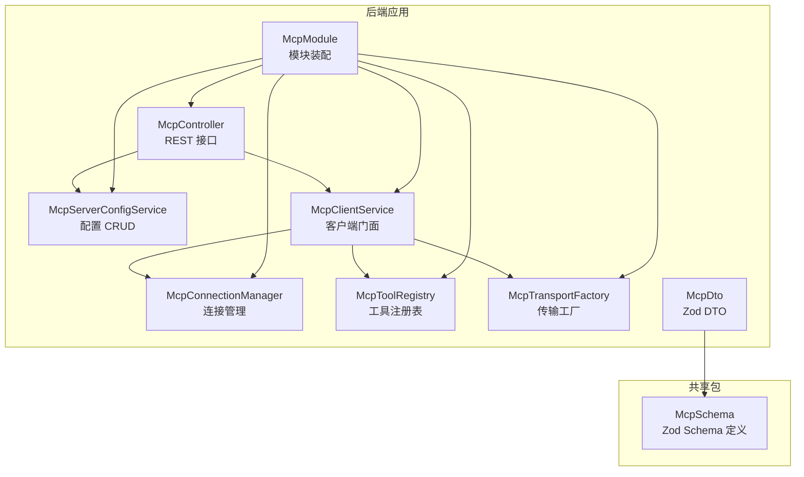
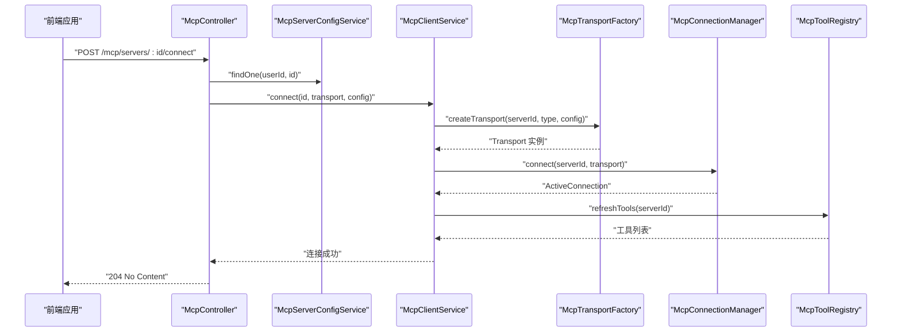
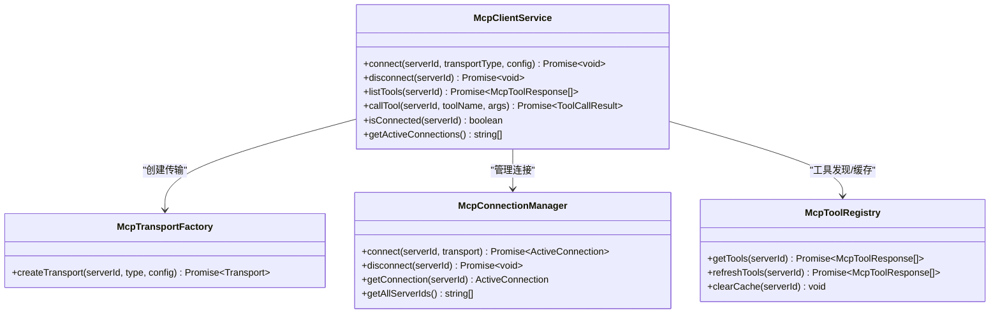
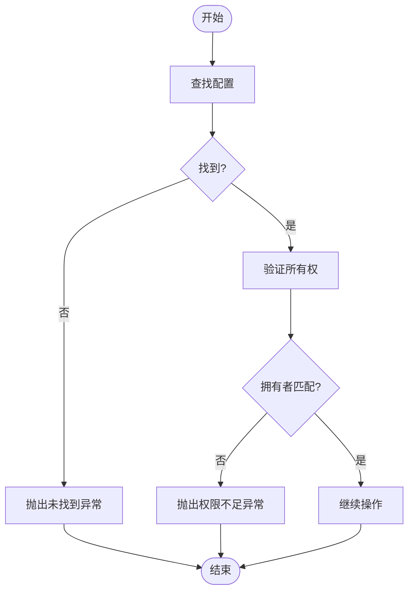
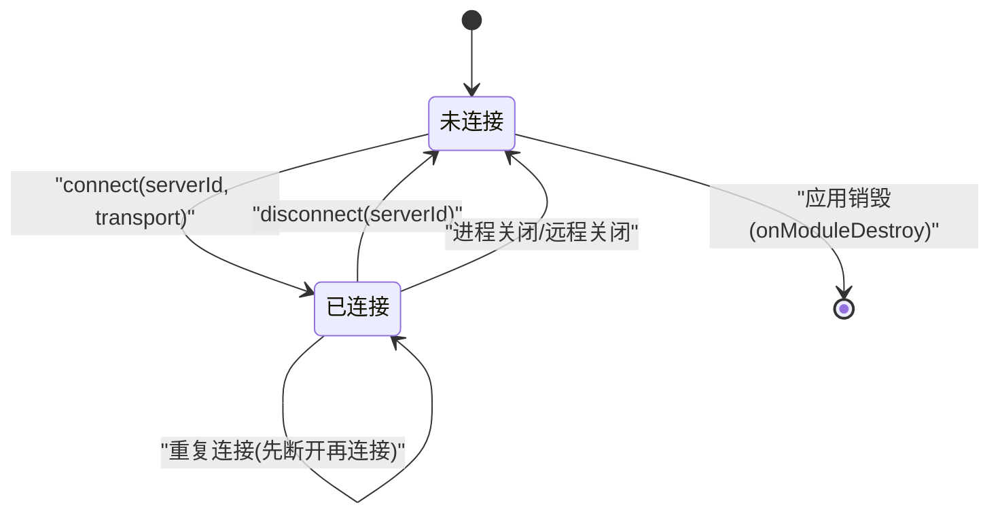
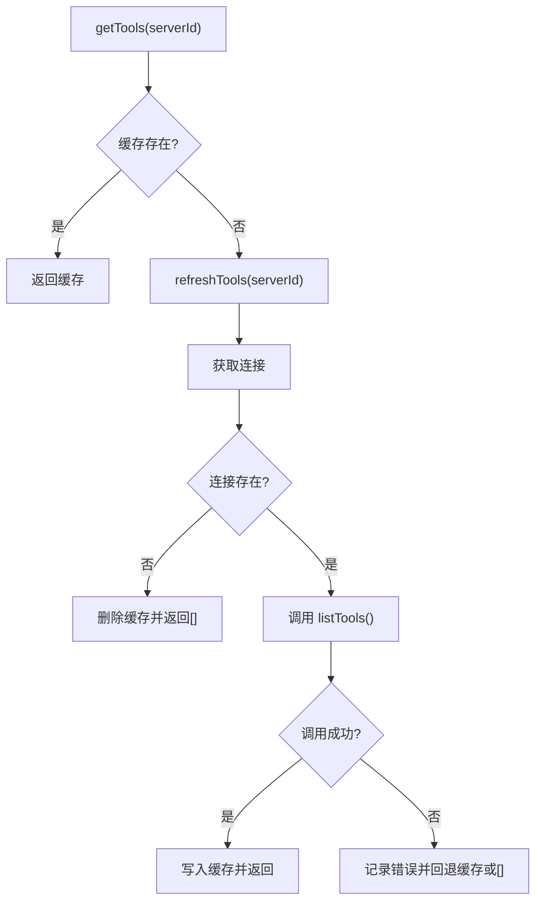
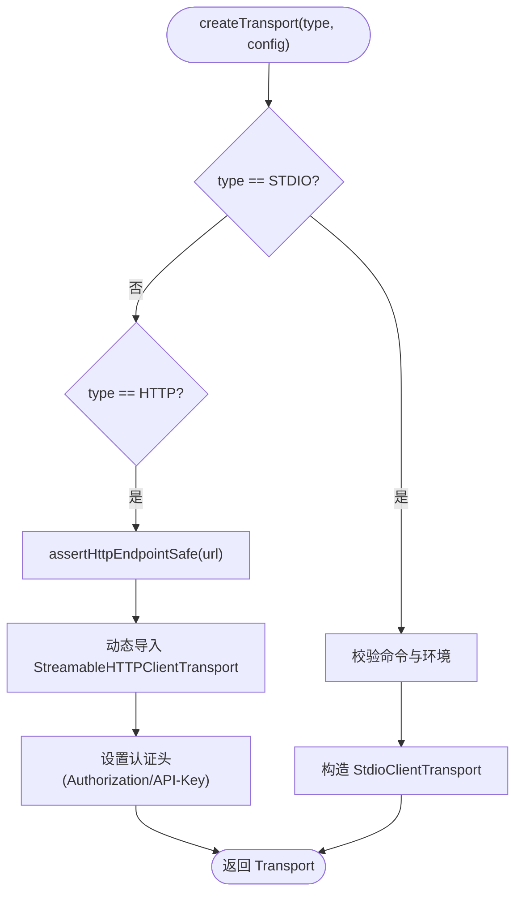
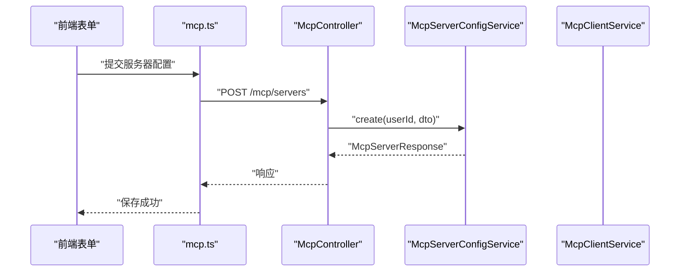
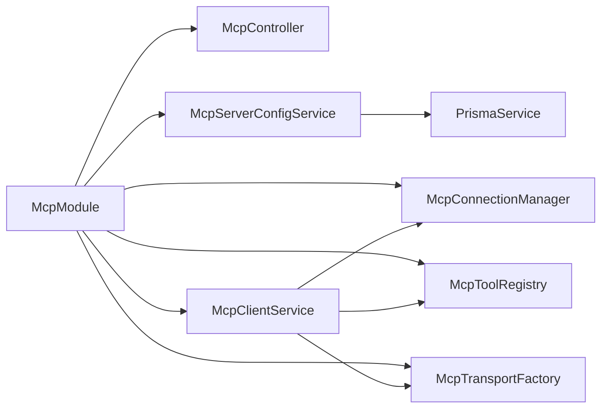

# MCP工具模块

<cite>
**本文档引用的文件**
- [mcp-client.service.ts](file://apps/backend/src/mcp/mcp-client.service.ts)
- [mcp-server-config.service.ts](file://apps/backend/src/mcp/mcp-server-config.service.ts)
- [mcp-connection.manager.ts](file://apps/backend/src/mcp/core/mcp-connection.manager.ts)
- [mcp-tool.registry.ts](file://apps/backend/src/mcp/core/mcp-tool.registry.ts)
- [mcp-transport.factory.ts](file://apps/backend/src/mcp/core/mcp-transport.factory.ts)
- [mcp.controller.ts](file://apps/backend/src/mcp/mcp.controller.ts)
- [mcp.dto.ts](file://apps/backend/src/mcp/mcp.dto.ts)
- [mcp.module.ts](file://apps/backend/src/mcp/mcp.module.ts)
- [mcp.schema.ts](file://packages/shared/src/schemas/mcp.schema.ts)
- [throttling.constants.ts](file://apps/backend/src/common/throttling/throttling.constants.ts)
- [mcp-client.service.spec.ts](file://apps/backend/tests/mcp/mcp-client.service.spec.ts)
- [mcp-server-config.service.spec.ts](file://apps/backend/tests/mcp/mcp-server-config.service.spec.ts)
- [mcp-transport.factory.spec.ts](file://apps/backend/tests/mcp/mcp-transport.factory.spec.ts)
- [McpServerForm.vue](file://apps/frontend/src/features/mcp/components/McpServerForm.vue)
- [mcp.ts](file://apps/frontend/src/features/mcp/api/mcp.ts)
</cite>

## 目录

1. [简介](#简介)
2. [项目结构](#项目结构)
3. [核心组件](#核心组件)
4. [架构总览](#架构总览)
5. [详细组件分析](#详细组件分析)
6. [依赖关系分析](#依赖关系分析)
7. [性能考虑](#性能考虑)
8. [故障排除指南](#故障排除指南)
9. [结论](#结论)
10. [附录](#附录)

## 简介

本文件为 Lumina Todo 后端 MCP（Model Context Protocol）工具模块的权威技术文档。该模块实现了对 MCP 协议的完整支持，包括客户端连接管理、服务器配置解析与持久化、传输层抽象、工具注册与发现、以及工具调用的异步处理流程。文档将从系统架构、组件职责、数据流、错误处理策略、性能优化与扩展方案等维度进行深入剖析，并提供开发指南、调试技巧与监控建议。

## 项目结构

MCP 模块位于后端应用的 mcp 目录下，采用按职责分层的设计：

- 控制器层：暴露 REST API，负责鉴权、参数校验与限流
- 服务层：封装业务逻辑，如服务器配置管理、客户端交互、连接与工具缓存
- 核心层：抽象传输层、管理连接生命周期、维护工具注册表
- 数据传输对象：基于共享包的 Zod Schema，确保前后端一致的数据契约
- 测试：单元测试覆盖关键流程与边界条件

**图表来源**

- [mcp.controller.ts:1-209](file://apps/backend/src/mcp/mcp.controller.ts#L1-209)
- [mcp-server-config.service.ts:1-156](file://apps/backend/src/mcp/mcp-server-config.service.ts#L1-156)
- [mcp-client.service.ts:1-124](file://apps/backend/src/mcp/mcp-client.service.ts#L1-124)
- [mcp-connection.manager.ts:1-101](file://apps/backend/src/mcp/core/mcp-connection.manager.ts#L1-101)
- [mcp-tool.registry.ts:1-48](file://apps/backend/src/mcp/core/mcp-tool.registry.ts#L1-48)
- [mcp-transport.factory.ts:1-220](file://apps/backend/src/mcp/core/mcp-transport.factory.ts#L1-220)
- [mcp.dto.ts:1-59](file://apps/backend/src/mcp/mcp.dto.ts#L1-59)
- [mcp.module.ts:1-25](file://apps/backend/src/mcp/mcp.module.ts#L1-25)
- [mcp.schema.ts:1-220](file://packages/shared/src/schemas/mcp.schema.ts#L1-220)

**章节来源**

- [mcp.module.ts:1-25](file://apps/backend/src/mcp/mcp.module.ts#L1-25)
- [mcp.controller.ts:1-209](file://apps/backend/src/mcp/mcp.controller.ts#L1-209)

## 核心组件

- McpClientService：客户端门面，统一管理连接、工具发现与调用
- McpServerConfigService：服务器配置的 CRUD 与权限校验
- McpConnectionManager：连接生命周期管理与资源清理
- McpToolRegistry：工具注册表与缓存
- McpTransportFactory：传输层抽象与安全校验
- McpController：REST API 控制器，集成鉴权、限流与业务编排
- McpDto 与共享 Schema：前后端一致的数据契约

**章节来源**

- [mcp-client.service.ts:17-124](file://apps/backend/src/mcp/mcp-client.service.ts#L17-124)
- [mcp-server-config.service.ts:10-156](file://apps/backend/src/mcp/mcp-server-config.service.ts#L10-156)
- [mcp-connection.manager.ts:12-101](file://apps/backend/src/mcp/core/mcp-connection.manager.ts#L12-101)
- [mcp-tool.registry.ts:6-48](file://apps/backend/src/mcp/core/mcp-tool.registry.ts#L6-48)
- [mcp-transport.factory.ts:10-220](file://apps/backend/src/mcp/core/mcp-transport.factory.ts#L10-220)
- [mcp.controller.ts:40-209](file://apps/backend/src/mcp/mcp.controller.ts#L40-209)
- [mcp.dto.ts:14-59](file://apps/backend/src/mcp/mcp.dto.ts#L14-59)
- [mcp.schema.ts:185-220](file://packages/shared/src/schemas/mcp.schema.ts#L185-220)

## 架构总览

MCP 模块遵循“控制器-服务-核心”的分层架构，结合传输工厂与连接管理器实现对不同传输协议（STDIO、HTTP）的统一抽象。客户端门面协调传输、连接与工具注册表，完成工具发现与调用；控制器负责鉴权、限流与请求编排。

**图表来源**

- [mcp.controller.ts:140-148](file://apps/backend/src/mcp/mcp.controller.ts#L140-148)
- [mcp-client.service.ts:33-47](file://apps/backend/src/mcp/mcp-client.service.ts#L33-47)
- [mcp-transport.factory.ts:112-126](file://apps/backend/src/mcp/core/mcp-transport.factory.ts#L112-126)
- [mcp-connection.manager.ts:23-73](file://apps/backend/src/mcp/core/mcp-connection.manager.ts#L23-73)
- [mcp-tool.registry.ts:20-42](file://apps/backend/src/mcp/core/mcp-tool.registry.ts#L20-42)

**章节来源**

- [mcp.controller.ts:140-148](file://apps/backend/src/mcp/mcp.controller.ts#L140-148)
- [mcp-client.service.ts:33-47](file://apps/backend/src/mcp/mcp-client.service.ts#L33-47)

## 详细组件分析

### McpClientService：客户端门面

- 职责
  - 统一连接管理：创建传输、建立连接、预热工具注册表
  - 工具发现：延迟连接与缓存策略
  - 工具调用：参数校验、调用转发与结果封装
  - 连接状态查询与断开清理
- 关键流程
  - connect：创建传输 → 连接 → 刷新工具
  - listTools：检查连接 → 查询注册表（含缓存）
  - callTool：检查连接与工具存在性 → 调用并返回标准化结果
  - disconnect：清理缓存 → 断开连接
- 错误处理
  - 连接失败、工具不存在、调用异常均记录日志并抛出
- 性能特性
  - 工具列表缓存减少重复查询
  - 懒连接降低初始负载

**图表来源**

- [mcp-client.service.ts:17-124](file://apps/backend/src/mcp/mcp-client.service.ts#L17-124)
- [mcp-transport.factory.ts:112-126](file://apps/backend/src/mcp/core/mcp-transport.factory.ts#L112-126)
- [mcp-connection.manager.ts:23-95](file://apps/backend/src/mcp/core/mcp-connection.manager.ts#L23-95)
- [mcp-tool.registry.ts:12-46](file://apps/backend/src/mcp/core/mcp-tool.registry.ts#L12-46)

**章节来源**

- [mcp-client.service.ts:17-124](file://apps/backend/src/mcp/mcp-client.service.ts#L17-124)

### McpServerConfigService：服务器配置解析与持久化

- 职责
  - 用户维度的 MCP Server 配置 CRUD
  - 权限校验（所有权验证）
  - 响应体转换（包含时间戳）
- 关键点
  - findEnabled：用于 AI 自动发现工具
  - toResponse：将数据库实体映射为 API 响应
  - validateOwnership：防止越权访问
- 错误处理
  - 未找到与权限不足分别抛出 NotFoundException 与 ForbiddenException

**图表来源**

- [mcp-server-config.service.ts:50-127](file://apps/backend/src/mcp/mcp-server-config.service.ts#L50-127)

**章节来源**

- [mcp-server-config.service.ts:10-156](file://apps/backend/src/mcp/mcp-server-config.service.ts#L10-156)

### McpConnectionManager：连接生命周期管理

- 职责
  - 维护 serverId 到 ActiveConnection 的映射
  - 生命周期：connect → onModuleDestroy 清理 → disconnect
  - 标准化连接行为与错误日志
- 关键点
  - 对 STDIO 传输绑定 stderr、onclose、onerror 回调
  - requestTimeout 在客户端选项中设置
- 错误处理
  - 连接失败记录错误并抛出
  - 断开异常时删除连接并记录

**图表来源**

- [mcp-connection.manager.ts:13-101](file://apps/backend/src/mcp/core/mcp-connection.manager.ts#L13-101)

**章节来源**

- [mcp-connection.manager.ts:13-101](file://apps/backend/src/mcp/core/mcp-connection.manager.ts#L13-101)

### McpToolRegistry：工具注册与缓存

- 职责
  - 缓存每个 serverId 的工具列表
  - 通过 Client.listTools 刷新工具
  - 清理缓存与回退策略
- 关键点
  - 缓存命中直接返回
  - 连接不存在时清理缓存并返回空列表
  - 刷新失败时回退到旧缓存或空列表

**图表来源**

- [mcp-tool.registry.ts:12-46](file://apps/backend/src/mcp/core/mcp-tool.registry.ts#L12-46)

**章节来源**

- [mcp-tool.registry.ts:6-48](file://apps/backend/src/mcp/core/mcp-tool.registry.ts#L6-48)

### McpTransportFactory：传输层抽象与安全校验

- 职责
  - 根据传输类型创建 Transport 实例
  - 安全校验：阻止私有/环回地址、限制协议、DNS 解析校验
  - 环境控制：STDIO 在生产环境需显式允许并白名单命令
  - HTTP 认证：支持 Bearer/OAuth/API Key
- 关键点
  - STDIO：仅传递允许的环境变量，避免泄露敏感信息
  - HTTP：动态导入 StreamableHTTPClientTransport
- 错误处理
  - 不支持的协议、被阻止的主机、解析失败、未允许的命令均抛错

**图表来源**

- [mcp-transport.factory.ts:112-218](file://apps/backend/src/mcp/core/mcp-transport.factory.ts#L112-218)

**章节来源**

- [mcp-transport.factory.ts:10-220](file://apps/backend/src/mcp/core/mcp-transport.factory.ts#L10-220)

### 控制器与API：MCP 工具开发与使用

- McpController
  - 提供服务器配置 CRUD、连接/断开、工具发现与调用
  - 集成 JWT 鉴权与多窗口限流策略
- 前端集成
  - McpServerForm.vue：可视化配置 STDIO/HTTP 传输与认证
  - mcp.ts：封装 API 调用，设置超时与错误处理

**图表来源**

- [McpServerForm.vue:100-135](file://apps/frontend/src/features/mcp/components/McpServerForm.vue#L100-135)
- [mcp.ts:36-47](file://apps/frontend/src/features/mcp/api/mcp.ts#L36-47)
- [mcp.controller.ts:51-58](file://apps/backend/src/mcp/mcp.controller.ts#L51-58)
- [mcp-server-config.service.ts:18-33](file://apps/backend/src/mcp/mcp-server-config.service.ts#L18-33)

**章节来源**

- [mcp.controller.ts:40-209](file://apps/backend/src/mcp/mcp.controller.ts#L40-209)
- [McpServerForm.vue:100-135](file://apps/frontend/src/features/mcp/components/McpServerForm.vue#L100-135)
- [mcp.ts:16-107](file://apps/frontend/src/features/mcp/api/mcp.ts#L16-107)

## 依赖关系分析

- 模块装配
  - McpModule 导出 McpServerConfigService 与 McpClientService，便于其他模块复用
- 组件耦合
  - McpClientService 依赖三核心组件，形成高内聚低耦合
  - 传输工厂与连接管理器解耦于控制器与服务
- 外部依赖
  - 使用 @modelcontextprotocol/sdk 的 Client 与 Transport
  - 使用 Prisma 进行配置持久化
  - 使用 Zod Schema 进行数据校验

**图表来源**

- [mcp.module.ts:13-22](file://apps/backend/src/mcp/mcp.module.ts#L13-22)

**章节来源**

- [mcp.module.ts:1-25](file://apps/backend/src/mcp/mcp.module.ts#L1-25)

## 性能考虑

- 连接与工具缓存
  - 工具注册表缓存显著降低重复查询成本
  - 懒连接策略避免不必要的初始化
- 传输层优化
  - STDIO 仅传递必要环境变量，减少注入风险与启动开销
  - HTTP 传输使用动态导入，按需加载
- 限流策略
  - 连接、工具发现与工具调用分别配置不同窗口与阈值，防止滥用
- 超时设置
  - 工具调用与连接超时根据场景设置，平衡可靠性与用户体验

**章节来源**

- [mcp-tool.registry.ts:12-42](file://apps/backend/src/mcp/core/mcp-tool.registry.ts#L12-42)
- [mcp-transport.factory.ts:177-187](file://apps/backend/src/mcp/core/mcp-transport.factory.ts#L177-187)
- [throttling.constants.ts:144-160](file://apps/backend/src/common/throttling/throttling.constants.ts#L144-160)
- [mcp.ts:60-91](file://apps/frontend/src/features/mcp/api/mcp.ts#L60-91)

## 故障排除指南

- 连接失败
  - 检查传输类型与配置是否匹配
  - 确认 STDIO 命令是否在允许列表中
  - 校验 HTTP URL 是否被阻止或 DNS 解析失败
- 工具不可用
  - 确认服务器已连接且工具列表已刷新
  - 检查工具名称是否正确
- 权限问题
  - 确保操作的服务器属于当前用户
- 日志定位
  - 关注连接管理器与传输工厂的日志输出
  - 前端可观察网络请求与超时情况

**章节来源**

- [mcp-transport.factory.spec.ts:94-126](file://apps/backend/tests/mcp/mcp-transport.factory.spec.ts#L94-126)
- [mcp-client.service.spec.ts:118-130](file://apps/backend/tests/mcp/mcp-client.service.spec.ts#L118-130)
- [mcp-server-config.service.spec.ts:104-114](file://apps/backend/tests/mcp/mcp-server-config.service.spec.ts#L104-114)

## 结论

MCP 工具模块通过清晰的分层设计与严格的传输安全策略，提供了稳定、可扩展的外部工具集成能力。客户端门面简化了上层调用，连接与工具注册表保障了性能与一致性，控制器与限流策略确保了安全性与稳定性。建议在生产环境中严格配置 STDIO 白名单与 HTTP 安全规则，并结合日志与监控持续优化性能与可用性。

## 附录

### MCP 协议与数据模型

- 传输类型
  - STDIO：本地进程通信
  - HTTP：标准 HTTP(S) 通信
- 服务器配置
  - 名称、描述、传输类型、配置（STDIO/HTTP）、启用状态
- 工具响应
  - 名称、描述、输入 Schema
- 工具调用结果
  - 内容数组（支持多种类型）、错误标记

**章节来源**

- [mcp.schema.ts:6-11](file://packages/shared/src/schemas/mcp.schema.ts#L6-11)
- [mcp.schema.ts:185-220](file://packages/shared/src/schemas/mcp.schema.ts#L185-220)

### 开发指南与最佳实践

- 配置管理
  - 使用前端表单组件构建配置，后端通过 Zod 校验
  - 服务器配置与用户绑定，严格权限校验
- 传输安全
  - 生产环境禁用 STDIO 或明确白名单命令
  - HTTP 仅允许公网地址，避免内网暴露
- 工具调用
  - 先发现后调用，确保工具存在
  - 设置合理超时与重试策略
- 监控与告警
  - 连接状态、工具调用成功率、错误日志
  - 限流触发与异常峰值监控

**章节来源**

- [McpServerForm.vue:27-46](file://apps/frontend/src/features/mcp/components/McpServerForm.vue#L27-46)
- [mcp-transport.factory.ts:91-110](file://apps/backend/src/mcp/core/mcp-transport.factory.ts#L91-110)
- [mcp.controller.ts:189-207](file://apps/backend/src/mcp/mcp.controller.ts#L189-207)

### 扩展自定义传输协议

- 新增步骤
  - 在传输工厂中新增类型分支与校验逻辑
  - 实现自定义 Transport 并在工厂中返回
  - 在控制器与前端表单中补充对应配置项
- 注意事项
  - 保持与现有安全策略一致（URL 校验、DNS 解析、环境变量过滤）
  - 明确超时与错误处理策略
  - 提供完善的单元测试覆盖

**章节来源**

- [mcp-transport.factory.ts:112-126](file://apps/backend/src/mcp/core/mcp-transport.factory.ts#L112-126)
- [mcp.schema.ts:123-143](file://packages/shared/src/schemas/mcp.schema.ts#L123-143)
