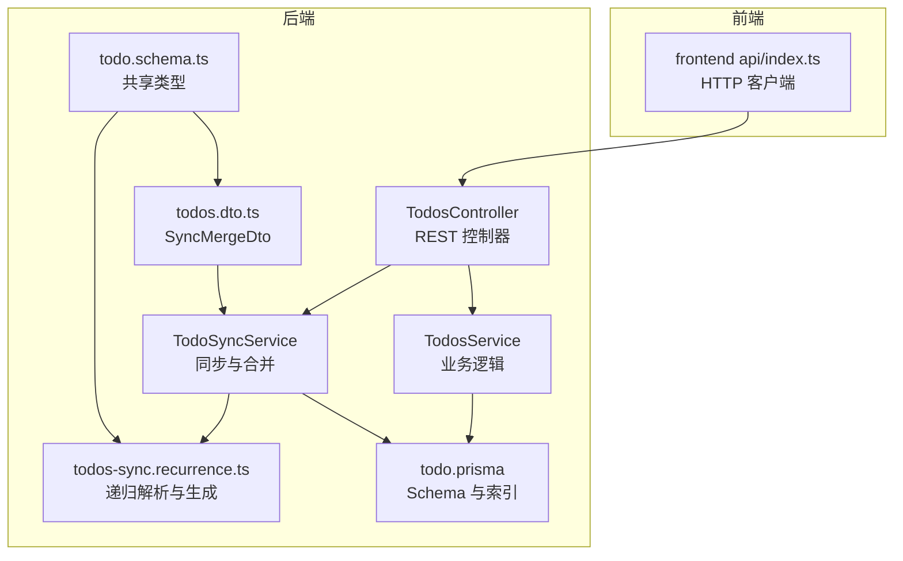
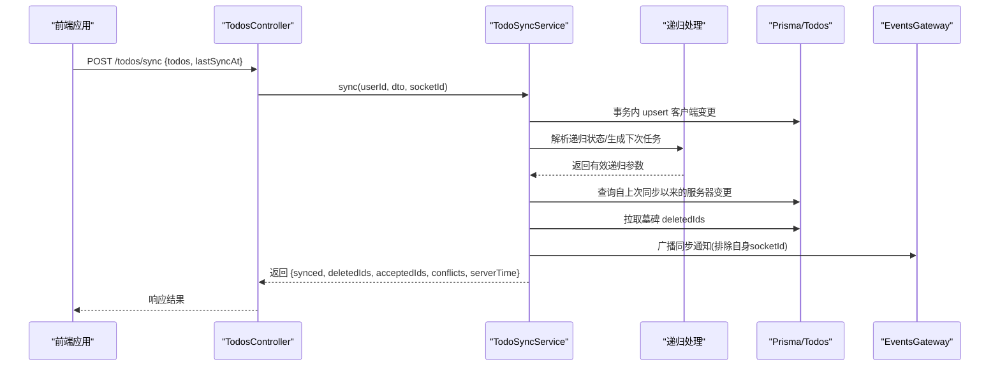
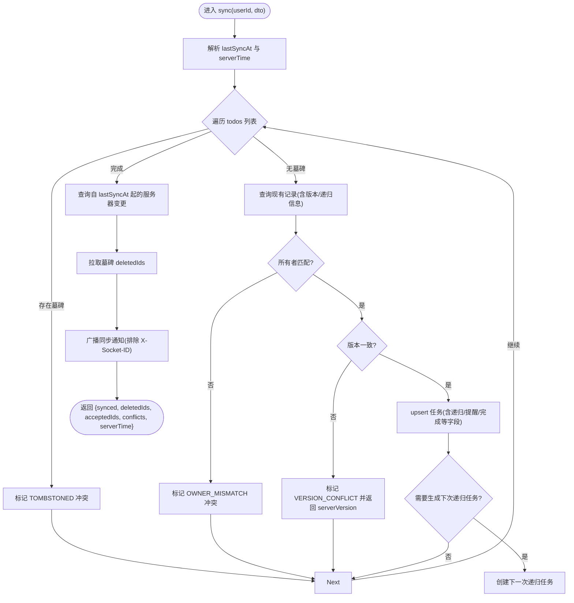
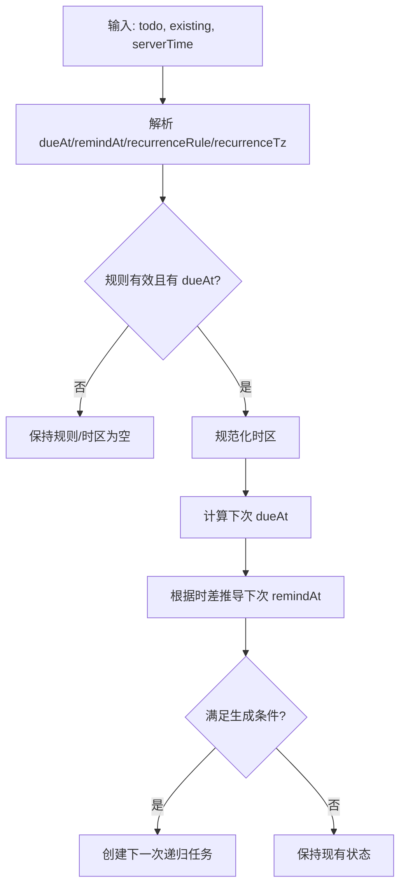
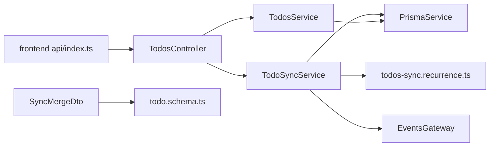
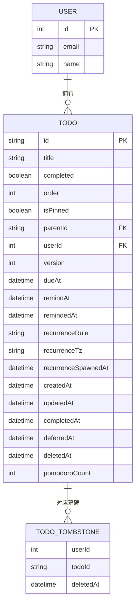

# 任务管理模块

<cite>
**本文引用的文件**
- [apps/backend/src/todos/todos.controller.ts](file://apps/backend/src/todos/todos.controller.ts)
- [apps/backend/src/todos/todos.service.ts](file://apps/backend/src/todos/todos.service.ts)
- [apps/backend/src/todos/todos-sync.service.ts](file://apps/backend/src/todos/todos-sync.service.ts)
- [apps/backend/src/todos/todos-sync.recurrence.ts](file://apps/backend/src/todos/todos-sync.recurrence.ts)
- [apps/backend/src/todos/todos.dto.ts](file://apps/backend/src/todos/todos.dto.ts)
- [apps/backend/src/todos/todos.module.ts](file://apps/backend/src/todos/todos.module.ts)
- [apps/backend/prisma/schema/todo.prisma](file://apps/backend/prisma/schema/todo.prisma)
- [packages/shared/src/schemas/todo.schema.ts](file://packages/shared/src/schemas/todo.schema.ts)
- [apps/frontend/src/features/todo/api/index.ts](file://apps/frontend/src/features/todo/api/index.ts)
</cite>

## 目录
1. [简介](#简介)
2. [项目结构](#项目结构)
3. [核心组件](#核心组件)
4. [架构总览](#架构总览)
5. [详细组件分析](#详细组件分析)
6. [依赖分析](#依赖分析)
7. [性能考虑](#性能考虑)
8. [故障排查指南](#故障排查指南)
9. [结论](#结论)
10. [附录](#附录)

## 简介
本文件系统化梳理 Lumina Todo 任务管理模块的设计与实现，覆盖以下关键主题：
- 任务 CRUD 接口与业务逻辑：TodosController 的 RESTful 设计、TodosService 的数据访问与状态管理
- 多设备同步机制：TodosSyncService 的离线优先合并策略、冲突检测与增量同步算法
- 递归任务处理：周期规则解析、时区规范化、下次递归任务生成
- 数据模型与索引：Prisma schema、查询优化策略
- 批量操作与回收站：批量删除、清空回收站、墓碑机制
- 最佳实践与扩展：自定义属性扩展方法、迁移方案建议

## 项目结构
后端采用 NestJS 架构，任务模块位于 apps/backend/src/todos，包含控制器、服务、DTO、同步工具与递归处理逻辑；共享类型定义位于 packages/shared；前端通过 api/index.ts 调用后端接口。

**图表来源**
- [apps/backend/src/todos/todos.controller.ts](file://apps/backend/src/todos/todos.controller.ts)
- [apps/backend/src/todos/todos.service.ts](file://apps/backend/src/todos/todos.service.ts)
- [apps/backend/src/todos/todos-sync.service.ts](file://apps/backend/src/todos/todos-sync.service.ts)
- [apps/backend/src/todos/todos-sync.recurrence.ts](file://apps/backend/src/todos/todos-sync.recurrence.ts)
- [apps/backend/src/todos/todos.dto.ts](file://apps/backend/src/todos/todos.dto.ts)
- [apps/backend/prisma/schema/todo.prisma](file://apps/backend/prisma/schema/todo.prisma)
- [packages/shared/src/schemas/todo.schema.ts](file://packages/shared/src/schemas/todo.schema.ts)
- [apps/frontend/src/features/todo/api/index.ts](file://apps/frontend/src/features/todo/api/index.ts)

**章节来源**
- [apps/backend/src/todos/todos.module.ts](file://apps/backend/src/todos/todos.module.ts)
- [apps/backend/src/todos/todos.controller.ts](file://apps/backend/src/todos/todos.controller.ts)
- [apps/backend/src/todos/todos.service.ts](file://apps/backend/src/todos/todos.service.ts)
- [apps/backend/src/todos/todos-sync.service.ts](file://apps/backend/src/todos/todos-sync.service.ts)
- [apps/backend/src/todos/todos-sync.recurrence.ts](file://apps/backend/src/todos/todos-sync.recurrence.ts)
- [apps/backend/src/todos/todos.dto.ts](file://apps/backend/src/todos/todos.dto.ts)
- [apps/backend/prisma/schema/todo.prisma](file://apps/backend/prisma/schema/todo.prisma)
- [packages/shared/src/schemas/todo.schema.ts](file://packages/shared/src/schemas/todo.schema.ts)
- [apps/frontend/src/features/todo/api/index.ts](file://apps/frontend/src/features/todo/api/index.ts)

## 核心组件
- TodosController：提供 /todos 的 REST 接口，包括同步、查询全部、回收站、恢复、永久删除、清空回收站等。
- TodosService：封装任务查询、回收站管理、恢复与永久删除、清空回收站等业务逻辑。
- TodoSyncService：实现离线优先的增量同步与合并，处理冲突、递归任务生成、墓碑删除标识返回。
- todos-sync.recurrence.ts：解析客户端/服务端递归状态，决定是否生成下一次递归任务。
- todos.dto.ts：基于共享 Schema 的 DTO，约束同步请求体。
- todo.prisma：定义 Todo 与 TodoTombstone 模型及索引，支撑高效查询与排序。
- shared todo.schema.ts：统一前后端任务与同步数据结构定义。
- 前端 api/index.ts：调用后端 /todos 接口，传递 X-Socket-ID 头用于事件广播去重。

**章节来源**
- [apps/backend/src/todos/todos.controller.ts](file://apps/backend/src/todos/todos.controller.ts)
- [apps/backend/src/todos/todos.service.ts](file://apps/backend/src/todos/todos.service.ts)
- [apps/backend/src/todos/todos-sync.service.ts](file://apps/backend/src/todos/todos-sync.service.ts)
- [apps/backend/src/todos/todos-sync.recurrence.ts](file://apps/backend/src/todos/todos-sync.recurrence.ts)
- [apps/backend/src/todos/todos.dto.ts](file://apps/backend/src/todos/todos.dto.ts)
- [apps/backend/prisma/schema/todo.prisma](file://apps/backend/prisma/schema/todo.prisma)
- [packages/shared/src/schemas/todo.schema.ts](file://packages/shared/src/schemas/todo.schema.ts)
- [apps/frontend/src/features/todo/api/index.ts](file://apps/frontend/src/features/todo/api/index.ts)

## 架构总览
后端模块通过 NestJS 注入 Prisma 与事件网关，完成数据持久化与多设备同步通知；前端通过统一 API 客户端发起请求，并在 WebSocket 层面避免重复通知。

**图表来源**
- [apps/backend/src/todos/todos.controller.ts](file://apps/backend/src/todos/todos.controller.ts)
- [apps/backend/src/todos/todos-sync.service.ts](file://apps/backend/src/todos/todos-sync.service.ts)
- [apps/backend/src/todos/todos-sync.recurrence.ts](file://apps/backend/src/todos/todos-sync.recurrence.ts)
- [apps/backend/prisma/schema/todo.prisma](file://apps/backend/prisma/schema/todo.prisma)

## 详细组件分析

### TodosController：RESTful 接口设计
- 认证与授权：使用 JWT 守卫与 Bearer 认证，确保仅登录用户可访问。
- 接口职责：
  - POST /todos/sync：离线优先合并，返回合并后的增量数据、删除标识、接受列表与冲突列表。
  - GET /todos：获取当前用户未删除的任务列表，按置顶、顺序、创建时间排序。
  - GET /todos/trash：获取回收站中任务。
  - POST /todos/:id/restore：恢复指定任务。
  - DELETE /todos/:id/permanent：永久删除并写入墓碑。
  - DELETE /todos/trash/clear：清空回收站并批量写入墓碑。
- 请求头：支持 X-Socket-ID，用于事件广播去重。

**章节来源**
- [apps/backend/src/todos/todos.controller.ts](file://apps/backend/src/todos/todos.controller.ts)

### TodosService：任务 CRUD 与状态管理
- 查询：
  - findAll：按 isPinned 降序、order 升序、createdAt 降序排列。
  - findTrash：按 deletedAt 降序排列。
- 回收站管理：
  - restore：将 deletedAt 清空并版本号递增，触发同步通知。
  - deletePermanently：事务内写入墓碑并删除记录，触发同步通知。
  - clearTrash：批量写入墓碑并删除回收站任务，触发同步通知。

**章节来源**
- [apps/backend/src/todos/todos.service.ts](file://apps/backend/src/todos/todos.service.ts)

### TodoSyncService：多设备同步与冲突处理
- 墓碑检查：若客户端提交的 id 对应墓碑，则标记 TOMBSTONED 冲突。
- 所有者校验：若现有记录属于其他用户，标记 OWNER_MISMATCH 冲突。
- 版本冲突：严格比较 client/server version，不一致则标记 VERSION_CONFLICT 并返回 serverVersion。
- 递归状态解析：委托递归处理模块，决定是否生成下一次递归任务。
- 增量拉取：根据 lastSyncAt 拉取服务器端变更，初次同步排除回收站。
- 墓碑删除：返回 deletedIds，供前端删除本地缓存对应项。
- 通知去重：通过 X-Socket-ID 排除自身连接，避免重复广播。

**图表来源**
- [apps/backend/src/todos/todos-sync.service.ts](file://apps/backend/src/todos/todos-sync.service.ts)
- [apps/backend/src/todos/todos-sync.recurrence.ts](file://apps/backend/src/todos/todos-sync.recurrence.ts)

**章节来源**
- [apps/backend/src/todos/todos-sync.service.ts](file://apps/backend/src/todos/todos-sync.service.ts)

### 递归任务处理：周期规则与时区
- 规则枚举：DAILY/WEEKDAYS/WEEKLY/MONTHLY。
- 时区规范化：使用 Intl.DateTimeFormat 校验并标准化时区字符串。
- 下次到期与提醒时间计算：基于上次 dueAt 与 remindAt 的时差推导。
- 生成条件：仅当任务未完成、非删除、非子任务、且尚未生成过下次递归时才创建。

**图表来源**
- [apps/backend/src/todos/todos-sync.recurrence.ts](file://apps/backend/src/todos/todos-sync.recurrence.ts)

**章节来源**
- [apps/backend/src/todos/todos-sync.recurrence.ts](file://apps/backend/src/todos/todos-sync.recurrence.ts)

### 数据模型与索引：Prisma Schema
- Todo 模型字段：标题、完成状态、顺序、置顶、父任务、版本号、到期/提醒/已提醒、递归规则与时区、创建/更新/完成/延期/删除时间、番茄钟计数、用户外键。
- TodoTombstone 模型：记录用户-任务的墓碑与删除时间。
- 关键索引：
  - (userId, updatedAt)：加速按用户与更新时间的查询。
  - (userId, remindAt)：加速提醒任务查询。
  - (userId, dueAt)：加速到期任务查询。
  - (deletedAt)：加速回收站查询。

**章节来源**
- [apps/backend/prisma/schema/todo.prisma](file://apps/backend/prisma/schema/todo.prisma)

### 类型与 DTO：共享 Schema 与后端 DTO
- 共享 Schema（packages/shared）：
  - TodoSchema：定义任务字段与校验规则。
  - SyncItemSchema：同步项扩展点。
  - SyncMergeRequestSchema：批量同步请求体，包含 todos 数组与 lastSyncAt。
  - SyncConflictSchema/SyncResponseSchema：冲突与响应结构。
- 后端 DTO（apps/backend）：
  - SyncMergeDto：基于共享 Schema 的 Nest DTO，自动校验请求体。

**章节来源**
- [packages/shared/src/schemas/todo.schema.ts](file://packages/shared/src/schemas/todo.schema.ts)
- [apps/backend/src/todos/todos.dto.ts](file://apps/backend/src/todos/todos.dto.ts)

### 前端集成：API 客户端
- 提供 sync/findAll/findTrash/restore/deletePermanently/clearTrash 方法。
- 在同步时携带 X-Socket-ID 头，便于后端去重通知。

**章节来源**
- [apps/frontend/src/features/todo/api/index.ts](file://apps/frontend/src/features/todo/api/index.ts)

## 依赖分析
- 控制器依赖服务与同步服务，二者均依赖 Prisma 与事件网关。
- 同步服务依赖递归处理模块以解析与生成递归任务。
- DTO 依赖共享 Schema，确保前后端数据结构一致。
- 前端 API 客户端依赖共享类型与 HTTP 客户端。

**图表来源**
- [apps/backend/src/todos/todos.controller.ts](file://apps/backend/src/todos/todos.controller.ts)
- [apps/backend/src/todos/todos.service.ts](file://apps/backend/src/todos/todos.service.ts)
- [apps/backend/src/todos/todos-sync.service.ts](file://apps/backend/src/todos/todos-sync.service.ts)
- [apps/backend/src/todos/todos-sync.recurrence.ts](file://apps/backend/src/todos/todos-sync.recurrence.ts)
- [apps/backend/src/todos/todos.dto.ts](file://apps/backend/src/todos/todos.dto.ts)
- [packages/shared/src/schemas/todo.schema.ts](file://packages/shared/src/schemas/todo.schema.ts)
- [apps/frontend/src/features/todo/api/index.ts](file://apps/frontend/src/features/todo/api/index.ts)

**章节来源**
- [apps/backend/src/todos/todos.module.ts](file://apps/backend/src/todos/todos.module.ts)
- [apps/backend/src/todos/todos.controller.ts](file://apps/backend/src/todos/todos.controller.ts)
- [apps/backend/src/todos/todos.service.ts](file://apps/backend/src/todos/todos.service.ts)
- [apps/backend/src/todos/todos-sync.service.ts](file://apps/backend/src/todos/todos-sync.service.ts)
- [apps/backend/src/todos/todos-sync.recurrence.ts](file://apps/backend/src/todos/todos-sync.recurrence.ts)
- [apps/backend/src/todos/todos.dto.ts](file://apps/backend/src/todos/todos.dto.ts)
- [packages/shared/src/schemas/todo.schema.ts](file://packages/shared/src/schemas/todo.schema.ts)
- [apps/frontend/src/features/todo/api/index.ts](file://apps/frontend/src/features/todo/api/index.ts)

## 性能考虑
- 查询优化：
  - 使用索引 (userId, updatedAt)、(userId, remindAt)、(userId, dueAt) 降低排序与过滤成本。
  - 初次同步时排除 deletedAt 非空记录，减少初始传输量。
- 事务与一致性：
  - 同步过程使用事务，保证 upsert 与递归任务创建的一致性。
  - 永久删除与清空回收站使用批量写入墓碑，减少往返次数。
- 冲突与增量：
  - 严格版本号比较避免时钟漂移导致的误判。
  - 仅返回自 lastSyncAt 以来的服务器变更，降低带宽与 CPU 开销。
- 通知去重：
  - 通过 X-Socket-ID 排除自身连接，避免重复广播与渲染。

[本节为通用性能建议，无需特定文件来源]

## 故障排查指南
- 冲突类型定位：
  - TOMBSTONED：客户端提交的 id 已被墓碑化，确认是否已删除或跨设备并发删除。
  - OWNER_MISMATCH：任务属于其他用户，检查鉴权与用户上下文。
  - VERSION_CONFLICT：版本号不一致，提示 serverVersion，建议重试或合并策略调整。
- 同步异常：
  - 检查 lastSyncAt 是否为合法时间戳；若异常，服务端会回退到初始时间。
  - 确认 X-Socket-ID 是否正确传递，避免广播风暴。
- 递归任务未生成：
  - 确认 dueAt 存在且规则有效；检查时区是否被规范化为合法值。
  - 确保任务未完成、非删除、非子任务，且尚未生成过下次递归。
- 回收站问题：
  - 恢复/永久删除/清空回收站均会触发同步通知，检查事件网关是否正常工作。

**章节来源**
- [apps/backend/src/todos/todos-sync.service.ts](file://apps/backend/src/todos/todos-sync.service.ts)
- [apps/backend/src/todos/todos-sync.recurrence.ts](file://apps/backend/src/todos/todos-sync.recurrence.ts)
- [apps/backend/src/todos/todos.service.ts](file://apps/backend/src/todos/todos.service.ts)

## 结论
该模块以清晰的分层设计实现了任务 CRUD 与多设备同步，通过严格的版本控制与墓碑机制保障数据一致性；递归任务处理提供了灵活的周期性任务能力。结合合理的索引与事务策略，整体具备良好的扩展性与性能表现。建议在生产环境中持续关注冲突率与同步延迟，并根据业务需求扩展自定义属性与提醒策略。

[本节为总结性内容，无需特定文件来源]

## 附录

### 任务模型 ER 图

**图表来源**
- [apps/backend/prisma/schema/todo.prisma](file://apps/backend/prisma/schema/todo.prisma)

### 扩展自定义任务属性的最佳实践
- 新增字段建议：
  - 在 Prisma schema 中新增字段并设置默认值与索引（如需查询）。
  - 在共享 Schema 与后端 DTO 中同步扩展，确保前后端一致。
  - 在 TodosService/TodoSyncService 的 upsert/update 逻辑中纳入新字段。
- 迁移策略：
  - 使用 Prisma 迁移脚本逐步添加字段与索引。
  - 对历史数据提供默认值回填，避免空值影响查询。
  - 旧客户端兼容：对未知字段保持忽略，避免破坏同步流程。

**章节来源**
- [apps/backend/prisma/schema/todo.prisma](file://apps/backend/prisma/schema/todo.prisma)
- [packages/shared/src/schemas/todo.schema.ts](file://packages/shared/src/schemas/todo.schema.ts)
- [apps/backend/src/todos/todos.service.ts](file://apps/backend/src/todos/todos.service.ts)
- [apps/backend/src/todos/todos-sync.service.ts](file://apps/backend/src/todos/todos-sync.service.ts)