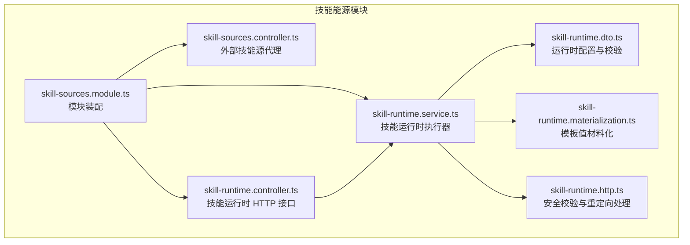
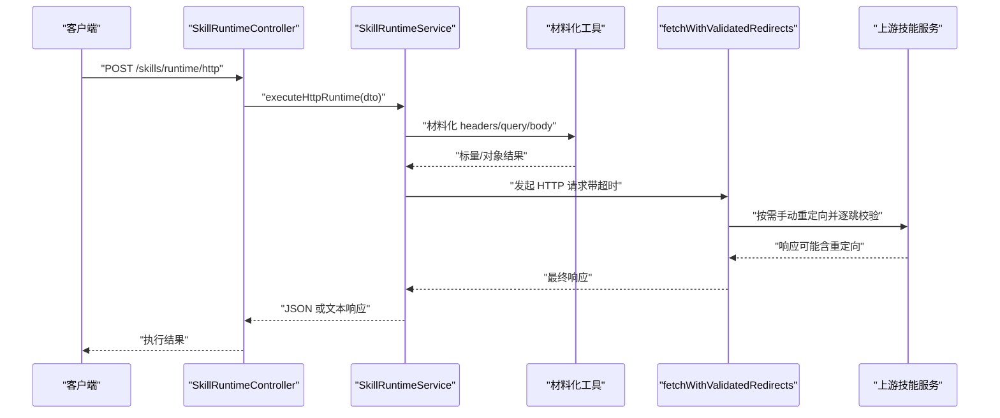
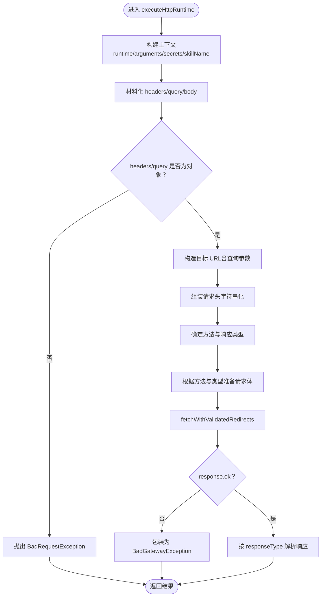
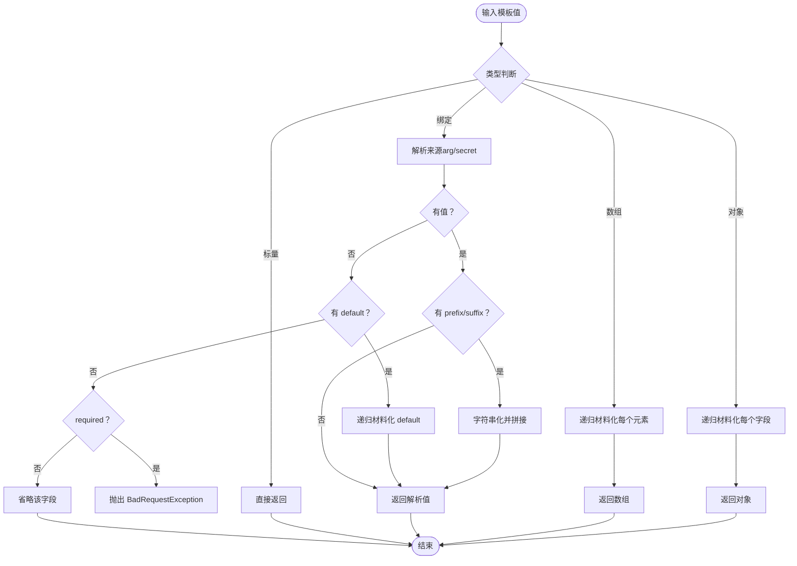
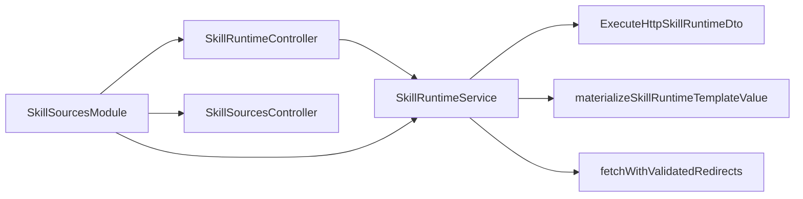

# 技能源模块

<cite>
**本文引用的文件**
- [apps/backend/src/skill-sources/skill-runtime.service.ts](file://apps/backend/src/skill-sources/skill-runtime.service.ts)
- [apps/backend/src/skill-sources/skill-runtime.controller.ts](file://apps/backend/src/skill-sources/skill-runtime.controller.ts)
- [apps/backend/src/skill-sources/skill-runtime.materialization.ts](file://apps/backend/src/skill-sources/skill-runtime.materialization.ts)
- [apps/backend/src/skill-sources/skill-runtime.dto.ts](file://apps/backend/src/skill-sources/skill-runtime.dto.ts)
- [apps/backend/src/skill-sources/skill-runtime.http.ts](file://apps/backend/src/skill-sources/skill-runtime.http.ts)
- [apps/backend/src/skill-sources/skill-sources.controller.ts](file://apps/backend/src/skill-sources/skill-sources.controller.ts)
- [apps/backend/src/skill-sources/skill-sources.module.ts](file://apps/backend/src/skill-sources/skill-sources.module.ts)
- [apps/backend/tests/skill-runtime.controller.spec.ts](file://apps/backend/tests/skill-runtime.controller.spec.ts)
- [apps/backend/tests/skill-runtime.service.spec.ts](file://apps/backend/tests/skill-runtime.service.spec.ts)
- [apps/backend/tests/skill-sources.controller.spec.ts](file://apps/backend/tests/skill-sources.controller.spec.ts)
- [apps/backend/src/common/index.ts](file://apps/backend/src/common/index.ts)
</cite>

## 目录
1. [简介](#简介)
2. [项目结构](#项目结构)
3. [核心组件](#核心组件)
4. [架构总览](#架构总览)
5. [组件详解](#组件详解)
6. [依赖关系分析](#依赖关系分析)
7. [性能与安全考量](#性能与安全考量)
8. [故障排查指南](#故障排查指南)
9. [结论](#结论)
10. [附录：开发与扩展指南](#附录开发与扩展指南)

## 简介
本文件系统性阐述 Lumina Todo 后端“技能能源模块”的实现与使用，重点覆盖以下方面：
- 外部技能代理机制：通过受信任主机白名单与手动重定向校验，代理拉取外部技能源，绕过浏览器 CORS 并限制体积与超时。
- 技能运行时服务：基于 HTTP 的通用技能运行时执行器，支持请求模板化、参数绑定、密钥注入、响应类型选择与超时控制。
- 材料化（Materialization）：将运行时模板值解析为最终标量或对象，支持从“参数”和“密钥”来源绑定，并可附加前缀/后缀。
- 配置与协议：技能运行时配置的数据结构、字段约束与传输协议；HTTP 调用链路与错误恢复策略。
- 安全与隔离：主机白名单、私网/回环地址阻断、手动重定向验证、超时与大小限制等安全与鲁棒性措施。
- 扩展与运维：技能开发指南、调试方法、性能监控建议、安全沙箱思路以及扩展自定义技能源适配器的方案。

## 项目结构
技能能源模块位于后端应用的 skill-sources 子目录中，包含控制器、服务、DTO、材料化工具与 HTTP 安全校验逻辑，并在模块中统一注册。

图表来源
- [apps/backend/src/skill-sources/skill-sources.module.ts:6-10](file://apps/backend/src/skill-sources/skill-sources.module.ts#L6-L10)
- [apps/backend/src/skill-sources/skill-runtime.controller.ts:12-22](file://apps/backend/src/skill-sources/skill-runtime.controller.ts#L12-L22)
- [apps/backend/src/skill-sources/skill-runtime.service.ts:13-96](file://apps/backend/src/skill-sources/skill-runtime.service.ts#L13-L96)
- [apps/backend/src/skill-sources/skill-runtime.dto.ts:62-98](file://apps/backend/src/skill-sources/skill-runtime.dto.ts#L62-L98)
- [apps/backend/src/skill-sources/skill-runtime.materialization.ts:134-182](file://apps/backend/src/skill-sources/skill-runtime.materialization.ts#L134-L182)
- [apps/backend/src/skill-sources/skill-runtime.http.ts:50-122](file://apps/backend/src/skill-sources/skill-runtime.http.ts#L50-L122)
- [apps/backend/src/skill-sources/skill-sources.controller.ts:160-202](file://apps/backend/src/skill-sources/skill-sources.controller.ts#L160-L202)

章节来源
- [apps/backend/src/skill-sources/skill-sources.module.ts:6-10](file://apps/backend/src/skill-sources/skill-sources.module.ts#L6-L10)
- [apps/backend/src/skill-sources/skill-runtime.controller.ts:12-22](file://apps/backend/src/skill-sources/skill-runtime.controller.ts#L12-L22)
- [apps/backend/src/skill-sources/skill-runtime.service.ts:13-96](file://apps/backend/src/skill-sources/skill-runtime.service.ts#L13-L96)
- [apps/backend/src/skill-sources/skill-runtime.dto.ts:62-98](file://apps/backend/src/skill-sources/skill-runtime.dto.ts#L62-L98)
- [apps/backend/src/skill-sources/skill-runtime.materialization.ts:134-182](file://apps/backend/src/skill-sources/skill-runtime.materialization.ts#L134-L182)
- [apps/backend/src/skill-sources/skill-runtime.http.ts:50-122](file://apps/backend/src/skill-sources/skill-runtime.http.ts#L50-L122)
- [apps/backend/src/skill-sources/skill-sources.controller.ts:160-202](file://apps/backend/src/skill-sources/skill-sources.controller.ts#L160-L202)

## 核心组件
- 技能运行时控制器（SkillRuntimeController）
  - 提供受 JWT 保护的 HTTP 接口，负责接收技能运行时请求并转发给服务层。
- 技能运行时服务（SkillRuntimeService）
  - 实现运行时执行逻辑：模板值材料化、URL 查询/头/体组装、安全校验、手动重定向、超时控制与响应解析。
- 材料化工具（materialization）
  - 将模板值解析为最终标量或对象，支持从参数与密钥来源绑定，支持默认值、必填与前后缀拼接。
- 运行时 DTO 与 Schema
  - 定义运行时配置结构、字段约束与校验规则，确保输入安全与一致性。
- HTTP 安全校验（fetchWithValidatedRedirects）
  - 主机白名单、协议限制、私网/回环阻断、逐跳重定向校验与最大重定向次数限制。
- 技能源控制器（SkillSourcesController）
  - 对外提供受信任主机白名单的外部技能源代理，手动跟随重定向并限制体积与超时，返回 Base64 编码内容。

章节来源
- [apps/backend/src/skill-sources/skill-runtime.controller.ts:12-22](file://apps/backend/src/skill-sources/skill-runtime.controller.ts#L12-L22)
- [apps/backend/src/skill-sources/skill-runtime.service.ts:13-96](file://apps/backend/src/skill-sources/skill-runtime.service.ts#L13-L96)
- [apps/backend/src/skill-sources/skill-runtime.materialization.ts:134-182](file://apps/backend/src/skill-sources/skill-runtime.materialization.ts#L134-L182)
- [apps/backend/src/skill-sources/skill-runtime.dto.ts:62-98](file://apps/backend/src/skill-sources/skill-runtime.dto.ts#L62-L98)
- [apps/backend/src/skill-sources/skill-runtime.http.ts:50-122](file://apps/backend/src/skill-sources/skill-runtime.http.ts#L50-L122)
- [apps/backend/src/skill-sources/skill-sources.controller.ts:160-202](file://apps/backend/src/skill-sources/skill-sources.controller.ts#L160-L202)

## 架构总览
下图展示技能运行时与技能源代理的整体交互流程，包括鉴权、限流、安全校验与错误恢复。

图表来源
- [apps/backend/src/skill-sources/skill-runtime.controller.ts:16-21](file://apps/backend/src/skill-sources/skill-runtime.controller.ts#L16-L21)
- [apps/backend/src/skill-sources/skill-runtime.service.ts:14-95](file://apps/backend/src/skill-sources/skill-runtime.service.ts#L14-L95)
- [apps/backend/src/skill-sources/skill-runtime.materialization.ts:134-182](file://apps/backend/src/skill-sources/skill-runtime.materialization.ts#L134-L182)
- [apps/backend/src/skill-sources/skill-runtime.http.ts:75-122](file://apps/backend/src/skill-sources/skill-runtime.http.ts#L75-L122)

## 组件详解

### 技能运行时控制器（SkillRuntimeController）
- 职责
  - 提供受 JWT 保护的 HTTP 接口，承载限流策略，将请求委托给服务层执行。
- 关键点
  - 使用 JwtAuthGuard 保证接口安全。
  - 应用限流常量 SKILL_RUNTIME_THROTTLE 控制调用频率。
  - 路由 /skills/runtime/http 仅支持 POST 方法。

章节来源
- [apps/backend/src/skill-sources/skill-runtime.controller.ts:12-22](file://apps/backend/src/skill-sources/skill-runtime.controller.ts#L12-L22)
- [apps/backend/src/common/index.ts](file://apps/backend/src/common/index.ts#L9)

### 技能运行时服务（SkillRuntimeService）
- 职责
  - 执行通用 HTTP 技能运行时，完成模板值材料化、URL 参数拼接、请求头与请求体组装、安全校验、手动重定向与响应解析。
- 关键流程
  - 材料化阶段：对 headers、query、body 分别进行模板值到标量/对象的解析。
  - URL 构造：将查询参数编码到 URLSearchParams。
  - 请求头处理：将对象头序列化为字符串。
  - 方法与响应类型：默认 POST，支持 json/text 响应。
  - 超时控制：默认 15 秒，可通过配置覆盖。
  - 错误处理：上游非 OK 响应包装为 BadGatewayException；异常传播与消息标准化。
- 安全校验
  - 通过 fetchWithValidatedRedirects 在每次重定向前进行安全校验，阻断私网/回环与不受信主机。

图表来源
- [apps/backend/src/skill-sources/skill-runtime.service.ts:14-95](file://apps/backend/src/skill-sources/skill-runtime.service.ts#L14-L95)
- [apps/backend/src/skill-sources/skill-runtime.materialization.ts:134-182](file://apps/backend/src/skill-sources/skill-runtime.materialization.ts#L134-L182)
- [apps/backend/src/skill-sources/skill-runtime.http.ts:75-122](file://apps/backend/src/skill-sources/skill-runtime.http.ts#L75-L122)

章节来源
- [apps/backend/src/skill-sources/skill-runtime.service.ts:14-95](file://apps/backend/src/skill-sources/skill-runtime.service.ts#L14-L95)

### 材料化（Materialization）
- 功能
  - 将模板值（字符串、标量、数组、对象、绑定）解析为最终可发送的标量或对象。
- 绑定来源
  - arg：来自传入 arguments 的嵌套路径访问。
  - secret：来自传入 secrets 的密钥映射。
- 默认值与必填
  - 支持 default 字段回退；若 required 或在运行时定义 required，则缺失时报错。
- 前缀/后缀
  - 可对解析后的标量添加 prefix/suffix。
- 返回类型
  - 标量直接返回；对象与数组递归处理；非法结构被过滤或忽略。

图表来源
- [apps/backend/src/skill-sources/skill-runtime.materialization.ts:134-182](file://apps/backend/src/skill-sources/skill-runtime.materialization.ts#L134-L182)

章节来源
- [apps/backend/src/skill-sources/skill-runtime.materialization.ts:134-182](file://apps/backend/src/skill-sources/skill-runtime.materialization.ts#L134-L182)

### 技能运行时配置与 DTO
- 结构
  - type 固定为 http。
  - secrets：密钥定义列表，支持 required。
  - request：url、method（GET/POST）、headers、query、body、timeoutMs、responseType（json/text）。
- 校验
  - 使用 Zod Schema 进行严格校验，限制长度、枚举与范围。
- 传输
  - 通过 HTTP 接口传递，服务层在执行前进行二次校验与安全检查。

章节来源
- [apps/backend/src/skill-sources/skill-runtime.dto.ts:62-98](file://apps/backend/src/skill-sources/skill-runtime.dto.ts#L62-L98)

### HTTP 安全校验与重定向
- 安全策略
  - 仅允许 http/https 协议。
  - 阻断 localhost、.localhost、.local 与私网/回环 IP。
  - DNS 解析后逐一校验 IP 地址。
- 重定向策略
  - 最大重定向次数为 5。
  - 303/301/302（当原方法为 POST 时）自动降级为 GET 且丢弃 body。
  - 每次重定向前重新校验目标主机与 IP。
- 异常
  - 不合法协议、不可达、过多重定向、缺少 location 头等均包装为 BadGatewayException 或 BadRequestException。

章节来源
- [apps/backend/src/skill-sources/skill-runtime.http.ts:50-122](file://apps/backend/src/skill-sources/skill-runtime.http.ts#L50-L122)

### 技能源代理（SkillSourcesController）
- 职责
  - 代理拉取外部技能源，绕过浏览器 CORS 限制。
- 白名单与限制
  - 受信任主机集合；Accept 头限定；最大体积限制；超时控制；最多 5 次重定向。
- 数据返回
  - 返回 sourceUrl、finalUrl、contentType、contentLength 与 bodyBase64。

章节来源
- [apps/backend/src/skill-sources/skill-sources.controller.ts:160-202](file://apps/backend/src/skill-sources/skill-sources.controller.ts#L160-L202)

## 依赖关系分析
- 模块装配
  - SkillSourcesModule 注册 SkillSourcesController、SkillRuntimeController 与 SkillRuntimeService。
- 控制器到服务
  - SkillRuntimeController 仅做薄封装，实际执行委托给 SkillRuntimeService。
- 服务内部依赖
  - SkillRuntimeService 依赖 DTO（类型与校验）、材料化工具与 HTTP 安全校验。
- 测试覆盖
  - 单元测试覆盖关键场景：参数绑定、密钥注入、必填缺失、私网阻断、重定向安全、上游失败包装等。

图表来源
- [apps/backend/src/skill-sources/skill-sources.module.ts:6-10](file://apps/backend/src/skill-sources/skill-sources.module.ts#L6-L10)
- [apps/backend/src/skill-sources/skill-runtime.controller.ts](file://apps/backend/src/skill-sources/skill-runtime.controller.ts#L14)
- [apps/backend/src/skill-sources/skill-runtime.service.ts:13-96](file://apps/backend/src/skill-sources/skill-runtime.service.ts#L13-L96)
- [apps/backend/src/skill-sources/skill-runtime.materialization.ts:134-182](file://apps/backend/src/skill-sources/skill-runtime.materialization.ts#L134-L182)
- [apps/backend/src/skill-sources/skill-runtime.http.ts:75-122](file://apps/backend/src/skill-sources/skill-runtime.http.ts#L75-L122)
- [apps/backend/src/skill-sources/skill-sources.controller.ts:160-202](file://apps/backend/src/skill-sources/skill-sources.controller.ts#L160-L202)

章节来源
- [apps/backend/src/skill-sources/skill-sources.module.ts:6-10](file://apps/backend/src/skill-sources/skill-sources.module.ts#L6-L10)
- [apps/backend/tests/skill-runtime.controller.spec.ts:9-14](file://apps/backend/tests/skill-runtime.controller.spec.ts#L9-L14)
- [apps/backend/tests/skill-runtime.service.spec.ts:15-42](file://apps/backend/tests/skill-runtime.service.spec.ts#L15-L42)
- [apps/backend/tests/skill-sources.controller.spec.ts:16-26](file://apps/backend/tests/skill-sources.controller.spec.ts#L16-L26)

## 性能与安全考量
- 性能
  - 默认超时 15 秒，可根据上游能力调整；避免长耗时请求导致线程阻塞。
  - 响应解析按 responseType 决定，避免不必要的 JSON 解析。
  - 重定向手动处理，减少自动跟随带来的不确定性。
- 安全
  - 严格的主机白名单与 IP 地址阻断，防止内网探测与 SSRF。
  - 逐跳重定向校验，防止跳板攻击。
  - 密钥与参数分离，避免敏感信息泄露。
- 资源管理
  - 技能源代理限制最大体积与读取流式数据，防止内存膨胀。
  - 限流与超时共同保障系统稳定性。

[本节为通用指导，不直接分析具体文件]

## 故障排查指南
- 常见错误与定位
  - 400（BadRequestException）
    - 运行时配置不合法（如协议不受支持、主机被阻断、字段超出长度限制）。
    - 必填参数或密钥缺失。
  - 502（BadGatewayException）
    - 上游服务不可达或返回非 OK。
    - 重定向过多、缺少 location 头、重定向目标被阻断。
- 调试步骤
  - 检查运行时配置是否满足 Schema 约束。
  - 使用最小化 DTO 复现问题，逐步加入模板值与绑定。
  - 查看服务日志中的错误消息与堆栈。
  - 在本地模拟 fetch 行为，验证材料化结果与最终请求。
- 单元测试参考
  - 运行时控制器鉴权与委托行为。
  - 运行时服务：参数绑定、密钥注入、私网阻断、重定向安全、上游失败包装。
  - 技能源代理：受信任重定向、体积限制、流式读取。

章节来源
- [apps/backend/tests/skill-runtime.controller.spec.ts:9-14](file://apps/backend/tests/skill-runtime.controller.spec.ts#L9-L14)
- [apps/backend/tests/skill-runtime.service.spec.ts:15-42](file://apps/backend/tests/skill-runtime.service.spec.ts#L15-L42)
- [apps/backend/tests/skill-sources.controller.spec.ts:16-26](file://apps/backend/tests/skill-sources.controller.spec.ts#L16-L26)

## 结论
技能能源模块通过“受信任代理 + 运行时模板 + 安全校验”的组合，提供了安全、可控且可扩展的技能执行与分发能力。其设计在保证易用性的同时，强化了安全边界与鲁棒性，适合在多租户与复杂网络环境中稳定运行。

[本节为总结，不直接分析具体文件]

## 附录：开发与扩展指南

### 技能开发指南
- 编写运行时配置
  - type 固定为 http；定义 request.url/method/headers/query/body/responseType。
  - 如需密钥，定义 secrets 列表并在执行时提供对应键值。
- 使用模板值与绑定
  - 在 headers/query/body 中使用绑定语法，从 arguments 或 secrets 获取值。
  - 为绑定设置 required/default/prefix/suffix，提升健壮性与可读性。
- 调试技巧
  - 先在本地验证材料化结果，再提交到后端。
  - 使用最小化 payload 与明确的 responseType 进行联调。

章节来源
- [apps/backend/src/skill-sources/skill-runtime.dto.ts:62-98](file://apps/backend/src/skill-sources/skill-runtime.dto.ts#L62-L98)
- [apps/backend/src/skill-sources/skill-runtime.materialization.ts:134-182](file://apps/backend/src/skill-sources/skill-runtime.materialization.ts#L134-L182)

### HTTP 传输协议与调用链路
- 协议
  - 仅支持 http/https；禁止其他协议。
- 链路
  - 客户端 → JWT 受保护接口 → 控制器 → 服务 → 材料化 → 安全校验 → 上游服务 → 响应解析 → 返回结果。
- 重定向
  - 最多 5 次；303/301/302（POST）自动降级为 GET。

章节来源
- [apps/backend/src/skill-sources/skill-runtime.http.ts:50-122](file://apps/backend/src/skill-sources/skill-runtime.http.ts#L50-L122)
- [apps/backend/src/skill-sources/skill-runtime.controller.ts:16-21](file://apps/backend/src/skill-sources/skill-runtime.controller.ts#L16-L21)
- [apps/backend/src/skill-sources/skill-runtime.service.ts:14-95](file://apps/backend/src/skill-sources/skill-runtime.service.ts#L14-L95)

### 错误恢复机制
- 输入校验失败：BadRequestException。
- 上游非 OK：BadGatewayException。
- 重定向异常：BadGatewayException（过多重定向、缺少 location、目标被阻断）。
- 超时与取消：AbortController + 超时清理。

章节来源
- [apps/backend/src/skill-sources/skill-runtime.service.ts:85-94](file://apps/backend/src/skill-sources/skill-runtime.service.ts#L85-L94)
- [apps/backend/src/skill-sources/skill-runtime.http.ts:101-121](file://apps/backend/src/skill-sources/skill-runtime.http.ts#L101-L121)

### 性能监控建议
- 指标
  - 请求延迟（含材料化、网络、解析）、成功率、重定向次数、响应大小。
- 埋点位置
  - 控制器入口、服务执行前后、HTTP 发起前后、响应解析前后。
- 采样与告警
  - 对异常与慢请求进行采样与阈值告警。

[本节为通用指导，不直接分析具体文件]

### 安全沙箱实现思路
- 网络隔离
  - 仅允许受信任主机白名单；阻断私网/回环；DNS 解析后再次校验。
- 资源限制
  - 请求超时、响应体大小限制、重定向次数限制。
- 访问控制
  - JWT 令牌鉴权；按用户/租户维度限流。
- 日志审计
  - 记录最终请求 URL、方法、头部与关键参数摘要。

章节来源
- [apps/backend/src/skill-sources/skill-runtime.http.ts:50-122](file://apps/backend/src/skill-sources/skill-runtime.http.ts#L50-L122)
- [apps/backend/src/skill-sources/skill-sources.controller.ts:160-202](file://apps/backend/src/skill-sources/skill-sources.controller.ts#L160-L202)

### 扩展自定义技能源适配器
- 适配器类型
  - 当前为 HTTP 技能运行时；可扩展为 WebSocket、STDIO、RPC 等。
- 设计要点
  - 新增 DTO 与 Schema，定义新类型的配置结构。
  - 新增适配器服务类，实现与上游系统的对接与安全校验。
  - 在模块中注册控制器与服务，保持鉴权与限流一致。
- 示例路径
  - 参考现有 HTTP 实现，新增对应的服务与 HTTP 工具函数。

章节来源
- [apps/backend/src/skill-sources/skill-runtime.dto.ts:62-98](file://apps/backend/src/skill-sources/skill-runtime.dto.ts#L62-L98)
- [apps/backend/src/skill-sources/skill-runtime.service.ts:13-96](file://apps/backend/src/skill-sources/skill-runtime.service.ts#L13-L96)
- [apps/backend/src/skill-sources/skill-runtime.http.ts:50-122](file://apps/backend/src/skill-sources/skill-runtime.http.ts#L50-L122)
- [apps/backend/src/skill-sources/skill-sources.module.ts:6-10](file://apps/backend/src/skill-sources/skill-sources.module.ts#L6-L10)